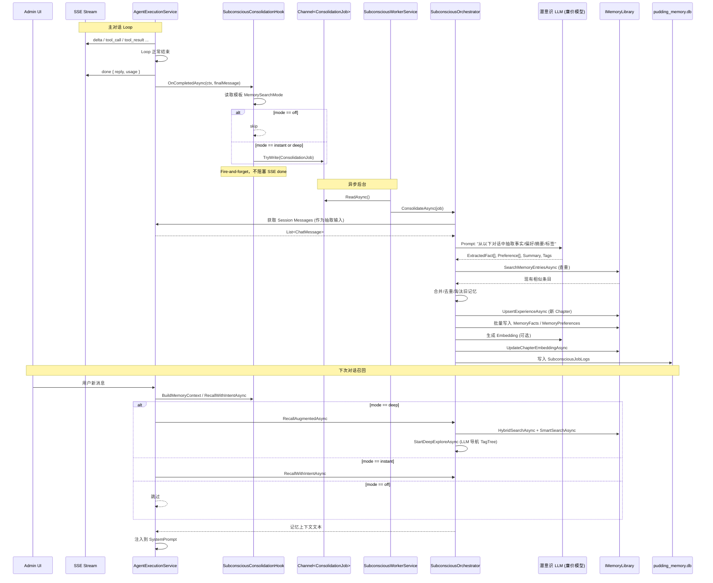

# 15 潜意识 LLM 子代理系统 (Subconscious LLM Sub-Agent System)

> 状态：**proposed**
> 作者：@architect (战略 ADR)
> 日期：2026-05-10
> 触发条件：A(新架构模式/抽象层) + B(跨3+模块不可逆数据变更) — 满足 3/5 条件
> 关联：[02PuddingCore](02PuddingCore.md)、[03PuddingRuntime](03PuddingRuntime.md)、[05PuddingPlatform](05PuddingPlatform.md)、[12记忆图书馆基础设施](12记忆图书馆基础设施.md)、[13记忆与会话数据层](13记忆与会话数据层.md)

---

## 1. 背景与现状评估

### 1.1 核心痛点

| 痛点 | 现象 | 根因 |
|------|------|------|
| 跨会话失忆 | B 会话不知 A 会话中用户的偏好/事实 | 对话完成后只有 `WriteBack`（正则 REMEMBER 标记）触发，LLM 自助标记率极低 |
| 无异步记忆整合 | `done` 后仅 `UpsertExperienceAsync`（终端记录），无 LLM 驱动的抽取/去重/合并 | 缺少"潜意识"后台处理层 |
| `MemorySearchMode` 闲置 | `off/instant/deep` 字段已在 Agent 模板中存在但从未被消费 | 调度逻辑未实现 |
| `MemoryLlm*` per-agent 配置闲置 | `MemoryLlmEndpoint/ApiKey/ModelId` 已在实体中存在，但运行时仍走全局 `DirectMemoryLlmClient` | 模板字段未被 Runtime 读取并路由 |
| `StartDeepExploreAsync` 空桩 | `IMemoryLibraryConvenience` 中定义为空桩 | 深度探索的 LLM 导航逻辑未实现 |
| 记忆图书馆无管理界面 | 所有 Book/Chapter/Pointer 数据只能通过 API/SQL 查看 | Admin UI 缺少记忆管理页面 |

### 1.2 现有资产（直接复用）

| 资产 | 位置 | 复用方式 |
|------|------|---------|
| `IMemoryLibrary` 全套 CRUD + FTS5 + Vector + Hybrid | `PuddingCore/Abstractions/IMemoryLibrary.cs` | 作为底层存储，不修改 |
| `IMemoryLibraryConvenience`（UpsertExperienceAsync / SmartSearchAsync） | `PuddingCore/Abstractions/IMemoryLibraryConvenience.cs` | 作为快捷写入入口 |
| `IMemoryEngine`（BuildMemoryContext / RecallWithIntentAsync / WriteBack） | `PuddingCore/Abstractions/IMemoryEngine.cs` | 作为召回查询入口，不改签名 |
| `MemorySearchMode` 字段（off/instant/deep） | `GlobalAgentTemplateEntity` / `WorkspaceAgentTemplateEntity` | 调度层消费 |
| `MemoryLlmEndpoint/ApiKey/ModelId` 字段 | 同上 | 潜意识 LLM 路由 |
| `IAgentLoopHook`（12 个生命周期扩展点） | `PuddingRuntime/Services/AgentLoop/IAgentLoopHook.cs` | `OnCompletedAsync` / `OnLoopCompleteAsync` 触发入队 |
| `ChatMessageEntity` / `Messages` 表 | `PuddingPlatform` / `PuddingMemoryEngine` | 对话全文作为抽取输入 |
| 现有 SSE 管线（`ExecuteStreamAsync` / `ExecuteAsync`） | `AgentExecutionService.cs` | 不侵入，仅通过 Hook 解耦 |

---

## 2. 战略方向决策

### ADR-015-A：编排层架在现有双轨之上，不推翻

**方案对比**

| 方案 | 优点 | 缺点 | 评分 |
|------|------|------|------|
| A. 新增 `ISubconsciousOrchestrator` 编排层，编排 `IMemoryEngine` + `IMemoryLibrary` | 不破坏现有 API、最小影响、清楚分层 | 多一层间接 | ✅ |
| B. 重写 `IMemoryEngine` 吞并所有新能力 | 接口统一 | 破坏现有调用方（ContextPipeline/SystemPromptBuilder/AgentExecutionService） | ❌ |
| C. 在 `IMemoryLibrary` 内部实现所有智能 | 实现集中 | 违反"存储基础设施不关心业务策略"的设计原则 | ❌ |

**决定**：方案 A。新增编排层，现有 `IMemoryEngine` / `IMemoryLibrary` 作为其下的双引擎。

```
┌──────────────────────────────────────────────────┐
│  ISubconsciousOrchestrator  (新增编排层)          │
│  · ConsolidateAsync()    异步记忆整合             │
│  · SummarizeSessionAsync()  会话摘要              │
│  · RecallAugmentedAsync()  增强召回（含深度探索） │
│  · GetMemoryDashboardAsync() 管理界面数据源       │
└──────┬───────────────────────┬───────────────────┘
       │ 依赖                   │ 依赖
┌──────▼──────────┐   ┌────────▼──────────────────┐
│ IMemoryEngine   │   │ IMemoryLibrary             │
│ (召回 + 写回)   │   │ (CRUD + FTS5 + Vector)     │
└─────────────────┘   └───────────────────────────┘
```

### ADR-015-B：Channel 队列 + BackgroundService 串行消费

**决定**：使用 `System.Threading.Channels.Channel<T>`（无界）作为内存队列，单一 `BackgroundService` 串行消费。

- **为什么 Channel 不是 BlockingCollection**：Channel 天然支持 `async/await`、内置背压（BoundedChannel）、低分配。
- **为什么串行不是并行**：记忆写入是 SQLite 单写瓶颈；同一 Workspace 的事实去重需要顺序处理。
- **为什么进程内队列**：单容器架构，无需持久化队列（重启丢失未处理任务是可接受的——下次对话会重新触发）。

```
[SSE done] → SubconsciousConsolidationHook.OnCompletedAsync()
    → _channel.Writer.TryWrite(ConsolidationJob)
         ↓
[SubconsciousWorkerService : BackgroundService]
    → await _channel.Reader.ReadAsync()
    → _orchestrator.ConsolidateAsync(job)
```

### ADR-015-C：三层 MemorySearchMode 调度

```
MemorySearchMode:
  off     → 完全跳过（既不召回也不写入）
  instant → 同步内联召回（RecallWithIntentAsync），但写入仍异步
  deep    → 异步召回 + 异步写入 + 深度探索（StartDeepExploreAsync 实现化）
```

| 阶段 | off | instant | deep |
|------|-----|---------|------|
| 系统提示词注入记忆 | ❌ | ✅ RecallWithIntentAsync | ✅ RecallAugmentedAsync |
| done 后异步抽取 | ❌ | ✅ ConsolidateAsync | ✅ ConsolidateAsync + SummarizeSessionAsync |
| 深度探索（LLM 导航 TagTree） | ❌ | ❌ | ✅ |

**默认值**：`deep`（与现有默认值一致）。

### ADR-015-D：潜意识 LLM 路由决策

**决定**：优先使用 Agent 模板的 `MemoryLlm*` 配置，fallback 到全局 `DirectMemoryLlmClient`。

```
路由优先级:
1. Agent 模板 MemoryLlmEndpoint/ApiKey/ModelId（均非空 → 构建专用 LlmConfig）
2. 全局 IRuntimeLlmClient（现有 DirectMemoryLlmClient，用于 embedding 等）
```

**模型选型建议**：潜意识任务（抽取/摘要/合并）不需要强推理能力，建议用廉价快速模型（如 GPT-4o-mini / Qwen-Turbo / GLM-4-Flash），降低 Token 成本 10x+。

---

## 3. 领域模型

### 3.1 新增接口：`ISubconsciousOrchestrator`

```csharp
// 位置: Source/PuddingCore/Abstractions/ISubconsciousOrchestrator.cs
public interface ISubconsciousOrchestrator
{
    /// <summary>
    /// 异步记忆整合：从刚完成的会话中抽取事实/偏好/摘要，合并去重，更新向量。
    /// 由 BackgroundService 串行消费，不阻塞主线程。
    /// </summary>
    Task ConsolidateAsync(ConsolidationJob job, CancellationToken ct = default);

    /// <summary>
    /// 会话摘要：将整个 Session 的 Messages 压缩为结构化摘要。
    /// </summary>
    Task<SessionSummary> SummarizeSessionAsync(
        string sessionId, string workspaceId, string agentId,
        CancellationToken ct = default);

    /// <summary>
    /// 增强召回：MemorySearchMode=deep 时使用，含异步深度探索结果。
    /// </summary>
    Task<string?> RecallAugmentedAsync(
        string userMessage, string workspaceId, string agentId,
        string? sessionId = null, int maxTokens = 2000,
        CancellationToken ct = default);

    /// <summary>
    /// 管理界面数据：返回记忆图书馆的仪表盘摘要。
    /// </summary>
    Task<MemoryDashboard> GetMemoryDashboardAsync(
        string workspaceId, CancellationToken ct = default);

    /// <summary>
    /// 管理界面：按条件搜索记忆条目（平铺列表/按 Tag 分组）。
    /// </summary>
    Task<MemorySearchResult> SearchMemoriesAsync(
        MemorySearchRequest request, CancellationToken ct = default);
}
```

### 3.2 新增 DTO

```csharp
// ConsolidationJob —— 入队任务
public record ConsolidationJob
{
    public required string SessionId { get; init; }
    public required string WorkspaceId { get; init; }
    public required string AgentId { get; init; }
    public required string AgentTemplateId { get; init; }
    public required string MemorySearchMode { get; init; }  // off|instant|deep
    public LlmConfig? MemoryLlmConfig { get; init; }        // per-agent 潜意识 LLM 配置
}

// SessionSummary —— 会话摘要
public record SessionSummary
{
    public required string SessionId { get; init; }
    public string? Title { get; init; }
    public List<ExtractedFact> Facts { get; init; } = [];
    public List<ExtractedPreference> Preferences { get; init; } = [];
    public string? OneLineSummary { get; init; }
    public List<string> SuggestedTags { get; init; } = [];
}

// ExtractedFact —— 抽取的事实
public record ExtractedFact
{
    public required string Statement { get; init; }
    public double Confidence { get; init; } = 0.8;
    public string? SourceMessageId { get; init; }
}

// ExtractedPreference —— 用户偏好
public record ExtractedPreference
{
    public required string Category { get; init; }   // "theme", "language", "tool", ...
    public required string Key { get; init; }
    public required string Value { get; init; }
    public string? SourceMessageId { get; init; }
}

// MemoryDashboard —— 仪表盘
public record MemoryDashboard
{
    public int TotalBooks { get; init; }
    public int TotalChapters { get; init; }
    public int TotalFacts { get; init; }
    public int TotalPointers { get; init; }
    public DateTimeOffset? LastConsolidationAt { get; init; }
    public List<TagTreeNode> TopTags { get; init; } = [];
}

// MemorySearchRequest / MemorySearchResult
public record MemorySearchRequest
{
    public string? WorkspaceId { get; init; }
    public string? Query { get; init; }            // FTS5 搜索词
    public string? TagFilter { get; init; }         // Tag 前缀过滤
    public string? SortBy { get; init; }            // "relevance" | "updated" | "importance"
    public int Page { get; init; } = 1;
    public int PageSize { get; init; } = 20;
}

public record MemorySearchResult
{
    public List<MemoryEntryDto> Items { get; init; } = [];
    public int TotalCount { get; init; }
    public int Page { get; init; }
}

public record MemoryEntryDto
{
    public string EntryId { get; init; }
    public string EntryType { get; init; }          // "fact" | "preference" | "chapter" | "pointer"
    public string Title { get; init; }
    public string Content { get; init; }
    public double Importance { get; init; }
    public string? SourceSessionId { get; init; }
    public List<string> Tags { get; init; } = [];
    public DateTimeOffset UpdatedAt { get; init; }
}
```

### 3.3 新增实体（SQLite）

```sql
-- 事实表（长期记忆的最小单元）
CREATE TABLE IF NOT EXISTS MemoryFacts (
    FactId        TEXT PRIMARY KEY,
    WorkspaceId   TEXT NOT NULL,
    Statement     TEXT NOT NULL,              -- 事实陈述
    Confidence    REAL NOT NULL DEFAULT 0.8,  -- 置信度 (0-1)
    Category      TEXT NOT NULL DEFAULT 'general', -- fact | preference | summary
    SourceSessionId TEXT,                     -- 来源会话
    SourceMessageId TEXT,                     -- 来源消息
    Tags          TEXT,                       -- JSON array
    Embedding     BLOB,                       -- 向量 (float32[] → bytes)
    Status        TEXT NOT NULL DEFAULT 'active', -- active | outdated | merged
    MergedInto    TEXT,                       -- 被合并到的 FactId
    AccessCount   INTEGER NOT NULL DEFAULT 0,
    CreatedAt     INTEGER NOT NULL,
    UpdatedAt     INTEGER NOT NULL
);

CREATE INDEX IX_MemoryFacts_Workspace_Category ON MemoryFacts(WorkspaceId, Category);
CREATE INDEX IX_MemoryFacts_SourceSession ON MemoryFacts(SourceSessionId);

-- 偏好表
CREATE TABLE IF NOT EXISTS MemoryPreferences (
    PreferenceId  TEXT PRIMARY KEY,
    WorkspaceId   TEXT NOT NULL,
    Category      TEXT NOT NULL,              -- theme / language / tool / workflow / ...
    Key           TEXT NOT NULL,
    Value         TEXT NOT NULL,
    SourceSessionId TEXT,
    SourceMessageId TEXT,
    CreatedAt     INTEGER NOT NULL,
    UpdatedAt     INTEGER NOT NULL,
    UNIQUE(WorkspaceId, Category, Key)
);

CREATE INDEX IX_MemoryPreferences_Workspace ON MemoryPreferences(WorkspaceId, Category);

-- 抽取任务日志（可观测性）
CREATE TABLE IF NOT EXISTS SubconsciousJobLogs (
    JobId         TEXT PRIMARY KEY,
    SessionId     TEXT NOT NULL,
    Status        TEXT NOT NULL DEFAULT 'pending', -- pending | running | completed | failed
    FactsExtracted INTEGER NOT NULL DEFAULT 0,
    FactsMerged   INTEGER NOT NULL DEFAULT 0,
    FactsDiscarded INTEGER NOT NULL DEFAULT 0,
    ChaptersCreated INTEGER NOT NULL DEFAULT 0,
    LlmTokensUsed INTEGER NOT NULL DEFAULT 0,
    LlmModelId    TEXT,
    ElapsedMs     INTEGER NOT NULL DEFAULT 0,
    ErrorMessage  TEXT,
    StartedAt     INTEGER,
    CompletedAt   INTEGER,
    CreatedAt     INTEGER NOT NULL
);
```

### 3.4 修改现有接口（最小侵入）

`IMemoryLibraryConvenience` 新增方法：

```csharp
// 向量写入（已存在于 IMemoryLibrary，此处暴露便捷版）
Task UpdateChapterEmbeddingAsync(string chapterId, float[] embedding, CancellationToken ct);

// 按 ID 删除 Fact/Preference（管理界面用）
Task<bool> DeleteMemoryFactAsync(string factId, CancellationToken ct);
Task<bool> DeleteMemoryPreferenceAsync(string preferenceId, CancellationToken ct);

// 更新重要性（管理界面用）
Task<bool> UpdateMemoryImportanceAsync(string entryId, string entryType, double importance, CancellationToken ct);
```

`IMemoryLibrary` 新增方法：

```csharp
// 分页按条件搜索记忆条目
Task<MemorySearchResult> SearchMemoryEntriesAsync(
    string workspaceId, string? query, string? tagFilter,
    string sortBy, int page, int pageSize, CancellationToken ct);

// 获取仪表盘数据
Task<MemoryDashboard> GetMemoryDashboardAsync(string workspaceId, CancellationToken ct);
```

---

## 4. 分层边界

```
┌──────────────────────────────────────────────────┐
│  PuddingPlatformAdmin (React 前端)               │
│  · Agent 潜意识配置面板                           │
│  · 记忆图书馆管理页面（浏览/搜索/编辑/删除）       │
│  · 自测试套件页面                                 │
└──────────────────────┬───────────────────────────┘
                       │ HTTP REST
┌──────────────────────▼───────────────────────────┐
│  PuddingPlatform (Controller)                    │
│  · MemoryManagementController  (新增)            │
│    GET  /api/memory/dashboard                    │
│    GET  /api/memory/entries?query=&tag=&page=    │
│    PUT  /api/memory/entries/{id}/importance      │
│    DELETE /api/memory/entries/{id}                │
│    POST /api/memory/entries                      │
│    POST /api/memory/self-test/run                │
│    GET  /api/memory/self-test/history            │
│  · AgentTemplate 现有 API (扩展 MemoryLlm* 字段)  │
└──────────────────────┬───────────────────────────┘
                       │ 进程内调用
┌──────────────────────▼───────────────────────────┐
│  PuddingRuntime                                  │
│  · SubconsciousConsolidationHook  (新增 Hook)     │
│    → OnCompletedAsync → Enqueue(ConsolidationJob) │
│  · SubconsciousWorkerService  (新增 BackgroundService) │
│    → 串行消费 Channel → Orchestrator              │
│  · AgentExecutionService (不改)                   │
└──────────────────────┬───────────────────────────┘
                       │ 依赖
┌──────────────────────▼───────────────────────────┐
│  PuddingCore (Abstractions)                      │
│  · ISubconsciousOrchestrator  (新增)              │
│  · ConsolidationJob / SessionSummary / DTOs (新增)│
│  · IMemoryLibrary / IMemoryEngine (不改)          │
└──────────────────────┬───────────────────────────┘
                       │ 实现
┌──────────────────────▼───────────────────────────┐
│  PuddingMemoryEngine                             │
│  · SubconsciousOrchestrator  (新增实现)           │
│  · MemoryLibrary 扩展 (Manage/Search entries)     │
│  · Schema/init_memory.sql 追加新表                │
│  · 不修改 MemoryEngine / MemoryLibrary 现有逻辑   │
└──────────────────────────────────────────────────┘
```

**依赖方向**：全部单向向下。上层不反向依赖下层实现。

---

## 5. 数据流图



---

## 6. API 契约变更

### 6.1 新增 REST Endpoints

| 方法 | 路径 | 说明 |
|------|------|------|
| `GET` | `/api/memory/dashboard?workspaceId=` | 记忆仪表盘摘要 |
| `GET` | `/api/memory/entries?workspaceId=&query=&tag=&sortBy=&page=&pageSize=` | 搜索记忆条目（平铺） |
| `GET` | `/api/memory/entries/{id}` | 获取单条记忆详情 |
| `PUT` | `/api/memory/entries/{id}` | 编辑记忆（标题/内容/重要性/标签） |
| `DELETE` | `/api/memory/entries/{id}` | 删除记忆条目 |
| `POST` | `/api/memory/entries` | 手动添加记忆 |
| `GET` | `/api/memory/tags?workspaceId=` | 获取 Tag 树（按分组视图） |
| `POST` | `/api/memory/self-test/run?workspaceId=` | 触发端到端记忆召回基准测试 |
| `GET` | `/api/memory/self-test/history?workspaceId=` | 获取历史测试结果 |
| `GET` | `/api/memory/job-logs?sessionId=` | 获取某 Session 的后台整合日志 |

### 6.2 扩展现有 API

`GET/PUT /api/global-agent-templates/{id}` 和 `GET/PUT /api/workspace-agent-templates/{id}` 现有字段 `MemoryLlmEndpoint/MemoryLlmApiKey/MemoryLlmModelId/MemorySearchMode` 已存在且可读写，无需变更。仅需在 Admin UI 暴露。

### 6.3 前端 services/platform/api.ts 新增

```typescript
// 记忆管理
export async function getMemoryDashboard(params: { workspaceId: string }) 
export async function searchMemoryEntries(params: MemorySearchParams)
export async function getMemoryEntry(id: string)
export async function updateMemoryEntry(id: string, data: Partial<MemoryEntryDto>)
export async function deleteMemoryEntry(id: string)
export async function createMemoryEntry(data: CreateMemoryEntryRequest)
export async function getMemoryTags(params: { workspaceId: string })
export async function runMemorySelfTest(params: { workspaceId: string })
export async function getMemorySelfTestHistory(params: { workspaceId: string })
export async function getSubconsciousJobLogs(params: { sessionId: string })
```

---

## 7. Admin UI 设计要点

### 7.1 Agent 潜意识配置（嵌入现有 Agent 模板编辑页）

在 `global-agent-template/index.tsx` 和 `workspace-agent-template/index.tsx` 中新增配置区块：

```
┌─ Agent 编辑 ─────────────────────────────────────┐
│ ...现有字段...                                     │
├─ 潜意识记忆配置 ──────────────────────────────────┤
│  记忆搜索模式:  [ off | instant | deep ] 下拉选择   │
│  记忆 LLM 端点: [________________] (留空=使用主模型) │
│  记忆 LLM Key:  [________________] 🔒              │
│  记忆 LLM 模型: [________________] (建议轻量模型)   │
│  💡 提示：潜意识模型建议使用 GPT-4o-mini / Qwen-Turbo │
└──────────────────────────────────────────────────┘
```

### 7.2 记忆图书馆管理页面（全新页面）

#### 页面路由：`/admin/memory-library`

#### 布局：左侧 Tag 树 + 右侧记忆列表

```
┌─ 记忆图书馆 ──────────────────────────────────────┐
│ 🔍 [搜索记忆...]  [按 Tag 分组 ▼] [重要性排序 ▼]  │
│                                                    │
│ ┌─ Tag 树 ────┐ ┌─ 记忆列表 ────────────────────┐ │
│ │ 📁 技术      │ │                                │ │
│ │  📁 数据库   │ │ 📄 用户偏好深色主题      ⭐0.9  │ │
│ │   📁 MySQL  │ │   来源: Session #abc123         │ │
│ │   📁 Redis  │ │   标签: 偏好, UI               │ │
│ │ 📁 前端      │ │   [编辑] [删除] [标记过时]      │ │
│ │ 📁 DevOps   │ │                                │ │
│ │ 📁 偏好      │ │ 📄 项目使用 PostgreSQL   ⭐0.7  │ │
│ │ 📁 项目      │ │   来源: Session #def456         │ │
│ │              │ │   标签: 项目, 数据库            │ │
│ │              │ │   [编辑] [删除]                 │ │
│ └──────────────┘ │                    第1页/共N页  │ │
│                  └────────────────────────────────┘ │
└────────────────────────────────────────────────────┘
```

#### 交互流程

| 操作 | 行为 |
|------|------|
| 搜索 | FTS5 全文搜索，高亮命中词 |
| 点击 Tag | 过滤该 Tag 及子 Tag 下的记忆 |
| 点击条目 | 展开详情：完整内容 + 来源会话链接 + Pointer 引用 |
| 编辑 | 内联编辑标题/内容/重要性，保存后即时刷新 |
| 删除 | 确认对话框，级联检查 Pointer 引用 |
| 手动添加 | 弹出表单：类型(fact/preference/chapter) + 标题 + 内容 + 标签 + 来源(可选) |
| 标记过时 | 设置 Status=outdated，不物理删除 |
| 按 Tag 分组 | 切换为树形分组视图，显示每 Tag 下条目计数 |

### 7.3 自测试套件页面

#### 页面路由：`/admin/memory-library/self-test`

```
┌─ 记忆系统自测试 ─────────────────────────────────┐
│                                                     │
│  📊 上次测试: 2026-05-10 14:30  Recall@5: 0.82     │
│                                                     │
│  ┌─ 测试用例集 ─────────────────────────────────┐  │
│  │ ✅ 事实召回      Recall@5=0.85  Precision=0.90│  │
│  │ ✅ 偏好召回      Recall@5=0.78  Precision=0.85│  │
│  │ ⚠️ 跨会话关联    Recall@5=0.62  Precision=0.70│  │
│  │ ✅ 去重准确性    重复率=3%                      │  │
│  └──────────────────────────────────────────────┘  │
│                                                     │
│  [▶ 运行完整测试]  [📋 查看历史记录]                │
│                                                     │
│  ┌─ 历史记录 ───────────────────────────────────┐  │
│  │ 05-10 14:30  Recall@5=0.82  ⬆️ +0.03         │  │
│  │ 05-09 10:15  Recall@5=0.79  —                │  │
│  │ 05-08 16:00  Recall@5=0.75  ⬇️ -0.05         │  │
│  └──────────────────────────────────────────────┘  │
└─────────────────────────────────────────────────────┘
```

#### 基准测试设计

| 测试用例 | 方法 | 指标 |
|---------|------|------|
| 事实召回 | 预设 20 条事实 → 发送对应问题 → 检查召回率 | Recall@5, Precision@5, MRR |
| 偏好召回 | 预设 10 条偏好 → 发送相关请求 → 检查是否利用 | Recall@3 |
| 跨会话关联 | 在 A 会话写入 ×5 → B 会话查询 → 检查跨会话命中 | Recall@5 |
| 去重准确性 | 写入 5 条相似事实 → 查询是否被合并 | 重复率（0-1，越低越好） |
| 淘汰准确性 | 写入冲突事实 → 查询旧事实是否被标记 outdated | 淘汰正确率 |

---

## 8. 实施路线图

### Phase 1: 基础设施（1-2 个迭代）
- [ ] `SubconsciousOrchestrator` 实现（stub 级别：`ConsolidateAsync` 空实现，仅写入 JobLog）
- [ ] `SubconsciousConsolidationHook` 实现（读取 MemorySearchMode → Channel 入队）
- [ ] `SubconsciousWorkerService` 实现（BackgroundService + Channel 消费循环）
- [ ] DI 注册（Program.cs）：`ISubconsciousOrchestrator` → Singleton, `SubconsciousWorkerService` → `AddHostedService`
- [ ] `MemoryFacts` / `MemoryPreferences` / `SubconsciousJobLogs` 表创建（`init_memory.sql` 追加）

### Phase 2: LLM 抽取管线（1 个迭代）
- [ ] `ConsolidateAsync` 完整实现：从 Session Messages 构造 Prompt → 调用潜意识 LLM → 解析 JSON 输出
- [ ] Prompt 模板设计（Few-shot：输入对话 → 输出 JSON 事实/偏好/摘要）
- [ ] 合并/去重逻辑（FTS5 相似度 + 简单规则）
- [ ] 淘汰逻辑：冲突事实标记 `Status=outdated`，新事实写入
- [ ] `SummarizeSessionAsync` 实现

### Phase 3: MemorySearchMode 调度 + 深度探索（1 个迭代）
- [ ] `ContextPipeline` 中按 `MemorySearchMode` 分支调用 `RecallWithIntentAsync` / `RecallAugmentedAsync`
- [ ] `StartDeepExploreAsync` 实现化（LLM 导航 TagTree）
- [ ] `MemoryLlm*` per-agent 路由（模板配置 → LlmConfig → Orchestrator 使用）

### Phase 4: API + Admin UI（1-2 个迭代）
- [ ] `MemoryManagementController` 全部端点实现
- [ ] Admin UI：Agent 潜意识配置区块（扩展现有模板编辑页）
- [ ] Admin UI：记忆图书馆管理页面（全新 `/admin/memory-library`）
- [ ] Admin UI：自测试套件页面

### Phase 5: 测试 + 验收（1 个迭代）
- [ ] `SubconsciousOrchestrator` 单元测试（Mock LLM 输出 → 验证写入/去重/淘汰）
- [ ] `SubconsciousWorkerService` 集成测试（投递 Job → 等待消费 → 验证数据库）
- [ ] 端到端测试：完整对话 → done → 等待 Job 完成 → 新会话召回验证
- [ ] 前端 E2E（Playwright）：记忆浏览/搜索/编辑/删除

---

## 9. 风险与缓解

| 风险 | 概率 | 影响 | 缓解措施 |
|------|------|------|---------|
| 潜意识 LLM 输出格式不稳定（JSON 解析失败） | 中 | 中 | 1) 使用 Structured Output / JSON Mode 强制格式 2) 失败重试 3 次（指数退避）3) 最终失败入死信表 + 告警 |
| 低成本模型抽取质量差（事实幻觉） | 中 | 中 | 1) Few-shot Prompt 优化 2) 要求 LLM 引用 `sourceMessageId` 绑定原文 3) 置信度 < 0.5 丢弃 |
| SQLite 写锁竞争（Worker 写入时主对话也在写消息） | 低 | 低 | 1) WAL 模式已启用，支持多读单写 2) 消息写入与记忆写入是不同表 3) 如出现瓶颈可加 `BoundedChannel(10)` 背压 |
| Channel 积压（Worker 处理慢于 Job 投递） | 低 | 中 | 1) `BoundedChannel(100)` 限制 2) 满时丢弃 `TryWrite` 返回 false（日志 Warn）3) 下次对话会重新触发 |
| MemoryLlm* per-agent 配置错误（Endpoint 不可达） | 低 | 高 | 1) 连接失败 fallback 到全局 `IRuntimeLlmClient` 2) SubconsciousJobLogs 记录错误 3) Admin UI 提供"测试连接"按钮 |
| 已有大量 Session 历史，首次 Worker 处理积压 | 中 | 低 | 1) Worker 按时间倒序处理新 Session 2) 历史 Session 通过一次性回填脚本处理 |

---

## 10. 验证方法

| 验证点 | 方法 | 通过标准 |
|--------|------|---------|
| 不影响现有 SSE 延迟 | 对比 `done` 事件发送时间（开关 Hook 前后） | 增量 < 1ms（Hook 仅 `TryWrite`） |
| 事实抽取质量 | 自测试套件 Recall@5 | ≥ 0.75 |
| 偏好抽取质量 | 自测试套件 Recall@3 | ≥ 0.80 |
| 去重有效性 | 自测试重复率 | ≤ 10% |
| 跨会话可用性 | 新会话中查询旧事实 | 召回 ≥ 80% |
| 无 SQLite 死锁 | 并发压测（对话 + Worker 同时写入） | 0 deadlock / 30min |
| Channel 无泄漏 | Worker 停止后 Channel 状态 | Completed |
| Admin UI 操作完整性 | Playwright E2E | CRUD + 搜索 + 手动添加 + 自测试全部 PASS |

---

## 附录 A：Prompt 模板设计（初版）

```
你是一个记忆提取助手。从以下对话中提取结构化记忆。

输出 JSON 格式：
{
  "facts": [
    { "statement": "...", "confidence": 0.9, "sourceMessageIndex": 3 }
  ],
  "preferences": [
    { "category": "theme|language|tool|workflow|other", "key": "...", "value": "...", "sourceMessageIndex": 1 }
  ],
  "sessionSummary": "一句话摘要",
  "suggestedTags": ["标签1", "标签2"]
}

规则：
1. 只提取用户明确陈述的事实/偏好，不要推断
2. 置信度 < 0.5 的不输出
3. 每个事实必须精确，不合并不同事实
4. 偏好必须是可操作的（能影响后续行为的）
5. 标签 2-5 个，用中文

对话：
{conversation}
```

## 附录 B：SubconsciousWorkerService 伪代码

```csharp
public sealed class SubconsciousWorkerService : BackgroundService
{
    private readonly Channel<ConsolidationJob> _channel;
    private readonly ISubconsciousOrchestrator _orchestrator;
    private readonly ILogger<SubconsciousWorkerService> _logger;

    public SubconsciousWorkerService(
        Channel<ConsolidationJob> channel,
        ISubconsciousOrchestrator orchestrator,
        ILogger<SubconsciousWorkerService> logger)
    {
        _channel = channel;
        _orchestrator = orchestrator;
        _logger = logger;
    }

    protected override async Task ExecuteAsync(CancellationToken stoppingToken)
    {
        await foreach (var job in _channel.Reader.ReadAllAsync(stoppingToken))
        {
            try
            {
                _logger.LogInformation("[Subconscious] Processing job Session={Session}", job.SessionId);
                await _orchestrator.ConsolidateAsync(job, stoppingToken);
            }
            catch (Exception ex)
            {
                _logger.LogError(ex, "[Subconscious] Job failed Session={Session}", job.SessionId);
            }
        }
    }
}
```

## 附录 C：DI 注册变更（Program.cs 追加）

```csharp
// ── 潜意识记忆系统 ──
var memoryChannel = Channel.CreateUnbounded<ConsolidationJob>(
    new UnboundedChannelOptions { SingleReader = true, SingleWriter = false });
builder.Services.AddSingleton(memoryChannel);
builder.Services.AddSingleton<ISubconsciousOrchestrator, SubconsciousOrchestrator>();
builder.Services.AddHostedService<SubconsciousWorkerService>();
builder.Services.AddSingleton<IAgentLoopHook, SubconsciousConsolidationHook>();
```
