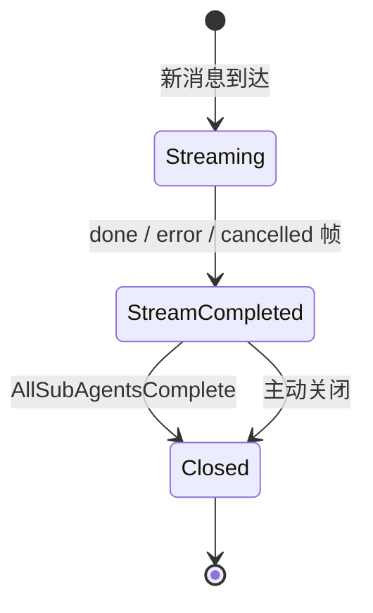
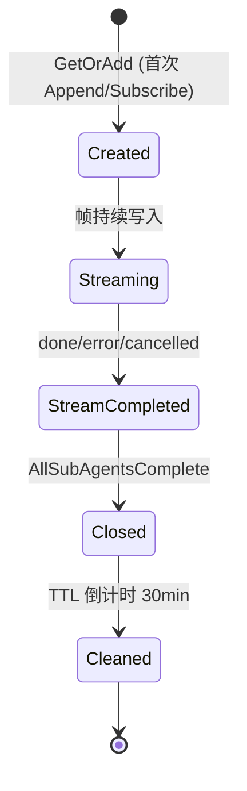

# 20 会话状态机与事件规范 ADR

> 状态：**proposed**
> 作者：@dev (ARCH-SESSION-001 & ARCH-SESSION-003)
> 日期：2026-05-18
> 触发条件：现有代码已有 3 态状态机实现，需正式文档化
> 关联：[16会话状态层与客户端解耦ADR](16会话状态层与客户端解耦ADR.md)、[14消息管线与终端代理与前端优化ADR](14消息管线与终端代理与前端优化ADR.md)、[15潜意识LLM子代理系统ADR](15潜意识LLM子代理系统ADR.md)

---

## 1. 会话状态机

### 1.1 状态转换图



### 1.2 状态定义

| 状态 | 含义 | 进入条件 | 退出条件 |
|------|------|---------|---------|
| `Streaming` | 主代理正在流式执行，持续产生 delta/thinking/tool_call 等帧 | 新消息到达（`AppendAsync` 首次写入） | 主代理发送 `done` / `error` / `cancelled` 帧 |
| `StreamCompleted` | 主代理流式已完成，异步子代理可能仍在运行。Channel 保持开放 | `MarkStreamCompleteAsync()` 被调用 | 所有子代理完成 → `MarkSessionClosedAsync()` |
| `Closed` | 会话完全结束，无更多事件将产生。Channel 进入 TTL 倒计时 | `MarkSessionClosedAsync()` 被调用 | —（终态） |

### 1.3 状态转换触发点

| 转换 | 触发代码 | 位置 |
|------|---------|------|
| → Streaming | `AppendAsync()` 首次调用 | `SessionStateManager.AppendAsync` |
| Streaming → StreamCompleted | `MarkStreamCompleteAsync()` | `AppendAsync` 检测到 done/error/cancelled 帧 |
| StreamCompleted → Closed | `MarkSessionClosedAsync()` | `TrackSubAgentCompleteAsync` 检测 runningCount==0 |

### 1.4 状态存储

- **内存**：`ConcurrentDictionary<string, SessionState> _sessionStates`（快速查询，Singleton 生命周期）
- 状态不持久化到 SQLite，重启后从事件日志推断

---

## 2. 事件帧序列规范

### 2.1 17 种事件类型

基于 `PuddingCode.Platform.SessionEventTypes` 定义。

#### 内容层（Content Layer）

| 事件类型 | 常量 | 含义 | 生命周期位置 |
|---------|------|------|------------|
| `delta` | `SessionEventTypes.Delta` | LLM 增量文本输出，累积构成最终回复 | Streaming 阶段，可多次出现 |
| `thinking` | `SessionEventTypes.Thinking` | LLM 推理/思考链（如 DeepSeek-R1 / Claude thinking） | Streaming 阶段，可多次出现 |

#### 工具层（Tool Layer）

| 事件类型 | 常量 | 含义 | 生命周期位置 |
|---------|------|------|------------|
| `tool_call` | `SessionEventTypes.ToolCall` | Agent 发起工具调用（含工具名、参数） | Streaming 阶段，可多次出现 |
| `tool_result` | `SessionEventTypes.ToolResult` | 工具调用返回结果 | Streaming 阶段，紧跟对应 tool_call |

#### 子代理层（Sub-Agent Layer）— ADR-016 新增

| 事件类型 | 常量 | 含义 | 生命周期位置 |
|---------|------|------|------------|
| `subagent.spawned` | `SessionEventTypes.SubAgentSpawned` | 异步子代理已创建（含 subAgentId, template, task） | Streaming/StreamCompleted 阶段 |
| `subagent.delta` | `SessionEventTypes.SubAgentDelta` | 同步子代理的文本增量 | Streaming 阶段 |
| `subagent.thinking` | `SessionEventTypes.SubAgentThinking` | 同步子代理的思维链 | Streaming 阶段 |
| `subagent.tool_call` | `SessionEventTypes.SubAgentToolCall` | 同步子代理的工具调用 | Streaming 阶段 |
| `subagent.tool_result` | `SessionEventTypes.SubAgentToolResult` | 同步子代理的工具结果 | Streaming 阶段 |
| `subagent.completed` | `SessionEventTypes.SubAgentCompleted` | 任意子代理完成（同步/异步统一，含 subAgentId, success, reply, error） | Streaming/StreamCompleted 阶段 |

#### 生命周期层（Lifecycle Layer）

| 事件类型 | 常量 | 含义 | 生命周期位置 |
|---------|------|------|------------|
| `done` | `SessionEventTypes.Done` | 主代理流式执行正常结束 | 触发 Streaming → StreamCompleted |
| `error` | `SessionEventTypes.Error` | 主代理执行异常终止 | 触发 Streaming → StreamCompleted |
| `cancelled` | `SessionEventTypes.Cancelled` | 用户主动取消 | 触发 Streaming → StreamCompleted |
| `session.closed` | `SessionEventTypes.SessionClosed` | 会话完全关闭（所有子代理完成，无更多事件） | StreamCompleted → Closed |

#### 元数据层（Metadata Layer）

| 事件类型 | 常量 | 含义 | 生命周期位置 |
|---------|------|------|------------|
| `metadata` | `SessionEventTypes.Metadata` | 会话元数据（如会话 ID、模型信息） | Streaming 早期，通常最先出现 |
| `usage` | `SessionEventTypes.Usage` | Token 用量统计 | Streaming 末尾，done 之前或紧随其后 |

#### 系统通知层（System Notification Layer）— ADR-016 新增

| 事件类型 | 常量 | 含义 | 生命周期位置 |
|---------|------|------|------------|
| `notification` | `SessionEventTypes.Notification` | 系统级通知，注入 Timeline 但不作为对话消息 | 任意阶段 |

### 2.2 典型帧序列（主代理 + 同步工具调用）

```
metadata → delta* → [thinking → tool_call → tool_result]* → usage → done
```

其中 `*` 表示可重复（零次或多次），`[]` 表示可选组。

### 2.3 带异步子代理的完整序列

```
metadata → delta* → [thinking → tool_call → tool_result]* → subagent.spawned →
  usage → done →
  [subagent.delta* → subagent.completed]* →
  session.closed
```

注意：
- `subagent.spawned` 可能在 `done` 之前出现（子代理在流式过程中被创建）
- `subagent.completed` 一定在 `done` 之后出现（异步子代理在后台完成）
- `session.closed` 在所有子代理完成后才出现

### 2.4 序列号约束

- 序列号在单会话内严格单调递增
- 不同事件类型共享同一序列号空间
- 前端以序列号为游标进行增量/历史加载

### 2.5 数据格式

所有帧的 `Data` 字段为 JSON 字符串（UTF-8）。各事件类型的 Data payload 结构见各子 ADR 定义。

---

## 3. 子代理状态追踪

### 3.1 `session_sub_agents` 表结构

| 列 | 类型 | 说明 |
|----|------|------|
| `id` | INTEGER PK | 自动递增主键 |
| `parent_session_id` | TEXT(64) | 父会话 ID |
| `parent_agent_id` | TEXT(64) | 父代理 ID（可为空） |
| `sub_session_id` | TEXT(64) | 子会话 ID |
| `status` | TEXT | running / completed / failed / cancelled / timed_out |
| `template_id` | TEXT | 子代理模板 ID |
| `model_id` | TEXT | 使用的模型 ID |
| `task_summary` | TEXT | 任务描述摘要 |
| `spawned_at` | TEXT | 创建时间（ISO 8601） |
| `completed_at` | TEXT | 完成时间（ISO 8601，可为空） |
| `success` | INTEGER | 是否成功（0/1，可为空） |
| `reply_summary` | TEXT | 回复摘要（前 200 字符） |
| `error_summary` | TEXT | 错误摘要（前 500 字符） |

### 3.2 追踪流程

```
TrackSubAgentStartAsync(parentSessionId, info)
  → INSERT INTO session_sub_agents (status='running')

子代理执行中...

TrackSubAgentCompleteAsync(subSessionId, result)
  → UPDATE session_sub_agents SET status='completed'/'failed', completed_at=...
  → PushWorkspaceNotificationAsync (通知所有观察者)
  → 检查 runningCount == 0 ? MarkSessionClosedAsync
```

### 3.3 关键约束

- **幂等性**：`TrackSubAgentCompleteAsync` 对已处于终态（completed/failed/cancelled/timed_out）的记录不重复更新
- **防重复终止态**：已处于终态的子代理忽略后续 complete 调用
- **会话关闭条件**：仅当 `GetRunningSubAgentCountAsync` 返回 0 时触发 `MarkSessionClosedAsync`

---

## 4. Channel 生命周期

### 4.1 参数

| 参数 | 值 | 说明 |
|------|-----|------|
| 容量 | 256 | `BoundedChannelOptions(256)` |
| 溢出策略 | `DropOldest` | 丢弃最旧帧，保护最新帧 |
| TTL | 30 分钟 | `ChannelTtl = TimeSpan.FromMinutes(30)` |

### 4.2 生命周期图



### 4.3 设计原理

- **不随 HTTP 连接销毁**：Channel 由 `ConcurrentDictionary` 持有，与 HTTP 请求生命周期完全解耦
- **done 不关闭 Channel**：`done` 仅标记 `StreamCompleted`，Channel 保持开放以接收异步子代理事件
- **TTL 宽松**：30 分钟窗口允许前端重连后继续接收事件，避免因短暂断网丢失 `session.closed`
- **Closed 后仍可订阅**：`Subscribe()` 对 Closed 状态返回 null，但前端仍可通过 REST API 加载历史

---

## 5. 会话恢复与重放（ARCH-SESSION-003）

### 5.1 设计动机

会话事件日志采用 append-only 不可变设计，天然支持从任意序列号重建完整会话状态。前端在以下场景需要重放能力：

- 页面刷新后恢复当前选中会话的完整 Timeline
- 从通知点击进入已完成会话
- 离线后重连，补齐错过的所有事件

### 5.2 API 端点

```
GET /api/sessions/{sessionId}/replay?from={seq}&limit={n}
```

**参数**：

| 参数 | 类型 | 必填 | 默认值 | 说明 |
|------|------|------|-------|------|
| `from` | long | 否 | 0 | 起始序列号（含），0 表示从头开始 |
| `limit` | int | 否 | 200 | 每页最大事件数（1-500） |

**响应** — `SessionReplayResult`：

```json
{
  "sessionId": "sess_abc123",
  "currentState": "Closed",
  "events": [ { "sequenceNum": 1, "eventType": "metadata", "data": "{...}", "recordedAt": "..." } ],
  "totalEventCount": 42,
  "hasMore": false,
  "subAgents": [ { "subSessionId": "...", "status": "completed", ... } ]
}
```

### 5.3 `SessionReplayResult` DTO

```csharp
public sealed record SessionReplayResult
{
    public required string SessionId { get; init; }
    public required string CurrentState { get; init; }
    public required IReadOnlyList<SessionEventEntry> Events { get; init; }
    public long TotalEventCount { get; init; }
    public bool HasMore { get; init; }
    public required IReadOnlyList<SubAgentStatus> SubAgents { get; init; }
}
```

### 5.4 与 `GetEventsAsync` 的区别

| 特性 | `GET /events` | `GET /replay` |
|------|-------------|-------------|
| 用途 | 分页加载历史（向前翻页） | 完整状态重建（从指定点开始） |
| 方向 | 从 fromSeq 向前（≤） | 从 fromSeq 向后（≥） |
| 包含子代理 | 否 | 是 |
| 包含会话状态 | 否 | 是 |
| 返回顺序 | 升序（UI 渲染用） | 升序（时序重建用） |

### 5.5 实现要点

- `ReplaySessionAsync` 从 SQLite 加载 `SequenceNum >= fromSequenceNum` 的事件（升序）
- 同时查询 `session_sub_agents` 表获取子代理状态
- 支持 `CancellationToken` 用于超时控制
- `limit` 参数控制单次返回事件数，`hasMore` 指示是否需要继续加载

---

## 6. 双写一致性策略（ARCH-SESSION-002 & ARCH-SESSION-004）

### 6.1 写入顺序

`SessionStateManager.AppendAsync` 采用以下双写顺序：

```
SQLite (主存储) → JSONL (备份) → Channel (实时推送)
```

1. **先写 SQLite** — 作为主存储，对查询（历史加载、分页、重放）最重要
2. **再写 JSONL** — fire-and-forget 文本备份，失败不阻断主路径
3. **推送 Channel** — 实时通知订阅客户端

### 6.2 失败策略

| 阶段 | 失败行为 | 原因 |
|------|---------|------|
| SQLite 写入失败 | 抛异常，**不尝试** JSONL | SQLite 是权威数据源，写入失败则整个 Append 失败 |
| JSONL 写入失败 | 记录 **Warning** 日志，不影响 SQLite 侧成功 | JSONL 仅作为备份/审计用途，失败不应影响业务 |
| Channel 推送失败 | 静默丢弃（`DropOldest`） | 客户端可通过 REST 历史加载补齐 |

### 6.3 恢复指南

| 场景 | 处理方式 |
|------|---------|
| JSONL 缺失（SQLite 多于 JSONL） | JSONL 缺失导致 context hydration 降级 — 用 SQLite 重建即可，不自动回填 JSONL |
| JSONL 多于 SQLite | JSONL 存在多余行 — **不自动修正**，需人工排查是否来自并发写入或历史残留 |
| JSONL 文件损坏 | 不影响系统运行；下次写入自动创建新行 |

### 6.4 一致性检查 API

```
GET /api/sessions/{sessionId}/consistency
```

返回 `SessionConsistencyReport`：

```json
{
  "sessionId": "sess_abc123",
  "sqliteEventCount": 42,
  "jsonlLineCount": 41,
  "isConsistent": false,
  "difference": 1,
  "details": "SQLite 比 JSONL 多 1 条事件（JSONL 写入可能丢失）"
}
```

实现：`SessionStateManager.CheckConsistencyAsync` — 比较 `session_event_log` 表 `COUNT(*)` 与 JSONL 文件行数。

### 6.5 Trace 聚合 API

```
GET /api/sessions/{sessionId}/trace-report
```

返回 `SessionTraceReport`，用于运维诊断和性能分析：

```json
{
  "sessionId": "sess_abc123",
  "traceIds": ["trace_001", "trace_002"],
  "componentTimeline": [
    { "component": "llm_gateway", "operation": "chat_completion", "status": "succeeded", "startedAt": "...", "durationMs": null }
  ],
  "llmCalls": [
    { "model": "deepseek-v3", "endpoint": "https://...", "inputTokens": 1500, "outputTokens": 300, "durationMs": 1200 }
  ],
  "toolCalls": [
    { "toolName": "read_file", "success": true, "durationMs": 45 }
  ],
  "subAgents": [
    { "subAgentId": "sub_001", "status": "completed", "durationMs": 5000, "parentExecutionId": "exec_001" }
  ],
  "totalDurationMs": 8500,
  "totalTokens": 1800
}
```

**聚合逻辑**（`SessionStateManager.GetTraceReportAsync`）：

- `traceIds` — 该会话 `session_event_log` 中所有不重复的 `trace_id`
- `componentTimeline` — 按 `component` 字段分组的所有事件时序
- `llmCalls` — 从 `event_type = 'usage'` 的事件中解析 token 用量和模型信息
- `toolCalls` — 配对 `tool_call` 和 `tool_result` 事件，计算耗时
- `subAgents` — 配对 `subagent.spawned` 和 `subagent.completed` 事件，构建父子调用关系
- `totalTokens` — 所有 `usage` 事件的 `inputTokens + outputTokens` 总和
