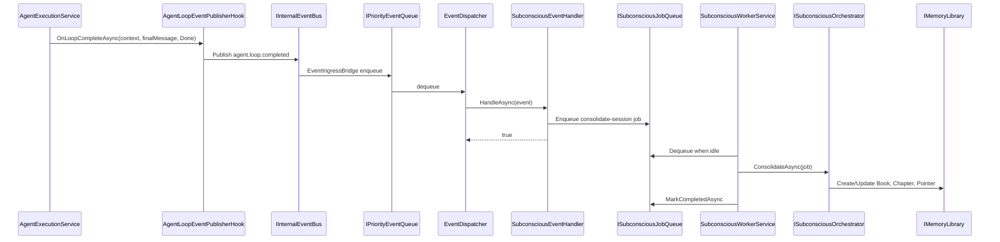

# 28 ADR-027 Hook 事件与潜意识学习闭环方案

> 状态：**proposed**
> 日期：2026-05-20
> 范围：Agent Loop Hook、统一事件系统、潜意识 LLM、记忆图书馆、后续 Skill 维护提案
> 前置：[10事件系统与事件总线](10事件系统与事件总线.md)、[15潜意识LLM子代理系统ADR](15潜意识LLM子代理系统ADR.md)、[20会话状态机与事件规范ADR](20会话状态机与事件规范ADR.md)、[task41-hook-system](../Tasks/task41-hook-system.md)、[task38-subconscious-memory-engine](../Tasks/task38-subconscious-memory-engine.md)

---

## 1. 背景

当前系统已经具备三组可复用基础设施：

1. Agent Loop 生命周期 Hook：`IAgentLoopHook` 已提供 `OnLoopCompleteAsync`、`OnCompletedAsync`、`OnToolCallAsync`、`OnToolResultAsync` 等扩展点。
2. 统一事件系统：`IInternalEventBus`、`EventIngressBridge`、`IPriorityEventQueue`、`EventDispatcher`、`IEventHandler` 已形成“纯管道”边界。
3. 潜意识记忆系统：`ISubconsciousOrchestrator`、`SubconsciousWorkerService`、`IMemoryLibrary`、`SubconsciousJobLogs` 已具备后台学习与归档能力。

但现在潜意识整合仍主要由 `SubconsciousConsolidationHook` 直接写入 `Channel<ConsolidationJob>`。这使 Hook 与潜意识业务耦合，绕开了事件队列、重试、死信、诊断和订阅治理。后续如果 Skill 系统也要由潜意识维护，继续让 Hook 直接调用业务队列会导致 Hook 层膨胀。

本 ADR 决定把 Hook 系统定位为**生命周期事件生产层**：Hook 只把 Agent 生命周期节点转换成标准内部事件；事件系统负责持久排队与派发；潜意识学习作为事件消费者接入。

---

## 2. 核心决策

### ADR-027-A：Hook 不直接编排潜意识 LLM

**决定**：`IAgentLoopHook` 只负责观察生命周期并发布 `InternalEvent`。它不得直接调用 `ISubconsciousOrchestrator`，也不得直接写入潜意识长任务队列。

允许的 Hook 行为：

```csharp
public interface IAgentLoopHook
{
    Task OnCompletedAsync(AgentLoopContext context, string finalMessage, CancellationToken ct = default);
    Task OnLoopCompleteAsync(AgentLoopContext context, string finalMessage, AgentLoopStopReason stopReason, CancellationToken ct = default);
}
```

Hook 内部只做：

```text
AgentLoopContext + finalMessage + stopReason
  -> AgentLoopCompletedPayload
  -> InternalEvent(type="agent.loop.completed")
  -> IInternalEventBus.PublishAsync()
```

禁止：

- Hook 直接调用潜意识 LLM。
- Hook 直接修改记忆图书馆。
- Hook 直接维护 Skill 文件。
- Hook 阻塞 SSE `done` 或主对话完成路径。

### ADR-027-B：事件系统保持纯管道

**决定**：事件系统继续保持“来源不可知、消费者不可知”的纯管道。潜意识学习、Skill 维护、审计归档都通过 `IEventHandler` 接入。

标准链路：

```text
Agent Loop done
  -> AgentLoopEventPublisherHook
  -> IInternalEventBus.PublishAsync()
  -> EventIngressBridge
  -> IEventPreprocessor
  -> IPriorityEventQueue
  -> EventDispatcher
  -> IEventHandler
```

事件系统只知道：

```csharp
public interface IEventHandler
{
    string EventTypePattern { get; }
    Task<bool> HandleAsync(InternalEvent evt, CancellationToken ct);
    bool SupportsInterruption { get; }
}
```

它不依赖 `ISubconsciousOrchestrator`、`IMemoryLibrary`、`AgentExecutionService` 或 Skill 系统实现。

### ADR-027-C：潜意识事件处理器只入 Job 队列，不执行长 LLM

**决定**：新增 `SubconsciousEventHandler : IEventHandler`，订阅 `agent.loop.completed` 和 `memory.consolidation.requested`，但 Handler 只创建潜意识 Job 并快速返回。

```csharp
public sealed class SubconsciousEventHandler : IEventHandler
{
    public string EventTypePattern => "agent.loop.completed";
    public bool SupportsInterruption => false;

    public async Task<bool> HandleAsync(InternalEvent evt, CancellationToken ct)
    {
        var payload = evt.PayloadAs<AgentLoopCompletedPayload>();
        var job = SubconsciousJob.FromLoopCompleted(evt, payload);
        await _jobQueue.EnqueueAsync(job, ct);
        return true;
    }
}
```

原因：

- EventDispatcher 不应被单个 LLM 任务长时间占用。
- 事件队列负责可靠投递；潜意识 Job 队列负责长任务调度。
- Worker 可根据系统空闲程度、workspace 限流、模型资源决定何时执行。

### ADR-027-D：潜意识 Job 必须持久化

**决定**：用持久化 `SubconsciousJobs` 替代纯内存 `Channel<ConsolidationJob>` 作为主路径。`Channel` 可作为兼容或进程内唤醒优化，但不能作为唯一事实来源。

新增抽象：

```csharp
public interface ISubconsciousJobQueue
{
    Task<string> EnqueueAsync(SubconsciousJob job, CancellationToken ct = default);
    Task<SubconsciousJob?> DequeueAsync(string workerId, CancellationToken ct = default);
    Task MarkCompletedAsync(string jobId, SubconsciousJobResult result, CancellationToken ct = default);
    Task MarkRetryAsync(string jobId, string reason, TimeSpan delay, CancellationToken ct = default);
    Task MarkDeadLetterAsync(string jobId, string reason, CancellationToken ct = default);
    Task<SubconsciousQueueStats> GetStatsAsync(string? workspaceId = null, CancellationToken ct = default);
}
```

状态机：

```text
pending -> leased -> completed
pending -> leased -> retrying -> pending
pending -> leased -> dead_letter
pending -> skipped
```

幂等键：

```text
workspaceId + sessionId + agentId + messageRangeHash + jobType
```

同一幂等键下，未终态 Job 不重复入队。

### ADR-027-E：忙碌时积压，空闲时学习

**决定**：潜意识 Worker 采用 idle-aware 调度，不与主对话争抢关键资源。

新增空闲评估抽象：

```csharp
public interface IRuntimeIdleSignal
{
    Task<RuntimeIdleSnapshot> GetSnapshotAsync(CancellationToken ct = default);
}

public sealed record RuntimeIdleSnapshot
{
    public required int ActiveSessions { get; init; }
    public required int ActiveLlmCalls { get; init; }
    public required int PendingUrgentEvents { get; init; }
    public required int PendingImportantEvents { get; init; }
    public required double CpuLoadHint { get; init; }
    public required bool IsIdleEnoughForBackgroundLlm { get; init; }
}
```

Worker 调度规则：

- `PendingUrgentEvents > 0`：暂停潜意识 LLM。
- `ActiveLlmCalls >= configuredLimit`：暂停潜意识 LLM。
- 同一 Workspace 同时最多 1 个潜意识 Job。
- `memory.consolidation.requested` 默认 `Normal` 优先级。
- 用户显式“整理记忆”可升为 `Important`，但仍不打断主任务。

### ADR-027-F：记忆归档必须保留来源指针

**决定**：潜意识学习结果必须写入可回溯来源。

每条 Fact / Preference / Chapter 至少记录：

```text
workspaceId
sessionId
agentId
sourceEventId
sourceMessageRange
sourcePayloadHash
confidence
importance
tags
createdAtUtc
```

写入 `IMemoryLibrary` 时必须创建 Pointer：

```csharp
await memoryLibrary.CreatePointerAsync(
    chapterId,
    targetType: "session",
    targetId: payload.SessionId,
    label: "source-session",
    description: $"Extracted from agent.loop.completed event {evt.EventId}",
    ct);
```

### ADR-027-G：Skill 维护先产生提案，不直接写 Skill

**决定**：Skill 系统上线后，潜意识 LLM 不直接修改 Skill 文件。它只能产生 `SkillMaintenanceProposal`。

```csharp
public sealed record SkillMaintenanceProposalPayload
{
    public required string WorkspaceId { get; init; }
    public required string AgentId { get; init; }
    public required string SourceSessionId { get; init; }
    public required string ProposalType { get; init; } // create | update | deprecate | merge
    public required string SkillName { get; init; }
    public required string Rationale { get; init; }
    public required string SuggestedPatch { get; init; }
    public double Confidence { get; init; }
}
```

后续由权限系统、审计系统、人工确认或策略门控决定是否落地。

### ADR-027-H：ZeroMQ 不作为 V1 主事件系统

**决定**：V1 不引入 ZeroMQ 替代现有事件系统。保留抽象边界，未来如需跨进程低延迟事件转发，再实现 `IEventTransport` 适配器。

原因：

- 当前核心需求是可靠投递、持久化、重试、死信、审计、重放。
- ZeroMQ 擅长低延迟消息传输，但不提供持久队列语义。
- 现有 `IPriorityEventQueue` 已承载事件可靠性，不应被传输层取代。

未来扩展点：

```csharp
public interface IEventTransport
{
    Task PublishAsync(InternalEvent evt, CancellationToken ct = default);
    Task SubscribeAsync(string pattern, Func<InternalEvent, Task> handler, CancellationToken ct = default);
}
```

`ZeroMqEventTransport` 只能作为跨进程/跨节点传输层，不能绕开本地持久队列和诊断日志。

---

## 3. 事件契约

### 3.1 `agent.loop.completed`

触发点：`IAgentLoopHook.OnLoopCompleteAsync`。

优先级：`Normal`。

隔离模式：`Isolated`。

Payload：

```csharp
public sealed record AgentLoopCompletedPayload
{
    public required string SessionId { get; init; }
    public required string WorkspaceId { get; init; }
    public required string AgentId { get; init; }
    public required string AgentTemplateId { get; init; }
    public required string UserMessage { get; init; }
    public required string FinalMessage { get; init; }
    public required string StopReason { get; init; }
    public int MaxRounds { get; init; }
    public string? MessageRangeStartId { get; init; }
    public string? MessageRangeEndId { get; init; }
    public string? ConversationHash { get; init; }
    public DateTime CompletedAtUtc { get; init; } = DateTime.UtcNow;
}
```

使用方：

- `SubconsciousEventHandler`：创建 `consolidate-session` Job。
- `AuditEventHandler`：写审计摘要。
- 后续 `SkillProposalEventHandler`：按策略创建 Skill 维护提案。

### 3.2 `memory.consolidation.requested`

触发点：

- 用户手动要求整理记忆。
- 管理界面批量回填历史会话。
- 其他系统根据策略发起深度整理。

Payload：

```csharp
public sealed record MemoryConsolidationRequestedPayload
{
    public required string WorkspaceId { get; init; }
    public required string SessionId { get; init; }
    public required string AgentId { get; init; }
    public string? AgentTemplateId { get; init; }
    public string Mode { get; init; } = "deep"; // instant | deep
    public string RequestedBy { get; init; } = "system";
    public bool Force { get; init; }
}
```

### 3.3 `skill.maintenance.proposed`

触发点：潜意识 Job 完成后发现稳定、可复用的技能化知识。

优先级：`Normal`。

处理策略：只进入提案表，不自动修改 Skill。

---

## 4. 新增代码边界

### 4.1 Hook 发布器

新增文件：

```text
Source/PuddingRuntime/Services/AgentLoop/AgentLoopEventPublisherHook.cs
Source/PuddingCore/Models/AgentLifecycleEventPayloads.cs
```

职责：

- 监听 Agent Loop 生命周期。
- 构造 `AgentLoopCompletedPayload`。
- 发布 `InternalEvent`。
- 失败只记录日志，不影响主会话完成。

### 4.2 潜意识事件 Handler

新增文件：

```text
Source/PuddingRuntime/Services/Events/SubconsciousEventHandler.cs
```

职责：

- 订阅 `agent.loop.completed` 和 `memory.consolidation.requested`。
- 做 payload 解析、幂等键生成、Job 入队。
- 快速返回，不执行 LLM。

### 4.3 潜意识 Job 队列

新增文件：

```text
Source/PuddingCore/Abstractions/ISubconsciousJobQueue.cs
Source/PuddingCore/Models/SubconsciousJobModels.cs
Source/PuddingMemoryEngine/Entities/SubconsciousJobEntity.cs
Source/PuddingMemoryEngine/Services/SubconsciousJobQueue.cs
```

职责：

- 持久化 Job。
- lease / retry / dead_letter。
- workspace 串行保护。
- 幂等入队。

### 4.4 Worker 改造

修改文件：

```text
Source/PuddingRuntime/Services/Background/SubconsciousWorkerService.cs
```

职责变化：

- 从 `Channel<ConsolidationJob>` 消费改为从 `ISubconsciousJobQueue` lease。
- 执行前查询 `IRuntimeIdleSignal`。
- 通过 `ISubconsciousOrchestrator.ConsolidateAsync` 做实际学习。
- 完成后写 Job 结果与 `SubconsciousJobLogs`。

过渡策略：

- 保留 Channel 构造注册一个版本，用于兼容旧代码。
- 新路径稳定后移除 `SubconsciousConsolidationHook` 直接入 Channel。

---

## 5. 数据库设计

新增表：`SubconsciousJobs`。

```sql
CREATE TABLE IF NOT EXISTS SubconsciousJobs (
    JobId TEXT PRIMARY KEY,
    IdempotencyKey TEXT NOT NULL,
    JobType TEXT NOT NULL,
    WorkspaceId TEXT NOT NULL,
    SessionId TEXT NOT NULL,
    AgentId TEXT NOT NULL,
    AgentTemplateId TEXT,
    SourceEventId TEXT,
    SourceEventType TEXT,
    PayloadJson TEXT NOT NULL,
    Priority INTEGER NOT NULL DEFAULT 0,
    Status TEXT NOT NULL DEFAULT 'pending',
    LeaseOwner TEXT,
    LeaseUntilUtc TEXT,
    RetryCount INTEGER NOT NULL DEFAULT 0,
    MaxRetries INTEGER NOT NULL DEFAULT 3,
    AvailableAtUtc TEXT NOT NULL,
    StartedAtUtc TEXT,
    CompletedAtUtc TEXT,
    CreatedAtUtc TEXT NOT NULL,
    UpdatedAtUtc TEXT NOT NULL,
    ErrorMessage TEXT,
    ResultJson TEXT,
    UNIQUE(IdempotencyKey)
);

CREATE INDEX IF NOT EXISTS IX_SubconsciousJobs_Dequeue
    ON SubconsciousJobs(Status, Priority DESC, AvailableAtUtc, CreatedAtUtc);

CREATE INDEX IF NOT EXISTS IX_SubconsciousJobs_WorkspaceStatus
    ON SubconsciousJobs(WorkspaceId, Status, CreatedAtUtc);

CREATE INDEX IF NOT EXISTS IX_SubconsciousJobs_Session
    ON SubconsciousJobs(SessionId);
```

---

## 6. 运行时流程

### 6.1 正常 done 后学习



### 6.2 忙碌积压

```text
主对话忙碌
  -> Hook 仍发布事件
  -> EventQueue 正常完成派发
  -> SubconsciousJobs pending
  -> Worker 看到 IsIdleEnoughForBackgroundLlm=false
  -> 暂停 lease
  -> 空闲后继续
```

---

## 7. 错误处理

| 错误 | 处理 |
|------|------|
| Hook 发布失败 | 记录 warning，不影响主会话完成 |
| 事件重复发布 | EventQueue / SubconsciousJobs 幂等去重 |
| Payload 解析失败 | Handler 返回 false，触发事件重试；超限后死信 |
| Job 执行 LLM 超时 | Job retry，指数退避 |
| 记忆写入失败 | Job retry；保留 source event 和 payload |
| 重复学习 | 幂等键阻止未终态重复；终态后手动 Force 可重跑 |
| Skill 提案质量低 | 只写 proposal，不自动应用 |

---

## 8. 验收标准

1. Agent 完成 done 后，系统发布 `agent.loop.completed` 事件。
2. Hook 发布事件失败不会影响 SSE `done`。
3. `agent.loop.completed` 经 `IPriorityEventQueue` 入队和出队。
4. `SubconsciousEventHandler` 能把事件转换为持久化 `SubconsciousJobs`。
5. 同一 `sessionId + messageRange + jobType` 不重复入队。
6. `SubconsciousWorkerService` 在空闲时消费 Job，忙碌时积压。
7. 潜意识整合结果写入记忆图书馆，并保留 session/source event 指针。
8. Job 失败支持 retry 和 dead_letter。
9. 诊断接口能看到事件队列和潜意识 Job 队列状态。
10. ZeroMQ 不进入 V1 主路径，代码边界允许未来添加 transport adapter。

---

## 9. 不做

- V1 不实现 Command / HTTP / Agent 类型外部 Hook。
- V1 不引入 ZeroMQ。
- V1 不自动修改 Skill 文件。
- V1 不让 EventDispatcher 直接执行长 LLM 任务。
- V1 不做跨节点事件分发。

