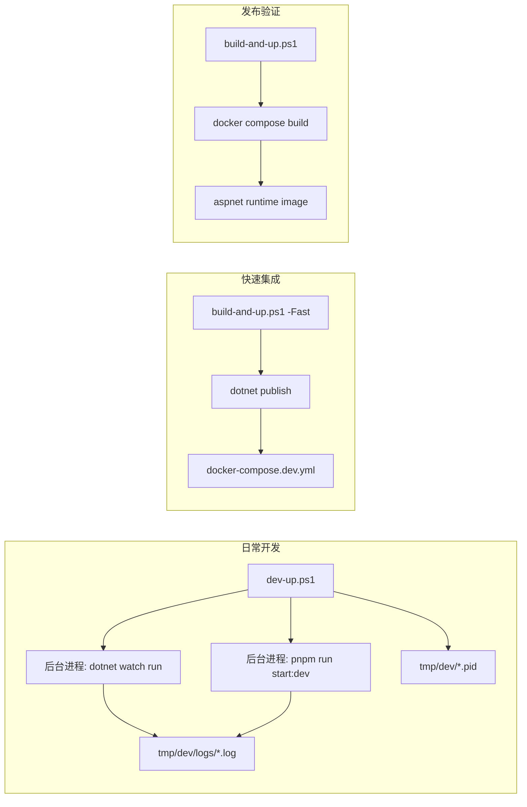

# ADR-040：开发构建与发布打包链路分离

> 状态：**Proposed**  
> 日期：2026-05-23  
> 范围：`dev-up.ps1`、`build-and-up.ps1`、Docker Compose、`Source/PuddingAgent/Dockerfile`、`PuddingPlatformAdmin` 前端开发链路、`PuddingAgent` 后端开发链路  
> 关联：[38ADR-037AdminSPA静态产物装配归一化ADR](38ADR-037AdminSPA静态产物装配归一化ADR.md)、[33ADR-032构建门禁与运行态漂移修复方案](33ADR-032构建门禁与运行态漂移修复方案.md)

---

## 1. 背景

当前开发和打包主要通过仓库根目录的 `build-and-up.ps1` 完成。该脚本在非 `-Restart` 模式下始终执行：

1. `pnpm install` / `pnpm run build`；
2. 清理并复制 Admin SPA 静态产物；
3. `dotnet build` 或 `dotnet publish`；
4. `docker compose build` / `docker compose up -d`。

这条链路适合准发布验证，但不适合高频调试。前端代码修改需要重新生产构建，后端代码修改需要重新 publish 或 Docker build，导致反馈周期过长。

当前已经存在 `docker-compose.dev.yml`，但它挂载的是 `Source/PuddingAgent/bin/Release/net10.0/publish`，容器内运行 `dotnet PuddingAgent.dll`。这只能减少 Docker 镜像构建，不能提供源码级热更新。

日常开发不需要验证容器镜像和 runtime 镜像组合时，继续把应用放在 Docker 内会引入额外成本：文件监听依赖 bind mount、依赖安装和 NuGet 缓存进入容器卷、前后端日志需要通过 `docker compose logs` 汇聚。更直接的开发体验是由脚本在宿主机后台启动两个进程：

1. 后端 `dotnet watch run`；
2. 前端 `pnpm run start:dev`。

同时，当前普通模式存在重复编译：

| 位置 | 行为 | 问题 |
|------|------|------|
| `build-and-up.ps1` | 宿主机 `dotnet build` | 构建一次 |
| `Source/PuddingAgent/Dockerfile` | Docker 内 `dotnet publish` | 再构建一次 |
| `build-and-up.ps1 -Fast` | 宿主机 `dotnet publish` | 跳过镜像构建但仍非热更新 |
| `build-and-up.ps1` | 手工复制 Admin SPA 到 `wwwroot/admin` | 与 ADR-037 的统一装配方向冲突 |
| `Dockerfile` | `COPY Source/PuddingPlatformAdmin/dist /app/wwwroot/admin/` | Docker 独有装配逻辑 |

---

## 2. 决策

### ADR-040-A：明确三条构建链路

**决定**：项目构建入口拆分为三条用途明确的链路。

| 链路 | 入口 | 目标 | 是否生产构建 | 是否 Docker build | 是否依赖 Docker |
|------|------|------|--------------|-------------------|----------------|
| 日常开发 | `dev-up.ps1` | 宿主机后台启动前后端 watch，秒级/低秒级调试反馈 | 否 | 否 | 否 |
| 快速集成 | `build-and-up.ps1 -Fast` | 使用本地 publish 产物快速重启容器 | 是 | 否 | 是 |
| 发布验证 | `build-and-up.ps1` | 生成并验证最终镜像 | 是 | 是 | 是 |

日常开发链路是默认调试入口；发布验证链路只在需要确认镜像、静态资源、发布产物完整性时使用。

### ADR-040-B：日常开发链路不依赖 Docker

**决定**：日常开发链路由 `dev-up.ps1` 在宿主机后台启动前后端 watch 进程，不新增 `docker-compose.watch.yml`。

后端进程：

```text
dotnet watch --project Source/PuddingAgent/PuddingAgent.csproj run --urls http://localhost:5000
```

前端进程：

```text
corepack enable
pnpm install --frozen-lockfile
pnpm run start:dev -- --host 127.0.0.1 --port 8000
```

开发态访问入口：

| 入口 | 用途 |
|------|------|
| `http://localhost:5000` | 后端 ASP.NET Core API 和静态资源承载 |
| `http://localhost:8000` | Umi/Max 前端开发服务器，支持 HMR |

前端开发服务器通过 proxy 调用 `http://localhost:5000`，避免每次前端修改都执行 `pnpm run build`。脚本负责 PID 记录、日志落盘、停止和日志跟随。

### ADR-040-C：发布链路保持可复现，不混入 watch 行为

**决定**：`build-and-up.ps1` 普通模式继续代表发布验证，不引入 `dotnet watch`、前端 dev server 或宿主机后台开发进程。

发布链路必须满足：

1. 从干净构建上下文可生成镜像；
2. Admin SPA 以生产构建产物进入发布结果；
3. 容器只依赖 runtime 镜像运行；
4. 不依赖宿主机源码卷挂载；
5. 适合 CI 或发布前本地验收。

### ADR-040-D：静态资源装配继续按 ADR-037 收敛

**决定**：本 ADR 不改变 ADR-037 的方向。Admin SPA 生产产物的最终装配权应归属 `PuddingAgent.csproj`，Dockerfile 和脚本不再维护跨项目静态资源复制规则。

后续施工应移除：

```dockerfile
COPY Source/PuddingPlatformAdmin/dist /app/wwwroot/admin/
```

并移除 `build-and-up.ps1` 中重复复制 Admin SPA 到 `wwwroot/admin` 和 publish 目录的逻辑。

### ADR-040-E：快速集成链路只做增量优化，不作为最终开发体验

**决定**：`build-and-up.ps1 -Fast` 可以保留，但它不是高频开发的主入口。它用于验证本地 publish 产物和容器 runtime 组合。

允许为 `-Fast` 增加以下参数：

| 参数 | 行为 |
|------|------|
| `-SkipFrontend` | 不执行 `pnpm run build`，使用现有 `dist` |
| `-SkipBackend` | 不执行 `dotnet publish`，只重启 dev compose |
| `-NoInstall` | 跳过 `pnpm install`，要求依赖已安装 |

这些参数只减少集成链路耗时，不替代 `dev-up.ps1` 的源码级热更新。

---

## 3. 方案比较

### 方案 1：仅优化现有 `build-and-up.ps1`

做法：增加 skip 参数和文件变更判断，减少不必要的 `pnpm install`、`pnpm build`、`dotnet publish`。

优点：

1. 改动小；
2. 不改变现有开发习惯；
3. 对发布链路影响低。

缺点：

1. 前端仍然需要生产构建后才能看效果；
2. 后端仍以 publish 产物运行；
3. 无法达到 HMR 或 `dotnet watch` 的反馈速度。

### 方案 2：新增宿主机后台 watch 开发链路，保留现有发布链路

做法：新增 `dev-up.ps1`，在宿主机后台启动后端 `dotnet watch` 和前端 `pnpm run start:dev`。

优点：

1. 前端 HMR，后端 watch 重启，反馈最快；
2. 不依赖 Docker，避免 bind mount watcher 和容器缓存问题；
3. 与发布链路隔离，降低破坏现有打包流程的风险；
4. 开发、集成、发布职责清晰。

缺点：

1. 新增一个开发入口；
2. 需要管理后台进程 PID 和日志；
3. 依赖宿主机已安装 .NET SDK、Node.js/Corepack/pnpm；
4. 首次启动仍需安装依赖和 NuGet restore。

### 方案 3：全量迁移到 Docker 多阶段缓存构建

做法：前端和后端都在 Dockerfile 内构建，使用 BuildKit cache mount 优化 NuGet、pnpm 缓存。

优点：

1. 构建环境高度一致；
2. CI 和本地流程更接近；
3. 发布镜像可复现性强。

缺点：

1. 仍然是生产构建，不适合每次小改动调试；
2. Windows 本地 Docker bind mount 和缓存细节复杂；
3. 对当前“前端由宿主机 pnpm build”的历史约束改动较大。

**选择**：采用方案 2 作为主方案，同时保留方案 1 的部分低风险优化。方案 3 可作为后续 CI/发布链路优化，不进入本次开发体验优化范围。

---

## 4. 目标架构



---

## 5. 影响范围

| 文件 | 处理 |
|------|------|
| `dev-up.ps1` | 新增，宿主机后台启动/停止/查看开发进程 |
| `tmp/dev/` | 运行时生成，保存 PID 和日志，不提交 |
| `Source/PuddingPlatformAdmin/config/proxy.ts` | 检查并确保 dev server API proxy 指向 `http://localhost:5000` |
| `build-and-up.ps1` | 后续增量优化，增加 skip 参数，移除重复装配 |
| `Source/PuddingAgent/Dockerfile` | 后续按 ADR-037 移除 Admin SPA 直接 COPY |
| `Source/PuddingAgent/PuddingAgent.csproj` | 后续按 ADR-037 纳入 Admin SPA dist content 映射 |
| `README.md` / `README_zh-CN.md` | 更新开发和发布命令说明 |

---

## 6. 验收标准

### 6.1 日常开发链路

1. 执行 `.\dev-up.ps1` 后，后端和前端后台进程正常启动；
2. 修改后端 `.cs` 文件后，`dotnet watch` 自动重启服务；
3. 修改前端 `.tsx` / `.less` / `.css` 文件后，浏览器通过 HMR 更新，不执行 `pnpm run build`；
4. 前端 dev server 能调用后端 API；
5. `.\dev-up.ps1 -Down` 能停止开发环境；
6. `.\dev-up.ps1 -Logs` 能跟随后端和前端日志。

### 6.2 快速集成链路

1. `.\build-and-up.ps1 -Fast` 仍可生成 publish 产物并启动 `docker-compose.dev.yml`；
2. `.\build-and-up.ps1 -Fast -SkipFrontend` 不执行前端生产构建；
3. `.\build-and-up.ps1 -Fast -SkipBackend` 不执行后端 publish，仅重启容器；
4. 端口和数据卷与现有行为兼容。

### 6.3 发布验证链路

1. `.\build-and-up.ps1` 能完成生产构建、镜像构建和启动；
2. 镜像内存在 `/app/wwwroot/admin/index.html`；
3. `http://localhost:5000/admin/` 可访问生产构建后的 Admin SPA；
4. Dockerfile 不再直接复制 Admin SPA dist；
5. `PuddingAgent.csproj` 是 Admin SPA 进入 publish 产物的唯一声明点。

---

## 7. 迁移策略

1. 第一阶段只新增 `dev-up.ps1`，不改变现有发布链路；
2. 第二阶段为 `build-and-up.ps1 -Fast` 增加 skip 参数，降低快速集成耗时；
3. 第三阶段落实 ADR-037，收敛 Admin SPA 静态产物装配；
4. 第四阶段优化 Dockerfile 构建缓存和重复编译问题；
5. 最后更新 README，并将开发入口从 `build-and-up.ps1 -Fast` 推荐切换为 `dev-up.ps1`。

---

## 8. 风险与缓解

| 风险 | 缓解 |
|------|------|
| 前端 dev server proxy 与后端 API 路径不一致 | 在施工方案中明确检查 `config/proxy.ts`，并用登录/API 调用验证 |
| 宿主机缺少 .NET SDK、Node.js、Corepack 或 pnpm | `dev-up.ps1` 启动前检查依赖，缺失时 fail fast |
| 后台进程残留或 PID 失效 | `dev-up.ps1 -Down` 按 PID 停止，PID 无效时按端口和进程名给出诊断 |
| 端口 5000 或 8000 被占用 | `dev-up.ps1` 启动前检测端口并明确报错 |
| 首次启动依赖安装慢 | 依赖安装发生在宿主机已有缓存中，脚本支持 `-NoInstall` 跳过安装 |
| 发布链路被开发链路污染 | `build-and-up.ps1` 普通模式不调用 `dev-up.ps1`，开发进程日志和 PID 放在 `tmp/dev/` |
| ADR-037 尚未落地导致装配逻辑重复 | 本次先保证开发链路可用，后续独立任务收敛装配职责 |
