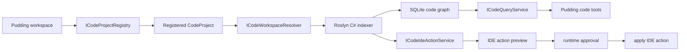
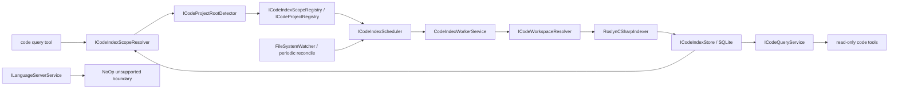

# ADR-049 代码语义索引与 LSP 编辑服务

## 状态

Draft

## 背景

当前 PuddingAgent 已有 `file_search` 和 `search_grep`：

- `file_search` 解决文件名和路径发现。
- `search_grep` 通过 ripgrep 优先解决代码文件的文本/正则搜索，ripgrep 不可用时回退到托管 C# 搜索。

它们不能回答“哪个符号调用了这个方法”、“修改这个类名会影响哪些引用”、“把变量重命名时哪些文件应由语言服务一起修改”这类代码语义问题。本 ADR 设计一个本地代码智能层，让 agent 优先查询结构化代码图和语言服务，而不是把代码库当成普通文本。

与 Codex/Claude CLI 的单一启动工作目录不同，PuddingAgent 的 workspace 只是会话、权限和注册上下文，不等同于代码根目录。PuddingAgent 需要支持一个 workspace 关联多个项目目录，而且这些项目目录不要求位于 workspace 目录树下。Agent 的默认体验应该是直接调用代码查询工具；目录注册、索引创建、同步、卸载和跨项目路由由 Pudding 在幕后完成。显式注册和卸载能力应作为内部索引覆盖机制或修复/运维工具存在，而不是 agent 使用代码工具前必须执行的前置步骤。

参考实现 `colbymchenry/codegraph` 提供了有价值的方向：本地 `.codegraph/` 索引、SQLite 图存储、tree-sitter 抽取、文件监听同步、MCP 工具、符号搜索、调用图、impact analysis 和多语言覆盖。但它公开能力主要是索引/查询/上下文构建，没有暴露 rename/refactor 级编辑工具；PuddingAgent 需要补上语言服务驱动的编辑闭环。

参考资料：

- https://github.com/colbymchenry/codegraph
- https://microsoft.github.io/language-server-protocol/specifications/lsp/3.17/specification/
- https://learn.microsoft.com/en-us/dotnet/csharp/roslyn-sdk/work-with-workspace
- https://learn.microsoft.com/en-us/dotnet/api/microsoft.codeanalysis.rename.renamer.renamesymbolasync

## 目标

1. 支持在一个 Pudding workspace 下自动覆盖多个项目目录，并为这些项目目录建立代码语义索引和查询能力；项目目录可以显式管理，但不应成为 agent 查询前的必需步骤。
2. 引入语言服务能力，理解符号、引用、调用图、类型结构和代码结构。
3. 提供 IDE 级代码动作工具。rename class/method/variable 是首个动作，但不是编辑层的完整边界。
4. 语言优先级：C# 第一，随后 C/C++、JS/TS、Python、HTML/CSS/前端格式，再扩展其他语言。

## 非目标

- 不把首版做成全语言同等语义精度。
- 不把 agent 直接暴露到任意文本替换接口来模拟重构。
- 不依赖远程代码分析服务；默认本地索引、本地数据库、本地语言服务。
- 不要求 agent 理解索引实现细节、数据库位置、语言服务进程或检索路由。

## 决策

### ADR-049-A：新增 Code Intelligence 模块

新增 `Source/PuddingCodeIntelligence`，命名空间使用 `PuddingCodeIntelligence`。该模块负责代码索引、查询、语言服务适配和语义编辑。`PuddingRuntime` 只暴露工具和后台服务注册，避免把 Roslyn/LSP/SQLite 细节塞进 Tool 层。

核心接口：

- `ICodeProjectRegistry`：维护 workspace 下注册的项目目录，支持 add/remove/list/status。
- `ICodeWorkspaceResolver`：将已注册项目目录解析为 solution、project 和语言服务上下文。
- `ICodeIndexer`：执行全量索引、增量同步、状态查询。
- `ICodeIndexStore`：持久化文件、符号、引用、关系、索引运行记录。
- `ICodeQueryService`：符号搜索、explore、callers、callees、impact、node detail。
- `ICodeIdeActionService`：统一承载 IDE 级动作。首个动作是 prepare/apply rename，后续扩展 code action、format、organize imports、extract method、move symbol 等。
- `ILanguageCodeIndexer`：按语言实现抽取器，C# 首个实现。

当前 Core MVP 已落地的接口范围是 `ICodeProjectRegistry`、`ICodeWorkspaceResolver`、`ICodeIndexer`、`ICodeIndexStore`、`ICodeQueryService` 和 `ILanguageServerService`。`ICodeIdeActionService`、rename 预览/执行和 `CodeIdeActions` 审计表保留为后续 IDE action 阶段，不进入 2026-06-12/13 的 Core MVP 实现。

### ADR-049-A1：项目目录注册表是底层索引入口

新增代码项目概念：

- 一个 Pudding workspace 可以注册多个 `CodeProject`。
- `CodeProject` 的根目录不从属于 workspace 路径；它可以是任意本机目录，但必须经过索引覆盖注册和权限校验。该注册可以由 Pudding 在代码工具调用时自动完成。
- `code_project_add` 校验目录存在、生成稳定 `ProjectId`、记录 display name/root path、自动触发或排队索引。
- `code_project_remove` 只删除注册记录和本地索引，不删除源代码文件。
- 查询工具默认搜索当前 workspace 已注册的所有项目目录；agent 可以传 `ProjectId` 缩小范围，但不需要知道数据库或索引细节。
- 编辑工具必须绑定到单个已注册项目根目录，防止跨项目误写；写入边界是 registered project root，不是 workspace root。

实现约束：

- `ProjectId` 对 agent 是可选输入；未传时由注册服务基于 `WorkspaceId + normalized project root` 生成稳定 ID。
- 路径归一化只用于身份和匹配，不改变源码目录；项目目录可以位于 Pudding workspace 或 Codex 启动目录之外。
- 路径比较策略与运行平台一致：Windows 按大小写不敏感匹配，非 Windows 按大小写敏感匹配。
- 解析器不递归进入 `.git`、`.pudding-code`、`bin`、`obj`、`node_modules` 或 reparse point/symlink/junction 目录，避免索引噪声和循环遍历。

`code_project_add` / `code_project_remove` 已作为 Core MVP 的首版工具落地，但命名和交互语义需要在下一阶段校正：它们操作的是 Pudding 的索引覆盖和本地索引状态，不是创建、修改或删除源码项目。后续公开工具名应转向 `code_index_*` / `code_scope_*` 语义，避免让 agent 或用户误解为项目生命周期管理。

### ADR-049-A2：自动索引覆盖集模型

代码查询工具应自动确保目标路径存在索引覆盖，而不是要求 agent 先注册目录。查询工具接受可选的 `scope_path`、`file_path` 或 `project_id`。当 agent 没有传入范围时，Pudding 可以基于当前工作目录、被访问文件路径、最近文件上下文或 workspace 已知目录推断索引范围。

自动覆盖过程由 `ICodeIndexScopeResolver` 和 `ICodeIndexScopeRegistry` 承担：

- `ICodeIndexScopeResolver`：将文件路径、目录路径、workspace 上下文或 project id 解析为候选索引 scope。
- `ICodeProjectRootDetector`：当没有已注册 scope 命中时，从查询上下文目录开始向父目录递归探测项目根目录。
- `ICodeIndexScopeRegistry`：维护 scope 记录，提供 ensure/list/forget/status 能力。
- `CodeProject` 可以作为当前 SQLite schema 的兼容实体保留，但外部语义应迁移到 `CodeIndexScope` 或类似名称。

项目目录探测规则：

- 仅当没有已注册 `project_index` / index scope 覆盖查询上下文时触发探测。
- 起点来自 `file_path` 的所在目录、显式 `scope_path`、当前工作目录或最近代码上下文目录。
- 每一层先检查当前目录，再检查父目录；一旦命中项目根标识即停止探测并返回该目录。
- `.git` 目录或文件是项目根标识。命中 `.git` 时停止向上递归，返回 `.git` 所在目录。
- 常见项目文件也是项目根标识。命中任一项目文件时停止向上递归，返回该文件所在目录。
- 探测不会递归扫描子目录，只沿父链向上检查，避免把探测变成昂贵的文件搜索。
- 探测结果再进入 scope registry 的 ensure 流程，由重复注册和父子目录规则决定是否创建、复用、合并或标记 covered scope。

首批项目文件标识包括：

- .NET/C/C++：`.sln`、`.slnx`、`*.csproj`、`*.fsproj`、`*.vbproj`、`*.vcxproj`、`CMakeLists.txt`、`Makefile`。
- JS/TS/前端：`package.json`、`pnpm-workspace.yaml`、`nx.json`、`turbo.json`、`vite.config.*`、`next.config.*`、`angular.json`、`vue.config.*`、`svelte.config.*`。
- Python：`pyproject.toml`、`setup.py`、`setup.cfg`、`requirements.txt`、`Pipfile`、`poetry.lock`。
- Go/Java/JVM：`go.mod`、`pom.xml`、`build.gradle`、`build.gradle.kts`、`settings.gradle`、`settings.gradle.kts`。
- 其他常见语言和 IDE：`Cargo.toml`、`composer.json`、`Gemfile`、`mix.exs`、`pubspec.yaml`、`deno.json`、`deno.jsonc`、`*.xcodeproj`、`*.xcworkspace`、`*.iml`。

重复注册和父子目录重叠规则：

- 同一个规范化根目录重复 ensure：幂等返回已有 scope，不创建新记录；必要时只刷新状态或排队更新。
- 已有父目录 scope，再 ensure 子目录：默认认为子目录已被父 scope 覆盖，不创建新的 active scope，除非未来显式支持 pinned/manual 子 scope。
- 已有自动创建的子目录 scope，再 ensure 父目录：父 scope 成为 active 覆盖范围，自动子 scope 可标记为 covered/merged，避免同一文件被重复索引。
- 如果未来存在手动 pinned 子 scope，父 scope 应排除该 pinned 子树，避免重复索引和冲突写入。

scope 记录需要增加来源和状态语义：

- `ScopeSource`：`Auto`、`Manual`、`Pinned`。
- `ScopeState`：`Active`、`Covered`、`Removed`、`Failed`。

查询工具的默认行为：

- 没有索引时，不阻塞执行完整索引；应创建/ensure scope、排队后台索引，并返回 `indexing_scheduled`、`not_ready` 或等价状态。
- 有旧索引时，采用 stale-while-revalidate：先基于旧索引返回结果，并在响应 metadata 中标记 `stale` / `refreshing`。
- 可选支持很短的 `wait_ms`，用于等待已经接近完成的后台任务；默认仍应非阻塞。

### ADR-049-A3：后台索引、Watcher 与重建

索引创建和更新不应在工具调用线程中同步完成。注册/ensure scope 只写入注册表并投递后台任务，由 `ICodeIndexScheduler` / `CodeIndexWorkerService` 串行或限流执行 Roslyn 和后续语言索引器。

更新策略：

- 文件变更通过 watcher 触发增量任务。Windows 首选 `FileSystemWatcher` 监控已覆盖目录。
- watcher 事件必须 debounce；单文件孤立变化快速刷新，批量变化延迟合并。
- watcher 溢出、漏事件或异常时，将 scope 标记为 stale，并排队 full reconcile。
- 周期性 reconcile 是必需能力，因为 watcher 是性能优化，不是可靠一致性边界。
- 自适应策略根据项目大小、近期变更频率、失败次数、索引年龄和运行队列压力调整刷新间隔。

需要显式修复工具或由 Pudding 自动执行修复：

- `code_index_rebuild`：丢弃并重建某个 scope 的索引。
- `code_index_refresh`：立即调度增量或全量刷新。
- `code_index_forget_scope`：移除索引覆盖记录和本地索引状态，不删除源码目录。
- `code_index_list_scopes`：查看当前 workspace 的索引覆盖状态。

这些工具修改的是可重建的 Pudding 索引状态，不修改源码文件，也不改变运行环境。风险等级应声明为低风险；最坏情况是索引丢失或需要重建。

### ADR-049-B：C# 以 Roslyn 为权威语义源

C# 首版不应只依赖 tree-sitter。tree-sitter 可以快速抽取结构，但无法可靠处理 C# 的重载、partial type、项目引用、条件编译、泛型、extension methods 和安全 rename。C# MVP 使用 Roslyn：

- `MSBuildWorkspace` 加载 `.sln` / `.csproj`。
- `Compilation`、`SemanticModel` 和 `SymbolFinder` 建立符号、引用和关系。
- `IOperation` 辅助抽取 invocation/object creation/member reference，形成调用图。
- `Renamer.RenameSymbolAsync` 产生 rename 后的 `Solution`，再计算文件级 diff 和应用变更。

### ADR-049-C：LSP 是跨语言适配层，不是 C# 首版核心

LSP 适合作为后续多语言统一协议层：

- `textDocument/definition`
- `textDocument/references`
- `textDocument/rename`
- `workspace/symbol`
- `workspace/executeCommand`
- `workspace/applyEdit`

但对 PuddingAgent 的 C# 第一目标，直接使用 Roslyn 更稳定、更容易嵌入 .NET 单进程，也更容易与权限、审计、预览 diff、回滚策略集成。LSP adapter 应作为第二层能力：当某语言没有本地编译器 API 或已有成熟 language server 时接入。

### ADR-049-D：SQLite 图模型借鉴 codegraph，但加入项目注册和 IDE 动作审计

索引库建议由 `PuddingDataPaths` 管理物理根目录，例如 `DatabasesRoot/code-index/code_index.db` 或后续演进为 workspace 分片路径。项目源目录不应该被强制写入 `.pudding-code/`，因为被添加的项目可能是外部目录或只读目录。Core MVP 首版表结构：

- `CodeProjects`：workspace id、project id、display name、root path、状态、添加时间、更新时间。
- `CodeFiles`：workspace id、project id、路径、语言、last indexed time。
- `CodeSymbols`：workspace id、project id、稳定 symbol id、kind、name、文件位置、signature、container。
- `CodeRelations`：workspace id、project id、contains、calls、references、inherits、implements、overrides、overloads、uses。
- `CodeReferences`：workspace id、project id、source symbol、target symbol、source file、source line、source text。
- `CodeIndexRuns`：workspace id、project id、索引批次、状态、错误、开始和结束时间。
- `CodeIdeActions`：后续 IDE action 阶段再引入，记录 action kind、tool call、用户授权、变更文件、hash 前后值。

Core MVP 的 store API 允许显式清理单文件 symbol graph、source-symbol relations 和 references。Roslyn 索引器应使用这些 API 避免 stale graph，同时不要直接接触 SQLite 细节。

### ADR-049-E：Tool 分层和权限

代码智能工具通过现有 `IPuddingTool` 体系暴露：

只读工具：

- `code_index_status`
- `code_index_list_scopes`
- `code_symbol_search`
- `code_explore`
- `code_callers`
- `code_callees`
- `code_impact`

索引覆盖和修复工具：

- `code_index_refresh`：调度索引刷新，不修改源代码。
- `code_index_rebuild`：清理并重建某个 scope 的索引，不修改源代码。
- `code_index_forget_scope`：移除索引覆盖和本地索引状态，不删除源代码。

Core MVP 已落地的 `code_project_add`、`code_project_remove`、`code_project_list` 属于首版项目注册工具，下一阶段应迁移为索引覆盖语义。`code_project_add` 和 `code_project_remove` 虽然会写 Pudding 索引数据库，但风险等级应按低风险声明：它们不写源码、不删除源码、不修改运行环境，最坏结果是索引状态丢失且可以重建。

IDE action 工具：

- `code_prepare_rename`：只读，返回候选符号、预览 diff、风险提示。
- `code_rename_symbol`：写操作，必须 `ToolPermissionLevel.High`，并声明 `RequiresFileWrite | Destructive`。

索引覆盖类工具默认不应该成为 agent 查询前的显式步骤。查询工具应调用 scope resolver/registry 自动 ensure 覆盖范围；显式 refresh/rebuild/forget 只用于修复、运维或高级控制。IDE action 的 apply 类工具必须走现有运行时授权链，不允许 agent 在无预览、无授权的情况下直接落盘。rename 只是首个 IDE action，不应把 `ICodeIdeActionService` 设计成 rename-only 服务。

## MVP 数据流

自动索引覆盖阶段的数据流暂不进入 IDE action 分支：

## 首批任务

### CI-001 代码智能模块骨架

- 新建 `Source/PuddingCodeIntelligence`。
- 定义核心接口和 DTO。
- 在 solution 中加入项目引用。

验收：

- Runtime 能 DI 注册 `ICodeQueryService`/`ICodeIndexer` 的空实现。
- 不引入任何 agent 可调用编辑工具。

状态：已完成 Core MVP 骨架和 contract tests。

### CI-002 SQLite 代码图存储

- 建立 `CodeProjects`、`CodeFiles`、`CodeSymbols`、`CodeRelations`、`CodeReferences`、`CodeIndexRuns`。
- 提供插入、删除文件索引、查询 symbol、关系遍历 API。

验收：

- 单元测试覆盖 symbol search、callers/callees、文件重新索引清理旧记录。

状态：已完成 SQLite store 和 focused tests。`CodeIdeActions` 延后到 IDE action 阶段。

### CI-002A 项目目录注册工具

- 实现 `code_project_add`、`code_project_remove`、`code_project_list`。
- 添加项目目录后自动排队或执行首次索引。
- 查询工具默认覆盖 workspace 下所有已注册项目。

验收：

- Agent 能通过工具添加一个目录为项目。
- 添加后可在不传数据库路径或索引参数的情况下查询该项目符号。
- 移除项目只删除注册和索引，不删除源代码。

状态：服务层已完成；Runtime tool 暴露在 Core MVP Task 5 完成。

### CI-003 C# Roslyn 索引器

- 支持 `.sln`/`.slnx`/`.csproj` 加载；若当前 Roslyn/MSBuild 组合无法直接加载 `.slnx`，应回退到已发现 `.csproj` 文件。
- 抽取类型、方法、属性、字段、局部变量、调用、引用。
- 输出到 SQLite 图模型。

验收：

- 对一个测试 solution 能查到 class/method、callers/callees、references。
- 支持 partial class 和重载方法的基本区分。

状态：已完成 Core MVP 索引器。实现了 RoslynWorkspaceBootstrapper（MSBuild 注册、sln/slnx/csproj 回退）、RoslynSymbolId（DocumentationCommentId + fallback）、RoslynCSharpIndexer（声明抽取、Contains/Calls/References 持久化）；测试通过 6/6（AdhocWorkspace 绕过 MSBuild 依赖）。

### CI-004 只读代码查询工具

- 注册 `code_index_status`、`code_symbol_search`、`code_explore`、`code_callers`、`code_callees`、`code_impact`。
- 权限全部为 read-only/concurrency-safe。

验收：

- Tool registry 可发现这些工具。
- Agent 模板可以显式授权代码查询工具。

### CI-005 C# IDE action: prepare rename

- 通过文件位置或 symbol id 定位 Roslyn symbol。
- 使用 Roslyn rename 生成变更预览，但不落盘。
- 输出 changed files、line spans、风险提示。

验收：

- 重命名类、方法、局部变量均能产出预览。
- 不修改文件系统。

### CI-006 C# IDE action: rename symbol 执行

- 复用 prepare rename 结果或重新计算。
- 通过 runtime approval 后应用 Roslyn workspace edit。
- 写入 `CodeWorkspaceEdits` 审计记录。

验收：

- 授权前不会落盘。
- 授权后文件内容改变，索引状态标记 stale 或触发增量同步。

## 风险

- MSBuild/Roslyn 加载真实项目可能慢，且受 SDK、TargetFramework、生成文件影响。
- 符号稳定 ID 需要兼顾跨索引运行、跨文件移动和 partial 类型。
- 调用图首版不能承诺完整覆盖动态调用、反射、source generator 输出和依赖库内部实现。
- 语言服务 rename 必须限制在 workspace 范围内，避免误改 `obj`、`bin`、vendor、generated 文件。
- 多 agent 并发编辑时需要文件 hash 校验和冲突处理。
- 多项目目录会带来路径授权、索引资源占用、外部目录移除、同名符号跨项目歧义等问题。
- 父子目录重叠如果没有统一 scope 规则，会导致同一文件被重复索引、重复返回或产生互相覆盖的 stale 状态。
- `FileSystemWatcher` 可能丢事件、溢出或在大规模变更时产生事件风暴；必须配合 debounce、stale 标记和周期性 reconcile。
- 查询工具自动 ensure scope 会降低 agent 摩擦，但如果 scope 推断过宽，可能导致后台索引资源消耗过大；需要限制默认根目录和提供状态反馈。
- 如果编辑服务按 rename-only 设计，后续接入 format/code action/extract method 会被迫重构接口。

## 当前结论

codegraph 对 PuddingAgent 最值得复用的是“本地代码图 + MCP/工具化查询 + 文件监听同步 + 输出预算”的产品形态；不能直接满足的是“多项目目录自动覆盖”和“语言服务级安全 IDE action”。PuddingAgent 应采用自动索引覆盖集 + Roslyn-first 的 C# 语义索引和 IDE action 服务，再用 LSP adapter 扩展到 TS/Python/C/C++ 等语言。agent 面向的是代码查询和 IDE action 工具，而不是显式维护项目注册表；注册、卸载、刷新和重建应由 Pudding 在后台或修复工具中完成。
