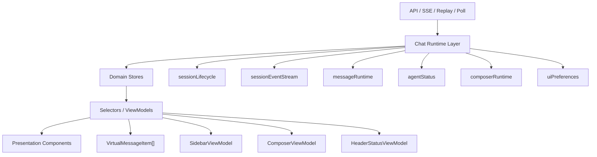

# ADR-054 前端 Chat Runtime 与 UI 性能体验重构设计方案

> 状态：Proposed  
> 日期：2026-06-27  
> 范围：`Source/PuddingPlatformAdmin/src/pages/chat`、Admin Chat runtime、消息渲染、交互体验、视觉系统  
> 关联：ADR-050 会话层统一投影与前端观察者模型、ADR-053 前端会话引用生命周期与 SSE 清理边界

> 2026-07-21 演进说明：具体文件拆分顺序与当前实施状态由
> [ADR-062](62ADR-062前端ChatUI模块化审计与渐进拆分ADR.md) 细化；本文定义的 Runtime
> Store 和性能目标仍然有效。

## 1. 背景

Admin Chat 已经从单一会话聊天演进为多 Agent 工作台，包含 workspace/agent 选择、main session、legacy SSE、agent conversation projection、replay poll、消息历史、工具过程、子代理卡片、语音/相机输入、DevPanel 诊断和本地缓存。当前功能已经可用，但状态和渲染复杂度集中在少数巨型模块中，导致性能治理、视觉统一和交互体验优化都缺少清晰边界。

当前关键文件：

- `Source/PuddingPlatformAdmin/src/pages/chat/hooks/useChatState.ts`：约 3800 行，管理 workspace、agent、session、SSE、replay、消息、工具过程、队列、modal、输入和若干 runtime refs。
- `Source/PuddingPlatformAdmin/src/pages/chat/index.tsx`：页面入口，直接消费完整 `chat` 对象并透传给布局组件。
- `Source/PuddingPlatformAdmin/src/pages/chat/components/MessageList.tsx`：已经使用 `@tanstack/react-virtual`，但仍负责 conversation projection、active run 合并、pending local turn 合并、sub-agent 插入和 scroll anchoring。
- `Source/PuddingPlatformAdmin/src/pages/chat/components/MessageItem.tsx`：已经做 stable Markdown + live text 拆分，是后续消息渲染优化的基础。
- `Source/PuddingPlatformAdmin/src/pages/chat/styles.ts`：约 4500 行，混合 layout、sidebar、message、timeline、composer、dev panel、动画和 token。
- `Source/PuddingPlatformAdmin/src/pages/chat/client/chatClientStore.ts`：已有 `useSyncExternalStore` 风格的 agent client store，可作为新 runtime store 的本地模式参考。

## 2. 目标

本轮重构的目标不是一次性重写 Chat 页面，而是用可验证、可回滚的方式建立新前端架构基础：

1. 降低高频流式事件对整页 React 渲染的影响。
2. 让输入、滚动、消息流、Agent 状态、session 生命周期分别拥有清晰状态边界。
3. 把消息投影逻辑从渲染组件迁出，组件只消费稳定 ViewModel。
4. 拆分视觉样式系统，建立更一致、更紧凑、更稳定的工作台 UI。
5. 复用现有依赖和测试基础，避免在第一阶段引入大型状态库。
6. 为后续性能指标、Playwright 视觉 QA 和移动端交互验收建立明确标准。

## 3. 非目标

以下内容不纳入本 ADR 第一轮落地：

- 不替换 Ant Design 和 antd-style。
- 不引入 Zustand、Jotai、Redux、React Query 等新状态库作为前置条件。
- 不重写后端 API 契约，除非为当前前端生命周期 bug 必须补充状态码或测试。
- 不改变消息语义、工具审批语义、子代理运行语义。
- 不做营销页式视觉重设计；Chat 首屏仍是工作台。

## 4. 当前架构问题

### 4.1 状态订阅粒度过粗

`useChatState()` 返回一个大对象。`index.tsx` 消费后继续把大量字段透传给 `ChatLayout`、`ChatMain`、`MessageList`。任何 state 变化，例如 `inputValue`、queue poll、agent status poll、stream delta、modal open、session unread，都可能让页面入口和下游组件重新计算 props。

### 4.2 高频 runtime 和低频 UI 混在一起

以下状态目前处在同一 hook：

- 低频：workspace、agent、sessions、mainSessionId、modal。
- 中频：agent status、queue snapshot、conversation projection。
- 高频：SSE delta、thinking delta、scroll anchoring、streaming Markdown。
- 运行时引用：AbortController、timer、lastSequenceNum、activeMessageIds、messageId maps。

这些状态更新频率和生命周期完全不同，放在一起会导致维护和性能优化都很困难。

### 4.3 渲染层承担业务归并

`MessageList.tsx` 现在不仅渲染列表，还负责：

- `conversationView -> projectedTurns`
- `projectedTurns + local pending turns`
- `activeRun -> active turn`
- `subAgentCards -> chronological render items`
- session/agent 维度的 scroll key

这让消息渲染和业务投影耦合，后续无法单独测试投影稳定性，也难以控制哪些变化应该触发哪些消息 block 重渲染。

### 4.4 样式系统不可控

`styles.ts` 过大，新增 UI 时很难判断 token、布局、组件样式、动画和 dev panel 样式应该放在哪里。大量样式集中在同一对象中，导致视觉一致性和重构风险都较高。

### 4.5 生命周期缺少统一事件模型

ADR-053 已经开始收敛 `delete/archive/404/410` 的 cleanup 边界，但当前 session、SSE、replay、agent projection owner 仍没有统一 runtime state machine。长期看，仍可能出现 selected/main/sse/sessionIdRef 不同步。

## 5. 目标架构

### 5.1 分层



### 5.2 状态分区

| 分区 | 典型字段 | 更新频率 | 订阅者 |
| --- | --- | --- | --- |
| Server State | workspace、agents、sessions、conversationView、agent statuses | 低到中 | sidebar、header、message projection |
| Runtime State | SSE status、replay cursor、active message ids、timers | 高频/事件驱动 | runtime hooks、diagnostics |
| Message State | turns、message blocks、subAgentCards、stream buffer | 高频 | MessageList、DevPanel |
| Composer State | inputValue、voice/camera draft、submit status | 高频 | IntentConsole |
| UI State | sidebarOpen、modal、devMode、expanded process、scroll anchor | 中频/本地 | 对应组件 |

### 5.3 Store 模式

第一阶段复用现有 `useSyncExternalStore` 模式，不新增全局状态库。新 store 应满足：

```ts
export interface RuntimeStore<TSnapshot> {
  subscribe(listener: () => void): () => void;
  getSnapshot(): TSnapshot;
}
```

后续 selector hook 约定：

```ts
export function useRuntimeSelector<TSnapshot, TResult>(
  store: RuntimeStore<TSnapshot>,
  selector: (snapshot: TSnapshot) => TResult,
  isEqual?: (a: TResult, b: TResult) => boolean,
): TResult;
```

第一阶段如果不实现通用 `useRuntimeSelector`，也必须保证每个 hook 返回的是稳定、局部的 ViewModel，而不是整个 runtime snapshot。

## 6. 目录与文件规划

### 6.1 新增 runtime 目录

```text
Source/PuddingPlatformAdmin/src/pages/chat/runtime/
  types.ts
  chatRuntimeStore.ts
  sessionLifecycleStore.ts
  sessionEventStream.ts
  messageRuntimeStore.ts
  agentStatusStore.ts
  composerStore.ts
  selectors.ts
```

职责：

- `types.ts`：runtime 内部共享类型，不能依赖 React 组件。
- `chatRuntimeStore.ts`：组合 store，负责组装 session/message/agent/composer/ui 子 store。
- `sessionLifecycleStore.ts`：session lifecycle state machine。
- `sessionEventStream.ts`：SSE/replay poll/reconnect/terminal cleanup。
- `messageRuntimeStore.ts`：turns、delta buffer、subAgentCards、messageId maps。
- `agentStatusStore.ts`：复用或迁移 `client/chatClientStore.ts` 的 status/conversation cache 能力。
- `composerStore.ts`：inputValue、send/stop、voice/camera draft。
- `selectors.ts`：对 UI 暴露稳定 selector。

### 6.2 新增 projections 目录

```text
Source/PuddingPlatformAdmin/src/pages/chat/projections/
  messageProjection.ts
  sessionProjection.ts
  agentProjection.ts
```

职责：

- `messageProjection.ts`：把 `turns + conversationView + activeRun + subAgentCards` 转成 `VirtualMessageItem[]`。
- `sessionProjection.ts`：把 session records 转成 sidebar groups 和 unread model。
- `agentProjection.ts`：把 agents/statuses/workingIds 转成 contact list ViewModel。

### 6.3 样式拆分目录

```text
Source/PuddingPlatformAdmin/src/pages/chat/styles/
  tokens.ts
  layoutStyles.ts
  sidebarStyles.ts
  messageStyles.ts
  composerStyles.ts
  devPanelStyles.ts
  index.ts
```

第一阶段保留 `styles.ts` 作为兼容出口，逐步把 style keys 迁出。迁移完成后 `styles.ts` 只 re-export `useChatStyles`。

## 7. 核心模型设计

### 7.1 Session lifecycle

```ts
export type SessionRuntimeOwner = 'legacy-sse' | 'agent-projection';

export type SessionLifecyclePhase =
  | 'idle'
  | 'resolving'
  | 'active'
  | 'stale'
  | 'terminal';

export interface SessionLifecycleState {
  phase: SessionLifecyclePhase;
  workspaceId?: string;
  agentId?: string;
  sessionId?: string;
  mainSessionId?: string;
  owner?: SessionRuntimeOwner;
  terminalReason?: 'deleted' | 'archived' | 'not-found' | 'gone';
}
```

事件：

```ts
export type SessionLifecycleEvent =
  | { type: 'WORKSPACE_SELECTED'; workspaceId?: string }
  | { type: 'AGENT_SELECTED'; agentId?: string }
  | { type: 'MAIN_SESSION_RESOLVING'; workspaceId: string; agentId: string }
  | { type: 'SESSION_ACTIVE'; sessionId: string; owner: SessionRuntimeOwner; mainSessionId?: string }
  | { type: 'SESSION_TERMINAL'; sessionId: string; reason: 'deleted' | 'archived' | 'not-found' | 'gone' }
  | { type: 'SESSION_CLEANED'; sessionId: string };
```

约束：

- SSE 只能由 `owner === 'legacy-sse' && phase === 'active'` 派生启动。
- Agent projection 拥有消息加载时，不启动 legacy SSE。
- `404` 和 `410` 都派发 `SESSION_TERMINAL`。
- `delete/archive` 不直接清全局 refs，必须走 `SESSION_TERMINAL`。

### 7.2 Message projection

```ts
export type VirtualMessageItem =
  | { kind: 'message'; key: string; block: ChatMessageBlock }
  | { kind: 'subagent'; key: string; card: SubAgentCard }
  | { kind: 'system'; key: string; text: string; createdAt: number };
```

输入：

```ts
export interface MessageProjectionInput {
  turns: ChatTurn[];
  conversationView?: AgentConversationView | null;
  activeRunMarkdown?: string;
  subAgentCards?: SubAgentCardMap;
  agentName: string;
  currentUser?: { name?: string; avatar?: string };
}
```

输出：

```ts
export interface MessageProjectionOutput {
  items: VirtualMessageItem[];
  lastMessageKey?: string;
  activeMessageKey?: string;
}
```

约束：

- Projection 函数必须是纯函数。
- 不读取 DOM，不访问 localStorage，不发请求。
- 所有排序和合并规则必须有单元测试。
- MessageList 不能再直接做 `conversationView -> turns` 的业务合并。

### 7.3 Composer

```ts
export interface ComposerState {
  inputValue: string;
  disabled: boolean;
  submitting: boolean;
  draftMetadata?: Record<string, string>;
}
```

约束：

- 输入变化只通知 composer 订阅者。
- MessageList 不订阅 inputValue。
- `sendMessage` 从 composer action 派发，不直接读取页面级大对象。

## 8. 阶段化实施计划

### Step 0：收口当前 P0 QA 基线

**目标**

确保 ADR-053 的 session cleanup 基线可靠，再开始 UI 性能架构迁移。

**范围**

- 只处理当前未提交的 session lifecycle 修复相关测试和文档。
- 不做 UI 样式和 runtime 架构迁移。

**任务**

1. 更新 `Docs/07架构/54ADR-053前端会话引用生命周期与SSE清理边界ADR.md`，把 SSE terminal status 从仅 `404` 改为 `404/410`。
2. 在 `Source/PuddingPlatformAdmin/src/services/platform/api.sessionEvents.test.ts` 增加 `410` 用例。
3. 在 `Source/PuddingPlatformAdmin/src/pages/chat/hooks/useChatState.selection.test.tsx` 增加 SSE `onError(..., 410)` 后清理且不 reconnect 的用例。
4. 为 `SessionEventsController` 增加 WebApi 测试：unknown replay 404、unknown stream 404、frozen stream 410。

**实现路线**

- 先补测试，确认失败。
- 再补实现或文档。
- 不扩大 `ChatApiController` 相关改动。

**约束**

- 不引入新目录。
- 不重构 `useChatState`。
- 不改变后端现有 session archive/delete 语义。

**验收条件**

- `pnpm exec jest --runTestsByPath src/pages/chat/hooks/sessionRuntimeCleanup.test.ts src/pages/chat/hooks/useChatState.selection.test.tsx src/pages/chat/hooks/useChatState.recovery.test.ts src/services/platform/api.sessionEvents.test.ts --runInBand --detectOpenHandles --forceExit`
- `dotnet build .\Source\PuddingPlatform\PuddingPlatform.csproj --no-restore -v:q`
- 新增 WebApi 测试通过。
- ADR-053 与代码状态码契约一致。

### Step 1：建立 Runtime Store Skeleton

**目标**

建立新 runtime store 目录和基础订阅模型，但不替换现有 UI 行为。

**范围**

新增文件：

- `Source/PuddingPlatformAdmin/src/pages/chat/runtime/types.ts`
- `Source/PuddingPlatformAdmin/src/pages/chat/runtime/chatRuntimeStore.ts`
- `Source/PuddingPlatformAdmin/src/pages/chat/runtime/selectors.ts`
- `Source/PuddingPlatformAdmin/src/pages/chat/runtime/chatRuntimeStore.test.ts`

**任务**

1. 定义 `RuntimeStore<TSnapshot>`、`ChatRuntimeSnapshot`、`ChatRuntimeAction`。
2. 实现 `createChatRuntimeStore()`，支持 `subscribe/getSnapshot/dispatch`。
3. 增加基础 selector：`selectWorkspaceAgent`、`selectSessionLifecycle`、`selectComposer`。
4. 单元测试验证 selector 返回引用稳定性。

**实现方案**

基础 snapshot：

```ts
export interface ChatRuntimeSnapshot {
  workspaceId?: string;
  agentId?: string;
  session: SessionLifecycleState;
  composer: ComposerState;
  updatedAt: number;
}
```

基础 action：

```ts
export type ChatRuntimeAction =
  | { type: 'WORKSPACE_SET'; workspaceId?: string }
  | { type: 'AGENT_SET'; agentId?: string }
  | { type: 'COMPOSER_INPUT_SET'; value: string }
  | { type: 'SESSION_EVENT'; event: SessionLifecycleEvent };
```

**约束**

- 不把 store 挂到 window。
- 不替换 `useChatState` 返回值。
- 不引入第三方状态库。
- Store 内不能 import React 组件。

**验收条件**

- `pnpm exec jest --runTestsByPath src/pages/chat/runtime/chatRuntimeStore.test.ts --runInBand`
- 测试覆盖：subscribe 被调用、unsubscribe 生效、相同 composer value 不重复 emit、selector 对无关状态变更保持引用稳定。

### Step 2：抽出 Session Lifecycle

**目标**

把 session lifecycle 的状态机和 terminal cleanup 规则从 `useChatState` 中抽为纯函数和 store action。

**范围**

新增：

- `Source/PuddingPlatformAdmin/src/pages/chat/runtime/sessionLifecycleStore.ts`
- `Source/PuddingPlatformAdmin/src/pages/chat/runtime/sessionLifecycleStore.test.ts`

修改：

- `Source/PuddingPlatformAdmin/src/pages/chat/hooks/useChatState.ts`
- `Source/PuddingPlatformAdmin/src/pages/chat/hooks/sessionRuntimeCleanup.ts`

**任务**

1. 定义 `reduceSessionLifecycle(state, event)`。
2. 把 `delete/archive/404/410` 映射为 `SESSION_TERMINAL`。
3. 保留 `handleSessionNotFound` 作为兼容入口，但内部转调 lifecycle action。
4. 测试 selected/main/sse 不同匹配组合。

**实现路线**

先写纯函数测试：

- idle + `MAIN_SESSION_RESOLVING` -> resolving。
- resolving + `SESSION_ACTIVE` -> active。
- active + matching `SESSION_TERMINAL` -> terminal。
- active + non-matching terminal event -> state 不变。

再把 `useChatState` 中的 terminal cleanup 调用改成：

```ts
dispatchSessionLifecycle({
  type: 'SESSION_TERMINAL',
  sessionId,
  reason,
});
```

**约束**

- 兼容现有 `handleDeleteSession`、`handleArchiveSession` 对外 API。
- 不能让删除非当前 session abort 当前 SSE。
- `404/410` 都必须停止对应 session 的 replay poll。

**验收条件**

- `pnpm exec jest --runTestsByPath src/pages/chat/runtime/sessionLifecycleStore.test.ts src/pages/chat/hooks/sessionRuntimeCleanup.test.ts src/pages/chat/hooks/useChatState.selection.test.tsx --runInBand`
- 删除非当前 session 不 abort 当前 SSE。
- 删除当前 selected/main session 清 selected、turns、mainSessionId 和 agent mainSessionId。
- SSE `410` 不重连。

### Step 3：抽出 Session Event Stream

**目标**

让 SSE、replay poll、reconnect timer、AbortController 的生命周期由独立模块管理。

**范围**

新增：

- `Source/PuddingPlatformAdmin/src/pages/chat/runtime/sessionEventStream.ts`
- `Source/PuddingPlatformAdmin/src/pages/chat/runtime/sessionEventStream.test.ts`

修改：

- `Source/PuddingPlatformAdmin/src/pages/chat/hooks/useChatState.ts`
- `Source/PuddingPlatformAdmin/src/services/platform/api.ts`

**任务**

1. 定义 `createSessionEventStreamRuntime()`。
2. 迁移 `startSessionEventStream` 内的 timer/reconnect/onError 逻辑。
3. 暴露 `start(sessionId)`、`stop()`、`getCurrentSessionId()`。
4. 通过 callback 注入 `applySessionEvent`、`replayMissedEvents`、`onTerminal`。

**实现方案**

接口：

```ts
export interface SessionEventStreamRuntime {
  start(sessionId: string): void;
  stop(reason?: string): void;
  getCurrentSessionId(): string | null;
}
```

创建参数：

```ts
export interface SessionEventStreamRuntimeOptions {
  subscribeSessionEvents: typeof subscribeSessionEvents;
  replayMissedEvents(sessionId: string, signal: AbortSignal): Promise<boolean>;
  applySessionEvent(event: AdminChatStreamEvent): void;
  onTerminal(sessionId: string, status: 404 | 410): void;
  onDiag?(name: string, payload: Record<string, unknown>): void;
}
```

**约束**

- Runtime 不直接调用 React setState。
- Runtime 不读取 `selectedSessionId`，只管理自己的 current session。
- `stop()` 必须清 replay timer、reconnect timer、abort controller。
- `onTerminal` 只对 current session 生效。

**验收条件**

- `pnpm exec jest --runTestsByPath src/pages/chat/runtime/sessionEventStream.test.ts src/pages/chat/hooks/useChatState.selection.test.tsx --runInBand`
- start A 后 start B，A 的 timer 和 abort controller 被清理。
- SSE 500 触发 reconnect。
- SSE 404/410 触发 terminal，不重连。
- replay terminal error 后不再 schedule poll。

### Step 4：抽出 Message Runtime

**目标**

把 turns、delta buffer、thinking buffer、active message ids、subAgentCards 从巨型 hook 中迁出，降低流式更新影响范围。

**范围**

新增：

- `Source/PuddingPlatformAdmin/src/pages/chat/runtime/messageRuntimeStore.ts`
- `Source/PuddingPlatformAdmin/src/pages/chat/runtime/messageRuntimeStore.test.ts`

修改：

- `Source/PuddingPlatformAdmin/src/pages/chat/hooks/useChatState.ts`
- `Source/PuddingPlatformAdmin/src/pages/chat/types.ts`

**任务**

1. 定义 message runtime snapshot：`turns`、`subAgentCards`、`activeMessageIds`、`lastSequenceNum`。
2. 迁移 `enqueueDelta`、`flushPendingDeltas`、`enqueueThinking`、`flushPendingThinking`。
3. 迁移 `applySessionEvent` 中与 message mutation 直接相关的分支。
4. 保留 `useChatState` 返回 `turns`，但 turns 来源改为 message store snapshot。

**实现路线**

先迁移纯 mutation：

- append optimistic turn。
- append delta to active assistant answer。
- update assistant status。
- add/update subAgent card。

再迁移 timer flush：

- delta flush timer。
- thinking flush timer。

**约束**

- Message runtime 不负责 SSE start/stop。
- Message runtime 不负责 workspace/agent selection。
- 流式 delta 更新必须只改变目标 turn，其他 turn 引用保持稳定。
- 历史分页 prepend 必须保留 scroll anchoring 行为。

**验收条件**

- `pnpm exec jest --runTestsByPath src/pages/chat/runtime/messageRuntimeStore.test.ts src/pages/chat/components/MessageList.test.tsx src/pages/chat/components/MessageItem.test.tsx --runInBand`
- delta flush 后非目标 turn 引用不变。
- thinking flush 后非目标 turn 引用不变。
- subAgent card 更新不替换 turns。
- 历史 prepend 后 `MessageList` 原有 scroll anchoring 测试通过。

### Step 5：抽出 Message Projection

**目标**

让 `MessageList` 变成纯列表组件，不再承担业务归并逻辑。

**范围**

新增：

- `Source/PuddingPlatformAdmin/src/pages/chat/projections/messageProjection.ts`
- `Source/PuddingPlatformAdmin/src/pages/chat/projections/messageProjection.test.ts`

修改：

- `Source/PuddingPlatformAdmin/src/pages/chat/components/MessageList.tsx`
- `Source/PuddingPlatformAdmin/src/pages/chat/types.ts`

**任务**

1. 从 `MessageList.tsx` 迁出：
   - `buildProjectedTurns`
   - `mergePendingLocalTurns`
   - `mergeActiveRunIntoTurns`
   - `buildChronologicalRenderItems`
2. 新增 `buildVirtualMessageItems(input)`。
3. `MessageList` 接收 `items` 或内部只调用 projection 函数，不保留业务细节。
4. 为 projection 增加单元测试。

**实现方案**

`messageProjection.ts` 对外暴露：

```ts
export function buildVirtualMessageItems(
  input: MessageProjectionInput,
): MessageProjectionOutput;
```

**约束**

- Projection 不访问 DOM。
- Projection 不使用 React hooks。
- Projection 不修改输入对象。
- Projection 的排序规则必须稳定：同 timestamp 按原始顺序。

**验收条件**

- `pnpm exec jest --runTestsByPath src/pages/chat/projections/messageProjection.test.ts src/pages/chat/components/MessageList.test.tsx --runInBand`
- activeRun 能合并到 matching pending turn。
- server projection 不吞掉本地 pending turn。
- subAgent card 按时间插入。
- heartbeat 和 inbound agent message 保持现有渲染语义。

### Step 6：拆 Composer Store 和输入隔离

**目标**

输入框输入不再触发消息列表、sidebar 和 DevPanel 的重渲染。

**范围**

新增：

- `Source/PuddingPlatformAdmin/src/pages/chat/runtime/composerStore.ts`
- `Source/PuddingPlatformAdmin/src/pages/chat/runtime/composerStore.test.ts`

修改：

- `Source/PuddingPlatformAdmin/src/pages/chat/components/IntentConsole.tsx`
- `Source/PuddingPlatformAdmin/src/pages/chat/components/ChatMain.tsx`
- `Source/PuddingPlatformAdmin/src/pages/chat/index.tsx`
- `Source/PuddingPlatformAdmin/src/pages/chat/hooks/useChatState.ts`

**任务**

1. 建立 composer store：`inputValue`、`draftMetadata`、`submitting`。
2. `IntentConsole` 使用 composer selector，而不是通过 `ChatMain` 透传 input props。
3. `handleSend` 从 composer action 中读取当前 input。
4. 保留外部 suggestion 事件填充输入的行为。

**约束**

- `IntentConsole` 仍保持现有测试行为。
- 输入变化不能触发 `MessageList` props 变化。
- 发送后必须立即清空输入。

**验收条件**

- `pnpm exec jest --runTestsByPath src/pages/chat/runtime/composerStore.test.ts src/pages/chat/components/IntentConsole.test.tsx src/pages/chat/components/ChatMain.test.tsx --runInBand`
- 增加一个 render 计数测试：输入变化时 mocked `MessageList` render count 不增加。

### Step 7：拆 Agent Status Store

**目标**

把 `index.tsx` 中的 agent client polling 和 projection 逻辑迁到独立 hook/store，让页面入口更薄。

**范围**

新增或迁移：

- `Source/PuddingPlatformAdmin/src/pages/chat/runtime/agentStatusStore.ts`
- `Source/PuddingPlatformAdmin/src/pages/chat/runtime/agentStatusStore.test.ts`

修改：

- `Source/PuddingPlatformAdmin/src/pages/chat/client/chatClientStore.ts`
- `Source/PuddingPlatformAdmin/src/pages/chat/hooks/useAgentChatClient.ts`
- `Source/PuddingPlatformAdmin/src/pages/chat/index.tsx`

**任务**

1. 保留 `client/chatClientStore.ts` 的 IndexedDB/cache/cursor sync 能力。
2. 新增 `useAgentStatusRuntime(workspaceId, agentId)`。
3. 把 `refreshStatuses/syncStatuses/selectAgent/syncSelectedAgent` 的 effects 从 `index.tsx` 迁出。
4. 对 UI 只暴露 `agentStatuses`、`conversationView`、`selectedAgentStatus`。

**约束**

- 不改变 feature flag：`isAgentClientArchitectureEnabled()` 仍可关闭新 projection。
- 后台 sync 必须防止重叠请求。
- visibility hidden 时轮询降频或暂停。

**验收条件**

- `pnpm exec jest --runTestsByPath src/pages/chat/client/chatClientStore.test.ts src/pages/chat/hooks/useAgentChatClient.test.tsx src/pages/chat/runtime/agentStatusStore.test.ts --runInBand`
- agent 切换过期请求不覆盖当前 agent。
- cursor 未变化且无 active run 时跳过 conversation API。

### Step 8：拆样式系统

**目标**

把 4500 行 `styles.ts` 拆为可维护的视觉模块，统一 token 和交互动效。

**范围**

新增：

- `Source/PuddingPlatformAdmin/src/pages/chat/styles/tokens.ts`
- `Source/PuddingPlatformAdmin/src/pages/chat/styles/layoutStyles.ts`
- `Source/PuddingPlatformAdmin/src/pages/chat/styles/sidebarStyles.ts`
- `Source/PuddingPlatformAdmin/src/pages/chat/styles/messageStyles.ts`
- `Source/PuddingPlatformAdmin/src/pages/chat/styles/composerStyles.ts`
- `Source/PuddingPlatformAdmin/src/pages/chat/styles/devPanelStyles.ts`
- `Source/PuddingPlatformAdmin/src/pages/chat/styles/index.ts`

修改：

- `Source/PuddingPlatformAdmin/src/pages/chat/styles.ts`
- 使用内联样式较多的组件，例如 `MessageList.tsx`、`SubAgentIndicator.tsx`、`CommandPalette.tsx`。

**任务**

1. 先抽 token：颜色、圆角、间距、motion duration、z-index。
2. 再按组件域迁移 styles key。
3. 清理 `MessageList.tsx` 中 `SubAgentCard` 的内联样式。
4. 为 motion 增加 `prefers-reduced-motion` 规则。

**视觉约束**

- 主界面保持工作台，不做 landing hero。
- 页面 section 不使用卡片套卡片。
- 主要圆角 6-8px。
- 动画使用 `opacity` 和 `transform`，避免 width/height 动画造成 layout shift。
- icon-only button 必须有 tooltip 和 aria-label。
- 移动端不允许横向滚动。

**验收条件**

- `pnpm exec jest --runTestsByPath src/pages/chat/components/ChatLayout.test.tsx src/pages/chat/components/ChatMain.test.tsx src/pages/chat/components/MessageList.test.tsx src/pages/chat/components/SessionSidebar.test.tsx --runInBand`
- Playwright 手动或自动检查 375、768、1024、1440 宽度无重叠。
- DevPanel 中 layout shift 诊断无新增明显异常。

### Step 9：DevPanel 懒加载与诊断收敛

**目标**

让 DevPanel 不影响默认聊天首屏和流式输出路径。

**范围**

修改：

- `Source/PuddingPlatformAdmin/src/pages/chat/components/ChatMain.tsx`
- `Source/PuddingPlatformAdmin/src/pages/chat/components/DevPanel.tsx`
- `Source/PuddingPlatformAdmin/src/pages/chat/components/DevPanel.test.tsx`

**任务**

1. 使用 `React.lazy` 懒加载 DevPanel。
2. DevMode 未开启时不计算 rawEvents。
3. rawEvents 采集逻辑迁到 `useDevRuntimeEvents`。
4. perf summary 刷新只在 DevPanel visible 时启用。

**约束**

- DevPanel 打开后功能保持一致。
- 默认关闭时不启动 DevPanel 内部轮询。
- 诊断事件不影响 `MessageList` props。

**验收条件**

- `pnpm exec jest --runTestsByPath src/pages/chat/components/DevPanel.test.tsx src/pages/chat/components/ChatMain.test.tsx --runInBand`
- 默认渲染 `ChatMain` 时 DevPanel mock 不被加载。
- 开启 devMode 后 DevPanel 正常显示 perf metrics。

### Step 10：性能与交互验收

**目标**

建立可重复验证的性能和视觉验收流程。

**范围**

新增：

- `Source/PuddingPlatformAdmin/src/pages/chat/perf/chatPerfScenario.test.ts` 或等价测试文件。
- 如需要浏览器验收，新增 Playwright 场景文件。

**任务**

1. 用现有 `Source/PuddingPlatformAdmin/src/utils/debug.ts` 采集：
   - `chat.output.paint`
   - `chat.markdown.render`
   - `chat.workflow.step`
   - `browser.longtask`
   - `browser.layoutShift`
2. 增加本地性能场景：1000 条消息、长 Markdown、流式 active block、agent 切换。
3. 增加人工 QA checklist。

**验收条件**

- agent 切换点击后首帧反馈小于 100ms。
- 输入框输入不触发 `MessageList` 重渲染。
- 流式输出期间只更新 active message block。
- 1000 条历史消息滚动无明显跳动。
- Markdown render 峰值下降或至少不高于重构前 baseline。
- 375、768、1024、1440 宽度无横向滚动、无文本重叠。
- `prefers-reduced-motion` 下禁用非必要循环动画。

## 9. 推荐 PR 拆分

| PR | 内容 | 风险 | 是否可独立回滚 |
| --- | --- | --- | --- |
| PR-1 | Step 0：当前 P0 QA 收口 | 低 | 是 |
| PR-2 | Step 1-2：runtime skeleton + session lifecycle | 中 | 是 |
| PR-3 | Step 3：session event stream runtime | 中高 | 是 |
| PR-4 | Step 4：message runtime store | 高 | 是 |
| PR-5 | Step 5：message projection 前移 | 中 | 是 |
| PR-6 | Step 6-7：composer/agent status 隔离 | 中 | 是 |
| PR-7 | Step 8：样式系统拆分 | 中 | 是 |
| PR-8 | Step 9-10：DevPanel 懒加载和性能验收 | 低中 | 是 |

每个 PR 必须包含：

- 对应单元测试。
- 验证命令输出。
- 回滚说明。
- 如果改动用户可见交互，附 375/768/1024/1440 视觉检查结果。

## 10. 统一验收命令

前端 targeted：

```powershell
cd Source\PuddingPlatformAdmin
pnpm exec jest --runTestsByPath `
  src/pages/chat/components/MessageList.test.tsx `
  src/pages/chat/components/MessageItem.test.tsx `
  src/pages/chat/components/ChatMain.test.tsx `
  src/pages/chat/components/IntentConsole.test.tsx `
  src/pages/chat/components/SessionSidebar.test.tsx `
  src/pages/chat/hooks/useChatState.selection.test.tsx `
  src/pages/chat/hooks/useChatState.recovery.test.ts `
  src/pages/chat/client/chatClientStore.test.ts `
  --runInBand --detectOpenHandles --forceExit
```

后端相关：

```powershell
dotnet build .\Source\PuddingPlatform\PuddingPlatform.csproj --no-restore -v:q
dotnet test .\Source\PuddingWebApiTests\PuddingWebApiTests.csproj --no-build --no-restore --filter "SessionApiControllerTests|AgentChatApiControllerTests"
```

全量门禁在当前仓库仍可能受既有 TypeScript/lint baseline 影响。每个 PR 的 QA 需要明确区分：

- 本 PR 新增失败。
- 仓库既有 baseline 失败。
- 本 PR 未触达但阻塞合并的失败。

## 11. 交付约束

1. 每个 Step 只能修改本 Step 列出的文件，除非测试暴露出必须调整的邻接文件。
2. 不在同一 PR 同时做 runtime 行为重构和视觉大改。
3. 不在消息渲染 PR 中改变后端 API 契约。
4. 不在样式拆分 PR 中改业务逻辑。
5. 新增 runtime store 必须可单测，不依赖真实 DOM。
6. 新增 projection 必须是纯函数。
7. 高频事件路径不允许无节制 `console.debug`，必须走现有 perf/debug 开关。
8. 所有 timer、AbortController、ResizeObserver、PerformanceObserver 都必须有 cleanup。

## 12. 风险与缓解

| 风险 | 表现 | 缓解 |
| --- | --- | --- |
| 新旧状态双写不一致 | UI 显示 session A，runtime 仍连接 session B | 保留兼容层期间增加 invariant diag 和 targeted tests |
| Projection 迁移吞消息 | pending turn 被 server projection 覆盖 | messageProjection 单测覆盖 activeRun/pending/local/server 合并 |
| 虚拟滚动跳动 | 历史分页或 Markdown remeasure 后 scrollTop 抖动 | 保留现有 MessageList scroll tests，迁移前后都跑 |
| 样式拆分引入视觉回归 | 宽度、重叠、hover/focus 丢失 | 每个样式 PR 做 4 个 viewport 截图 QA |
| DevPanel 性能影响默认路径 | 默认关闭时仍轮询或计算 rawEvents | lazy + visible 后才启动 effects |
| 状态库自研过度 | store API 变复杂 | 第一阶段只做 `subscribe/getSnapshot/dispatch`，不做插件化 |

## 13. 成功标准

本重构完成后，Chat 前端应满足：

- `useChatState.ts` 不再承担 SSE、message mutation、composer、agent polling 的全部职责。
- `MessageList.tsx` 只负责虚拟滚动和显示，不负责业务归并。
- 输入、agent status、queue poll、stream delta 的更新路径互相隔离。
- 默认 DevPanel 关闭时不影响主聊天性能。
- 样式系统按组件域组织，新增视觉改动有明确落点。
- DevPanel 可以用现有 perf 事件解释主要慢点，而不是只能体感判断。

