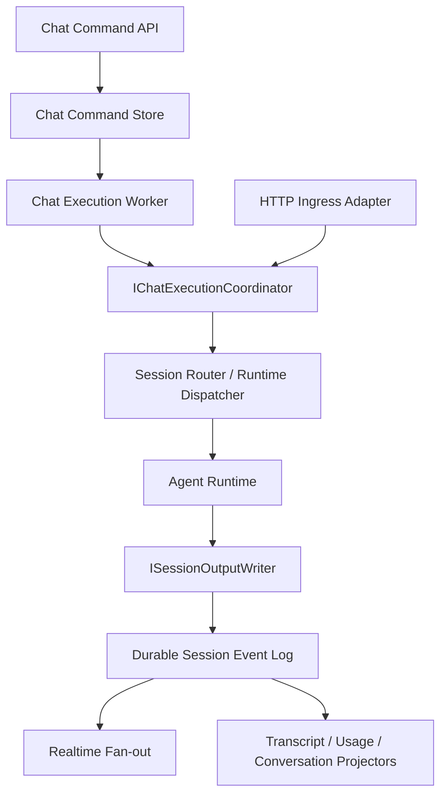
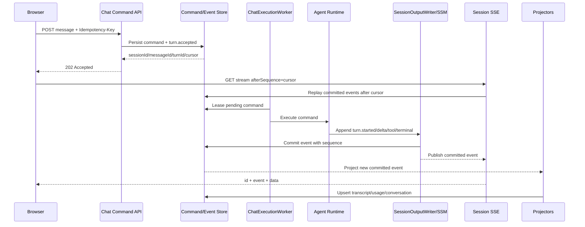

# ADR-056 聊天消息受理与可靠事件流架构

## 状态

Proposed

## 日期

2026-07-13

## 范围

Admin Chat、消息入口、SessionRouter、Agent Runtime、SessionStateManager、会话 SSE、聊天转录、Usage 统计、后台执行生命周期。

## 关联决策

- [ADR-014 消息管线规范化](14消息管线与终端代理与前端优化ADR.md)
- [ADR-016 会话状态层与客户端解耦](16会话状态层与客户端解耦ADR.md)
- [ADR-031 聊天历史转录持久化与事件日志回放边界](32ADR-031聊天历史转录持久化与事件日志回放边界.md)
- [ADR-050 会话层统一投影与前端观察者模型](51ADR-050会话层统一投影与前端观察者模型ADR.md)
- [ADR-053 前端会话引用生命周期与 SSE 清理边界](54ADR-053前端会话引用生命周期与SSE清理边界ADR.md)

本 ADR 是上述决策在“消息受理、后台执行和可靠投递”边界上的收敛，不替代 Pudding 的全局事件总线、工作流、子代理、记忆和潜意识架构。

## 1. 背景

当前 Admin Chat 发送链路已经具备以下基础能力：

- Agent Runtime 将 `delta`、`thinking`、`usage`、`done` 等执行帧写入 `ISessionStateManager`。
- `ISessionStateManager` 保存 append-only 会话事件，并通过 per-session Channel 向订阅者实时广播。
- 浏览器通过独立的 Session SSE 观察执行过程，浏览器断开不应取消 Agent。
- `ChatMessages` 保存面向历史分页和检索的聊天转录。

但是，消息受理仍依赖一条内部流式回环：

```text
Browser
  -> ChatApiController.SendMessage
    -> Task.Run
      -> PlatformApiClient
        -> POST /api/messageingress/stream（同进程 HTTP + SSE）
          -> MessageIngressController
            -> SessionRouter
              -> Agent Runtime
                -> SessionStateManager
      <- PlatformApiClient 再消费内部 SSE
        -> 解析 metadata
        -> 累加 reply/thinking
        -> 写 ChatMessages/Usage
        -> Platform 层补写 metadata
```

POST 主请求需要轮询后台任务产生的 `metadata`，取得 `sessionId/messageId` 后才能向浏览器返回。浏览器收到响应后才建立 Session SSE。

这使三个本应独立的生命周期互相牵制：

1. HTTP 请求受理生命周期。
2. Agent 后台执行生命周期。
3. 客户端事件观察生命周期。

## 2. 问题陈述

### 2.1 POST 依赖执行流首帧

`sessionId/messageId` 是命令受理标识，不应依赖 Agent 执行流的第一帧。轮询共享变量会引入可见性竞态、额外延迟和错误的超时语义；当已有 `sessionId` 时，等待逻辑还可能提前进入较短的 `messageId` 等待窗口。

### 2.2 请求内 fire-and-forget 不受 Host 管理

Controller 内部 `Task.Run`：

- 不具备可靠排队和背压能力；
- 无法统一控制最大并发、重试和优雅停机；
- 可能捕获请求作用域服务并跨越其生命周期；
- 请求返回失败后，后台执行仍可能继续；
- 进程退出时没有可恢复的待执行记录。

### 2.3 同进程 HTTP/SSE 回环把传输协议变成内部编排协议

每个执行帧都需要 SSE 编码、HTTP Flush、流读取和 JSON 再解析。该协议适合跨进程适配，不应成为同进程默认调用路径。

### 2.4 浏览器订阅前存在实时事件缺口

浏览器只能在 POST 返回 `sessionId` 后订阅。POST 返回前已经发布到 Channel 的事件不会自动补发；如果 Agent 很快完成，浏览器可能错过 `delta`、`error` 或 `done`。

### 2.5 Channel 溢出无法可靠恢复

实时订阅 Channel 是有界缓冲区，并允许丢弃旧帧。若事件没有统一序列、SSE `id` 和重放游标，客户端无法判断自己是否缺帧。

### 2.6 事实写入责任分散

当前 Runtime 写执行帧，Platform 补写 `metadata`，Platform 消费内部 SSE 后再物化 ChatMessages 和 Usage。同一 Turn 的事实由多个层拼装，增加重复、乱序和部分成功的风险。

### 2.7 终态没有单一保证

后台异常如果只写日志和遥测，而未写持久化 `error/cancelled`，前端可能永久保持 loading。每个已受理 Turn 必须恰好进入一个终态。

## 3. 架构目标

1. POST 只负责验证、路由、受理和持久化命令，不等待 LLM 或内部 SSE。
2. `sessionId`、`messageId`、`turnId` 在受理阶段同步确定。
3. Agent 执行由 Host 管理的后台 Worker 承担，支持持久化恢复、限流和优雅停机。
4. 所有客户端可见事件只通过一个 `ISessionOutputWriter` 写入一次。
5. 事件日志先持久化，再实时发布；实时通道不是事实源。
6. SSE 支持断线续传、订阅前补发、序列缺口检测和多观察者。
7. ChatMessages、Usage、Topic 等由幂等投影器从事实事件生成。
8. 同一 Session 默认串行执行 Turn，明确处理并发和 steering。
9. 保留跨进程 HTTP Adapter，但业务层不依赖 SSE 传输协议。

## 4. 非目标

- 本 ADR 不重定义全局 EventBus、Workflow/TaskMap 或 Agent-to-Agent 消息协议。
- 本 ADR 不规定 LLM Provider 的底层流式协议。
- 本 ADR 不把 UI ConversationProjection 与原始 SessionEventLog 合并为同一存储模型。
- 本 ADR 不要求一次性删除现有 `/api/messageingress/stream`，只取消其同进程默认编排职责。
- 本 ADR 不改变子代理、潜意识任务和定时任务的领域语义；它们可以复用相同的可靠执行基础设施。

## 5. 核心决策

### ADR-056-A：POST 是命令受理入口

新的发送语义：

```http
POST /api/workspaces/{workspaceId}/chat/message
Idempotency-Key: 01J...
Content-Type: application/json
```

```json
{
  "messageText": "你好",
  "sessionId": "optional-session-id",
  "agentId": "agent-1",
  "clientRequestId": "01J..."
}
```

成功响应使用 `202 Accepted`：

```json
{
  "status": "accepted",
  "commandId": "cmd-...",
  "messageId": "msg-...",
  "turnId": "turn-...",
  "sessionId": "session-...",
  "eventCursor": 104
}
```

`202` 表示命令已经可靠受理，不表示 Agent 已完成。为了平滑迁移，第一阶段可以继续返回 `200` 和原字段，但后端语义必须先切换为 accepted。

在返回前必须完成：

1. 身份、Workspace、Agent、权限和运行控制校验。
2. 解析或创建 Session。
3. 生成稳定的 `commandId/messageId/turnId`。
4. 持久化命令记录和 `turn.accepted` 事件。
5. 持久化用户消息事实，或确保 `turn.accepted` 包含可恢复的用户消息引用。

在返回前不得等待：

- LLM 首 token；
- Runtime `metadata`；
- Agent 完成；
- ChatMessages/Usage 等非受理关键投影完成。

### ADR-056-B：采用持久化命令队列和 Host Worker

新增逻辑组件：

```text
IChatCommandStore
IChatCommandNotifier
ChatExecutionWorker : BackgroundService
IChatExecutionCoordinator
ISessionExecutionScheduler
```

数据库中的 `chat_execution_commands` 是待执行工作的事实源；进程内 `Channel<string>` 只作为低延迟唤醒信号，不承担可靠性。

建议字段：

| 字段 | 说明 |
|---|---|
| `command_id` | 全局命令 ID |
| `client_request_id` | 客户端幂等键 |
| `workspace_id` | Workspace |
| `session_id` | 目标 Session |
| `message_id` | 用户消息/执行关联 ID |
| `turn_id` | 会话内 Turn ID |
| `agent_instance_id` | 目标 Agent |
| `payload_json` | 不含明文 Secret 的执行参数 |
| `status` | pending/running/succeeded/failed/cancelled |
| `attempt_count` | 尝试次数 |
| `lease_owner/lease_until` | Worker 租约 |
| `created_at/started_at/completed_at` | 生命周期时间 |
| `last_error` | 最后一次失败摘要 |

Worker 使用租约领取命令。进程崩溃后，过期租约允许其他 Worker 恢复。是否重试由失败分类决定，不能对产生外部副作用的步骤做无条件整 Turn 重试。

### ADR-056-C：同进程使用领域接口，跨进程使用 Adapter

目标依赖方向：



同进程部署时，Worker 直接调用 `IChatExecutionCoordinator`。跨进程部署时，由 HTTP、gRPC 或消息总线 Adapter 实现相同契约。`PlatformApiClient.ReadSseFramesAsync` 不再承担 Platform 内部的业务编排。

### ADR-056-D：客户端可见事件只有一个写入口

`ISessionOutputWriter` 是客户端可见会话事件的唯一追加入口：

```csharp
public interface ISessionOutputWriter
{
    Task<SessionEventEnvelope> AppendAsync(
        SessionEventDraft draft,
        CancellationToken cancellationToken = default);
}
```

禁止以下行为：

- Runtime 写 `delta/done`，Platform 再补写同一 Turn 的 `metadata`；
- Controller 消费 Runtime SSE 后重新拼装并写回执行事件；
- 前端把本地推断状态当作后端事实；
- 投影器反向修改原始事件。

`turn.accepted` 由受理服务写入；`turn.started` 及执行帧由 Coordinator/Runtime 通过同一个 Writer 写入；终态由执行状态机写入。

### ADR-056-E：事件采用统一 Envelope

建议的持久事件 Envelope：

```json
{
  "eventId": "evt-...",
  "sessionId": "session-...",
  "sequenceNum": 105,
  "commandId": "cmd-...",
  "turnId": "turn-...",
  "messageId": "msg-...",
  "workspaceId": "default",
  "agentId": "agent-1",
  "eventType": "assistant.delta",
  "occurredAt": "2026-07-13T10:00:00Z",
  "schemaVersion": 1,
  "traceId": "trace-...",
  "payload": {
    "delta": "你"
  }
}
```

约束：

- `sequenceNum` 在 Session 内严格单调递增。
- `(sessionId, sequenceNum)` 唯一。
- `eventId` 全局唯一。
- 同一个事件重试追加时通过 `eventId` 幂等。
- 所有 Turn 事件必须带 `turnId`；所有消息内容事件必须带 `messageId`。
- `schemaVersion` 支持事件演进，消费者不得依赖未声明字段。
- SSE 传输中的 `id` 等于 `sequenceNum`，但传输格式不属于领域事实。

建议规范化事件：

```text
turn.accepted
turn.started
assistant.thinking.delta
assistant.content.delta
tool.call.started
tool.call.completed
tool.call.failed
usage.recorded
subagent.started
subagent.completed
turn.completed
turn.failed
turn.cancelled
session.closed
```

迁移期继续接受 `metadata/delta/thinking/usage/done/error/cancelled`，由协议适配器映射到统一 Envelope。

### ADR-056-F：先持久化，后发布

Session Event Log 是事实源，Channel 是易失加速器。追加顺序必须是：

```text
分配 sequenceNum
  -> 在 per-session 临界区持久化事件
  -> 事务提交成功
  -> 发布到实时 Fan-out
  -> 异步触发投影器
```

不得为了低延迟先向 Channel 发布、再异步批量持久化。允许对多个 delta 做短窗口批量提交，但只有提交成功的事件才能发布；批处理增加的延迟必须有明确上限。

### ADR-056-G：SSE 使用重放加实时追赶

端点保留：

```http
GET /api/sessions/{sessionId}/events/stream?afterSequence=104
Last-Event-ID: 104
```

服务端连接算法：

1. 鉴权并验证 Session 状态。
2. 创建该连接自己的 live subscription。
3. 获取已提交事件的高水位 `H`。
4. 从 Event Log 读取 `(afterSequence, H]` 并按顺序发送。
5. 消费 subscription 中的实时事件，丢弃 `sequenceNum <= H` 的重复帧。
6. 此后按 sequence 连续发送；发现跳号时暂停实时发送并从 Event Log 补洞。
7. 定期发送 SSE comment heartbeat，避免代理和负载均衡器清理空闲连接。
8. 连接断开只释放该订阅，不取消 Agent 执行。

SSE 帧示例：

```text
id: 105
event: assistant.content.delta
data: {"sessionId":"...","sequenceNum":105,"turnId":"...","payload":{"delta":"你"}}

```

若订阅 Channel 因慢消费者溢出，服务端不得静默继续。它应记录 gap，并从持久日志恢复；无法恢复时发送可诊断错误并关闭连接，让客户端使用最后确认游标重连。

### ADR-056-H：投影器取代发送路径的同步双写

保留以下边界：

- `session_event_log`：执行事实和审计证据。
- `ChatMessages`：历史分页、检索和兼容 API 的转录物化表。
- `ConversationProjection`：普通 UI 的统一观察模型。
- Usage/Cost 表：计费和分析投影。

但 `ChatMessages`、Usage、Topic 不再由 Controller 消费内部 SSE 后同步拼装，而由幂等投影器处理：

```text
Session Event Log
  -> TranscriptProjector
  -> UsageProjector
  -> TopicProjector
  -> ConversationProjectionReducer
```

投影检查点至少包含：

```text
projector_name + session_id + last_sequence_num
```

投影失败不回滚已经提交的事实事件；通过重放恢复。投影写入必须以 `messageId/turnId/eventId` 建立数据库唯一约束，不能依赖内容和时间窗口去重。

### ADR-056-I：同一 Session 默认单写者

普通用户 Turn 在同一 Session 内默认串行：

- 新命令进入 session mailbox。
- 当前 Turn 完成、失败、取消或进入明确的 WAIT 状态后，才领取下一普通 Turn。
- steering/cancel 走控制通道，不排在普通消息之后。
- 子代理可以并行，但写回父 Session 时仍通过 per-session 序列分配器排序。

这样可以避免两条用户消息的 delta、tool call、done 和转录互相穿插。若未来支持显式并行分支，必须创建 branch/child session 或把并行语义提升为一等领域模型，不能依赖前端猜测。

### ADR-056-J：每个已受理 Turn 必须恰好一个终态

允许的终态：

```text
turn.completed
turn.failed
turn.cancelled
```

执行状态机必须保证：

- 终态以 `(turnId, terminal=true)` 唯一约束幂等写入；
- 未分类异常转为 `turn.failed`，不得只记日志；
- 取消请求转为 `turn.cancelled`；
- Worker 崩溃恢复时，先检查事件和副作用检查点，再决定续跑、补终态或进入人工恢复；
- 终态 payload 包含面向用户的安全摘要和面向诊断的错误引用，不泄露 Secret。

## 6. 完整时序



## 7. 一致性与事务边界

### 7.1 命令受理事务

推荐在同一数据库事务中完成：

1. 幂等键检查。
2. Session 创建或引用确认。
3. `chat_execution_commands` 插入。
4. 用户消息事实和 `turn.accepted` 插入。

如果命令表与事件表不在同一数据库，必须使用 Transactional Outbox，不能依赖“先写一个库、再尽力写另一个库”。

### 7.2 执行副作用

工具调用、外部消息发送和文件修改可能不可安全重试。每个副作用需要稳定的 `operationId` 和执行日志：

```text
operation.requested -> operation.started -> operation.completed/failed
```

Worker 恢复时根据 operation 状态决定查询结果、补偿或要求人工确认，而不是简单重跑整个 Turn。

### 7.3 投影一致性

POST 返回后，事实已经存在，但 ChatMessages/ConversationProjection 允许短暂最终一致。前端在投影追上前可以显示 `turn.accepted` 对应的 pending 项；pending 必须以 `turnId` 被后端投影覆盖，而不是按文本去重。

## 8. 背压与资源治理

必须配置并监控：

- 全局 Worker 并发上限。
- Workspace 和 Agent 并发配额。
- per-session mailbox 长度。
- 命令排队时间和租约超时。
- 单订阅者实时缓冲上限。
- delta 批处理最大帧数、字节数和等待时间。
- 投影积压游标差。

队列满时 API 返回 `429` 或 `503`，并提供 `Retry-After`。不能接受命令后静默丢弃。

慢 SSE 客户端不应反向阻塞 Agent Runtime；通过有界实时缓冲和持久日志补发解耦。

## 9. 取消、关闭与恢复

### 9.1 客户端断开

SSE 断开只释放观察者资源，Agent 继续运行。重新连接使用最后收到的 SSE `id` 追赶。

### 9.2 用户取消

取消是显式命令：

```http
POST /api/sessions/{sessionId}/turns/{turnId}/cancel
```

取消命令写入控制事实，由 Runtime Control 触发执行取消，并最终写入 `turn.cancelled`。

### 9.3 应用关闭

Host 停止时：

1. 停止领取新命令。
2. 向运行中的命令发出 shutdown cancellation。
3. 在宽限期内提交终态或安全检查点。
4. 未完成命令释放/等待租约过期，供重启恢复。

不得用裸 `CancellationToken.None` 作为执行生命周期；应使用独立于 HTTP 请求、但链接 Host shutdown 和 Runtime Control 的 execution token。

## 10. 安全与权限

- 受理阶段完成用户对 Workspace、Session 和 Agent 的访问校验。
- Worker 重新验证命令中不可变的授权快照及当前禁用/冻结状态。
- `payload_json` 不保存 Provider Secret；只保存 Secret 引用。
- SSE replay 和 live 使用同一授权策略，不能只保护实时端点。
- 幂等键作用域至少包含 user/workspace，防止跨租户碰撞。
- 对用户可见错误与内部异常分离，内部堆栈只进入诊断日志和 trace。

## 11. 可观测性

每个阶段传播统一的 `traceId/correlationId/commandId/turnId/messageId/sessionId`。

关键指标：

```text
chat_command_accept_duration_ms
chat_command_queue_depth
chat_command_queue_wait_ms
chat_execution_duration_ms
chat_execution_recovery_total
session_event_append_duration_ms
session_event_publish_delay_ms
sse_replay_events_total
sse_gap_recovery_total
sse_slow_consumer_total
projection_lag_events
turn_without_terminal_total
idempotency_hit_total
```

关键不变量应有周期性审计：

- 已受理但长期未开始的命令。
- running 但租约过期的命令。
- 没有终态的 Turn。
- 终态重复的 Turn。
- sequence 缺口或重复。
- 投影游标落后过大。

## 12. 与既有 ADR 的关系

| ADR | 关系 |
|---|---|
| ADR-014 | 保留外部 SSE 事件标准化；同进程内部“逐层 SSE relay”不再是默认架构。 |
| ADR-016 | 保留 SSM、append-only Event Log、多观察者和 Channel 生命周期；补充“先持久化后发布”及 replay+live 无缝衔接。 |
| ADR-031 | 保留 ChatMessages 作为转录物化表；将发送路径同步双写演进为事件投影器。 |
| ADR-050 | 为统一 ConversationProjection 提供可靠事件输入、稳定 Turn 标识和追赶游标。 |
| ADR-053 | 为前端 SSE 清理和重连补充 `Last-Event-ID/afterSequence` 协议。 |

冲突时，本 ADR 在“聊天命令受理、后台执行生命周期、事件持久化顺序、SSE 恢复、转录投影”范围内优先。

## 13. 迁移计划

### Phase 0：修复现有链路的可靠性缺口

- 用 `TaskCompletionSource` 替换 metadata 共享变量轮询。
- 后台异常统一追加持久化 error/terminal 事件。
- 所有帧补齐 `turnId/messageId`。
- 添加 `clientRequestId/Idempotency-Key`。
- 为现有 SSE 增加 `id`、`Last-Event-ID` 和历史补发。

该阶段只是过渡，不把 Controller `Task.Run` 固化为长期方案。

### Phase 1：命令受理与 Worker

- 新增 `chat_execution_commands`、命令 Store、租约和状态机。
- 新增 `ChatExecutionWorker` 与 per-session scheduler。
- POST 在受理事务提交后立即返回 ID。
- 保持现有前端响应字段兼容。

### Phase 2：内部调用去 HTTP/SSE 化

- 提取 `IChatExecutionCoordinator`。
- Worker 同进程直接调用 Coordinator。
- `/api/messageingress/stream` 降级为外部 Adapter。
- 删除 Platform 对内部 Runtime SSE 的业务性解析和 metadata 补写。

### Phase 3：统一事件 Envelope 和持久化顺序

- 为事件增加稳定 ID、Turn 关联和 schemaVersion。
- 确保 committed-before-publish。
- 实现 replay+live 原子衔接、跳号补洞和心跳。
- 逐步淘汰旧事件字符串及无 Envelope payload。

### Phase 4：事件投影器

- 建立 TranscriptProjector、UsageProjector、TopicProjector。
- 建立 projection checkpoint 和重放工具。
- 删除 ChatApiController 中 reply/thinking/usage 聚合与直接转录写入。
- ConversationProjection 切换到可靠事件输入。

### Phase 5：持久化恢复与多实例

- 完成租约恢复、幂等副作用、死信和人工恢复流程。
- 验证多 Worker、多 Platform 实例下的 session 单写者语义。
- 若数据库轮询成为瓶颈，再引入外部 Broker；领域契约保持不变。

## 14. 验收标准

### 14.1 受理与幂等

1. POST 不等待 LLM 首帧，命令持久化后立即返回 ID。
2. 相同幂等键重复提交返回同一 `commandId/messageId/turnId`，只执行一次。
3. 队列满时明确返回可重试错误，不接受后丢弃。

### 14.2 事件可靠性

1. Agent 在浏览器订阅前完成，浏览器仍能重放完整 Turn。
2. SSE 断线重连后从最后 `id` 继续，无重复 UI 项、无缺帧。
3. 实时 Channel 溢出后可从 Event Log 自动补洞。
4. 进程在事件发布前崩溃时，已发布事件不会缺少持久记录。
5. 每个 accepted Turn 最终恰好一个 completed/failed/cancelled。

### 14.3 生命周期

1. 浏览器关闭不取消 Agent。
2. Host 优雅停机不领取新命令，运行命令有检查点或可恢复租约。
3. 进程重启后 pending 和租约过期命令能继续处理。
4. Controller 不持有跨请求生命周期的后台 Task。

### 14.4 投影

1. ChatMessages 可从事件日志完全重建。
2. Usage 投影重复运行不重复计费。
3. 投影暂时失败不影响事实事件和 Agent 终态。
4. 前端 pending 通过 `turnId` 被后端投影覆盖，不依赖文本去重。

### 14.5 并发

1. 同一 Session 同时提交两条普通消息时按确定顺序执行。
2. 不同 Session 可以受全局配额控制地并行。
3. steering/cancel 不会被普通消息队列饿死。
4. 多个浏览器订阅同一 Session 时互不抢帧。

## 15. 必测场景矩阵

| 场景 | 预期 |
|---|---|
| Agent 零延迟返回 done | POST 后订阅仍可 replay 完整事件 |
| metadata/accepted 后 Runtime 立即异常 | 产生持久化 `turn.failed` |
| 第 257 个以上实时帧导致缓冲压力 | 检测 gap 并从日志补发 |
| SSE 在 delta 中间断开 | 使用 Last-Event-ID 无缝续传 |
| 相同 POST 因网络超时重试 | 命中幂等记录，不重复执行 |
| Host 在工具调用中关闭 | 记录检查点，重启后安全恢复或人工处理 |
| 两条消息同时进入同一 Session | per-session mailbox 保证确定顺序 |
| 两个客户端同时订阅 | 每个观察者收到完整有序事件 |
| TranscriptProjector 停止后恢复 | 从 checkpoint 重放并追平 |
| UsageProjector 重放同一事件 | 唯一约束保证不重复计费 |

## 16. 风险与取舍

| 风险/成本 | 取舍与缓解 |
|---|---|
| 引入命令表、租约和 Worker，复杂度增加 | 以可靠受理、恢复、限流和多实例能力换取；先单实例实现稳定契约。 |
| committed-before-publish 增加 token 延迟 | 对 delta 使用有上限的小批量事务；不得牺牲可恢复性。 |
| 投影最终一致导致短暂延迟 | 前端显示由 `turn.accepted` 驱动的稳定 pending，并监控 projection lag。 |
| 事件 Envelope 迁移成本高 | 通过 Adapter 兼容旧事件，按生产者逐步切换。 |
| per-session 串行降低单会话吞吐 | 对话语义本身需要顺序；真正并行任务使用子代理或显式分支。 |
| SQLite 多实例租约能力有限 | 第一阶段服务单实例；扩展时迁移到支持行锁/租约的数据库或 Broker。 |

## 17. 结论

Pudding 的 Chat 发送链路应从“请求线程等待内部 SSE 首帧，再由后台任务转录流”演进为“可靠命令受理 + Host Worker 执行 + 单一事件写入口 + 可重放观察协议”。

这一设计不是独立聊天优化，而是庞大 Agent 架构中的通用执行底座：未来用户消息、连接器消息、定时任务、工作流节点和子代理委派都可以复用命令、租约、事件日志、投影和恢复模型，同时保持各自的领域协议与权限边界。
