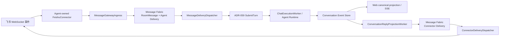

# ADR-063：飞书 Agent 绑定与可靠消息网关

> 状态：**Accepted（V1 已实现）**  
> 日期：2026-07-25  
> 范围：Agent manifest、飞书 Connector、Message Gateway、Message Fabric、Conversation、回复投递  
> 关联：[ADR-045 双向消息系统](46ADR-045双向消息系统与聊天室客户端ADR.md)、[ADR-057 可靠 Conversation 事件流](58ADR-057前后端可靠SSE与Conversation事件流架构ADR.md)、[ADR-059 Conversation 执行内核](60ADR-059Conversation执行内核与可靠命令链路ADR.md)

---

## 1. 背景

V1 将飞书作为 Pudding 的主要且唯一第三方聊天渠道。当前约束是：

- 一个 Agent 最多绑定一个飞书机器人。
- 一个飞书机器人 AppId 只能绑定一个 Agent。
- Agent 必须知道消息来自飞书，而不是 Web。
- 飞书入站消息及 Agent 完整执行结果必须进入 canonical Conversation，使 Web 始终保留最完整事实。
- Agent 的默认终态答复需要可靠返回原飞书消息。
- 飞书发送失败只能重试出站投递，不能重新执行 Agent。

V2 才引入通用第三方聊天 App binding。V1 不提前建设多渠道配置 DSL，也不把飞书凭据放进 WorkspaceChannel 或全局数据库。

## 2. 决策

### 2.1 配置归属

飞书凭据属于 Agent 私有 manifest：

```json
{
  "agentInstanceId": "default.global_general-assistant.6a8",
  "workspaceId": "default",
  "feishu": {
    "enabled": true,
    "appId": "cli_xxx",
    "appSecret": "<secret>",
    "description": "默认助手的飞书机器人",
    "privilegedUserOpenIds": ["ou_xxx"]
  }
}
```

文件位置：

```text
<dataRoot>/agents/<agentId>/manifest.json
```

约束：

1. `enabled=true` 时 `appId`、`appSecret` 必填。
2. 启动时扫描 Agent manifest；不再从 `config/feishu.json` 加载运行时绑定。
3. 重复 AppId 的全部冲突绑定会被拒绝并记录 Error；其它连接器继续启动，不能让两个 Agent 竞争同一个机器人事件流。
4. 凭据只在服务端 manifest reader、connector factory 和 connector 内流动，不投影到通用 Agent DTO、日志或 Conversation metadata。
5. V1 修改 manifest 后需要重启 Pudding 重新装配连接器。
6. `privilegedUserOpenIds` 是该机器人自己的特权指令白名单，只存飞书 sender `open_id`；它不限制普通聊天消息。

`Tests/HarnessAgent.Cli` 可继续读取全局 `config/feishu.json` 做独立协议测试；它不是 Pudding 运行时配置来源。

### 2.2 Connector identity 与渠道事实

内部连接器身份为：

```text
feishu:{agentInstanceId}
```

外部协议身份必须独立保存：

- `externalConversationId`：飞书 `chat_id`
- `externalMessageId`：飞书 `message_id`
- `externalUserId`：飞书 sender `open_id/user_id/union_id`
- `channelId/channelType`：`feishu`

Agent Runtime 收到的 `pudding-message` metadata 包含
`channel_id/channel_type/connector_id/external_conversation_id/external_message_id`，
因此 Agent 不需要从自然语言猜测来源。

所有 `gateway_*` metadata 都是服务端保留字段。只有进程内 Message Gateway 创建的
`SubmitTurnCommand.IsTrustedGatewayIngress=true` 可以保留这些字段；公开 Turn API 提交的同名前缀
会在 `SubmitTurnHandler` 被过滤，防止 Web 客户端伪造 Connector reply route。

### 2.3 飞书系统指令与特权用户

以 `/` 开头的飞书文本先由 `MessageGatewayIngress` 识别为 Pudding 系统指令，禁止先写入
Agent delivery 再由 LLM 猜测是否应执行。处理规则是：

1. `/help`、`/status`、`/whoami` 是只读指令，不要求用户进入特权白名单。
2. `/yolo`、授权、执行控制、记忆写入等可能改变状态的指令属于特权指令。
3. 特权校验必须使用当前 Agent manifest 的 `feishu.privilegedUserOpenIds`，并与事件 sender
   `open_id` 精确比较；不得使用全局飞书白名单把一个机器人的权限扩散到其它 Agent。
4. 未授权、未知、尚未实现和已处理的指令都由 Pudding 生成系统 transcript，并通过 durable
   Connector delivery 回复原飞书消息；默认不创建 `ConversationTurn`、
   `ChatExecutionCommand` 或 Agent delivery。
5. 只有系统指令处理器显式返回 `ForwardToAgent=true` 时，Gateway 才把处理后的
   `AgentMessage` 作为新消息投递给 Agent。原始斜杠指令仍不得直接成为 Agent prompt。
6. Web 与飞书复用同一个 `ISystemCommandHandler`。Web 身份由 Web 鉴权边界保证；飞书身份由
   Agent-owned whitelist 保证。

`/whoami` 只读取 Gateway 从已验证飞书事件传入的 `externalUserId`，并将 sender `open_id`
回复到原飞书消息，同时写入 Web canonical transcript。它不调用 Agent、不查询飞书通讯录，也不
将 ID 写入运行日志。若请求不是来自已验证的飞书消息，处理器返回 ID unavailable，禁止回退到
客户端自报身份。

Gateway 指令回复使用稳定的 message/request/reply 身份；同一飞书 `message_id` 重投不会执行
第二次状态变更，也不会形成第二个 Agent Turn。

### 2.4 权威消息链



入站顺序：

1. 飞书长连接收到 `im.message.receive_v1`。
2. Connector 只做协议解析，生成带 Agent/Workspace/外部消息身份的 `PuddingIngressEnvelope`。
3. Gateway 验证 connector identity 与 Agent manifest 绑定。
4. Gateway 使用稳定 `messageId/clientRequestId` 写 Message Fabric。
5. Agent delivery 被原子 claim 后，通过 `ISubmitTurnHandler` 进入 ADR-059 Conversation 受理事务。
6. Message Fabric delivery 只在 canonical 受理成功后 ack；失败进入 retry/dead-letter。
7. 飞书事件 ACK 只在上述 durable acceptance 成功后返回 200；受理异常返回非 200，允许飞书重投。

V1 将绑定机器人的消息投递到 Agent main Conversation，使 Web 观察到同一份用户消息、过程事件和终态答复。`chat_id` 只作为外部回复路由事实，不替代 canonical `conversationId`。

该选择适用于 V1 的单信任域机器人。若机器人面向互不可信的多个群或用户，必须在开放前进入 V2：按 `(connectorId, externalConversationId)` 建立独立 Conversation 映射与访问控制，禁止把不同信任域的上下文混入同一 main Conversation。

### 2.5 默认回复由系统代投

普通 Agent 终态答复不要求 LLM 调用 `send_message`。

原因：

- LLM 可能忘记调用、重复调用或选择错误目标。
- 终态答复已经是 Conversation 的 committed fact。
- 回复目标与幂等键属于系统路由事实，不应暴露给 LLM 决策。

`ConversationReplyProjectionWorker` 读取成功 Command 的 terminal event，使用稳定
`gateway-reply` message ID 创建 `target=connector` 的 Message Fabric delivery。
`ConnectorDeliveryDispatcher` 再调用飞书 reply API。

`send_message` 仍用于 Agent 主动消息、跨 Agent 消息或显式发送到不同目标；它不是默认答复协议。

### 2.6 可靠性与幂等

| 边界 | 稳定事实/幂等键 | 失败处理 |
|---|---|---|
| 飞书事件 → Gateway | `connectorId + externalMessageId` | 非 200 ACK，飞书重投 |
| Gateway → Message Fabric | 稳定 `MessageId` 与每目标 `DeliveryId` | 重放不新增消息或 delivery |
| Agent delivery → Conversation | 稳定 `clientRequestId/clientMessageId` | ADR-059 幂等受理 |
| terminal → connector delivery | `commandId + connectorId + externalMessageId` | 投影重放复用同一 MessageId |
| connector delivery → 飞书 | MessageId 作为飞书 `uuid` | 独立指数退避，最多 10 次后 dead-letter |

关键不变量：

- 先提交 durable fact，再发布低延迟唤醒。
- 飞书断线、限流或 OpenAPI 错误不重新执行 Agent。
- Web 投影与飞书出站都从同一 terminal event 派生。
- `reply_projected_at` 只表示已创建 durable connector delivery，不表示飞书已发送成功。
- 真正的出站成功状态由 `message_deliveries.status=delivered` 表示。

## 3. 飞书协议实现边界

长连接实现遵循飞书官方 `pbbp2.Frame` wire contract：

- `CONTROL=0`、`DATA=1`
- protobuf fields：SeqID、LogID、service、method、headers、payloadEncoding、payloadType、payload、LogIDNew
- WebSocket frame 分片合并和应用层 `sum/seq/message_id` 分片合并
- event response payload 与 `biz_rt`
- WebSocket open 后立即发送首个 ping（不等待服务端下发的 90/120 秒心跳周期）
- ping/pong 配置更新与断线重连
- 入站事件的消息类型字段是 `event.message.message_type`；`msg_type` 只用于 OpenAPI 出站请求

参考：[飞书官方 Node SDK](https://github.com/larksuite/node-sdk)。

Connector 只把支持的消息事件送进 Gateway。未知事件应确认后忽略，不能因缺少 `chat_id` 形成无限失败重投。

## 4. V1 不做什么

- 不建立通用 `ThirdPartyChatBinding[]` 配置。
- 不允许一个 Agent 绑定多个飞书机器人。
- 不允许一个飞书 AppId 绑定多个 Agent。
- 不把飞书凭据写入数据库或公共 API。
- 不把流式 token 逐片发送到飞书；飞书只接收 committed terminal reply。
- 不让 LLM 决定默认答复是否返回原渠道。
- 不在飞书出站失败时重跑 Agent。

## 5. 验收

自动化：

```powershell
dotnet test .\Tests\PuddingAgent.IntegrationTests\PuddingAgent.IntegrationTests.csproj `
  --filter "FullyQualifiedName~FakeFeishuRoundTripTests|FullyQualifiedName~FeishuCommandInterceptionTests"
dotnet test .\Source\PuddingCoreTests\PuddingCoreTests.csproj --no-restore `
  --filter "FullyQualifiedName~SystemCommandParserTests"
dotnet test .\Source\PuddingPlatformTests\PuddingPlatformTests.csproj --no-restore `
  --filter "FullyQualifiedName~SystemCommandHandlerTests"
dotnet test .\Tests\HarnessAgent.Core.Tests\HarnessAgent.Core.Tests.csproj --no-restore
$env:PUDDING_RUN_FEISHU_LIVE_TESTS = "1"
dotnet test .\Tests\HarnessAgent.Core.Tests\HarnessAgent.Core.Tests.csproj --no-restore `
  --filter "TestCategory=Live"
Remove-Item Env:PUDDING_RUN_FEISHU_LIVE_TESTS
dotnet test .\Source\PuddingPlatformTests\PuddingPlatformTests.csproj --no-restore `
  --filter "FullyQualifiedName~MessageGateway|FullyQualifiedName~MessageFabric"
dotnet build .\Source\PuddingAgent\PuddingAgent.csproj --no-restore
```

Fake 飞书测试保留真实 `MessageGatewayIngress → Message Fabric → MessageDeliveryDispatcher
→ canonical SubmitTurn → terminal reply projection → ConnectorDeliveryDispatcher`。测试双只替代外部
飞书网络和 Agent 执行结果，并断言入站/出站 delivery 都是 `delivered`、Conversation transcript
同时包含入站与终态回复。

飞书 SDK 的人工 copy 验收使用独立 CLI，不启动 Pudding Agent：

```powershell
dotnet run --project .\Tests\HarnessAgent.Cli -- feishu-echo --once
```

它收到一条飞书文本后使用原 `message_id` 调 reply API 原样回复，并以稳定 uuid 防止重复发送。
默认 Harness 测试只验证 token/WebSocket，不再隐式等待或回复真实消息。
`FeishuWebSocketInitialPingTests` 使用本地 WebSocket 服务器锁定两个协议事实：建连后的首帧是
CONTROL/ping；收到真实格式的 pbbp2 DATA/event 后可解析文本并回送带 `biz_rt`
的成功 ACK。事件 fixture 必须使用真实入站字段 `message_type`，禁止用出站的 `msg_type`
造成假阳性。Echo 的 `protocol:` 日志只记录 method/service/type/message_type/message_id/字节数，
不输出凭据或正文。

运行时：

1. 目标 Agent manifest 配置唯一且启用的 `feishu`。
2. 重启后出现 `[Feishu] Loaded 1 Agent-owned connector binding(s)` 和 WebSocket connected 日志。
3. 飞书发送一条带唯一文本的消息。
4. 日志依次出现 `[Feishu] Inbound accepted`、`[MessageGateway] Ingress accepted`、
   `Gateway ingress accepted`、terminal、`Reply projected`、`[ConnectorDelivery] Delivered`。
5. 飞书收到一次最终答复；Web Conversation 同时包含用户消息、执行过程和最终答复。
6. 临时阻断飞书出站后，Agent Command 仍保持 succeeded，只有 connector delivery 重试。
7. 未在 `privilegedUserOpenIds` 的用户发送 `/yolo` 时收到 Permission denied，Runtime mode
   不变且日志中没有该消息对应的 Agent Turn；加入白名单后同一用户可由 Pudding 执行该指令。
8. 任意飞书用户发送 `/whoami` 时收到当前事件 sender `open_id`；Web transcript 同时可见，且
   `chat_execution_commands`、`conversation_turns` 均不新增记录。
