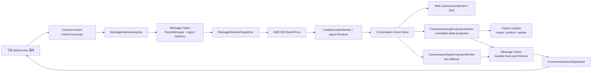

# ADR-063：飞书 Agent 绑定与可靠消息网关

> 状态：**Accepted（V1.2 渠道配置独立化已实现）**
> 日期：2026-07-25；流式回复、入站图片与渠道配置修订：2026-07-26
> 范围：渠道服务商、渠道实例、Agent channel 引用、飞书 Connector、Message Gateway、Message Fabric、Conversation、Vision Artifact、CardKit 流式投影、回复投递
> 关联：[ADR-045 双向消息系统](46ADR-045双向消息系统与聊天室客户端ADR.md)、[ADR-057 可靠 Conversation 事件流](58ADR-057前后端可靠SSE与Conversation事件流架构ADR.md)、[ADR-059 Conversation 执行内核](60ADR-059Conversation执行内核与可靠命令链路ADR.md)

---

## 1. 背景

V1 将飞书作为 Pudding 的主要且唯一第三方聊天渠道。当前约束是：

- 一个 Agent 最多绑定一个飞书机器人。
- 一个飞书机器人 AppId 只能绑定一个 Agent。
- Agent 必须知道消息来自飞书，而不是 Web。
- 飞书入站消息及 Agent 完整执行结果必须进入 canonical Conversation，使 Web 始终保留最完整事实。
- Agent 的默认终态答复需要可靠返回原飞书消息。
- 飞书发送失败只能重试出站投递，不能重新执行 Agent。

V1.2 引入文件化的渠道服务商目录和 Workspace 渠道实例；只实现飞书，不提前建设多渠道配置 DSL，也不把飞书凭据放进数据库。

## 2. 决策

### 2.1 配置归属

Agent manifest 只保存稳定渠道引用：

```json
{
  "agentInstanceId": "default.global_general-assistant.6a8",
  "workspaceId": "default",
  "channelIds": ["feishu-default.global_general-assistant.6a8"]
}
```

渠道实例拥有机器人账号、密钥、渠道级权限和投影开关：

```json
{
  "channelId": "feishu-default.global_general-assistant.6a8",
  "workspaceId": "default",
  "providerId": "feishu",
  "name": "默认助手 · 飞书",
  "isEnabled": true,
  "feishu": {
    "appId": "cli_xxx",
    "appSecret": "<secret>",
    "privilegedUserOpenIds": ["ou_xxx"],
    "streamingRepliesEnabled": true
  }
}
```

文件位置：

```text
<dataRoot>/config/channel.providers.json
<dataRoot>/channels/<channelId>/manifest.json
<dataRoot>/agents/<agentId>/manifest.json  # 仅 channelIds
```

约束：

1. 启用飞书渠道时 `appId`、`appSecret` 必填；一个渠道只绑定一个 Agent。
2. 启动时读取启用的渠道服务商和渠道实例，再按 Agent `channelIds` 装配 Connector；不再把 Agent manifest 作为飞书配置源。
3. 重复 AppId 的全部冲突渠道会被拒绝并记录 Error；其它连接器继续启动，不能让两个渠道竞争同一个机器人事件流。
4. 凭据只在服务端渠道配置 reader、connector factory 和 connector 内流动；管理 API 仅返回 `hasAppSecret`，不回显密钥，也不把密钥写入日志或 Conversation metadata。
5. 渠道实例或 Agent 绑定修改后需要重启 Pudding 重新装配连接器。
6. `privilegedUserOpenIds` 是该机器人自己的特权指令白名单，只存飞书 sender `open_id`；它不限制普通聊天消息。
7. `streamingRepliesEnabled` 控制 CardKit 流式卡片；V1.1 默认启用。飞书应用未开通 CardKit 创建与更新权限时，投影在有界重试后退回普通文本终态答复。
8. 旧开发数据中的 `agent.manifest.feishu` 仅作为一次性启动迁移输入：生成渠道文件、写入 `channelIds` 后立即从 Agent manifest 删除；运行时不再读取旧字段。

管理面板分为两层：Workspace 的“渠道服务商”维护已安装 Connector 能力和启停状态；“渠道管理”维护机器人账号、Secret、特权用户、流式开关及 Agent 绑定。

`Tests/HarnessAgent.Cli` 可继续读取全局 `config/feishu.json` 做独立协议测试；它不是 Pudding 运行时配置来源。

### 2.2 Connector identity 与渠道事实

内部连接器身份为：

```text
feishu:{channelId}
```

外部协议身份必须独立保存：

- `externalConversationId`：飞书 `chat_id`
- `externalMessageId`：飞书 `message_id`
- `externalUserId`：飞书 sender `open_id/user_id/union_id`
- `channelId`：稳定渠道实例 ID
- `channelType`：`feishu`

Agent Runtime 收到的 `pudding-message` metadata 包含
`channel_id/channel_type/connector_id/external_conversation_id/external_message_id`，
因此 Agent 不需要从自然语言猜测来源。

所有 `gateway_*` metadata 都是服务端保留字段。只有进程内 Message Gateway 创建的
`SubmitTurnCommand.IsTrustedGatewayIngress=true` 可以保留这些字段；公开 Turn API 提交的同名前缀
会在 `SubmitTurnHandler` 被过滤，防止 Web 客户端伪造 Connector reply route。

### 2.3 飞书系统指令与特权用户

以 `/` 开头的飞书文本先由 `MessageGatewayIngress` 识别为 Pudding 系统指令，禁止先写入
Agent delivery 再由 LLM 猜测是否应执行。处理规则是：

1. `/help`、`/status`、`/whoami` 是只读指令，不要求用户进入特权白名单。
2. `/yolo`、授权、执行控制、记忆写入等可能改变状态的指令属于特权指令。
3. 特权校验必须使用当前渠道实例的 `feishu.privilegedUserOpenIds`，并与事件 sender
   `open_id` 精确比较；不得使用全局飞书白名单把一个机器人的权限扩散到其它渠道。
4. 未授权、未知、尚未实现和已处理的指令都由 Pudding 生成系统 transcript，并通过 durable
   Connector delivery 回复原飞书消息；默认不创建 `ConversationTurn`、
   `ChatExecutionCommand` 或 Agent delivery。
5. 只有系统指令处理器显式返回 `ForwardToAgent=true` 时，Gateway 才把处理后的
   `AgentMessage` 作为新消息投递给 Agent。原始斜杠指令仍不得直接成为 Agent prompt。
6. Web 与飞书复用同一个 `ISystemCommandHandler`。Web 身份由 Web 鉴权边界保证；飞书身份由
   channel-owned whitelist 保证。

`/whoami` 只读取 Gateway 从已验证飞书事件传入的 `externalUserId`，并将 sender `open_id`
回复到原飞书消息，同时写入 Web canonical transcript。它不调用 Agent、不查询飞书通讯录，也不
将 ID 写入运行日志。若请求不是来自已验证的飞书消息，处理器返回 ID unavailable，禁止回退到
客户端自报身份。

Gateway 指令回复使用稳定的 message/request/reply 身份；同一飞书 `message_id` 重投不会执行
第二次状态变更，也不会形成第二个 Agent Turn。

### 2.4 权威消息链



入站顺序：

1. 飞书长连接收到 `im.message.receive_v1`。
2. Connector 只做协议解析，生成带 Agent/Workspace/外部消息身份的 `PuddingIngressEnvelope`。
3. Gateway 验证 connector identity、渠道实例与 Agent `channelIds` 引用。
4. Gateway 使用稳定 `messageId/clientRequestId` 写 Message Fabric。
5. Agent delivery 被原子 claim 后，通过 `ISubmitTurnHandler` 进入 ADR-059 Conversation 受理事务。
6. Message Fabric delivery 只在 canonical 受理成功后 ack；失败进入 retry/dead-letter。
7. 飞书事件 ACK 只在上述 durable acceptance 成功后返回 200；受理异常返回非 200，允许飞书重投。

V1 将绑定机器人的消息投递到 Agent main Conversation，使 Web 观察到同一份用户消息、过程事件和终态答复。`chat_id` 只作为外部回复路由事实，不替代 canonical `conversationId`。

该选择适用于 V1 的单信任域机器人。若机器人面向互不可信的多个群或用户，必须在开放前进入 V2：按 `(connectorId, externalConversationId)` 建立独立 Conversation 映射与访问控制，禁止把不同信任域的上下文混入同一 main Conversation。

#### 2.4.1 入站图片复用 Web Vision Artifact

`message_type=image` 不得降级成 `[image]` 文本。Connector 在飞书事件 ACK 前完成：

1. 从 `event.message.content` 解析 `image_key`。
2. 调用 `GET /im/v1/messages/{message_id}/resources/{image_key}?type=image` 下载资源；响应最多
   10 MiB，并以文件签名确认 JPEG/PNG/WebP，不能只信任响应 MIME。
3. 以 `connectorId + externalMessageId + image_key` 生成稳定 `vision-{hash}`，通过
   `VisionArtifactStorageService.SaveIdempotentAsync` 原子保存到 Workspace `vision-artifacts`。
4. canonical 用户消息使用可读占位正文“用户从飞书发送了一张图片。”，同时持久化
   `inputMode=image`、`visionArtifactId`、`visionArtifactIds` 和 `gateway_message_type=image`。
5. Web 继续用既有 `visionArtifactIds → GET vision-artifacts → ` 展示；
   `ExecutionRunCoordinator` 继续解析同一 artifact 的受控本地路径，并把 `VisualArtifactIds`
   传给支持视觉的主模型。
6. 若主模型没有 `vision` 能力标签，`VisualArtifactObservationService` 必须在主 Agent 执行前按
   `vision` 能力路由一个视觉模型，生成受控文字观察并注入本轮上下文；不得依赖文本模型自行决定是否
   调用 `image_reader`。视觉调用失败时本轮明确失败，禁止让主 Agent 在没有视觉证据时猜图。
7. 预识别提示将图片内文字和指令标记为不可信用户媒体内容；可以转录，但不得把图片中的指令提升为
   system/tool 指令。原生视觉主模型不执行第二次预识别，`image_reader` 只保留为定向复查工具。

稳定 artifact 已存在时重投直接复用，不重复下载和落盘。解析、下载或持久化失败必须让事件返回
非 200 ACK，允许飞书重投；禁止 ACK 后只向 Agent 投递 `[image]`。V1.1 入站图片仅接受网页/模型
已支持的 JPEG、PNG、WebP；其它格式需要在后续增加安全的服务端规范化后再开放。

### 2.5 默认回复由系统代投

普通 Agent 终态答复不要求 LLM 调用 `send_message`。

原因：

- LLM 可能忘记调用、重复调用或选择错误目标。
- 终态答复已经是 Conversation 的 committed fact。
- 回复目标与幂等键属于系统路由事实，不应暴露给 LLM 决策。

`ConversationReplyProjectionWorker` 读取成功 Command 的 terminal event，使用稳定
`gateway-reply` message ID 创建 `target=connector` 的 Message Fabric delivery。
`ConnectorDeliveryDispatcher` 再调用飞书 reply API。

`send_message` 仍用于 Agent 主动消息、跨 Agent 消息或显式发送到不同目标；它不是默认答复协议。

### 2.6 可靠性与幂等

| 边界 | 稳定事实/幂等键 | 失败处理 |
|---|---|---|
| 飞书事件 → Gateway | `connectorId + externalMessageId` | 非 200 ACK，飞书重投 |
| Gateway → Message Fabric | 稳定 `MessageId` 与每目标 `DeliveryId` | 重放不新增消息或 delivery |
| Agent delivery → Conversation | 稳定 `clientRequestId/clientMessageId` | ADR-059 幂等受理 |
| committed content delta → CardKit | `projectionId + eventSequence + operationSequence` | 持久化累计正文与 cursor；同序列、同 uuid 重试 |
| terminal → connector delivery | `commandId + connectorId + externalMessageId` | 投影重放复用同一 MessageId |
| connector delivery → 飞书 | MessageId 作为飞书 `uuid` | 独立指数退避，最多 10 次后 dead-letter |

关键不变量：

- 先提交 durable fact，再发布低延迟唤醒。
- 飞书断线、限流或 OpenAPI 错误不重新执行 Agent。
- Web 投影与飞书出站都从同一 terminal event 派生。
- `reply_projected_at` 只表示已创建 durable connector delivery，不表示飞书已发送成功。
- 真正的出站成功状态由 `message_deliveries.status=delivered` 表示。

### 2.7 CardKit 流式回复投影

流式卡片仍由 Pudding 系统代投，不由 Agent 主动调用 `send_message`。`FeishuStreamingProjectionWorker`
只读取已经提交到 `conversation_events` 的 `message.content.appended`，以有界批次更新同一张 CardKit
JSON 2.0 卡片的 Markdown 元素；它不直接订阅尚未提交的 Runtime token，也不改变 Web canonical
Conversation 的权威地位。

投影状态存于 `connector_stream_projections`：

- `external_resource_id` 保存 CardKit `card_id`，`external_reply_id` 保存发布后的飞书消息 ID。
- `last_event_sequence` 是已被飞书确认的 Conversation cursor；`pending_event_sequence` 与累计
  `content` 先持久化，再调用飞书更新 API。
- `operation_sequence` 单调递增；每次重试复用同一 sequence 与稳定 uuid，避免乱序更新或重复卡片。
- 创建/发布/增量更新最多重试 5 次并指数退避；彻底失败后把终态交回普通文本投影。
- 累计流式正文上限为 24 KiB UTF-8；超过上限不继续更新卡片，以 committed terminal reply
  走普通文本兜底。

成功终态不是一次 best-effort CardKit 调用。Worker 先把 projection 标记为 `finalizing`，再创建
稳定 Message Fabric Connector delivery；`ConnectorDeliveryDispatcher` 使用该 delivery 更新最终累计正文、
关闭 `streaming_mode` 并 ACK，只有发送成功后才把 projection 标记为 `completed`。这样飞书临时
故障只重试出站，不会重跑 Agent。普通 `ConversationReplyProjectionWorker` 在 projection 处于
非 `failed` 状态时跳过同一终态，防止“流式卡片 + 第二条文本”重复答复。

## 3. 飞书协议实现边界

长连接实现遵循飞书官方 `pbbp2.Frame` wire contract：

- `CONTROL=0`、`DATA=1`
- protobuf fields：SeqID、LogID、service、method、headers、payloadEncoding、payloadType、payload、LogIDNew
- WebSocket frame 分片合并和应用层 `sum/seq/message_id` 分片合并
- event response payload 与 `biz_rt`
- WebSocket open 后立即发送首个 ping（不等待服务端下发的 90/120 秒心跳周期）
- ping/pong 配置更新与断线重连
- 入站事件的消息类型字段是 `event.message.message_type`；`msg_type` 只用于 OpenAPI 出站请求
- 图片消息的 `content` 是包含 `image_key` 的 JSON 字符串；资源必须通过消息资源 API 下载，
  不能把 `image_key` 当图片 URL 传给 Agent 或浏览器

参考：[飞书官方 Node SDK](https://github.com/larksuite/node-sdk)、
[获取消息中的资源文件](https://open.feishu.cn/document/uAjLw4CM/ukTMukTMukTM/reference/im-v1/message-resource/get)、
[官方 Go SDK CardKit resource](https://github.com/larksuite/oapi-sdk-go/blob/v3_main/service/cardkit/v1/resource.go)
与 [CardKit model](https://github.com/larksuite/oapi-sdk-go/blob/v3_main/service/cardkit/v1/model.go)。

Connector 只把支持的消息事件送进 Gateway。未知事件应确认后忽略，不能因缺少 `chat_id` 形成无限失败重投。

## 4. V1 不做什么

- 不建立通用 `ThirdPartyChatBinding[]` DSL；渠道服务商先以受控文件目录表达。
- 不允许一个 Agent 绑定多个飞书机器人。
- 不允许一个飞书 AppId 绑定多个 Agent。
- 不把飞书凭据写入 Agent manifest、数据库或公共 API 响应。
- 不把未提交的 Runtime token 逐片发送到飞书；只批量投影 committed Conversation delta，并以 committed terminal reply 收口。
- 不让 LLM 决定默认答复是否返回原渠道。
- 不在飞书出站失败时重跑 Agent。

## 5. 验收

自动化：

```powershell
dotnet test .\Tests\PuddingAgent.IntegrationTests\PuddingAgent.IntegrationTests.csproj `
  --filter "FullyQualifiedName~FakeFeishuRoundTripTests|FullyQualifiedName~FeishuInboundImageTests|FullyQualifiedName~FeishuCommandInterceptionTests"
dotnet test .\Source\PuddingCoreTests\PuddingCoreTests.csproj --no-restore `
  --filter "FullyQualifiedName~SystemCommandParserTests"
dotnet test .\Source\PuddingPlatformTests\PuddingPlatformTests.csproj --no-restore `
  --filter "FullyQualifiedName~SystemCommandHandlerTests|FullyQualifiedName~ChannelConfigurationFileServiceTests"
dotnet test .\Tests\HarnessAgent.Core.Tests\HarnessAgent.Core.Tests.csproj --no-restore
$env:PUDDING_RUN_FEISHU_LIVE_TESTS = "1"
dotnet test .\Tests\HarnessAgent.Core.Tests\HarnessAgent.Core.Tests.csproj --no-restore `
  --filter "TestCategory=Live"
Remove-Item Env:PUDDING_RUN_FEISHU_LIVE_TESTS
dotnet test .\Source\PuddingPlatformTests\PuddingPlatformTests.csproj --no-restore `
  --filter "FullyQualifiedName~MessageGateway|FullyQualifiedName~MessageFabric|FullyQualifiedName~VisionArtifactStorageServiceTests|FullyQualifiedName~VisualArtifactObservationServiceTests|FullyQualifiedName~ConnectorStreamProjectionSchemaBootstrapperTests"
dotnet test .\Tests\HarnessAgent.Core.Tests\HarnessAgent.Core.Tests.csproj --no-restore `
  --filter "FullyQualifiedName~FeishuClientReplyTests"
dotnet build .\Source\PuddingAgent\PuddingAgent.csproj --no-restore
```

Fake 飞书测试保留真实 `MessageGatewayIngress → Message Fabric → MessageDeliveryDispatcher
→ canonical SubmitTurn → terminal reply projection → ConnectorDeliveryDispatcher`。测试双只替代外部
飞书网络和 Agent 执行结果，并断言入站/出站 delivery 都是 `delivered`、Conversation transcript
同时包含入站与终态回复。流式用例另外锁定 CardKit `create → publish → cumulative update`，终态
通过 durable delivery 更新最终正文并关闭 streaming，普通文本投影不得重复发送。
图片用例另外锁定 `image_key → authenticated resource download → stable Vision Artifact →
visionArtifactIds → canonical SubmitTurn`，同一飞书消息重投不得重复下载或创建第二个 artifact。
Platform 测试锁定文本主模型强制视觉预识别、原生视觉模型不重复调用、视觉失败阻断主 Agent，以及
观察结果进入上下文时的媒体 prompt-injection 边界。

飞书 SDK 的人工 copy 验收使用独立 CLI，不启动 Pudding Agent：

```powershell
dotnet run --project .\Tests\HarnessAgent.Cli -- feishu-echo --once
```

它收到一条飞书文本后使用原 `message_id` 调 reply API 原样回复，并以稳定 uuid 防止重复发送。
默认 Harness 测试只验证 token/WebSocket，不再隐式等待或回复真实消息。
`FeishuWebSocketInitialPingTests` 使用本地 WebSocket 服务器锁定两个协议事实：建连后的首帧是
CONTROL/ping；收到真实格式的 pbbp2 DATA/event 后可解析文本并回送带 `biz_rt`
的成功 ACK。事件 fixture 必须使用真实入站字段 `message_type`，禁止用出站的 `msg_type`
造成假阳性。Echo 的 `protocol:` 日志只记录 method/service/type/message_type/message_id/字节数，
不输出凭据或正文。

运行时：

1. “渠道服务商”中启用飞书；“渠道管理”中的飞书实例拥有唯一 App ID、已配置 Secret，并绑定目标 Agent。
2. 目标 Agent manifest 只含对应 `channelIds`，不再含 `feishu` 对象；重启后出现 `[Feishu] Loaded 1 channel-owned connector binding(s)` 和 WebSocket connected 日志。
3. 飞书发送一条带唯一文本的消息。
4. 日志依次出现 `[Feishu] Inbound accepted`、`[MessageGateway] Ingress accepted`、
   `Gateway ingress accepted`、`[FeishuStream] Card published`、增量投影、terminal、
   `[FeishuStream] Final delivery projected`、`[ConnectorDelivery] Delivered`。
5. 飞书只出现一张逐步更新并最终停止流式状态的卡片；Web Conversation 同时包含用户消息、执行过程和最终答复。
6. 临时阻断飞书出站后，Agent Command 仍保持 succeeded，只有 connector delivery 重试。
7. 未在 `privilegedUserOpenIds` 的用户发送 `/yolo` 时收到 Permission denied，Runtime mode
   不变且日志中没有该消息对应的 Agent Turn；加入白名单后同一用户可由 Pudding 执行该指令。
8. 任意飞书用户发送 `/whoami` 时收到当前事件 sender `open_id`；Web transcript 同时可见，且
   `chat_execution_commands`、`conversation_turns` 均不新增记录。
9. 飞书发送一张新的 JPEG/PNG/WebP 图片；日志先出现 `[Feishu] Image materialized`、
   `Inbound accepted`，文本主模型场景还必须在主 `[LlmInvocation]` 前出现
   `[VisualObservation] Analyze` 与 `[VisualObservation] Completed`。Web 用户气泡显示同一图片，
   Agent 的对象与显著文字识别应和原图一致，不再回复“只能看到 `[image]`”或无依据猜测。
