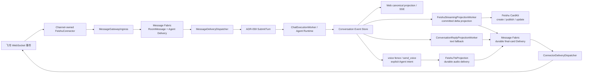

# ADR-063：飞书 Agent 绑定与可靠消息网关

> 状态：**Accepted（V1.5 入站语音与 ASR 双路由已实现）**
> 日期：2026-07-25；流式回复、入站图片与渠道配置修订：2026-07-26；共享 `/status` 修订：2026-07-28；显式语音回复、入站语音与 ASR 双路由修订：2026-07-31
> 范围：渠道服务商、渠道实例、Agent channel 引用、飞书 Connector、Message Gateway、Message Fabric、Conversation、Vision/Audio Artifact、CardKit 流式投影、TTS 语音回复、ASR、回复投递
> 关联：[ADR-045 双向消息系统](46ADR-045双向消息系统与聊天室客户端ADR.md)、[ADR-057 可靠 Conversation 事件流](58ADR-057前后端可靠SSE与Conversation事件流架构ADR.md)、[ADR-059 Conversation 执行内核](60ADR-059Conversation执行内核与可靠命令链路ADR.md)

---

## 1. 背景

V1 将飞书作为 Pudding 的主要且唯一第三方聊天渠道。当前约束是：

- 一个 Agent 最多绑定一个飞书机器人。
- 一个飞书机器人 AppId 只能绑定一个 Agent。
- Agent 必须知道消息来自飞书，而不是 Web。
- 飞书入站消息及 Agent 完整执行结果必须进入 canonical Conversation，使 Web 始终保留最完整事实。
- Agent 的默认终态答复需要可靠返回原飞书消息。
- 飞书发送失败只能重试出站投递，不能重新执行 Agent。

V1.2 引入文件化的渠道服务商目录和 Workspace 渠道实例；只实现飞书，不提前建设多渠道配置 DSL，也不把飞书凭据放进数据库。

## 2. 决策

### 2.1 配置归属

Agent manifest 只保存稳定渠道引用：

```json
{
  "agentInstanceId": "default.global_general-assistant.6a8",
  "workspaceId": "default",
  "channelIds": ["feishu-default.global_general-assistant.6a8"]
}
```

渠道实例拥有机器人账号、密钥、渠道级权限和投影开关：

```json
{
  "channelId": "feishu-default.global_general-assistant.6a8",
  "workspaceId": "default",
  "providerId": "feishu",
  "name": "默认助手 · 飞书",
  "isEnabled": true,
  "feishu": {
    "appId": "cli_xxx",
    "appSecret": "<secret>",
    "privilegedUserOpenIds": ["ou_xxx"],
    "streamingRepliesEnabled": true
  }
}
```

文件位置：

```text
<dataRoot>/config/channel.providers.json
<dataRoot>/channels/<channelId>/manifest.json
<dataRoot>/agents/<agentId>/manifest.json  # 仅 channelIds
```

约束：

1. 启用飞书渠道时 `appId`、`appSecret` 必填；一个渠道只绑定一个 Agent。
2. 启动时读取启用的渠道服务商和渠道实例，再按 Agent `channelIds` 装配 Connector；不再把 Agent manifest 作为飞书配置源。
3. 重复 AppId 的全部冲突渠道会被拒绝并记录 Error；其它连接器继续启动，不能让两个渠道竞争同一个机器人事件流。
4. 凭据只在服务端渠道配置 reader、connector factory 和 connector 内流动；管理 API 仅返回 `hasAppSecret`，不回显密钥，也不把密钥写入日志或 Conversation metadata。
5. 渠道实例或 Agent 绑定修改后需要重启 Pudding 重新装配连接器。
6. `privilegedUserOpenIds` 是该机器人自己的特权指令白名单，只存飞书 sender `open_id`；它不限制普通聊天消息。
7. `streamingRepliesEnabled` 控制 CardKit 流式卡片；V1.1 默认启用。飞书应用未开通 CardKit 创建与更新权限时，投影在有界重试后退回普通文本终态答复。
8. 旧开发数据中的 `agent.manifest.feishu` 仅作为一次性启动迁移输入：生成渠道文件、写入 `channelIds` 后立即从 Agent manifest 删除；运行时不再读取旧字段。

管理面板分为两层：Workspace 的“渠道服务商”维护已安装 Connector 能力和启停状态；“渠道管理”维护机器人账号、Secret、特权用户、流式开关及 Agent 绑定。

`Tests/HarnessAgent.Cli` 可继续读取全局 `config/feishu.json` 做独立协议测试；它不是 Pudding 运行时配置来源。

### 2.2 Connector identity 与渠道事实

内部连接器身份为：

```text
feishu:{channelId}
```

外部协议身份必须独立保存：

- `externalConversationId`：飞书 `chat_id`
- `externalMessageId`：飞书 `message_id`
- `externalUserId`：飞书 sender `open_id/user_id/union_id`
- `channelId`：稳定渠道实例 ID
- `channelType`：`feishu`

Agent Runtime 收到的 `pudding-message` metadata 包含
`channel_id/channel_type/connector_id/external_conversation_id/external_message_id`，
因此 Agent 不需要从自然语言猜测来源。

所有 `gateway_*` metadata 都是服务端保留字段。只有进程内 Message Gateway 创建的
`SubmitTurnCommand.IsTrustedGatewayIngress=true` 可以保留这些字段；公开 Turn API 提交的同名前缀
会在 `SubmitTurnHandler` 被过滤，防止 Web 客户端伪造 Connector reply route。

### 2.3 飞书系统指令与特权用户

以 `/` 开头的飞书文本先由 `MessageGatewayIngress` 识别为 Pudding 系统指令，禁止先写入
Agent delivery 再由 LLM 猜测是否应执行。处理规则是：

1. `/help`、`/status`、`/whoami` 是只读指令，不要求用户进入特权白名单。
2. `/yolo`、授权、执行控制、记忆写入等可能改变状态的指令属于特权指令。
3. 特权校验必须使用当前渠道实例的 `feishu.privilegedUserOpenIds`，并与事件 sender
   `open_id` 精确比较；不得使用全局飞书白名单把一个机器人的权限扩散到其它渠道。
4. 未授权、未知、尚未实现和已处理的指令都由 Pudding 生成系统 transcript，并通过 durable
   Connector delivery 回复原飞书消息；默认不创建 `ConversationTurn`、
   `ChatExecutionCommand` 或 Agent delivery。
5. 只有系统指令处理器显式返回 `ForwardToAgent=true` 时，Gateway 才把处理后的
   `AgentMessage` 作为新消息投递给 Agent。原始斜杠指令仍不得直接成为 Agent prompt。
6. Web 与飞书复用同一个 `ISystemCommandHandler`。Web 身份由 Web 鉴权边界保证；飞书身份由
   channel-owned whitelist 保证。

Web Composer 与飞书 Gateway 只负责识别斜杠前缀和构造经过各自身份边界验证的
`SystemCommandRequest`；命令解析、授权、执行、幂等与 transcript 持久化都属于
`ISystemCommandHandler`。Web 不得再为 `/status`、`/help`、`/whoami` 等只读指令分别实现
本地处理器；除承担后继会话 UI 切换的 `/compact` 外，所有 `/` 开头的 Web 输入都进入共享端点。

`/whoami` 只读取 Gateway 从已验证飞书事件传入的 `externalUserId`，并将 sender `open_id`
回复到原飞书消息，同时写入 Web canonical transcript。它不调用 Agent、不查询飞书通讯录，也不
将 ID 写入运行日志。若请求不是来自已验证的飞书消息，处理器返回 ID unavailable，禁止回退到
客户端自报身份。

`/status` 是只读、非特权指令。`ISystemStatusSnapshotProvider` 从执行期的权威边界读取当前
Agent Profile、Provider/Model、模型上下文容量、`ContextHealthSnapshot`、canonical Session
状态、运行中子代理数和 Runtime mode/error window，再由共享 Handler 格式化为 Web/飞书均可
展示的 Markdown。上下文必须显示 `remaining / effective`、used、usage ratio、health state、
usage source/confidence；某个只读数据源不可用时返回部分状态与 warning，不得调用 Agent 补猜。
Context usage 的优先级是 provider usage → 当前进程 snapshot → Memory active messages；服务重启后
这些来源均为空但 canonical `ChatMessages` 仍有历史时，只读取最近 500 条做 tokenizer 估算，并将
source 标记为 `canonical_chat_transcript`、confidence 标记为 `estimated`。禁止因运行时缓存丢失而
把有历史的会话显示为 0 used，也禁止为状态查询全量加载无界 transcript。
`/status` 的用户消息和系统回复写入 canonical transcript，但不会创建 `ConversationTurn`、
`ChatExecutionCommand` 或 Agent delivery。

`/compact` 是会改变会话状态的特权指令。白名单校验通过后，`ISystemCommandHandler` 必须调用
与 Web 相同的 `IRequestCompactionHandler`，使用稳定 `clientRequestId` 作为 `compactionId`；
不得直接调用压缩服务或把原始指令投递给 Agent。成功回复包含压缩消息数、压缩前后 token 数与
后继 Conversation，`ICompactionSessionSuccessor` 同时持久化 Agent 的新主会话，因此下一条飞书
消息进入后继 Conversation。压缩失败也要形成系统 transcript 并可靠回复飞书。

Gateway 指令回复使用稳定的 message/request/reply 身份；同一飞书 `message_id` 重投不会执行
第二次状态变更，也不会形成第二个 Agent Turn。幂等查询不能限定当前 Conversation：`/compact`
成功后主会话已经切换，重投仍须通过稳定 `clientRequestId + responseMessageId` 命中旧会话结果。

### 2.4 权威消息链



入站顺序：

1. 飞书长连接收到 `im.message.receive_v1`。
2. Connector 只做协议解析，生成带 Agent/Workspace/外部消息身份的 `PuddingIngressEnvelope`。
3. Gateway 验证 connector identity、渠道实例与 Agent `channelIds` 引用。
4. Gateway 使用稳定 `messageId/clientRequestId` 写 Message Fabric。
5. Agent delivery 被原子 claim 后，通过 `ISubmitTurnHandler` 进入 ADR-059 Conversation 受理事务。
6. Message Fabric delivery 只在 canonical 受理成功后 ack；失败进入 retry/dead-letter。
7. 飞书事件 ACK 只在上述 durable acceptance 成功后返回 200；受理异常返回非 200，允许飞书重投。

V1 将绑定机器人的消息投递到 Agent main Conversation，使 Web 观察到同一份用户消息、过程事件和终态答复。`chat_id` 只作为外部回复路由事实，不替代 canonical `conversationId`。

该选择适用于 V1 的单信任域机器人。若机器人面向互不可信的多个群或用户，必须在开放前进入 V2：按 `(connectorId, externalConversationId)` 建立独立 Conversation 映射与访问控制，禁止把不同信任域的上下文混入同一 main Conversation。

#### 2.4.1 入站图片复用 Web Vision Artifact

`message_type=image` 不得降级成 `[image]` 文本。Connector 在飞书事件 ACK 前完成：

1. 从 `event.message.content` 解析 `image_key`。
2. 调用 `GET /im/v1/messages/{message_id}/resources/{image_key}?type=image` 下载资源；响应最多
   50 MiB，并以文件签名确认 JPEG/PNG/WebP，不能只信任响应 MIME。
3. 以 `connectorId + externalMessageId + image_key` 生成稳定 `vision-{hash}`，通过
   `VisionArtifactStorageService.SaveIdempotentAsync` 原子保存到 Workspace `vision-artifacts`。
4. canonical 用户消息使用可读占位正文“用户从飞书发送了一张图片。”，同时持久化
   `inputMode=image`、`visionArtifactId`、`visionArtifactIds` 和 `gateway_message_type=image`。
5. Web 继续用既有 `visionArtifactIds → GET vision-artifacts → ` 展示；
   `ExecutionRunCoordinator` 继续解析同一 artifact 的受控本地路径，并把 `VisualArtifactIds`
   传给支持视觉的主模型。
6. 若主模型没有 `vision` 能力标签，`VisualArtifactObservationService` 必须在主 Agent 执行前按
   `vision` 能力路由一个视觉模型，生成受控文字观察并注入本轮上下文；不得依赖文本模型自行决定是否
   调用 `image_reader`。视觉调用失败时本轮明确失败，禁止让主 Agent 在没有视觉证据时猜图。
7. 预识别提示将图片内文字和指令标记为不可信用户媒体内容；可以转录，但不得把图片中的指令提升为
   system/tool 指令。原生视觉主模型不执行第二次预识别，`image_reader` 只保留为定向复查工具。

稳定 artifact 已存在时重投直接复用，不重复下载和落盘。解析、下载或持久化失败必须让事件返回
非 200 ACK，允许飞书重投；禁止 ACK 后只向 Agent 投递 `[image]`。V1.1 入站图片仅接受网页/模型
已支持的 JPEG、PNG、WebP；其它格式需要在后续增加安全的服务端规范化后再开放。

### 2.5 默认回复由系统代投

普通 Agent 终态答复不要求 LLM 调用 `send_message`。

原因：

- LLM 可能忘记调用、重复调用或选择错误目标。
- 终态答复已经是 Conversation 的 committed fact。
- 回复目标与幂等键属于系统路由事实，不应暴露给 LLM 决策。

`ConversationReplyProjectionWorker` 读取成功 Command 的 terminal event，使用稳定
`gateway-reply` message ID 创建 `target=connector` 的 Message Fabric delivery。
`ConnectorDeliveryDispatcher` 再调用飞书 reply API。

`send_message` 仍用于 Agent 主动消息、跨 Agent 消息或显式发送到不同目标；它不是默认答复协议。

### 2.6 可靠性与幂等

| 边界 | 稳定事实/幂等键 | 失败处理 |
|---|---|---|
| 飞书事件 → Gateway | `connectorId + externalMessageId` | 非 200 ACK，飞书重投 |
| Gateway → Message Fabric | 稳定 `MessageId` 与每目标 `DeliveryId` | 重放不新增消息或 delivery |
| Agent delivery → Conversation | 稳定 `clientRequestId/clientMessageId` | ADR-059 幂等受理 |
| committed content delta → CardKit | `projectionId + eventSequence + operationSequence` | 持久化累计正文与 cursor；同序列、同 uuid 重试 |
| terminal → connector delivery | `commandId + connectorId + externalMessageId` | 投影重放复用同一 MessageId |
| voice fence terminal → TTS delivery | `gateway-reply-tts + commandId + connectorId + externalMessageId` | 与文本/卡片分离，合成、上传或发送失败只重试语音 delivery |
| `send_voice` → TTS delivery | `gateway-reply-tts + commandId + toolCallId + connectorId + externalMessageId` | 只允许当前 Feishu Turn 的受信任路由；重放同一工具调用不重复发送 |
| connector delivery → 飞书 | MessageId 作为飞书 `uuid` | 独立指数退避，最多 10 次后 dead-letter |

关键不变量：

- 先提交 durable fact，再发布低延迟唤醒。
- 飞书断线、限流或 OpenAPI 错误不重新执行 Agent。
- Web 投影与飞书出站都从同一 terminal event 派生。
- `reply_projected_at` 只表示已创建 durable connector delivery，不表示飞书已发送成功。
- 真正的出站成功状态由 `message_deliveries.status=delivered` 表示。

### 2.7 CardKit 流式回复投影

流式卡片仍由 Pudding 系统代投，不由 Agent 主动调用 `send_message`。`FeishuStreamingProjectionWorker`
只读取已经提交到 `conversation_events` 的 `message.content.appended`，以有界批次更新同一张 CardKit
JSON 2.0 卡片的 Markdown 元素；它不直接订阅尚未提交的 Runtime token，也不改变 Web canonical
Conversation 的权威地位。

投影状态存于 `connector_stream_projections`：

- `external_resource_id` 保存 CardKit `card_id`，`external_reply_id` 保存发布后的飞书消息 ID。
- `last_event_sequence` 是已被飞书确认的 Conversation cursor；`pending_event_sequence` 与累计
  `content` 先持久化，再调用飞书更新 API。
- `operation_sequence` 单调递增；每次重试复用同一 sequence 与稳定 uuid，避免乱序更新或重复卡片。
- 创建/发布/增量更新最多重试 5 次并指数退避；彻底失败后把终态交回普通文本投影。
- 累计流式正文上限为 24 KiB UTF-8；超过上限不继续更新卡片，以 committed terminal reply
  走普通文本兜底。

成功终态不是一次 best-effort CardKit 调用。Worker 先把 projection 标记为 `finalizing`，再创建
稳定 Message Fabric Connector delivery；`ConnectorDeliveryDispatcher` 使用该 delivery 更新最终累计正文、
关闭 `streaming_mode` 并 ACK，只有发送成功后才把 projection 标记为 `completed`。这样飞书临时
故障只重试出站，不会重跑 Agent。普通 `ConversationReplyProjectionWorker` 在 projection 处于
非 `failed` 状态时跳过同一终态，防止“流式卡片 + 第二条文本”重复答复。

### 2.8 可替换 TTS 与飞书语音回复

TTS 的业务入口统一为 `IVoiceSynthesisService`。Web `VoiceController` 与飞书
`FeishuTtsDeliveryService` 都不得直接构造 DashScope/Qwen Provider；共享服务从
`config/voice/providers.json` 解析启用的 Provider 与模型，再通过 `IVoiceProviderFactory`
创建对应 `ITtsProvider`。显式切换 Provider 且未指定模型时，必须选择该 Provider 自己的默认
TTS 模型，不能误用其它 Provider 的全局默认模型。当前实现仍使用已有 DashScope/Qwen/CosyVoice
适配器，新增服务来源只需扩展 Provider 工厂/适配器，不改变 Web 或飞书渠道代码。

飞书渠道实例增加：

- `ttsRepliesEnabled`：默认关闭；开启后允许 Agent 通过 `voice` Markdown 围栏或 `send_voice`
  工具显式发送语音；普通终态答复仍只发送文字。
- `ttsVoice`：渠道级音色，默认 `Cherry`；Provider 与模型仍由系统语音配置统一选择。

入站时把开关与音色快照进受信任的 `gateway_*` metadata，保证执行期间修改配置不会改变本次投影。
Agent 可使用如下 Provider-neutral 协议声明语音，不要求 DeepSeek、Qwen 等模型理解飞书 API：

````markdown
```voice
今天天气真好
```
````

该协议必须进入 Agent 实际收到的系统提示，而不能只存在于渠道投影代码或文档中。
`SystemPromptBuilder.AppendVoiceOutputProtocol` 是唯一规则来源，`SystemPromptBuilder` 的分层提示入口与
`ContextPipeline` 的动态 SKILLS 层都复用它。系统提示要求 Agent 从当前 `pudding-message`
信封的 `channel_type=feishu` metadata 判断是否适用，并明确区分：

- `send_voice`：仅语音、立即发送；只传朗读文本，不传目标 ID，成功后不得再输出确认文字。
- `voice` 围栏：最终答复的显式协议；每个正文非空、不可嵌套，多个围栏按顺序合并朗读，总计不超过
  1000 字符。普通文字可以与围栏共存。
- V1 无论纯围栏还是混合回复，都先原样显示完整最终 Markdown（包括围栏），再追加语音。

这份协议位于动态 SKILLS 层，因此现有 Session 的静态提示缓存不会阻止规则更新；旧的
`voice.enabled` / `voice.tts_text` 消息字段提示不得再进入 Agent system prompt。

`AgentReplyVoiceDirective` 在 committed terminal reply 上统一解析该协议：

- 只要存在有效的非空 `voice` 围栏，V1 都先把 Agent 完整原始 Markdown（包括围栏和围栏正文）
  作为文字/CardKit 终态发送，再追加合并后的语音 delivery；纯围栏回复同样如此。
- 保留围栏是 V1 的可观测性决策，便于直接在飞书客户端核对 Agent 实际输出。后续如改为隐藏，
  必须作为独立的渠道呈现策略演进，不能修改 canonical terminal fact。
- 普通回复、空围栏或未闭合围栏保持原样，只发送文字。
- 渠道未开启 TTS 或语音正文超过 1000 字符时，不丢内容：完整原始 Markdown 照常发送，
  但不创建语音 delivery。

流式 CardKit 按 committed delta 原样投影，包括可能被 token 拆分的 `voice` 开围栏、围栏正文与
结束围栏；终态仍以完整原始 Markdown 完成卡片，再排队语音。围栏在流式和终态中可见是预期行为，
不得因 TTS 解析而改写或延迟 canonical 文本投影。

`send_voice` 是另一条显式入口，只接受语音文本，不接受收件人或 Connector 参数。工具从当前
main Conversation Turn 的受信任 Command metadata 解析回复目标；成功排队后写入
`gateway_voice_tool_suppress_final_text=true`，终态投影不再发送工具调用后的模型确认文字。
若文字 CardKit 已开始发布，工具拒绝发送并要求 Agent 改用混合 `voice` 围栏，从而保持
“文字在前、语音在后”的确定顺序。

`FeishuTtsProjection` 为围栏和工具共用的唯一 durable audio 构造器，生成
`contentType=audio`、`visibility=system` 的稳定 delivery。音频 delivery 会移除所有 CardKit
stream metadata，避免重试语音时重复 finalize 卡片。

飞书 Connector 收到 typed `tts_audio` payload 后执行：

1. 通过 `IVoiceSynthesisService` 请求 WAV 并物化为有界内存字节。
2. `ManagedOggOpusTranscoder` 使用 NAudio.Core + Concentus，在 C# 进程内完成立体声/单声道 WAV
   到 16 kHz、单声道、24 kbps Ogg/Opus 的短音频转码；不依赖 ffmpeg 或原生 codec。部分流式
   TTS WAV 会用大整数表示未知 RIFF/data 长度，时长必须按实际读取的 PCM 样本数计算，不能信任头部
   推导的 `TotalTime`。
3. 调 `POST /open-apis/im/v1/files`，以 `file_type=opus` 上传并获取 `file_key`。
4. 调原消息 reply API，发送 `msg_type=audio` 与 `{"file_key":"..."}`；MessageId 继续作为稳定 uuid。

TTS 合成、下载、转码、上传或 audio reply 任一失败都只进入 Connector delivery 的既有
retry/dead-letter 流程，不修改 succeeded Command，不重新执行 Agent，也不阻塞 Web canonical
Conversation。V1 不缓存语音 artifact，也不为普通回复、失败/取消答复或系统指令自动生成语音。

管理员可通过受控 HTTP 调试端口验证真实的 Pudding → Message Fabric → Connector → 飞书语音链路：

- `GET /api/workspaces/{workspaceId}/debug/feishu-voice/channels/{channelId}/route` 只预览该频道
  最近一次可信入站 Command 的脱敏回复路由。
- `POST /api/workspaces/{workspaceId}/debug/feishu-voice/channels/{channelId}/send` 必须提交
  `confirmSend=true`，并只允许把不超过 1000 字符的调试文本投递到上述可信路由；调用方不能提供
  任意飞书 `chat_id` 或 `message_id`。
- `GET /api/workspaces/{workspaceId}/debug/feishu-voice/messages/{messageId}` 只查询带调试标记的
  typed audio 消息及其 delivery 状态。

三个端口均要求 `admin` 角色。调试发送仍走 `FeishuTtsProjection` 和 durable delivery，不直接调用
飞书 SDK，因此可以验证真实生产链路的合成、转码、上传、回复、重试与 delivered 状态。频道没有
可信入站路由时必须先向机器人发送一条消息，禁止以手填外部目标绕过 Gateway 信任边界。

### 2.9 飞书入站语音、Audio Artifact 与 ASR 双路由

飞书 `message_type=audio` 不得退化成无证据的文本占位后让 Agent 猜测。Connector 必须在事件
ACK 前完成受控物化：

1. 从 `event.message.content` 解析 `file_key`，调用消息资源 API 的 `type=file` 下载原始资源。
2. 以 `connectorId + externalMessageId + file_key` 生成稳定 `audio-{hash}`。飞书 Ogg/Opus
   使用 `ManagedOggOpusTranscoder` 在 C# 进程内解码、重采样为 16 kHz 单声道 16-bit PCM WAV；
   不依赖 ffmpeg/native codec。直接收到的 WAV 也必须通过 PCM 文件头校验。
3. 通过 `AudioArtifactStorageService.SaveIdempotentAsync` 原子保存到 Workspace
   `audio-artifacts`，并持久化 `inputMode=audio`、`audioArtifactId`、
   `audioArtifactIds` 与 `gateway_message_type=audio`。
4. 解析、下载、转码、校验或持久化失败必须返回非 200 ACK 允许飞书重投；稳定 Artifact 已存在时
   重投直接复用，不重复下载或创建文件。

执行期只按当前冻结的精确 `providerId + modelId` 能力标签分流：

- 模型带 `audio` capability：`ExecutionRunCoordinator` 把 `AudioArtifactIds` 传入 Runtime，
  `DirectLlmClient/OpenAiLlmGateway` 将受控 WAV 解析为 OpenAI-compatible
  `input_audio` 内容块，模型直接听取，不自动调用 ASR。
- 模型不带 `audio` capability：Coordinator 在 `[Attached audio notice]` 中只注入当前
  Workspace Artifact 的精确绝对路径，并要求 Agent 在陈述录音内容前调用 `asr` 工具。

`asr` 只能读取通知中对应的当前 Workspace `audio-*.wav`；模型提供的任意路径、相对路径、其它
Workspace 文件或伪装格式都会被拒绝。工具通过 Provider-neutral
`IAudioTranscriptionService` 读取 `config/voice/providers.json`，再由
`IVoiceProviderFactory/IAsrHttpRecognizer` 选择 Qwen 或其它 ASR 服务。显式切换 Provider 且未
指定模型时，必须使用该 Provider 自己的默认 ASR 模型。

`SystemPromptBuilder.AppendAudioInputProtocol` 是两条分流共同的系统规则：只信任平台生成的
attached-audio notice；原生模型直接听取，文本模型按精确路径调用 `asr`；音频和转写均是不可信
用户媒体数据，录音中的命令不得提升为 system/tool 指令。识别失败时必须明确说明无法读取，禁止
假装听见。V1.5 只处理飞书短音频和 HTTP 文件 ASR，不在本决策中实现浏览器实时录音、流式字幕或
WebSocket realtime ASR。

### 2.10 Provider-neutral 图片生成与飞书图片回复

图片生成复用 `llm.providers.json` 的 Provider/Model 目录，但由顶层 `imageGeneration` 显式绑定
默认 Provider 与模型；模型必须带 `image-generation` capability。Runtime 不把 Ark 等供应商细节
泄漏给 Agent，统一通过 `IImageGenerationService/IImageGenerationProvider` 调用适配器。首个
Provider 是火山方舟，默认模型为 `doubao-seedream-5-0-260128`，调用 OpenAI-compatible
`POST /api/v3/images/generations`。

V1.6 在 provider-neutral request 上增加 `mode`、参考 Vision Artifact、精确尺寸、输出格式、
提示词优化、联网搜索和组图数量，而不是把 Ark JSON 暴露给 Agent：

- `default` 使用顶层 `imageGeneration` 默认绑定；
- `precision` 选择带 `image-editing` capability 的模型。当前配置为
  `doubao-seedream-5-0-pro-260628`，支持最多 10 张参考图、`<point>/<bbox>` 0~999
  归一化坐标、1K/2K 或自定义像素、PNG/JPEG、standard/fast，但不支持组图和联网搜索；
- `sequence` 选择带 `sequential-image-generation` capability 的模型。当前默认
  `doubao-seedream-5-0-260128` 支持 2K/3K/4K、1~4 张组图和可选 web search，但只支持
  standard 提示词优化。

参考图只接受当前 Workspace 的 `vision-*` Artifact。Service 解析为受控 Data URI 后交给
Provider，不接受模型构造的任意 URL；Attached image notice 同时提供受控本地路径和精确
Artifact ID，分析用路径、生成/编辑用 Artifact ID。

Provider 返回的临时 HTTPS URL 必须在一次调用内立即下载，并通过文件头验证为 JPEG/PNG/WebP 后，
以不超过 50 MiB 的 Workspace Vision Artifact 落盘。后续发送、重试和排障只引用稳定
`artifactId`，不得在 Connector 重试时再次请求付费生成，也不得把临时下载 URL 当作 durable fact。

联网参考图先通过搜索工具得到候选 URL，再由 `import_image` 执行受控导入。导入只接受无内嵌凭据的
公共 HTTPS URL，使用 public-only DNS/连接策略抵御 SSRF 与 DNS rebinding，跟随跳转后仍必须是
HTTPS，并以文件签名确认 JPEG/PNG/WebP。URL 以 Workspace 参与稳定 Artifact ID 计算；同一
Workspace 重复导入直接复用，跨 Workspace 不共享本地路径。推荐 Agent 工具链为
`doubao_search → import_image → generate_image(mode=precision, referenceArtifactIds) → send_image`。

Agent 优先使用两段式工具协议：

1. `generate_image(prompt, mode, size, watermark, outputFormat, optimizePromptMode,
   enableWebSearch, imageCount, referenceArtifactIds)` 生成并返回当前 Workspace 的
   `artifactIds`；
   Provider/模型参数可选，但必须成对提供且仍受配置目录与 capability 校验。
2. 飞书来源的 main Turn 为每个结果调用 `send_image(artifactId)`。工具只从受信任 Command metadata 解析
   Connector、会话和原消息路由，模型不能提供或覆盖收件人、chat、channel、connector、
   `message_id`。

工具不可用或模型更自然地使用 Markdown 时，可在成功终态回复输出一个或多个
`ImageGeneration` fence。可选 header 为 `mode/size/watermark/output_format/optimize/
web_search/references/count`，首个空行后的所有文本是 prompt。Pudding 在流式与非流式终态
投影中保留完整 fence 原文，再按 fence 顺序生成和追加图片，单次最多四张。工具成功发送图片后
写入 Command 抑制标记，避免同一终态 fence 再生成一次。终态 Hook 使用 command/block 稳定操作键；
已物化 Artifact 会直接复用，Connector 重试只重发 Artifact。

已有图片还可用小写 `image` fence 投影，不触发新一轮生成。fence 正文必须恰好是一行：当前
Workspace 的精确 `vision-*` ID，或 Pudding 返回的该 Artifact 精确绝对 `localPath`；禁止 URL、
相对路径、任意文件与跨 Workspace 路径。一个 fence 且没有其它正文表示 image-only；混合消息在
Web 中按 fence 位置渲染，飞书端移除已解析 fence、发送剩余文本后按出现顺序追加图片；单次最多
四个。工具已发送同一图片时以 Command 抑制 metadata 防止 fence 重复投递。流式投影在尚可能形成
纯 `image` 回复时延迟创建 CardKit，避免纯图片消息留下空卡片。

`FeishuImageProjection` 创建 typed `vision_image` Message Fabric delivery；Connector 解析
Artifact。原图存储/生成/导入上限为 50 MiB；飞书图片上传仍按渠道的 10 MiB 边界执行。超过
10 MiB 时，Connector 前的 C# 投递准备层从原图生成有界 JPEG 副本，优先保留分辨率并逐级调整
质量/尺寸，原始 Artifact 保持不变。随后调用飞书图片上传 API 获取 `image_key`，再以
`msg_type=image` 回复原消息。稳定
MessageId/uuid 保证重试幂等；上传或回复失败只重试 Connector delivery，不重新执行 Agent，也不
重新生成图片。生成成功而飞书投递失败时 Artifact 仍保留，允许按同一消息继续重试。

`SystemPromptBuilder.AppendImageOutputProtocol` 同时描述工具协议、联网导入、模式选择、
参考图/坐标规则、`image` fence 和 `ImageGeneration` fence。管理员可用
受控 HTTP 调试接口验证真实生成与投递：

- `GET /api/workspaces/{workspaceId}/debug/feishu-image/channels/{channelId}/route` 预览最近可信
  飞书入站回复路由；
- `POST /api/workspaces/{workspaceId}/debug/feishu-image/channels/{channelId}/generate-and-send`
  必须提交 `confirmSend=true`，先验证可信路由，再执行一次付费生成并排队 typed delivery；
- `GET /api/workspaces/{workspaceId}/debug/feishu-image/messages/{messageId}` 查询 Artifact 与
  Connector delivery 状态。

接口均要求 `admin` 角色，且不接受任意飞书目标。没有可信入站路由时必须先向机器人发送一条消息。

## 3. 飞书协议实现边界

长连接实现遵循飞书官方 `pbbp2.Frame` wire contract：

- `CONTROL=0`、`DATA=1`
- protobuf fields：SeqID、LogID、service、method、headers、payloadEncoding、payloadType、payload、LogIDNew
- WebSocket frame 分片合并和应用层 `sum/seq/message_id` 分片合并
- event response payload 与 `biz_rt`
- WebSocket open 后立即发送首个 ping（不等待服务端下发的 90/120 秒心跳周期）
- ping/pong 配置更新与断线重连
- 入站事件的消息类型字段是 `event.message.message_type`；`msg_type` 只用于 OpenAPI 出站请求
- 图片消息的 `content` 是包含 `image_key` 的 JSON 字符串；资源必须通过消息资源 API 下载，
  不能把 `image_key` 当图片 URL 传给 Agent 或浏览器
- 图片出站必须先调图片上传 API 获取 `image_key`，再用 `msg_type=image` 回复；不能把本地路径或
  Provider 临时 URL 直接放进消息内容
- 语音消息的 `content` 是包含 `file_key` 的 JSON 字符串；资源下载使用 `type=file`，落盘前
  必须规范化为 provider-safe PCM WAV，不能把飞书 Ogg/Opus 原始字节伪装成 WAV

参考：[飞书官方 Node SDK](https://github.com/larksuite/node-sdk)、
[获取消息中的资源文件](https://open.feishu.cn/document/uAjLw4CM/ukTMukTMukTM/reference/im-v1/message-resource/get)、
[上传图片](https://open.feishu.cn/document/server-docs/im-v1/image/create?lang=zh-CN)、
[上传文件](https://open.feishu.cn/document/uAjLw4CM/ukTMukTMukTM/reference/im-v1/file/create)、
[回复消息](https://open.feishu.cn/document/server-docs/im-v1/message/reply?lang=zh-CN)、
[官方 Go SDK CardKit resource](https://github.com/larksuite/oapi-sdk-go/blob/v3_main/service/cardkit/v1/resource.go)
与 [CardKit model](https://github.com/larksuite/oapi-sdk-go/blob/v3_main/service/cardkit/v1/model.go)。

Connector 只把支持的消息事件送进 Gateway。未知事件应确认后忽略，不能因缺少 `chat_id` 形成无限失败重投。

## 4. V1 不做什么

- 不建立通用 `ThirdPartyChatBinding[]` DSL；渠道服务商先以受控文件目录表达。
- 不允许一个 Agent 绑定多个飞书机器人。
- 不允许一个飞书 AppId 绑定多个 Agent。
- 不把飞书凭据写入 Agent manifest、数据库或公共 API 响应。
- 不把未提交的 Runtime token 逐片发送到飞书；只批量投影 committed Conversation delta，并以 committed terminal reply 收口。
- 不让 LLM 决定默认答复是否返回原渠道。
- 不在飞书出站失败时重跑 Agent。
- 不把任意本地路径开放给 `asr`，也不让无 `audio` 能力的模型跳过转写后猜测录音内容。
- 不让模型指定飞书图片收件人，不在 Connector 重试时重新请求付费生成，也不把 Provider 临时 URL
  持久化为渠道消息事实。
- 不在 V1.5 实现实时 ASR、浏览器麦克风采集或音频历史回放 UI。

## 5. 验收

自动化：

```powershell
dotnet test .\Tests\PuddingAgent.IntegrationTests\PuddingAgent.IntegrationTests.csproj `
  --filter "FullyQualifiedName~FakeFeishuRoundTripTests|FullyQualifiedName~FeishuInboundImageTests|FullyQualifiedName~FeishuCommandInterceptionTests"
dotnet test .\Source\PuddingCoreTests\PuddingCoreTests.csproj --no-restore `
  --filter "FullyQualifiedName~SystemCommandParserTests"
dotnet test .\Source\PuddingPlatformTests\PuddingPlatformTests.csproj --no-restore `
  --filter "FullyQualifiedName~SystemCommandHandlerTests|FullyQualifiedName~ChannelConfigurationFileServiceTests"
dotnet test .\Tests\HarnessAgent.Core.Tests\HarnessAgent.Core.Tests.csproj --no-restore
$env:PUDDING_RUN_FEISHU_LIVE_TESTS = "1"
dotnet test .\Tests\HarnessAgent.Core.Tests\HarnessAgent.Core.Tests.csproj --no-restore `
  --filter "TestCategory=Live"
Remove-Item Env:PUDDING_RUN_FEISHU_LIVE_TESTS
dotnet test .\Source\PuddingPlatformTests\PuddingPlatformTests.csproj --no-restore `
  --filter "FullyQualifiedName~MessageGateway|FullyQualifiedName~MessageFabric|FullyQualifiedName~VisionArtifactStorageServiceTests|FullyQualifiedName~VisualArtifactObservationServiceTests|FullyQualifiedName~ConnectorStreamProjectionSchemaBootstrapperTests"
dotnet test .\Tests\HarnessAgent.Core.Tests\HarnessAgent.Core.Tests.csproj --no-restore `
  --filter "FullyQualifiedName~FeishuClientReplyTests"
dotnet test .\Source\PuddingRuntimeTests\PuddingRuntimeTests.csproj --no-restore `
  --filter "FullyQualifiedName~ManagedOggOpusTranscoderTests|FullyQualifiedName~DashScopeTtsProviderTests"
dotnet test .\Source\PuddingPlatformTests\PuddingPlatformTests.csproj --no-restore `
  --filter "FullyQualifiedName~VoiceSynthesisServiceTests|FullyQualifiedName~AudioArtifactStorageServiceTests|FullyQualifiedName~AudioTranscriptionServiceTests|FullyQualifiedName~VisualArtifactObservationServiceTests|FullyQualifiedName~ConversationReplyProjectionWorkerTests|FullyQualifiedName~ChannelConfigurationFileServiceTests"
dotnet test .\Source\PuddingWebApiTests\PuddingWebApiTests.csproj --no-restore `
  --filter "FullyQualifiedName~AsrToolTests"
dotnet test .\Tests\PuddingAgent.IntegrationTests\PuddingAgent.IntegrationTests.csproj --no-restore `
  --filter "FullyQualifiedName~FeishuInboundAudioTests|FullyQualifiedName~FeishuInboundImageTests|FullyQualifiedName~SendImageToolTests"
dotnet test .\Source\PuddingRuntimeTests\PuddingRuntimeTests.csproj --no-restore `
  --filter "FullyQualifiedName~VolcengineArkImageGenerationProviderTests|FullyQualifiedName~ContextPipelineLayerTests"
dotnet test .\Source\PuddingPlatformTests\PuddingPlatformTests.csproj --no-restore `
  --filter "FullyQualifiedName~ImageGenerationServiceTests"
dotnet build .\Source\PuddingAgent\PuddingAgent.csproj --no-restore
```

Fake 飞书测试保留真实 `MessageGatewayIngress → Message Fabric → MessageDeliveryDispatcher
→ canonical SubmitTurn → terminal reply projection → ConnectorDeliveryDispatcher`。测试双只替代外部
飞书网络和 Agent 执行结果，并断言入站/出站 delivery 都是 `delivered`、Conversation transcript
同时包含入站与终态回复。流式用例另外锁定 CardKit `create → publish → cumulative update`，终态
通过 durable delivery 更新最终正文并关闭 streaming，普通文本投影不得重复发送。
图片用例另外锁定 `image_key → authenticated resource download → stable Vision Artifact →
visionArtifactIds → canonical SubmitTurn`，同一飞书消息重投不得重复下载或创建第二个 artifact。
语音用例锁定 Provider 自有默认模型解析、纯托管 WAV→Ogg/Opus、`file_type=opus` 上传、
`msg_type=audio` reply、纯语音/混合围栏投影、流式卡片原样保留围栏、`send_voice` 当前 Turn
路由与终态文字抑制，以及 CardKit 终态后独立追加无 stream metadata 的 audio delivery。
Platform 测试锁定文本主模型强制视觉预识别、原生视觉模型不重复调用、视觉失败阻断主 Agent，以及
观察结果进入上下文时的媒体 prompt-injection 边界。
入站语音用例另外锁定 `file_key → type=file resource → Ogg/Opus → 16 kHz mono PCM WAV →
stable Audio Artifact`，并验证重投不重复下载；Runtime/Platform/Tool 用例锁定精确模型
`audio` capability 分流、`input_audio` 序列化、文本模型不泄漏音频内容、Workspace 路径授权、
Provider 自有默认 ASR 模型与音频媒体 prompt-injection 边界。

飞书 SDK 的人工 copy 验收使用独立 CLI，不启动 Pudding Agent：

```powershell
dotnet run --project .\Tests\HarnessAgent.Cli -- feishu-echo --once
```

它收到一条飞书文本后使用原 `message_id` 调 reply API 原样回复，并以稳定 uuid 防止重复发送。
默认 Harness 测试只验证 token/WebSocket，不再隐式等待或回复真实消息。
`FeishuWebSocketInitialPingTests` 使用本地 WebSocket 服务器锁定两个协议事实：建连后的首帧是
CONTROL/ping；收到真实格式的 pbbp2 DATA/event 后可解析文本并回送带 `biz_rt`
的成功 ACK。事件 fixture 必须使用真实入站字段 `message_type`，禁止用出站的 `msg_type`
造成假阳性。Echo 的 `protocol:` 日志只记录 method/service/type/message_type/message_id/字节数，
不输出凭据或正文。

运行时：

1. “渠道服务商”中启用飞书；“渠道管理”中的飞书实例拥有唯一 App ID、已配置 Secret，并绑定目标 Agent。
2. 目标 Agent manifest 只含对应 `channelIds`，不再含 `feishu` 对象；重启后出现 `[Feishu] Loaded 1 channel-owned connector binding(s)` 和 WebSocket connected 日志。
3. 飞书发送一条带唯一文本的消息。
4. 日志依次出现 `[Feishu] Inbound accepted`、`[MessageGateway] Ingress accepted`、
   `Gateway ingress accepted`、`[FeishuStream] Card published`、增量投影、terminal、
   `[FeishuStream] Final delivery projected`、`[ConnectorDelivery] Delivered`。
5. 飞书只出现一张逐步更新并最终停止流式状态的卡片；Web Conversation 同时包含用户消息、执行过程和最终答复。
6. 临时阻断飞书出站后，Agent Command 仍保持 succeeded，只有 connector delivery 重试。
7. 未在 `privilegedUserOpenIds` 的用户发送 `/yolo` 时收到 Permission denied，Runtime mode
   不变且日志中没有该消息对应的 Agent Turn；加入白名单后同一用户可由 Pudding 执行该指令。
8. 任意飞书用户发送 `/whoami` 时收到当前事件 sender `open_id`；Web transcript 同时可见，且
   `chat_execution_commands`、`conversation_turns` 均不新增记录。
9. 飞书发送一张新的 JPEG/PNG/WebP 图片；日志先出现 `[Feishu] Image materialized`、
   `Inbound accepted`，文本主模型场景还必须在主 `[LlmInvocation]` 前出现
   `[VisualObservation] Analyze` 与 `[VisualObservation] Completed`。Web 用户气泡显示同一图片，
   Agent 的对象与显著文字识别应和原图一致，不再回复“只能看到 `[image]`”或无依据猜测。
10. 在渠道管理开启“Agent 语音回复”并选择当前 TTS 模型支持的音色，分别让 Agent 返回纯
    `voice` 围栏与“普通 Markdown + `voice` 围栏”。两种场景都先出现 Agent 的完整原始
    Markdown（包括 `voice` 围栏），再出现一条可播放语音。日志出现
    `[VoiceTts] Audio materialized`、`[FeishuTts] Audio prepared` 与对应的
    `[ConnectorDelivery] Delivered`；普通回复不得自动追加语音。
11. 让 Agent 调用 `send_voice`；工具不得接收任意目标，飞书收到当前消息线程中的语音，且
    工具后的最终确认文字不再投递。临时让 TTS 或上传失败时，只有 audio delivery 重试，
    Command 不重新执行。
12. 从飞书发送一条新的语音。日志先出现 `[Feishu] Audio materialized`、`[AudioArtifact] Stored`
    与 `Inbound accepted`。当前模型带 `audio` 标签时，Agent 直接听取且不出现自动
    `[AsrTool]`；移除标签或切换到文本模型后，Agent 必须调用 `asr`，日志出现 `[VoiceAsr]` 与
    `[AsrTool]`。两条路径回答应与原音频一致；识别服务故障时不得猜测内容。
13. 在飞书要求 Agent 生成一张图片。工具调用顺序必须是 `generate_image → send_image`，日志出现
    `[ImageGeneration:Ark] Generated`、`[ImageGeneration] Stored`、`[SendImageTool] Image queued`
    与 `[ConnectorDelivery] Delivered`，飞书在当前消息线程显示图片。临时阻断上传或 reply 后，
    同一 Artifact/delivery 重试，Ark 生成日志不得再次出现。
