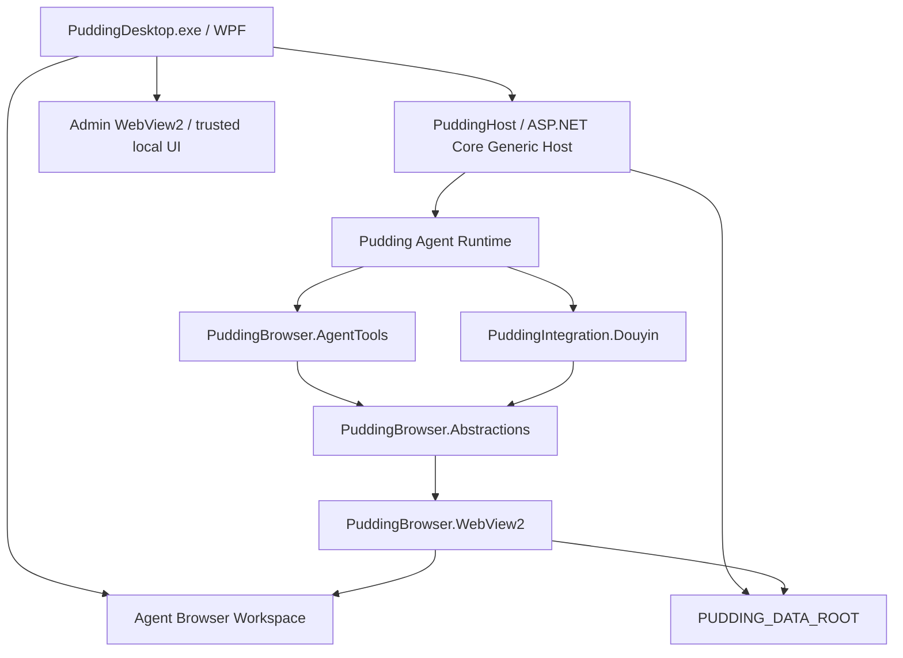
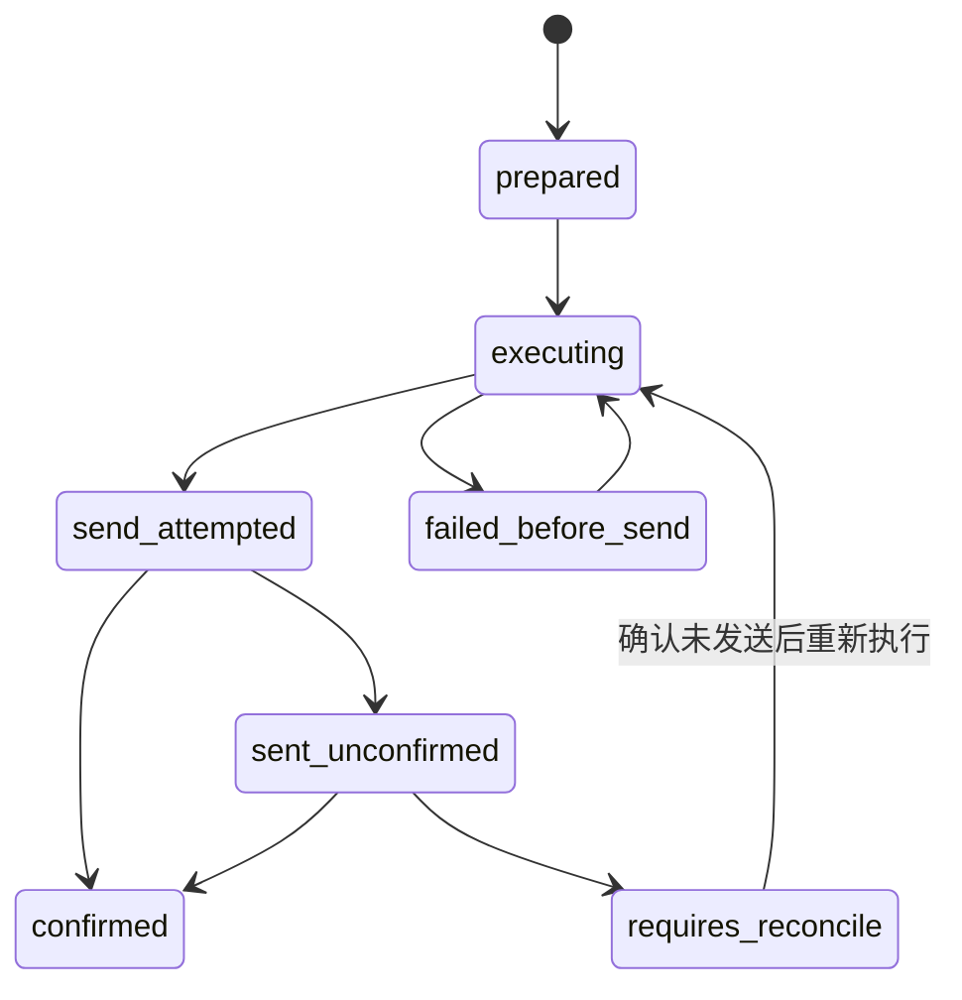

# 67 ADR-066 抖音个人开发者评论接入与通用 WebView2 自动化 ADR

> - 状态：**proposed**
> - 日期：2026-08-01
> - 决策范围：Windows 桌面宿主、Agent 浏览器能力、个人开发者抖音评论接入
> - 实施规格：[68抖音接入与通用WebView2自动化开发实施规格](68抖音接入与通用WebView2自动化开发实施规格.md)
> - 关联：[ADR-045 双向消息系统与聊天室客户端](46ADR-045双向消息系统与聊天室客户端ADR.md)、[ADR-063 飞书 Agent 绑定与可靠消息网关](63ADR-063飞书Agent绑定与可靠消息网关ADR.md)

## 1. 背景

Pudding 需要让个人开发者账号接入抖音，覆盖：

1. 查看当前账号发布的作品；
2. 查看作品下的评论和回复；
3. 由 Agent 分析评论、生成或直接执行回复；
4. 在没有企业开发者资质时仍能运行；
5. 把该能力建设为通用浏览器能力，而不是一次性的抖音脚本。

抖音开放平台存在正式评论接口，但个人开发者当前无法独立完成企业/机构应用主体申请，因此近期不能把官方 OpenAPI 作为唯一接入路径。开源实现主要分为官方 API、Web 自动化、逆向 Web API 和 Android/ADB 四类。对个人开发者而言，创作者中心网页版自动化的部署成本、可观察性和可维护性优于 ADB。

Pudding 当前是 ASP.NET Core + React Admin 的 .NET 10 应用，`PuddingAgent/Program.cs` 同时承担数据目录准备、日志、DI、HTTP Host、数据库初始化和 Connector 生命周期。Windows 产品形态需要一个可双击启动、统一托管后端与 Web UI、同时向 Agent 提供独立浏览器空间的桌面宿主。

## 2. 决策摘要

本 ADR 作出以下决定：

1. 第一版 Windows 桌面宿主使用 **WPF**，不使用 WinUI 3；
2. WPF 进程内启动 ASP.NET Core `WebApplication`/Generic Host；
3. React Admin 继续保留，通过本机 Loopback 地址加载到独立的 Admin WebView2；
4. Agent 使用一个或多个独立的 WebView2 BrowserContext，用户 Chrome 与 Agent 浏览器数据完全隔离；
5. 实现通用的 `PuddingBrowser` 自动化内核，Playwright 只作为模型熟悉的概念和命名参考，不实现 Playwright 兼容层；
6. Agent 对自己的 WebView2 拥有完整页面控制能力，包括 JavaScript、CDP、Cookie、Storage、网络、下载、上传、窗口和权限；
7. 抖音能力位于通用浏览器之上的 `PuddingIntegration.Douyin`，不得把抖音选择器或流程写入底层；
8. 浏览器能力策略采用可插拔 `IBrowserCapabilityPolicy`，V1 默认 `AllowAll`，不在内核中写死产品审批；
9. 远程页面不得通过 `AddHostObjectToScript` 获得 WPF/.NET 宿主对象；这是宿主隔离边界，不是对 Agent 浏览器能力的限制；
10. 最终用户运行不再依赖 `dev-up.py`，但保留脚本作为开发、热更新和无桌面诊断工具。

## 3. 调研结论

### 3.1 官方抖音 OpenAPI

官方接口长期仍是最稳定的接入方式，可支持授权账号作品评论查询和回复。但“普通抖音授权账号”并不代表个人开发者可以绕过应用主体申请。当前 Pudding 面向个人开发者，近期必须具备不依赖企业开发者账号的本地方案。

如果未来获得机构主体，抖音上层应增加 `DouyinOpenApiClient`，与 `DouyinBrowserClient` 并列实现同一领域接口，不能让调用者感知 DOM 或 OAuth 差异。

### 3.2 开源项目路线

| 路线 | 代表实现 | 结论 |
|---|---|---|
| 官方 SDK | `xopenapi/douyin-open-api-go` | 证明评论能力是 OAuth + HTTP API；受开发者主体资质限制 |
| 创作者中心 Web 自动化 | `wenyg/douyin-creator-tools` | Playwright、扫码登录、持久 Profile、作品和评论管理；最接近需求 |
| 网页数据采集 | `NanmiCoder/MediaCrawler` | 适合参考作品和评论读取，不应直接作为可靠写入通道 |
| 逆向 Web API | `Evil0ctal/Douyin_TikTok_Download_API` | Cookie、签名和风控细节易变化，不作为写操作主路径 |
| Android/ADB | `uiautomator2` 及其 MCP 适配器 | 技术可行，但设备部署重、速度慢、控件树和坐标脆弱，只保留为后备 |

开源项目用于验证路线和理解交互，不直接复制许可证不明确的实现代码。

### 3.3 WebView2 能力

WebView2 提供 WPF 控件、独立 User Data Folder、JavaScript 执行、CookieManager、页面和进程事件、下载、新窗口、权限、网络请求处理以及 Chrome DevTools Protocol 调用。它足以支持一个小型、通用的 C# 浏览器自动化引擎。

WebView2 的 CDP 版本随 Evergreen Runtime 演进，因此常用操作使用强类型封装，长尾能力保留原始 `browser_cdp` 通道。强类型 API 不能成为能力瓶颈。

## 4. 为什么选择 WPF + WebView2

### 4.1 选择 WPF

WPF 的 .NET Host、依赖注入、异步生命周期和部署路径成熟。Pudding 的主要 UI 已经是 React，桌面原生层只需承载窗口、标题栏、导航、WebView2、Agent 浏览器标签页和状态栏，没有必要为了少量原生 Shell 引入 WinUI 3 的 Windows App SDK 生命周期与部署复杂度。

WPF 本身不自动等于 Windows 11 风格。桌面项目必须实现：

- 自定义标题栏和窗口按钮；
- Windows 11 Mica/System Backdrop；
- 圆角和深浅色主题；
- Windows 10 的纯色降级；
- 原生 Shell 与 React Admin 的统一设计 Token。

如果未来绝大多数 UI 从 React 迁移为原生 XAML，再单独评估 WinUI 3，不在 V1 同时维护两个桌面框架。

### 4.2 不再使用 Playwright Sidecar 作为主方案

Playwright Sidecar 的进程隔离和跨浏览器能力很好，但它会引入第二套浏览器窗口、Profile、服务生命周期、IPC 和发布包，并且无法自然成为 Pudding Windows 主窗口的一部分。

WebView2 方案让用户能够在 Pudding 内观察 Agent 浏览器；后端与浏览器桥共享 DI 和进程生命周期；Windows 10/11 使用系统 Evergreen Runtime；抖音扫码、页面修复和人工接管都发生在同一个窗口中。

Playwright 继续作为以下方面的参考：

- `BrowserContext`、`Page`、`Locator` 的概念；
- `goto`、`click`、`fill`、`evaluate`、`waitFor` 等模型熟悉的语义；
- 自动等待、页面版本和 stale handle 的工程经验；
- 测试用例组织方式。

明确不建立 `Microsoft.Playwright` 类型、包结构、协议或行为兼容承诺。

## 5. 总体架构



### 5.1 Admin WebView 与 Agent WebView 必须分离

Admin WebView：

- 只加载同进程 ASP.NET Core 提供的 React Admin；
- 使用独立、可清理的 UDF；
- 不注册到 `IBrowserRuntime`，Agent 不能关闭或改写自己的管理 UI；
- React 继续通过 Loopback HTTP、SSE 和 WebSocket 调用服务端。

Agent WebView：

- 注册到通用浏览器运行时；
- 支持多个 Context、Page 和标签页；
- Context 使用独立 UDF；
- Agent 可完整控制页面、网络、存储和浏览器状态；
- WPF Browser Workspace 显示所有页面，允许用户观察和接管。

### 5.2 后端调用 WPF 的方式

服务端不能直接调用 `MainWindow`、静态字段或 `WebView2` 控件。`PuddingBrowser.Abstractions` 定义平台无关接口，`PuddingBrowser.WebView2` 在 WPF UI Dispatcher 上实现。业务服务只依赖 `IBrowserRuntime`。

WPF 调用后端时，原生 ViewModel 直接注入应用服务；React Admin 仍走 HTTP。所有对象来自同一 Generic Host/DI 容器。

## 6. 通用浏览器能力边界

V1 通用内核必须支持：

- Context/Page/标签页生命周期；
- 导航、刷新、停止、前进和后退；
- CSS、XPath、文本、Role、Label、Placeholder、TestId Locator；
- iframe、Shadow DOM 和元素句柄；
- click、fill、type、press、hover、scroll、drag、select、check；
- 任意 JavaScript 执行和 document-created 脚本；
- 原始 CDP 方法和事件订阅；
- Cookie、LocalStorage、SessionStorage、IndexedDB；
- 请求、响应、WebSocket、Console、页面异常和进程异常事件；
- 请求头修改、阻断、重定向和自定义响应；
- 下载路径、下载状态和文件上传；
- alert/confirm/prompt、权限、新窗口和关闭窗口；
- 截图、打印/PDF、DevTools；
- 页面结构化快照和可选原始 HTML。

低层接口不包含抖音、审批、公开发布或评论语义。

## 7. Agent 工具投影

通用工具使用模型熟悉但非 Playwright 兼容的命名：

```text
browser_context
browser_tabs
browser_navigate
browser_snapshot
browser_locate
browser_interact
browser_wait_for
browser_evaluate
browser_cdp
browser_cookies
browser_storage
browser_network
browser_files
browser_screenshot
browser_devtools
```

Agent 可直接使用这些工具完成任意网站任务。Douyin 工具只是更稳定、更节省 token 的快捷入口，不是唯一入口。

工具结果必须返回稳定的 `contextId`、`pageId`、`pageVersion`、错误码和必要诊断。大 DOM、大网络响应和二进制内容不能直接无界进入 LLM；工具支持分页、句柄和 Artifact 引用，但 Agent 可显式请求原始内容。

## 8. 能力策略

浏览器内核定义：

```csharp
public interface IBrowserCapabilityPolicy
{
    ValueTask<BrowserPolicyDecision> AuthorizeAsync(
        BrowserOperation operation,
        CancellationToken cancellationToken);
}
```

V1 默认注册：

```text
AllowAllBrowserCapabilityPolicy
```

后续可选策略包括 `AuditOnly`、`ReadOnly`、`RequireApprovalForWrites`、`OriginAllowList` 和 `WorkspaceFileAccessOnly`。策略是部署或 Agent 配置，不得破坏底层完整能力，也不得在 Douyin 代码中重复实现一套浏览器权限系统。

## 9. 宿主隔离边界

“Agent 完整控制 WebView2”不等于“远程网页控制 Pudding 宿主”。必须保留：

1. 不向任意远程页面调用 `AddHostObjectToScript`；
2. Web 消息只在受信任本地 Admin Origin 使用并校验来源；
3. WPF 以普通用户权限运行；
4. Agent UDF 不读取、复制或链接用户 Chrome Profile；
5. 浏览器 Profile、Cookie、下载和 Trace 写入 `PUDDING_DATA_ROOT`，不写仓库和构建输出；
6. Admin WebView 不暴露给 Agent；
7. 浏览器操作进入独立审计日志，审计失败不能改变操作结果；
8. WebView2 Renderer/Browser Process 崩溃时由 Driver 重建 Page/Context，不重启整个 Agent Turn。

这些约束阻止网页逃逸到宿主或污染用户浏览器，不限制 Agent 对专属浏览器上下文的能力。

## 10. 抖音适配层

抖音实现位于 `PuddingIntegration.Douyin`：

```text
IDouyinBrowserClient
DouyinBrowserClient
IDouyinLocatorProvider
DouyinLocatorProvider
DouyinAccountStatusProbe
DouyinWorkReader
DouyinCommentReader
DouyinCommentReplyWriter
DouyinToolSet
```

它只调用 `IBrowserRuntime`/`IBrowserPage`，不能引用 `CoreWebView2`。选择器使用程序默认配置和用户覆盖配置：

```text
程序默认：PuddingIntegration.Douyin/Profiles/creator.douyin.com.v1.json
用户覆盖：{PUDDING_DATA_ROOT}/channels/{channelId}/douyin.locators.json
```

上层工具：

```text
douyin_get_account_status
douyin_list_works
douyin_list_comments
douyin_prepare_reply
douyin_reply_comment
douyin_reconcile_reply
douyin_open_browser
```

当高层工具因页面变化失败时，Agent 可直接使用通用工具检查页面、执行脚本、读取网络请求并完成任务或修复选择器配置。

## 11. 回复可靠性

浏览器完整能力不取消领域层的可靠性要求。`douyin_reply_comment` 维护 `ReplyIntent`，避免网络超时或页面崩溃后盲目重复回复：



高层工具在 `send_attempted` 后不自动重复点击；先通过页面或评论列表对账。Agent 始终可以使用通用浏览器工具直接操作，但该直接操作不享有 Douyin ReplyIntent 的幂等保证。

V1 可以通过配置选择人工审核或自主回复：

```json
{
  "requireApproval": false,
  "recordReplyIntent": true
}
```

审批不是浏览器内核的硬限制。

## 12. 数据目录

```text
{PUDDING_DATA_ROOT}/
  config/
    browser.json
    desktop.json
  browser/
    contexts/{contextId}/user-data/
    downloads/{contextId}/
    screenshots/{contextId}/
    traces/{contextId}/
  channels/{channelId}/
    manifest.json
    douyin.locators.json
    runtime/webview2/
```

`runtime/webview2`、Cookie、缓存和下载均为运行时用户数据。发布包只携带默认配置和选择器模板。

## 13. 宿主与 dev-up

`PuddingDesktop.exe` 负责：

1. 准备数据目录和日志；
2. 创建同一 DI 容器；
3. 启动 ASP.NET Core/Kestrel；
4. 获取 Loopback 地址；
5. 创建主窗口和 Admin WebView；
6. 初始化 Browser Workspace；
7. 关闭时先停止浏览器命令、释放 WebView，再停止 Host。

`PuddingAgent` 保留为薄 Console/Web 入口。`dev-up.py` 不再是桌面产品启动依赖，但继续服务前端热更新、无桌面后端调试、测试和故障诊断。

## 14. 影响

### 正面影响

- 最终用户只启动一个现代 Windows 应用；
- Agent 浏览器与用户 Chrome 隔离；
- Web 自动化成为 Pudding 通用能力；
- 模型可以复用对 Playwright 语义的既有训练；
- Douyin 页面变化时可由通用工具诊断和修复；
- 未来可派生更多网站适配器。

### 成本和风险

- 必须拆分当前 `PuddingAgent/Program.cs` 组合根；
- WebView2 所有 UI 操作必须正确切换 WPF Dispatcher；
- Raw CDP 随 Evergreen Runtime 版本变化，需要兼容性测试；
- Agent 的浏览器操作可以产生真实外部副作用；
- 页面 DOM、风控和登录流程可能变化；
- WPF 桌面发布、WebView2 Runtime 检测和进程恢复需要新的测试矩阵。

## 15. 未选择的方案

| 方案 | 未选择原因 |
|---|---|
| 官方 OpenAPI only | 个人开发者主体受限，不能覆盖近期目标 |
| Playwright Sidecar only | 与统一桌面窗口、同进程 Host 和可观察 Agent 浏览器目标不匹配 |
| ADB/uiautomator2 主路径 | 设备部署和维护成本高，只作网页缺失能力时的后备适配器 |
| 逆向签名 Web API | 写操作易受风控和签名变化影响，维护风险高 |
| WinUI 3 首版 | 对当前 React + WebView Shell 收益不足，增加部署和生命周期复杂度 |
| 为 Douyin 直接写 WebView2 代码 | 无法形成通用 Agent 浏览器能力，后续网站会重复建设 |

## 16. 验收原则

ADR 落地必须同时满足：

1. Console Host 和 Desktop Host 共用唯一组合根；
2. `PuddingDesktop.exe` 可独立启动后端和 Admin；
3. Agent 可创建独立 Context/Page 并使用 JavaScript、CDP、Cookie、网络和文件能力；
4. Agent Browser Profile 与 Chrome/Admin Profile 隔离；
5. Douyin 代码只依赖通用浏览器抽象；
6. 高层 Douyin 工具和通用 Browser 工具可并存；
7. 产品运行不依赖 `dev-up.py`；
8. 所有运行时浏览器数据只进入 `PUDDING_DATA_ROOT`。

## 17. 参考资料

- [Microsoft：在 WPF 应用中使用 .NET Generic Host](https://learn.microsoft.com/en-us/dotnet/desktop/wpf/app-development/how-to-use-host-builder)
- [Microsoft：ASP.NET Core Generic Host](https://learn.microsoft.com/en-us/aspnet/core/fundamentals/host/generic-host?view=aspnetcore-10.0)
- [Microsoft：WebView2 WPF 入门](https://learn.microsoft.com/en-us/microsoft-edge/webview2/get-started/wpf)
- [Microsoft：WebView2 User Data Folder](https://learn.microsoft.com/en-us/microsoft-edge/webview2/concepts/user-data-folder)
- [Microsoft：WebView2 API 概览](https://learn.microsoft.com/en-us/microsoft-edge/webview2/concepts/overview-features-apis)
- [Microsoft：WebView2 网络请求管理](https://learn.microsoft.com/en-us/microsoft-edge/webview2/how-to/webresourcerequested)
- [Microsoft：WebView2 Host Object](https://learn.microsoft.com/en-us/microsoft-edge/webview2/how-to/hostobject)
- [NuGet：Microsoft.Web.WebView2](https://www.nuget.org/packages/Microsoft.Web.WebView2)
