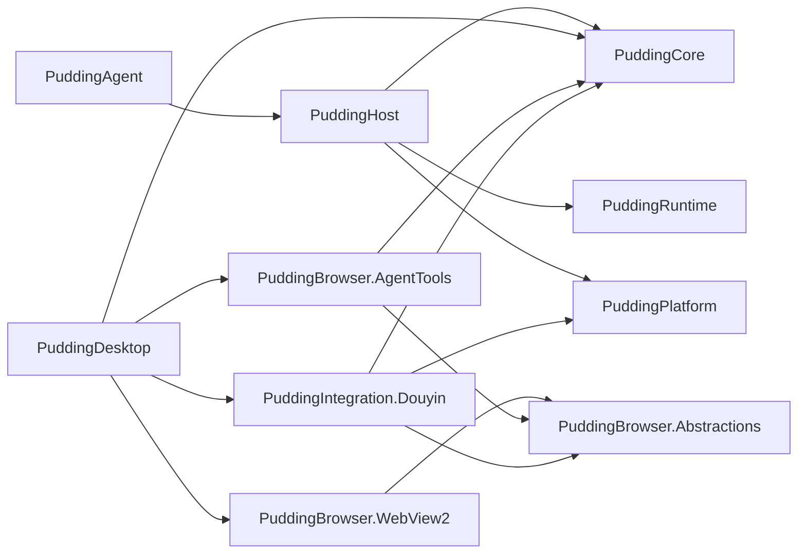

# 68 抖音接入与通用 WebView2 自动化开发实施规格

> - 状态：**Phase 1A implemented / Phase 1B-R/S implemented / Phase 2A-1/2 accepted / Phase 2A-3 automated accepted（真实 DeepSeek smoke pending，2026-08-02）**
> - 日期：2026-08-02
> - 决策来源：[ADR-066](67ADR-066抖音个人开发者评论接入与浏览器自动化ADR.md)
> - Desktop UI/Bridge/运行中心/存储细化：[69实施规格](69PuddingDesktop浏览器工作区运行中心与存储管理实施规格.md)
> - 目标平台：Windows 10/11、.NET 10、WPF、WebView2 Evergreen Runtime
> - 本文用途：作为开发拆分、接口评审、编码和验收的直接输入

## 0. 产品战略定位

Pudding 是 **Windows 桌面智能助手与 IDE**。

核心战略约束（2026-08-02 更新）：

- **Windows First and Only** — V1 仅支持 Windows 10/11，不分散精力到其他平台；
- **DeepSeek First** — 优先使用 DeepSeek 模型（V4 Pro / V4 Flash），以成本效益为核心；
- **ASP.NET Core 是独立 Core API/Service Plane** — V1 由 Desktop 以子进程方式启动和监督，Desktop 不承载业务逻辑；
- **Console Host 仅用于开发和诊断** — 产品入口是 `PuddingDesktop.exe`；
- **产品界面称为 Workbench** — `/admin/` 只是内部兼容路由，不对外暴露为产品名称。

```
PuddingDesktop.exe (产品入口 / Launcher)
  ├── WPF Shell (Windows 11 风格)
  ├── Workbench (WebView2CompositionControl → Loopback /admin/)
  ├── 配置、状态、日志与 Core 进程监督
  └── 启动 core/PuddingAgent.exe --desktop-child
        ├── ASP.NET Core HTTP API/Service Plane
        ├── PuddingHost (组合根)
        ├── Connectors (Feishu / P2P)
        └── Runtime + Services
```

---

## 1. 交付目标

完成后，Pudding 应具备：

1. `PuddingDesktop.exe` 双击启动；
2. WPF 只负责产品壳和系统集成，以子进程方式监督 ASP.NET Core、Runtime、Connector 和后台服务；
3. 现有 React Admin 在独立 Admin WebView2 中运行；
4. Agent 可创建和完整控制专属 WebView2 Context/Page；
5. Agent 可直接调用通用 Browser Tools；
6. 抖音工具建立在通用 Browser API 之上；
7. 个人账号在可见 WebView2 中扫码登录后，可查看作品、评论并回复；
8. 用户 Chrome Profile 和浏览记录不被读取或修改；
9. 产品运行不需要 `dev-up.py`；该脚本保留为源码开发工具，不进入最终安装包，Console Host 继续可用。

## 2. V1 范围

### 2.1 必须实现

- WPF Windows 11 风格 Shell；
- Host 组合根复用；
- Admin WebView2；
- Agent Browser Workspace 和标签页；
- Context、Page、Locator、ElementHandle；
- JavaScript、CDP、Cookie、Storage；
- 导航、鼠标、键盘、文件、下载、网络、对话框、新窗口；
- 结构化 Snapshot、Screenshot、Console/Page Error；
- 通用 Agent Browser Tools；
- `AllowAllBrowserCapabilityPolicy`；
- Douyin 登录状态、作品列表、评论列表、评论回复；
- Douyin ReplyIntent 对账；
- Browser/Douyin 日志、诊断和测试页面。

### 2.2 不要求

- Playwright API、协议或测试运行器兼容；
- Chromium/Firefox/WebKit 多浏览器实现；
- macOS/Linux 桌面版本；
- 抖音验证码或风控绕过；
- 官方 OpenAPI 实现；
- ADB 实现；
- 自动修复所有未知 DOM 变化；
- 将 React Admin 重写为 XAML。

“不要求”表示不作为 V1 验收项，不应通过写死接口阻碍未来扩展。

## 3. 代码项目与依赖

新增 6 个产品项目和 4 个测试项目。

```text
Source/
  PuddingHost/
  PuddingDesktop/
  PuddingBrowser.Abstractions/
  PuddingBrowser.WebView2/
  PuddingBrowser.AgentTools/
  PuddingIntegration.Douyin/
  PuddingBrowser.AbstractionsTests/
  PuddingBrowser.WebView2Tests/
  PuddingBrowser.AgentToolsTests/
  PuddingIntegration.DouyinTests/
```

依赖方向：



禁止依赖：

- `PuddingBrowser.Abstractions` 不得引用 WPF、WebView2、Douyin；
- `PuddingBrowser.AgentTools` 不得引用 WPF、WebView2、Douyin，只依赖 Browser Abstractions 和 Pudding Tool 契约；
- `PuddingIntegration.Douyin` 不得引用 `Microsoft.Web.WebView2`；
- `PuddingHost` 不得引用 `PuddingDesktop`；
- `PuddingDesktop` 不得引用 `PuddingHost` 或 ASP.NET Core；只允许通过发布包中的 `core/PuddingAgent.exe`、Loopback HTTP 和认证 WebSocket Bridge 通信；
- `PuddingAgent` 不得成为 Desktop 的编译期组合根依赖；
- `PuddingBrowser.WebView2` 不得引用 Douyin。

### 3.1 项目文件

`PuddingDesktop.csproj`：

```xml
<Project Sdk="Microsoft.NET.Sdk">
  <PropertyGroup>
    <OutputType>WinExe</OutputType>
    <TargetFramework>net10.0-windows10.0.17763.0</TargetFramework>
    <UseWPF>true</UseWPF>
    <ImplicitUsings>enable</ImplicitUsings>
    <Nullable>enable</Nullable>
  </PropertyGroup>
</Project>
```

`PuddingBrowser.WebView2.csproj` 使用相同 Windows TFM 和 `UseWPF=true`，并固定：

```xml
<PackageReference Include="Microsoft.Web.WebView2" Version="1.0.4078.44" />
```

该版本是本文编写时的稳定版本。Workbench 使用 `WebView2CompositionControl`，因此必须保留带 Windows 版本的 TFM，使发布包包含 CompositionControl 所需的 `Microsoft.Windows.SDK.NET.dll`。实现 PR 如升级版本，必须记录版本、Evergreen Runtime、WPF 合成和 CDP 冒烟结果，不使用浮动版本。

`PuddingHost`、`PuddingBrowser.Abstractions`、`PuddingBrowser.AgentTools` 和 `PuddingIntegration.Douyin` 使用 `net10.0`。如果 Douyin 测试直接依赖 WPF Driver，测试项目使用 `net10.0-windows`，领域单测仍保持 `net10.0`。

所有项目加入 `PuddingAgentNetwork.slnx`。

## 4. PuddingHost 拆分

### 4.1 移动和新增文件

```text
PuddingHost/
  PuddingHost.csproj
  BuiltInAgentTemplates.cs
  Connectors/
  Controllers/
  P2P/
  Services/
  Tools/
  Hosting/PuddingHostMode.cs
  Hosting/PuddingHostOptions.cs
  Hosting/PuddingApplicationHost.cs
  Hosting/PuddingDataRootBootstrapper.cs
  Hosting/PuddingLoggingBootstrapper.cs
  Hosting/PuddingApplicationInitializer.cs
  Hosting/ConnectorHostLifecycleService.cs
  Hosting/PuddingServerAddressAccessor.cs
  Extensions/PuddingServiceCollectionExtensions.cs
  Extensions/PuddingServiceCollectionExtensions.Platform.cs
  Extensions/PuddingServiceCollectionExtensions.Runtime.cs
  Extensions/PuddingServiceCollectionExtensions.Connectors.cs
  Extensions/PuddingServiceCollectionExtensions.Bootstrap.cs
  Extensions/PuddingWebApplicationExtensions.cs
  Build/PuddingHostContent.props
  Config/
  Prompts/
  default-data/
```

不能只移动 `PuddingServiceCollectionExtensions`。这些扩展当前依赖 `PuddingAgent.Connectors`、`PuddingAgent.P2P`、Host Controller、Host Tool 和其他 `PuddingAgent.Services` 类型；如果只移动扩展，会形成 `PuddingHost -> PuddingAgent -> PuddingHost` 循环引用。

Phase 0 必须把当前 `PuddingAgent` 的 Host 实现整体移动到 `PuddingHost`：

| 当前边界 | 目标边界 |
|---|---|
| `PuddingAgent/Connectors/` | `PuddingHost/Connectors/` |
| `PuddingAgent/Controllers/` | `PuddingHost/Controllers/` |
| `PuddingAgent/P2P/` | `PuddingHost/P2P/` |
| `PuddingAgent/Services/` | `PuddingHost/Services/`，组合根扩展再放入 `Extensions/` |
| `PuddingAgent/Tools/` | `PuddingHost/Tools/` |
| `PuddingAgent/BuiltInAgentTemplates.cs` | `PuddingHost/BuiltInAgentTemplates.cs` |
| `PuddingAgent/Config/`、`Prompts/`、`default-data/` | `PuddingHost` 的共享发布内容 |

`PuddingHost.csproj` 接管当前 `PuddingAgent.csproj` 的业务 PackageReference、ProjectReference、Controller ApplicationPart 和资源内容规则。移动时保持注册、Middleware、静态资源和 HostedService 顺序；第一阶段只做组合根抽取，不顺带重构业务服务或 namespace。namespace 可以暂时保持 `PuddingAgent.*`，后续单独机械改名，避免 Host 抽取 PR 出现无意义的大规模 diff。

`PuddingAgent` 目录最终只保留：

```text
PuddingAgent/
  PuddingAgent.csproj
  Program.cs
  appsettings.json
  appsettings.Development.json（如存在）
  Properties/
  Dockerfile
```

`PuddingAgent.csproj` 使用 Web SDK 并只引用 `PuddingHost`。它不再定义 Connector、Controller、Tool 或初始化服务。

### 4.2 共享发布内容

Console 和 Desktop 都需要 `default-data`、Prompt、Config、React Admin `dist` 和静态资源。新增 `PuddingHost/Build/PuddingHostContent.props`，由两个入口项目显式 Import：

```xml
<Import Project="..\PuddingHost\Build\PuddingHostContent.props" />
```

该 props 使用 `Link` 保持输出路径一致，并定义同一个 `EnsureAdminDistExists` Publish Target。必须验证内容确实进入两个入口的 build/publish 输出；不能假设 class library 的 Content 会自动传递到 ProjectReference 消费者。

运行态 `data` 不属于共享发布内容。只复制 `default-data` 模板，继续由 `PUDDING_DATA_ROOT` 指向真实用户数据。

### 4.3 Host 类型

```csharp
public enum PuddingHostMode
{
    Console,
    Desktop
}

public sealed record PuddingHostOptions
{
    public required PuddingHostMode Mode { get; init; }
    public required string DataRoot { get; init; }
    public IReadOnlyList<string> Urls { get; init; } = [];
    public bool ServeAdminSpa { get; init; } = true;
    public bool OpenExternalBrowser { get; init; }
    public bool BrowserAutomationEnabled { get; init; }
}

public static class PuddingApplicationHost
{
    public static WebApplicationBuilder CreateBuilder(
        string[] args,
        PuddingHostOptions options);

    public static WebApplication Build(
        WebApplicationBuilder builder);

    public static Task InitializeAsync(
        WebApplication application,
        CancellationToken cancellationToken);
}
```

`PuddingApplicationHost.CreateBuilder` 的责任顺序固定为：

1. 标准化 `DataRoot`；
2. 复制缺失的 `default-data`；
3. 创建运行时目录；
4. 构造 bootstrap configuration；
5. 配置 Serilog；
6. 创建 `WebApplicationBuilder`；
7. 注册 `PuddingDataPaths`；
8. 注册 Platform、Runtime、Connector、Bootstrap；
9. 应用 Host Mode 覆盖项；
10. 返回 Builder，不在方法内启动 Host。

### 4.4 Desktop 地址

DesktopChild 模式下的 Core 默认监听：

```text
http://0.0.0.0:8080
```

固定端口来自 `<DataRoot>/config/system.json` 的 `desktop.core.port`，允许 `1–65535`（例如 `80`、`8080`），不再接受 `0` 动态分配。启动后通过 `IServerAddressesFeature` 捕获实际监听地址：

```csharp
public interface IPuddingServerAddressAccessor
{
    Uri? BaseAddress { get; }
    void SetBoundAddresses(IEnumerable<string> addresses);
}
```

`PuddingServerAddressAccessor` 将 `0.0.0.0:<port>` 投影为 `127.0.0.1:<port>` 本机控制地址。Core 通过 `PUDDING_DESKTOP_READY` stdout 消息把该控制地址交给 Desktop；Desktop 只接受 Loopback HTTP 地址作为健康检查、优雅关闭、Workbench 和 Browser Bridge 地址。外部 HTTP API 仍由同一 Kestrel 监听器通过机器网卡地址访问，Desktop 自身不监听 HTTP。Console 模式维持现有 URL 配置。

Core 内部的 `PlatformApiClient` 同样属于控制面调用，不能依赖配置中的 `Pudding:ControllerEndpoint` 或默认 `http://localhost:5000`。`PuddingControllerAddressRewriteHandler` 必须保留原请求的 path、query 和 fragment，并在发送前将 authority 重写为 `IPuddingServerAddressAccessor.BaseAddress`；Console 模式不重写。这样外部全网卡监听与内部可信 Loopback 控制地址保持分离。

### 4.5 Connector 生命周期

当前 `Program.cs` 中手工 `Task.Run` 启停 ConnectorHost 的逻辑改为：

```csharp
public sealed class ConnectorHostLifecycleService : IHostedService
{
    public Task StartAsync(CancellationToken cancellationToken);
    public Task StopAsync(CancellationToken cancellationToken);
}
```

不得在 Desktop `App.xaml.cs` 重复 Connector 启动逻辑。

### 4.6 PuddingAgent 入口

重构后 `PuddingAgent/Program.cs` 只保留：

```csharp
var options = PuddingHostOptionsFactory.ForConsole(args);
var builder = PuddingApplicationHost.CreateBuilder(args, options);
var app = PuddingApplicationHost.Build(builder);
await PuddingApplicationHost.InitializeAsync(app, CancellationToken.None);
await app.RunAsync();
```

Console Host 行为必须先通过现有定向测试，再开始 WPF 工作。

## 5. PuddingDesktop

### 5.1 文件结构

```text
PuddingDesktop/
  App.xaml
  App.xaml.cs
  MainWindow.xaml
  MainWindow.xaml.cs
  Configuration/
    DesktopBootstrapPathProvider.cs
    DesktopBootstrapSettings.cs
    FileDesktopBootstrapSettingsStore.cs
    SystemConfigurationService.cs
    DesktopControlTokenService.cs
  Core/
    ICoreProcessSupervisor.cs
    CoreProcessSupervisor.cs
    CoreProcessStartOptions.cs
    CoreProcessSession.cs
    CoreReadyMessageParser.cs
    CoreProcessLogBuffer.cs
    CoreExecutableResolver.cs
    CoreHealthClient.cs
  Hosting/DesktopApplicationCoordinator.cs
  Hosting/DesktopStartupState.cs
  Hosting/DesktopStateChangedEventArgs.cs
  Runtime/
    DesktopRuntimeOrchestrator.cs
    DesktopRuntimeSnapshot.cs
    CoreRestartPolicy.cs
    CoreRestartAttemptWindow.cs
    DesktopSingleInstanceService.cs
    DesktopBackgroundModeService.cs
    DesktopTrayIconService.cs
    AutoStartRegistrationService.cs
    DiagnosticBundleService.cs
  Storage/
    StorageAnalysisService.cs
    StorageCategoryCatalog.cs
    DataRootSafetyValidator.cs
    LogRetentionService.cs
  Theming/WindowsThemeService.cs
  Theming/WindowsBackdropService.cs
  Diagnostics/DesktopDiagnosticLog.cs
  ViewModels/RuntimeCenterViewModel.cs
  ViewModels/StorageViewModel.cs
  ViewModels/SettingsViewModel.cs
  Views/WorkbenchView.xaml
  Views/RuntimeCenterView.xaml
  Views/StorageView.xaml
  Views/SettingsView.xaml
```

### 5.2 App 生命周期

```csharp
public sealed partial class App : Application
{
    private DesktopApplicationCoordinator? _coordinator;

    protected override async void OnStartup(StartupEventArgs e);
    protected override async void OnExit(ExitEventArgs e);
}

public sealed class DesktopApplicationCoordinator : IAsyncDisposable
{
    public Task StartAsync(string[] args, CancellationToken cancellationToken);
    public Task StartCoreAsync(CancellationToken cancellationToken);
    public Task StopCoreAsync(CancellationToken cancellationToken);
    public Task RestartCoreAsync(CancellationToken cancellationToken);
    public Task StopAsync(CancellationToken cancellationToken);
    public ValueTask DisposeAsync();
}

public interface ICoreProcessSupervisor : IAsyncDisposable
{
    Task<CoreProcessSession> StartAsync(
        CoreProcessStartOptions options,
        CancellationToken cancellationToken);
    Task StopAsync(CancellationToken cancellationToken);
}
```

启动顺序：

```text
创建并显示 MainWindow（启动器始终先可用）
  -> 读取 %LOCALAPPDATA%/Pudding/desktop.json
  -> DataRoot 缺失：进入 Settings，Desktop 不退出
  -> 读取 <DataRoot>/config/system.json
  -> 缺失 ControlToken：安全随机生成并原子写回 system.json
  -> CoreProcessSupervisor 启动 core/PuddingAgent.exe
  -> 传递 --desktop-child --desktop-parent-pid --data-root --urls
  -> 解析 stdout 的 PUDDING_DESKTOP_READY JSON
  -> 校验固定 0.0.0.0 监听端口、Loopback 控制地址和 /health/ready
  -> 初始化 WorkbenchView
  -> WebView2CompositionControl 导航 /admin/
  -> WorkbenchReady
```

启动参数只由 Desktop 构造，不通过环境变量传递 Token、端口或 DataRoot。`Port` 必须为 `1–65535`，Supervisor 统一构造 `http://0.0.0.0:<port>`；`Port=0` 是配置错误。Core 启动失败、配置缺失、端口占用或进程意外退出只改变 `DesktopStartupState`，不得关闭主窗口。

关闭顺序：

```text
MainWindow Closing 先取消本次关闭
  -> 取消正在进行的 Core Start
  -> POST DesktopChild shutdown / 等待 Core 退出
  -> 超时后终止当前 Desktop 创建的 Core 进程树
  -> Dispose Workbench WebView2CompositionControl
  -> 标记 shutdown complete
  -> 再次关闭窗口
```

`async void` 只允许存在于 WPF 生命周期 override 和事件处理器；内部全部返回 `Task`。

上述关闭顺序是 Phase 1A 当前实现。Phase 1B 按 69 实施规格增加后台守护行为：关闭按钮默认隐藏到系统托盘并保留 Core；只有明确“退出 Pudding”、Windows 会话结束或系统关闭才执行完整关闭顺序。

### 5.3 主窗口布局

```text
┌──────────────────────────────────────────────────────────┐
│ 48px 自定义标题栏 / Pudding / Desktop Preview / Caption  │
├──────────┬───────────────────────────────────────────────┤
│ 240px    │ Workbench / Core 与诊断 / 系统设置           │
│ Navigation│                                              │
│          │ WorkbenchView 或原生状态/设置页               │
│          │                                               │
├──────────┴───────────────────────────────────────────────┤
│ 48px Core 状态 / Loopback API / DataRoot / 启停重启      │
└──────────────────────────────────────────────────────────┘
```

Windows 11 使用 DWM Mica System Backdrop、系统圆角和沉浸式深色标题栏；Windows 10 回退到纯色主题背景。任何 DWM 调用失败都必须静默回退，不得阻止启动。

### 5.4 Admin WebView

`WorkbenchView`：

- 使用 `{DataRoot}/browser/workbench/user-data`；
- 导航到 `{BaseAddress}/admin/`；
- 不注册进 `IBrowserRuntime`；
- 新窗口交给 Windows 默认浏览器；
- 后端未 Ready 时显示原生加载/错误页，不显示空白 WebView。
- 使用 `WebView2CompositionControl`，避免标准 HWND WebView2 越过自定义 WindowChrome、导航栏和圆角容器；
- `WebView2CompositionControl` 必须先为 `Visible` 再调用 `EnsureCoreWebView2Async`，加载遮罩位于其上方；
- `ProcessFailed`、`NavigationCompleted` 和 `NewWindowRequested` 必须注册和释放成对出现。

嵌套 Desktop 发布不能使用 `MapStaticAssets()` 提供 Workbench。Core 必须从 `AppContext.BaseDirectory/wwwroot` 建立 `PhysicalFileProvider`，并以物理 `admin/index.html` 处理 `/admin/{*path:nonfile}` fallback；否则可能出现 `200` 但响应体为零的伪成功。

### 5.5 Windows 11 视觉系统

`App.xaml` 是唯一的视觉 Token 来源，禁止各页面复制颜色常量。至少维护以下动态资源组：

- `WindowBackgroundBrush`、`NavigationFillBrush`、`LayerFillBrush`、`CardFillBrush`；
- `TextPrimaryBrush`、`TextSecondaryBrush`、`TextTertiaryBrush`、`DividerBrush`；
- `AccentBrush`、`AccentLightBrush`、`SuccessBrush`、`WarningBrush`、`ErrorBrush`；
- `SmallCorner`、`MediumCorner`、`LargeCorner`、统一 Card Shadow；
- `DefaultButtonStyle`、`AccentButtonStyle`、`SubtleButtonStyle`、`NavItemStyle` 和标题栏按钮样式。

`WindowsThemeService` 从系统 Apps 主题读取 Light/Dark，并用 DWM Colorization 颜色更新 Accent；`WindowsBackdropService` 只负责窗口级 DWM 属性。字体使用 `Segoe UI Variable`，图标使用 `Segoe Fluent Icons`，不引入位图图标依赖。

页面遵循同一信息层级：页面标题与说明 → Hero 状态卡 → 操作/诊断卡。配置错误、DataRoot 缺失、Core 启动失败和 Workbench 加载失败都必须以内联状态呈现，禁止用阻塞式 MessageBox 作为常规交互。

## 6. 通用浏览器抽象

### 6.1 标识和值对象

```csharp
public readonly record struct BrowserContextId(string Value);
public readonly record struct PageId(string Value);
public readonly record struct ElementHandleId(string Value);
public readonly record struct JsHandleId(string Value);
public readonly record struct DownloadId(string Value);
public readonly record struct BrowserSubscriptionId(string Value);

public sealed record BrowserContextOptions
{
    public BrowserContextId? Id { get; init; }
    public string? UserDataDirectory { get; init; }
    public bool Persistent { get; init; } = true;
    public string? UserAgent { get; init; }
    public string? AcceptLanguage { get; init; }
    public BrowserViewport? Viewport { get; init; }
    public string? DownloadDirectory { get; init; }
    public IReadOnlyDictionary<string, string> AdditionalBrowserArguments { get; init; }
        = new Dictionary<string, string>();
}

public sealed record PageCreateOptions
{
    public Uri? InitialUrl { get; init; }
    public bool Activate { get; init; } = true;
    public string? Title { get; init; }
}
```

ID 使用带前缀的 ULID/Guid 字符串：

```text
ctx-{32hex}
page-{32hex}
el-{32hex}
js-{32hex}
download-{32hex}
```

ID 不能包含文件路径。Context 目录由 Registry 根据 ID 计算。

### 6.2 Runtime

```csharp
public interface IBrowserRuntime : IAsyncDisposable
{
    BrowserRuntimeState State { get; }

    Task<IBrowserContext> CreateContextAsync(
        BrowserContextOptions options,
        CancellationToken cancellationToken);

    Task<IBrowserContext?> GetContextAsync(
        BrowserContextId contextId,
        CancellationToken cancellationToken);

    Task<IReadOnlyList<BrowserContextInfo>> ListContextsAsync(
        CancellationToken cancellationToken);

    Task CloseContextAsync(
        BrowserContextId contextId,
        CancellationToken cancellationToken);

    IAsyncEnumerable<BrowserEvent> WatchEventsAsync(
        BrowserEventFilter filter,
        CancellationToken cancellationToken);
}
```

### 6.3 Context

```csharp
public interface IBrowserContext : IAsyncDisposable
{
    BrowserContextId Id { get; }
    BrowserContextInfo Info { get; }

    Task<IBrowserPage> NewPageAsync(
        PageCreateOptions options,
        CancellationToken cancellationToken);

    Task<IBrowserPage?> GetPageAsync(
        PageId pageId,
        CancellationToken cancellationToken);

    Task<IReadOnlyList<PageInfo>> ListPagesAsync(
        CancellationToken cancellationToken);

    Task ClosePageAsync(PageId pageId, CancellationToken cancellationToken);

    Task<IReadOnlyList<BrowserCookie>> GetCookiesAsync(
        IReadOnlyList<Uri>? urls,
        CancellationToken cancellationToken);

    Task SetCookiesAsync(
        IReadOnlyList<BrowserCookie> cookies,
        CancellationToken cancellationToken);

    Task ClearCookiesAsync(CancellationToken cancellationToken);

    Task GrantPermissionsAsync(
        Uri origin,
        IReadOnlyList<BrowserPermission> permissions,
        CancellationToken cancellationToken);

    Task ResetPermissionsAsync(CancellationToken cancellationToken);
}
```

### 6.4 Page

```csharp
public interface IBrowserPage : IAsyncDisposable
{
    PageId Id { get; }
    BrowserContextId ContextId { get; }
    long PageVersion { get; }
    PageInfo Info { get; }

    Task<NavigationResult> GotoAsync(
        Uri url,
        NavigationOptions options,
        CancellationToken cancellationToken);

    Task GoBackAsync(CancellationToken cancellationToken);
    Task GoForwardAsync(CancellationToken cancellationToken);
    Task ReloadAsync(CancellationToken cancellationToken);
    Task StopAsync(CancellationToken cancellationToken);
    Task BringToFrontAsync(CancellationToken cancellationToken);

    Task<PageSnapshot> SnapshotAsync(
        SnapshotOptions options,
        CancellationToken cancellationToken);

    Task<IElementHandle?> QueryAsync(
        Locator locator,
        CancellationToken cancellationToken);

    Task<IReadOnlyList<IElementHandle>> QueryAllAsync(
        Locator locator,
        CancellationToken cancellationToken);

    Task<BrowserScriptValue> EvaluateAsync(
        BrowserScript script,
        CancellationToken cancellationToken);

    Task<IJsHandle> EvaluateHandleAsync(
        BrowserScript script,
        CancellationToken cancellationToken);

    Task<JsonDocument> SendCdpAsync(
        string method,
        JsonElement? parameters,
        CancellationToken cancellationToken);

    Task<BrowserSubscriptionId> SubscribeCdpAsync(
        string eventName,
        CancellationToken cancellationToken);

    Task UnsubscribeAsync(
        BrowserSubscriptionId subscriptionId,
        CancellationToken cancellationToken);

    Task ClickAsync(Locator locator, ClickOptions options, CancellationToken cancellationToken);
    Task FillAsync(Locator locator, string value, FillOptions options, CancellationToken cancellationToken);
    Task TypeAsync(Locator locator, string text, TypeOptions options, CancellationToken cancellationToken);
    Task PressAsync(Locator locator, string key, KeyOptions options, CancellationToken cancellationToken);
    Task HoverAsync(Locator locator, PointerOptions options, CancellationToken cancellationToken);
    Task ScrollAsync(ScrollOptions options, CancellationToken cancellationToken);
    Task DragAsync(Locator source, Locator target, DragOptions options, CancellationToken cancellationToken);
    Task SelectAsync(Locator locator, IReadOnlyList<string> values, CancellationToken cancellationToken);
    Task CheckAsync(Locator locator, bool isChecked, CancellationToken cancellationToken);
    Task SetInputFilesAsync(Locator locator, IReadOnlyList<string> paths, CancellationToken cancellationToken);

    Task<WaitResult> WaitForAsync(
        WaitCondition condition,
        CancellationToken cancellationToken);

    Task<ScreenshotResult> ScreenshotAsync(
        ScreenshotOptions options,
        CancellationToken cancellationToken);

    Task<PdfResult> PrintToPdfAsync(
        PdfOptions options,
        CancellationToken cancellationToken);

    Task OpenDevToolsAsync(CancellationToken cancellationToken);
}
```

### 6.5 Locator 和 Handle

```csharp
public enum LocatorKind
{
    Css,
    XPath,
    Text,
    Role,
    Label,
    Placeholder,
    AltText,
    Title,
    TestId
}

public sealed record Locator
{
    public required LocatorKind Kind { get; init; }
    public required string Value { get; init; }
    public string? Name { get; init; }
    public bool Exact { get; init; }
    public int? Nth { get; init; }
    public FrameSelector? Frame { get; init; }
    public Locator? Has { get; init; }
    public string? HasText { get; init; }
}

public interface IElementHandle : IAsyncDisposable
{
    ElementHandleId Id { get; }
    PageId PageId { get; }
    long PageVersion { get; }
    int? BackendNodeId { get; }
    string LocatorFingerprint { get; }

    Task<BoundingBox?> GetBoundingBoxAsync(CancellationToken cancellationToken);
    Task<BrowserScriptValue> EvaluateAsync(BrowserScript script, CancellationToken cancellationToken);
}
```

页面主文档导航、Renderer 重建或控件重建时递增 `PageVersion`。Handle 的版本不一致时抛出 `StaleBrowserHandleException`。Agent 工具应优先重新应用 Locator；只有 Raw CDP/Handle 操作要求调用方处理 stale。

### 6.6 JavaScript 返回值

```csharp
public sealed record BrowserScript
{
    public required string Source { get; init; }
    public JsonElement? Argument { get; init; }
    public bool AwaitPromise { get; init; } = true;
    public bool ReturnByValue { get; init; } = true;
}

public sealed record BrowserScriptValue
{
    public string? Type { get; init; }
    public string? Subtype { get; init; }
    public JsonElement? Value { get; init; }
    public string? Description { get; init; }
    public JsHandleId? HandleId { get; init; }
}
```

普通 `EvaluateAsync` 使用 JSON by-value；函数、DOM Node、循环对象和大对象使用 `EvaluateHandleAsync` 或 Raw CDP，不以字符串猜测类型。

### 6.7 Snapshot

```csharp
public sealed record SnapshotOptions
{
    public bool IncludeDom { get; init; } = true;
    public bool IncludeAccessibilityTree { get; init; } = true;
    public bool IncludeHidden { get; init; }
    public bool IncludeIframes { get; init; } = true;
    public bool IncludeShadowDom { get; init; } = true;
    public bool IncludeHtml { get; init; }
    public int MaxNodes { get; init; } = 5_000;
    public int MaxTextLength { get; init; } = 200_000;
}
```

达到上限时返回 `truncated=true` 和继续查询所需的 Node/Frame 信息。调用方可以提高上限或使用 JavaScript/CDP 获取原始数据；默认上限只保护上下文和内存，不构成权限限制。

## 7. WebView2 Driver

### 7.1 核心实现类

```text
WebView2BrowserRuntime
WebView2BrowserContext
WebView2BrowserPage
WebView2ElementHandle
WebView2JsHandle
WebView2EnvironmentFactory
WebView2ContextRegistry
WebView2PageRegistry
WebView2PageVersionTracker
WebView2UiDispatcher
WebView2DomClient
WebView2AccessibilityClient
WebView2InputClient
WebView2CdpClient
WebView2CookieStore
WebView2StorageClient
WebView2NetworkManager
WebView2DownloadManager
WebView2DialogManager
WebView2EventHub
WebView2ProcessRecoveryService
WebView2JsonSerializer
```

### 7.2 WPF Surface Host

Driver 不直接依赖 `MainWindow`：

```csharp
public interface IBrowserSurfaceHost
{
    Task<IBrowserSurface> CreateAsync(
        BrowserContextId contextId,
        PageId pageId,
        CoreWebView2Environment environment,
        PageCreateOptions options,
        CancellationToken cancellationToken);

    Task ActivateAsync(PageId pageId, CancellationToken cancellationToken);
    Task CloseAsync(PageId pageId, CancellationToken cancellationToken);
}
```

`PuddingDesktop.WpfBrowserSurfaceHost` 在 `BrowserWorkspaceView` 中创建和移除 `WebView2` 标签页。

### 7.3 UI 线程规则

所有 `WebView2`、`CoreWebView2` 和 WPF 控件访问经过：

```csharp
public interface IWebView2UiDispatcher
{
    Task InvokeAsync(Func<Task> action, CancellationToken cancellationToken);
    Task<T> InvokeAsync<T>(Func<Task<T>> action, CancellationToken cancellationToken);
}
```

每个 Page 使用一个 `SemaphoreSlim(1, 1)` 串行修改操作。纯事件读取不持有操作锁。禁止在 UI 线程同步等待 Browser Task，禁止 `.Result`、`.Wait()` 和同步 Dispatcher Invoke。

### 7.4 Context/UDF

默认路径：

```text
通用 Context：{DataRoot}/browser/contexts/{contextId}/user-data
Douyin Channel：{DataRoot}/channels/{channelId}/runtime/webview2
下载：{DataRoot}/browser/downloads/{contextId}
截图：{DataRoot}/browser/screenshots/{contextId}
Trace：{DataRoot}/browser/traces/{contextId}
```

Context Registry 对 UDF 规范化绝对路径加进程内独占锁。同一 UDF 不能创建两个 Environment。Persistent Context 关闭 Page 后保留 UDF；删除 UDF 是单独的显式管理操作，不能在普通 Dispose 中删除。

### 7.5 CDP

```csharp
public interface IWebView2CdpClient
{
    Task<JsonDocument> SendAsync(
        CoreWebView2 webView,
        string method,
        JsonElement? parameters,
        CancellationToken cancellationToken);

    Task<BrowserSubscriptionId> SubscribeAsync(
        PageId pageId,
        CoreWebView2 webView,
        string eventName,
        CancellationToken cancellationToken);
}
```

不维护自定义 CDP WebSocket；使用 `CallDevToolsProtocolMethodAsync` 和 `GetDevToolsProtocolEventReceiver`。原始参数和结果保留 JSON，不对未知字段做丢弃式反序列化。

### 7.6 网络

`WebView2NetworkManager` 支持：

- `WebResourceRequested` 过滤器；
- 修改 URI、Method、Header、Body；
- Abort、Redirect、Fulfill；
- `WebResourceResponseReceived`；
- CDP `Network.*` 事件和响应 Body；
- WebSocket frame 通过 CDP；
- HAR-like Trace 输出。

网络规则：

```csharp
public sealed record BrowserRouteRule
{
    public required string UrlPattern { get; init; }
    public BrowserResourceType? ResourceType { get; init; }
    public required BrowserRouteAction Action { get; init; }
    public IReadOnlyDictionary<string, string>? Headers { get; init; }
    public string? RedirectUrl { get; init; }
    public BrowserFulfillResponse? Fulfill { get; init; }
}
```

规则按注册顺序执行，第一条终止性规则生效。移除 Context 时移除所有 Filter 和事件处理器。

### 7.7 下载与上传

`DownloadStarting` 中生成 `DownloadId`，设置默认下载目录并发布状态事件。Agent 可以指定结果路径；相对路径相对于 Context Download Root，绝对路径交由现有宿主文件权限策略审计。

文件上传优先使用 CDP `DOM.setFileInputFiles`；无法定位 BackendNodeId 时再使用 WebView2/UI 交互。工具不自动弹出系统文件选择器。

### 7.8 事件流

```csharp
public abstract record BrowserEvent(
    DateTimeOffset Timestamp,
    BrowserContextId ContextId,
    PageId? PageId,
    long? PageVersion);

public sealed record BrowserNavigationEvent(...) : BrowserEvent(...);
public sealed record BrowserConsoleEvent(...) : BrowserEvent(...);
public sealed record BrowserPageErrorEvent(...) : BrowserEvent(...);
public sealed record BrowserRequestEvent(...) : BrowserEvent(...);
public sealed record BrowserResponseEvent(...) : BrowserEvent(...);
public sealed record BrowserDownloadEvent(...) : BrowserEvent(...);
public sealed record BrowserDialogEvent(...) : BrowserEvent(...);
public sealed record BrowserNewPageEvent(...) : BrowserEvent(...);
public sealed record BrowserProcessFailedEvent(...) : BrowserEvent(...);
public sealed record BrowserCdpEvent(...) : BrowserEvent(...);
```

EventHub 使用有界 Channel：生命周期、ProcessFailed、Dialog 和 Download 事件不丢弃；高频 Network/Console 事件在订阅方落后时允许丢弃最旧项，并累计 `droppedCount`。需要完整网络记录时启用文件 Trace，而不是要求 LLM 事件队列无限增长。

### 7.9 进程恢复

| 故障 | 处理 |
|---|---|
| Renderer Process Exit | 标记 Page unavailable，重建 WebView 控件，递增 PageVersion，保留 Context UDF |
| Browser Process Exit | 关闭同 Environment 下的 Page，释放 Environment，按 Context 重建 |
| GPU/Utility Process Exit | 记录诊断；WebView2 可继续时不重建 |
| WPF Surface 被关闭 | 关闭 Page，释放事件和 Handle |
| Host 正在退出 | 拒绝新命令，返回 `browser_shutting_down` |

恢复不能静默重放最后一个 click、evaluate 或网络写操作。调用方获得明确失败结果后自行判断。

## 8. Capability Policy

```csharp
public sealed record BrowserOperation
{
    public required string OperationId { get; init; }
    public required string Capability { get; init; }
    public BrowserContextId? ContextId { get; init; }
    public PageId? PageId { get; init; }
    public Uri? TargetUri { get; init; }
    public string? FilePath { get; init; }
    public JsonElement? Metadata { get; init; }
}

public interface IBrowserCapabilityPolicy
{
    ValueTask<BrowserPolicyDecision> AuthorizeAsync(
        BrowserOperation operation,
        CancellationToken cancellationToken);
}

public sealed class AllowAllBrowserCapabilityPolicy : IBrowserCapabilityPolicy;
```

V1 所有 Browser API 调用仍经过 Policy 管线，但默认结果为 Allow。这样以后可替换策略，不修改 Driver 或 Tool。

Policy 不处理页面网页权限请求；摄像头、麦克风、通知和地理位置由 `browser_context`/`browser_interact` 工具控制的 PermissionManager 处理。

## 9. Agent Browser Tools

本节所有 Tool 类位于独立的 `PuddingBrowser.AgentTools` 项目。该项目只调用 `IBrowserRuntime`，不包含 WebView2 Driver，也不包含 Douyin 逻辑。

### 9.1 统一结果

```csharp
public sealed record BrowserToolResult<T>
{
    public required bool Ok { get; init; }
    public BrowserContextId? ContextId { get; init; }
    public PageId? PageId { get; init; }
    public long? PageVersion { get; init; }
    public T? Value { get; init; }
    public BrowserToolError? Error { get; init; }
    public IReadOnlyList<string> Warnings { get; init; } = [];
}
```

取消必须透传为调用方取消，不伪装成普通工具失败。浏览器错误返回稳定 `code` 和短诊断，不返回不可解析的异常堆栈。

### 9.2 工具类

```text
BrowserContextTool       -> browser_context
BrowserTabsTool          -> browser_tabs
BrowserNavigateTool      -> browser_navigate
BrowserSnapshotTool      -> browser_snapshot
BrowserLocateTool        -> browser_locate
BrowserInteractTool      -> browser_interact
BrowserWaitForTool       -> browser_wait_for
BrowserEvaluateTool      -> browser_evaluate
BrowserCdpTool           -> browser_cdp
BrowserCookiesTool       -> browser_cookies
BrowserStorageTool       -> browser_storage
BrowserNetworkTool       -> browser_network
BrowserFilesTool         -> browser_files
BrowserScreenshotTool    -> browser_screenshot
BrowserDevToolsTool      -> browser_devtools
```

### 9.3 Action 约定

`browser_context`：

```text
create | list | get | close | permissions | clear_permissions
```

`browser_tabs`：

```text
new | list | activate | close
```

`browser_navigate`：

```text
goto | back | forward | reload | stop
```

`browser_interact`：

```text
click | fill | type | press | hover | scroll | drag | select | check | upload
```

`browser_network`：

```text
enable | disable | add_route | remove_route | list_routes | get_response_body | start_trace | stop_trace
```

`browser_files`：

```text
list_downloads | wait_download | cancel_download | set_download_directory | upload
```

`browser_cdp`：

```text
send | subscribe | unsubscribe | poll_events
```

通用工具在 Desktop Mode 注册；Console Mode 没有 `IBrowserSurfaceHost` 时不暴露，不能注册一个调用必定失败的空工具。

### 9.4 ToolExposurePlanner

浏览器工具数量较多。工具目录应支持：

- `browser_*` 作为一个 capability group；
- 默认暴露高频的 navigate/snapshot/interact/evaluate/tabs；
- CDP、network、cookies、storage、files 可通过 `search_tools` 检索；
- Agent 明确绑定 `browser.full` capability 时可全量暴露；
- 这是 LLM 工具数量控制，不是浏览器权限限制。

## 10. Douyin 适配器

### 10.1 文件结构

```text
PuddingIntegration.Douyin/
  Configuration/DouyinChannelSettings.cs
  Configuration/DouyinLocatorProfile.cs
  Configuration/DouyinLocatorProvider.cs
  Models/DouyinAccountStatus.cs
  Models/DouyinWork.cs
  Models/DouyinComment.cs
  Models/DouyinReplyIntent.cs
  Services/IDouyinBrowserClient.cs
  Services/DouyinBrowserClient.cs
  Services/DouyinContextResolver.cs
  Services/DouyinAccountStatusProbe.cs
  Services/DouyinWorkReader.cs
  Services/DouyinCommentReader.cs
  Services/DouyinCommentReplyWriter.cs
  Services/DouyinReplyIntentService.cs
  Services/DouyinReplyReconcileService.cs
  Tools/DouyinAccountTool.cs
  Tools/DouyinWorksTool.cs
  Tools/DouyinCommentsTool.cs
  Tools/DouyinReplyTool.cs
  Profiles/creator.douyin.com.v1.json
```

### 10.2 配置

`ChannelProviderKinds` 新增：

```csharp
public const string DouyinCreatorWeb = "douyin_creator_web";
```

```csharp
public sealed record DouyinChannelSettings
{
    public string EntryUrl { get; init; } = "https://creator.douyin.com/";
    public string LocatorProfile { get; init; } = "creator.douyin.com.v1";
    public bool RequireApproval { get; init; }
    public bool RecordReplyIntent { get; init; } = true;
    public int PollIntervalSeconds { get; init; } = 120;
    public int MaxCommentsPerScan { get; init; } = 200;
}
```

渠道 manifest：

```json
{
  "channelId": "douyin-personal-main",
  "workspaceId": "default",
  "providerId": "douyin_creator_web",
  "name": "我的抖音",
  "isEnabled": true,
  "douyin": {
    "entryUrl": "https://creator.douyin.com/",
    "locatorProfile": "creator.douyin.com.v1",
    "requireApproval": false,
    "recordReplyIntent": true,
    "pollIntervalSeconds": 120,
    "maxCommentsPerScan": 200
  }
}
```

不得保存密码、Cookie 或二维码。登录状态只存在 UDF。

### 10.3 Context

```csharp
public interface IDouyinContextResolver
{
    Task<IBrowserContext> GetOrCreateAsync(
        string channelId,
        CancellationToken cancellationToken);
}
```

稳定 Context ID：

```text
ctx-douyin-{sha256(channelId)前16字节}
```

UDF：

```text
{DataRoot}/channels/{channelId}/runtime/webview2
```

一个 Channel 同时只有一个 Context；Context 可包含多个 Page，但 Douyin 高层工具使用一个标记为 `primary` 的 Page。

### 10.4 领域接口

```csharp
public interface IDouyinBrowserClient
{
    Task<DouyinAccountStatus> GetAccountStatusAsync(
        string channelId,
        CancellationToken cancellationToken);

    Task<CursorPage<DouyinWork>> ListWorksAsync(
        string channelId,
        string? cursor,
        int limit,
        CancellationToken cancellationToken);

    Task<CursorPage<DouyinComment>> ListCommentsAsync(
        string channelId,
        string workKey,
        string? cursor,
        int limit,
        DouyinCommentFilter? filter,
        CancellationToken cancellationToken);

    Task<DouyinReplyPreview> PrepareReplyAsync(
        PrepareDouyinReplyCommand command,
        CancellationToken cancellationToken);

    Task<DouyinReplyExecutionResult> ReplyAsync(
        ExecuteDouyinReplyCommand command,
        CancellationToken cancellationToken);

    Task<DouyinReplyReconcileResult> ReconcileReplyAsync(
        Guid replyIntentId,
        CancellationToken cancellationToken);
}
```

### 10.5 页面读取策略

优先顺序：

1. 页面自身稳定数据属性；
2. 页面内嵌 JSON/状态对象；
3. 可观察的 Creator API 响应；
4. ARIA Role/可见文本；
5. CSS 结构选择器；
6. 组合指纹降级。

不把逆向签名接口作为独立 HTTP Client。使用页面已有会话观察网络响应是 Browser 能力的一部分。

稳定 Key 优先使用平台返回的 work/comment ID。无法取得时：

```text
workKey = sha256(channelId, canonicalWorkUrl, publishedAt, normalizedTitle)
commentKey = sha256(workKey, authorKey, createdAt, normalizedContent)
```

无法唯一定位时返回 `ambiguous_target`，同时保留 Page，不自动选择第一项。Agent 可使用通用 Browser Tools 继续处理。

### 10.6 Locator Profile

示例结构：

```json
{
  "version": 1,
  "profileId": "creator.douyin.com.v1",
  "origins": ["https://creator.douyin.com"],
  "locators": {
    "login.marker": [{ "kind": "Text", "value": "扫码登录", "exact": false }],
    "account.avatar": [{ "kind": "Css", "value": "[data-e2e='account-avatar']" }],
    "works.row": [{ "kind": "Css", "value": "[data-e2e='work-item']" }],
    "comments.row": [{ "kind": "Css", "value": "[data-e2e='comment-item']" }],
    "reply.input": [{ "kind": "Role", "value": "textbox", "name": "回复" }],
    "reply.submit": [{ "kind": "Role", "value": "button", "name": "发送" }]
  }
}
```

每个语义 Key 支持有序候选。命中后记录候选索引和 Profile 版本，方便诊断。默认文件放程序目录；用户覆盖只覆盖指定 Key，不复制整个默认文件。

实际选择器必须在 POC 中通过当前创作者中心页面确认，本文示例不能直接视为有效生产选择器。

### 10.7 回复流程

```text
定位 work/comment
  -> 抓取目标快照和当前回复列表
  -> 可选 PrepareReply/审批
  -> 创建或复用 ReplyIntent
  -> 状态 executing
  -> 重新定位目标
  -> 填写回复
  -> 写入 send_attempted_at
  -> 点击发送
  -> 等待页面确认或列表出现文本
  -> confirmed / sent_unconfirmed
```

`send_attempted_at` 必须在点击之前持久化。点击后崩溃、超时或导航丢失进入 `sent_unconfirmed`，禁止高层工具自动重复点击。`ReconcileReplyAsync` 读取页面回复列表，按作者、文本、时间窗口和 commentKey 对账。

通用 `browser_click` 不经过该领域状态机，这是明确的能力与便利性权衡。

### 10.8 与现有 Pudding 渠道/消息系统的改动

以下现有文件必须显式修改，不能只增加 Douyin 项目后期待自动接入：

| 现有文件 | 修改 |
|---|---|
| `PuddingCore/Configuration/ChannelConfigModels.cs` | 增加 `DouyinCreatorWeb` 和 `DouyinChannelSettings`；`ChannelInstanceManifest` 增加可空 `Douyin` 配置 |
| `PuddingCore/Configuration/PuddingDataPaths.cs` | 增加 Browser Root、Context UDF、Download、Screenshot、Trace 和 Channel WebView2 路径方法 |
| `PuddingPlatform/Services/ChannelConfigurationFileService.cs` | 列出内建 Douyin provider；按 provider 校验对应 settings；创建/更新 manifest 时保留 Douyin 配置 |
| `PuddingHost/Services/PuddingServiceCollectionExtensions.Connectors.cs` | 注册 Douyin services、tools 和可选轮询 Worker；不得把 Browser Driver 注册写入 Console-only Host |
| `PuddingHost/Services/MessageGatewayIngress.cs` | 如果启用评论自动入站，增加外部评论线程到独立 Conversation 的映射；不能复用 Agent main Conversation |
| `PuddingRuntime/Services/Messaging/ConversationReplyProjectionWorker.cs` | Douyin terminal text 默认不走飞书式自动投递；自主回复由显式 Douyin Tool 或独立配置控制 |
| `PuddingHost/Services/ConnectorDeliveryDispatcher.cs` | 不承载 Douyin WebView 写操作的通用指数重试；Douyin ReplyIntent 自己处理歧义状态 |
| `PuddingPlatformAdmin/src/pages/workspace/[id]/index.tsx` | 渠道表单增加 Douyin provider、打开 Agent Browser、登录状态和选择器诊断入口 |
| `PuddingPlatformAdmin/src/services/platform/api.ts` | 增加 Douyin settings/status DTO 和 Browser workspace 操作 API |

V1 可先实现“按需工具调用”，再增加后台评论轮询。后台轮询使用：

```csharp
public sealed class DouyinCommentPollingWorker : BackgroundService
{
    protected override Task ExecuteAsync(CancellationToken stoppingToken);
}
```

Worker 只扫描启用且已登录的 Channel；一次扫描最多读取 `MaxCommentsPerScan`；没有新评论时不得创建 Agent Turn。新根评论的 Conversation 外部身份：

```text
provider = douyin_creator_web
channelId
accountKey
workKey
rootCommentKey
```

同一根评论线程映射到一个 Conversation，不能把不同作品或评论者混入同一个 Agent 主会话。

## 11. 持久化

在 `PlatformDbContext` 新增 3 个实体。

### 11.1 DouyinCommentCursorEntity

```csharp
public sealed class DouyinCommentCursorEntity
{
    public required string ChannelId { get; set; }
    public required string WorkKey { get; set; }
    public string? Cursor { get; set; }
    public string? LastSeenCommentKey { get; set; }
    public DateTimeOffset? LastScannedAt { get; set; }
    public DateTimeOffset UpdatedAt { get; set; }
}
```

主键：`(ChannelId, WorkKey)`。

### 11.2 DouyinCommentBindingEntity

```csharp
public sealed class DouyinCommentBindingEntity
{
    public Guid Id { get; set; }
    public required string ChannelId { get; set; }
    public required string WorkKey { get; set; }
    public required string RootCommentKey { get; set; }
    public string? PlatformCommentId { get; set; }
    public string? ConversationId { get; set; }
    public string? LastContentHash { get; set; }
    public DateTimeOffset FirstSeenAt { get; set; }
    public DateTimeOffset LastSeenAt { get; set; }
}
```

唯一索引：`(ChannelId, WorkKey, RootCommentKey)`。

### 11.3 DouyinReplyIntentEntity

```csharp
public sealed class DouyinReplyIntentEntity
{
    public Guid ReplyIntentId { get; set; }
    public required string ChannelId { get; set; }
    public required string WorkKey { get; set; }
    public required string CommentKey { get; set; }
    public required string NormalizedReplyText { get; set; }
    public required string IdempotencyKey { get; set; }
    public required string Status { get; set; }
    public string? ApprovalId { get; set; }
    public string? AgentInstanceId { get; set; }
    public string? SessionId { get; set; }
    public string? ToolCallId { get; set; }
    public string? LocatorProfileVersion { get; set; }
    public DateTimeOffset CreatedAt { get; set; }
    public DateTimeOffset UpdatedAt { get; set; }
    public DateTimeOffset? SendAttemptedAt { get; set; }
    public DateTimeOffset? ConfirmedAt { get; set; }
    public string? ConfirmationEvidenceJson { get; set; }
    public string? LastErrorCode { get; set; }
    public string? LastErrorMessage { get; set; }
}
```

唯一索引：`IdempotencyKey`。

```text
IdempotencyKey = sha256(channelId, workKey, commentKey, normalizedReplyText)
```

状态常量：

```text
prepared
awaiting_approval
executing
failed_before_send
send_attempted
confirmed
sent_unconfirmed
requires_reconcile
cancelled
```

开发阶段按项目约定使用 schema bootstrapper 直接建表，不增加旧数据库兼容层。

## 12. 日志与诊断

新增日志组件：

```text
browser.runtime
browser.navigation
browser.network
browser.download
browser.process
douyin.adapter
douyin.reply
desktop.host
```

目录：

```text
{DataRoot}/logs/browser/
{DataRoot}/logs/douyin/
{DataRoot}/logs/desktop/
```

日志必须包含：

```text
operationId
contextId
pageId
pageVersion
channelId（如适用）
toolCallId（如适用）
urlOrigin/path（查询串默认省略）
durationMs
result/errorCode
```

默认不记录：Cookie 值、Authorization Header、LocalStorage 全量、表单值、原始回复输入以外的敏感文本、完整 HTML、下载文件内容。Agent 显式请求的数据可以作为 Tool Result 返回，但普通运行日志只记录大小和哈希。

`How-Debuge.md` 在实现阶段增加：WebView2 Runtime 检测、UDF 锁、Browser Process Exit、CDP 错误、Douyin Locator 失败和 ReplyIntent 对账查询。

## 13. 错误模型

稳定错误码：

| Code | 含义 | 自动重试 |
|---|---|---|
| `browser_not_available` | Desktop Browser Runtime 未注册 | 否 |
| `browser_shutting_down` | 应用正在退出 | 否 |
| `context_not_found` | Context 不存在 | 重新创建 |
| `context_in_use` | UDF 已被占用 | 否，先关闭占用者 |
| `page_not_found` | Page 不存在 | 重新打开 |
| `page_crashed` | Renderer/Browser Process 失败 | Driver 重建后重试只读操作 |
| `stale_handle` | PageVersion 不匹配 | 重新 Locator |
| `locator_not_found` | 未找到元素 | 等待/刷新 Snapshot |
| `locator_ambiguous` | 匹配多个元素 | 收紧 Locator |
| `navigation_failed` | 导航失败 | 视 WebErrorStatus |
| `timeout` | 等待超时 | 调用方决定 |
| `script_failed` | JavaScript 失败 | 修复脚本 |
| `cdp_failed` | CDP 方法或参数失败 | 检查 Runtime 版本 |
| `network_rule_failed` | 请求规则失败 | 修复规则 |
| `download_failed` | 下载失败 | 视 Download 状态 |
| `login_required` | Douyin 未登录/登录过期 | 用户扫码 |
| `locator_profile_mismatch` | Douyin 页面与 Profile 不匹配 | 通用工具诊断 |
| `ambiguous_target` | 无法唯一定位作品/评论 | 人工或 Agent 继续定位 |
| `reply_sent_unconfirmed` | 已尝试发送但无法确认 | 先 reconcile |

## 14. 配置文件

`<DesktopHome>/desktop.json` 只保存 DesktopHome 范围的 DataRoot、Core 路径、窗口和关闭行为，不保存 Core 端口。Core 固定监听端口位于 `{DataRoot}/config/system.json`：

```json
{
  "desktop": {
    "core": {
      "port": 8080
    }
  }
}
```

`{DataRoot}/config/browser.json`：

```json
{
  "version": 1,
  "enabled": true,
  "policy": "allow_all",
  "defaultTimeoutMs": 30000,
  "navigationTimeoutMs": 60000,
  "snapshot": {
    "maxNodes": 5000,
    "maxTextLength": 200000
  },
  "events": {
    "channelCapacity": 2048
  },
  "downloads": {
    "defaultDirectory": "browser/downloads"
  },
  "devToolsEnabled": true
}
```

默认模板进入 `PuddingDesktop/default-data/config` 或统一 `PuddingAgent/default-data/config`，运行配置进入 DataRoot。配置文件是权威来源，不增加数据库配置镜像。

## 15. 测试

### 15.1 Abstractions 单元测试

- ID 格式和序列化；
- Locator JSON round-trip；
- PageVersion/stale 判定；
- BrowserScriptValue；
- Tool Result/Error；
- AllowAll Policy；
- Context 路径计算和非法 ID 拒绝。

### 15.2 WebView2 集成测试站点

在测试项目内启动 Loopback ASP.NET Core TestSite，页面覆盖：

```text
/navigation
/dom
/iframe
/shadow-dom
/forms
/keyboard-mouse
/dialog
/popup
/cookies
/storage
/network
/websocket
/download
/upload
/console-error
/slow
```

测试必须在 STA 线程创建 WPF Dispatcher 和 WebView2，使用临时 UDF，不写 `D:\data` 或仓库 `data`。临时输出使用 `.tmp-test-out/webview2` 或系统 Temp。

覆盖：

- Create/close Context/Page；
- Goto/back/forward/reload；
- 所有 Locator；
- iframe/Shadow DOM；
- click/fill/type/press/drag/upload；
- Evaluate by value/handle；
- Raw CDP method/event；
- Cookie/Storage；
- Route abort/modify/fulfill；
- response body；
- popup/dialog/permission；
- download；
- screenshot/PDF；
- stale handle；
- Page close和取消；
- UDF 持久化和锁；
- Renderer 恢复（能稳定触发时）。

### 15.3 Host 回归

- `PuddingAgent` Console 模式启动和 `/health/ready`；
- DesktopChild 使用配置的固定端口绑定 `0.0.0.0`，同时向 Desktop 提供同端口的 Loopback 控制地址；
- Admin SPA 路由、API、SSE；
- ConnectorHost 只启动一次；
- Desktop 退出后端口、UDF 和 WebView2 子进程释放；
- 没有 WebView2 Runtime 时显示明确安装/修复提示。

### 15.4 Douyin 测试

领域单测使用 `FakeBrowserRuntime` 和版本化 HTML Fixture：

- 登录/未登录识别；
- 作品解析和分页；
- 评论/回复解析；
- 候选 Locator 降级；
- 稳定 ID 和组合指纹；
- ReplyIntent 幂等；
- failed-before-send 可重试；
- send-attempted 后禁止高层自动重试；
- reconcile confirmed/ambiguous/not-found。

真实站点只做手工 Smoke，不放入 CI：

1. 打开可见 Context；
2. 用户扫码；
3. 获取账号状态；
4. 获取作品；
5. 获取评论；
6. 对测试评论执行回复；
7. 刷新页面确认；
8. 重启 Pudding 验证登录持久化。

## 16. 开发顺序

### Phase 0：组合根抽取

改动：`PuddingHost`、薄化 `PuddingAgent/Program.cs`。

验收：现有 Console Host、定向测试、`/health` 行为不变。

禁止：同时修改 Browser、Douyin 或 UI。

状态：**已完成**。

### Phase 1A：Desktop Launcher、Windows 11 Shell 和 Workbench

状态：**已完成（2026-08-02）**。

改动：

- `PuddingDesktop` 保持 `Microsoft.NET.Sdk` + WPF，不引用 ASP.NET Core/PuddingHost；
- Desktop 通过 `CoreProcessSupervisor` 启动并监督 `core/PuddingAgent.exe --desktop-child`；
- `desktop.json` 保存 Desktop 自身数据目录和窗口配置，`system.json` 保存 Core 参数和控制令牌；
- 缺少配置、DataRoot 或 Core 启动失败不阻塞启动器窗口；
- Windows 11 NavigationView-like Shell、系统 Light/Dark、Accent、Mica 和圆角；
- `WebView2CompositionControl` 承载 `/admin/` Workbench，使用隔离 UDF；
- Workbench `/` 为认证后的产品首页；未初始化环境进入 `/bootstrap`，已初始化但未认证进入 `/user/login`，登录和初始化完成后统一返回首页；
- DesktopChild 中 `PlatformApiClient` 的内部控制面请求使用启动后派生的真实 Loopback 控制地址，不假定 `localhost:5000`；
- Desktop 发布目标自动生成 `core/` 子进程包和 `core/wwwroot/admin/`。

验收：无需 `dev-up.py` 即可启动 Desktop → Core 子进程 → 固定 `0.0.0.0:<port>` 监听 + `127.0.0.1:<port>` 控制地址 → Workbench，Core/Settings 页面始终可访问，关闭 Desktop 后 Core 退出。

### Phase 1B：Desktop 可交付性加固

改动：安装/升级包、WebView2 Evergreen Runtime 缺失提示、窗口位置持久化、运行中心、存储统计与旧日志清理、自动化 UI smoke 和崩溃恢复体验。详细类拆分和交互见 69 实施规格。

当前进度：**Phase 1B-R Runtime Center、Phase 1B-S Storage、Phase 2A-1/2 与 Phase 2A-3 确定性实现已完成（2026-08-02）**。Runtime Center 已交付 Supervisor/Orchestrator 分层、异常退出退避与熔断、单实例激活、托盘后台运行、明确退出、登录后启动设置、脱敏诊断包和 Windows 11 运行状态页；Storage 已交付 DataRoot 安全校验、first-match 分类和逻辑大小扫描、卷容量统计、只限 `<DataRoot>/logs` 的 24 小时清理；Phase 2A-1/2 已交付通用 Browser Protocol、认证 Bridge、独立 WebView2 Context/Page、双标签/Agent target/Activity UI、Remote Runtime 和三项导航工具；Phase 2A-3 已交付 Snapshot、Locator、八项 Interact、Wait、版本化 ref、四项新工具、真实 WebView2 TestSite 和发布 smoke。安装/升级包、WebView2 Runtime 缺失引导、窗口位置持久化、更完整的 DPI/系统关闭矩阵、真实 DeepSeek 工具选择 smoke 和 Douyin Adapter 仍待实施。

验收：干净 Windows 10/11 环境可安装、首次配置、启动、停止、重启、升级和卸载；用户数据不随卸载删除。

Phase 1A/1B 均不向 Agent 暴露 Browser Tool；Phase 2A-3 仅在 DesktopChild + BrowserAutomationEnabled 下暴露七项通用 Browser Tool。

### Phase 2：Browser Abstractions 和 WebView2 Core

改动：Context/Page、导航、Snapshot、Locator、输入、Evaluate、CDP、Cookie。

验收：TestSite 基础用例通过。

### Phase 3：完整 Browser 能力

改动：Network、Storage、Download、Upload、Popup、Dialog、Permission、Event、Recovery。

验收：WebView2 集成矩阵通过，UDF/进程关闭无残留。

### Phase 4：Agent Browser Tools

改动：15 个 Browser Tool、ToolExposurePlanner capability group、审计。

验收：Agent 能从空白 Context 完成 TestSite 复杂表单、下载、上传和网络观察任务。

### Phase 5：Douyin 适配器

改动：Channel 配置、Locator Profile、作品/评论/回复、3 张表。

验收：Fake Fixtures、真实登录/读取/测试回复 Smoke。

### Phase 6：发布和稳定性

改动：WebView2 Runtime 检测、发布包、安装/升级、崩溃恢复、How-Debuge。

验收：干净 Windows 10/11 环境安装运行，产品启动不依赖 Node、Python 或 dev-up。

每个 Phase 独立 PR；前一 Phase 通过后再进入下一 Phase，避免 Host 重构、WPF、浏览器内核和 Douyin DOM 调试在同一个 PR 混合。

## 17. 实现时的禁止事项

- 不把 `WebView2` 控件存入全局静态变量；
- 不从 ASP.NET Controller 直接调用 `MainWindow`；
- 不在非 UI 线程访问 WebView2；
- 不同步等待 UI Dispatcher；
- 不让 Douyin 项目引用 WebView2 SDK；
- 不在 Driver 中出现 Douyin URL 或选择器；
- 不复制用户 Chrome Profile；
- 不把 UDF、下载或截图放入代码仓库和 build/publish 输出；
- 不向远程网页暴露通用 Host Object；
- 不在点击发送后由高层 Douyin 工具盲目重试；
- 不删除 Console Host 或 `dev-up.py`；后者只服务源码开发，不得成为最终产品的运行依赖；
- 不为了旧开发数据引入长期兼容层。

## 18. Definition of Done

### 18.1 Phase 1A 完成项

- [x] Desktop 为独立 WPF Launcher，不依赖 `dev-up.py`；
- [x] Desktop 与 ASP.NET Core/Core 业务逻辑保持进程隔离；
- [x] 可配置固定端口、IPv4 全网卡监听、Loopback Ready 控制地址、父进程监控和启停重启已实现；
- [x] 配置缺失只提示，不阻止 Desktop 启动；
- [x] Token 使用安全随机数生成并保存到 `system.json`，不写环境变量；
- [x] Windows 11 Light/Dark、Accent、Mica、圆角和三页 Navigation Shell 已实现；
- [x] Workbench 使用隔离 UDF 的 WebView2CompositionControl 并成功加载真实 `/admin/`；
- [x] Workbench 初始化、登录和首页路由分离，认证后的默认入口为产品首页；
- [x] DesktopChild 内部 Controller 自调用重写到同端口 Loopback 控制地址，外部监听地址不进入可信控制链路；
- [x] Desktop 定向测试 21 项通过；
- [x] 发布包包含 `core/PuddingAgent.exe` 和 `core/wwwroot/admin/index.html`；
- [x] 临时 DataRoot 的桌面视觉 smoke 通过，不写入 `D:\data`。

### 18.2 全部 Douyin/Browser 目标

Phase 1B-R/S 完成项：

- [x] Core 单次进程管理与自动恢复策略分层，支持 2s/4s/8s 退避、60 秒 3 次熔断和用户停止抑制恢复；
- [x] Desktop 单实例、Named Pipe 激活、默认关闭到托盘、托盘启停重启/明确退出及可选登录后启动已实现；
- [x] Runtime Center 展示进程、健康、动态地址、退出信息、恢复策略、环境和最近 500 行日志；
- [x] 用户触发的诊断包只包含脱敏状态、配置键名和最近日志；
- [x] 系统 Temp 隔离桌面 smoke 验证第二实例、后台隐藏、Core 意外恢复、用户主动停止不拉起，以及明确退出释放 Desktop/Core/WebView2；

- [x] Storage 扫描不重复计数且不跟随 Junction/Reparse Point；
- [x] 数据库、会话、记忆、Browser UDF、附件、备份和未知目录只统计；
- [x] 旧日志使用 Preview/Confirm/重校验，保留一天内文件并跳过变化、占用、越界或非日志文件；
- [x] Storage 定向测试及系统 Temp 隔离桌面 smoke 通过，未修改 `D:\data`；

- [ ] 6 个产品项目和 4 个测试项目加入 Solution；
- [x] Console Core 使用 `PuddingHost`，Desktop 通过子进程协议复用同一 Core；
- [x] WPF 启动/关闭顺序通过定向测试与 smoke；
- [ ] Admin 和 Agent WebView 使用不同 UDF；
- [ ] Agent Browser 不访问 Chrome Profile；
- [ ] 15 个通用 Browser Tools 可调用；
- [ ] JavaScript、CDP、Cookie、Storage、Network、Download、Upload 可用；
- [ ] PageVersion 和 stale handle 生效；
- [ ] WebView2 进程故障返回稳定错误并可恢复；
- [ ] Douyin 高层代码只依赖 Browser Abstractions；
- [ ] 作品、评论、回复流程通过 Fixture 和真实 Smoke；
- [ ] ReplyIntent 在歧义失败后不会自动重复发送；
- [ ] 运行时数据全部位于 `PUDDING_DATA_ROOT`；
- [x] `PuddingDesktop.exe` 独立运行，不依赖 `dev-up.py`；
- [x] `How-Debuge.md`、`Source/code_map.md` 和 Desktop 架构文档同步更新；
- [x] Phase 1B-R/S 定向构建、测试、发布和隔离窗口 smoke 结果在交付说明中列出。
