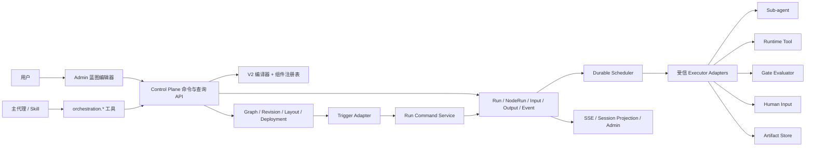
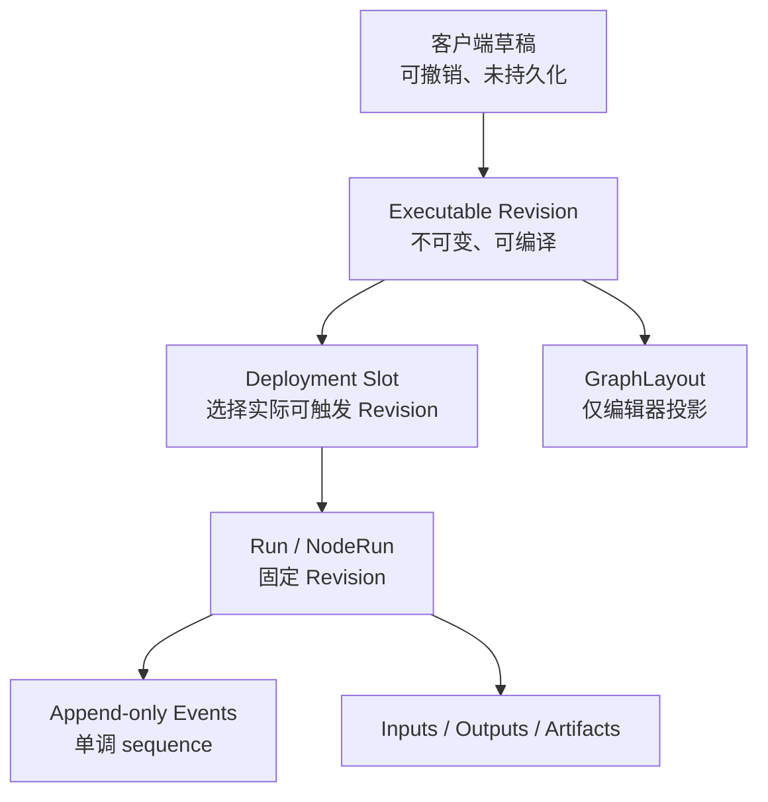
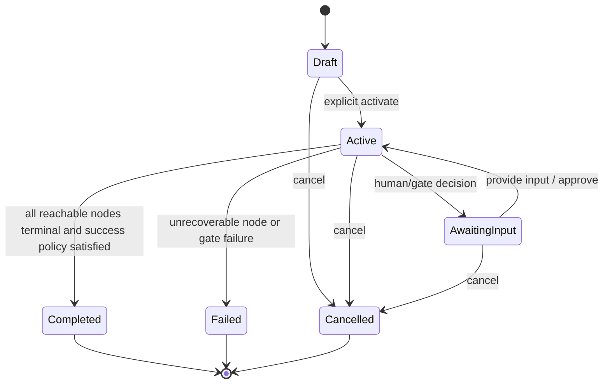
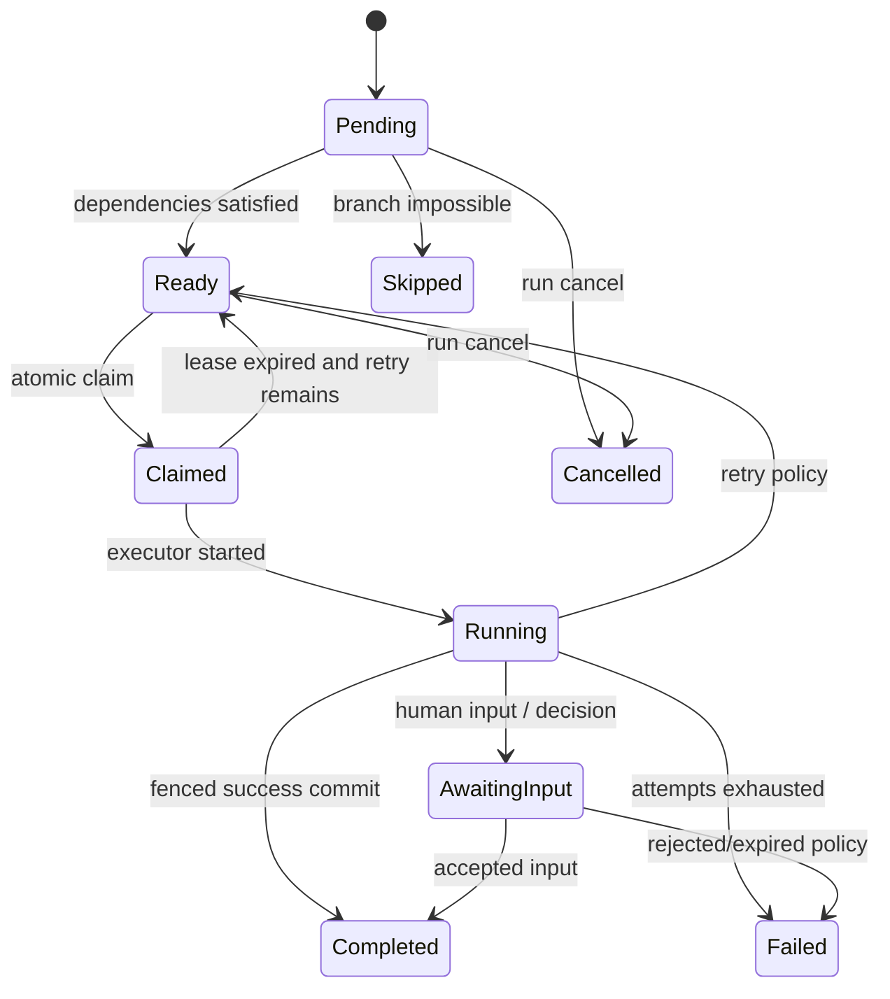
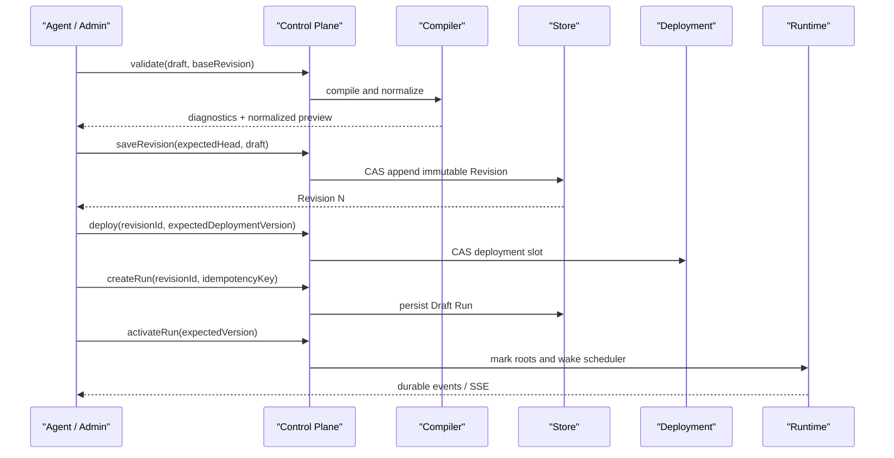

# ADR-071 通用 Agent 编排平台完整设计方案

> 状态：**design-baseline；不表示后续施工已经完成**  
> 日期：2026-08-10  
> 范围：Agent 生成任务图、蓝图编辑器、不可变修订、组件系统、多模态数据流、持久化调度、Agent 工具、MOA 模板、运行控制与交付边界  
> 前置：[ADR-069 MOA 子代理设计委员会](80ADR-069MOA子代理设计委员会编排核心ADR.md)、[ADR-070 通用 Agent 编排图基础架构](81ADR-070通用Agent编排图基础架构ADR.md)  
> 配套施工图：[后端与 Control Plane](83通用Agent编排后端执行内核与ControlPlane施工图.md)、[蓝图编辑器与组件系统](84通用Agent编排蓝图编辑器与组件系统施工图.md)、[测试交付与运维验收](85通用Agent编排交付测试与运维验收图册.md)

## 1. 结论

Pudding 应当实现前端蓝图编辑器，但它不是新的运行时，也不是业务事实源。完整产品采用以下分工：

1. Agent 或用户产生声明式 JSON 草稿；
2. Core 的组件注册表和纯编译器完成解析、类型检查、权限检查和 DAG 编译；
3. 保存操作只追加不可变 Graph Revision，不能覆盖历史；
4. GraphLayout 独立保存，拖动卡片不产生可执行修订；
5. 部署槽位明确选择一个已验证 Revision，触发器只对部署槽位创建 Run；
6. Durable Runtime 把 Run 固定到 Revision，并以状态机、CAS、claim lease 和 fencing token 调度；
7. 节点通过受信 executor adapter 执行子代理、工具、门禁或人工输入；
8. 多模态大对象只传 ArtifactRef，文本和小型 JSON 才允许 inline；
9. Admin UI 与 Agent 工具都只调用同一组 Control Plane API；
10. MOA 是可编译模板，不保留第二套长期调度内核。

图定义采用 `pudding.agent-orchestration/v2` JSON。JavaScript、C#、Shell 或任意表达式都不能成为图文件；它们只能存在于经过注册、版本化和权限审计的受信组件实现内部。

## 2. 当前事实与目标状态

本文严格区分“仓库当前已经具备”和“本施工包要求新增”。

| 能力 | 2026-08-11 当前事实 | 目标状态 |
|------|--------------------|----------|
| 图契约 | V2 JSON、节点、control/data edge、组件引用、触发器、多模态端口已经定义 | 冻结 V2，新增只采用版本化组件，不在 V2 内塞任意代码 |
| 编译 | 纯编译器已具备组件解析、端口兼容、DAG、route、权限与修订校验 | 提供 validate/diagnostics API，并把诊断精确映射到画布元素 |
| 持久化 | Graph/Revision/Layout/Run/RunInput/NodeRun/Event SQLite 事实表已具备；Run 创建冻结 Graph Input 默认值/调用值 | 增加部署槽位、节点输出、人工输入请求、通用命令幂等和事件投影 |
| Revision | Store 与 Admin 已支持 validate、expected-head CAS 和不可变新 Revision；历史切换/比较尚未完成 | Admin/Agent 均可在 expected head 上保存新 Revision，历史永不改写 |
| Layout | 独立 Layout CAS、拖拽和 viewport 保存已具备 | 新 Revision 继承布局，节点增删后按 ID 合并并保持独立版本 |
| Run 内核 | Create/Activate、root Ready、claim/renew/fence/start/terminal 已具备；无 predicate 的 `OnSuccess/OnCompletion/Always` 后继 Ready/Skipped 与 Run 终态已落地 | 补齐 predicate、重试、取消、人工输入和 gate |
| 执行器 | 通用 worker 已接入只读 SubAgent、图片生成和图片展示 executor；真实四节点链已运行 | 补齐通用 tool/gate/humanInput adapter，MOA 迁移到通用 runtime |
| Control Plane | Graph/Run 查询、events/watch、layout、Graph/Revision authoring 已具备；另有显式 Revision 的 Admin 调试 HTTP Hook | 补齐 deployment、通用 run control、human input/retry/cancel 与生产 Trigger adapter |
| Admin | ComfyUI 式全宽画布、悬浮工作台、typed authoring 与 Revision/Layout CAS 已具备；组件 UI 注册表支持 SubAgent 文本和图片组件 Artifact 输出 | 补齐 Revision 历史、Deployment、运行控制、其他多模态结果与组件 Palette |
| Agent 能力 | 尚无通用 `orchestration.*` 工具 | 与 Admin 共用 API/命令层，具备最小权限、幂等和可观察事件 |

在任何后续验收中，“页面能打开”“代码能编译”或“MOA 专用状态机能运行”都不能被当作通用编排已经完成。

## 3. 目标与非目标

### 3.1 目标

- 主代理可把用户请求编译为可审阅、可编辑、可显式激活的任务图；
- 用户可在类似 Unreal Blueprint 的画布中拖拽节点、连接强类型端口并查看诊断；
- Agent 和用户可编辑同一个 Graph，但通过 Head CAS 防止相互覆盖；
- 一个节点的输出可成为一个或多个后继节点的命名输入；
- 支持文字、JSON、图片、音频、视频、通用文件、事件和流式引用；
- 支持子代理、工具、聚合、判断、人工审批、网络、媒体、存储和事件触发组件；
- Run 可跨 Core 重启恢复，并提供连续、可回放的进度事件；
- MOA 设计委员会成为 Graph 模板实例，可复用全部运行、UI 和审计能力；
- 所有写副作用、外部网络、凭据使用和人工决策都可审计、可治理。

### 3.2 非目标

- 不实现图内任意脚本、`eval`、动态 C#、动态 Shell 或用户上传程序集；
- 不在单个 Run 内实现循环边；周期行为由 Trigger 创建新 Run；
- 不用前端状态替代服务端 Graph/Run/Event 事实；
- 不让 Skill 硬编码模型、直接管理 claim 或自行维护第二套工作流状态；
- 不在 Revision JSON 中内联图片、音频、视频或大文件 Base64；
- 不把 Core 业务逻辑迁入 PuddingDesktop；
- 不为尚未发布的开发数据长期保留多版本兼容层。

## 4. 核心架构



### 4.1 三个平面

| 平面 | 职责 | 禁止承担 |
|------|------|----------|
| Authoring Plane | 生成草稿、画布编辑、校验、diff、保存 Revision | 直接执行节点、改写历史 Revision |
| Control Plane | 权限、编译、CAS、部署、Run 命令、查询与事件订阅 | 长时间占用请求线程执行模型或媒体任务 |
| Data Plane | 调度、claim、执行、恢复、Artifact、事件提交 | 接受未经编译的临时图或 UI 私有格式 |

### 4.2 五类独立事实



- Draft 只存在于浏览器或 Agent 的工具调用参数中；
- Revision 是可执行内容事实；
- Layout 是视觉事实，不参与 executable content hash；
- Deployment 是“哪个 Revision 正在接收触发”的发布事实；
- Run/Event/Input/Output 是运行事实，永远不能被 Revision 编辑回写。

## 5. 为什么必须有 Deployment，而不能让 Graph Head 直接运行

Graph Head 表示最新保存的 Revision，不代表已经批准投入运行。如果触发器直接跟随 Head，则用户保存一个尚未部署的草稿 Revision 后，定时任务或 Webhook 会立即改变行为。

因此增加显式部署槽位：

- `draft/head`：最新保存 Revision，仅用于编辑和校验；
- `deployment(slot=default)`：当前激活 Revision；
- 可选环境槽：`development`、`production`，当前单机版先实现 `default`；
- 部署使用 `expectedDeploymentVersion` CAS；
- 触发器解析部署槽位后再创建 Run，并把 Revision 固定到 Run；
- 回滚等于把槽位指回历史 Revision，不修改历史内容；
- 手工“试运行”可以绕过 deployment，但必须显式指定 Revision，并标记 `runSource=manual-preview`。

部署不等于启动一个 Run。部署决定未来 Trigger 使用哪个 Revision；Run 激活决定某个已经创建的实例开始执行。

## 6. Graph V2 权威模型

### 6.1 顶层

```json
{
  "schemaVersion": "pudding.agent-orchestration/v2",
  "graphId": "media-review",
  "revisionId": "media-review/r003",
  "revision": 3,
  "parentRevisionId": "media-review/r002",
  "workspaceId": "default",
  "rootSessionId": "session:design",
  "createdByAgentId": "default.global_general-assistant",
  "objective": "分析用户素材并由专家组形成评审结论",
  "requiresExplicitActivation": true,
  "maxConcurrency": 4,
  "inputs": [],
  "triggers": [],
  "nodes": [],
  "edges": [],
  "metadata": {},
  "createdAtUtc": "2026-08-10T00:00:00Z"
}
```

保存时服务端必须覆盖 `revisionId/revision/parentRevisionId/createdByAgentId/createdAtUtc` 等审计字段，客户端只能提交 base head 和期望的新内容，不能伪造历史链。

### 6.2 节点与组件

节点保存业务意图和版本化组件引用；组件注册表保存可执行契约。

```text
NodeDefinition
  component: componentType + version + frozen contractHash
  executor/gate: 受限绑定，不含任意代码
  graphInputBindings: Graph input -> component input port
  configuration: 必须通过组件 config schema
  permissionMode: readOnly | explicitWrite
  failureBehavior: failRun | continue | awaitDecision
  maxAttempts / timeoutSeconds
```

底层 `nodeKind` 只允许：`subAgent`、`tool`、`humanInput`、`gate`。聚合、条件、HTTP、音视频处理等产品组件仍映射到这些受信执行边界，不通过不断增加调度节点类型实现。

### 6.3 Control Edge 与 Data Edge

Control edge 只决定是否满足调度条件；Data edge 只决定数据可见性和命名输入。两者都参与 DAG 校验，但不能互相隐式替代。

- `onSuccess`：上游成功才满足；
- `onCompletion`：上游成功、失败、跳过或取消进入终态即可满足；
- `always`：保留给显式 finally/审计语义，仍需所有声明的上游进入终态；
- data binding 指定 `sourcePortId/sourcePath/targetPortId/targetKey/aggregation`；
- 没有 control edge 但只有 data edge 的节点，data edge 同时构成数据依赖，必须等待所需输出；
- 多个前驱对单值目标端口的写入必须被编译器拒绝，除非组件端口为 `many`；
- 删除节点必须原子删除所有关联边，不能留下悬空引用。

当前 V2 的 `condition` 只能表达上游终态条件，尚不能表达“gate 输出为 true/false 时选择哪条分支”。在进入分支调度施工前，V2 必须增加可选的、版本化 `predicate`：它引用 source output port/path 和注册的纯 predicate evaluator。禁止在 edge 中写 JavaScript、C# 或字符串表达式。开发阶段尚无历史兼容负担，可直接完成这一 V2 契约补全；完成前 UI 不开放 switch/conditional edge。

### 6.4 DAG 与动态规划

单个 Revision 始终是静态 DAG。运行时如果发现需要新增任务，不在活动 Run 内篡改图，而是采用二选一：

1. 创建新 Revision 和新 Run，并通过 `correlationId/causationRunId` 关联；
2. 使用一个受信的 `sub-orchestration` 组件启动另一个已部署 Graph。

这使执行历史可重放，并避免动态节点破坏拓扑、claim 和审计语义。

## 7. 多模态数据模型

### 7.1 值信封

所有 graph input、node input 和 node output 使用同一个逻辑值信封：

```text
ValueEnvelope
  dataType
  contentType?
  inlineValue?       仅小文本、小 JSON、数字、布尔值
  artifacts[]        图片、音频、视频、文件及大输出
```

端口兼容同时检查：

1. `dataType`；
2. MIME / wildcard；
3. `one | many` 基数；
4. `inline | artifact | stream | event` delivery 交集。

### 7.2 Artifact 规则

- ArtifactRef 至少包含 `artifactId/contentType`；
- 建议同时冻结 `sizeBytes/sha256/fileName/metadata`；
- Artifact 内容由受治理的存储服务读取，节点间只传引用；
- 运行输出表存 ArtifactRef JSON，不复制二进制；
- 临时流先进入 staging，终态提交后转为 durable artifact；
- 取消或失败的 staging artifact 由保留期任务回收；
- UI 预览通过鉴权 API 获取，不能把本地真实路径暴露给浏览器；
- 文件、图片、音频和视频必须执行类型、大小、恶意内容和解码限制。

### 7.3 Stream 与 Event

- `stream` 是一次节点执行过程中的增量输出，不等价于持久事实；
- 关键增量可投影为节流后的事件，最终输出仍必须提交为完整 ValueEnvelope/Artifact；
- `event` delivery 用于事件型组件和 Trigger payload，不允许在 DAG 内形成无限订阅；
- UI 对 stream 使用临时视图，断线后以最终输出和 durable event 重新收敛。

### 7.4 完整定义示例

下例展示当前四类基础组件可表达的“研究 -> 复核 -> 用户确认”。`contractHash` 和 `routeKey` 为说明占位，真实保存值必须由 Catalog/服务端冻结；图中没有布局和运行状态。

```json
{
  "schemaVersion": "pudding.agent-orchestration/v2",
  "graphId": "design-review",
  "revisionId": "design-review/r002",
  "revision": 2,
  "parentRevisionId": "design-review/r001",
  "workspaceId": "default",
  "rootSessionId": "session:design-review",
  "createdByAgentId": "default.global_general-assistant",
  "objective": "研究设计请求、独立复核并等待用户确认",
  "requiresExplicitActivation": true,
  "maxConcurrency": 2,
  "inputs": [
    {
      "inputId": "request",
      "contract": {
        "dataType": "pudding.any",
        "mediaTypes": [],
        "cardinality": "one",
        "deliveries": ["inline", "artifact"]
      },
      "requiredAtActivation": true
    }
  ],
  "triggers": [
    {
      "triggerId": "manual",
      "trigger": {
        "triggerType": "pudding.trigger.manual",
        "version": "1",
        "contractHash": "sha256:<server-frozen-trigger-hash>"
      },
      "enabled": true,
      "configuration": {},
      "inputBindings": [
        { "sourcePath": "$.request", "targetInputId": "request" }
      ]
    }
  ],
  "nodes": [
    {
      "nodeId": "research",
      "kind": "subAgent",
      "title": "研究",
      "objective": "收集事实、案例和约束",
      "component": {
        "componentType": "pudding.agent.subagent",
        "version": "1",
        "contractHash": "sha256:<server-frozen-component-hash>"
      },
      "executor": {
        "kind": "subAgent",
        "role": "researcher",
        "templateId": "research/v1",
        "routeKey": "provider/model"
      },
      "graphInputBindings": [
        { "inputId": "request", "targetPortId": "request" }
      ],
      "expectedOutputContract": "pudding.content",
      "configuration": {},
      "permissionMode": "readOnly",
      "failureBehavior": "failRun",
      "maxAttempts": 2,
      "timeoutSeconds": 900,
      "metadata": {}
    },
    {
      "nodeId": "review",
      "kind": "subAgent",
      "title": "独立复核",
      "objective": "检查研究证据和结论",
      "component": {
        "componentType": "pudding.agent.subagent",
        "version": "1",
        "contractHash": "sha256:<server-frozen-component-hash>"
      },
      "executor": {
        "kind": "subAgent",
        "role": "reviewer",
        "templateId": "review/v1",
        "routeKey": "another-provider/model"
      },
      "graphInputBindings": [
        { "inputId": "request", "targetPortId": "request" }
      ],
      "expectedOutputContract": "pudding.content",
      "configuration": {},
      "permissionMode": "readOnly",
      "failureBehavior": "failRun",
      "maxAttempts": 1,
      "metadata": {}
    },
    {
      "nodeId": "confirm",
      "kind": "humanInput",
      "title": "用户确认",
      "objective": "展示评审结果并等待用户决定",
      "component": {
        "componentType": "pudding.control.human-input",
        "version": "1",
        "contractHash": "sha256:<server-frozen-component-hash>"
      },
      "graphInputBindings": [],
      "expectedOutputContract": "pudding.content",
      "configuration": {},
      "permissionMode": "readOnly",
      "failureBehavior": "awaitDecision",
      "maxAttempts": 1,
      "metadata": {}
    }
  ],
  "edges": [
    {
      "edgeId": "research-review-control",
      "fromNodeId": "research",
      "toNodeId": "review",
      "kind": "control",
      "condition": "onSuccess",
      "bindings": []
    },
    {
      "edgeId": "research-review-data",
      "fromNodeId": "research",
      "toNodeId": "review",
      "kind": "data",
      "condition": "onSuccess",
      "bindings": [
        {
          "sourcePortId": "result",
          "sourcePath": "$",
          "targetPortId": "context",
          "aggregation": "append"
        }
      ]
    },
    {
      "edgeId": "review-confirm-control",
      "fromNodeId": "review",
      "toNodeId": "confirm",
      "kind": "control",
      "condition": "onSuccess",
      "bindings": []
    },
    {
      "edgeId": "review-confirm-data",
      "fromNodeId": "review",
      "toNodeId": "confirm",
      "kind": "data",
      "condition": "onSuccess",
      "bindings": [
        {
          "sourcePortId": "result",
          "sourcePath": "$",
          "targetPortId": "prompt",
          "aggregation": "append"
        }
      ]
    }
  ],
  "metadata": { "template": "design-review/v1" },
  "createdAtUtc": "2026-08-10T00:00:00Z"
}
```

同一业务图的坐标、节点运行状态、输出和事件分别进入 Layout/Run/Output/Event 事实，不追加到此 JSON。

## 8. 组件体系

### 8.1 注册表是唯一发现入口

每个组件 descriptor 必须包含：

- `componentType`、`version`、`displayName`、`category`；
- `nodeKind`、`executorId`、`sideEffect`；
- `inputPorts`、`outputPorts`；
- `configSchemaReference`；
- `requiredCapabilities`；
- 由规范化 descriptor 计算的确定性 `contractHash`。

Revision 保存时冻结 hash；运行时若注册表中的同版本 hash 不一致，拒绝激活而不是静默运行漂移契约。组件升级必须发布新 version。
`configSchemaReference` 必须指向不可变、版本化或内容寻址的 Schema；Catalog 同时返回 `schemaHash`。同一个 reference 的内容不能原地变化，否则即使 descriptor hash 没变也会造成配置契约漂移。

### 8.2 组件实现边界

```text
Component Descriptor  --静态契约-->  Compiler / Admin Palette
Executor Adapter      --受信实现-->  Runtime
Configuration Schema  --表单/校验--> Admin / Compiler
Capability Policy     --授权-->      Activation / Worker
```

组件不能自行改 Run/Node 状态。Executor 只返回结构化结果，状态和事件由调度器在事务中提交。

### 8.3 首批组件分层

| 批次 | 类别 | 组件 | 默认副作用 |
|------|------|------|------------|
| P0 | Agent/Control | sub-agent、human-input、gate、tool-invoke | read/none；tool 由目标工具决定 |
| P1 | Flow/Data | merge、aggregate、select、schema-validate、template-render | none |
| P1 | Decision | compare、all、any、switch、quorum、approval | none |
| P2 | Network/Event | HTTP request、webhook trigger、connector event、orchestration event | read/write 依配置 |
| P2 | Storage | artifact read/write、workspace file read/write | read/write |
| P3 | Media | image inspect/transform/generate、audio transcribe/synthesize/transcode、video probe/transcode | read/write |
| P3 | Orchestration | invoke sub-graph、wait event、emit event | none/write |

`template-render` 只能使用受限占位符；`select` 使用受限 JSONPath；判断使用注册 evaluator。P0-P3 都不引入通用脚本节点。

## 9. 运行时状态机

### 9.1 Run 状态



### 9.2 NodeRun 状态



所有状态迁移与对应事件必须在同一 SQLite 事务提交。内存 signal、SSE 或 session 投影只能在提交之后唤醒消费者。

## 10. 调度语义

### 10.1 Ready 计算

一个 Pending 节点变为 Ready 必须同时满足：

- 所有必需 control 前驱已达到 edge condition；
- 所有必需 data binding 已有兼容值，或目标端口有合法默认值；
- 节点未被分支判定为不可达；
- Run 为 Active；
- 节点所需 capability 在 activation policy 中获准。

终态提交后，调度器只重算直接后继，并递归传播新产生的 Skipped，不能每次扫描整张大图。

### 10.2 Skip 和失败传播

- `onSuccess` 前驱失败且没有其他满足路径时，下游 `Skipped`；
- `failureBehavior=failRun` 在尝试耗尽时令 Run Failed，并取消未开始节点；
- `continue` 把失败视为可观察终态，下游仍需由 `onCompletion/always` 显式接收；
- `awaitDecision` 把 Run 置为 AwaitingInput，生成决策请求；
- gate 的 false 结果不直接等于 Run Failed，它通过命名输出和分支 edge 决定可达性；
- 任何分支语义必须可由 Revision 和事件重建，不能只藏在 worker 内存中。

### 10.3 重试、超时与 claim

- `maxAttempts` 是节点定义上限；
- 每次 claim 产生新 `claimId` 和递增 `fencingToken`；
- `executionRunId` 标识一次不可变尝试，`subSessionId` 标识可复用子代理对话；
- worker 需在 lease 的 1/3 周期续租；
- 旧 fence 的 output/terminal commit 必须拒绝；
- timeout 由 worker 和协调器双侧执行，最终以持久化状态为准；
- 幂等工具可自动重试，非幂等写工具默认进入人工决策。

## 11. Authoring、部署与运行生命周期



## 12. Agent 操作面

Agent 不接触数据库和内部 worker API。公开工具分为四组：

| 组 | 工具 | 权限与结果 |
|----|------|------------|
| Authoring | `orchestration.create`、`validate`、`revise`、`diff` | 默认只产生 Draft/Revision，不执行 |
| Deployment | `orchestration.deploy`、`rollback` | 需要显式权限；写入部署审计 |
| Run | `orchestration.run`、`inspect`、`watch` | run 使用幂等 key；watch 只读 |
| Control | `provide_input`、`approve`、`retry_node`、`cancel` | 要求 run/node version 或 command id |

Skill 只做以下工作：

- 判断用户请求是否值得编排；
- 收集意图、约束、交付物和缺失上下文；
- 选择模板或构造 Draft；
- 把 Graph/Run 事件翻译为对用户有意义的进度。

Skill 不选择隐式 fallback、不直接 spawn 专家组、不维护持久状态，也不绕开编译器。

## 13. MOA 映射

MOA 仍负责专业模板规则：统一设计请求、模型多样性、独立提案、非自评批判、主席综合和独立终审。编译后：

- stage -> gate component；
- member work item -> exact-route subAgent component；
- context/research/proposal/critique visibility -> data edge；
- quorum/coverage/independent-review -> versioned gate evaluator；
- blocking context gap -> humanInput；
- 全部运行由通用 Store/Scheduler/Executor/Event 完成。

MOA 专用 runtime 只能在迁移期作为行为对照；通用内核达到等价验收后删除，不能长期双写或双调度。

前端专家、后端专家、研究、评审、主席等角色以及 K3/GLM/DeepSeek 等模型选择属于专家组/Agent 配置。模板编译可以按能力和成本策略选择成员，但一旦生成 Revision，每个 subAgent 节点必须冻结 exact `provider/model`；运行期不再按角色隐式换模型。

## 14. 安全与治理

### 14.1 权限层

- 读：workspace 成员可读取授权 Graph/Run；
- 编辑：当前 Admin-only，后续可引入 owner/editor role；
- 部署：独立 `orchestration.deploy` capability；
- 执行：按组件 `requiredCapabilities` 与 side effect 决策；
- 写组件：默认拒绝，必须有 revision 审批和 run-time approval；
- 凭据：组件只拿 credential reference，不能把 secret 写入 Revision、Event、日志或 Artifact metadata。

### 14.2 网络与文件

- HTTP 组件执行 DNS/IP 重绑定检查，默认拒绝 loopback、link-local、metadata endpoint 和私网段，除非受信策略明确允许；
- redirect 每跳重新校验，限制方法、响应体大小、超时和 MIME；
- workspace 文件组件通过 PathHelper 和 scope root 解析，禁止路径穿越；
- `D:\data` 是用户运行数据，不是构建/测试输出目录；
- 二进制输入做 content sniffing，不只相信扩展名。

### 14.3 审计

需要可追溯：谁创建/编辑/部署 Revision，谁创建/激活/取消 Run，谁提供人工输入，哪个 worker 使用哪个 claim/fence，哪个 executor/组件版本产生了哪个 Artifact，以及任何权限拒绝。

## 15. 可观测性

### 15.1 日志字段

统一使用：

```text
graphId revisionId deploymentSlot runId nodeId attempt
claimId fencingToken executionRunId subSessionId
componentType componentVersion executorId workerId commandId
```

日志不得回显 prompt 全文、credential、ControlToken 或本地敏感路径。

### 15.2 指标

- graph compile success/failure 与 issue code；
- revision CAS conflict；
- deployment change/rollback；
- run queue depth、Ready/Running/AwaitingInput 数；
- claim latency、lease expiry、fence rejection；
- node duration、attempt、success/failure/skip；
- event commit/watch lag 和 sequence gap；
- artifact bytes、staging leak、media processor duration；
- provider/model token、cost 与 MOA 每阶段成本。

## 16. 关键一致性不变量

1. 任何 Run 永远固定一个不可变 `revisionId`；
2. Graph Head 变化不能改变部署中的 Revision；
3. Layout 变化不能改变 executable hash；
4. 组件同版本的 contract hash 不能漂移；
5. 未编译成功的 Revision 不能保存或部署；
6. 状态和事件在同一事务提交；
7. 只有当前 fence 可以提交节点结果；
8. sequence 在 Run 内连续单调递增；
9. Artifact 内容不进入图 JSON 或事件全文；
10. Agent/Admin 使用同一命令服务，不存在旁路写库；
11. 触发器启动新 Run，不在单个 DAG 内制造循环；
12. 删除 Graph 不能级联删除任何 durable Run 历史。

最终形态区分“结构编译”和“激活策略”：结构正确的 `explicitWrite` Revision 可以被保存和审阅，但没有 capability/approval 时不能部署或运行。在审批设施完成前，保持当前更严格策略——写节点连 Revision 保存也拒绝——不得用临时旁路放开。

## 17. 分期施工总览

| 阶段 | 交付 | 依赖 | 退出条件 |
|------|------|------|----------|
| S0 | 本文档包、契约冻结、缺口清单 | 当前基线 | 设计审阅通过 |
| S1 | Node CRUD、Revision CAS、Revision 历史 | S0 | **部分完成**：CRUD/CAS/冲突不覆盖已交付；历史切换待完成 |
| S2 | Port-aware edge editor、graph inputs、validate/diff | S1 | **部分完成**：端口拖线、Graph Input、前后端拒绝已交付；高级 binding/诊断定位待完成 |
| S3 | 后继 Ready/Skipped 与 Run 终态 | S2 | 多前驱/失败/分支可恢复 |
| S4 | subAgent/tool/gate/humanInput executor | S3 | **部分完成**：只读 SubAgent 与图片生成/展示 executor 已形成真实顺序 DAG；通用 tool/gate/humanInput 待完成 |
| S5 | Deployment、Trigger、Run 控制 | S4 | Head 与生产 Revision 隔离；当前 Admin-only HTTP Hook 只是显式 Revision 调试切片，不代表 S5 完成 |
| S6 | Agent 工具与 MOA 通用化迁移 | S5 | MOA 不再用专用 dispatcher |
| S7 | 数据/网络/媒体/Artifact 组件包 | S4-S6 | 多模态 E2E 通过 |
| S8 | 安全、性能、恢复与产品化 | 全部 | Desktop 重启恢复与长跑验收 |

任何阶段不得因为后续功能尚未完成而在当前层引入临时第二事实源。

### 17.1 2026-08-11 图片生成纵向切片

已实现一个有意受限但真实可运行的两节点纵向切片：`image-generation` 模板创建
`pudding.media.image-generate → pudding.media.image-preview`，data edge 把 `images` Artifact 输出送入展示组件。
Admin 以显式不可变 Revision 和类型化 prompt 创建/激活 Run；Runtime 生成图片后原子释放展示节点，展示 executor
读取并透传上游 ArtifactRef，两个组件各自在节点卡片/检查器呈现输出，最后一个节点与 Run 终态事件同事务提交。

该切片只证明无 predicate 的顺序媒体链与最小后继推进，不表示 S3/S4/S7 完成。版本化 predicate、
retry/cancel/human input、Deployment、通用 executor 包、媒体配额与完整安全策略仍按后续阶段施工。

### 17.2 2026-08-11 SubAgent 到图片的四节点切片

在两节点媒体链之上，当前实现已经把 node-run 输出升级为按端口持久化的
`portId -> AgentOrchestrationValueEnvelope`，并实现 `Replace/Append` 输入合并的受限解析器。只读
`pudding.agent.subagent` executor 复用 `ISubAgentInvocationService`、系统管理预算、精确
`provider/model` 路由、SubSession 与 Run Archive，不另建 Agent 主循环。

真实产品链为：`文案策划.result → 镜头文案.request → 生成图片.prompt → 展示图片.images`。
两个 Agent 节点各自提交文本输出和真实 child run/sub-session 身份，图片生成节点提交 Artifact 列表，展示节点透传同一
Artifact。审计主体 `manual:admin` 等值不再作为文件目录身份，而由 immutable workspace/graph 事实派生稳定、安全的
orchestration execution owner。

该切片仍不表示任意 JSONPath、`targetKey`、predicate、任意工具、写权限或分支 DAG 已完成；当前 resolver 对尚未实现的
路径形状显式拒绝，不能静默降级。

## 18. 已决事项

| 议题 | 决定 |
|------|------|
| 图定义使用 JSON、JS 还是 C# | JSON V2；JS/C# 只在受信组件内部 |
| 是否实现前端编辑器 | 实现；它是 authoring client，不是 runtime |
| 是否让 Graph Head 直接供触发器执行 | 否；增加 Deployment Slot |
| 布局是否进入 Revision | 否；GraphLayout 独立 CAS |
| 多模态是否内联 | 小文本/JSON 可 inline；媒体和大文件只用 ArtifactRef |
| 是否支持循环 | 单 Run 不支持；Trigger 或 sub-orchestration 创建新 Run |
| 是否开放通用脚本节点 | 不开放 |
| MOA 是否独立维护调度器 | 迁移后不维护 |
| 写副作用默认策略 | 默认拒绝，需 capability + approval |
| 并发编辑 | Head CAS；第一阶段冲突后显式 reload，后续增加三方 diff/merge |

## 19. 需要产品确认但不阻塞 S1-S4 的事项

以下只影响后期产品策略，不改变核心架构：

- 是否在首个版本提供 `development/production` 两个 deployment slot，还是只提供 `default`；
- Graph editor 的普通用户角色名称和授权模型；
- Artifact 默认保留期和单文件/单 Run 配额；
- 写组件审批是“每个 Revision 一次”还是“每个 Run 一次”；
- 媒体组件首批优先图像、音频还是视频。

## 20. 文档权威关系

- 本文决定总体产品和事实边界；
- ADR-070 继续记录当前 V2 契约和已经实现的基础；
- 后端类、事务、表、API 和算法以 [83 施工图](83通用Agent编排后端执行内核与ControlPlane施工图.md) 为准；
- Admin 交互、组件目录和多模态 UX 以 [84 施工图](84通用Agent编排蓝图编辑器与组件系统施工图.md) 为准；
- 分期、测试、部署、回滚和验收证据以 [85 图册](85通用Agent编排交付测试与运维验收图册.md) 为准；
- 代码与本文冲突时，先更新设计并记录决策，再施工，不能用隐式实现改变架构。
