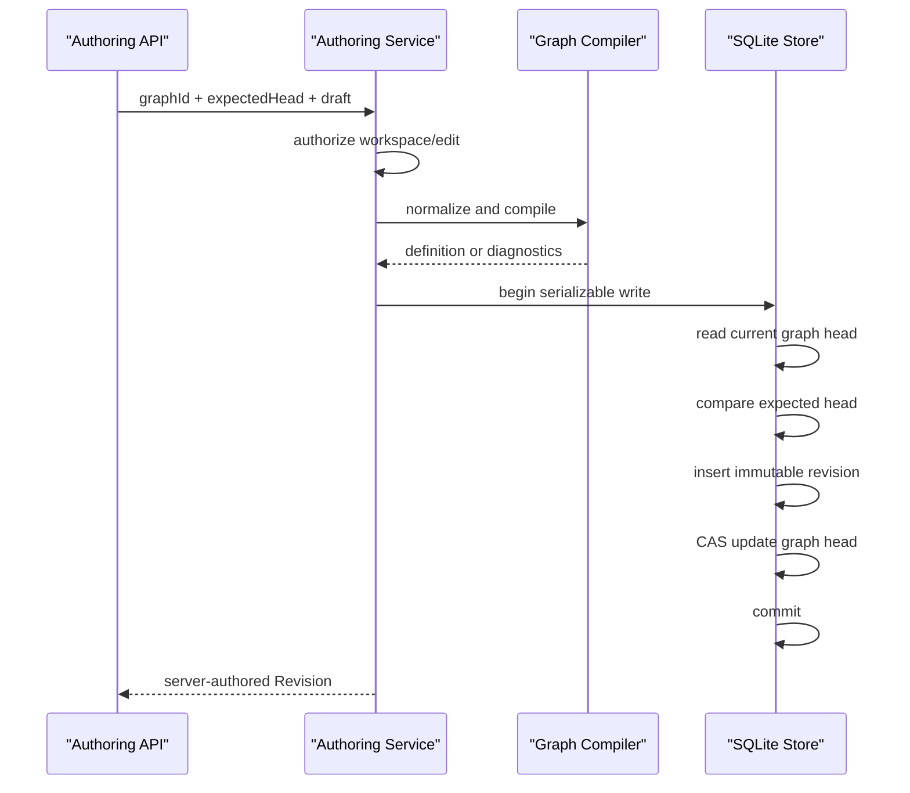
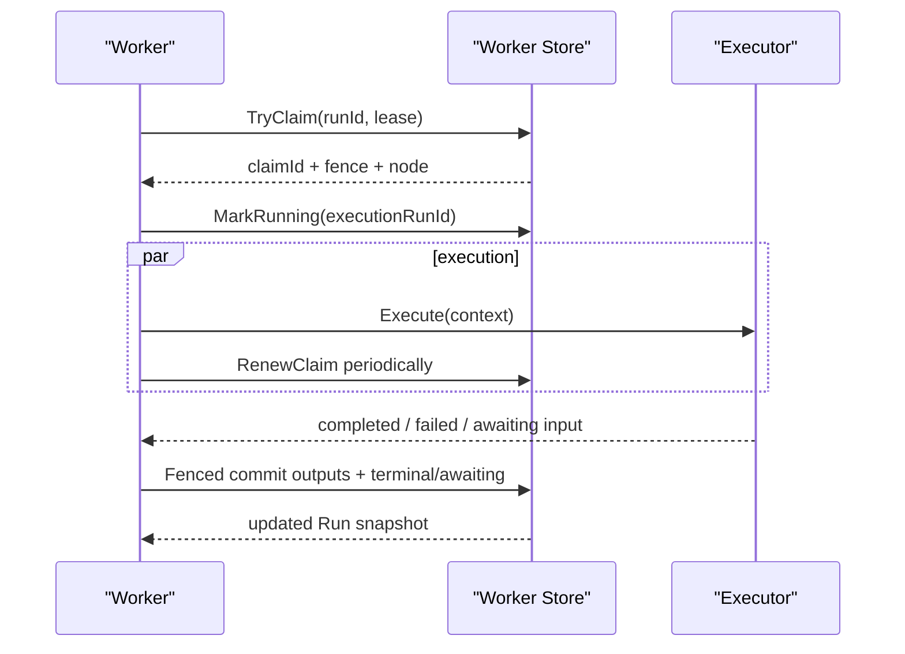

# 通用 Agent 编排后端执行内核与 Control Plane 施工图

> 状态：**construction-blueprint；尚未全部实现**  
> 日期：2026-08-10  
> 总体决策：[ADR-071](82ADR-071通用Agent编排平台完整设计方案ADR.md)  
> 前端配套：[蓝图编辑器与组件系统施工图](84通用Agent编排蓝图编辑器与组件系统施工图.md)  
> 验收配套：[测试交付与运维验收图册](85通用Agent编排交付测试与运维验收图册.md)

## 1. 施工目标

本册把总体设计落实为可逐文件施工的 .NET/Core/SQLite/API 图纸。最终后端必须提供：

- 不可变 Revision 的校验、保存、查询、diff 和 Head CAS；
- 与 Head 分离的 Deployment Slot；
- 固定 Revision 的 Run 创建、激活、取消、输入、重试和观察；
- edge-driven Ready/Skipped、Run 终态和跨重启恢复；
- subAgent/tool/gate/humanInput 四类 executor adapter；
- graph input、node input/output 与 ArtifactRef 的持久事实；
- Trigger 创建 Run 的幂等入口；
- Admin 与 Agent 共用的命令服务、鉴权、审计和稳定错误协议。

## 2. 分层和项目归属

| 项目 | 应拥有 | 不应拥有 |
|------|--------|----------|
| `PuddingCore` | 图/组件/运行契约、纯编译器、状态转换输入输出、接口 | SQLite、ASP.NET、具体模型/工具调用 |
| `PuddingPlatform` | SQLite store、命令服务、API、事件 follower、session 投影 | 子代理主循环、Desktop 进程管理 |
| `PuddingRuntime` | scheduler worker、executor adapter、子代理/工具/gate 调用 | HTTP Controller、数据库 schema 所有权 |
| `PuddingHost` | DI 组合、hosted service 注册、Desktop lifecycle API | 编排业务规则 |
| `PuddingDesktop` | 监督 Core、显示 WebView/Admin | 引用 PuddingHost 或直接读写编排数据库 |

依赖方向：`Core <- Platform`、`Core <- Runtime`、`Platform + Runtime <- Host`。Platform 和 Runtime 通过 Core 接口协作，不能互相形成循环引用。

## 3. 当前文件与新增施工文件

### 3.1 保留并扩展

| 现有文件 | 施工内容 |
|----------|----------|
| `Source/PuddingCore/Orchestration/AgentOrchestrationModels.cs` | 仅在 V2 能兼容的范围补事件名和命令 DTO；破坏性变更必须升 V3 |
| `AgentOrchestrationComponentContracts.cs` | 扩展受信组件 descriptor、config schema 解析和组件包注册 |
| `AgentOrchestrationGraphCompiler.cs` | 加入配置 schema、部署资格和可定位 diagnostics；继续保持纯函数 |
| `AgentOrchestrationPersistenceContracts.cs` | 增加 deployment、input/output、human-input、control command 契约 |
| `SqliteAgentOrchestrationStore.cs` | 先按聚合拆分 partial/协作者，再增加状态转换；避免继续长成单体 |
| `AgentOrchestrationSchemaBootstrapper.cs` | 增加新表/索引；开发阶段直接升级 schema，不建长期兼容层 |
| `AgentOrchestrationApiController.cs` | 保持只读 query/watch，不注入通用写 Store |
| `AgentOrchestrationLayoutApiController.cs` | 继续只负责 Layout |
| `AgentOrchestrationManagementApiController.cs` | Graph/Revision authoring 命令；不混入 Run worker 命令 |

### 3.2 建议新增

```text
Source/PuddingCore/Orchestration/
  AgentOrchestrationAuthoringContracts.cs
  AgentOrchestrationDeploymentContracts.cs
  AgentOrchestrationRunCommandContracts.cs
  AgentOrchestrationExecutionContracts.cs
  AgentOrchestrationValueContracts.cs
  AgentOrchestrationTransitionPlanner.cs

Source/PuddingPlatform/Services/Orchestration/
  AgentOrchestrationAuthoringService.cs
  AgentOrchestrationDeploymentService.cs
  AgentOrchestrationRunCommandService.cs
  AgentOrchestrationRunTransitionService.cs
  AgentOrchestrationArtifactProjectionService.cs
  AgentOrchestrationSessionProjector.cs
  SqliteAgentOrchestrationDefinitionStore.cs
  SqliteAgentOrchestrationRunStore.cs
  SqliteAgentOrchestrationEventStore.cs

Source/PuddingPlatform/Controllers/Api/
  AgentOrchestrationRevisionApiController.cs
  AgentOrchestrationDeploymentApiController.cs
  AgentOrchestrationRunCommandApiController.cs

Source/PuddingRuntime/Services/Orchestration/
  AgentOrchestrationSchedulerService.cs
  AgentOrchestrationWorkerService.cs
  AgentOrchestrationExecutorRegistry.cs
  AgentOrchestrationNodeInputResolver.cs
  SubAgentOrchestrationExecutor.cs
  ToolOrchestrationExecutor.cs
  GateOrchestrationExecutor.cs
  HumanInputOrchestrationExecutor.cs
```

文件名是施工目标，不要求一次性机械拆分已有 Store。拆分必须先用现有测试锁住行为，且每次只移动一个事实聚合。

## 4. Core 命令与结果契约

### 4.1 Authoring

```csharp
public sealed record AgentOrchestrationDraftValidateRequest
{
    public required string GraphId { get; init; }
    public string? BaseRevisionId { get; init; }
    public required AgentOrchestrationGraphDefinition Definition { get; init; }
}

public sealed record AgentOrchestrationDraftValidationResult
{
    public required bool IsValid { get; init; }
    public AgentOrchestrationGraphDefinition? NormalizedDefinition { get; init; }
    public IReadOnlyList<AgentOrchestrationValidationIssue> Issues { get; init; } = [];
    public IReadOnlyList<string> TopologicalNodeIds { get; init; } = [];
}

public sealed record AgentOrchestrationRevisionCreateRequest
{
    public required string GraphId { get; init; }
    public int ExpectedCurrentRevision { get; init; }
    public required AgentOrchestrationGraphDefinition Definition { get; init; }
}
```

公开 API 优先继续复用现有 `AgentOrchestrationRevisionWriteRequest { definition, expectedCurrentRevision }`，`AgentOrchestrationRevisionCreateRequest` 只在需要隔离传输 DTO 与领域命令时使用，不能同时长期保留两套含义相同的请求模型。

服务端生成以下字段：

- `revision = expectedCurrentRevision + 1`；
- `revisionId = graphId + "/r" + revision.ToString("D3")`；
- `parentRevisionId = currentRevisionId`；
- `createdByAgentId` 来自登录主体或 Agent identity；
- `createdAtUtc` 来自服务端时钟；
- 所有 component/trigger `contractHash` 来自当前注册表。

客户端提交这些字段时只作为预览信息，服务端不得信任。

### 4.2 Deployment

```csharp
public sealed record AgentOrchestrationDeploymentSnapshot
{
    public required string GraphId { get; init; }
    public required string Slot { get; init; }
    public required string RevisionId { get; init; }
    public long Version { get; init; }
    public required string DeployedBy { get; init; }
    public DateTimeOffset DeployedAtUtc { get; init; }
}

public sealed record AgentOrchestrationDeployRequest
{
    public required string GraphId { get; init; }
    public required string Slot { get; init; }
    public required string RevisionId { get; init; }
    public long ExpectedDeploymentVersion { get; init; }
}
```

部署前重复执行编译和 activation policy，防止组件被移除、capability 被收紧或 contract hash 漂移。部署历史通过 append-only event/audit 记录，current slot 只是一份 CAS 投影。

### 4.3 Run 命令

```csharp
public sealed record AgentOrchestrationRunStartRequest
{
    public required string GraphId { get; init; }
    public string Slot { get; init; } = "default";
    public string? RevisionId { get; init; } // 仅有 preview 权限时允许显式指定
    public required string RequestedByAgentId { get; init; }
    public required string IdempotencyKey { get; init; }
    public IReadOnlyDictionary<string, AgentOrchestrationValueEnvelope> Inputs { get; init; } =
        new Dictionary<string, AgentOrchestrationValueEnvelope>();
    public string? CorrelationId { get; init; }
    public string? CausationRunId { get; init; }
}
```

控制命令均带 `commandId` 和 optimistic version：

- `ActivateRun(runId, expectedVersion, commandId)`；
- `CancelRun(runId, expectedVersion, reason, commandId)`；
- `ProvideInput(runId, nodeId, requestId, value, expectedVersion, commandId)`；
- `RetryNode(runId, nodeId, expectedRunVersion, expectedNodeVersion, commandId)`；
- `ApproveDecision(runId, nodeId, decision, expectedVersion, commandId)`。

相同 commandId 重试返回原结果，不重复产生事件。

## 5. Store 接口拆分

避免让 Web Controller 获得 worker 权限，接口按能力拆分：

```text
IAgentOrchestrationQueryStore
  Graph/Revision/Layout/Deployment/Run/Event/Input/Output 查询

IAgentOrchestrationAuthoringStore
  SaveRevision / DeleteUnexecutedGraph

IAgentOrchestrationLayoutStore
  SaveLayout

IAgentOrchestrationDeploymentStore
  DeployRevision

IAgentOrchestrationRunCommandStore
  Create/Activate/Cancel/ProvideInput/Retry

IAgentOrchestrationWorkerStore
  Claim/Renew/Start/CommitOutput/CommitTerminal/RecoverExpired
```

第一阶段可由同一 SQLite 类实现这些接口，但 DI 和 Controller 只注入窄接口。

## 6. 数据库施工图

### 6.1 已有表

- `orchestration_graphs`：Graph Head；
- `orchestration_graph_revisions`：不可变 definition JSON/content hash；
- `orchestration_graph_layouts`：按 base Revision 的当前布局；
- `orchestration_runs`：Run 投影和 event high-water；
- `orchestration_node_runs`：节点执行投影、claim/lease/fence；
- `orchestration_run_events`：append-only event。

### 6.2 `orchestration_deployments`

```sql
CREATE TABLE orchestration_deployments (
    graph_id            TEXT    NOT NULL,
    slot                TEXT    NOT NULL,
    revision_id         TEXT    NOT NULL,
    version             INTEGER NOT NULL,
    deployed_by         TEXT    NOT NULL,
    deployed_at         INTEGER NOT NULL,
    PRIMARY KEY(graph_id, slot),
    FOREIGN KEY(graph_id) REFERENCES orchestration_graphs(graph_id),
    FOREIGN KEY(revision_id) REFERENCES orchestration_graph_revisions(revision_id)
);
```

### 6.3 `orchestration_run_inputs`

```sql
CREATE TABLE orchestration_run_inputs (
    run_id              TEXT NOT NULL,
    input_id            TEXT NOT NULL,
    value_json          TEXT NOT NULL,
    content_hash        TEXT NOT NULL,
    provided_by         TEXT NOT NULL,
    provided_at         INTEGER NOT NULL,
    PRIMARY KEY(run_id, input_id),
    FOREIGN KEY(run_id) REFERENCES orchestration_runs(run_id) ON DELETE CASCADE
);
```

Graph required input 在 Run 创建时一次冻结。后续 human input 不回写本表。

### 6.4 `orchestration_node_outputs`

```sql
CREATE TABLE orchestration_node_outputs (
    run_id              TEXT    NOT NULL,
    node_id             TEXT    NOT NULL,
    attempt             INTEGER NOT NULL,
    port_id             TEXT    NOT NULL,
    value_json          TEXT    NOT NULL,
    content_hash        TEXT    NOT NULL,
    is_final            INTEGER NOT NULL,
    recorded_at         INTEGER NOT NULL,
    PRIMARY KEY(run_id, node_id, attempt, port_id),
    FOREIGN KEY(run_id, node_id) REFERENCES orchestration_node_runs(run_id, node_id) ON DELETE CASCADE
);
```

`orchestration_node_runs.output_summary/artifact_reference` 暂时保留为列表查询投影，不作为完整输出事实源。
当前纵向切片已在同一 node-run 行加入 `outputs_json`，原子保存按端口的
`AgentOrchestrationValueEnvelope`；后续若按本节拆为 `orchestration_node_outputs`，必须一次性升级并保持单一事实源，禁止长期双写。

### 6.5 `orchestration_input_requests`

```sql
CREATE TABLE orchestration_input_requests (
    request_id          TEXT PRIMARY KEY,
    run_id              TEXT NOT NULL,
    node_id             TEXT NOT NULL,
    status              TEXT NOT NULL,
    prompt_json         TEXT NOT NULL,
    response_json       TEXT,
    requested_at        INTEGER NOT NULL,
    responded_at        INTEGER,
    responded_by        TEXT,
    expires_at          INTEGER,
    version             INTEGER NOT NULL,
    FOREIGN KEY(run_id, node_id) REFERENCES orchestration_node_runs(run_id, node_id) ON DELETE CASCADE
);
```

### 6.6 `orchestration_commands`

```sql
CREATE TABLE orchestration_commands (
    command_id          TEXT PRIMARY KEY,
    command_type        TEXT NOT NULL,
    aggregate_id        TEXT NOT NULL,
    request_hash        TEXT NOT NULL,
    result_json         TEXT NOT NULL,
    committed_at        INTEGER NOT NULL
);
```

同一 commandId 但 request hash 不同必须 Conflict，防止调用方误复用幂等键。

### 6.7 Run 表新增建议字段

```text
source_type            manual | trigger | subOrchestration
source_id              triggerId / parent node id
idempotency_key
correlation_id
causation_run_id
deployment_slot
```

`idempotency_key` 建唯一索引；同一 key 的请求 hash 一致时返回既有 Run，不一致时 Conflict。`orchestration_node_runs` 增加单调 `version` 并投影到 NodeRun snapshot，供人工输入、重试和节点级控制命令做 CAS；现有 status/fence CAS 仍保留。

部署槽位引入后，Graph 删除条件扩展为“无 durable Run 且无 Deployment”。必须先停用全部槽位，避免 Trigger 与删除竞争。

对开发阶段 SQLite 可直接补列/重建表；不引入永久双读兼容层。修改 `D:\data` 前仍需保留用户的 `config/llm.providers.json`，测试输出不得写入 DataRoot。

## 7. Revision 保存事务



不变量：

- 编译在进入写事务前完成；
- 不可变 parent/graph/component 事实尽量先用只读连接校验；
- 写事务只做 head read、revision insert 和 head CAS；
- 相同 Revision 内容重试只有在 request id/内容 hash 一致时返回 Unchanged；
- Head Conflict 返回 `currentRevision/currentRevisionId`，不自动覆盖。

## 8. Draft 校验和诊断协议

`POST /api/orchestrations/graphs/{graphId}/validate` 不写库，返回：

```json
{
  "isValid": false,
  "issues": [
    {
      "code": "orchestration.port_incompatible",
      "message": "image/* artifact cannot connect to pudding.text inline",
      "path": "edges[edge-image-to-text].bindings[0]",
      "severity": "error",
      "elementType": "edge",
      "elementId": "edge-image-to-text",
      "portId": "input"
    }
  ],
  "topologicalNodeIds": []
}
```

现有 `Code/Message/Path` 继续保留；API projection 增加 `severity/elementType/elementId/portId`，不要求 Core issue 直接依赖前端。

稳定 issue code 至少覆盖：schema、identity、revision、component、contract hash、config、node、executor、route、permission、input、trigger、edge、port、cardinality、MIME、delivery、cycle、concurrency。

## 9. API 图纸

### 9.1 Authoring

| 方法 | 路径 | 状态 | 说明 |
|------|------|------|------|
| GET | `/api/orchestrations/catalog` | 已有 | 组件/Trigger descriptor |
| GET | `/api/orchestrations/catalog/schemas/{**schemaId}` | 新增 | 只读版本化 configuration JSON Schema；不允许脚本 |
| POST | `/api/orchestrations/graphs` | 已有 | 创建 Graph + server-authored r1 |
| DELETE | `/api/orchestrations/graphs/{graphId}` | 已有 | 无 Run Graph 的 Head CAS 删除 |
| GET | `/api/orchestrations/graphs/{graphId}/latest` | 已有 | Head Revision |
| GET | `/api/orchestrations/graphs/{graphId}/revisions` | 已有 | Revision 历史 |
| GET | `/api/orchestrations/revisions/{**revisionId}` | 已有 | 指定 Revision |
| POST | `/api/orchestrations/graphs/{graphId}/validate` | 新增 | 无副作用校验草稿 |
| PUT | `/api/orchestrations/graphs/{graphId}/revisions` | 新增 | Head CAS 创建下一 Revision |
| GET | `/api/orchestrations/graphs/{graphId}/diff` | 新增 P2 | server-side semantic diff |

`PUT revisions` 的 route graphId 必须等于 payload graphId。返回 201；CAS 冲突返回 409 和 current head；编译失败返回 422 和 diagnostics；身份/权限错误用 401/403；不存在返回 404。

Catalog API projection 在现有 `descriptor + contractHash` 外增加不参与 contract hash 的运行态字段：`availability=available|unavailable|deprecated`、`unavailableReason`。组件结构契约与本机暂时不可执行是两件事；Revision 可读取历史 descriptor，但部署必须拒绝 unavailable 组件。

### 9.2 Layout

现有 GET/PUT 保持。新增 Revision 时不复制数据库 Layout 行；Admin 首次打开新 Revision 时按相同 nodeId 继承上一 Revision 的坐标，在首次保存时创建新 baseRevision layout L1。

### 9.3 Deployment

| 方法 | 路径 | 说明 |
|------|------|------|
| GET | `/api/orchestrations/graphs/{graphId}/deployments` | 读取所有槽位 |
| PUT | `/api/orchestrations/graphs/{graphId}/deployments/{slot}` | CAS 部署/回滚到指定 Revision |
| DELETE | `/api/orchestrations/graphs/{graphId}/deployments/{slot}` | 停用 Trigger，不删除 Revision |

### 9.4 Run commands

| 方法 | 路径 | 说明 |
|------|------|------|
| POST | `/api/orchestrations/runs` | 幂等创建 Draft Run，解析 deployment 或 preview Revision |
| POST | `/api/orchestrations/runs/{runId}/activate` | expectedVersion 激活 |
| POST | `/api/orchestrations/runs/{runId}/cancel` | 幂等取消 |
| POST | `/api/orchestrations/runs/{runId}/nodes/{nodeId}/input` | 响应当前 input request |
| POST | `/api/orchestrations/runs/{runId}/nodes/{nodeId}/retry` | 按策略重试终态节点 |
| GET | `/api/orchestrations/runs/{runId}` | 已有 snapshot |
| GET | `/api/orchestrations/runs/{runId}/events` | 已有 durable replay |
| GET | `/api/orchestrations/runs/{runId}/watch` | 已有 replay-to-live SSE |
| GET | `/api/orchestrations/runs/{runId}/outputs` | 新增完整端口输出/ArtifactRef |

Worker claim/start/terminal 接口不通过公开 HTTP 暴露；同进程使用窄 Store，未来跨进程 worker 再提供独立、机器鉴权的 internal plane。

### 9.5 Admin HTTP Hook 调试入口（已实现的隔离切片）

在 Deployment/生产 Trigger adapter 尚未施工前，Admin 可用以下接口对某个**已经保存的不可变 Revision**做 API Hook 调试：

```http
POST /api/orchestrations/hooks/{graphId}/{triggerId}?revisionId={revisionId}
Authorization: Bearer <ADMIN_TOKEN>
Content-Type: application/json

{
  "sourceEventId": "debug-20260811-001",
  "payload": { "message": "hello" }
}
```

- 必须显式提供 `revisionId`；接口不得读取 Graph Head，也不得把 Head 当作部署槽位；
- `triggerId` 必须属于该 Revision、类型为 `pudding.trigger.webhook` 且已启用；
- payload 只支持 `$`、字段和数组索引组成的受限路径，映射结果按 Graph Input 契约校验并冻结到 `orchestration_run_inputs`；
- `(graphId, revisionId, triggerId, sourceEventId)` 生成确定性 Run ID；同 payload 重试返回既有 Run，不同 payload 复用同一事件 ID 返回 409；
- 请求体上限 1 MiB，当前入口仅限 Admin Bearer；201 表示新建并激活，200 表示幂等重放；
- 当前入口不是公开匿名 webhook：Deployment 解析、secret/signature、rate limit、外部 source adapter 和生产审计仍属于 S5。

## 10. 统一错误响应

```json
{
  "code": "orchestration.revision_conflict",
  "message": "Graph head advanced from r2 to r3.",
  "traceId": "...",
  "currentVersion": 3,
  "currentRevisionId": "graph/r003",
  "issues": []
}
```

规则：

- `code` 稳定、机器可读；
- `message` 面向操作者，不含 secret；
- CAS 使用 409；
- 合法 JSON 但编译失败使用 422；
- 状态不允许使用 409；
- 参数形状错误使用 400；
- stream 启动后错误发送 `orchestration.stream.error`，不能伪装正常结束。

## 11. 激活事务

Run 创建和激活保持两步：生成不等于执行授权。

激活流程：

1. 读取固定 Revision；
2. 重新解析组件和 activation policy；
3. 校验所有 required graph input；
4. CAS `Draft -> Active`；
5. 对没有前驱且输入满足的根节点写 `Ready`；
6. humanInput 根节点可直接写 `AwaitingInput` 并创建 input request；
7. 同事务追加 RunActivated、NodeReady/RunAwaitingInput 事件；
8. commit 后 signal scheduler/watch。

如果不存在可达根节点，激活必须失败并返回编译/状态诊断，不能产生永远 Active 的空 Run。

## 12. 后继状态转换算法

### 12.1 纯 Transition Planner

`AgentOrchestrationTransitionPlanner` 输入：

- 不可变 definition；
- 当前 Run/NodeRun 快照；
- 当前提交节点及其 terminal outcome；
- 已提交端口输出；
- 当前时间和 policy。

输出只包含计划，不访问数据库：

```text
NodeTransitions[]: nodeId, expectedStatus, targetStatus, reason
RunTransition?: expectedStatus, targetStatus, reason
Events[]: eventType, nodeId, summary, attributes
InputRequests[]
```

Store 在一个事务中验证 expected status、写 output、应用计划、递增 run version/sequence，再提交事件。

### 12.2 就绪判定伪代码

```text
for each direct successor of terminalNode:
  if successor is not Pending: continue
  control = evaluate all incoming control edges
  data = resolve all graph-input and incoming data bindings

  if any required branch is impossible:
      mark Skipped
      enqueue successor for skip propagation
  else if control satisfied and data complete:
      if humanInput:
          mark AwaitingInput; create request
      else:
          mark Ready

after propagation:
  if any node irrecoverably failed with failRun:
      fail run and cancel non-terminal nodes
  else if all nodes terminal:
      complete or fail run from policy
  else if at least one input request open and no runnable nodes:
      mark run AwaitingInput
  else:
      keep Active
```

同一个 node transition 必须使用 `WHERE status = @expected` CAS。并发完成不同前驱时，冲突的一方重新读取快照并重新规划，不能覆盖另一方结果。

### 12.3 条件分支契约补全

进入 S3 前，为 control edge 增加可选 predicate：

```csharp
public sealed record AgentOrchestrationEdgePredicate
{
    public required string EvaluatorId { get; init; }
    public required string Version { get; init; }
    public string? ContractHash { get; init; }
    public required string SourcePortId { get; init; }
    public string SourcePath { get; init; } = "$";
    public IReadOnlyDictionary<string, JsonElement> Parameters { get; init; } =
        new Dictionary<string, JsonElement>();
}
```

`condition` 先判断上游是否达到约定终态，`predicate` 再对已提交 output 做纯函数判定。没有 predicate 表示普通依赖。predicate evaluator 同样受版本和 contract hash 管理；不支持任意表达式。Compiler 校验 port/path/evaluator，Transition Planner 只消费已经解析的 predicate。

## 13. Data Binding 执行

### 13.1 值解析顺序

1. GraphInputBindings；
2. incoming data edges；
3. component config defaults；
4. 端口 required 检查。

`sourcePath` 使用受限 JSONPath 子集，仅允许字段、数组索引和 `$`；禁止函数、脚本、递归执行表达式。ArtifactRef 的属性可选择，但内容读取必须由 executor 通过 artifact service 完成。

### 13.2 聚合

- `replace` 只允许一个确定性来源；
- `append` 只允许目标 `cardinality=many`；
- 聚合顺序按编译后的拓扑序、source nodeId、binding index 固定，不能依赖完成时间；
- 一个 required binding 对应的上游失败时，由 edge condition 和 node failure policy 决定 skip/await/fail。

## 14. Executor 契约

```csharp
public interface IAgentOrchestrationNodeExecutor
{
    string ExecutorId { get; }
    Task<AgentOrchestrationExecutionResult> ExecuteAsync(
        AgentOrchestrationExecutionContext context,
        CancellationToken cancellationToken);
}

public sealed record AgentOrchestrationExecutionContext
{
    public required string RunId { get; init; }
    public required string NodeId { get; init; }
    public required int Attempt { get; init; }
    public required long FencingToken { get; init; }
    public required AgentOrchestrationNodeDefinition Node { get; init; }
    public required IReadOnlyDictionary<string, AgentOrchestrationValueEnvelope> Inputs { get; init; }
    public required AgentOrchestrationExecutionIdentity Identity { get; init; }
}
```

结果只允许：

- `Completed(outputs)`；
- `Failed(errorCode, retryable, summary)`；
- `AwaitingInput(prompt, contract, expiry)`。

executor 不自行选择目标 node 状态，不调用 Store terminal API，不发布 durable event。Worker 拿结果后以当前 fence 提交。

## 15. 四类基础 Executor

### 15.1 SubAgent

- `routeKey` 必须是冻结的 `provider/model`；
- 通过 `ILlmConfigService.Resolve(provider, model)` 精确解析，不走 profile fallback；
- 调用现有 `ISubAgentInvocationService`；
- 记录独立 `executionRunId` 和可复用 `subSessionId`；
- input 只包含端口绑定允许的上下文；
- permission mode 转为工具 allowlist；
- 输出转换为 `result` 端口 ValueEnvelope，长内容写 Artifact/run archive。

### 15.2 Tool

- `toolId` 必须解析为注册工具；
- 组件 side effect 与工具实际 side effect 取更严格者；
- 参数由命名输入和 configuration 构造，不接受模型临时改写 schema；
- 非幂等写工具失败不自动重试；
- 工具原始输出先归一化再提交端口值。

### 15.3 Gate

- `evaluatorId + version` 必须来自 gate registry；
- evaluator 是纯函数或只读服务；
- 输出结构固定包含 `decision/reason/evidence`；
- quorum、coverage、schema、context-complete、approval 是不同 evaluator；
- 需要用户决定时返回 AwaitingInput，而不是 worker 阻塞等待。

### 15.4 HumanInput

- executor 不占用 claim 长时间等待；
- 首次执行创建 `orchestration_input_requests` 并释放 worker；
- NodeRun 进入 AwaitingInput，Run 按全局可运行情况决定 Active/AwaitingInput；
- ProvideInput 校验 request id、version、端口契约和身份；
- 响应与 NodeCompleted 在同一事务提交；
- 重复响应返回原结果，冲突响应 409。

## 16. Scheduler 与 Worker

### 16.1 Scheduler

`AgentOrchestrationSchedulerService` 是轻量协调器：

- 启动时扫描 Active Run 和过期 claim；
- 监听 committed signal，signal 丢失时周期扫描兜底；
- 只把 runId 放入有界队列，使用集合去重；
- 每个 Run 的 claim 仍由数据库原子限制 `maxConcurrency`；
- 不把整个 Run 快照长期作为内存权威。

### 16.2 Worker



进程关闭时停止领取新任务、取消执行 token，并给可中断 executor 一个短 grace period。无法完成的 claim 依赖 lease expiry 恢复，不把强制进程退出误报为节点成功。

## 17. Trigger 运行

Trigger adapter 只产生规范化触发信封：

```text
triggerId graphId slot sourceEventId occurredAt payload artifactRefs
```

流程：

1. 读取 deployment slot；
2. 读取该 Revision 的 trigger definition；
3. 校验 trigger type/version/hash 和 enabled；
4. 用 `graphId + triggerId + sourceEventId` 形成 idempotency key；
5. 按 input bindings 构造 graph inputs；
6. 创建并按策略激活新 Run；
7. 写 correlation/causation。

Schedule、Webhook、Connector 与 orchestration event 只实现 source adapter，不各自复制 Run 创建逻辑。

当前 Admin 调试 HTTP Hook 特意跳过步骤 1，改为要求调用方显式传入不可变 `revisionId`。这是无 Deployment 时的开发入口，不得扩展为“自动使用 Head”；生产 adapter 仍必须完整遵循上述七步。

## 18. Event 与 Session 投影

### 18.1 事件补充

建议新增稳定事件名：

```text
orchestration.revision.created
orchestration.deployment.changed
orchestration.run.input.requested
orchestration.run.input.provided
orchestration.node.skipped
orchestration.node.retry_scheduled
orchestration.node.cancelled
orchestration.node.output.committed
orchestration.run.resumed
```

Event 只存摘要、ID、状态和 ArtifactRef，不存完整媒体或 secret。

### 18.2 Session projector

- 订阅已提交 orchestration events；
- 使用 eventId 幂等写 root session；
- 只投影用户可理解的阶段、等待输入、失败和最终交付；
- 高频 token/stream 事件节流，不淹没聊天历史；
- projector 失败不回滚编排事务，可从 sequence checkpoint 追赶。

## 19. 权限与 Activation Policy

Activation Policy 输入：主体、workspace、Revision、组件 descriptors、deployment slot。输出 allow/deny + issues。

规则至少包含：

- exact route 是否存在且允许；
- component required capabilities；
- side effect；
- external network scope；
- credential refs；
- workspace/data root scope；
- max concurrency、timeout、artifact quota；
- 是否需要审批。

Admin 身份不等于自动允许任意运行副作用。Admin 可编辑/部署与 Runtime 获得资源能力是两个决策。

## 20. 并发和 SQLite 纪律

- 不可变事实校验尽量先走 read-only connection；
- 写事务短小，不在事务中调用模型、网络、文件或 compiler；
- 所有 CAS 更新检查 affected rows；
- `busy_timeout` 只作为短竞争缓冲，不能掩盖长写事务；
- claim 查询使用已有 `(run_id,status,node_id)` 索引；
- 后继计算所需 edge/definition 来自 immutable JSON，可在事务前解析，事务内只复核版本/状态；
- output 与 terminal/event 必须同事务；
- 事件 sequence 由当前 `head_sequence + 1` 分配，唯一索引兜底；
- 不允许多个 Core 同时以不同主管共享同一 `D:\data`；Desktop 与 dev-up 必须互斥。

## 21. 测试文件施工图

```text
Source/PuddingCoreTests/Orchestration/
  AgentOrchestrationTransitionPlannerTests.cs
  AgentOrchestrationDataBindingResolverTests.cs
  AgentOrchestrationActivationPolicyTests.cs

Source/PuddingPlatformTests/Services/Orchestration/
  AgentOrchestrationAuthoringServiceTests.cs
  AgentOrchestrationDeploymentStoreTests.cs
  AgentOrchestrationRunTransitionStoreTests.cs
  AgentOrchestrationHumanInputStoreTests.cs
  AgentOrchestrationCommandIdempotencyTests.cs
  AgentOrchestrationSessionProjectorTests.cs

Source/PuddingRuntimeTests/Services/Orchestration/
  AgentOrchestrationSchedulerServiceTests.cs
  SubAgentOrchestrationExecutorTests.cs
  ToolOrchestrationExecutorTests.cs
  GateOrchestrationExecutorTests.cs
  HumanInputOrchestrationExecutorTests.cs
```

详细验收矩阵见 85 图册。每个持久化测试必须使用系统 Temp 或仓库 `.tmp-test-out`，不得把测试数据库放入 `D:\data`。

## 22. 建议施工顺序

1. 冻结新 DTO 与错误码；
2. `PUT revisions` + validate API + Controller/Store tests；
3. 前端 Node CRUD 保存 r2/r3；
4. graph inputs/data binding resolver；
5. edge editor 与编译诊断；
6.纯 Transition Planner；
7. Store terminal transaction 接入 planner；
8. Run cancel/retry/human input；
9. executor registry 和四类基础 executor；
10. scheduler hosted service 与跨重启恢复；
11. deployment slot；
12. trigger adapters；
13. Agent tools 与 MOA 迁移；
14. 扩展组件包、安全与性能收口。

每一步都必须保持现有只读 API、Layout CAS 和 event replay 测试通过。

## 23. 后端完成定义

后端只有同时满足以下条件才算完成：

- 可以保存和读取多代不可变 Revision，CAS 冲突不丢草稿；
- Head 与 Deployment 分离，历史 Revision 可回滚部署；
- 多前驱 DAG 在不同完成顺序下得到相同 Ready/Skipped 结果；
- Run 在 Core 重启、claim 过期和 worker 迟到提交后保持一致；
- human input 不占 worker，输入可幂等恢复；
- subAgent/tool/gate/humanInput 都经统一 executor contract；
- output/terminal/event 原子，watch 无 gap；
- Agent/Admin 无旁路写库；
- 写副作用、网络、credential 与 Artifact 都受策略治理；
- 真机 Desktop 部署后 hash、Ready、health 和业务 API 均验证为新构建。

## 24. 2026-08-11 图片生成纵向切片

当前已落地的最小执行闭环如下：

1. `AgentOrchestrationManualRunService` 要求 caller 指定 `graphId + revisionId + requestId`，冻结类型化 Run Inputs 后幂等 Create/Activate，绝不解析 Graph Head；
2. `AgentOrchestrationWorkerService` 领取已注册 executor 的 Ready 节点；当前产品组合根注册 `pudding.media.image-generate` 与 `pudding.media.image-preview`，均以 lease/fence 保护提交；
3. `ImageGenerateOrchestrationNodeExecutor` 从冻结输入读取 prompt/参考图，复用 `IImageGenerationService`，paid-call key 固定为 `runId + nodeId + attempt`，输出只存 `ArtifactRef`；
4. `ImagePreviewOrchestrationNodeExecutor` 按 data edge 的 `images` 输入读取上游主 ArtifactRef，透传同一引用，不复制图片 bytes；
5. `SqliteAgentOrchestrationStore` 在 terminal commit 事务内，对无 predicate 的入边计算后继 Ready/Skipped；全部节点终态时同步提交 Run `Completed/Failed` 事件。

当前只完成 Transition Planner 的最小无 predicate 分支，`OnSuccess/OnCompletion/Always` 可组合；按端口 output 集合和
多值 Artifact 透传已经进入 node-run 持久事实，但 predicate evaluator、retry/cancel/human input 仍未落地，不能把顺序链成功描述为通用 DAG scheduler 已完成。

成品组合根是 `PuddingHost` 的 `AddPlatformServices`，它不调用 `RuntimeServiceExtensions.AddPuddingRuntime`。executor/hosted worker 必须在真实 Host 组合根注册；只修改 Runtime 扩展会出现 API 已更新但节点永久停在 Ready 的假部署。

## 25. 2026-08-11 四节点 SubAgent/图片执行切片

1. `AgentOrchestrationNodeInputResolver` 从冻结 Graph Inputs 和已完成前驱的 `outputs[portId]` 解析节点输入；当前仅接受 `$` 且不接受 `targetKey`，支持确定性的 `Replace/Append`；
2. `SubAgentOrchestrationNodeExecutor` 要求冻结 `role/template/provider/model`，复用现有 `ISubAgentInvocationService`，不下放数值预算、不允许子委派/建 Agent，当前能力策略为无工具、无网络、无文件写；
3. child `RunId/SubSessionId` 与 `result` 文本在同一次 fenced terminal commit 中进入 node-run；worker 以 90 秒周期续租 5 分钟 claim，长 Agent 调用没有任意 240 秒默认截断；
4. `outputs_json` 与 terminal/event/后继 Ready 在同一 SQLite 事务提交，`output_summary/artifact_reference` 只做小投影；
5. 手动或 HTTP Hook 的 `RequestedByAgentId` 是审计主体，不能作为运行归档目录。SubAgent executor 从 workspace/graph 派生稳定的 filesystem-safe execution owner，避免 `manual:admin` 中的 `:` 污染 Windows 路径。

首个产品链 `文案策划 → 镜头文案 → 生成图片 → 展示图片` 已证明三个 typed data edge 可以跨两个真实模型调用和一个媒体调用传递事实；它不替代多前驱、分支、恢复和副作用策略的后续验收。
