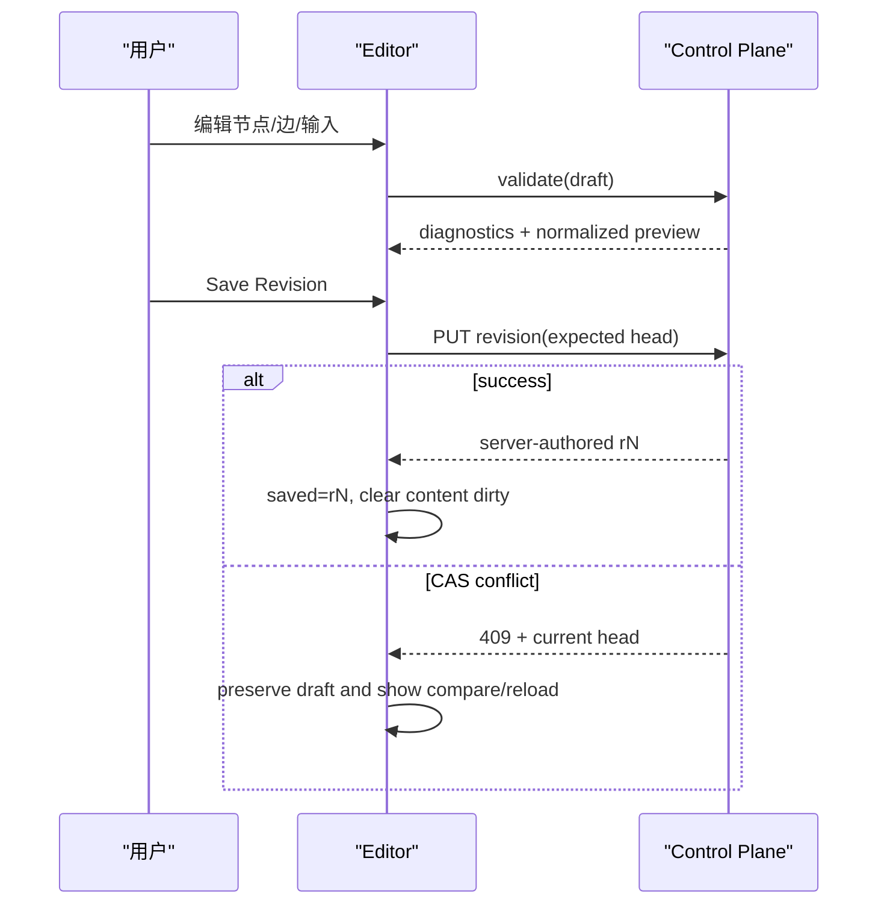

# 通用 Agent 编排蓝图编辑器与组件系统施工图

> 状态：**construction-blueprint；尚未全部实现**  
> 日期：2026-08-10  
> 总体决策：[ADR-071](82ADR-071通用Agent编排平台完整设计方案ADR.md)  
> 后端配套：[执行内核与 Control Plane 施工图](83通用Agent编排后端执行内核与ControlPlane施工图.md)  
> 验收配套：[测试交付与运维验收图册](85通用Agent编排交付测试与运维验收图册.md)

## 1. 是否需要实现前端编辑器

需要。理由不是“低代码看起来直观”，而是编排图存在普通表单难以可靠表达的关系：

- 多前驱控制依赖；
- 输出端口到输入端口的数据可见性；
- 分支和门禁；
- 多模态端口兼容；
- 运行状态与定义结构的叠加；
- Revision、Layout、Deployment 和 Run 四种不同状态。

但编辑器不能成为第二套 schema 或运行时。它只编辑 `pudding.agent-orchestration/v2` Draft，所有最终校验和保存由后端完成。

## 2. 产品结构

### 2.1 页面信息架构

```text
/admin/orchestration
  ├─ Graph Library       Graph 发现、新建、复制、删除、归档
  ├─ Blueprint Editor    Definition + Layout 编辑
  ├─ Revisions           历史、diff、恢复为新 Revision
  ├─ Deployments         当前槽位、部署、回滚、停用
  └─ Runs                Run 列表、时间线、输入、重试、取消、输出
```

首版可保持同一路由，通过 query 参数表达：

```text
workspaceId
graphId
revisionId?       缺省为 Head
runId?
mode=edit|run|history|deployment
```

Run 模式固定其 `revisionId`，不能因为 Graph Head 更新而切换定义。

### 2.2 编辑器布局

```text
┌─────────────────────────────────────────────────────────────────────────────┐
│ Graph ▾  Revision r3 ▾  Draft ●  Validate  Save Revision  Deploy  Run     │
├────────────────┬───────────────────────────────────────┬────────────────────┤
│ Component      │                                       │ Inspector          │
│ Palette        │           Blueprint Canvas            │                    │
│                │                                       │ Node / Edge /      │
│ Search         │       cards + typed port handles      │ Graph / Diagnostic │
│ Agent          │                                       │ / Run              │
│ Control        │                                       │                    │
│ Data           │                                       │ Properties         │
│ Network        │                                       │ Inputs/Outputs      │
│ Media          │                                       │ Permissions        │
│ Trigger        │                                       │ Raw JSON read-only │
├────────────────┴───────────────────────────────────────┴────────────────────┤
│ Diagnostics · Run Events · Outputs · Cost                                  │
└─────────────────────────────────────────────────────────────────────────────┘
```

窄窗口时 Palette 和 Inspector 变为 Drawer；画布不得因为 Inspector 打开而重新丢失 viewport。

## 3. 前端事实模型

页面同时持有五种状态，命名必须明确：

```ts
interface OrchestrationEditorState {
  savedDefinition: OrchestrationGraphDefinition;
  draftDefinition?: OrchestrationGraphDefinition;
  savedLayout?: OrchestrationGraphLayout;
  draftLayout: OrchestrationEditableLayout;
  runSnapshot?: OrchestrationRunSnapshot;
}
```

### 3.1 不变量

- `savedDefinition` 来自服务端，不在原对象上 mutation；
- `draftDefinition` 首次 executable 编辑时从 saved clone；
- `draftLayout` 始终可变化，但只有节点 ID/父组存在性依赖 effective definition；
- 保存 Layout 不保存 Draft Definition；
- 保存 Revision 不暗中部署，也不启动 Run；
- Run refresh 只更新状态 overlay，不覆盖 Draft/布局；
- 切换 Graph/Revision/Run 前，如有 dirty state 必须确认；
- 409 保留本地草稿，显式提供 reload/diff，不自动丢弃。

### 3.2 Dirty 分类

界面分别显示：

- `内容未保存`：节点、边、输入、触发器、配置变化；
- `布局未保存`：坐标、viewport、尺寸、折叠变化；
- `服务端已更新`：Head 或 Layout CAS 冲突；
- `已验证/验证过期`：校验结果对应的 draft hash。

内容和布局可以独立保存；如果内容新增/删除节点，先保存 Revision，再把继承后的 layout 保存到新 base Revision。

## 4. 前端类型必须完整镜像 Web JSON

当前 `types.ts` 仍缺少一部分后端字段。进入 Revision 编辑前补齐：

```ts
interface OrchestrationArtifactReference {
  artifactId: string;
  contentType: string;
  fileName?: string;
  sizeBytes?: number;
  sha256?: string;
  metadata: Record<string, string>;
}

interface OrchestrationValueEnvelope {
  dataType: string;
  contentType?: string;
  inlineValue?: unknown;
  artifacts: OrchestrationArtifactReference[];
}

interface OrchestrationGraphInput { /* inputId, contract, defaultValue, requiredAtActivation */ }
interface OrchestrationGraphInputBinding { /* inputId, targetPortId, targetKey */ }
interface OrchestrationGateDefinition { /* evaluatorId, parameters */ }
interface OrchestrationTriggerDefinition { /* triggerId, trigger, enabled, configuration, inputBindings */ }
interface OrchestrationRevisionWriteRequest { /* definition, expectedCurrentRevision */ }
```

TypeScript 不重新发明 DTO 字段。后端 enum 使用 camelCase；API contract tests 必须防止两端漂移。

## 5. React Flow 使用边界

### 5.1 选型结论

| 方案 | 结论 | 原因 |
|------|------|------|
| `@xyflow/react` / React Flow | 采用 | 仓库已接入；受控 React 画布、自定义 node/edge/handle、viewport 和 minimap 足够，且不会强迫引入另一套运行时 |
| Rete.js | 不作为核心 | 自带 visual-programming/runtime 思维，容易与 Pudding Compiler/Runtime 形成双语义 |
| LiteGraph/Drawflow | 不迁移 | 与当前 React/Ant Design 集成收益不足以抵消重写成本 |
| FlowGram/Unreal Blueprint | 交互参考 | 借鉴 palette、typed port、inspector、diagnostics；不复制其执行引擎或私有 schema |

因此“像 Unreal 蓝图”是交互目标，不是技术栈或任意脚本承诺。

### 5.2 React Flow 边界

继续使用 `@xyflow/react`，只把它当作画布和交互层：

- React Flow node/edge 是 V2 definition + layout + run snapshot 的 view model；
- `onNodesChange/onEdgesChange/onConnect` 先转成显式 editor command；
- 不直接把 React Flow 私有字段序列化为 Graph Definition；
- 自定义 node renderer 只接收扁平、可 memo 的数据；
- selector、connection validator 和 command reducer 使用纯函数；
- 大图时只更新受影响节点，避免每个 event 重建整个 graph。

## 6. 编辑命令模型

不要把所有逻辑堆在 `index.tsx`。采用可测试命令 reducer：

```ts
type OrchestrationEditorCommand =
  | { type: 'node.add'; node: OrchestrationNodeDefinition; position: XYPosition }
  | { type: 'node.update'; nodeId: string; patch: NodePatch }
  | { type: 'node.remove'; nodeId: string }
  | { type: 'edge.connect'; edge: OrchestrationEdgeDefinition }
  | { type: 'edge.update'; edgeId: string; patch: EdgePatch }
  | { type: 'edge.remove'; edgeId: string }
  | { type: 'graph.input.add' | 'graph.input.update' | 'graph.input.remove'; ... }
  | { type: 'trigger.add' | 'trigger.update' | 'trigger.remove'; ... }
  | { type: 'graph.update'; patch: GraphPatch };
```

Reducer 返回：

```text
nextDefinition
nextLayout
affectedElementIds
localDiagnostics
inverseCommand
```

`inverseCommand` 支持 undo/redo。历史只保留当前浏览器草稿，不写服务端，不跨 Graph 混用。

## 7. 节点 CRUD

### 7.1 新增

流程：

1. 从 catalog 选择精确 `componentType@version`；
2. 生成 URL-safe、Graph 内唯一 nodeId；
3. 填写 title/objective；
4. 根据 descriptor 渲染 configuration；
5. 按 node kind 展示 executor/gate 字段；
6. 冻结 catalog `contractHash`；
7. 放到视口中心或拖放坐标；
8. 立即执行本地结构校验，后台 debounce 调服务端 validate。

不能让用户手填 component hash、executor id 或任意 node kind。

### 7.2 修改

Inspector 按区域展示：

- 基本信息：ID、标题、目标；
- 组件：类型、版本、hash、能力、副作用；
- 执行：subAgent route/role/template，toolId，gate evaluator；
- 配置：JSON Schema 驱动表单；
- 失败：attempt、timeout、failure behavior；
- 权限：read-only/explicit-write、所需能力；
- 输入输出：端口、Graph input bindings、连接；
- 元数据：默认只读高级区。

nodeId 修改不是普通字段更新。首版 nodeId 创建后不可编辑，避免同时重写 edge、layout、diagnostic 和 run overlay 引用。

### 7.3 删除

- 至少保留一个合法节点，除非后端未来明确允许空 Draft；
- 删除节点同步删除所有 incoming/outgoing edges；
- 删除节点同步移除 layout entry、selection 和端口 hover；
- 如果 graph input 不再被使用，只提示清理，不自动删除；
- 删除有 Run 历史中的节点只影响新 Revision，历史 Run 仍使用旧 Revision；
- 操作进入 undo stack。

### 7.4 复制与粘贴

P2 实现：重新生成 nodeId/edgeId；保留组件配置但清除 credential refs、部署信息和 run output。跨 Graph 粘贴必须重新解析 catalog 和 contract hash。

## 8. 端口与连线

### 8.1 视觉语义

| 语义 | 建议视觉 | 说明 |
|------|----------|------|
| Control | 灰/蓝实线，无数据徽标 | 顺序和完成条件 |
| Text/Content | 青色圆形端口 | inline 或 artifact |
| JSON/Number/Boolean | 紫/绿色方形端口 | 结构化值 |
| Image | 品红端口 + image 图标 | `image/*` artifact |
| Audio | 橙色端口 + waveform 图标 | `audio/*` artifact/stream |
| Video | 红色端口 + video 图标 | `video/*` artifact/stream |
| File/Artifact | 黄色端口 + file 图标 | 通用 artifact |
| Event | 蓝绿色菱形端口 | 事件信封 |

颜色不是唯一信息来源；形状、图标、文字和可访问标签必须同时存在。

### 8.2 连接过程

1. 从 source output handle 开始；
2. 只高亮本地兼容的 target input；
3. hover 显示 data type/MIME/cardinality/delivery；
4. drop 后生成 Draft edge；
5. data edge 若存在多个可能 binding，弹出映射编辑器；
6. control edge 选择 condition；
7. 本地检查后调用服务端 validate；
8. 后端失败时保留边但标红，用户可修复或撤销，不能保存 Revision。

本地 compatibility 只是 UX 加速，后端 compiler 始终重复校验。

### 8.3 Edge Inspector

Control edge：

- condition；
- 可选 predicate evaluator、source output/path 和参数；
- 失败/跳过说明预览；
- 可达性诊断。

Data edge：

- sourcePortId；
- sourcePath；
- targetPortId；
- targetKey；
- replace/append；
- 解析后的 source/target contract；
- 示例值预览，不读取敏感 Artifact 内容。

### 8.4 防止非法图

- 禁止 self-loop；
- 使用增量可达性检测阻止明显 cycle；
- 禁止 output->output、input->input；
- 禁止 control/data 类型混连；
- 单值端口已有来源时阻止第二条 binding；
- write component 未获允许时可加入 Draft，但显示阻塞部署诊断；是否允许保存由产品策略决定，首版保持编译器默认拒绝；
- 最终保存以前以服务端 full compile 为准。

Switch/条件分支必须等后端完成版本化 edge predicate 后才开放。前端不能先用 React Flow edge 私有字段或字符串表达式实现临时分支。

## 9. Graph Input 编辑

Graph Input 是图的公共调用契约，不应伪装成普通节点。使用独立面板：

- inputId；
- dataType、MIME、cardinality、delivery；
- requiredAtActivation；
- defaultValue；
- 被哪些节点端口引用。

在画布左侧可渲染一个只读虚拟 `Graph Inputs` 面板节点，但它不进入 `nodes[]`、不参与运行状态、不保存为 NodeLayout。连线动作实际写入目标节点 `graphInputBindings[]`。

删除 input 前必须列出所有引用并要求一次确认；确认后同步清理 bindings。

## 10. Trigger 编辑

Trigger 是 Graph 外部入口，单独放在顶部 `Triggers` 页签，不渲染成长时间运行的 DAG node。

字段：

- triggerId；
- catalog trigger type/version/hash；
- enabled；
- schema 驱动配置；
- payload path -> graph input bindings；
- 生效的 deployment slots（只读，由 Deployment 面板管理）；
- 最近触发/错误只读状态。

Schedule 使用结构化 cron/timezone 编辑器；Webhook 显示生成的 endpoint 和 secret reference 状态，不回显 secret；Connector Event 从连接器目录选择；Orchestration Event 要求 source graph/event filter 和递归保护提示。

保存 Revision 不自动注册/启用 Trigger。只有部署 Revision 后，Trigger adapter 才按部署槽位生效。

## 11. Revision 工作流

### 11.1 保存



保存按钮只有在：content dirty、服务端 validate 对当前 draft hash 成功、没有 blocking diagnostics、请求未进行时可用。

### 11.2 冲突

S1：提供两个动作：

- `重新加载最新 Revision`：明确丢弃本地草稿；
- `保留草稿并查看差异`：只读显示 local vs latest。

S2 增加三方合并：base/local/latest。按 nodeId/edgeId 合并不相交修改；同一元素冲突要求人工选择。任何 merge 结果重新 full validate。

### 11.3 历史

- 历史 Revision 只读；
- `Restore` 的语义是以历史内容创建新的 Head Revision，不移动 Graph Head 指针、不删除中间历史；
- diff 分类：graph metadata、input、trigger、node、edge、component hash、permission；
- Layout 历史不是 Revision 历史的一部分，默认读取该 base Revision 当前 Layout。

## 12. Layout 工作流

当前已有独立 Layout CAS，继续保持：

- 节点坐标、viewport、宽高、父组、折叠；
- 新 Revision 首次打开时，按 nodeId 从 parent Revision layout 继承；
- 新节点用自动 DAG 布局或 drop position；
- 删除节点不写旧 Layout，只影响新 base Revision 的草稿；
- 保存完整 layout snapshot；
- 409 保留本地布局，显式 reload；
- 自动布局是用户命令，可 undo，不自动保存。

内容 dirty 时允许继续移动节点，但只有 Revision 保存成功后才能为新 Revision 保存 Layout。UI 应一次引导完成“保存 Revision -> 保存 Layout”，不要把二者伪装为同一事务。

## 13. Deployment UX

顶部显示三个独立标签：

```text
Head r5   Deployed(default) r3   Viewing r5
```

部署对话框显示：

- Revision diff 摘要；
- compiler/activation policy 状态；
- side effect 和 required capabilities；
- Trigger 变化；
- 路由/provider/model；
- 最大并发、timeout 和预算估算；
- 是否需要审批。

“部署”不等于“立即运行”。部署成功后提供单独的“试运行”动作。

回滚选择历史 Revision 并更新 deployment slot；不能把 Head 回滚成旧编号。

## 14. Run 模式

Run 模式是相同画布上的只读 overlay：

- 禁止节点/边 executable 编辑；
- 默认也禁止布局写入，除非明确切回 Graph 模式；
- 节点显示 Pending/Ready/Claimed/Running/AwaitingInput/Completed/Failed/Skipped/Cancelled；
- edge 动画只反映 durable 状态，不用临时请求状态冒充；
- 节点 Inspector 显示 attempt、claim 到期、executionRunId、subSessionId、输出、错误和成本；
- Timeline 从 durable events replay-to-live；
- SSE 断线显示重连状态，保留 cursor；
- `AwaitingInput` 节点显示结构化输入表单；
- `Failed` 节点按策略显示 Retry；
- Run 显示 Cancel，并二次确认副作用提醒。

### 14.1 输出面板

按端口展示最终 ValueEnvelope：

- text/json：安全渲染和复制；
- image：缩略图、MIME、尺寸、hash；
- audio：播放器、时长、转录引用；
- video：播放器、时长、编码信息；
- file：名称、类型、大小、下载；
- many：列表和分页；
- stream：执行中临时流，终态后切最终输出。

预览内容通过授权 API 获取。未知/不安全 MIME 只下载，不嵌入执行。

## 15. Component Palette

### 15.1 数据源

只使用 `/api/orchestrations/catalog`。前端不能硬编码“后端一定有某组件”，但可以对已知类别提供专用 renderer。

Palette item 展示：

- display name；
- category；
- component type/version；
- side effect；
- 输入/输出摘要；
- required capabilities；
- unavailable/deprecated 状态。

`availability/deprecated` 来自 catalog 的运行态 projection，不进入 descriptor contract hash。Configuration Schema 通过版本化 catalog schema API 按需读取并缓存，schemaId 必须按 path segment 安全编码。

### 15.2 搜索与筛选

- 名称、type、category；
- data type/MIME；
- side effect；
- node kind；
- capability；
- 已安装/不可用/已弃用。

从某个输出端口打开 Palette 时，只展示存在兼容输入端口的组件，并预选最合适 target port。

## 16. Configuration Schema

`configSchemaReference` 指向由服务端提供的版本化、只读 JSON Schema。Admin 采用受控 renderer：

- string/number/boolean/enum/array/object；
- format：duration、uri、cron、timezone、model-route、tool-id、credential-ref、artifact-scope；
- secret 只选择 credential reference，不显示或保存明文；
- 未识别 schema 仍可用只读 JSON 查看，但不能部署；
- schema validation 前后端双执行；
- 不支持 schema 内嵌可执行 UI script。

Catalog Schema 响应携带 `schemaHash`，reference 必须不可变、版本化或内容寻址。前端缓存键使用 `reference + schemaHash`，不能只按 URL 永久缓存。

## 17. 组件分类完整图纸

### 17.1 Agent

| 组件 | 输入 | 输出 | 关键配置 |
|------|------|------|----------|
| Sub-agent | request:any one；context:content many | result:content one | exact routeKey、role、templateId、tool policy |
| MOA Template | design request、evidence | final design、reviews | expert group/template；编译时展开或调用子图 |
| Sub-orchestration | named inputs | child outputs | graphId、deployment slot、await policy |

### 17.2 Control/Decision

| 组件 | 语义 |
|------|------|
| Human Input | 暂停指定节点，等待结构化输入 |
| Approval | 明确 approve/reject/changes_requested |
| Compare | 注册的数值/文本/布尔比较，不执行表达式 |
| All / Any | 聚合布尔输入 |
| Switch | 根据结构化 decision 输出选择分支 |
| Quorum | 成功数、不同 route 数等法定人数 |
| Schema Validate | 用注册 JSON Schema 校验值 |
| Context Complete | MOA 上下文缺口门禁 |

### 17.3 Data

| 组件 | 语义 | 限制 |
|------|------|------|
| Merge | 将多个同类型输入组成 many | 稳定排序 |
| Aggregate | count/sum/min/max/concat | 注册操作集合 |
| Select | 受限 JSONPath 提取 | 无函数/脚本 |
| Template Render | 受限占位符生成 text/content | HTML 默认转义 |
| Convert | text/json/content 的显式安全转换 | 不隐式丢类型 |
| Batch | one/many 结构转换 | 上限和分页 |

### 17.4 Network/Event

| 组件 | 输入/输出 | 治理 |
|------|-----------|------|
| HTTP Request | request JSON -> response JSON/artifact | allowlist、SSRF、redirect、size、credential ref |
| Webhook Trigger | payload/event -> graph inputs | signature、dedup、rate limit |
| Connector Event | connector envelope -> inputs | connector scope |
| Emit Event | event value -> event bus | topic capability、dedup |
| Wait Event | correlation filter -> event | 释放 worker，持久订阅 |

### 17.5 Storage/File

| 组件 | 输入/输出 | 治理 |
|------|-----------|------|
| Artifact Read | ArtifactRef -> artifact/metadata | owner/workspace ACL |
| Artifact Write | content/stream -> ArtifactRef | quota、hash、scan |
| Workspace File Read | path -> artifact/text | root scope、size |
| Workspace File Write | artifact/text -> path | explicitWrite、approval、atomic replace |
| Archive Pack/Extract | artifacts <-> archive | zip-slip、bomb limit |

### 17.6 Media

| 组件 | 输入 | 输出 | 实现复用 |
|------|------|------|----------|
| Image Inspect | image artifact | JSON metadata/content | Vision services |
| Image Generate | prompt/content | image artifact | ImageGenerationService |
| Image Transform | image + parameters | image artifact | 受信处理器 |
| Audio Transcribe | audio artifact | text/content | AudioTranscriptionService |
| Speech Synthesize | text | audio artifact | VoiceSynthesisService |
| Audio Transcode | audio | audio artifact | AudioTranscoding |
| Video Probe | video | JSON metadata | 受限媒体探测 |
| Video Transcode | video + profile | video artifact | 资源配额、超时 |
| Frame Extract | video | image artifacts many | 数量和尺寸上限 |

媒体组件先复用现有服务 facade，不在节点组件中复制 provider/存储逻辑。

## 18. 多模态画布体验

- 节点卡片不直接加载原始大媒体，只显示 1 个安全缩略图和数量；
- hover 不自动播放音视频；
- Inspector 明确显示 `dataType/contentType/delivery/cardinality`；
- 连接不兼容时说明是哪一个维度不匹配；
- `many` 输入显示集合徽标；
- Artifact 缺失、过期或无权限与节点执行失败分开显示；
- 上传动作先创建临时 Artifact，再作为 graph input default 或 Run input；
- Graph Revision 只保存 ArtifactRef，若 default artifact 有保留期，部署前必须转换为 durable/pinned。

## 19. 本地诊断与服务端诊断

本地诊断即时执行：重复 ID、自环、明显 cycle、端口方向、已知 compatibility、必填表单。

服务端诊断权威执行：component/hash、config schema、route/tool/evaluator 解析、permission、完整 DAG、deployment policy。

诊断面板支持：

- error/warning/info；
- 按 node/edge/input/trigger 分组；
- 点击定位画布元素；
- 自动修复仅限确定性操作，例如删除悬空 edge；
- 每条诊断显示稳定 code；
- 保存只被 error 阻断，部署可被更严格的 policy warning/error 阻断。

## 20. 文件级前端施工图

```text
Source/PuddingPlatformAdmin/src/pages/orchestration/
  index.tsx                         页面装配，逐步瘦身
  api.ts                            Control Plane 客户端
  types.ts                          完整 Web JSON 类型
  editor/
    OrchestrationEditor.tsx         三栏编辑器壳
    OrchestrationCanvas.tsx         React Flow 画布
    OrchestrationToolbar.tsx
    OrchestrationPalette.tsx
    OrchestrationInspector.tsx
    OrchestrationDiagnostics.tsx
    OrchestrationBottomPanel.tsx
    nodes/
      ComponentNode.tsx
      nodeRenderModel.ts
    edges/
      ControlEdge.tsx
      DataEdge.tsx
      connectionRules.ts
    state/
      editorReducer.ts
      editorCommands.ts
      editorSelectors.ts
      editorHistory.ts
      draftHash.ts
  forms/
    NodeForm.tsx
    EdgeForm.tsx
    GraphInputForm.tsx
    TriggerForm.tsx
    SchemaConfigurationForm.tsx
  revisions/
    RevisionHistory.tsx
    RevisionDiff.tsx
    RevisionConflict.tsx
  deployments/
    DeploymentPanel.tsx
    DeploymentReview.tsx
  runs/
    RunToolbar.tsx
    RunTimeline.tsx
    NodeRunInspector.tsx
    HumanInputForm.tsx
    ArtifactOutputViewer.tsx
  graphViewModel.ts                  Definition/Layout/Run -> view model
  layoutEditor.ts                    Layout CAS
  graphManagement.ts                Graph lifecycle
  revisionEditor.ts                 Revision draft/build/remove helpers
```

不要求一次提交完成目录重构。S1 先增加 `revisionEditor.ts` 和小组件；当 `index.tsx` 新职责超过一个切片时再逐步抽出。

## 21. 前端 API 客户端规则

- revisionId catch-all 路由按 path segment 分别编码；
- SSE 使用认证 fetch，不用无法带 Bearer 的原生 EventSource；
- cursor 同时发送 query `afterSequence` 和 `Last-Event-ID`；
- Graph/Revision/Layout/Run 请求各自持有 AbortController；
- 切换 Graph 时取消旧请求，迟到响应不得覆盖新 selection；
- 409、422 走局部错误 UI，不被全局 handler 吞成通用 toast；
- 删除/部署/取消使用显式确认；
- 不在 console 输出 token、完整 Artifact URL 或敏感配置。

## 22. 性能设计

- 画布节点 renderer `memo`，data 使用稳定 selector；
- run event 只更新相关 node overlay；
- 大于 300 节点时默认关闭动画/阴影，分组折叠；
- catalog 搜索使用本地索引，configuration schema 按需加载；
- timeline 虚拟化并限制默认事件数，历史分页读取；
- Artifact 预览懒加载，离屏暂停音视频；
- auto-layout 放 Web Worker 或分片执行，不能阻塞输入；
- draft validate debounce 300-500ms，并以 draft hash 丢弃迟到结果；
- 生产构建保持 `/orchestration/index.html`，不要把 editor 带入 Chat 首始 bundle。

## 23. 可访问性和键盘操作

- Palette、Canvas、Inspector 全部可键盘访问；
- `Tab/Shift+Tab` 遍历节点和端口；
- `Enter` 打开 Inspector，`Delete` 二次确认删除；
- `Ctrl+Z/Ctrl+Shift+Z` undo/redo；
- `Ctrl+S` 根据焦点保存内容 Revision，不把 Layout 和 Revision 混成一个操作；
- `F` 聚焦选中节点，`0` fit view；
- 屏幕阅读器读出节点标题、类型、状态、输入输出和诊断数；
- 状态和端口类型不能只用颜色；
- 动画遵守 `prefers-reduced-motion`。

## 24. 逐阶段前端施工

### UI-S1：Node CRUD + Revision

- 补全 types；
- catalog 驱动新增节点；
- 修改/删除选中节点；
- 删除关联 edge；
- 放弃草稿；
- validate + PUT Revision CAS；
- 冲突保留草稿；
- Layout 在 draft 存在时不误写旧 Revision。

### UI-S2：Port-aware Edge

- 自定义 node/port；
- control/data 连线；
- binding editor；
- local + server diagnostics；
- graph input 面板。

### UI-S3：Revision/Deployment

- 历史、diff、restore-as-new；
- deployment 状态、review、deploy/rollback；
- Trigger 编辑。

### UI-S4：Run Control

- create/activate/preview run；
- awaiting input；
- retry/cancel；
- output/artifact viewer；
- cost/usage 摘要。

### UI-S5：Productization

- copy/paste、multi-select、group、auto-layout；
- large graph performance；
- accessibility；
- reusable templates；
- mobile/narrow fallback 只读体验。

## 25. 前端完成定义

- 用户能从 catalog 新建并配置所有基础组件；
- 强类型端口连线可解释，非法连接不能保存；
- 节点删除同步清理 edge/layout 且可 undo；
- 内容与 Layout dirty/保存/冲突完全独立；
- 保存产生新不可变 Revision，不自动部署或运行；
- Head、Viewing、Deployed Revision 始终可辨认；
- Run overlay 固定 Revision，不受 Head 更新影响；
- Human input、Retry、Cancel 只发受版本保护的命令；
- 多模态输入输出以 ArtifactRef 安全预览；
- SSE 断线重连不重复、不跳过事件；
- 300 节点基线交互可用；
- 键盘和屏幕阅读器可完成核心查看与编辑；
- 浏览器 UI smoke 与后端持久事实一致，测试临时 Graph/Run/Artifact 可清理。
