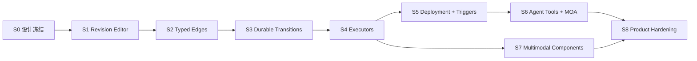

# 通用 Agent 编排交付、测试与运维验收图册

> 状态：**acceptance-blueprint；尚未表示施工完成**  
> 日期：2026-08-10  
> 总体决策：[ADR-071](82ADR-071通用Agent编排平台完整设计方案ADR.md)  
> 后端施工：[83 后端执行内核与 Control Plane](83通用Agent编排后端执行内核与ControlPlane施工图.md)  
> 前端施工：[84 蓝图编辑器与组件系统](84通用Agent编排蓝图编辑器与组件系统施工图.md)

## 1. 验收原则

编排平台属于长运行、跨重启、带外部副作用的基础设施。验收必须建立从定义到运行事实的证据链，不能用单一信号替代：

```text
源码/契约
  -> 定向单元测试
  -> SQLite 集成测试
  -> API 契约测试
  -> Admin 生产构建
  -> Desktop 部署为新二进制
  -> Ready + health
  -> 真实 Graph/Revision/Layout/Run/Event API
  -> 浏览器用户路径 smoke
  -> 重启/恢复/冲突/安全测试
```

“编译成功”“SPA 200”“页面能显示”“收到 SSE”分别只能证明局部，不能单独作为完成结论。

## 2. 现有基线

2026-08-10 当前基线包括：

- V2 graph/component/multimodal contract 与纯 compiler 测试；
- SQLite Graph/Revision/Layout/Run/NodeRun/Event Store；
- Create/Activate root Ready、claim/renew/fence/start/terminal 和过期恢复测试；
- Graph/Run 查询、event page 和 replay-to-live SSE；
- Admin Graph/Run viewer、布局 CAS、Graph 新建和受约束删除；
- 编排后端定向测试目前记录为 20 项，Admin 定向 Jest 为 5 suites / 20 tests。

这些数字是文档建立时的快照。后续不得通过删除测试维持数字；代码地图应记录最新实际结果。

## 3. 分期准入图



每个阶段必须满足本阶段退出条件后才能打开下一阶段写入口。可以提前实现纯代码，但不能提前在 Admin/Agent 中暴露未受治理的能力。

## 4. S0：设计与契约冻结

### 4.1 交付

- ADR-071 总体设计；
- 后端施工图；
- 前端/组件施工图；
- 本验收图册；
- ADR-070 标注当前事实与目标差异；
- 代码地图索引。

### 4.2 退出条件

- 明确 JSON 而非 JS/C# 作为图定义；
- 明确 Revision/Layout/Deployment/Run/Event 独立；
- 明确 Head 不直接供 Trigger 运行；
- 明确多模态只传 ArtifactRef；
- 明确单 Run DAG 无循环；
- 明确 Agent/Admin 无数据库旁路；
- 文档没有把目标功能标成已实现。

## 5. S1：节点 CRUD 与 Revision Editor

### 5.1 后端测试

- PUT route graphId 与 payload 不一致 -> 400；
- expected head 匹配 -> 保存 r2；
- r2 parent 指向 r1，审计字段由服务端生成；
- stale expected head -> 409，返回 current revision；
- 未知组件、错误 hash、重复 nodeId、空节点、非法 route -> 422/400；
- 并发两个 r2 只有一个 Applied；
- 保存 Revision 不改变 r1 JSON/content hash；
- 保存 Revision 不创建 Run/Event/Deployment；
- Graph 有 Run 时允许追加 Revision，但不允许删除 Graph；
- 客户端伪造 createdBy/createdAt/revisionId 不被采信。

### 5.2 前端测试

- catalog component -> 正确 node kind/executor/gate；
- HumanInput 可以无 executor；
- SubAgent 必须要求 role/template/route；
- 删除节点同步删除 incoming/outgoing edges；
- 最后节点不可删除；
- draft 存在时 beforeunload 提示；
- draft 存在时 Layout 不写入旧 base Revision；
- build next Revision 的 revision/parent/id 正确；
- 409 后 draft 保留，reload 需要明确动作；
- 保存成功后 graph preview 切换到服务端返回 Revision。

### 5.3 浏览器 smoke

1. 新建临时 Graph；
2. 增加第二个 HumanInput 节点；
3. 保存为 r2；
4. 刷新页面，确认 r2 和两个节点来自 API；
5. 删除第二节点并保存 r3；
6. 刷新确认 r3 和一个节点；
7. 制造 stale head，确认冲突 UI 不丢本地草稿；
8. 删除无 Run 临时 Graph；
9. API/SQLite 确认临时 Graph/Revision/Layout 为 0。

## 6. S2：强类型 Edge、Graph Input 和校验

### 6.1 Compiler 矩阵

对每个维度至少包含 accept/reject：

| 维度 | Accept | Reject |
|------|--------|--------|
| dataType | text -> text；anything -> target any | image semantic -> text |
| MIME | image/png -> image/* | audio/mpeg -> image/* |
| cardinality | one -> one/many；many -> many | many -> one |
| delivery | artifact 交集 | source artifact / target inline only |
| binding | 唯一 single source | 两来源 replace 到单值 |
| graph input | contract 兼容 | required input 悬空/不兼容 |
| sourcePath | `$`、字段、数组索引 | 函数、脚本、递归表达式 |
| topology | DAG | self-loop、control/data 混合环 |

### 6.2 UI 矩阵

- output 只能连 input；
- 不兼容 handle 不可 drop，并显示原因；
- control/data edge 视觉和表单不同；
- data mapping 可编辑并稳定 round-trip；
- cycle 本地提示，后端再次拒绝；
- graph input 增删引用保持一致；
- server diagnostic 点击可定位 node/edge/port；
- 旧 catalog 请求迟到不能覆盖新 Graph 的 catalog/diagnostic。

### 6.3 E2E

构建 text -> subAgent -> schema gate -> humanInput 的图；保存、刷新和 JSON round-trip 后，node/edge/binding/layout 均一致。

## 7. S3：Durable Transition Planner

### 7.1 纯状态机组合

必须覆盖：

- 单 root -> single successor；
- 两个前驱以 A/B、B/A 完成顺序得到相同结果；
- `onSuccess/onCompletion/always`；
- data edge 所需输出缺失；
- failureBehavior 三种策略；
- branch impossible 递归 Skipped；
- 全 Completed -> Run Completed；
- failRun -> Run Failed + 非终态 Cancelled；
- 全部不可达但无失败时明确终态；
- AwaitingInput 与仍有其他 Ready/Running 节点并存；
- 取消与 terminal commit 竞争；
- retry 恢复 Ready 并增加 attempt；
- timeout/lease expiry 尽耗 attempts。

纯 planner 做 property-based 测试：相同图和最终 outcomes 在合法提交排列下产生相同最终状态。

### 7.2 SQLite 并发

- 两个不同前驱并发 terminal commit；
- 一个后继只能 Pending -> Ready 一次，只发一个 NodeReady；
- Run terminal 只能提交一次；
- output/node/run/event 同事务，故障注入回滚后均不可见；
- commit 后 signal 丢失，周期扫描仍继续；
- sequence 唯一且连续；
- SQLite busy 下不产生重复事件；
- 不可变非法请求在无关 writer 存在时快速返回。

### 7.3 重启

构造：Ready、Claimed 未 Running、Running、AwaitingInput、部分 Completed 五种快照，强制结束 Core，再启动。验证：

- Ready 可继续领取；
- 未过期 claim 不被第二 worker 抢占；
- 过期 claim 以更高 fence 恢复；
- 旧 worker terminal 被拒绝；
- AwaitingInput 不占 worker；
- event cursor 从持久 high-water 继续。

## 8. S4：Executor 验收

### 8.1 共用契约

- executor 不直接写 Store；
- worker 提交结果时检查 fence；
- CancellationToken、timeout、lease renew 生效；
- 输入按端口最小可见；
- 输出逐端口校验；
- 大输出转 ArtifactRef；
- secret 不进日志/event/output metadata；
- 不支持的 executor/component 使激活失败，不到 worker 才失败。

### 8.2 SubAgent

- exact provider/model；
- route 不存在立即失败，无 fallback；
- role/template 注入正确；
- tool allowlist 与 permission mode 一致；
- `executionRunId != subSessionId`；
- child run archive 可追溯；
- 调用失败/超时按 node policy；
- token/cost 归因到 graph/run/node/attempt。

### 8.3 Tool

- toolId 解析；
- 输入 schema；
- read/write side effect 交叉检查；
- 幂等工具自动重试；
- 非幂等写工具不盲重试；
- tool output 归一化；
- 工具内部异常不泄露堆栈/secret 给普通用户。

### 8.4 Gate

- pure evaluator 重放一致；
- quorum、coverage、schema、approval；
- false decision 产生明确 output/edge branch；
- context gap 进入 AwaitingInput；
- evaluator version/hash 漂移拒绝激活。

### 8.5 HumanInput

- 创建 request 后 worker 释放；
- 页面和 session 收到 waiting 事件；
- input contract 校验；
- 重复相同 command id 幂等；
- 不同响应竞争仅一项成功；
- 超时策略；
- Core 重启后 request 仍可响应。

## 9. S5：Deployment 与 Trigger

### 9.1 Deployment

- Head r3，deployed r2 时 Trigger 仍创建 r2 Run；
- deploy r3 后新 Run 使用 r3，旧 Run 仍固定 r2；
- stale deployment version -> 409；
- 回滚到 r1 只更新 slot，不创建 r4、不修改 Head；
- component/hash/policy 不再可用时拒绝部署；
- 停用 slot 后 Trigger 不创建 Run；
- deploy 审计包含主体、旧/新 Revision、时间和 slot。

### 9.2 Trigger

- manual、schedule、webhook、connector event、orchestration event 各一条契约测试；
- sourceEventId 幂等；
- payload -> graph input mapping；
- 缺 required input 拒绝 Run；
- webhook signature、rate limit、body limit；
- schedule timezone/DST；
- orchestration event recursion depth/correlation guard；
- disabled trigger 不运行；
- Trigger 不成为 node、不在 DAG 中制造环。

## 10. S6：Agent 工具与 MOA

### 10.1 Agent 工具安全

- tool schema 与 API command DTO 一致；
- create/validate/revise 默认不执行；
- deploy/run/control 需要 capability；
- expected revision/version 和 command id 必填；
- inspect/watch 只读；
- Agent 无法构造任意 executor、伪造 hash 或直接 claim；
- 工具输出摘要不会把完整 Graph/Event 塞满上下文，提供分页/ArtifactRef。

### 10.2 MOA 行为等价

- 统一 DesignRequest；
- 至少要求的不同 exact routes；
- proposal 之间无 data visibility；
- critique 非自评、目标唯一；
- quorum 和 coverage；
- chair 与 final reviewer 独立；
- context gap -> human input -> resume；
- child run/subSession/output 可追溯；
- 任一阶段失败语义与专用状态机基线一致；
- 成本和 token 可按成员/阶段聚合。

### 10.3 切换门槛

通用 runtime 与 MOA 专用 runtime 对同一组固定输入运行 shadow/deterministic adapter tests。状态、可见性、门禁和终态全部等价后，才删除专用 store/dispatcher。禁止长期双写生产事实。

## 11. S7：多模态与组件包

### 11.1 Artifact

- image/audio/video/file 不进入 Revision/Event Base64；
- hash、size、MIME 与内容 sniff 一致；
- workspace ACL；
- 无权限/不存在/过期分别返回稳定错误；
- staging -> durable 原子可见；
- 取消/失败 staging 回收；
- durable default artifact 在部署期间 pin；
- 下载响应的 Content-Disposition/CSP 安全。

### 11.2 Media

| 场景 | 验收 |
|------|------|
| 图片输入 -> vision/subAgent -> JSON | port/MIME/Artifact、缩略图、最终 JSON |
| 音频 -> transcription -> text -> synthesis | 两个 Artifact、文本中间值、时长/格式 |
| 视频 -> probe -> frame extract | 资源限制、many image output、稳定排序 |
| 文件 -> parse/select -> subAgent | 大文件不进上下文，解析结果引用/摘要 |
| 生成图片 -> channel delivery | Artifact ownership、最终交付引用、失败可追踪 |

### 11.3 资源与恶意输入

- 文件大小、像素、采样率、时长、帧数、解压比上限；
- zip-slip/archive bomb；
- 伪 MIME；
- 损坏媒体和 decoder crash；
- 超时/取消后无孤儿进程；
- 同时多个媒体节点不突破并发/内存预算。

## 12. S8：安全测试

### 12.1 Authorization

- 未登录所有 orchestration API -> 401；
- 非 Admin 编辑/部署 -> 403；
- workspace A 不可读/控制 workspace B；
- run input/retry/cancel 校验主体和版本；
- worker internal capability 与 Admin token 分离；
- Desktop ControlToken 只用于 Desktop lifecycle，不作为业务 API token。

### 12.2 SSRF

HTTP 组件至少测试：

- `127.0.0.1`、`::1`、`0.0.0.0`；
- RFC1918、link-local、cloud metadata；
- DNS 首次公网后重绑定私网；
- redirect 到私网；
- 非 HTTP scheme；
- 超大/无限响应；
- credential header 不随跨域 redirect 泄露。

### 12.3 路径与 Secret

- `..`、UNC、device path、symlink/junction 越界；
- credential 只以 ref 保存；
- Graph JSON、event、diagnostic、日志、下载名均不回显 secret；
- 诊断包脱敏；
- Artifact filename 不能注入 header/path。

## 13. 性能基线

以下是初始工程预算，真实数据可在 S8 评审后调整，但调整必须记录原因：

| 项目 | 初始目标 |
|------|----------|
| 100 节点/200 edge 编译 p95 | < 100 ms，本机 Release |
| 500 节点/1000 edge 编译 p95 | < 500 ms |
| Revision 保存事务 p95 | < 100 ms，不含网络 |
| terminal -> direct successor durable transition p95 | < 100 ms |
| committed event -> SSE 可见 p95 | < 250 ms |
| Core 重启后 Ready Run 恢复发现 | < 10 s |
| 300 节点画布平移/缩放 | 交互不出现持续卡顿，目标 30+ FPS |
| 10k event timeline 首屏 | 分页/虚拟化，首屏 < 1 s |
| Artifact 列表 | 分页，不加载正文 |

性能测试报告必须注明硬件、配置、Release/Debug、DataRoot、样本量和 p50/p95/p99。

## 14. 长跑与故障注入

### 14.1 24 小时 soak

- 周期创建并运行小 DAG；
- 混合 subAgent stub、tool、gate、human input timeout；
- 定期 Core restart；
- 监测 SQLite size/WAL、event lag、claim expiry、内存、句柄、线程、Artifact staging；
- 最终 Run 数、终态数、event sequence 和 Artifact 引用一致。

### 14.2 故障点

在以下边界注入异常：

- revision insert 前/后、head CAS 前；
- run status 写后、event insert 前；
- output insert 后、terminal 前；
- commit 后、signal 前；
- claim 后、MarkRunning 前；
- executor 完成后、terminal commit 前；
- input response 写入中；
- deployment slot CAS；
- Artifact staging finalize。

每个故障都要证明“全部可见或全部不可见”，或由幂等/lease 恢复到确定状态。

## 15. 构建与定向命令

### 15.1 后端

```powershell
dotnet build PuddingRuntime --no-restore
dotnet test Source\PuddingCoreTests\PuddingCoreTests.csproj --no-restore --nologo --filter "FullyQualifiedName~Orchestration"
dotnet test Source\PuddingPlatformTests\PuddingPlatformTests.csproj --no-restore --nologo --filter "FullyQualifiedName~Orchestration"
dotnet test Source\PuddingRuntimeTests\PuddingRuntimeTests.csproj --no-restore --nologo --filter "FullyQualifiedName~Orchestration"
```

如仓库实际 csproj 名称变化，先用 `rg --files -g "*.csproj"` 校正，不把失败命令写成成功证据。

### 15.2 Admin

在 `Source/PuddingPlatformAdmin`：

```powershell
pnpm exec jest src/pages/orchestration --runInBand
pnpm run build
```

确认构建产物存在 `/orchestration/index.html`，并检查生产 HTML 实际引用的资源 hash。

### 15.3 输出边界

- build/test 只写仓库 `.tmp-build`、`.tmp-test-out` 或系统 Temp；
- 不把 `BaseOutputPath`、`OutDir` 或测试 SQLite 指向 `D:\data`；
- Desktop build/test/publish 串行，避免 WPF `obj` 竞争；
- 保留用户现有 dirty worktree，不修改无关文件。

## 16. Desktop 部署验收

最终产品由 PuddingDesktop 监督 Core。开发态 `dev-up.py` 不能替代产品部署结论。

### 16.1 前置

1. `python dev-up.py --status`；
2. 确认 dev-up 与 Desktop 不同时拥有同一 DataRoot；
3. 读取 Desktop bootstrap 状态；
4. ControlToken 只放 `X-Control-Token` header，不进入日志/命令输出正文。

### 16.2 外部部署链

```text
POST http://127.0.0.1:8199/desktop/bootstrap/stop
build Source/PuddingAgent/PuddingAgent.csproj --no-restore --no-incremental
POST http://127.0.0.1:8199/desktop/bootstrap/start
wait PUDDING_DESKTOP_READY / bootstrap status
```

### 16.3 二进制新鲜度

比较：

- 项目输出 `PuddingPlatform.dll` SHA-256；
- `Source/PuddingAgent/bin/...` 中 Core 实际入口依赖 SHA-256；
- Admin 源构建产物与实际服务的入口 HTML/关键 JS hash。

只有 hash 一致，才能声称当前 Desktop/Core 已加载本轮代码。

### 16.4 运行检查

- Core Ready；
- `/health/ready`；
- `/api/orchestrations/catalog`；
- Graph list；
- 实际 Revision/Run/Event 业务 API；
- `/admin/orchestration` 资源不是 SPA fallback 假 200；
- 无重复 Core、无 dev-up 端口/DataRoot 争用。

## 17. 浏览器端到端验收

使用生产构建和当前登录态完成，不只运行组件测试。

### 17.1 Authoring 主路径

```text
登录 -> Orchestration -> New Graph
-> 添加节点 -> 配置 -> 连线 -> Validate
-> Save Revision -> Refresh -> Revision history/diff
-> Layout move/save -> Refresh
-> Deploy -> Preview Run
```

### 17.2 Run 主路径

```text
Create Draft Run -> Activate
-> Ready/Running live update
-> Human Input -> Resume
-> Node Output/Artifact preview
-> Completed -> Timeline replay after refresh
```

### 17.3 错误路径

- stale Revision/Layout/Deployment/Run version；
- component unavailable；
- invalid edge；
- missing graph input；
- executor failure/retry；
- SSE disconnect/reconnect；
- Artifact forbidden/missing；
- cancel while running；
- refresh during AwaitingInput。

每次 smoke 记录 GraphId/RevisionId/RunId、关键 API status、最终 SQLite/API count 和清理结果。不得把用户真实 Graph 当临时测试对象。

## 18. 数据清理和恢复

### 18.1 测试数据

- 使用 `ui-smoke-*`、`api-smoke-*` 前缀；
- 无 Run Graph 可通过受限 DELETE 清理；
- 有 Run 的测试 Graph 不允许通过 Graph DELETE 级联清理；需专用测试 DataRoot 或明确的开发环境 reset；
- Artifact staging 使用测试 scope 和短保留期；
- 清理后通过 API 和 SQLite 只读查询确认。

### 18.2 开发环境 reset

若必须重置 `D:\data`：

1. 停止 dev-up/Desktop Core；
2. 备份 `D:\data\config\llm.providers.json`；
3. 明确列出将清理的数据库/缓存；
4. 不删除未授权用户文件；
5. 重建后通过 Bootstrap 初始化；
6. 恢复必要配置并重新验收。

开发阶段优先干净重建，不为临时旧 schema 增加长期兼容分支。

## 19. 回滚策略

### 19.1 功能回滚

- UI 新写入口可通过 feature flag 隐藏，但只读 viewer 保持；
- Scheduler 可停止领取新 claim，已有 claim 依赖 lease 恢复；
- Trigger 可停用 deployment slot；
- Graph 行为回滚通过 deployment 指向旧 Revision；
- 不删除新 Revision 或历史 Run。

### 19.2 代码回滚

- 回滚前停止 Core；
- 数据 schema 仅做向前兼容的增加或开发环境重建；
- 如果旧二进制不能理解新表但忽略它们，可直接回滚；
- 如果已有不可逆数据形状变化，使用备份/明确 reset，不写静默降级兼容层；
- 启动后重复 hash、Ready、health 和业务 API 检查。

## 20. 发布门禁

### Gate A：Authoring Preview

- Revision/edge editor 完成；
- 无 runtime 写入口；
- CAS/diagnostics/UI smoke 通过。

### Gate B：Read-only Execution Beta

- Durable transition + 四 executor；
- 只允许 read-only component；
- 重启/fence/event 验收通过。

### Gate C：Deployment/Trigger Beta

- Head/Deployment 分离；
- Trigger 幂等与安全；
- rollback 通过。

### Gate D：Agent/MOA Beta

- Agent 工具 capability；
- MOA 行为等价；
- 成本/可见性/人工输入通过。

### Gate E：Write/Media General Availability

- approval、SSRF、path、Artifact 安全；
- 资源配额和 soak；
- Desktop 两段式验收完成。

## 21. 两段式产品验收

运行在 Pudding 内部的 Agent 可以验证当前进程已加载的成品功能，但不能证明刚修改的 Desktop/Core 已被加载，也不能独立证明承载自身的进程退出/重启。

因此：

1. 内部开发 Agent 完成代码、测试和静态检查，交付 `ready-for-external-deploy`；
2. 进程外控制器停止、构建、比较 hash、启动；
3. 新 Pudding 会话完成真实功能 smoke，交付 `in-product-functional-complete`；
4. 最终崩溃恢复、退出回收和单实例由外部控制器判定。

## 22. 证据记录模板

```markdown
### Build
- commit/worktree:
- command:
- result:
- output path:

### Tests
- suite/filter:
- passed/failed/skipped:
- duration:

### Deployment
- Desktop bootstrap status:
- project DLL hash:
- entry DLL hash:
- Ready/health:

### Functional smoke
- graphId/revisionId/runId:
- API status:
- UI observation:
- durable event head:
- final run status:

### Cleanup
- deleted temporary objects:
- API/SQLite remaining counts:
- retained artifacts/runs and reason:
```

不得在证据中记录 JWT、LLM secret、Desktop ControlToken、Cookie 或敏感用户内容。

## 23. 全系统完成定义

只有以下全部成立，才可把 ADR-071 状态改为 implemented：

- Authoring：节点、边、输入、触发器、Revision、Layout、history/diff 完整；
- Deployment：Head 与 deployed Revision 分离，可回滚；
- Runtime：Ready/Skipped/terminal/retry/cancel/human input 跨重启一致；
- Execution：四基础 executor 和受信组件 registry；
- Data：端口输出与 ArtifactRef 是持久事实，多模态 E2E 完成；
- Agent：通用工具可用且无旁路；
- MOA：迁移到通用 runtime，专用 dispatcher 退场；
- Security：write/network/file/secret/Artifact 策略和测试通过；
- Observability：日志、指标、event/session projection 可追踪；
- Product：Admin UI 可访问、可恢复、冲突不丢数据；
- Operations：Desktop 新构建、hash、Ready、真实 API、重启恢复和清理证据齐全；
- Docs：ADR、施工图、代码地图和调试文档与当前实现一致。
