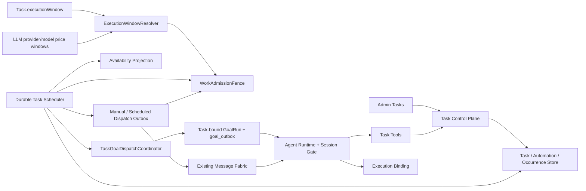
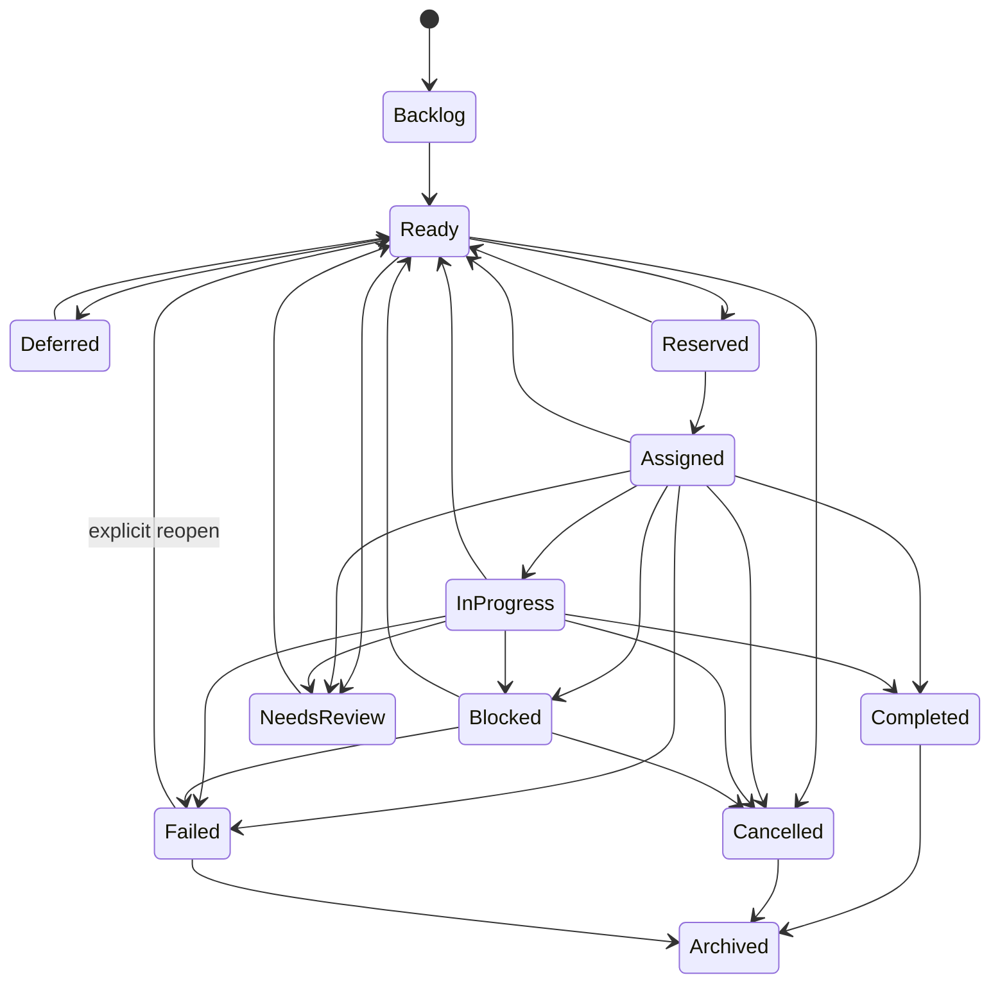
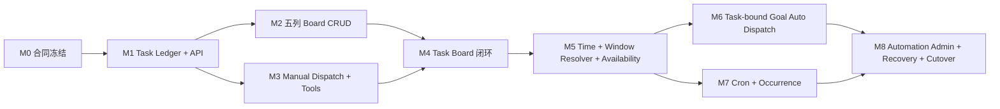

# ADR-072 工作区 TODO、峰谷 Auto 派发与定时任务第一阶段

> 状态：Proposed；第一阶段施工基线，不表示已经实现
> 日期：2026-08-15；2026-08-21 增补 Goal 前置与执行窗口权威裁决
> 决策范围：TODO-List、手工任务派发、Auto 派发、定时消息、Agent 可用性、峰谷调度、任务工具、Admin 基础页面、持久恢复
> 上位设计：[工作区 TODO 与峰谷节能任务编排设计方案](../Features/工作区TODO与峰谷节能任务编排设计方案.md)
> 架构边界：[插件、Hook、Event、Agent FSM 与函数图总架构](../deepseek-harness-pi-plugin-hook-event-architecture-2026-08-14.md)
> 产品施工顺序：[ADR-073 任务看板优先的 Agent 工作台、完整轨迹与实时指标施工方案](87ADR-073任务看板优先的Agent工作台轨迹与实时指标施工ADR.md)
> 后续自动执行裁决：[ADR-074 Goal 持久目标、自主续行与自动压缩](89ADR-074Goal持久目标自主续行与自动压缩ADR.md)

## 1. 决策

第一阶段实现一个工作区级 **Workspace Task Control Plane**，交付以下完整基础闭环：

1. 用户在 Admin 通过“待规划、待办、进行中、已完成、已失败”五列任务看板管理当前工作区的 TODO：创建、编辑、排序、指派、执行、取消、归档、筛选和查看执行记录；
2. 用户手工指派任务给工作区 Agent，任务经持久 Outbox 和现有 Message Fabric 进入 Agent 正常执行路径；
3. Agent 通过结构化任务工具查询、认领、接受、报告进展、阻塞、拒绝或完成任务；
4. `auto-dispatch` 在任务 Ready、Agent 可信空闲、执行窗口允许且原子 Reservation 成功时自动派发；生产启用时必须按 ADR-074 创建 Task-bound GoalRun，不以普通消息提醒代替持续执行；
5. `scheduled-message` 支持一次、每天、每周、固定间隔、受限标准五字段 Cron 和符合条件的每个入站消息，先持久化 Occurrence，再按峰谷策略投递；
6. Task 以 `executionWindow` 表达 `inherit/anytime/off_peak_only` 执行偏好；实际高/低价时段从 Agent 有效提供商/模型价格档案解析，不新增工作区 `work-policy.json`；
7. 用户直接聊天消息不受峰谷节能限制；“立即运行”不是直接聊天，若要在高峰执行必须显式确认一次性 Override；
8. Agent 可用性、任务 Reservation、派发 Outbox、Occurrence、Task Event 和 Fence Decision 都是持久事实，不能依赖前端、心跳或进程内字典作为正确性权威；
9. Core 重启后通过数据库恢复 Pending/Deferred/Expired Lease，不重复派发同一消息或同一 Occurrence；
10. PuddingDesktop 仍只负责产品 Shell 和 Core 生命周期，任务业务逻辑保留在 Core/Runtime/Platform/Admin。

第一阶段复用现有 Message Fabric、Session 单写者、工具注册表和 SQLite 事务模式，不以“先完成通用 Plugin Host、通用 Function Graph 或统一 Event Store”为前置条件。新增服务和工具仍通过现有 DI/Registry 注册，禁止在 Agent Loop 中增加按任务类型分支的巨型 `switch`。

## 2. 第一阶段边界

### 2.1 范围内

- 工作区五列 TODO 看板、列表视图、详情抽屉和编辑抽屉；
- `WorkspaceTask`、Assignment Attempt、Execution Binding、Task Event；
- 手工指派、重新指派、取消、归档、Run Now；
- Agent 的 `task_list/task_get/task_claim/task_update` 四个工具；
- Agent 拒绝后保留原因、排除本次候选并继续寻找下一个任务/Agent；
- `auto-dispatch`；
- `scheduled-message` 的 once/daily/weekly/fixed-interval/受限五字段 cron/message-event；
- Durable Occurrence、Next Fire、Misfire、Overlap、Outbox 和恢复扫描；
- `Task.executionWindow`、提供商/模型价格时段、`IExecutionWindowResolver`、TimeProvider、时区解析和 WorkAdmissionFence；
- P0/P1/P2/P3 与 `inherit/anytime/off_peak_only`；
- Agent Availability Projection 与一个 Agent 最多一个 Auto Reservation；
- 高峰期 `heartbeat=0` 的明确禁用语义和“不补默认心跳”；
- Task/Assignment/Occurrence/Delivery/Execution 的关联、日志、指标和审计；
- Feature Flag、旧 Cron 单一 Owner 保护和可回滚切换。

### 2.2 明确不在范围内

- 回合后质询器、HOO/Typed TurnSettled Hook 和临时监督子代理；
- Goal 目标冲刺、自动“继续”、无进展指纹和 Goal 熔断的内部实现；这些由 ADR-074 后续交付，但完整 Auto Dispatcher 的生产启用受其前置门禁限制；
- Stale Progress 自动提醒和“反复质询直到完成”；
- 完整 Approval 聚合、审批人路由和自动恢复审批；
- 通用 Webhook、自定义 Event Expression 和任意 Connector Event；第一阶段只开放受限的真实入站 `message_event`；
- Agent 自动生成/部署编排图，GraphFunction、BoundedLoopFunction 和 MOA 迁移；
- 通用第三方 Plugin Host、动态 DLL 激活、插件 UI Renderer 和热卸载；
- 通用 Domain Event Log/Schema Registry；第一阶段只实现 Task 聚合专用 append-only Event 与 Outbox；
- 正在执行的 LLM Stream 或 Tool Call 的中途暂停/迁移；
- Cron 秒/年字段、宏、`L/W/#/?` 扩展、脚本、动态 C#、Shell 或表达式求值；标准五字段 Cron 属于范围内；
- 复杂依赖、子任务树、批量编辑和跨工作区派发；
- 自动创建 TaskPlanRun 或 AgentOrchestrationRun；
- 自动估算节省金额作为账单事实。

### 2.3 降级语义

第一阶段只阻止**新的自动 Execution**。若一个 Turn 已在高峰开始前通过最终 Fence 并进入执行，则允许整个 Turn 到终态，不在未知 Tool 副作用点强杀。安全 Checkpoint/Resume 属于后续阶段。

`needs_approval` 可以由 Agent 通过 `task_update` 表达，但第一阶段只映射为：

```text
Task -> Blocked
blocker_kind = approval_required
blocker_reason = Agent 提交的问题和风险
```

用户处理后手工执行 `resume/requeue`。第一阶段不创建 Approval 聚合，也不自动向审批人派发。

### 2.4 2026-08-21 跨 ADR 集成裁决

本 ADR 保留“任务台账、手工派发、Availability/Reservation 和调度合同属于第一阶段”的历史范围，但冻结以下后续生产边界：

1. `Task.executionWindow` 已是任务是否偏好低峰执行的权威字段，不再引入工作区 `work-policy.json` 作为平行配置。
2. “当前是否低价”由集中 `IExecutionWindowResolver` 回答；它从 Agent 的实际 provider/model 路由与现有 LLM 配置中的价格时段生成带版本快照，而不从 Task 文本或 Heartbeat 猜测。
3. Availability Sensor 必须是可持久、可重建、默认 `unknown` 的保守投影。进程内 `AgentExecutionStateRegistry` 可用于低延迟 signal，不是自动 Claim 权威。
4. 完整 Auto Dispatcher 只能调用 ADR-074 定义的 `StartGoalFromTask`，原子建立 Assignment/Reservation/TaskGoalBinding/GoalRun/GoalOutbox。普通 Message Delivery ACK 不代表任务已执行。
5. `TaskAutoDispatch.Enabled` 依赖 `GoalRuns.Enabled && TaskBoundGoals.Enabled`。Goal 持久续行尚未通过 ADR-074 G0–G3 时，任务看板和手工闭环可继续使用，Auto 只允许 shadow/evaluate，不允许发送自然语言提醒作为临时替代。

## 3. 参考基线与行号

下表行号基于 2026-08-15 当前工作区文档。子任务中的 `Rxx` 均引用本表，不使用模糊的“参考整个文档”。

| ID | 文档与行号 | 用途 |
|----|------------|------|
| R01 | `Docs/Features/工作区TODO与峰谷节能任务编排设计方案.md:9-30` | 总体决策、Fence、用户消息、自动消息来源、任务工具原则 |
| R02 | 同上 `:31-50` | DeepSeek 价格、生效时间、高峰区间与边界例子 |
| R03 | 同上 `:52-81` | 总目标、非目标和业务边界 |
| R04 | 同上 `:83-100` | 当前代码基础、Message Fabric、Availability、Heartbeat、Cron 缺口 |
| R05 | 同上 `:101-170` | WorkspaceTask 与 TaskNode 分离、五类事实、总体架构和分层 |
| R06 | 同上 `:173-248` | 历史 work-policy 草案、时区、heartbeat=0、高峰切换与 V1 降级；配置权威已由本 ADR 2.4/6 节改写 |
| R07 | 同上 `:250-377` | 优先级、运行窗口、Task 字段、状态机、Agent 表态、删除/归档 |
| R08 | 同上 `:379-449` | auto-dispatch/scheduled-message、Automation、时间与 message-event Trigger、Occurrence、Misfire |
| R09 | 同上 `:451-549` | WorkAdmissionFence 输入输出、Decision Code、判定顺序和多次检查 |
| R10 | 同上 `:551-595` | Agent Availability 状态、Idle 充分条件、Reservation 和用户优先 |
| R11 | 同上 `:597-673` | 自动派发排序、事务、Outbox、Message Envelope 和任务指令 |
| R12 | 同上 `:716-761` | 四个 Agent 任务工具与 Active Task Context |
| R13 | 同上 `:763-798` | 工作策略、任务、自动化 API 和错误协议 |
| R14 | 同上 `:800-838` | SQLite 表、索引、不变量以及配置/数据库事实边界 |
| R15 | 同上 `:840-889` | Admin 页面、交互、峰谷横幅、SSE 与 Agent 过滤 |
| R16 | 同上 `:890-940` | Capability、权限、安全和最低审计事件 |
| R17 | 同上 `:942-1009` | 结构化日志、指标、成本关联与失败恢复 |
| R18 | 同上 `:1011-1035` | 与 TaskPlan/Orchestration 的分离和共享基础设施 |
| R19 | 同上 `:1037-1105` | 建议文件落点与各项目职责 |
| R20 | 同上 `:1107-1156` | 原 Phase 0–5 分期；本 ADR 只合并其中 Phase 0–3 |
| R21 | 同上 `:1158-1212` | 时间、任务、自动化、恢复、产品和测试验收矩阵 |
| R22 | 同上 `:1214-1243` | 已决事项、后续产品选择和最终原则 |
| R23 | `Docs/superpowers/specs/2026-06-07-agent-to-agent-message-fabric-design.md:25-56` | Durable Delivery 权威、Hosted Dispatcher、Session Gate 和现有 Availability 缺口 |
| R24 | 同上 `:72-94` | Message -> Delivery -> Claim -> Runtime -> Ack/Retry 的权威链 |
| R25 | 同上 `:191-294` | Delivery 状态机、原子 Claim、订阅唤醒与恢复扫描 |
| R26 | 同上 `:296-320` | Agent Availability 与保守 Claim 规则 |
| R27 | 同上 `:346-490` | Delivery/Dispatcher/Execution 可观测性、Timeline 和 V1/V1.1 验收 |
| R28 | `Docs/07架构/82ADR-071通用Agent编排平台完整设计方案ADR.md:524-532` | Claim、Lease、Fence 和迟到提交的共享语义 |
| R29 | 同上 `:643-658` | 原子状态、事件、Fence、Artifact 和单一写入者不变量 |
| R30 | `Docs/07架构/83通用Agent编排后端执行内核与ControlPlane施工图.md:650-703` | Scheduler/Worker/Trigger 的持久唤醒与幂等原则 |
| R31 | 同上 `:733-758` | Activation Policy、Capability 与 SQLite 事务纪律 |
| R32 | `Docs/07架构/20AdminChat简约克制界面ADR.md:59-151` | 渐进披露、Quiet UI、可信文本、指标隐藏与视觉基线 |

## 4. 权威事实和分层

### 4.1 权威事实

| 事实 | 权威载体 | 说明 |
|------|----------|------|
| Task 执行偏好 | `workspace_tasks.execution_window` | Task 版本 CAS；`off_peak_only` 为明确低价执行要求 |
| 提供商/模型价格时段 | 现有 `llm.providers.json` 配置链上的可选时段字段 | 与 provider/model 路由同一权威；Resolver 输出 profile version/window key |
| 当前 Task 投影 | `workspace_tasks` | 可用 expectedVersion 更新 |
| Assignment 历史 | `task_assignment_attempts` | 只追加 Attempt，拒绝不覆盖历史 |
| Task 与实际执行绑定 | `task_execution_bindings` | 关联 Delivery/Execution/Session |
| Automation 定义 | `task_automations` | 版本化定义与 nextFire |
| 每次触发 | `automation_occurrences` | 独立幂等状态机 |
| 待派发意图 | `task_dispatch_outbox` | 与 Task/Occurrence 变更同事务 |
| 任务审计 | `task_events` | 每 Task 单调 sequence，只追加 |
| Agent 可用性 | `agent_availability_projection` | 从已提交 Runtime/Session/Message 事实投影 |
| Agent 自动所有权 | `agent_execution_reservations` | Lease + monotonic fencing token |
| 手工/定时消息投递 | 现有 RoomMessage/MessageDelivery | 继续由 Message Fabric 负责；Auto Task 的 Goal 意图由 ADR-074 `goal_outbox` 负责 |
| 实际 Agent 执行 | 现有 Conversation/Runtime Run | 继续受 Session Execution Gate 保护 |
| Token/成本 | 现有 LLM usage facts | Task 只保存 correlation，不复制账本 |

内存 Channel、Timer、SSE、前端 Store 和 `message.deliver` 只用于降低延迟，不是恢复权威。

### 4.2 分层

| 项目 | 第一阶段责任 |
|------|--------------|
| PuddingCore | Task/Automation/Occurrence/ExecutionWindow 模型、状态机、错误码、Store/Clock/Fence/Availability 契约 |
| PuddingPlatform | SQLite Store、Schema Bootstrap、事务 Outbox、Execution Window Resolver、API、查询和 Task Event Watch |
| PuddingRuntime | Fence 实现、Availability Projector、Scheduler/Dispatcher、Task Tools、Active Task Context、Message Envelope |
| PuddingHost | Hosted Service 和组合根注册；Heartbeat/Cron 入口 Adapter，不持有领域状态 |
| PuddingPlatformAdmin | Tasks/Automations/Execution Window Inspector/History 页面和 API 类型 |
| PuddingDesktop | 不新增任务业务逻辑，只继续承载 Workbench 与 Core 生命周期 |

### 4.3 第一阶段组件关系



## 5. 领域模型

### 5.1 WorkspaceTask

第一阶段字段：

```text
task_id
workspace_id
title
description
acceptance_criteria
status
priority                    p0 | p1 | p2 | p3
execution_window            inherit | anytime | off_peak_only
preferred_agent_id?
active_assignment_id?
not_before_utc?
due_at_utc?
next_eligible_at_utc?
sort_order
progress_percent?
progress_summary?
blocker_kind?
blocker_reason?
failure_code?
failure_reason?
version
created_by / updated_by
created_at_utc / updated_at_utc / completed_at_utc? / failed_at_utc? / archived_at_utc?
```

`custom` execution window、Plan/Graph link 和 Approval ID 预留到后续阶段，第一阶段 API 不暴露。

### 5.2 Task 状态机



规则：

- `Rejected` 是 Assignment Attempt 终态，不是 Task 终态；
- `Reserved` 只用于 Scheduler 的短暂持久所有权；
- `Deferred` 必须有 `decisionCode` 和 `nextEligibleAtUtc`；
- 单次 Assignment/Execution 失败先按重试策略回到 `Ready` 或进入 `NeedsReview`，不能直接把 Task 误判为 `Failed`；
- 只有不可恢复、重试耗尽、验收失败且明确终止，或用户执行“标记失败”时进入 `Failed`；
- `Completed/Cancelled/Archived` 单调；`Failed -> Ready` 只允许显式 `reopen` Command，并产生新 Version 和 `task.reopened`；迟到 Agent 不能回写任何闭合 Task；
- 任何 Agent 转换必须同时验证 `taskVersion + assignmentId + reservationFence`；
- `blocked/needs_approval` 均进入 `Blocked`，后者使用 `blockerKind=approval_required`；
- 只有没有 Assignment/Occurrence/Delivery/Execution 历史、且 Task Event 仅包含草稿创建/编辑记录的 Backlog 可在同一事务硬删除；其余删除均归档。

### 5.3 TaskAutomation

```text
automation_id
workspace_id
task_id?
name
mode                         auto_dispatch | scheduled_message
enabled
trigger_kind                 ready_task | once | calendar | cron | fixed_interval | message_event
trigger_definition_json
time_zone
target_agent_id
message_template
priority
execution_window
misfire_policy               fire_once | coalesce_one | skip
overlap_policy               forbid
next_fire_at_utc
last_fire_at_utc?
version
created_by / updated_by
created_at_utc / updated_at_utc
```

`auto_dispatch` 只能使用 `ready_task`；`scheduled_message` 不能使用 `ready_task`。`cron` 只接受 `minute hour day-of-month month day-of-week` 五字段、显式时区和未来五次预览；拒绝秒/年字段、宏、`L/W/#/?`、脚本及表达式求值。

### 5.4 AutomationOccurrence

```text
occurrence_id
automation_id / automation_version
task_id?
source_event_id?
scheduled_for_utc
materialized_at_utc
status                       pending | deferred | reserved | dispatched |
                             running | completed | failed | skipped | needs_review
next_eligible_at_utc?
window_profile_version
window_key
decision_code
delivery_id?
execution_id?
attempt_count
last_error_code?
idempotency_key
```

唯一键是 `(automation_id, idempotency_key)`。修改 Automation 不改变旧 Occurrence 的输入和策略快照。

## 6. 执行窗口解析与 WorkAdmissionFence

### 6.1 权威输入

不新增 `<workspace>/work-policy.json`。窗口判定使用两类已有领域事实：

1. `workspace_tasks.execution_window` 表达该 Task 是 `anytime`、`off_peak_only` 还是 `inherit`；
2. Agent 实际路由到的 provider/model 价格档案表达低价时段、时区、生效时间和折扣标识。该可选字段延伸现有 `llm.providers.json` 模型配置，与模型路由和价格保持同一权威。

Resolver 消费的规范化快照为：

```text
provider_id
model_id
profile_version
time_zone
effective_at
discount_windows[]          day-of-week + [start,end) + window_key
resolved_at_utc
valid_until_utc
```

`IExecutionWindowResolver.Resolve(task, agentRoute, now)` 返回 `allow/defer/unknown`、`windowKey`、`profileVersion`、`nextEligibleAtUtc` 和稳定 reason code。如果 Task 为 `off_peak_only` 但 Agent 路由尚不确定、价格档案缺失或配置无效，结果必须是 `unknown/defer`，不得默认按 anytime 执行。

支持 IANA `Asia/Shanghai` 和 Windows `China Standard Time`，内部统一使用 `TimeProvider`。禁止用 `DateTime.Now` 判断业务窗口。Task 设为 `off_peak_only` 时，该明确偏好高于 priority 默认值，包括 P0 也不能自动越过；只有用户显式 Run Now override 可以在本次执行改变它。

### 6.2 边界

以当前 DeepSeek 价格档案为例（实际值由带版本配置提供，不硬编码在 Task Scheduler）：

- 高峰：`[09:00,12:00)`、`[14:00,18:00)`；
- 空闲：其余时段；
- 价格档案生效前，Resolver 返回 `inactive/defer`；档案缺失时返回 `execution_window_unknown`；
- `08:59:59.999` 允许，`09:00:00` 推迟；
- `11:59:59.999` 推迟，`12:00:00` 允许；
- `13:59:59.999` 允许，`14:00:00` 推迟；
- `17:59:59.999` 推迟，`18:00:00` 允许。

### 6.3 判定顺序

```text
1. 校验 workspace/agent/task/automation 是否存在、启用且版本仍有效
2. 校验 notBefore、Task/Occurrence 状态和 Assignment 身份
3. 处理 user.direct 或授权 run-now override
4. 解析 Task executionWindow；显式 `off_peak_only` 不得被 priority 自动越过
5. 解析 Agent 有效 provider/model route 和带版本价格时段
6. 计算 discount/full_price/inactive/unknown 与 nextEligibleAt
7. 校验 Agent availability、用户消息积压、cooldown
8. 校验 workspace/agent concurrency 和 Reservation
9. 返回 allow/defer/deny + code + validUntil
```

最小稳定代码：

```text
allowed_user_direct
allowed_off_peak
allowed_priority_bypass
allowed_explicit_override
deferred_peak_window
deferred_not_before
deferred_agent_busy
deferred_agent_offline
deferred_agent_cooldown
deferred_user_message_pending
deferred_execution_window_unknown
denied_policy_invalid
denied_task_state_changed
denied_stale_assignment
denied_workspace_frozen
denied_agent_frozen
```

### 6.4 Fence 检查点

第一阶段在三个边界检查：

1. **reserve**：为 Task/Occurrence 选择 Agent 前；
2. **dispatch**：Outbox 调用 Message Fabric 前；
3. **execute**：Message Delivery claim 后、Agent Runtime 开始新 Turn 前。

Scheduler 可以在全价时段 Materialize 到期 Occurrence，但对 `off_peak_only` 必须立即将其标为 `Deferred` 并写入 `nextEligibleAt`，不能投递。若没有可计算的下一窗口，保留 `execution_window_unknown`并等待配置/路由事件，不进行密集轮询。

### 6.5 Heartbeat 0

- Agent 自身 `min_idle_seconds=0 && max_idle_seconds=0` 表示长期禁用；
- provider/model 执行窗口 Resolver 与 Heartbeat 自身配置共同计算 `effectiveHeartbeatIntervalSeconds=0`，表示当前窗口禁用；
- 一个为 0、另一个为正数是配置错误；
- 0 不进入 Delay、Wake Queue 或 Retry；
- 高峰期 `EnsureDefaultAsync` 不补一小时默认 Heartbeat；
- 已开始的 Turn 不强杀；只阻止新的 Heartbeat Execution。

## 7. Agent Availability 与自动所有权

### 7.1 状态

| 状态 | Auto Claim |
|------|------------|
| unknown | 否 |
| offline | 否 |
| starting | 否 |
| idle | 是 |
| reserved | 否 |
| busy | 否 |
| waiting_approval | 否 |
| cooling_down | 否 |
| sleeping | 否 |
| frozen | 否 |

`unknown` 绝不能默认成 `idle`。Core 启动后，在 Projection 从持久事实重建完成前所有 Agent 为 `unknown`。

### 7.2 Idle 充分条件

- Workspace/Agent 启用且未冻结；
- 主 Session 可解析；
- 没有活跃 Session Execution Gate、Conversation Run、Tool Call 或自动 Execution；
- 没有 Active Reservation；
- 没有待处理的用户直接消息或 Steering；
- 超过可配置 `AutoDispatchCooldown`；
- Projection 未超过 TTL；
- Workspace/Agent 并发配额允许。

### 7.3 Reservation

`TryReserve(agentId, assignmentId, leaseDuration)` 必须：

- 原子检查一个 Agent 最多一个 Active Auto Reservation；
- 返回单调 Fencing Token；
- 在 Task Reserve 与 Dispatch Outbox 同一事务内创建；
- 用户直接消息在 Agent Execution 开始前到达时释放 Reservation；
- Lease 过期可恢复；
- 旧 Owner 或旧 Token 不能 Commit；
- Agent Execution 开始后不因新消息在未知副作用点强杀。

## 8. 三条执行链

### 8.1 手工派发

```text
User assign
  -> validate Task/version/Agent
  -> create AssignmentAttempt
  -> Task Ready -> Reserved
  -> append DispatchOutbox in same transaction
  -> Fence(dispatch)
  -> Message Fabric SendAsync(idempotencyKey)
  -> bind Delivery
  -> Task Reserved -> Assigned
  -> Runtime Fence(execute)
  -> Agent Task Context
  -> task_update
```

手工指派仍使用 Outbox，不能由 Controller 在事务中直接调用 Runtime。

### 8.2 Auto 派发

```text
task.ready / availability.idle / execution_window.opened / recovery scan
  -> list Ready Tasks in deterministic order
  -> select eligible Agent
  -> Fence(reserve)
  -> TryReserve Agent + Task
  -> Fence(dispatch)
  -> StartGoalFromTask transaction
       Assignment + Reservation + TaskGoalBinding + GoalRun + GoalOutbox
  -> GoalContinuationWorker
  -> Fence(accept)
  -> canonical Conversation Turn + Agent Run
  -> Goal Verifier / Coordinator
  -> Goal + Task dual CAS terminal mapping
```

Auto Task 不创建普通 `task_instruction` Message Delivery，也不等待 Heartbeat 补发“继续”。Goal 前置未通过时，这条链只能 evaluate-only。

任务排序：

```text
priority DESC
due_at proximity DESC
ready_since ASC
sort_order ASC
task_id ASC
```

Agent 明确拒绝时：

1. 当前 AssignmentAttempt -> Rejected，固化原因和建议；
2. 释放 Agent Reservation；
3. Task -> Ready，并把该 Agent 加入当前 Task 的候选排除集；
4. 当前 Agent 可以继续取得自己的下一个 Ready Task；
5. 原 Task 尝试其他 Agent；没有候选则 -> NeedsReview。

### 8.3 定时消息

```text
Database next_fire due
  -> atomically create Occurrence + advance next_fire
  -> Fence
  -> Pending or Deferred
  -> create DispatchOutbox
  -> Message Fabric
  -> bind Delivery/Execution
  -> Occurrence terminal
```

触发规则：

- `once`：本地日期时间 + timezone；
- `daily`：本地时间；
- `weekly`：ISO weekday + 本地时间；
- `fixed_interval`：锚点 + days/hours/minutes，最小一分钟；
- `message_event`：只匹配 `origin=user.direct|connector.inbound` 的真实入站消息，并按 workspace/channel/agent/message kind 过滤；
- 多次错过默认 `coalesce_one`；
- `once` 默认 grace period 为 24 小时，超出后 `needs_review`；
- `overlap=forbid` 是第一阶段唯一模式；
- message-event 使用 `automationId + sourceMessageId` 作为幂等键，排除 `system.*`、Agent 回复和 Automation 自己生成的消息，并执行 debounce/rate-limit/hop guard；
- Next Fire 与 Occurrence 在同一数据库事务推进；
- 内存 Timer 只唤醒，数据库扫描负责恢复。

## 9. Agent 消息和任务工具

### 9.1 手工任务与定时消息 Envelope

手工任务与 scheduled-message 的模型输入可使用 `user` role，但持久来源必须是：

```text
From.Kind = system
From.Id = task-orchestrator
ContentType = task_instruction
metadata.origin = task.manual | automation.schedule
metadata.task_id
metadata.assignment_id
metadata.occurrence_id?
metadata.window_profile_version
metadata.priority
metadata.execution_window
metadata.dispatch_idempotency_key
```

Prompt 不能改写这些 Metadata。Auto Task 不使用该 Envelope，而使用受信 `TaskGoalRuntimeContext`；UI 根据 canonical source 显示“手工任务”“Task-bound Goal”“定时任务”，不从文本猜测。

### 9.2 工具

| 工具 | 第一阶段能力 |
|------|--------------|
| `task_list` | 默认查询 mine；支持 workspace、status、limit、cursor |
| `task_get` | 返回 Task、Assignment、允许转换、验收标准和近期事件 |
| `task_claim` | expectedVersion + ExecutionWindow + Availability + Reservation 原子认领 |
| `task_update` | accept/progress/todo/blocked/needs_approval/rejected/completed |

`task_update` 由后端状态机解释 disposition，Agent 不直接写 Status。以下字段必须由 Runtime Context 注入并校验：

```text
task_id
assignment_id
expected_version
reservation_fencing_token
```

必填规则：

- blocked/rejected/needs_approval 必须有 reason；
- progress 必须有 summary 或 nextAction；
- completed 必须有 resultSummary，并满足 Acceptance Criteria 声明的必需 Artifact；
- 只有自然语言“完成”而没有工具调用时，Task 不变化；
- Agent 不能通过工具提高 Priority、设置 Peak Override、改 provider/model 价格时段或删除 Task。

## 10. Control Plane 和 Admin

### 10.1 API

执行窗口诊断：

```text
GET  /api/workspaces/{workspaceId}/execution-window?agentId=...&taskId=...
POST /api/workspaces/{workspaceId}/execution-window/evaluate
```

该 API 只读取 Task 偏好与现有 provider/model 配置并返回 Resolver 快照；不提供任务领域内的第二份窗口配置写 API。价格时段编辑沿用既有 LLM provider/model 配置权限和文件服务。

任务：

```text
GET    /api/workspaces/{workspaceId}/tasks
POST   /api/workspaces/{workspaceId}/tasks
GET    /api/workspaces/{workspaceId}/tasks/{taskId}
PATCH  /api/workspaces/{workspaceId}/tasks/{taskId}
DELETE /api/workspaces/{workspaceId}/tasks/{taskId}
POST   /api/workspaces/{workspaceId}/tasks/{taskId}/assign
POST   /api/workspaces/{workspaceId}/tasks/{taskId}/run-now
POST   /api/workspaces/{workspaceId}/tasks/{taskId}/cancel
POST   /api/workspaces/{workspaceId}/tasks/{taskId}/transitions
GET    /api/workspaces/{workspaceId}/tasks/{taskId}/events
```

自动化：

```text
GET/POST      /api/workspaces/{workspaceId}/automations
GET/PUT/DELETE /api/workspaces/{workspaceId}/automations/{automationId}
POST          /api/workspaces/{workspaceId}/automations/{automationId}/preview
GET           /api/workspaces/{workspaceId}/automations/{automationId}/occurrences
POST          /api/workspaces/{workspaceId}/automations/{automationId}/run-now
```

所有修改使用 expectedVersion。CAS/状态冲突返回 409；规则校验返回 422；权限返回 401/403；错误包含稳定 `code/message/traceId/currentVersion`。

### 10.2 Admin 页面

路由：

```text
/workspace/:workspaceId/tasks
```

第一阶段包含五个视图：

1. **任务看板**：待规划、待办、进行中、已完成、已失败五列；服务端分页、列内虚拟化、状态/优先级/Agent/搜索筛选；另保留紧凑列表视图；
2. **Agent 任务**：按 Agent 过滤，展示 Availability、当前任务和最近拒绝；
3. **自动化**：once/daily/weekly/interval/受限五字段 cron/message-event 表单、未来五次时间触发预览、消息过滤器和 Occurrence 历史；
4. **执行记录**：Task -> Assignment -> Delivery -> Execution 的时间线；
5. **执行窗口诊断**：Task 偏好、Agent 当前 provider/model route、价格档案版本、当前窗口、下一次切换和 Evaluate 预览；本页不另存工作区策略。

关键交互：

- 新建/编辑抽屉保留 Title、Description、Acceptance Criteria 的区别；
- 高峰横幅说明自动工作暂停、下一空闲时刻和用户聊天不受影响；
- 高峰 Run Now 必须二选一：“等待空闲时段”或“本次高峰运行”；
- Blocked/Rejected/NeedsReview 显示原因和恢复动作，不只显示颜色；
- 卡片“执行”必须进入真实 Assignment/Outbox/Message Fabric/Agent Session 链，完成后由 Task Event 自动回写；卡片可深链到完整执行会话；
- `Failed` 卡片显示失败原因、最后一次 Execution 和显式“重新打开”动作；
- 页面先取 Snapshot，再按 Cursor 订阅 Task Event Watch；断线追赶，不依赖高频全量轮询；
- 技术指标默认折叠到 Inspector，保持 Quiet UI。

## 11. 持久化与事务不变量

第一阶段新增表：

```text
workspace_tasks
task_assignment_attempts
task_execution_bindings
task_automations
automation_occurrences
task_events
task_dispatch_outbox
agent_availability_projection
agent_execution_reservations
```

不新增 `task_supervision_checkpoints`、`goal_runs`、`goal_challenges` 或 Approval 表。

强制不变量：

1. 每个 Task 最多一个 Active Assignment；
2. 每个 Agent 最多一个 Active Auto Reservation；
3. `(automation_id,idempotency_key)` 唯一；
4. `task_dispatch_outbox(idempotency_key)` 唯一；
5. `(task_id,sequence)` 唯一且 Sequence 单调；
6. Task 状态、Assignment、Reservation、Outbox 和 Task Event 在一个短事务提交；
7. 外部消息发送、LLM、Tool 和网络不在数据库事务内；
8. Outbox 成功发送但未绑定时，通过 Idempotency Key 找回同一 Delivery；
9. Lease/Fence 过期的 Worker 不能提交 Task/Occurrence 终态；
10. 所有业务时间保存 UTC，时区只保存在 provider/model 价格时段或 Automation 定义；
11. 前端和内存状态不反向覆盖数据库事实；
12. Task 与现有 TaskPlan/Orchestration 表不双写、不兼容映射。

## 12. 权限、事件和可观测性

### 12.1 Capability

```text
tasks.read
tasks.create
tasks.update
tasks.assign
tasks.delete
tasks.execute
tasks.override_peak
automations.manage
```

本领域不新增 `work_policy.manage`。读取窗口评估受 `tasks.read` 约束；编辑 provider/model 价格时段复用现有 LLM 配置管理权限。

Agent 默认只有读取自己的 Assignment 和提交合法 disposition 的能力。

### 12.2 最低 Task Event

```text
task.created
task.updated
task.ready
task.deferred
task.reserved
task.assigned
task.accepted
task.progressed
task.blocked
task.assignment_rejected
task.completed
task.failed
task.reopened
task.cancelled
task.archived
task.dispatch.requested
task.dispatch.deferred
automation.created
automation.updated
automation.occurrence.materialized
automation.occurrence.deferred
automation.occurrence.dispatched
automation.occurrence.completed
execution_window.profile_changed
execution_window.override_used
```

### 12.3 关联字段

```text
workspace_id
task_id
assignment_id
automation_id
occurrence_id
agent_id
delivery_id
execution_id
session_id
origin
priority
window_profile_version
window_kind
admission_decision / decision_code
next_eligible_at_utc
reservation_fencing_token
trace_id / correlation_id / causation_id
```

### 12.4 第一阶段指标

- Task：Backlog、Ready、InProgress、Completed、Failed、NeedsReview、Queue Age、Time to Accept、Time to Complete；
- Dispatch：Decision Code、Reservation、Outbox Lag、Duplicate Prevented；
- Automation：Occurrence Status、Misfire、Overlap Skipped、Scheduler Lag；
- Availability：各状态数量、Projection Stale、Reservation Recovery；
- Cost：只按现有 Usage 关联 `windowKind/origin`，不复制 Token 账本。

## 13. 子任务、步骤、目标与参考范围

### ST-00 合同冻结与 Feature Flag

依赖：无。目标：所有后续子任务使用同一状态、时间和错误语义。

| 步骤 | 工作 | 步骤目标/完成证据 | 参考 |
|------|------|-------------------|------|
| ST-00.1 | 冻结第一阶段范围和非目标 | 评审确认包含基础五列看板和受限五字段 Cron，不在本 ADR 内实现 Questioner/Goal 内核/Approval/任意事件表达式/Graph；Auto 只通过 ADR-074 合同交界，不预埋第二套 Goal 状态机 | R03、R20、R22、ADR-074 |
| ST-00.2 | 冻结 ID、Status、BoardColumn、Disposition、Origin、Priority、ExecutionWindow、DecisionCode | Core Contract 和 OpenAPI 使用同一枚举；BoardColumn 只由 Status 投影；未知值 fail closed | R07、R09、R12 |
| ST-00.3 | 定义 Feature Flag | `WorkspaceTasks.Enabled`、`TaskAutoDispatch.Enabled`、`TaskAutomation.Enabled`、`ExecutionWindowFence.Enabled` 可独立关闭；Auto 还必须依赖 Goal flags | R04、R20、ADR-074 G7 |
| ST-00.4 | 建立错误协议 | CAS=409、规则=422、权限=401/403；稳定 code 与 traceId 有契约测试 | R13 |
| ST-00.5 | 建立实现追踪清单 | 每个子任务有 Owner、依赖、测试、迁移、回滚和证据链接 | R19、R21 |

### ST-01 时间、时区与执行窗口

依赖：ST-00。目标：在没有 TODO UI 时也能准确回答“现在能否启动自动工作”。

| 步骤 | 工作 | 步骤目标/完成证据 | 参考 |
|------|------|-------------------|------|
| ST-01.1 | 引入业务 `TimeProvider` 与 TimeZone Resolver | Windows/IANA 时区得到一致 UTC 边界；业务代码不直接调用 `DateTime.Now` | R02、R06 |
| ST-01.2 | 在现有 LLM provider/model 配置合同中增加可选价格时段 | 与现有路由/价格同源，有 schema/version/timezone/effectiveAt 验证；不新建工作区策略文件 | R02、本 ADR 2.4/6.1 |
| ST-01.3 | 实现纯 `IExecutionWindowResolver` | 覆盖价格时段边界、路由未知、配置缺失与 nextEligibleAt；相同快照结果确定 | R02、R21 |
| ST-01.4 | 实现 `IWorkAdmissionFence` | 对相同输入得到相同 allow/defer/deny、code、policyVersion、validUntil | R09 |
| ST-01.5 | 接入 Heartbeat 0 | 高峰不创建、不补填、不重试 Heartbeat；0 不形成 Busy Loop | R06、R21 |
| ST-01.6 | 提供 Execution Window GET/Evaluate API | UI 可预览任意 Task/Agent/时间，返回 route/profile version 和原因；无独立 PUT | R13 |

### ST-02 Task Ledger、状态机与 SQLite Store

依赖：ST-00。目标：形成不依赖 Agent 执行的 TODO 权威台账。

| 步骤 | 工作 | 步骤目标/完成证据 | 参考 |
|------|------|-------------------|------|
| ST-02.1 | 定义 WorkspaceTask/Assignment/Binding/Event Contract | Task 与 TaskPlanRun/TaskNode 明确分离，ID 可关联但不双写 | R05、R18 |
| ST-02.2 | 实现纯 Task State Machine | 合法/非法转换、Task Failed/Reopen、单次执行失败与 Task 失败分离、Rejected 属于 Attempt 有表驱动测试 | R07 |
| ST-02.3 | 建表与索引 | Active Assignment、Task Sequence、调度查询索引和 FK 约束可验证 | R14 |
| ST-02.4 | 实现 Store CAS | 并发 PATCH 只有一个成功，冲突返回当前 Version | R07、R14 |
| ST-02.5 | 原子提交 Task + Event | 任何状态变化都有单调 Task Event；失败时两者都不提交 | R14、R29 |
| ST-02.6 | 实现硬删/归档 | 仅无历史 Backlog 可硬删，有历史任务保留审计 | R07 |

### ST-03 Task Control Plane 与手工闭环

依赖：ST-01、ST-02。目标：用户能创建、指派并看到 Agent 结构化完成一项任务。

| 步骤 | 工作 | 步骤目标/完成证据 | 参考 |
|------|------|-------------------|------|
| ST-03.1 | 实现 Task Query/CRUD API | workspace/agent/status/priority 分页一致；所有写使用 expectedVersion | R13、R15 |
| ST-03.2 | 实现 Assign/Reassign/Cancel/RunNow/Fail/Reopen Command | 命令幂等；Reopen 递增 Version；旧 Assignment 不能再更新 Task | R07、R13 |
| ST-03.3 | 建立 Dispatch Outbox | Assignment/Reservation/Outbox 同事务，外部发送不在事务中 | R11、R14 |
| ST-03.4 | 复用 Message Fabric 发送 | 使用稳定 idempotency key；发送后崩溃能找回同一 Delivery | R23、R24、R25 |
| ST-03.5 | 绑定 Delivery/Execution | Task -> Assignment -> Delivery -> Execution 可查询 | R17、R27 |
| ST-03.6 | 高峰 RunNow 确认 | 默认等待 Off-Peak；显式 Override 要求权限、原因和 Event | R07、R16 |

### ST-04 Agent Task Tools 与 Runtime Context

依赖：ST-02、ST-03。目标：Agent 不靠自然语言猜测或修改任务状态。

| 步骤 | 工作 | 步骤目标/完成证据 | 参考 |
|------|------|-------------------|------|
| ST-04.1 | 注册四个 Task Tool | 工具通过现有 Tool Registry 出现，无 Agent Loop 硬编码工具分支 | R12、R19 |
| ST-04.2 | 实现 task_list/task_get | 默认最小 mine Scope；详情返回允许转换和 Acceptance Criteria | R12 |
| ST-04.3 | 实现 task_claim | 同时校验 Version、Permission、Availability、Fence 和 Reservation | R10、R12 |
| ST-04.4 | 实现 task_update | 后端解释 disposition；reason/result/artifact 规则返回稳定 422 | R07、R12 |
| ST-04.5 | 注入 Active Task Context | Task/Assignment/Version/Fence Token 来自 Runtime，不要求模型从 Transcript 猜测 | R12 |
| ST-04.6 | 验证迟到工具调用 | 旧 AssignmentId/Version/Fence Token 不能更新已重派任务 | R07、R21 |

### ST-05 Agent Availability Projection 与 Reservation

依赖：ST-00、现有 Session/Message 事实。目标：`idle` 成为保守、可恢复的派发条件。

| 步骤 | 工作 | 步骤目标/完成证据 | 参考 |
|------|------|-------------------|------|
| ST-05.1 | 定义 Availability 状态和 TTL | unknown/offline/busy/reserved/waiting_approval/cooling/frozen 均不 Claim | R10、R26 |
| ST-05.2 | 建立 Projection Rebuilder | Core 重启后先 Unknown，再从持久事实恢复；内存事件只降低延迟 | R10、R23 |
| ST-05.3 | 接入 Session Execution Gate 和用户队列 | Active Session/Tool/User Message 时不投影 Idle | R10、R23 |
| ST-05.4 | 实现 TryReserve/Renew/Release | 一个 Agent 一个 Auto Reservation，Token 单调，Lease 可恢复 | R10、R28 |
| ST-05.5 | 实现用户消息优先 | Execution 前到达的直接用户消息释放 Auto Reservation | R10 |
| ST-05.6 | 记录 Availability/Claim 决策 | 每次 Skipped 有状态、原因和 Queue Age | R27 |

### ST-06 Auto Dispatcher 与 Task-bound Goal 交界

依赖：ST-01、ST-02、ST-03、ST-05，以及 ADR-074 G0–G3。目标：低价窗口且 Agent 空闲时可靠启动 Task-bound GoalRun。Goal 门禁未满足前，本步只能 shadow/evaluate，不能回退为普通提醒消息。

| 步骤 | 工作 | 步骤目标/完成证据 | 参考 |
|------|------|-------------------|------|
| ST-06.1 | 实现确定性 Task/Agent Candidate Query | 同一快照排序一致，拒绝列表和 Preferred Agent 生效 | R11 |
| ST-06.2 | 实现 Reserve Transaction | 并发两个 Scheduler 只有一个 Task/Agent Reservation 成功 | R10、R11、R14 |
| ST-06.3 | 实现三次 Fence | Reserve、Dispatch、Execute 跨过高峰边界时重新判定 | R09、R21 |
| ST-06.4 | 提交结构化 `StartGoalFromTask` | Assignment/Reservation/TaskGoalBinding/GoalRun/GoalOutbox 同事务；Runtime 从受信 context 获得 Task/Goal 身份 | ADR-074 G7 |
| ST-06.5 | 处理拒绝与候选轮换 | 原 Attempt 固化原因，Task Ready/NeedsReview，Agent 继续下一 Task | R07、R11 |
| ST-06.6 | 增加恢复扫描 | 丢失 Signal 或进程重启后 Pending/Deferred/Expired Lease 继续推进 | R17、R25 |
| ST-06.7 | 验证价格窗口/空闲 Auto 行为 | `off_peak_only` 全价 Deferred，低价自动创建 Goal；显式 anytime/P0 规则与用户 Override 可审计 | R02、R07、R21、ADR-074 G7 |

### ST-07 Durable Scheduled Message

依赖：ST-01、ST-03、ST-05。目标：时间触发不依赖进程内 Timer，重启不重复或丢失。

| 步骤 | 工作 | 步骤目标/完成证据 | 参考 |
|------|------|-------------------|------|
| ST-07.1 | 定义 Trigger Schema | once/daily/weekly/fixed-interval/message-event 使用结构化字段；cron 仅接受标准五字段，拒绝秒/年/宏/扩展/脚本/事件表达式 | R08 |
| ST-07.2 | 实现 Next Fire Calculator | 时区、ISO weekday、Anchor、最小 1 分钟、受限 Cron 和未来五次均有纯测试 | R06、R08 |
| ST-07.3 | 建表并实现 Automation CAS | 定义版本、nextFire、enabled 和历史 Occurrence 不相互覆盖 | R08、R14 |
| ST-07.4 | 原子 Materialize Occurrence | 同事务创建唯一 Occurrence 并推进 nextFire | R08、R30 |
| ST-07.5 | 实现 Misfire/Overlap | once 24h grace；周期 coalesce-one；overlap forbid | R08、R21 |
| ST-07.6 | 接入 Fence 与 Outbox | 高峰创建 Deferred Occurrence，Off-Peak 再投递一次 | R08、R09 |
| ST-07.7 | 接入 Message Event Trigger | 真实入站消息按 Source Filter 生成一次 Occurrence；Automation 输出和 Agent 回复不能递归触发 | R08、R24、R25 |
| ST-07.8 | 实现消息幂等与限流 | `automationId+sourceMessageId` 唯一；debounce/rate-limit/hop guard 有确定拒绝原因 | R08、R16 |
| ST-07.9 | 迁移所有权 | 新 Automation 只由新 Scheduler 负责；旧 Cron 不读取新表 | R17、R20 |
| ST-07.10 | 恢复测试 | 触发前/Materialize 后/Send 后/Bind 前崩溃均不重复消息 | R17、R21 |

### ST-08A 基础五列任务看板

依赖：ST-02、ST-03、ST-04 的 API。目标：在 Auto/Cron 之前先交付用户可真实执行、自动回写和恢复的任务控制面。

| 步骤 | 工作 | 步骤目标/完成证据 | 参考 |
|------|------|-------------------|------|
| ST-08A.1 | 增加路由、导航和 API 类型 | Core Contract 是前端 Status/BoardColumn/Command 的唯一来源 | R15、R19 |
| ST-08A.2 | 实现五列 Board 和筛选 | 待规划/待办/进行中/已完成/已失败投影准确；Workspace/Agent/Priority/Search 分页准确；列内虚拟化 | R15 |
| ST-08A.3 | 实现 Editor/Details Drawer | Title/Objective/Acceptance 分离；Version 冲突保留用户草稿 | R07、R15 |
| ST-08A.4 | 实现 Assignment/RunNow UX | 点击“执行”走真实 Agent 链；Agent 选择、等待 Off-Peak/Override 二选一和风险提示 | R07、R15 |
| ST-08A.5 | 实现自动回写和执行深链 | Event Watch 驱动列变化；卡片能跳到绑定 Session/Execution 完整过程 | R15、R27 |
| ST-08A.6 | 实现 Failed/Reopen UX | 失败原因、最后执行和显式 Reopen 可审计；单次可重试失败不误终结 Task | R07、R15 |
| ST-08A.7 | 实现 Snapshot + Watch | SSE 断线按 Cursor 追赶，Task 终态不丢不重 | R15、R27 |
| ST-08A.8 | 应用 Quiet UI | 默认显示结论、原因和恢复动作，技术细节渐进披露 | R32 |

### ST-08B Automation 与 Execution Window Inspector

依赖：ST-01、ST-05、ST-06、ST-07 的 API。目标：在基础看板闭环后增加 Auto、Cron、Occurrence 和执行窗口诊断。

| 步骤 | 工作 | 步骤目标/完成证据 | 参考 |
|------|------|-------------------|------|
| ST-08B.1 | 实现 Automation Editor | 结构化时间、受限五字段 Cron、消息触发器、未来五次、来源过滤、Peak Defer 和 Occurrence History | R08、R15 |
| ST-08B.2 | 实现 Execution Window Inspector | 显示 Task 偏好、provider/model route、profile version、当前窗口、下一切换和 Evaluate Preview；不新建工作区策略编辑器 | R06、R15 |
| ST-08B.3 | 接入 Automation Watch | Occurrence/Dispatch/Failure 变化实时投影且断线可追赶 | R15、R27 |

### ST-09 权限、审计和可观测性

依赖：各纵向功能。目标：每次自动运行和不运行都可解释。

| 步骤 | 工作 | 步骤目标/完成证据 | 参考 |
|------|------|-------------------|------|
| ST-09.1 | 接入 Workspace Capability | Agent 无法提 Priority/Override 或改 provider/model 价格时段，ReadOnly 用户不能写 | R16、R31 |
| ST-09.2 | 完成 Task Event Catalog | 每个业务转换产生专用 Event，Event 不复制 Secret/全文 Transcript | R16 |
| ST-09.3 | 打通 Correlation | Task -> Assignment -> Occurrence -> Delivery -> Execution -> Usage 可查询 | R17、R27 |
| ST-09.4 | 增加 Metrics 和结构化日志 | Fence、Queue Age、Misfire、Reservation、Outbox Lag、Failure 均可观测 | R17、R27 |
| ST-09.5 | 增加 Timeline Projection | 主页面显示用户可理解状态；内部 Claim/Lease 放 Inspector | R15、R27 |
| ST-09.6 | 检查敏感数据 | Policy、Task、Automation、日志、API 不回显 Secret/Credential | R16、R21 |

### ST-10 并发、恢复和故障注入

依赖：ST-02 至 ST-09。目标：证明 Durable，而不只是正常路径能运行。

| 步骤 | 工作 | 步骤目标/完成证据 | 参考 |
|------|------|-------------------|------|
| ST-10.1 | Task/Agent 双重并发测试 | 两个 Scheduler 不重复占用 Task 或 Agent | R10、R14、R28 |
| ST-10.2 | Outbox Crash Matrix | Reserve 后、Send 前、Send 后、Bind 前退出均最终一次 Delivery | R17、R25 |
| ST-10.3 | Occurrence Crash Matrix | NextFire/Occurrence 原子；重启按 Misfire 只产生规定次数 | R08、R17 |
| ST-10.4 | Fence Boundary Race | 08:59 入队、09:00 Dispatch 时必须 Deferred；12:00 可恢复 | R09、R21 |
| ST-10.5 | Lease/Fence Late Commit | 过期 Worker、旧 Assignment、旧 Tool Call 全部被拒绝 | R07、R28、R29 |
| ST-10.6 | Lost Signal Recovery | 不发送 Event/Channel Signal，数据库扫描仍推进 | R17、R25 |
| ST-10.7 | User Priority Race | Auto Reserved 后直接用户消息到达，Auto 释放且用户优先 | R10、R23 |

### ST-11 组合根、切换和交付

依赖：ST-00 至 ST-10。目标：以可关闭、可观测方式把新路径变成唯一 Owner。

| 步骤 | 工作 | 步骤目标/完成证据 | 参考 |
|------|------|-------------------|------|
| ST-11.1 | 注册 Store/Fence/Scheduler/Outbox/Tools | Host 组合根完整；不能只注册 Singleton 而漏 Hosted Service | R19、R23 |
| ST-11.2 | 隔离构建与测试 | 输出只进入仓库 `.tmp-build/.tmp-test-out` 或系统 Temp | R21 |
| ST-11.3 | Shadow Fence | 先记录 allow/defer 差异，不阻止；边界测试通过后启用 | R09、R17 |
| ST-11.4 | 启用 Task Ledger/Manual | 验证手工 CRUD/Dispatch/Tool Completion 后再开 Auto | R20、R21 |
| ST-11.5 | 启用 Auto Dispatcher | 先单 Workspace/单 Agent，验证 Reservation 和用户优先 | R10、R21 |
| ST-11.6 | 启用 Automation Scheduler | 新 Automation 归新 Owner，旧 Cron 不得双消费 | R17、R20 |
| ST-11.7 | 完成 Desktop 外部部署验收 | 确认新 Core Hash/Ready/Health，再做产品内功能 Smoke | R21 |
| ST-11.8 | 更新文档和 Code Map | 实现状态、配置、API、诊断和回滚步骤与代码一致 | R19 |

## 14. 依赖顺序与里程碑



| 里程碑 | 退出条件 |
|--------|----------|
| M0 | 五列、Failed/Reopen、Command、Error、Feature Flag、受限 Cron 和唯一 Owner 评审冻结 |
| M1 | Task CRUD/State/Event/Archive、Board Projection 和 API 的 Core+SQLite 测试通过 |
| M2 | 五列 Board、Editor/Details、筛选、虚拟化和 Snapshot+Watch 可用 |
| M3 | 手工 Assignment -> Delivery -> Agent -> task_update 完整闭环，四个 Task Tool 通过 |
| M4 | 自动回写、失败/重开、执行会话深链、刷新恢复和 E2E 通过；基础任务看板完成 |
| M5 | 价格时段边界、Resolver 快照、Heartbeat 0、Availability 重建和 Reservation 通过 |
| M6 | ADR-074 G0–G3 已通过；Off-Peak 原子创建 Task-bound Goal、Full-Price Deferred、用户优先和拒绝轮换通过 |
| M7 | Once/Daily/Weekly/Interval/受限 Cron、Misfire/Overlap/Restart Recovery 通过 |
| M8 | Automation/Execution Window/Occurrence UI、故障注入、单一 Owner、外部部署和真实授权 Smoke 完成 |

## 15. 文件级施工目标

以下是目标落点，不表示本文已创建代码。

### PuddingCore

```text
Source/PuddingCore/Tasks/WorkspaceTaskModels.cs
Source/PuddingCore/Tasks/TaskAutomationModels.cs
Source/PuddingCore/Tasks/TaskStateMachine.cs
Source/PuddingCore/Tasks/TaskPersistenceContracts.cs
Source/PuddingCore/Scheduling/ExecutionWindowModels.cs
Source/PuddingCore/Scheduling/IExecutionWindowResolver.cs
Source/PuddingCore/Scheduling/IWorkAdmissionFence.cs
Source/PuddingCore/Scheduling/IAgentAvailabilityProjection.cs
```

### PuddingPlatform

```text
Source/PuddingPlatform/Services/Tasks/SqliteWorkspaceTaskStore.cs
Source/PuddingPlatform/Services/Tasks/TaskAutomationStore.cs
Source/PuddingPlatform/Services/Tasks/TaskDispatchOutbox.cs
Source/PuddingPlatform/Services/Tasks/ProviderModelExecutionWindowResolver.cs
Source/PuddingPlatform/Services/Tasks/TaskSchemaBootstrapper.cs
Source/PuddingPlatform/Controllers/Api/WorkspaceTaskApiController.cs
Source/PuddingPlatform/Controllers/Api/WorkspaceAutomationApiController.cs
Source/PuddingPlatform/Controllers/Api/ExecutionWindowDiagnosticsController.cs
```

### PuddingRuntime

```text
Source/PuddingRuntime/Services/Scheduling/WorkAdmissionFence.cs
Source/PuddingRuntime/Services/Scheduling/DurableTaskSchedulerService.cs
Source/PuddingRuntime/Services/Scheduling/AgentAvailabilityProjectionService.cs
Source/PuddingRuntime/Services/Messaging/TaskDispatchEnvelopeFactory.cs
Source/PuddingRuntime/Services/TaskTools/TaskListTool.cs
Source/PuddingRuntime/Services/TaskTools/TaskGetTool.cs
Source/PuddingRuntime/Services/TaskTools/TaskClaimTool.cs
Source/PuddingRuntime/Services/TaskTools/TaskUpdateTool.cs
```

### PuddingHost

- 在真实 Host 组合根注册 Store、Fence、Availability、Scheduler、Outbox、Tools 和 TimeProvider；
- `HeartbeatService` 在创建 Wake Request 前读取 Effective Execution Window Decision；
- 旧 `CronSchedulerService` 不读取新 `task_automations` 表；
- 新 Scheduler 未启用时不 Claim 新 Automation。

### PuddingPlatformAdmin

```text
Source/PuddingPlatformAdmin/src/pages/workspace-tasks/
  index.tsx
  TaskBoard.tsx
  TaskColumn.tsx
  TaskCard.tsx
  TaskTable.tsx
  TaskEditorDrawer.tsx
  TaskDetailsDrawer.tsx
  TaskExecutionLink.tsx
  AutomationEditor.tsx
  ExecutionWindowInspector.tsx
  TaskEventTimeline.tsx
  api.ts
  types.ts
```

## 16. 第一阶段验收

### 16.1 时间、Execution Window 与 Fence

- provider/model 价格档案按 timezone/effectiveAt/profileVersion 生效；
- 每个折扣窗口的开/闭边界精确到毫秒；
- `off_peak_only` 在全价窗口 Deferred 到正确 nextEligibleAt；路由/档案缺失时为 `execution_window_unknown`；
- 显式 `off_peak_only` 不被 P0 自动越过；`inherit` 才可消费默认 priority 规则；
- 用户直接聊天在高峰正常；
- Run Now 未确认 Override 时不能高峰执行；
- Heartbeat 0 不产生 Wake、Retry 或 Busy Loop；
- 排队时 Off-Peak、Dispatch 时 Full-Price 的任务不执行。

### 16.2 Task 与工具

- CRUD、排序、筛选、Assign、Cancel、Archive 的 API/UI 一致；
- Task Version 冲突不覆盖用户输入；
- 同一 Task 只有一个 Active Assignment；
- Agent 只能通过合法 disposition 转换状态；
- Blocked/Rejected 缺 Reason 返回 422；
- Completed 缺 Result/必需 Artifact 不进入终态；
- 迟到 Assignment/Tool Call 不能写当前 Task；
- Rejected 保存原因并轮换候选；
- 五列投影与 Task Status 唯一映射，不在前端维护第二套状态；
- 点击卡片“执行”产生真实 Agent Session/Execution，完成后自动移动到“已完成”并可跳转查看完整过程；
- 单次可恢复执行失败不误终结 Task；不可恢复/重试耗尽进入“已失败”，显式 Reopen 后回到“待办”；
- 自然语言“完成”不改变 Task。

### 16.3 Auto Dispatch

- unknown/offline/busy/reserved/cooling/frozen 不 Claim；
- Off-Peak + Idle + Ready 自动派发；
- 自动派发产生唯一 TaskGoalBinding 和 GoalRun，不是一条普通提醒消息；
- 两个 Scheduler 竞争只有一个成功；
- 一个 Agent 同时最多一个自动任务；
- 直接用户消息在 Execution 前抢占 Auto Reservation；
- 丢失唤醒信号后恢复扫描仍能推进；
- Outbox 任一 Crash Point 都不产生重复 Delivery。

### 16.4 Scheduled Message

- Once/Daily/Weekly/Interval/受限五字段 Cron 的 Future Fire 在指定时区正确，UI 正确预览未来五次；
- `0 23 * * *` 和 `0 9 * * 1` 可用；秒/年字段、宏、`L/W/#/?` 和脚本表达式被稳定拒绝；
- 每个符合过滤条件的真实入站消息至多产生一个 Occurrence；
- Agent 回复、System 消息和 Automation 输出不会递归触发；
- 高峰到期生成 Deferred Occurrence，空闲只投递一次；
- 重启按照 Misfire Policy 恢复；
- 周期多次错过只 Coalesce One；
- Overlap Forbid 不产生并发执行；
- 同一 Automation/Fire Slot 只有一个 Occurrence；
- 旧 Cron 与新 Scheduler 没有共同 Owner。

### 16.5 Admin、审计与安全

- 用户能看到当前窗口、下一空闲时刻和有效 Heartbeat；
- 每个 Deferred 状态都有原因、下一时间和恢复动作；
- Task -> Assignment -> Delivery -> Execution -> Usage 可串联；
- SSE 断线后 Cursor 追赶不丢终态；
- Agent 无法提高 Priority、创建 Override 或改 provider/model 价格时段；
- API/日志/UI 不泄漏 Secret；
- Feature Flag 关闭后停止新 Claim，不破坏已有 Task 读写和历史。

## 17. 测试层级

| 层 | 必测 |
|----|------|
| Core | State Machine、Failed/Reopen、Board Projection、ExecutionWindow Resolver、Route/Profile Unknown、Priority/Override、NextEligible、Cron NextFire、非法枚举、Property Test |
| Platform | SQLite CAS、Partial Unique、Outbox、Occurrence、Misfire、Lease/Fence、Restart Recovery |
| Runtime | Availability、三次 Fence、Task Tool、User Priority、Envelope Origin、Candidate Rotation |
| Admin | Five-column Board、Virtualization、Filter、Drawer、Execute/Deep Link、Failed/Reopen、CAS Conflict、Cron Preview、Peak Banner、Timeline、SSE Replay |
| E2E | Fake TimeProvider + Fake LLM；Board Manual Execute、Auto Off-Peak -> Task-bound Goal、Full-Price Defer、Cron Recovery 四条链 |
| Product Smoke | 用户明确授权后，在新构建 Core 上执行 Off-Peak 和 P0 Override 两条真实模型路径 |

构建与测试输出只能进入仓库 `.tmp-build/.tmp-test-out` 或系统 Temp，不能写入 `D:\data`。

## 18. 发布、回滚与旧路径

发布顺序：

1. Schema + 只读 API；
2. Task Ledger + 五列只读 Board；
3. Manual Dispatch + Task Tools + 自动回写，完成基础任务看板；
4. Execution Window/Fence Shadow + Availability；
5. ADR-074 GoalRun 与 Task-bound Goal 门禁；
6. 单 Workspace/单 Agent Auto Dispatch；
7. Scheduled Message + 受限 Cron；
8. Automation/Execution Window Inspector；
9. 扩大工作区范围；
10. Heartbeat Window Enforcement。

回滚规则：

- 关闭 Auto/Scheduler Flag 只停止新 Claim，不能删除 Task/Occurrence；
- 已 Reserved 但未 Dispatch 的行安全释放回 Ready/Deferred；
- 已创建 Delivery 继续由 Message Fabric 完成或进入其 Retry/Dead Letter；
- 已开始的 Agent Turn 运行到终态；
- provider/model 价格档案保留在现有 LLM 配置；关闭 Fence 时明确记录 `feature_disabled`；
- 新 Automation 不自动转换成旧 Cron；
- 回滚后 API 仍可读取和导出 Task 历史。

## 19. 已决事项

- 第一阶段是上位方案 Phase 0–3 的一次完整交付，不包含 Phase 4–5；
- WorkspaceTask 与 TaskPlan/TaskNode 分离；
- 用户直接聊天绕过峰谷；Run Now 需要显式 Override；
- P0 默认 Anytime，P1/P2/P3 默认 Off-Peak；
- 低价窗口来自 Agent 有效 provider/model 价格档案；Task 只保存执行偏好；
- Heartbeat 0 表示禁用；
- 手工任务/定时消息的模型层可使用 user role，审计层保持 system orchestrator；Auto Task 使用受信 Task-bound Goal context；
- Task 状态只由结构化 Command/Tool 推进；
- Rejected 终止 Assignment，不终止 Task；
- 五列 Board 是 Task Status 的投影，不是第二套状态机；
- Task `Failed` 是闭合失败；单次 Execution 失败按策略重试或 NeedsReview；Reopen 是显式 Command；
- Scheduled V1 支持 Once/Daily/Weekly/Fixed Interval、受限标准五字段 Cron 和受限 Message Event；
- Periodic Misfire 默认 Coalesce One，Overlap 默认 Forbid；
- 一个 Agent 同时最多一个 Auto Reservation；
- 第一阶段不在执行中途暂停 Turn；
- 第一阶段不在本 ADR 内实现 Questioner、Goal 内核、Approval Workflow 或自动提醒；完整 Auto Dispatcher 在生产开启前必须依赖 ADR-074 Task-bound Goal；
- 新 Task Scheduler 不读取旧 Cron Job，避免双 Owner；
- 正确性依赖数据库、CAS、Lease、Fence 和 Outbox，不依赖心跳或 Agent 自觉。

## 20. 完成定义

第一阶段只有在以下结果同时成立时完成：

1. 用户可以从 Admin 五列看板创建一个普通 TODO，点击执行后进入真实 Agent 链，并看到 Agent 通过任务工具完成、自动回写和会话深链；
2. 一个 Ready Auto Task 在 Off-Peak、Agent Idle 时原子创建 Task-bound GoalRun，在 Full-Price 时确定性 Deferred；
3. 一个受限 Cron Scheduled Message 在 Core 停机跨过时间触发点后按 Misfire Policy 恢复且只发送一次；同一 Source Message 也至多触发一次；
4. P0 和显式 Run Now Override 均有清楚的高峰成本提示和审计；
5. 任一 Reserve/Outbox/Send/Bind Crash Point 都不重复执行；
6. 直接用户消息优先于尚未开始的自动任务；
7. UI 五列、API、Task Event、Delivery 和 Runtime Execution 对同一任务状态一致，Failed/Reopen 语义无歧义；
8. 关闭 Feature Flag 可以停止自动工作而不丢历史；
9. 所有定向测试、恢复测试、Admin Build 和外部部署验收通过；
10. Questioner、Goal 内核、自动监督、Graph 生成等高阶能力没有混入第一阶段手工路径；Auto 与 Goal 只通过 ADR-074 冻结的内部命令和绑定表交界。
