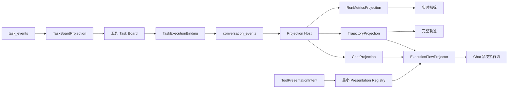
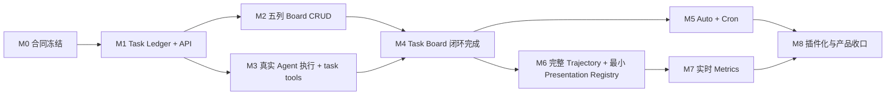

# ADR-073 任务看板优先的 Agent 工作台、完整轨迹与实时指标施工方案

> 状态：Proposed；施工排序与跨文档冲突裁决基线，不表示已经实现
> 日期：2026-08-16
> 修订：2026-08-17；补充 DeepSeek Harness 前端实现复核、canonical 硬切和最小 Presentation Registry 前置决策
> 核心决策：先完成可真实执行、可自动回写、可恢复的五列任务看板，再实现 Auto/Cron，随后建设完整运行轨迹与实时指标
> 任务领域：[ADR-072 工作区 TODO、峰谷 Auto 派发与定时任务第一阶段](./86ADR-072工作区TODO峰谷Auto派发与定时任务第一阶段ADR.md)
> 消息呈现：[PuddingAgent 消息、推理与工具调用 UI 对齐方案](../deepseek-harness-message-card-alignment-2026-08-14.md)
> 上位架构：[插件、Hook、生命周期与事件驱动自学习架构方案](../deepseek-harness-pi-plugin-hook-event-architecture-2026-08-14.md)

## 1. 决策

任务看板是后续工程推进的基础控制面，采用一个“先纵向闭环、后扩展自动化”的交付顺序：

1. 先交付 `WorkspaceTask` 台账、五列 Task Board、手工执行、真实 Agent Session/Run 绑定、结构化状态回写、执行会话深链和恢复；
2. 看板闭环完成后，接入 Agent Availability、WorkAdmissionFence、Auto Dispatcher 和受限 Cron Scheduler；
3. 再把 Chat 当前分散的 reasoning、message、tool、subagent 过程升级为独立、可搜索、可虚拟化、可回放的 Trajectory；
4. `TR-04` 开始前先贯通现有 `ToolPresentationIntent`，建立最小 keyed Presentation Registry；内置工具 renderer 随轨迹施工，第三方动态贡献和完整插件生命周期仍由 `PL-01` 收口；
5. 最后把 TTFT、TPS、LLM 耗时、上下文压力、缓存命中和输入/输出 Token 收敛为 Run Metrics Projection，并显示在 Composer 下方；
6. 三类 UI 只消费后端 Projection 的 Snapshot + Cursor Watch，不创建第二套浏览器状态机，不读取旧 `session_event_log`，不保留 canonical → legacy 事件映射或长期兼容分支。

“看板优先”不等于先画静态页面。Task Ledger、状态机、CAS、Task Event、Control Plane 和 Manual Execution Binding 是五列看板的组成部分，必须与前端同一纵向切片交付。

## 2. 本 ADR 修复的设计冲突

| 冲突 | 原设计 | 修订决定 |
|------|--------|----------|
| 看板是否在第一阶段 | ADR-072 将 Kanban 列为非目标 | 第一阶段纳入基础五列 Task Board；复杂依赖、子任务树、批量编辑仍排除 |
| Task 是否有失败终态 | ADR-072 只有 Assignment/Occurrence 失败，没有 Task `Failed` | 增加 Task `Failed` 与 `task.failed/task.reopened`；单次运行失败不必立即终止 Task |
| 是否支持 Cron 表达式 | ADR-072 排除任意 Cron，只支持结构化 daily/weekly/interval | 增加受限标准五字段 Cron；禁止秒、年、宏、脚本和扩展表达式 |
| 全局 P0 顺序 | 消息 UI 文档把执行流骨架称为 P0 | 该 P0 仅是消息模块内部优先级；产品全局顺序以本 ADR 为准，Task Board P0 先行 |
| Agent 自有 Todo 与 WorkspaceTask | `manage_tasks` 使用 per-agent JSON 三态列表 | 新 Workspace Task 启用后由 `task_*` 工具成为唯一 Owner；不建设双写或长期兼容层 |
| Presentation Registry 的时机 | 原任务表把全部 Presentation 插件化放到 Metrics 之后的 `PL-01` | 将消费现有 ToolPresentationIntent 所需的最小 keyed registry 前置到 `TR-04`；`PL-01` 只负责第三方动态贡献、卸载、优先级和跨表面生命周期 |
| 前端事件类型 | 当前 `api.ts` 把 canonical 类型映射回 legacy 名称，hook 再创建本地 ID/时间 | `TR-01` 直接冻结 canonical DTO；删除 legacy 映射，eventId/sequence/occurredAt 由服务端事实源提供 |

## 3. 产品范围与完成边界

### 3.1 P0：基础任务看板闭环

完成后用户可以：

- 在五列看板中创建、编辑、排序、筛选、取消、归档和重新打开任务；
- 点击“执行”，选择 Agent 并创建真实 Assignment、Delivery、Execution、Session 和 Run；
- 看到任务由 `待办 → 进行中 → 已完成/已失败` 自动推进；
- 从任务卡片直接进入实际执行会话或执行时间线；
- 刷新或 SSE 重连后恢复相同状态，不依赖浏览器内存；
- 使用 Auto 开关控制“仅手工”或“允许自动认领”，但 P0 不要求自动调度器已经启用。

P0 只有在真实 Agent 执行和自动回写通过后才算“任务看板完成”。只有 CRUD、拖拽或静态卡片不算完成。

### 3.2 P1：Auto 与 Cron

- Agent Availability 与一个 Agent 最多一个 Reservation；
- 高峰/空闲 WorkAdmissionFence；
- Auto Dispatcher、用户直接消息优先和恢复扫描；
- once/daily/weekly/fixed-interval/message-event；
- 受限标准五字段 Cron 与未来五次触发预览；
- Occurrence、Misfire、Overlap、Outbox、幂等和重启恢复。

### 3.3 P2：完整运行轨迹

- 主 Agent 的 Turn、Step、reasoning、message、tool call/result、retry、usage 和 terminal；
- 子代理 delegation、child run、round、reasoning、tool 和 settlement；
- 正在流式增长的 partial 与已落定事件使用同一视图模型；
- 独立 Chat/Trajectory 视图、搜索、折叠、时间范围、虚拟化和深链；
- Chat 只显示紧凑执行摘要，不重复展开完整子代理轨迹。
- 工具行消费持久化 `ToolPresentationIntent`，实时与历史选择相同 renderer；前端不按 toolName 猜测展示类型。

### 3.4 P3：实时运行指标

- TTFT、LLM wall time、decode time、TPS；
- 当前请求与会话累计 input/output/cache hit/cache miss；
- 下一请求 projected prompt/context pressure，而不是 `totalTokens/contextWindow`；
- 流式期间的估算值有 `~` 标记，终态 usage 到达后替换为准确值；
- 断线恢复后显示持久终态，不把前端 stopwatch 当作事实源。

本 ADR 不增加 Feedback、评分、点赞/点踩或偏好采集能力；运行轨迹只展示已记录的执行事实。

## 4. 五列任务看板合同

### 4.1 Board Column 是投影，不是第二套状态机

| 看板列 | `WorkspaceTaskStatus` | 说明 |
|--------|-----------------------|------|
| 待规划 | `Backlog` | 目标、验收或执行信息尚未完整 |
| 待办 | `Ready`、`Deferred`、`Reserved`、`Assigned`、`NeedsReview` | 卡片用徽标解释等待、预留、已分配或需复盘原因 |
| 进行中 | `InProgress`、`Blocked` | Blocked 保留在进行中并显示阻塞原因和恢复动作 |
| 已完成 | `Completed` | 有 result summary 和必需 artifact 证据 |
| 已失败 | `Failed` | Task 级闭合失败，不等同于单次 Assignment Attempt 失败 |

`Cancelled`、`Archived` 默认进入历史筛选，不占五列。前端不得通过字符串或颜色猜测列；后端 `TaskBoardProjection` 明确返回 `boardColumn`。

### 4.2 Failed 语义

- LLM/Tool/Runtime 单次失败先结束当前 Assignment Attempt；
- 策略允许重试时 Task 回到 `Ready`，并保留失败 Attempt；
- 需要用户判断时进入 `NeedsReview`；
- 明确不可恢复、重试耗尽、验收失败且不再继续，或用户执行“标记失败”时进入 `Failed`；
- `Failed -> Ready` 只允许显式 `reopen` Command，创建新 Version 和 `task.reopened`，迟到 Assignment 仍不能提交；
- `Completed/Failed/Cancelled -> Archived`。

### 4.3 执行按钮与自动回写

```text
Task Card Execute
  -> POST run-now(expectedVersion, agentId, windowDecision)
  -> Assignment Attempt + Dispatch Outbox（同事务）
  -> Message Fabric Delivery
  -> Agent Session / Execution Run
  -> task_update(accept/progress/blocked/completed/failed)
  -> Task Event + TaskBoardProjection
  -> Snapshot/Watch 更新原卡片
```

任务卡片必须保存或可查询 `assignmentId/deliveryId/executionId/sessionId/runId/traceId`。执行会话链接使用稳定 ID，不使用聊天标题或最近消息猜测。

## 5. Cron 和 Auto 合同

### 5.1 受限 Cron

支持标准五字段：

```text
minute hour day-of-month month day-of-week
```

示例：

```text
0 23 * * *     每天 23:00
0 9 * * 1      每周一 09:00
```

约束：

- 必须显式保存 IANA/Windows 可解析时区；
- 不支持秒、年、`@daily` 宏、`L/W/#/?` 扩展、脚本或动态表达式；
- 保存前由后端解析并返回未来五次 UTC/本地时间；
- `next_fire` 与 Occurrence 原子推进；
- 默认 `misfire=coalesce_one`、`overlap=forbid`；
- UI 的 daily/weekly/interval Builder 可以生成 Cron，但数据库保存 canonical trigger definition 和原始用户表达式；
- Cron 到点只创建 durable Occurrence，不直接在 Timer 回调中启动 Agent。

### 5.2 Auto

Task 的 Auto 开关只表示该 Task 可被 Auto Dispatcher 选择，不代表立即执行。最终执行仍必须通过 Availability、Reservation、Fence、Outbox、Session Gate 和用户消息优先检查。

## 6. 统一 Projection 架构



共同不变量：

1. Snapshot + Watch 的结果必须等于从头 replay；
2. eventId/sequence 幂等，终态不被迟到 progress 降级；
3. 前端 Store 不解释低层业务状态，只折叠冻结的 Projection DTO；
4. Chat、Trajectory、Task Board、Inspector 共享 ID 和深链；
5. bootstrap、gap recovery、live SSE 进入同一个 Projection 输入，结果必须与从头 replay 相同；
6. React hook/component 不生成 eventId、sequence、occurredAt、tool 配对或业务终态；
7. 不为旧 `manage_tasks` JSON、旧 SSE、canonical → legacy 映射或旧 `session_event_log` 增加兼容展示路径。

## 7. 完整任务清单与施工顺序

工作量按一名熟悉仓库的工程师估算，包含实现、定向测试和文档，不包含产品外部部署等待时间：`XS=0.5–1 人日`、`S=1–2 人日`、`M=3–5 人日`、`L=6–10 人日`、`XL=11–20 人日`。

### 7.1 P0：任务看板先行

| 顺序 | ID | 任务目标 | 优先级 | 工作量 | 难度 | 主要设计位置 |
|------|----|----------|--------|--------|------|--------------|
| 1 | TB-00 | 冻结五列、Failed、Command、错误码、Feature Flag 和唯一 Owner | P0 | S | 中 | 本文 §2、§4；ADR-072 §1、§5.2 |
| 2 | TB-01 | 实现 WorkspaceTask/Attempt/Binding/Event Core 合同和纯状态机 | P0 | M | 高 | ADR-072 §4、§5、ST-02 |
| 3 | TB-02 | 建立 SQLite Task Ledger、索引、CAS、Task+Event 原子提交和归档 | P0 | L | 高 | ADR-072 §11、ST-02、§15 |
| 4 | TB-03 | 实现 Task CRUD/Transition/RunNow API、Snapshot 和 Cursor Watch | P0 | L | 高 | ADR-072 §10.1、ST-03；ADR-050 §2.4 |
| 5 | TB-04 | 实现五列 Board、虚拟化、筛选、排序、Editor/Details Drawer | P0 | L | 中高 | 本文 §4；ADR-072 §10.2、ST-08A |
| 6 | TB-05 | 打通 Assignment → Outbox → Message Fabric → Delivery → Execution Binding | P0 | L | 极高 | ADR-072 §8.1、ST-03；ADR-057 §9 |
| 7 | TB-06 | 实现 `task_list/get/claim/update` 和 Active Task Runtime Context | P0 | L | 高 | ADR-072 §9.2、ST-04 |
| 8 | TB-07 | 完成状态自动回写、失败/重开策略、执行会话深链和 Task Timeline | P0 | M | 高 | 本文 §4.2–§4.3；ADR-072 §12 |
| 9 | TB-08 | 完成刷新恢复、并发/CAS、迟到提交、真实 Fake LLM E2E 和旧 `manage_tasks` 退役 | P0 | L | 极高 | 本文 §6；ADR-072 §16–§18 |

`TB-00 → TB-08` 全部完成才达到“基础任务看板完成”。预计总量约 42–64 人日；其中纯前端看板约 6–10 人日，主要工作量在可靠执行和恢复闭环。

### 7.2 P1：Auto 与 Cron

| 顺序 | ID | 任务目标 | 优先级 | 工作量 | 难度 | 主要设计位置 |
|------|----|----------|--------|--------|------|--------------|
| 10 | AU-01 | 实现 TimeProvider、时区、Work Policy、Fence 与 Heartbeat 0 | P1 | L | 高 | ADR-072 §6、ST-01 |
| 11 | AU-02 | 建立 Agent Availability Projection、Reservation、Lease/Fence 和用户优先 | P1 | L | 极高 | ADR-072 §7、ST-05 |
| 12 | AU-03 | 实现 Auto Dispatcher、确定性选择、三次 Fence、拒绝轮换和恢复扫描 | P1 | L | 极高 | ADR-072 §8.2、ST-06 |
| 13 | AU-04 | 实现 Automation/Occurrence、受限 Cron、Next Fire、Misfire、Overlap 和 Outbox | P1 | L | 高 | 本文 §5；ADR-072 §5.3–§5.4、ST-07 |
| 14 | AU-05 | 实现 Auto/Cron Editor、未来五次预览、Occurrence History 和 Work Policy UI | P1 | M | 中高 | ADR-072 §10.2、ST-08B |
| 15 | AU-06 | 完成双 Scheduler、Crash Matrix、峰谷边界、重启恢复和单一 Owner 验收 | P1 | L | 极高 | ADR-072 ST-10、§16.3–§16.4 |

### 7.3 P2：完整运行轨迹

| 顺序 | ID | 任务目标 | 优先级 | 工作量 | 难度 | 主要设计位置 |
|------|----|----------|--------|--------|------|--------------|
| 16 | TR-01 | 冻结 Run/Turn/Step/Request/Tool/Subagent canonical 轨迹 DTO、稳定 ID、排序和 partial 合同；删除前端 legacy 事件映射 | P2 | M | 高 | 消息 UI §4.3、§7；ADR-057 §6、§12；ADR-060 §3 |
| 17 | TR-02 | 建立服务端 TrajectoryProjection、Snapshot/Watch、分页和 gap recovery | P2 | L | 极高 | 上位架构 §7.4、§26；ADR-057 §4.8、§12 |
| 18 | TR-03 | 实现独立 Chat/Trajectory Tab、虚拟表格、搜索、折叠、时间范围和深链 | P2 | L | 高 | deepseek-harness `ui-trajectory`；消息 UI §4、§8 |
| 19 | TR-04 | 建立 ExecutionFlowProjector，收敛 reasoning/message/tool 行，按 callId/parentCallId 配对，并以前置的最小 Registry 消费 Tool-owned presentation | P2 | L | 高 | 消息 UI §4.3、§5、§8–§9；工具对齐文档 §14 |
| 20 | TR-05 | 将子代理建模为 parent delegation + child run，打开 child session 完整轨迹 | P2 | L | 极高 | ADR-060 §3.7–§3.8；上位架构 §8.10 |
| 21 | TR-06 | 完成 500 Turn/2000+ 行性能、流式滚动、可访问性和 replay 一致性测试 | P2 | M | 高 | 消息 UI §10；deepseek-harness trajectory E2E |

### 7.4 P3：实时 Token 与性能指标

| 顺序 | ID | 任务目标 | 优先级 | 工作量 | 难度 | 主要设计位置 |
|------|----|----------|--------|--------|------|--------------|
| 22 | MT-01 | 增加 LLM request started/first-token/completed/failed 时序事实和 requestId | P3 | M | 高 | 本文 §3.4；ADR-057 §6 |
| 23 | MT-02 | 建立 RunMetricsProjection，去重 usage，计算 TTFT/TPS/LLM/Tool/Cache/Context | P3 | L | 高 | ADR-043 §2、§4；消息 UI §9 Phase C |
| 24 | MT-03 | 修正上下文压力口径，区分 billed usage 与 projected next prompt | P3 | M | 高 | ADR-043；上下文缓存 ADR-018；本文 §3.4 |
| 25 | MT-04 | 在 Composer 下显示紧凑 StatsLine 和 ContextMeter，详情渐进披露 | P3 | M | 中 | deepseek-harness StatsLine/ContextMeter；消息 UI §4.2 |
| 26 | MT-05 | 完成流式估算转准确值、刷新恢复、跨模型和无 usage 失败测试 | P3 | M | 高 | 本文 §3.4、§6；ADR-043 §8 |

### 7.5 P4：插件化与收口

| 顺序 | ID | 任务目标 | 优先级 | 工作量 | 难度 | 主要设计位置 |
|------|----|----------|--------|--------|------|--------------|
| 27 | PL-01 | 在 TR-04 最小 Registry 之上补齐第三方动态 contribution、卸载、优先级、权限、inspector/timeline 和跨表面 Owner 生命周期 | P4 | L | 极高 | 上位架构 §26.3；工具对齐文档 §14、§16 |
| 28 | PL-02 | 统一 Chat/Board/Trajectory 语义 Token、权限动作和插件 Owner 生命周期 | P4 | M | 高 | 上位架构 §26；消息 UI §6 |
| 29 | CL-01 | 删除旧 Todo、重复前端 reducer/时间线和旧指标路径，更新文档与 Code Map | P4 | M | 高 | 本文 §2、§6；总蓝图 T16 |
| 30 | CL-02 | 完成组合测试、故障注入、产品新构建 Smoke 和外部部署验收 | P4 | L | 极高 | 总蓝图 T13/T15；ADR-072 ST-10/ST-11 |

### 7.6 平台底座 T00–T16 全量任务登记

以下 17 项是总蓝图的平台级任务，不因产品纵向切片而消失。它们与上面 30 项存在交付物复用，因此工作量是**底座任务自身的毛估算，不能与产品任务机械相加**。全局仍然先完成 `TB-00–TB-08`；表中的“拉入点”表示后续产品任务开始前必须先完成该底座任务所需的最小合同，不要求提前完成整个大重构。

| 平台顺序 | ID | 任务目标 | 全局优先级 | 工作量 | 难度 | 拉入点 / 设计位置 |
|----------|----|----------|------------|--------|------|-------------------|
| 31 | AX-T00 | 冻结 Microkernel、Capability、事实语言和插件注册合同 | P0 最小合同 / P4 全量 | M | 高 | `TB-00` 拉入 Task 所需合同；总蓝图 T00 |
| 32 | AX-T01 | 建立 Storage/Session Log 插件和单一 append-only 运行事实 | P2 | XL | 极高 | `TR-02` 前；总蓝图 T01 |
| 33 | AX-T02 | 建立 Model/LLM 插件、ContentBlock 和 DeepSeek Responses 保真 | P2 | L | 高 | `TR-01/MT-01` 前；总蓝图 T02 |
| 34 | AX-T03 | 收敛 Agent Loop、Run/Turn/Step 和单一优先级 Inbox | P2 | XL | 极高 | `TR-01/TR-02` 前；总蓝图 T03 |
| 35 | AX-T04 | 将 Prompt Section 和 Skill 变为可组合插件贡献 | P4 | L | 高 | `PL-02`；总蓝图 T04 |
| 36 | AX-T05 | 建立 Tool Registry 插件、端到端 ToolCallId 和 canonical Tool Result | P2 | L | 高 | `TR-04` 前；总蓝图 T05、工具方案 P0-A/P0-B |
| 37 | AX-T06 | 纵向迁移 Tool/Sandbox、Typed Error、Hook Pipeline、spill 和 Job | P2–P4 | XL | 极高 | `TR-04/PL-01`；总蓝图 T06、工具方案 P0-C/P1 |
| 38 | AX-T07 | 建立单一 Standard Profile/Bundle/Overlay 和组合快照 | P4 | L | 高 | `PL-02`；总蓝图 T07 |
| 39 | AX-T08 | 建立动态 Plugin Host、Typed Hook、reload、sidecar 和撤销生命周期 | P4 | XL | 极高 | `PL-01/PL-02`；总蓝图 T08、插件方案 P1/P5 |
| 40 | AX-T09 | 将 Goal/Job/Schedule/Heartbeat 收敛为插件和 durable 事件消费者 | P1 最小 Schedule / P4 全量 | XL | 极高 | `AU-04` 拉入 Occurrence 最小合同；总蓝图 T09 |
| 41 | AX-T10 | 将子代理变为 Provider 插件并统一 delegation/child/settlement | P2 | L | 极高 | `TR-05` 前；总蓝图 T10 |
| 42 | AX-T11 | 建立 Compaction 插件、Checkpoint 和 Tool-pair 安全边界 | P4 | L | 高 | `PL-02`；总蓝图 T11 |
| 43 | AX-T12 | 建立 Projection/Presentation 插件、统一 SSE 和可恢复前端读取模型 | P2–P3 | XL | 极高 | `TR-02/MT-02/PL-01`；总蓝图 T12 |
| 44 | AX-T13 | 建立 Runtime Invariants、composition dump 和终态/顺序守卫 | P4 | L | 高 | `CL-02`；总蓝图 T13 |
| 45 | AX-T14 | 将长效学习改为 durable event → candidate → evaluate → canary → activate/rollback | P4 | XL | 极高 | 插件/Hook 文档 P4；总蓝图 T14 |
| 46 | AX-T15 | 完成组合测试、故障注入、真实 DeepSeek Smoke 和 Desktop 外部验收 | P4 | XL | 极高 | `CL-02`；总蓝图 T15 |
| 47 | AX-T16 | 删除旧事实源、旧 Loop/Hook/DTO/兼容分支并收口文档 | P4 | L | 高 | `CL-01` 后；总蓝图 T16 |

### 7.7 各专项文档任务去重映射

专项文档中的 Phase 名称不再形成另一张并行排期表，统一归入上述 47 个 Canonical Task：

| 来源任务 | Canonical Owner | 说明 |
|----------|-----------------|------|
| 消息 UI Phase 0/A | `TR-01/TR-02/TR-04/TR-05` | canonical 硬切、ExecutionFlow 与最小 Presentation Registry；局部 P0，不早于任务看板和 Auto/Cron |
| 消息 UI Phase B | `TR-04` | 内置 Tool-owned presenter；不包含第三方动态生命周期 |
| 消息 UI Phase C | `TR-06/MT-01–MT-05` | 性能与实时指标 |
| 工具方案 P0-A | `AX-T05` | ToolCallId 与事件闭环 |
| 工具方案 P0-B | `AX-T05` | Schema 与 canonical output |
| 工具方案 P0-C | `AX-T06` | Typed Error、Hook 与执行管线 |
| 工具方案 P1-A/P1-B | `AX-T06/PL-01` | spill、Job、并发和 presentation |
| 工具方案 P2/P3 | `AX-T06/AX-T08` | Code Mode 与 PluginActivation 全量迁移 |
| 插件方案 P0 | `AX-T00` | 语义和生命周期词典 |
| 插件方案 P1/P2 | `AX-T08/AX-T01` | Plugin Host、Typed Hook、Durable Event Log |
| 插件方案 P3 | `AX-T09` | Heartbeat 与后台 Job 事件化 |
| 插件方案 P4/P5 | `AX-T14/AX-T08` | 自学习闭环、第三方插件与热重载 |
| 总蓝图 T00–T16 | `AX-T00–AX-T16` | 一一对应，不重复创建任务 |

## 8. 依赖图和里程碑



| 里程碑 | 退出条件 |
|--------|----------|
| M0 | 本 ADR 与 ADR-072 的五列、Failed、Cron、ID、错误和唯一 Owner 冻结 |
| M1 | Task 状态机、SQLite、CAS、Task Event、API、Snapshot/Watch 通过 |
| M2 | 五列 Board 能创建、编辑、筛选、拖动合法转换并恢复 |
| M3 | 卡片执行创建真实 Run，Agent 只能用结构化工具推进 Task |
| M4 | 自动回写、失败、重开、会话深链、刷新和 E2E 通过；基础任务看板完成 |
| M5 | Auto、Cron、峰谷、Occurrence、恢复和 Automation UI 通过 |
| M6 | 主/子 Agent 完整轨迹可搜索、可虚拟化、可回放；Chat/Trajectory 通过最小 Registry 消费同一 ToolPresentationIntent |
| M7 | TTFT/TPS/耗时/上下文/缓存/Token 准确且可恢复 |
| M8 | Presentation 插件化、旧路径删除、性能与产品 Smoke 通过 |

## 9. 文件级目标

除 ADR-072 §15 已列文件外，新增目标：

```text
Source/PuddingCore/Tasks/TaskBoardProjectionContracts.cs
Source/PuddingCore/Platform/TrajectoryProjectionContracts.cs
Source/PuddingCore/Platform/RunMetricsProjectionContracts.cs

Source/PuddingPlatform/Services/Tasks/TaskBoardProjectionService.cs
Source/PuddingPlatform/Services/AgentChat/TrajectoryProjectionService.cs
Source/PuddingPlatform/Services/AgentChat/RunMetricsProjectionService.cs

Source/PuddingPlatformAdmin/src/pages/workspace-tasks/TaskBoard.tsx
Source/PuddingPlatformAdmin/src/pages/workspace-tasks/TaskColumn.tsx
Source/PuddingPlatformAdmin/src/pages/workspace-tasks/TaskCard.tsx
Source/PuddingPlatformAdmin/src/pages/workspace-tasks/TaskExecutionLink.tsx

Source/PuddingPlatformAdmin/src/pages/chat/trajectory/TrajectoryView.tsx
Source/PuddingPlatformAdmin/src/pages/chat/trajectory/TrajectoryTable.tsx
Source/PuddingPlatformAdmin/src/pages/chat/trajectory/TrajectoryToolbar.tsx
Source/PuddingPlatformAdmin/src/pages/chat/projections/trajectoryProjection.ts
Source/PuddingPlatformAdmin/src/pages/chat/projections/executionFlowProjector.ts
Source/PuddingPlatformAdmin/src/pages/chat/components/execution-flow/ExecutionFlow.tsx
Source/PuddingPlatformAdmin/src/pages/chat/components/execution-flow/ReasoningDisclosureRow.tsx
Source/PuddingPlatformAdmin/src/pages/chat/components/execution-flow/ToolCallTree.tsx
Source/PuddingPlatformAdmin/src/pages/chat/components/execution-flow/DelegationRow.tsx
Source/PuddingPlatformAdmin/src/pages/chat/presentation/PresentationRegistry.ts
Source/PuddingPlatformAdmin/src/pages/chat/presentation/renderers/*.tsx
Source/PuddingPlatformAdmin/src/pages/chat/components/RunStatsLine.tsx
Source/PuddingPlatformAdmin/src/pages/chat/components/ContextMeter.tsx
```

这些是目标落点，不表示文件已经存在。实现时必须先检查当前目录和组件拆分，避免与并发工作重复创建。

## 10. 验收总表

| 能力 | 必须证据 |
|------|----------|
| 五列 Board | Core 状态到 BoardColumn 的表驱动测试；五列 UI E2E；Cancelled/Archived 不占列 |
| 真实执行 | 一次卡片执行可串联 taskId → assignmentId → deliveryId → executionId → sessionId → runId |
| 自动回写 | Agent 自然语言“完成”不生效；合法 task_update 才改变 Task |
| Failed | 单次可重试失败不误终结；终止策略进入 Failed；显式 reopen 产生新 Version |
| Snapshot/Watch | 首屏 Snapshot 与并发事件无缺口；重连从 Cursor 追赶；重复事件幂等 |
| Auto/Cron | 两个 Scheduler 不重复 Claim；Cron 未来五次正确；重启按 Misfire 只产生规定次数 |
| 完整轨迹 | reasoning/tool/subagent partial 实时追加；终态和刷新后顺序一致 |
| canonical 硬切 | `api.ts` 无 canonical → legacy 映射；事件 ID/时间/顺序不由 React 生成；bootstrap/gap/live replay 等价 |
| 工具展示 | 八类 ToolPresentationIntent 实时/历史选择相同 renderer；并发同名工具按 callId 配对；子调用按 parentCallId 成树 |
| 长轨迹 | 500 Turn/2000+ 行不全量挂 DOM，搜索和折叠不跳滚动位置 |
| 指标 | TTFT/TPS/耗时和 usage 与服务端事件一致；上下文不再用 totalTokens 误算 |
| 唯一 Owner | 新 WorkspaceTask 上线后没有 `manage_tasks` JSON 双写、旧 SSE 或旧日志兼容分支 |

## 11. 与总蓝图 T00–T16 的关系

本 ADR 是产品交付纵向切片，并通过 `AX-T00–AX-T16` 完整登记 `deepseek-reference-architecture-master-plan-2026-08-14.md` 的底座路线：

- Task Board P0 使用现有静态 DI/Tool Registry 和 canonical Conversation Event，不等待通用动态 Plugin Host；
- `TB-05/TB-06` 对应总蓝图的 Session/Agent Loop/Tool 能力缝；
- `TR-*` 和 `MT-*` 是总蓝图 T12 Projection/Presentation 的可交付拆分；
- `PL-*` 对应 T08/T12 的动态 Contribution 与 Presentation；
- `CL-*` 对应 T13/T15/T16；
- 各专项 Phase 只映射到一个 Canonical Owner，禁止为同一目标再开第二张并行任务卡；
- 禁止为了提前交付看板而新增第二套 Task EventBus、Browser-only Store 或兼容双写。

## 12. 最终施工顺序

```text
Task Contract
  → Task Ledger/API
  → 五列 Board CRUD
  → Manual Execution + task tools
  → 自动回写/失败/重开/会话深链
  → 基础任务看板完成
  → Availability/Fence/Auto
  → Cron/Occurrence
  → canonical Trajectory DTO 硬切
  → ExecutionFlowProjector + 最小 Presentation Registry
  → Chat 紧凑执行流 + 完整 Trajectory
  → Run Metrics
  → 完整 Presentation Plugin 生命周期
  → 删除旧路径与产品验收
```
