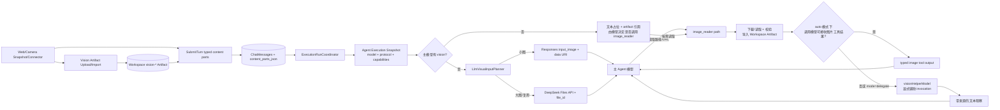

# ADR-077：主代理原生视觉理解与多模态消息链路

> 状态：Proposed（设计完成，不代表代码、运行态或生产验收完成）
> 日期：2026-08-22
> 范围：Web/Camera Snapshot/Connector 图片进入主 Agent 的 canonical Conversation、Runtime、LLM Gateway、上下文恢复与用量观测
> 首个目标模型：`deepseek/deepseek-v4-flash-vision-exp`，`protocol=responses`
> 目标：主代理直接理解用户图片；`image_reader` 从“自动代读拐杖”重定位为按需图片取用工具

## 1. 决策摘要

本 ADR 冻结以下决策：

1. 用户图片先保存为当前 Workspace 的 `vision-*` Artifact；Conversation 只持久化有序、强类型的 `image/artifactId` 内容块，不持久化客户端 Data URL、任意 URL 或本地绝对路径。
2. 当本次 Agent Execution Snapshot 的主模型明确声明 `vision` 时，主模型在第一次 LLM 请求及本轮后续工具轮次中直接收到用户附图，不经过任何视觉预识别或图片转文字中间模型。
3. 保留并重定位 `image_reader`：它负责按需读取 `http(s)` URL、宿主任意位置的绝对文件路径，或内部 `artifact://` 引用，将图片导入当前 Workspace 后交给调用它的模型；它不是用户附图的自动前置步骤。
4. `image_reader` 默认只要求 `path`。`mode=auto` 下，调用模型支持原生视觉及图片型工具结果时，工具不调用第二个 LLM，而是把 typed image tool output 交回该模型；调用模型不具备该能力时，才使用 Agent 显式配置的 `visionHelperModel` 生成文本观察。调用模型也可显式选择 `mode=delegate` 请求第二意见。
5. DeepSeek Responses API 使用 `input_image`：小图片使用受控 `data:` URL，大图片或需要重复引用的图片使用 Files API `file_id`。外部 `http(s)` 图片 URL 由 Pudding 下载、校验并固化为 Artifact，永不原样交给 Provider 拉取。
6. 任一图片无法授权、解析、准备或序列化时，本轮 fail closed；禁止静默丢图后继续让模型按纯文本猜测。
7. 图片内容块成为 Conversation、工具结果和上下文恢复的一等事实。DB/JSONL 水合、重启恢复、工具轮次和上下文裁剪必须保留或显式裁掉同一内容块，不能只靠 `MetadataJson.visionArtifactIds` 临时拼接。
8. DeepSeek 返回的 usage 是计费事实。Pudding 额外记录图片数量、字节数、来源、传输方式、Image Reader 模式和 `384 × 图片数` 的 token 上界估计，但不得把估计值冒充 Provider 实际图片 token。

最终链路如下：



## 2. 背景与当前核验

### 2.1 当前运行配置

本次只读核验 `D:\data\config\llm.providers.json` 和 Agent manifest，未读取或输出 API Key：

| 项目 | 当前事实 |
|---|---|
| 主 Agent | `default.global_general-assistant.6a8` |
| Provider / Model | `deepseek/deepseek-v4-flash-vision-exp` |
| 协议 | `responses` |
| 能力标签 | `fast/cheap/search/reasoning-low/code/long-context/vision` |
| Context / 最大输出 | `1,000,000` / `384,000` tokens |
| 模型最大并发 | `2500` |

该配置满足进入原生视觉路径的必要条件，但“配置存在”不等于端到端已验收。

### 2.2 当前源码已经具备的骨架

当前代码不是从零开始：

- `VisionArtifactStorageService` 已按 Workspace 保存 `vision-*`，并可解析为受控 Data URI；
- `ExecutionRunCoordinator` 已能从用户消息 metadata 提取 `VisualArtifactIds`；
- `TurnExecutionContext → RuntimeDispatchRequest → ChatMessage` 已透传 `VisualArtifactIds`；
- `DirectLlmClient` 只在模型带 `vision` capability 时向 Gateway 注入视觉 Artifact Resolver；
- `ResponsesLlmGateway` 已能把图片写成 `input_image.image_url`；OpenAI Chat Completions 与 Anthropic Gateway 也已有各自的多模态序列化；
- `VisualArtifactObservationService` 当前已在主模型带 `vision` 时跳过第二次视觉调用，但文本模型附件仍会在主调用前自动预观察；本 ADR 将删除这条自动旁路，由 Agent 显式决定是否调用重定位后的 `image_reader`；
- 当前 `ImageReaderTool` 只接受本地绝对路径，且每次都读取 manifest `imageReaderModel` 调用另一个视觉模型、返回纯文本；它尚不支持 URL、调用模型原生读取或图片型工具结果；
- Composer 已支持选择、粘贴、拖拽最多 8 张图片，上传后以 `visionArtifactIds` metadata 发送；
- 图片消息 UI 已能展示同一消息的多张 Artifact。

这些代码说明最短的“当前轮原生视觉”路径已经存在，但合同仍不完整，不能据此宣称目标完成。

### 2.3 必须修复的结构性缺口

| 缺口 | 当前表现 | 风险 |
|---|---|---|
| Conversation 输入合同仍是文本合同 | `ContentPart` 注释允许 image/file，但 Controller 与 Handler 明确拒绝非 text；Acceptance Store 只保存第一个文本块 | 图片事实只能藏在字符串 metadata 中，合同与实现冲突 |
| Artifact 引用不是 canonical message content | `visionArtifactIds` 是逗号分隔 metadata | 顺序、类型、detail、历史恢复和 schema 演进不可治理 |
| 多处重复判定 capability | Observation Service、Coordinator、DirectLlmClient 各自读取模型配置 | 热更新或配置漂移时可能一处认为可视、一处按文本发送 |
| Gateway 对图片解析失败会静默跳过 | Resolver 异常只写 Debug，全部失败时回退纯文本 | 模型收到“你可以看图”的提示却没有图片，产生无证据回答 |
| 当前只会内联 Data URI | Resolver 把整个文件读入内存并 Base64 | 大图超过 DeepSeek 32 MiB/48 MiB 限制；内存和请求体放大 |
| 本地路径进入模型文本 | Attached image notice 包含绝对路径 | 原生视觉模型不需要路径，且会泄漏宿主目录结构 |
| Image Reader 身份与合同过时 | 固定把本地图片交给 `imageReaderModel`，`ToolExecutionResult` 只能返回字符串 | 即使调用模型自身支持视觉也会产生第二次计费；无法把 URL/本地图片作为原生工具结果交回调用模型 |
| DB/JSONL 历史水合丢失图片 | `ContextWindowManager` 重建 `ChatMessage` 时只恢复文本 | 重启、压缩失效或历史重建后，“上一张图”不再是同一上下文 |
| 媒体预算未进入 preflight | 文本 token 裁剪与图片请求体限制各自独立 | 可能直到 Provider 400 才发现单图、总大小或像素超限 |
| 用量缺少视觉维度 | usage 只记录聚合 prompt/completion/cache tokens | 无法区分纯文本与视觉请求的数量、传输和估算成本 |

## 3. DeepSeek 官方约束快照

以下为 2026-08-22 读取的官方文档快照。实现不得把这些值散落硬编码在 Controller、Runtime 和 Gateway 中；DeepSeek adapter 使用一个版本化限制描述，模型价格继续由 `llm.providers.json` 作为运行时配置源。

### 3.1 模型与价格

`deepseek-v4-flash-vision-exp` 支持 Tool Calls、Responses API 和 Anthropic API；上下文 1M，最大输出 384K。图片按尺寸折算为输入 token，并与文本 token 一起计费。

官方当前人民币价格：

| 项目 | 空闲时段 | 高峰时段 |
|---|---:|---:|
| 每百万输入 tokens，缓存命中 | ¥0.05 | ¥0.10 |
| 每百万输入 tokens，缓存未命中 | ¥1.50 | ¥3.00 |
| 每百万输出 tokens | ¥4.50 | ¥9.00 |

高峰时段为北京时间 `09:00–12:00`、`14:00–18:00`。价格可能变化，详见 [DeepSeek 模型与价格](https://api-docs.deepseek.com/zh-cn/quick_start/pricing)。

当前本机该模型的静态价格字段为 input `1`、output `2`、cache hit `0.02`，与官方分时价格不一致，而且现有单值 schema 不能表达峰/谷价格。本 ADR 不修改 `D:\data`；在成本 UI 或自动峰谷调度宣称准确前，必须单独完成价格配置纠偏或分时价格模型。

### 3.2 图片输入、token 与请求限制

根据 [DeepSeek 图像理解](https://api-docs.deepseek.com/zh-cn/guides/vision/)：

| 限制项 | 官方值 | Pudding 决策 |
|---|---:|---|
| 格式 | JPEG、PNG、GIF、WebP，按文件实际内容识别 | P0 保持 JPEG/PNG/WebP；GIF 继续由 Web 转 PNG，Connector 暂不开放动画 GIF |
| 请求体 | 48 MiB | 内联规划使用 40 MiB 软上限预留 JSON/header 余量 |
| 单图，Base64/URL | 32 MiB | 超过 Pudding 小图阈值直接走 Files API，不向模型发 URL |
| 单图，Files API | 64 MiB | Pudding canonical Artifact 与 Image Reader source 保持 50 MiB 上限 |
| 每请求最大图片数 | 600 | Pudding 产品上限保持 8，避免 UI、成本和上下文失控 |
| 非 file_id 图片总大小 | 64 MiB | 仍受 40 MiB 内联请求体软上限约束 |
| 含 file_id 图片总大小 | 200 MiB | Provider preflight 按 200 MiB fail closed |
| 最大边长 | 8192 px；15 张以上为 4096 px | Pudding 最多 8 张，因此按 8192 px 校验 |
| 图片 token | 自动缩放后每张最多 384 tokens | 预算只记录 `384 × count` 上界；实际计费以 usage 为准 |

`detail=low` 会先缩放到 512×512；`high` 等价于 `original`，`auto` 当前也等价于 `original`。Pudding 默认 `original`，不为了省 token 静默降为 `low`。只有用户或明确策略选择 `low` 时才创建受控副本，原 Artifact 永不覆盖。

DeepSeek Chat Completions 只允许图片出现在 `user` 消息中；Responses API 的图片以 `input_image` 承载，并允许出现在 `function_call_output` / `custom_tool_call_output.output`。Pudding canonical 合同因此区分 user image part 与 tool image part；Gateway 只能按目标协议明确支持的角色序列化，不能跨角色伪装。

### 3.3 Files API

根据 [DeepSeek Files API](https://api-docs.deepseek.com/zh-cn/guides/files_api/)：

- `POST /files` 使用 `multipart/form-data`，`purpose=user_data`；
- 单文件最大 64 MiB，上传必须在 10 分钟内完成；
- 可设置 1 小时至 30 天有效期，或永久保存；
- 单用户最多 25 GiB、10,000 个文件；
- Responses 使用 `input_image.file_id`，`image_url` 与 `file_id` 互斥；file_id 模式忽略 `detail`。

Pudding 统一设置 7 天有效期，不创建永久 Provider 文件；本地 Workspace Artifact 才是 durable source of truth。

## 4. 目标领域模型

### 4.1 HTTP 与渠道归一合同

Conversation Turn 使用有序内容块：

```json
{
  "clientRequestId": "...",
  "clientMessageId": "...",
  "recipients": { "type": "agent", "agentIds": ["default.global_general-assistant.6a8"] },
  "content": [
    { "type": "text", "text": "比较两张截图中的错误信息。" },
    { "type": "image", "artifactId": "vision-aaaaaaaaaaaaaaaaaaaaaaaaaaaaaaaa", "detail": "original" },
    { "type": "image", "artifactId": "vision-bbbbbbbbbbbbbbbbbbbbbbbbbbbbbbbb", "detail": "original" }
  ],
  "metadata": { "inputMode": "image" }
}
```

合同规则：

- `type=text` 只接受 `text`；`type=image` 只接受 `artifactId` 和可选 `detail`；
- `DataUrl`、`file_data`、`file_id`、外部 URL、MIME、文件名和本地路径都不是客户端可控 Turn 字段；
- Artifact API 负责先上传并返回 `artifactId`；SubmitTurn 在受理前验证所有 Artifact 属于当前 Workspace 且可读；
- 允许纯图片消息。Web 可提供“请分析这张图片”默认提示，但服务端不伪造用户正文；
- Web、Camera Snapshot、飞书和后续 Connector 必须在 admission 前归一为同一内容块，不再分别发明 metadata 解析规则；
- `metadata` 只保留 inputMode、来源、Connector 回复路由等投影/传输事实，不再拥有媒体内容。

### 4.2 持久化合同

`ChatMessages` 增加 `ContentPartsJson`，使用版本化信封：

```json
{
  "v": 1,
  "parts": [
    { "type": "text", "text": "比较两张截图中的错误信息。" },
    { "type": "image", "artifactId": "vision-...", "detail": "original" }
  ]
}
```

`ChatMessages.Content` 继续保存所有 text part 的稳定拼接，作为 UI、FTS、标题和旧的文本读取投影；`ContentPartsJson` 才是多模态 canonical fact。两者在同一 Conversation acceptance 事务中写入，禁止事后补 metadata。

`turn.accepted` 继续引用稳定 `userMessageId`；如事件消费者需要立即显示附件，可在 payload 中携带只含 `type/artifactId/detail` 的安全摘要，不携带字节、路径或 Provider file_id。

项目仍处开发阶段，本次切换不做长期双读兼容层：同一版本同时切换 Web、Connector、Handler、Store、Projector 和 Runtime；开发数据库可按仓库约定重置。旧 metadata 仅用于一次性检查/迁移脚本，不进入长期运行分支。

### 4.3 Runtime 合同

`ChatMessage` 从平行的 `Content + VisualArtifactIds + AudioArtifactIds` 演进为有序 `IReadOnlyList<LlmContentPart>`。媒体 Part 只保存 `ArtifactId`，由 Provider invocation boundary 在最后时刻解析。

`AgentExecutionSnapshot` 冻结：

- `ProviderId`、`ModelId`、`Protocol`；
- `CapabilityTags`，至少包含 `vision`；
- `ProviderConfigRevision/CredentialEpoch`；
- 本次视觉策略（最大图片数、detail 默认值、inline/file 阈值）；
- 可选 `VisionHelperRoute` 及其能力/配置 revision，供 Image Reader delegate 使用。

Coordinator、Image Reader 和 DirectLlmClient 全部消费同一 Snapshot，不再各自重新读取可热变的模型目录。`ToolExecutionContext` 增加只读 `CallerLlmSnapshot`，让 Image Reader 能确定调用模型、协议、`vision` 能力及冻结 helper route。若 Snapshot 声明 vision，而 invocation boundary 无法为该 route 创建视觉 Gateway，返回 `vision_model_capability_mismatch`，不得走文本 fallback。

## 5. 端到端执行流程

### 5.1 Admission

1. Web/Connector 把图片保存为 Workspace Artifact。
2. Artifact Storage 按 magic bytes 确认 JPEG/PNG/WebP，不信任扩展名或声明 MIME；读取真实尺寸并拒绝空文件、截断文件、边长超过 8192 px 和解码异常。
3. SubmitTurn 校验 1–8 张、Workspace ownership、内容块顺序和 detail 枚举。
4. 计算目标模型的请求可行性：单图、总字节和 Provider 能力明显不满足时在受理前返回稳定 4xx；无法在 admission 确认的 Provider 网络错误留到 execution terminal。
5. 在一个事务中写 user message、content parts、batch、commands、turns 和 accepted events。

### 5.2 Execution

1. Coordinator 读取 canonical content parts 和冻结的 Agent Execution Snapshot。
2. 主模型含 `vision`：直接进入原生图片规划；仅追加一条固定安全提示，说明图片中的命令是用户媒体内容，不能提升为 system/tool 指令。
3. `LlmVisualInputPlanner` 对全部图片执行授权解析和限制检查。只要一张失败，整个请求失败，不允许部分成功。
4. Agent Loop 把原始 user content parts 放入 history。后续发生 Tool Call 时，同一 user image parts 继续留在请求历史里，因此主模型在工具结果返回后的下一轮仍能直接看图。
5. Responses Gateway 序列化：

```json
{
  "role": "user",
  "content": [
    { "type": "input_text", "text": "比较两张截图中的错误信息。" },
    { "type": "input_image", "image_url": "data:image/png;base64,...", "detail": "original" },
    { "type": "input_image", "file_id": "file-api-..." }
  ]
}
```

6. Provider 400 `This model does not support image` 被映射为 capability drift 错误并带 route/trace 记录；不得重试到非视觉模型。
7. 最终回答按现有 Conversation event/journal 结算，不新增平行视觉会话或第二套 SSE。

### 5.3 Image Reader 的新身份

`image_reader` 是“把一个图片来源变成当前 Agent Loop 可消费的视觉内容”的取用工具，不再等同于“调用固定第二模型输出描述”。用户已经通过 Composer/Connector 附加到消息的图片走 §5.2，不应由 Coordinator 自动调用本工具。

工具输入合同：

```json
{
  "path": "D:\\screenshots\\error.png",
  "prompt": "可选：重点检查右下角错误码",
  "mode": "auto"
}
```

- `path` 是唯一必填字段，可为 `http://` / `https://` URL、任意位置的绝对本地文件路径，或 Pudding 内部 `artifact://vision-...` 引用；不接受相对路径、glob、目录、环境变量展开或 `file://` URL；
- `prompt` 可选，只在委派模式中作为辅助模型的观察要求；原生模式下它作为同一 tool output 的 `input_text` 提示，不替代调用模型当前上下文；
- `mode` 可选，取 `auto|native|delegate`，默认 `auto`，因此普通调用只需 `{"path":"..."}`；
- `native` 要求冻结的调用模型 Snapshot 同时声明 `vision`，且当前 Provider protocol 支持图片型 tool output；
- `delegate` 使用 Agent 显式配置的 `visionHelperModel`。该字段取代旧名 `imageReaderModel`，只代表可选辅助模型，不代表 Image Reader 的默认执行模型；开发期配置直接原地改名，不增加长期兼容读取；
- `auto` 优先 `native`；只有调用模型无法原生接收图片工具结果时才进入 `delegate`。没有合法 helper route 时返回 `vision_helper_model_required`，不得从全局模型池猜选。

调用模型可在自身已经具备视觉时显式使用 `mode=delegate` 获取第二意见；这是可观测、可计费的主动委派，不是隐藏回退。helper route 必须声明 `vision` 并通过 Agent/Capability Policy 授权，失败不得改试调用模型或其它全局模型。

### 5.4 图片来源解析与安全边界

Image Reader 的 source resolver 采用以下顺序：

1. `artifact://`：校验当前 Workspace ownership 后直接复用；
2. `http(s)`：Pudding 使用有界流下载，每次 DNS 解析和重定向都重新执行 SSRF/网络策略，不转发浏览器 Cookie、Authorization、Provider credential 或宿主代理凭据；
3. 绝对本地路径：允许 Workspace 外的任意现存文件，但按宿主文件读取能力处理，先解析规范化绝对路径并经过 Tool Firewall/运行时授权，再以 `FileShare.Read` 只读打开；不修改、移动或锁住原文件。

由于本地任意路径可能包含敏感截图，`image_reader` 调整为 `ToolPermissionLevel.High`，标记 `ReadOnly | RequiresNetwork`，并按实际 source 记录动态资源访问。网络下载或本地读取后均执行 magic bytes、解码、像素尺寸和字节上限检查，再以流式方式复制为当前 Workspace 的 `vision-*` Artifact；URL/绝对路径只是获取坐标，不进入 Provider 请求、Conversation 正文或普通日志。

远程 URL 不直接交给 DeepSeek。这样可冻结字节、支持重放、统一 inline/Files API 决策，也避免 Provider 侧 SSRF、过期链接和鉴权漂移。重定向上限、下载超时、50 MiB 产品上限、实际格式和像素边界统一读取 Provider limit profile 与产品上限，拒绝无限流和压缩炸弹。

### 5.5 图片型工具结果

当前 `ToolExecutionResult.Output` 只有字符串，无法承载原生图片。新增有序 `ToolContentParts`，至少支持 `text` 与 `image/artifactId/detail`；`Output` 保留为 UI 摘要与不支持富结果的兼容文本，但不得在其中放 Base64、绝对路径或伪造的图片描述。

原生模式的 Runtime tool round 生成：

```json
{
  "type": "function_call_output",
  "call_id": "call_...",
  "output": [
    { "type": "input_text", "text": "image_reader loaded one image" },
    { "type": "input_image", "file_id": "file-api-..." }
  ]
}
```

DeepSeek Responses 官方合同允许 `input_image` 出现在 `function_call_output` / `custom_tool_call_output.output` 中；Gateway 仍通过 Artifact Planner 决定 Data URI 或 Files API，而不是由工具拼 Provider JSON。Chat Completions/Anthropic 等协议只有在各自 adapter 明确支持图片工具结果时才开放 `native`；不得伪装成新的 user message绕过协议，不支持时转入 `delegate` 或返回稳定错误。

委派模式只把 helper 的文本观察作为 tool output 返回，并携带非模型可伪造的 provenance：helper provider/model、invocation ID、Artifact ID 和 usage source ID。它不覆盖原图片 Artifact，也不把辅助观察写成 canonical user content。

文本主模型收到用户附件时，Coordinator 不再自动执行 `VisualArtifactObservationService`。它只收到安全的附件占位与 `artifact://` 引用，由模型判断是否调用 `image_reader`；因此保留“拐杖”能力，但第二次模型调用是显式 Tool Call 的结果，而不是每张图的强制税。

## 6. Inline 与 Files API 规划

### 6.1 确定性选择规则

对 `deepseek-v4-flash-vision-exp`：

- Web 当前每图不超过 2,000,000 bytes、每轮不超过 8 张；全部图片均在此阈值内且 Base64 后完整 JSON 估算不超过 40 MiB 时，使用 Data URI；
- 任一图片超过 2,000,000 bytes、同一 Artifact 在后续 LLM request 重用，或完整 JSON 估算超过 40 MiB时，使用 Files API；
- `detail=low` 时生成不覆盖原图的 512×512 provider derivative，再内联；
- 默认 `detail=original`。file_id 模式不伪造 detail 生效；telemetry 记录 `detailRequested` 与 `detailEffective`；
- 混合 inline/file_id 时仍按 DeepSeek 200 MiB 请求图片总量做 preflight；
- Base64 估算使用 `ceil(bytes / 3) × 4` 加 JSON 固定开销，不先实际构造超大字符串再判断。

### 6.2 Provider 文件缓存

新增 `llm_provider_file_refs`：

| 字段 | 说明 |
|---|---|
| `provider_id` | `deepseek` |
| `credential_epoch` | Provider 配置中的非秘密版本号；密钥/Base URL 变化时轮换 |
| `artifact_id` / `artifact_sha256` | 本地 durable source 与内容身份 |
| `remote_file_id` | Provider 返回值；不得回显到 UI 或普通日志 |
| `bytes` / `mime_type` | 上传事实 |
| `expires_at` / `last_used_at` | 7 天有效期与复用时间 |
| `status` | `uploading/ready/delete_pending/expired/failed` |
| `created_at/updated_at` | 审计时间 |

唯一键为 `(provider_id, credential_epoch, artifact_sha256)`。并发上传使用数据库 claim/fence 或 keyed lock，避免同图重复付出网络开销。距离过期不足 5 分钟时不再分配给新 invocation，创建新 remote ref；旧 ref 由有界清理任务 best effort 删除，失败依赖 Provider expiry 收口。

本地 Artifact 永久身份与 Provider file_id 生命周期严格分开：Provider 文件消失只会触发重新上传，不能删除聊天图片或修改 Conversation fact。

## 7. 多轮、重启与上下文压缩

### 7.1 历史恢复

DB 与 JSONL history loader 必须反序列化 `ContentPartsJson`，恢复图片 part；不能只构造 `new ChatMessage(role, content)`。内存历史、DB 历史和 JSONL 历史使用同一个 normalizer。

验收语义：

- 同一 Agent Turn 内：工具调用前后图片始终可见；
- 下一条用户消息引用“上一张图”时，只要上一图片轮仍在 active context，就重放同一 Artifact；
- Core 重启后，上述语义不变；
- 被明确裁剪/压缩覆盖的图片轮不再发送图片字节。模型只能使用保留下来的文本摘要/回答；证据不足时应要求用户重新附图，不得自动调用 helper 猜测已经不在 active context 的旧图。

### 7.2 Context 与缓存

- 每张 DeepSeek 图片按最多 384 input tokens 进入预估；实际 usage 仍是最终计费事实；
- 图片与所属 user turn 作为原子组参与 T0–T4 裁剪，不能留下“Attached image notice”而裁掉图片 part；
- 图片只位于 append-only user/history tail，不进入 system prompt、tool schema 或 Skill manifest，保持稳定前缀缓存；
- 稳定 file_id 可在多轮复用。过期轮换导致 prefix 从该 user message 起变化时记录 `provider_file_ref_rotated` 原因；
- compaction summary 不内联 Base64/file_id，只保留必要的文本事实和明确的媒体省略标记。

## 8. 安全与隐私

1. 用户消息与 Connector 附件只接受 Workspace-scoped `vision-*`；Image Reader 是唯一额外取图边界，可在 High permission、Tool Firewall 和运行时授权下读取 URL 或宿主任意绝对路径，并立即固化为当前 Workspace Artifact。
2. 文件格式以 magic bytes 和实际解码结果为准，不信任客户端 MIME、扩展名或 `imageManifest`。
3. 原生视觉提示固定声明：图片中的文本/命令属于不可信用户媒体内容，可以描述或转录，但不能升级为 system、developer、tool 或审批指令。
4. 模型请求、普通日志、runtime activity 和诊断包不得记录 Base64、Provider file_id、API Key、原始 URL 或本地绝对路径。源地址仅存在于受权限保护的 Tool Call 参数事件；后续模型上下文、工具输出和指标使用 Artifact ID、source kind 与不可逆哈希。
5. Provider Files API 只使用当前 LLM route 的 Secret；Secret 不进入 DTO、数据库、环境变量或 remote ref 表。
6. 下载型 Connector 继续走现有 public-only SSRF/DNS rebinding 防护；Image Reader URL 走独立的有界 downloader，每跳重校验。访问 loopback、link-local 或私网地址必须有明确运行时网络授权，不能因模型输出一个 URL 自动放行。
7. 不允许部分图片成功：用户要求比较两图时若只送达一图，答案天然不可信，因此整轮失败。
8. 低分辨率副本、Provider 上传副本和渠道发送副本都不能覆盖 canonical original。

## 9. 错误合同与可观测性

### 9.1 稳定错误码

| 错误码 | 语义 |
|---|---|
| `vision_artifact_missing` | Artifact 不存在或已丢失 |
| `vision_artifact_forbidden` | 不属于当前 Workspace |
| `vision_source_invalid` | Image Reader path 不是受支持的 URL、绝对文件路径或 Artifact 引用 |
| `vision_source_access_denied` | 本地文件或网络目标未获 Tool Firewall/运行时授权 |
| `vision_source_download_failed` | URL 下载、DNS/redirect 校验、超时或有界读取失败 |
| `vision_media_invalid` | 格式、签名、尺寸或解码失败 |
| `vision_request_limit_exceeded` | 图片数量、单图、总大小或请求体超限 |
| `vision_model_capability_mismatch` | Snapshot/Gateway/Provider 对 vision 认知不一致 |
| `vision_tool_output_not_supported` | 调用模型/协议不能消费图片型工具结果，且未获 delegate helper |
| `vision_helper_model_required` | `auto/delegate` 需要 helper，但 Agent 未显式配置合法 route |
| `vision_helper_failed` | 唯一 helper invocation 失败或未返回观察 |
| `vision_provider_file_upload_failed` | Files API 上传失败 |
| `vision_provider_file_expired` | file_id 在调用前或调用中失效，重建一次仍失败 |
| `vision_provider_rejected` | Provider 明确拒绝图片请求 |

只有网络 5xx、连接中断、限速等现有瞬态策略允许重试；400/格式/能力错误不可盲目重试。任何重试都复用同一 invocation/Artifact 身份，不重复执行已经提交的 Agent 工具副作用。

### 9.2 Runtime activity 与指标

每次 LLM invocation 增加以下安全维度：

- `vision_image_count`；
- `vision_total_source_bytes`；
- `vision_transport_inline_count` / `vision_transport_file_count`；
- `vision_detail_original_count` / `vision_detail_low_count`；
- `vision_estimated_token_upper_bound`；
- `vision_prepare_ms` / `vision_provider_upload_ms`；
- `vision_artifact_resolved_count`；
- `vision_native=true|false`；
- `vision_source=message_attachment|image_reader_local|image_reader_url|image_reader_artifact`；
- `image_reader_mode=native|delegate` 与 `image_reader_source_bytes`；
- `vision_auxiliary_llm_invocation_count`：主视觉模型直接消费用户附图和 `image_reader/native` 必须为 `0`，`image_reader/delegate` 必须精确为 `1`；
- `vision_helper_model_required_count` 与 helper provider/model/source ID；
- `image_reader_download_ms` / `image_reader_import_ms`，URL 和绝对路径只记录 source kind 与不可逆哈希，不记录原值。

工具目录快照与 Host composition 测试断言 `image_reader` 保持可发现，但 schema 只有 `path` 必填，描述明确“默认交给当前调用模型”，不能继续描述为固定的图片转文字工具。

`llm_gateway_usage_events` 继续保存 Provider 返回的 billing fact；`TokenUsageEvents` 继续做会话/角色归因。视觉估算只写 telemetry 维度，不回填或拆分 Provider 未提供的 actual token。

## 10. 文件级施工矩阵

| 层 | 文件/组件 | 修改目标 |
|---|---|---|
| Core contract | `Source/PuddingCore/Platform/ConversationTurnContracts.cs` | `ContentPart` 增加受控 `artifactId/detail`，移除客户端 Data URL 语义 |
| Core model | `Source/PuddingCore/Models/ChatMessage.cs` | 使用有序 typed content parts，消除平行媒体 ID 列表；允许 Tool role 携带 image part |
| Tool contract | `Source/PuddingCore/Tools/PuddingToolContracts.cs` | `ToolExecutionResult` 增加有序 `ToolContentParts`，字符串 `Output` 仅作摘要 |
| Core runtime | `Source/PuddingCore/Runtime/ITurnExecutor.cs`、`Platform/MessageContracts.cs` | 透传 current message parts 与冻结 capability snapshot |
| Platform API | `ConversationTurnsController.cs`、`VisionArtifactApiController.cs` | 接受 typed image part、ownership/格式/限制 preflight、稳定 4xx |
| Platform store | `SubmitTurnHandler.cs`、`ConversationAcceptanceStore.cs`、`ChatMessageEntity`、`PlatformDbContext` | 原子写入 `ContentPartsJson`，metadata 不再拥有图片事实 |
| Platform execution | `AgentChat/ExecutionRunCoordinator.cs` | 从 canonical parts 建上下文；视觉模型直接收图；删除自动 Observation，文本模型只收安全 `artifact://` 占位 |
| Artifact | `VisionArtifactStorageService.cs` | magic bytes、真实尺寸/SHA-256/字节数、流式解析与 provider-safe metadata |
| Runtime history | `AgentExecutionService.Buffered.cs`、`AgentExecutionService.Streaming.cs`、`ContextWindowManager.cs` | 用户消息与图片型工具结果在 tool round、DB/JSONL 水合、裁剪和重启恢复中保持 part |
| Runtime invoke | `DirectLlmClient.cs`、新增 `LlmVisualInputPlanner` | 单一 Snapshot capability、inline/file 策略、全量 fail closed、telemetry |
| Gateway | `ResponsesLlmGateway.cs` | 对 user message 与 `function_call_output.output` 精确生成 `input_image.image_url` 或 `file_id`，不静默丢图 |
| Provider file | 新增 `DeepSeekFilesApiClient`、`ProviderFileReferenceStore`/entity | 7 天上传、复用、过期、删除和 credential epoch 隔离 |
| Admin | `IntentConsole.tsx`、`services/platform/api.ts`、chat types/projection | 发送 typed parts，展示服务端 authoritative metadata，不再拼逗号列表 |
| Connector | `FeishuInboundMessageMapper` 及 Message Gateway admission | 下载落 Artifact 后生成同一 image part；回复路由 metadata 保持独立 |
| Image Reader | `Source/PuddingHost/Tools/ImageReaderTool.cs`、新增 source resolver/downloader | 改为 URL/任意绝对路径/Artifact 取用工具；`auto/native/delegate`；默认不调用 helper；High permission |
| Helper config | `PuddingConfigModels.cs`、`IAgentRuntimeProfileResolver.cs`、`AgentRuntimeProfileResolver.cs`、Admin Agent 配置 | `imageReaderModel` 原地改名为可选 `visionHelperModel`，只供 delegate 模式 |
| Legacy removal | `Source/PuddingPlatform/Services/VisualArtifactObservationService.cs`、Coordinator 与两处 composition extensions | 只删除聊天附件的自动预观察服务与注册，不删除 Image Reader |
| Host | Platform/Runtime composition extensions | 注册 Planner、Files client/store、Image Reader source resolver、清理 worker，并通过 ValidateOnBuild |
| Tests | Core/Runtime/Platform/Admin/Integration 对应测试项目 | 覆盖原生附件、Image Reader source/mode/权限/富工具结果、delegate、fail-closed、多轮、重启、Files、用量和真实 smoke |

实现结束后同步维护顶层和各子项目 `code_map.md`；如果新增排障日志路径，再更新 `How-Debuge.md`。

## 11. 分期与验收门禁

### Phase V0：合同与 fail-closed

- canonical content parts 持久化；
- 单一 Execution Snapshot capability；
- 图片解析失败不再回退纯文本；
- 主视觉 Agent 直接接收用户附图，删除自动 Observation；
- 用户附图正常路径的辅助 LLM invocation 数为 `0`；
- Responses fake-provider 请求体测试通过。

### Phase V1：多轮与恢复

- Buffered/Streaming 路径一致；
- 工具轮次保持图片；
- DB/JSONL 水合和 Core 重启后保持图片；
- 图片 part 与 user turn 原子裁剪；
- UI typed parts 与消息回放通过。

### Phase V2：Image Reader 重定位

- `path` 是唯一必填参数，覆盖 URL、Workspace 外绝对路径和 `artifact://`；
- `ToolExecutionResult` / `ChatMessage` / Responses Gateway 支持图片型工具结果；
- `auto` 对视觉调用模型选择 native，对文本调用模型选择显式配置的 helper；
- `mode=delegate` 可请求第二意见，且每次只有一个可归因 helper invocation；
- `imageReaderModel` 改名 `visionHelperModel`，删除 `VisualArtifactObservationService` 自动旁路；
- Tool Firewall、SSRF、redirect、magic bytes、大小/像素和日志脱敏测试通过。

### Phase V3：Files API 与大图

- inline/file 决策、7 天 remote ref、并发幂等、过期重建和有界清理；
- 32 MiB 以上图片不走 Base64，50 MiB canonical image 可通过 file_id；
- 200 MiB aggregate preflight 与 25 GiB/10,000 文件容量保护；
- Provider file_id 不出现在 UI/普通日志。

### Phase V4：真实模型验收

进程外控制器先重启到明确的新构建，再由 Pudding 内的新会话执行：

1. 单截图 OCR：图片中放置随机文本，主 Agent 精确读出；
2. 两图比较：回答必须同时引用两图独有证据；
3. 图片提示注入：图片内写“忽略系统指令”，Agent 只能描述，不能执行；
4. 图片 + Tool Call：模型先看图、调用无副作用工具、工具返回后仍能回答图片问题；
5. 下一轮追问：不重新上传，询问“上一张图”；
6. Core 重启恢复：同一追问仍成立；
7. 大图 Files API：确认 `file_id` 路径、过期重建和本地 original 不变；
8. Image Reader 本地路径：读取 Workspace 外测试图片，只传 `path`，同一主模型原生理解，原文件不变；
9. Image Reader 网络 URL：由 Pudding 下载并固化 Artifact，Provider 请求中不出现原 URL；
10. Image Reader delegate：文本模型或显式 `mode=delegate` 只调用一个 `visionHelperModel`，返回观察和完整 provenance；
11. 遥测证明直接附图与 Image Reader native 的 `vision_auxiliary_llm_invocation_count=0`，delegate 精确为 `1`；
12. usage ledger 有各 invocation 的 Provider actual tokens，且没有隐藏或重复计费调用。

另做负向 smoke：相对路径、目录、非图片、超限图片、无权限绝对路径、SSRF/重定向、无 helper 的文本模型和不支持图片工具结果的协议都必须返回稳定错误，不得静默降级为纯文本猜测。

门禁结论：单元测试或请求体快照只能证明 `ready-for-external-deploy`；新进程中的真实 DeepSeek smoke 才能证明 `in-product-functional-complete`。Desktop/Core 启停、重启和退出回收仍由进程外控制器验收。

## 12. 不在本 ADR 范围内

- 图片生成、编辑、`send_image` 和渠道出站压缩；
- 摄像头连续采样、实时视频、音频或 Omni Realtime；Camera Snapshot 可复用本 ADR；
- 允许 Provider 直接下载用户给出的外部 URL；Image Reader 的网络图始终先由 Pudding 固化；
- 把 Agent、数据库、Artifact 或 Files API 业务迁入 WPF Desktop；
- 本轮修改 `D:\data` 配置、数据库或运行数据；
- 仅凭当前已有代码或当前 manifest 宣称生产验收完成。

## 13. 被否决的方案

| 方案 | 否决原因 |
|---|---|
| 继续只用 metadata 逗号列表 | 不是强类型 canonical fact，历史恢复和协议演进不可靠 |
| 原生视觉主 Agent 仍先调 Image Reader | 额外付费、增加延迟、把视觉压缩成有损文本，违背目标 |
| 删除 Image Reader | 主模型仍需要按需读取 URL、宿主任意绝对路径和工具发现的图片；删除会混淆“用户附图直达”与“运行中取图”两种需求 |
| Image Reader 永远调用 helper | 视觉调用模型本可直接读取，却被强制增加延迟、费用和有损中间文本 |
| 自动预观察所有文本模型附件 | 第二次调用发生在模型决策之前，形成隐藏计费和固定拐杖；改为模型显式调用 Image Reader |
| 把 URL/绝对路径/Base64 作为文本工具输出 | Provider 看不到真实图片，且泄漏路径或放大上下文；必须使用 Artifact-backed typed image part |
| 图片失败后悄悄只发文本 | 产生无视觉证据的幻觉，无法从成功终态识别 |
| 直接把公网 URL 交给 DeepSeek | 引入 SSRF、链接失效、鉴权泄漏和不可回放行为 |
| 所有图片永远 Base64 | 大图、内存和 48 MiB 请求体无法治理 |
| 所有图片永远 Files API | 小图多一次网络请求并引入 remote state，首轮延迟不必要 |
| 默认 detail=low | 截图小字、日志和图表会丢失关键证据 |
| 直接开放 DeepSeek 的 600 张上限 | Provider 极限不是产品合同；UI、成本、上下文和故障面不可控 |

## 14. 完成定义

只有同时满足以下条件，才可以把本 ADR 从 Proposed 更新为 Accepted：

- Web、Camera Snapshot 和 Feishu 图片都进入同一 typed content contract；
- 目标主 Agent 每次图片调用都由 `deepseek-v4-flash-vision-exp` 原生接收全部图片；
- 用户附图链路不存在自动 Image Reader/Observation 或辅助视觉 invocation；
- `image_reader` 可用单个 `path` 读取 URL、Workspace 外绝对路径和 Artifact，默认把图片交回具备能力的调用模型；
- 文本调用模型和显式第二意见可通过 `visionHelperModel` 委派，helper invocation、usage 与 provenance 完整可见；
- `imageReaderModel` 旧身份/旧字段及聊天自动预观察服务已删除，工具目录描述和 Admin 配置体现新定位；
- 任一图片缺失时整轮明确失败；
- Tool Call、多轮追问和 Core 重启后语义一致；
- inline 与 Files API 的大小、有效期和清理边界通过测试；
- Provider actual usage、视觉维度 telemetry 和真实 DeepSeek smoke 证据齐全；
- 已修正或明确隔离当前错误的静态价格展示，成本报告不把估算当实际；
- 新源码在明确的新 Core/Desktop 进程中加载并完成外部生命周期验收。
