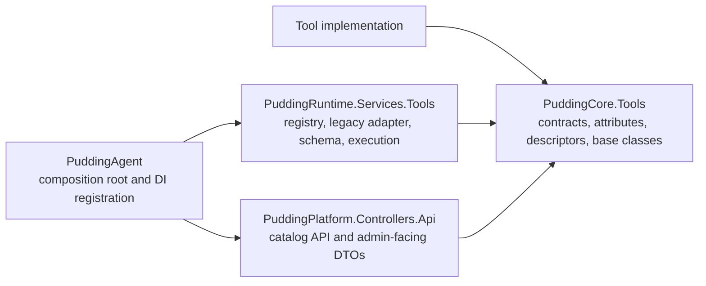

# Tool Infrastructure Layering

## Goal

Tool authors should only depend on the Tool SDK contracts, declare metadata, and implement execution logic. Discovery, catalog exposure, permission filtering, schema generation, runtime execution, and admin/template UI discovery are owned by platform services.

## Layer Boundaries



## Responsibilities

### PuddingCore.Tools

- Owns stable contracts and author-facing SDK:
  - `ToolAttribute`
  - `ToolParamAttribute`
  - `ToolDescriptor`
  - `IPuddingTool`
  - `PuddingToolBase<TArgs>`
  - `IPuddingToolRegistry`
  - `IPuddingToolCatalogService`
  - `IPuddingToolExecutionService`
- Must not depend on Runtime, Platform, EF, ASP.NET, admin UI, or concrete local index providers.

### PuddingRuntime.Services.Tools

- Owns concrete service implementations:
  - `PuddingToolRegistry`
  - `AgentSkillToolAdapter`
  - `PuddingToolCatalogService`
  - `PuddingToolSchemaService`
  - `PuddingToolExecutionService`
- Adapts legacy `IAgentSkill` into the new registry.
- Applies capability policy and sandbox checks before execution.
- Generates LLM tool schema from registry descriptors.

### PuddingPlatform

- Owns admin/API surfaces.
- Reads `IPuddingToolCatalogService` only.
- Must not scan assemblies, instantiate tools, or encode tool-specific schemas.
- Admin Tool management and Agent template UI should discover tools from `/api/tools`.

### PuddingAgent

- Owns composition only.
- Registers concrete tool implementations and calls `AddPuddingToolRegistry()`.
- Should not contain per-tool admin or LLM schema logic.

## Adding A Native Tool

1. Add a class implementing `IPuddingTool`, usually by deriving from `PuddingToolBase<TArgs>`.
2. Annotate the class with `[Tool(...)]`.
3. Annotate argument DTO properties with `[ToolParam(...)]`.
4. Register it in the composition root with `services.AddPuddingTool<TTool>()`, or make sure the owning assembly is scanned by `AddPuddingToolsFromAssembly(...)`.
5. Do not change admin pages, Agent template schema code, or context assembly code for basic discovery.

## Built-In File Search Tool

`file_search` is a native Pudding Tool, not an external MCP tool. Its implementation lives in `Source/PuddingRuntime/Tools/BuiltIns/Files/FileSearchTool.cs`:

- `FileSearchTool` is annotated with `[Tool(id: "file_search", ...)]`.
- `FileSearchArgs` exposes `Action`, `Provider`, `Pattern`, `Directory`, `Recursive`, and `MaxResults`.
- `Action=list` lists available file search providers and their availability.
- `Action=search` defaults `Provider` to `auto`; supported explicit providers are `Everything` and `BuiltInRecursiveFileSearch`.
- `auto` prefers Everything and falls back to `BuiltInRecursiveFileSearch`.
- An explicit Everything request also falls back when the provider is unavailable or its query fails. Set `RequireProvider=true` only when the selected implementation itself is part of the caller's requirement.
- `Directory` must resolve to an existing directory. Everything requires an absolute directory; the built-in provider accepts paths relative to the execution snapshot's `WorkingDirectory`.
- The tool searches file names and paths under the requested directory. It does not search file contents.
- Every successful search result is normalized by `FileSearchTool` to an absolute path, regardless of provider, fallback, or whether the provider returned a relative path. Provider changes must not change the path contract observed by an Agent.
- The built-in provider may accept a relative `Directory`, but the tool resolves it against the execution snapshot's `WorkingDirectory` before searching and still returns absolute result paths.
- Searches outside the current workspace are allowed, but the result includes a warning that the agent must ask for explicit user approval before reading, modifying, deleting, executing, or patching out-of-workspace results.

Runtime registration flow:

1. `PuddingAgent/Program.cs` calls `AddPuddingToolsFromAssembly(typeof(PuddingRuntime.RuntimeServiceExtensions).Assembly)`.
2. `AddPuddingToolsFromAssembly(...)` scans for non-abstract `IPuddingTool` types annotated with `ToolAttribute`.
3. `AddPuddingToolRegistry()` builds `IPuddingToolRegistry` from native `IPuddingTool` instances and legacy `IAgentSkill` adapters.
4. `PuddingToolRegistry.GetTool("file_search")` resolves the executable tool by id.

Agent exposure still depends on template/capability policy. Current built-in templates and default permissions include `file_search`; platform seeding also includes the corresponding file search capability.

Related search capability:

- `search_grep` is a legacy `IAgentSkill` adapted into the same registry by `AgentSkillToolAdapter`.
- `search_grep` searches file contents by text or regex through ripgrep first, with a managed C# fallback when ripgrep is unavailable; `file_search` discovers files by name/path.

## Local Index Provider Pattern

File retrieval tools should split provider integration from tool execution:

- Provider abstraction: `ILocalFileIndexProvider`
- Provider implementations: Everything SDK, future Windows Search, ripgrep index, custom SQLite index
- Tool: depends on `ILocalFileIndexProvider`, exposes stable search arguments and output

This keeps Everything-specific concerns out of Tool registry, admin, and context assembly.

## Execution Filesystem Root

`WorkspaceId` is a business identity and must never be converted into a filesystem path by Tool or SubAgent components.

The effective root is frozen in `RuntimeDispatchRequest.WorkingDirectory` and propagated through:

```text
RuntimeDispatchRequest
  -> ToolInvocationRequest
  -> ToolExecutionContext
  -> HostFileToolPaths
```

Smart workflow tools only promote `scope` to `WorkingDirectory` when it resolves to an existing file or directory. Semantic scope text remains prompt-only. Relative file operations are resolved under this root, and directory/write operations cannot escape it unless the existing explicit YOLO boundary allows the operation.
