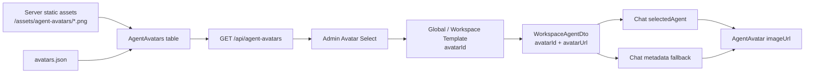

# Agent 头像服务端管理设计方案

> 日期：2026-05-23  
> 页面：`/admin/global-agent-template`、`/admin/chat`  
> ADR：[35ADR-034Agent头像服务端管理与模板绑定ADR](../07架构/35ADR-034Agent头像服务端管理与模板绑定ADR.md)

---

## 1. 目标

本方案用于指导 Dev 将 Agent 头像从前端静态资源改为服务端管理，并打通模板配置到聊天界面的头像展示链路。

必须满足三条需求：

1. `Source/PuddingPlatformAdmin/src/assets/avatars` 中原有图片和 `avatars.json` 移动到服务端，前端不再直接依赖这些资源。
2. Agent 模板配置中提供头像下拉菜单，用户从系统预置头像中选择；用户未配置时，默认使用服务端返回的第一个启用头像。
3. Chat 界面展示的 Agent 图片头像来自 Agent 模板配置的头像。

---

## 2. 当前状态

### 2.1 已有头像资源

当前生成的头像资源位于：

```text
Source/PuddingPlatformAdmin/src/assets/avatars/
├── agent-avatar-amber.png
├── agent-avatar-angry.png
├── agent-avatar-mint.png
├── agent-avatar-neutral.png
├── agent-avatar-silver.png
├── agent-avatar-sleepy.png
├── agent-avatar-smile.png
├── agent-avatar-thinking.png
└── avatars.json
```

这些文件应该从前端资产目录迁移到服务端资产目录。

### 2.2 后端现状

相关文件：

```text
Source/PuddingPlatform/Data/Entities/GlobalAgentTemplateEntity.cs
Source/PuddingPlatform/Data/Entities/WorkspaceAgentTemplateEntity.cs
Source/PuddingPlatform/Data/Entities/WorkspaceAgentEntity.cs
Source/PuddingPlatform/Data/Dtos/PlatformDtos.cs
Source/PuddingPlatform/Controllers/Api/GlobalAgentTemplateApiController.cs
Source/PuddingPlatform/Controllers/Api/WorkspaceAgentTemplateApiController.cs
Source/PuddingPlatform/Controllers/Api/WorkspaceAgentApiController.cs
Source/PuddingPlatform/Data/PlatformDbContext.cs
Source/PuddingAgent/Program.cs
```

现状：

- `GlobalAgentTemplateEntity` 只有 `AvatarEmoji`。
- `WorkspaceAgentTemplateEntity` 只有 `AvatarEmoji`。
- `WorkspaceAgentEntity` 有 `AvatarUrl`，但没有 `AvatarId`。
- `GlobalAgentTemplateDto` / `UpsertGlobalAgentTemplateRequest` 只有 `AvatarEmoji`。
- `WorkspaceAgentDto` 后端返回 `AvatarUrl`，前端类型中还声明了 `avatarEmoji`，存在契约不一致。
- `Program.cs` 已启用 `app.MapStaticAssets()` 和 `app.UseStaticFiles()`。

### 2.3 前端现状

相关文件：

```text
Source/PuddingPlatformAdmin/src/pages/global-agent-template/index.tsx
Source/PuddingPlatformAdmin/src/services/platform/api.ts
Source/PuddingPlatformAdmin/src/pages/chat/types.ts
Source/PuddingPlatformAdmin/src/pages/chat/hooks/useChatState.ts
Source/PuddingPlatformAdmin/src/pages/chat/components/AgentAvatar.tsx
Source/PuddingPlatformAdmin/src/pages/chat/components/ChatMain.tsx
Source/PuddingPlatformAdmin/src/pages/chat/components/AgentMessageBubble.tsx
```

现状：

- 全局 Agent 模板编辑抽屉使用 `ProFormText name="avatarEmoji"`。
- 模板卡片用 `item.avatarEmoji || '🤖'` 渲染。
- `AgentAvatar.tsx` 已支持 `imageUrl`。
- `ChatMessageBlock` 已有 `agentAvatarUrl` 字段，但 `buildMessageBlocks` 没有填充它。
- `ChatSource` 只有 `avatarEmoji` 和 `avatarColor`，没有 `avatarUrl`。
- `ChatMain.tsx` 顶部选中 Agent 已使用 `selectedAgent.avatarUrl`，但后端解析链路还不完整。

---

## 3. 目标架构



核心原则：

- 图片文件由服务端静态文件系统提供。
- 头像元数据由数据库提供。
- 模板只保存 `avatarId`。
- DTO 返回解析后的 `avatarUrl`。
- 前端只渲染 API 返回的 `avatarUrl`。

---

## 4. 服务端资源迁移

### 4.1 目标目录

首选目录：

```text
Source/PuddingPlatform/wwwroot/assets/agent-avatars/
```

迁移方式：

```text
Source/PuddingPlatformAdmin/src/assets/avatars/*.png
  -> Source/PuddingPlatform/wwwroot/assets/agent-avatars/*.png

Source/PuddingPlatformAdmin/src/assets/avatars/avatars.json
  -> Source/PuddingPlatform/wwwroot/assets/agent-avatars/avatars.json
```

验收 URL：

```text
http://localhost:5000/assets/agent-avatars/agent-avatar-neutral.png
```

如果当前 host 没有正确暴露 referenced project 的 static web assets，Dev 需要二选一：

1. 在 `Source/PuddingAgent/wwwroot/assets/agent-avatars/` 放置运行时副本；
2. 调整项目文件，确保 `Source/PuddingPlatform/wwwroot` 静态资源随 `Source/PuddingAgent` 输出和发布。

最终以浏览器能直接访问 `/assets/agent-avatars/*.png` 为准。

### 4.2 前端目录删除时机

不要在第一步直接删除前端资源。推荐顺序：

1. 复制资源到服务端；
2. 服务端 API 和前端下拉改造完成；
3. 搜索确认前端无 `src/assets/avatars` 引用；
4. 删除 `Source/PuddingPlatformAdmin/src/assets/avatars`。

---

## 5. 数据模型

### 5.1 新增实体

文件：

```text
Source/PuddingPlatform/Data/Entities/AgentAvatarEntity.cs
```

建议结构：

```csharp
using System.ComponentModel.DataAnnotations;

namespace PuddingPlatform.Data.Entities;

public class AgentAvatarEntity
{
    [Key]
    public int Id { get; set; }

    [Required, MaxLength(128)]
    public string AvatarId { get; set; } = string.Empty;

    [Required, MaxLength(128)]
    public string Name { get; set; } = string.Empty;

    [Required, MaxLength(256)]
    public string FileName { get; set; } = string.Empty;

    [Required, MaxLength(512)]
    public string UrlPath { get; set; } = string.Empty;

    [MaxLength(512)]
    public string? Personality { get; set; }

    [MaxLength(128)]
    public string? HairColor { get; set; }

    [MaxLength(128)]
    public string? Expression { get; set; }

    public string VisualTraitsJson { get; set; } = "[]";

    [MaxLength(512)]
    public string? RecommendedUse { get; set; }

    public bool IsBuiltIn { get; set; } = true;
    public bool IsEnabled { get; set; } = true;
    public int SortOrder { get; set; } = 100;

    public DateTimeOffset CreatedAt { get; set; } = DateTimeOffset.UtcNow;
    public DateTimeOffset UpdatedAt { get; set; } = DateTimeOffset.UtcNow;
}
```

### 5.2 扩展现有实体

文件：

```text
Source/PuddingPlatform/Data/Entities/GlobalAgentTemplateEntity.cs
Source/PuddingPlatform/Data/Entities/WorkspaceAgentTemplateEntity.cs
Source/PuddingPlatform/Data/Entities/WorkspaceAgentEntity.cs
```

新增字段：

```csharp
[MaxLength(128)]
public string? AvatarId { get; set; }
```

字段含义：

- `GlobalAgentTemplateEntity.AvatarId`：全局模板选择的系统头像。
- `WorkspaceAgentTemplateEntity.AvatarId`：Workspace 模板覆盖或选择的系统头像。
- `WorkspaceAgentEntity.AvatarId`：Agent 实例级覆盖，第一期可只作为可选字段，不在 UI 暴露。

保留字段：

- `AvatarEmoji`：历史 fallback。
- `WorkspaceAgentEntity.AvatarUrl`：历史外部图片 fallback。

### 5.3 DbContext 配置

文件：

```text
Source/PuddingPlatform/Data/PlatformDbContext.cs
```

新增：

```csharp
public DbSet<AgentAvatarEntity> AgentAvatars => Set<AgentAvatarEntity>();
```

`OnModelCreating` 中新增：

```csharp
modelBuilder.Entity<AgentAvatarEntity>(e =>
{
    e.ToTable("AgentAvatars", "platform");
    e.HasIndex(a => a.AvatarId).IsUnique();
    e.HasIndex(a => new { a.IsEnabled, a.SortOrder });
    e.Property(a => a.VisualTraitsJson).HasColumnType("TEXT");
});
```

---

## 6. JSON 种子

### 6.1 JSON 格式

服务端 `avatars.json` 应保持数组格式，字段对齐当前前端 JSON：

```json
[
  {
    "id": "neutral",
    "file": "agent-avatar-neutral.png",
    "name": "默认助手",
    "personality": "冷静、稳定、通用",
    "hairColor": "炭紫黑",
    "expression": "无表情",
    "visualTraits": ["像素二次元", "圆形头像", "柔和边缘光"],
    "recommendedUse": "默认助手、通用客服"
  }
]
```

### 6.2 种子服务

推荐新增服务：

```text
Source/PuddingPlatform/Services/AgentAvatarSeedService.cs
```

职责：

- 启动时读取 `wwwroot/assets/agent-avatars/avatars.json`；
- 对每个头像按 `AvatarId` 幂等 upsert；
- 生成 `UrlPath = "/assets/agent-avatars/" + file`；
- 设置 `SortOrder`，按 JSON 顺序从 10、20、30 递增；
- 检查 PNG 文件存在，不存在时记录 warning；
- 不覆盖管理员后续手工禁用的 `IsEnabled = false`，除非明确约定 built-in seed 强制恢复。

注册位置：

```text
Source/PuddingAgent/Program.cs
```

在已有 `JsonConfigSeedService.SeedAsync()` 附近执行：

```csharp
var avatarSeed = scope.ServiceProvider.GetRequiredService<AgentAvatarSeedService>();
await avatarSeed.SeedAsync();
```

### 6.3 默认头像解析

推荐新增查询服务：

```text
Source/PuddingPlatform/Services/AgentAvatarCatalog.cs
```

职责：

- `ListEnabledAsync()`
- `GetRequiredEnabledAsync(avatarId)`
- `GetDefaultAsync()`
- `ResolveUrlAsync(avatarId, legacyUrl, legacyEmoji)`

默认头像定义：

```text
AgentAvatars
  .Where(IsEnabled)
  .OrderBy(SortOrder)
  .ThenBy(Id)
  .FirstOrDefault()
```

---

## 7. API 设计

### 7.1 DTO

文件：

```text
Source/PuddingPlatform/Data/Dtos/PlatformDtos.cs
```

新增：

```csharp
public record AgentAvatarDto(
    string AvatarId,
    string Name,
    string Url,
    string? Personality,
    string? HairColor,
    string? Expression,
    List<string> VisualTraits,
    string? RecommendedUse,
    bool IsBuiltIn,
    bool IsEnabled,
    int SortOrder
);
```

扩展模板 DTO：

```csharp
string? AvatarId = null,
string? AvatarUrl = null,
string? AvatarName = null
```

扩展模板 Upsert Request：

```csharp
string? AvatarId = null
```

扩展 Workspace Agent DTO：

```csharp
string? AvatarId,
string? AvatarUrl
```

### 7.2 Controller

新增文件：

```text
Source/PuddingPlatform/Controllers/Api/AgentAvatarApiController.cs
```

接口：

```http
GET /api/agent-avatars?enabledOnly=true
GET /api/agent-avatars/{avatarId}
```

错误行为：

- `GET /api/agent-avatars/{avatarId}` 找不到返回 404。
- `enabledOnly=true` 时不返回禁用头像。

### 7.3 模板保存校验

文件：

```text
Source/PuddingPlatform/Controllers/Api/GlobalAgentTemplateApiController.cs
Source/PuddingPlatform/Controllers/Api/WorkspaceAgentTemplateApiController.cs
```

保存规则：

1. `req.AvatarId` 为 null 或空时，写入默认头像的 `AvatarId`。
2. `req.AvatarId` 非空时，必须存在且启用。
3. 校验失败返回：

```json
{
  "error": "AvatarId 'xxx' 不存在或已禁用"
}
```

DTO 映射规则：

1. 模板有 `AvatarId`：返回对应 `AvatarUrl`。
2. 模板无 `AvatarId`：返回默认头像 `AvatarUrl`。
3. 头像表为空：返回 `AvatarEmoji`，`AvatarUrl = null`。

---

## 8. Workspace Agent 头像解析

### 8.1 解析优先级

`WorkspaceAgentDto.AvatarUrl` 的解析优先级：

```text
WorkspaceAgent.AvatarId
-> WorkspaceAgent.SourceTemplateId 对应 WorkspaceAgentTemplate.AvatarId
-> WorkspaceAgent.SourceTemplateId 对应 GlobalAgentTemplate.AvatarId
-> WorkspaceAgent.AvatarUrl
-> 默认 AgentAvatar.UrlPath
-> null
```

说明：

- 第一阶段重点支持 `SourceTemplateId` 关联全局模板。
- 如果 Workspace 模板和全局模板 ID 可能重名，优先按 workspace 范围查 Workspace 模板，再查全局模板。
- `WorkspaceAgent.AvatarUrl` 只作为历史外部 URL fallback。

### 8.2 Controller 改造

文件：

```text
Source/PuddingPlatform/Controllers/Api/WorkspaceAgentApiController.cs
```

当前 `ToDto` 是 static 方法，无法访问 DB 解析模板头像。需要改为异步映射：

```text
List:
  查询 agents
  批量收集 SourceTemplateId / AvatarId
  查询相关模板和头像
  映射 avatarUrl

Get:
  查询 agent
  Resolve avatarUrl
```

避免 N+1：

- `List` 中不要对每个 Agent 单独查模板和头像；
- 先加载当前 workspace 的 `WorkspaceAgentTemplates`；
- 再加载 `GlobalAgentTemplates`；
- 再加载启用头像字典。

---

## 9. 前端 API 类型

文件：

```text
Source/PuddingPlatformAdmin/src/services/platform/api.ts
```

新增类型：

```ts
export interface AgentAvatarDto {
  avatarId: string;
  name: string;
  url: string;
  personality?: string;
  hairColor?: string;
  expression?: string;
  visualTraits: string[];
  recommendedUse?: string;
  isBuiltIn: boolean;
  isEnabled: boolean;
  sortOrder: number;
}
```

新增方法：

```ts
export async function listAgentAvatars(enabledOnly = true): Promise<AgentAvatarDto[]> {
  return request('/api/agent-avatars', {
    method: 'GET',
    params: { enabledOnly },
  });
}
```

扩展类型：

```ts
export interface GlobalAgentTemplateDto {
  avatarId?: string;
  avatarUrl?: string;
  avatarName?: string;
}

export interface UpsertGlobalAgentTemplateRequest {
  avatarId?: string;
}

export interface WorkspaceAgentTemplateDto {
  avatarId?: string;
  avatarUrl?: string;
  avatarName?: string;
}

export interface WorkspaceAgentDto {
  avatarId?: string;
  avatarUrl?: string;
}
```

保留 `avatarEmoji?: string`，但不要在新 UI 中作为主配置字段。

---

## 10. 全局模板页面改造

文件：

```text
Source/PuddingPlatformAdmin/src/pages/global-agent-template/index.tsx
```

### 10.1 状态

新增：

```ts
const [avatars, setAvatars] = useState<AgentAvatarDto[]>([]);
```

初始化：

```ts
listAgentAvatars(true).then(setAvatars).catch(() => {});
```

### 10.2 创建默认值

`openCreate` 中设置：

```ts
avatarId: avatars[0]?.avatarId,
```

如果头像列表异步未加载完成：

- `ProFormSelect` 使用 `loading`；
- `handleSave` 前如果 `values.avatarId` 为空且 `avatars[0]` 存在，则补 `values.avatarId = avatars[0].avatarId`；
- 服务端仍兜底默认头像。

### 10.3 替换 Emoji 输入

删除：

```tsx
<ProFormText
  name="avatarEmoji"
  label="头像 Emoji"
  placeholder="如 🤖"
  fieldProps={{ maxLength: 8 }}
/>
```

新增：

```tsx
<ProFormSelect
  name="avatarId"
  label="头像"
  rules={[{ required: true, message: '请选择头像' }]}
  options={avatars.map((a) => ({
    label: a.name,
    value: a.avatarId,
  }))}
  fieldProps={{
    optionRender: (option) => {
      const avatar = avatars.find((a) => a.avatarId === option.value);
      if (!avatar) return option.label;
      return (
        <Space>
          <Avatar size={24} src={avatar.url} />
          <span>{avatar.name}</span>
          <Text type="secondary" style={{ fontSize: 12 }}>
            {avatar.recommendedUse}
          </Text>
        </Space>
      );
    },
  }}
/>
```

如果当前 Ant Design 版本不支持 `optionRender`，改用普通 `Select` 包在 `Form.Item name="avatarId"` 中。

### 10.4 卡片和表格头像展示

卡片标题处替换：

```tsx
<Text style={{ fontSize: 18 }}>{item.avatarEmoji || '🤖'}</Text>
```

为：

```tsx
<Avatar size={28} src={item.avatarUrl || undefined}>
  {item.avatarEmoji || '🤖'}
</Avatar>
```

表格可新增头像列，或在名称列前显示小头像。

---

## 11. Chat 页面改造

### 11.1 类型

文件：

```text
Source/PuddingPlatformAdmin/src/pages/chat/types.ts
```

扩展 `ChatSource`：

```ts
export interface ChatSource {
  sourceId: string;
  sourceType: 'agent' | 'websocket' | 'webhook' | 'email' | 'mqtt';
  displayName: string;
  avatarEmoji: string;
  avatarColor: string;
  avatarUrl?: string;
}
```

`buildMessageBlocks` 中写入：

```ts
agentAvatarUrl: turn.source?.avatarUrl,
```

### 11.2 metadata 映射

文件：

```text
Source/PuddingPlatformAdmin/src/pages/chat/hooks/useChatState.ts
```

metadata source 中增加头像 URL 映射，但空字符串不要覆盖已有值：

```ts
const avatarUrl = anyMeta.avatar_url || anyMeta.avatarUrl;
```

然后仅在存在时设置：

```ts
...(avatarUrl ? { avatarUrl: String(avatarUrl) } : {}),
```

### 11.3 selectedAgent fallback

如果 `turn.source?.avatarUrl` 不存在，消息气泡应使用当前选中 Agent 的 `avatarUrl`。

可选实现方式：

1. 在 `buildMessageBlocks(turns, agentName, selectedAgent)` 中增加第三个参数；
2. 或在 `MessageList` / `MessageGroup` 渲染 `AgentMessageBubble` 时用 `block.agentAvatarUrl || selectedAgent?.avatarUrl`。

推荐第 2 种，改动更小。

### 11.4 顶部选中 Agent

`ChatMain.tsx` 已使用：

```tsx
<Avatar size={26} src={selectedAgent.avatarUrl || undefined}>
```

需要确保 `listWorkspaceAgents` 后端返回的 `avatarUrl` 已按模板解析。前端这里不应自己查模板。

---

## 12. 后端 metadata 补齐

如果 Chat SSE / metadata 当前只返回 `source_id`、`source_name`、`source_type`，后端应补：

```json
{
  "source_id": "default.general-assistant-001",
  "source_name": "布丁",
  "source_type": "agent",
  "avatar_id": "neutral",
  "avatar_url": "/assets/agent-avatars/agent-avatar-neutral.png"
}
```

短期可不阻塞，因为前端可以用 `selectedAgent.avatarUrl` fallback。长期应由后端 metadata 带齐，便于多来源、多 Agent、子代理消息正确显示各自头像。

---

## 13. 施工任务拆分

### Phase 1：服务端资源落位

1. 创建 `Source/PuddingPlatform/wwwroot/assets/agent-avatars/`。
2. 移动 8 张 PNG 和 `avatars.json`。
3. 启动后验证 `/assets/agent-avatars/agent-avatar-neutral.png` 返回 200。
4. 如果 404，补 host 静态资源配置或运行时副本。

验收：

- 浏览器可直接打开头像 PNG。
- 前端资源目录暂时保留，等待最后清理。

### Phase 2：数据库和种子

1. 新增 `AgentAvatarEntity`。
2. `PlatformDbContext` 增加 `DbSet` 和索引配置。
3. 新增 `AvatarId` 到模板和 WorkspaceAgent 实体。
4. 新增 migration，包含 `AgentAvatars` 表和三个 `AvatarId` 列。
5. 新增 `AgentAvatarSeedService`，从服务端 `avatars.json` 幂等 upsert。
6. 在 `Program.cs` 注册并启动执行种子。

验收：

- 启动后 `AgentAvatars` 有 8 条启用数据。
- 默认头像是 `SortOrder` 最小的一条。

### Phase 3：头像 API

1. 新增 `AgentAvatarDto`。
2. 新增 `AgentAvatarApiController`。
3. 实现 `GET /api/agent-avatars?enabledOnly=true`。
4. 实现 `GET /api/agent-avatars/{avatarId}`。
5. 为 JSON 数组字段补安全反序列化，异常时返回空数组。

验收：

- API 返回 8 个头像。
- 每个头像 URL 可访问。
- 禁用头像在 `enabledOnly=true` 时不返回。

### Phase 4：模板 API 扩展

1. `GlobalAgentTemplateDto` / `UpsertGlobalAgentTemplateRequest` 增加 `AvatarId`、`AvatarUrl`、`AvatarName`。
2. `WorkspaceAgentTemplateDto` / Request 同步增加。
3. Create / Update 时校验 `AvatarId`。
4. 未传 `AvatarId` 时服务端写入默认头像 ID。
5. MapToDto 时解析 `AvatarUrl`。

验收：

- 新建模板不传 `avatarId` 也能保存默认头像。
- 传不存在 `avatarId` 返回 400。
- 列表 DTO 包含 `avatarUrl`。

### Phase 5：WorkspaceAgent 解析

1. `WorkspaceAgentDto` 增加 `AvatarId`。
2. `WorkspaceAgentApiController` 的 `ToDto` 改为可解析模板头像的映射。
3. `List` 使用批量查询，避免 N+1。
4. `Get` 解析单个 Agent 的头像。

验收：

- Agent 只有 `SourceTemplateId` 时，返回模板头像 `avatarUrl`。
- Agent 自身有 `AvatarId` 时优先自身头像。
- 旧 `AvatarUrl` 仍可 fallback。

### Phase 6：前端模板下拉

1. `api.ts` 增加 `AgentAvatarDto` 和 `listAgentAvatars`。
2. 全局模板页面加载头像列表。
3. 替换 `avatarEmoji` 输入为头像下拉。
4. 创建时默认选择第一项。
5. 卡片 / 表格展示 `avatarUrl`。

验收：

- `/admin/global-agent-template` 抽屉里看到头像下拉。
- 用户不手动选择也会保存默认头像。
- 模板卡片显示图片头像。

### Phase 7：Chat 链路

1. `ChatSource` 增加 `avatarUrl`。
2. metadata 映射读取 `avatar_url` / `avatarUrl`。
3. `buildMessageBlocks` 或渲染层传递 `agentAvatarUrl`。
4. `AgentMessageBubble` 使用 `block.agentAvatarUrl || selectedAgent?.avatarUrl`。
5. 确认 `ChatMain` 顶部选中 Agent 的 `Avatar` 使用后端返回 `avatarUrl`。

验收：

- 选择某个模板头像后，聊天顶部 Agent 头像更新。
- 新消息气泡使用同一图片头像。
- metadata 缺头像 URL 时仍能显示 selectedAgent 的头像。

### Phase 8：清理

1. 搜索 `src/assets/avatars`，确认无引用。
2. 删除 `Source/PuddingPlatformAdmin/src/assets/avatars`。
3. 删除或隐藏 `avatarEmoji` 主配置入口。
4. 保留后端字段作为兼容 fallback。

验收：

- 前端构建不依赖本地头像资源。
- 头像全链路来自服务端 API。

---

## 14. 测试计划

### 14.1 后端

建议测试：

- `AgentAvatarSeedService`：
  - JSON 存在时写入 8 条头像；
  - 重复执行不会新增重复数据；
  - 图片缺失时记录 warning，不阻塞启动。
- `AgentAvatarApiController`：
  - list enabled only；
  - get existing；
  - get missing returns 404。
- 模板 Controller：
  - create without avatarId uses default；
  - create with invalid avatarId returns 400；
  - update disabled avatarId returns 400；
  - DTO includes avatarUrl。
- `WorkspaceAgentApiController`：
  - source template avatar resolves to agent DTO；
  - agent avatar override wins；
  - legacy avatarUrl fallback works。

运行建议：

```powershell
dotnet test PuddingAgentNetwork.slnx
```

如果全量测试耗时过长，至少运行 `PuddingPlatform` / API 相关测试项目。

### 14.2 前端

建议测试：

- `listAgentAvatars` API 调用返回类型正确。
- 全局模板编辑：
  - 头像下拉有 8 项；
  - 默认选中第一项；
  - 保存 payload 包含 `avatarId`。
- Chat：
  - `ChatSource.avatarUrl` 映射到 `ChatMessageBlock.agentAvatarUrl`；
  - selectedAgent fallback 生效。

运行建议：

```powershell
cd Source\PuddingPlatformAdmin
npm run build
```

如果项目使用 pnpm 脚本，以 `package.json` 中实际脚本为准。

### 14.3 手动验收

1. 打开 `http://localhost:5000/assets/agent-avatars/agent-avatar-neutral.png`，确认返回图片。
2. 打开 `/admin/global-agent-template`。
3. 新建模板，不主动选择头像，保存。
4. 刷新列表，确认模板卡片显示默认图片头像。
5. 编辑模板，切换到另一个头像，保存。
6. 打开 `/admin/chat`，选择该 Agent。
7. 顶部 Agent 头像和新消息气泡头像应显示模板配置的图片。

---

## 15. 回滚方案

如果服务端头像 API 或静态资源出现问题：

1. 保留 `AvatarEmoji` fallback，聊天页继续显示 `🤖` 或历史 Emoji。
2. 前端模板页面可以临时隐藏头像下拉，不影响模板核心字段保存。
3. 不删除 `WorkspaceAgent.AvatarUrl`，旧外链头像仍可显示。
4. 数据库新增字段可保留，不影响旧逻辑。

---

## 16. 非目标

本轮不做：

- 用户上传自定义头像；
- 头像裁剪、压缩或编辑器；
- 多租户头像私有库；
- CDN 签名 URL；
- 删除 `AvatarEmoji` 字段；
- 让前端继续维护头像 JSON 副本。

---

## 17. 完成定义

本任务完成时，应满足：

- 头像图片和 JSON 已在服务端静态目录。
- 服务端 `AgentAvatars` 表和 `/api/agent-avatars` API 可用。
- 全局模板配置使用头像下拉，默认第一项。
- 模板 DTO 返回 `avatarId`、`avatarUrl`。
- WorkspaceAgent DTO 能从模板解析头像 URL。
- Chat 顶部和消息气泡显示模板配置的头像。
- 前端不再依赖 `Source/PuddingPlatformAdmin/src/assets/avatars`。
