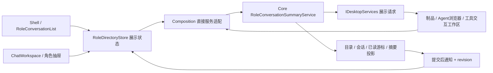

# Desktop 聊天式角色列表与启动体验：审计及设计方案

日期：2026-09-28。状态：**Proposed，设计交付，未实施**。审计时 HEAD `b78e632`，工作树另有设置、Host 索引等并行修改。用户要求审计启动速度、直接函数调用及聊天软件式头像列表；本轮不修改产品代码、不重启现有产品、不迁移或修改运行数据。

## 1. 结论

1. **聊天已经直接调用 Core**，不应再次建设“从 HTTP 改为函数”的迁移。需要优化的是重复读取、列表摘要投影、通知范围、启动依赖和 UI 更新成本。
2. **把左侧从角色简介目录改成聊天列表**：头像、名字、时间、最近消息、独立未读/待决定标记。角色仍是一等公民，每行指向该角色的主会话；不改成无角色归属的普通线程列表。
3. **右侧是制品与 Agent 交互工作区**（用户后续澄清，覆盖初稿的角色管理栏解释），承载制品预览、Agent 浏览器、代码/Diff、终端及工具交互。角色资料/配置使用页头菜单或独立设置，不占用右侧主工作区。
4. 启动先测量再优化。先快速显示外壳和可交互导航，再按真实能力开放会话读取/执行；不能用虚假的“Core 已就绪”掩盖数据库或执行恢复尚未完成。

配套：[静态视觉草案](../Design/Desktop-Chat-List-Concept-2026-09-28.html)。草案使用虚构消息、时间和数量，只说明层级与布局，不代表读取了真实会话或实现了新功能。

2026-09-29 补充：[Web → Native Chat 功能迁移与控件设计](Desktop-Native-Chat-Web-Parity-Plan-2026-09-29.md) 将本方案扩展为完整 Chat 功能迁移，覆盖定制消息/工具卡、上下文环、类型化函数与内部事件、制品/浏览器交互及分阶段验收。本文保留列表、布局与启动审计证据；后续 Chat 工作包按新文档执行。

## 2. 当前实现审计

### 2.1 调用路径与数据问题

| 发现 | 当前源码证据 | 判断 |
|---|---|---|
| Desktop 内嵌 Core | `DesktopKernelFactory.StartAsync`：CreateBuilder → Build → InitializeAsync → app.StartAsync → Session；Foundation 用 Task.Run 启动 | 已是进程内 DLL，不是 Core 子进程 |
| 聊天直调 | `InProcessChatClient.ExecuteAsync`：后台任务、异步 DI scope；GetWorkspaces/Agents/Statuses/Send/Cancel 直接访问应用服务 | 没有聊天 HTTP/JWT；Task.Run 不是 RPC，保留 UI 线程隔离及停止时 drain |
| 尚有 Web 宿主耦合 | ForDesktop 绑定 `127.0.0.1:0`；OpenWorkbenchAsync 仍要求 WorkbenchAddress，提供“高级管理（Web）”；kernel smoke 访问 health/ready | 不能称整个产品已无 HTTP。原生聊天挂载应依赖应用能力而不是管理页地址；不能未经端点盘点就删除 Kestrel |
| 角色数据双份加载 | Shell `LoadRoleSidebarAsync` 与 ChatWorkspace `LoadWorkspacesAsync/RefreshRolesAsync` 各自读工作区/角色/状态 | `SetNavigationWidth(0)` 只隐藏导航，未消除数据所有权重复 |
| 串行与整批重建 | Shell 遍历工作区，逐个等待 GetAgents/GetStatuses；RenderRoleSidebar 清空 Items 和全部卡片 | 角色增多会放大首屏工作量并丢失视图连续性，应用差量更新 |
| 头像状态不同步风险 | Shell 只在挂载/手动刷新读取；ChatWorkspace 的 15 秒刷新更新其私有 `_cards` | 隐藏列表更新不等于外壳列表更新；需要共享目录状态与通知 |
| 未读不是实际计数 | `AgentRunProjectionService.GetWorkspaceAgentStatusesAsync` 构造 AgentStatusProjection 时 UnreadCount 固定 0；Summary 为会话标题/角色名 | 不能把 Summary 当最近消息、把 0 当真实未读；需要明确已读游标和摘要来源 |
| 查询仍有成本 | 状态投影读取工作区会话与角色，每个会话做 1～2 次事件头索引查询；适配层先读角色、状态服务又读角色 | 已避免全历史窗口查询；不能盲改成更昂贵 GroupBy。应复用目录读取、缓存/提交更新摘要，并以查询计划证明改进 |

### 2.2 视觉与交互问题

- Shell 左栏默认 248 DIP；角色列表置于 StackPanel，`MaxHeight=480`，下方留白与截图一致。改为剩余高度 `*` 内的虚拟列表。
- `RoleAvatarCard` 已有 42 DIP 本地图头像，但标题换行、职责最多两行、状态再一行，更像目录卡。状态直接显示 `idle/running + Summary`，信息重复。
- 当前 Shell 没有聊天式搜索、时间、消息预览、独立未读 badge；跨工作区的同名角色也缺乏显式区分。内置隐藏导航不能替代 Shell 入口。
- `RoleNavigation.CanSelect` 禁止选择冻结/停用角色，连历史也难以进入。建议区分“可查看”与“可发送”，冻结/停用仍可读历史，执行限制继续由 Core 保证。
- 中间正文和 Composer 都限宽 900 DIP，适合阅读，但当前默认右栏 520 DIP 占位且为空，加重中央留白感。应先收起空面板，保留可读宽度，而非简单把文字铺满屏幕。
- Composer 是 88～200 DIP 编辑框 + 12 DIP 多段间距 + 常驻快捷键文字 + 六个文本按钮。底部显得像工具表单，主发送动作不突出。
- 当前已经设置 Mica、MicaAlt、DesktopAcrylicBackdrop，且浅色 Shell 有透明资源；“看起来平”不能归因于没设置材质。应减少重复白卡、明确视觉层级，验证窗口激活/系统透明效果回退。

### 2.3 启动：已知事实与未知项

源码阻塞链：

```text
Shell 创建 → 后台 StartAsync
  → DataRoot 租约 → CreateBuilder/DI → Build
  → Platform schema/执行相关初始化
  → Memory DB → Workspace Catalog → jieba 回填
  → app.StartAsync/HostedServices → Kernel Ready
  → ChatWorkspace 初始化 + Shell 角色目录读取 → 首个会话可读
```

`PuddingApplicationInitializer` 当前顺序等待上述数据库/目录/回填步骤；启动过程只给 UI 一个笼统 Starting 状态。外壳对 StartAsync 设三分钟取消期限，不能代替阶段诊断。

本次只读观察：Desktop PID 44120，进程启动时间 23:20:13；`D:/data/logs/system/pudding-20260928_005.log` 在 23:21:19 出现 Runtime 初始化日志，SessionChunkBackfill 从 23:21:24.891 到 23:24:32.684；同期 recovery_scan 有一次 durationMs=35440。**这些不是可归因的完整启动计时**：日志未给本 PID 的完整阶段跨度/首屏时间，不能断言“启动用了 66 秒”或“回填阻塞 3 分钟”。源码中 SessionChunkBackfill 已是 BackgroundService 且先 Task.Yield，它可能争用资源，不能仅因持续输出就判为阻塞 Ready。

代码地图还记录了 Desktop 打包缺 appsettings.json 引起启动配置校验失败的既有修复。本次截图已能读取角色，不将历史失败原因直接套用为当前慢启动根因；仍应核验运行包版本和配置来源。

## 3. 目标布局与交互

```text
┌ 标题栏：Pudding / 项目                           搜索 / 工作区 / 窗口 ┐
│ 聊天角色  288 DIP │ 头像  当前角色              模型 · 当前任务          │
│ [搜索角色/消息]  │────────────────────────────────────────────────────│
│ [当前工作区 ▾] + │ 原生正文 / 可折叠思考 / 工具调用 / 子代理 / 交付物   │
│ 置顶             │                                                    │
│ ◉  默认助手 23:18│                         右侧制品 / 交互工作区      │
│    已完成配置检查│                         [Agent浏览器|文件|终端]   │
│ ◉  审批审计员  ②│                                                    │
│    需要你确认操作│                                                    │
│ 最近             │ [附件 chips]                                       │
│ ◉  dsh     昨天  │ [给当前角色发消息…                             ]   │
│    上次回复预览  │ [＋ 添加上下文]        [模型 ▾] [语音] [发送 ↑]     │
│ 设置 / 运行中心  │ 快捷键提示在需要时显示                              │
└──────────────────┴────────────────────────────────────────────────────┘
```

### 3.1 RoleConversationRow（替代目录式展示）

| 区域 | 建议规范 |
|---|---|
| 列宽/行高 | 默认 288 DIP，可调整 260～360；常规行 76 DIP，文本缩放时允许自然增高 |
| 头像 | 44×44，圆形；优先已有本地图像，失败用稳定首字/主题色。仅运行中显示小状态点，不把“待命”冒充在线 |
| 第一行 | 名称 14/半粗，单行省略；右侧时间 11/次要色，不挤掉名称 |
| 第二行 | 最近可见消息摘要 12/次要色，单行省略；职责说明只在没有会话时回退或在详情/Tooltip 展示 |
| 辅助标记 | 未读 1～99/99+，待决定用琥珀标记且有文字/无障碍名称；草稿用“草稿”前缀；冻结/停用显示小标签 |
| 交互 | Hover 轻微提亮，选中浅 accent 填充 + 2 DIP 指示线；不给每行套厚边框/阴影。键盘焦点使用独立系统焦点框 |
| 更新 | 不按 token 修改预览/重排。正文完成或稳定批次才更新摘要；用户滚动/键盘导航时延后排序，避免点击目标跳动 |

展示优先级：本角色未发送草稿 → 需要决定/异常提示 → 最近可见消息 → 职责回退。执行状态与消息预览是两个字段，不拿 running 覆盖完整消息。缺时间/未读数据时隐藏对应元素，不造“刚刚”或 0 未读。

默认范围为当前工作区，可切“全部工作区”；全局视图的行显示工作区标签。身份始终 `(WorkspaceId, AgentId)`，不按名字去重。搜索首版只查角色/工作区/职责；真正消息搜索是单独 Core 查询，未实现前占位文案只写“搜索角色”，不能误导。

排序：用户置顶顺序 → 最近主会话消息时间倒序 → 稳定 RoleKey。仅工具流式活动不触发高频移位；当前选中角色与阅读位置保留。排序偏好/置顶为 Desktop 展示配置，消息时间、执行状态与未读事实归 Core。

行右键：置顶/取消置顶、标记已读、查看角色资料、角色设置。只有实际端口已提供的操作才出现；不增加会清空主会话的含糊“新聊天”按钮。“＋”明确为添加/创建角色；新任务继续当前角色主会话还是另建会话需另有明确入口和语义。

### 3.2 中间会话与 Composer

- 页头 56～64 DIP：小头像、角色名、简洁状态/当前项目；职责进入头像资料弹层或独立角色设置。若左栏可见，隐藏重复的“角色”菜单按钮；紧凑模式复用同一列表数据呈现抽屉。
- 回复保持 820～960 DIP 最大阅读宽度，宽表格/代码允许块内水平滚动。保留已有流式思考、工具与失败明细，不改成只显示最终答案。
- Composer 初始约 112～136 DIP，两区结构：自适应编辑框（2～6 行）与单行操作栏；多行内容内部滚动，上方附件 chips 区限高。
- 左边只保留“＋ 添加上下文”，菜单分图片/文本文件/从剪贴板；右边保留可用模型入口、语音、主发送动作。模型/权限选择如果没有真实 Core 更新端口，显示只读状态或打开已有设置，不做假下拉。
- 无执行时隐藏停止按钮；执行中停止可见，发送保持现有排队/受理语义，不擅自改变为禁止补充输入。快捷键提示退到 Tooltip/辅助说明，IME、附件失败/重试反馈沿用已有机制。

### 3.3 右侧 ArtifactInteractionWorkspace

定位为“看到 Agent 在做什么，并查看、使用其产出”。宽屏默认建议 480～560 DIP、可拖动调整或展开；不采用适合属性栏的 320 DIP 固定窄宽。无活动制品/浏览器时提供轻量入口，可收起；有交互时不以固定默认折叠隐藏结果，保留用户的面板偏好。

| 内容 | 交互与边界 |
|---|---|
| 制品 | 文件/报告/图片/网页等成果列表，点击打开预览标签；显示生成角色、版本及来源消息，提供实际已支持的打开/导出操作 |
| Agent 浏览器 | 原生标签栏/地址与导航控件 + 隔离的 WebView2 网页内容，展示 Agent 所用浏览器会话及页面变化；聊天本身仍为原生 WinUI |
| 代码 / Diff | 按文档类型预览，关联当前任务的文件与变更；只读预览、编辑、应用变更各有明确状态及服务端能力校验 |
| 终端 / 工具交互 | 查看真实输出/进度，接入获准的输入或确认；回放与可交互实时会话明确区分，不能将展示控件直接当执行器 |

布局：面板标题与收起/展开 → 文档标签栏 → 当前标签专用工具栏 → 内容 → 来源/状态。制品目录可作为可收放的概览区域，不重复占一整条永久侧栏。角色配置继续在原生设置中处理。

消息卡与右区双向关联：工具卡“查看浏览器”、文件卡“打开制品”将右区定位到对应标签；右区“回到来源”定位原消息/调用。工具生成制品可先登记标签/徽标，不抢走用户正在输入或查看的标签焦点；需要主动切换时提供明确提示。文档按稳定 documentId 去重。

每个标签绑定 workspace/agent/session/run/invocation（适用时）与 artifactId/browserContextId/terminalId，不能按文件标题或 URL 判断归属。角色切换默认展示该角色的标签组，后台运行仍归 Core；跨角色固定标签必须显示来源。晚到事件以宿主/选择代次和文档身份校验，关闭预览不等于停止 Agent 或结束终端。

用户手动浏览与 Agent 自动操作共用浏览器上下文时，需显式控制权状态（Agent 操作中/用户接管/只读回放）与 Core 仲裁；不由 UI 直接注入脚本绕过 Browser 工具权限。Core → IDesktopServices 发出强类型展示请求，Desktop 响应展示；用户交互 → Composition → Core 应用服务，不通过新 HTTP API，外部网页自身网络访问不受此限制。

响应规则（全部用 DIP）：中间至少 480；不足时右工作区切换为 Overlay/独立聚焦视图，保留“聊天/工作区”返回入口，不销毁仍在运行的浏览器/工具会话。无右区内容时优先保证左侧聊天入口；窗口小于 600 时单工作面展示。不改变用户已保存的宽屏偏好。

## 4. 数据与组件方案：继续进程内直调



拟新增合同（命名为方案，不是假称已有）：

```csharp
record RoleConversationSummary(
    RoleKey Role, string? SessionId, string Name, string? Avatar,
    string? LastMessagePreview, DateTimeOffset? LastMessageAt,
    int? UnreadCount, string RunState, int? PendingDecisionCount,
    bool CanRead, bool CanSend, long Revision);
// PuddingChat 中独立 IRoleDirectoryClient：
// ReadDirectoryAsync(scope, cursor, limit, ct) -> 有界快照/分页 + revision
// WaitForDirectoryChangeAsync(scope, revision, ct) -> 失效通知
// MarkReadAsync(role, sessionId, observedMessageSequence, ct) -> 权威回执
```

- 目录由 Shell 拥有一个窗口级 Store，内部导航抽屉复用同一数据；ChatWorkspace 只订阅选择和会话，不再为了隐藏列表轮询。组件单独运行时可注入本地 Store，不反向依赖 Shell。
- Core 摘要是可重建 read model：按主会话可见消息生成纯文本、有界 120 字预览；去掉消息 envelope/Markdown 标记，不读取每个角色的完整历史。没有消息时使用职责回退。
- 未读须定义为“当前本机用户尚未读到的、可呈现的 Agent 消息”，不能按每个 token/tool 事件计数。已读标记以实际展示到的 message sequence 为上限，服务端取 max 防止倒退；后台角色不自动清零。
- 初始目录快照后接提交通知；使用 revision 做去重、补读与重新同步，范围覆盖所有当前可见工作区，不能只订阅选中会话。通知只表示失效，Core 仍是真源。
- 行数据绑定 + Keyed Diff，模板在进入视口时创建控件；不要预先为所有角色 new UserControl 后塞进 Items。头像解码按显示尺寸缓存，不携带令牌 URL。
- 合并 100～250 ms 内同一角色的变更，生命周期/待决定立即刷新。必要的低频恢复校验与前台恢复时重读可以保留，不追求“无轮询”口号而牺牲通知丢失后的恢复。
- 每次调用保留独立 DI scope/取消/宿主生命周期跟踪；不并发复用 EF DbContext。批量服务不等于无界 Task.WhenAll，不引入直接读 JSON/SQLite 的 View 捷径。

## 5. 启动性能方案

### 5.1 先补证据

增加贯穿 Desktop 与 Host 的 startupAttemptId、PID、构建版本、数据规模摘要和分阶段 duration：Shell 首帧、租约、Builder、Build/DI、每个 schema group、Memory、Catalog、jieba、HostedServices、Directory first paint、首个会话可读、首次可发送。使用 Stopwatch/结构化阶段事件，不记录密钥或会话正文。

区分四个里程碑：`ShellVisible`、`DirectoryReadable`、`ConversationReadable`、`ExecutionReady`。仅阶段实际满足时开放操作；历史可读不代表工具可执行。UI 显示“正在准备会话存储/恢复执行状态”，不伪造进度百分比。

先采现有安装的自然启动或经用户安排的启动，不为本设计擅自重启；空数据、代表性数据，冷/热各至少 5 次。报每阶段分布及最大值，少量样本不包装成可靠 p95。

### 5.2 分层落地

1. **低风险首屏改善**：外壳先显示；目录加载去重、按当前工作区先返回。可选本地展示缓存必须标注“上次记录”，DataRoot/owner 分区，启动失败保持可进入设置。缓存不允许发送、不证明角色仍启用。
2. **削减同步必要工作**：检查 schema 是否重复扫描，采用版本化且事务安全的轻量初始化；必需 schema、租约、执行恢复/权限先验不能后移。可重建的 jieba/索引回填候选移到可取消、有预算后台作业；依赖其结果的能力明确处于 warming，失败可重试。
3. **控制后台竞争**：日志中的 backfill/recovery_scan 提示需测磁盘/锁等待，不证明谁是根因。对索引、回填、遥测分配启动期并发/I/O 预算；先保证首屏/聊天必要读取。取消应到达底层，关闭需等待任务收敛。
4. **可选传输拆分**：先去掉聊天挂载对 WorkbenchAddress 的条件依赖；再盘点 HTTP Connector、外部 API、Web 管理和健康检查的真实消费者。默认本地产品可规划仅加载应用内核、按启用功能启动 Web plane，但必须有独立组合与测试，不能仅删 Controller 注册。禁止为追求零监听破坏现有外部访问合同。

建议体验预算（待基线确认，非已测收益）：温启动 Shell 首帧 ≤1 s；100 角色目录首屏 ≤3 s；缓存/稳定 DB 的角色切换内容首屏 ≤300 ms；普通行状态更新 ≤250 ms。ExecutionReady 单列必需初始化耗时，首次大库升级不能套用温启动预算。未测量前不承诺函数调用带来多少倍加速。

## 6. 实施切片与验收

| 阶段 | 主要文件/边界 | 独立验收后接入 |
|---|---|---|
| D1 启动证据 | Foundation 启动阶段合同、Composition/Host 阶段埋点、诊断说明 | 顺序/失败/取消；自然启动可归因，无“增加超时即修好” |
| D2 列表模型 | PuddingChat 合同/排序/已读语义；Platform 摘要应用服务 | 跨工作区同名角色、稳定排序、游标/未读、零全文 N+1、无 UI 依赖 |
| D3 列表控件 | 新 RoleConversationList/Row、视图状态；复用头像与主题资源 | 0/4/100/1000 行、长名字、加载/失败/禁用、键盘/读屏、行回收与差量更新 |
| D4 Shell 单一目录 | MainWindow.RoleNavigation、ChatWorkspace 导航模式、Composition 适配 | 外壳/抽屉状态一致，只有一个目录刷新源，切角色/重启晚到结果不覆盖 |
| D5 Composer/交互工作区 | ChatComposer、ShellLayout、文档标签/制品/浏览器适配、IDesktopServices | 宽/窄/缩放、IME、附件、停止/发送、消息↔制品/浏览器定位、来源隔离及控制权，不损伤流式工具卡 |
| D6 启动优化 | 依据 D1 排名逐个处理 Host 初始化/后台竞争；传输解耦单独子项 | 相同数据前后对照，必要安全门禁保留，零聊天 HTTP，停止/重启/租约释放 |

D2 的真实未读与摘要接通前，可以先交付 D3 的占位/降级视觉，但不得显示虚构最近消息/未读。禁止仅换头像尺寸就宣称聊天列表完成。

回归：Foundation/Chat 独立测试 → WinUI 窗口测试 → Composition/NativeChat 真实 Host → 隔离 Desktop 生命周期。验证在 temp 下串行进行；真实 DataRoot 的启动性能采样需明确构建/PID/单宿主，不能沿用共享工作树烟测作为发布证明。

最终视觉门禁：浅/深/高对比度，100/150/200% DPI，文本缩放，320/360 窄聊天区域；选择/未读/状态不只靠颜色；右栏关闭后聊天合理居中，空状态不常驻大空白面板。材质验证包括激活/失焦/透明效果关闭，不以 SystemBackdrop 类型断言替代肉眼结果。

## 7. 与既有任务的关系

本设计补充 [剩余任务书](../Tasks/Desktop-Native-Chat-Remaining-Tasks-2026-09-27.md) 的 NC-05/NC-06，并为当前用户提出的启动/列表体验明确实施范围。NC-01～03 审批恢复仍是独立依赖；列表的 PendingDecisionCount 在真实审批端口未接通前为未知，不伪造审批入口。

本轮交付仅为源码/只读日志审计、设计及静态草案。没有执行启动基准、产品功能测试、运行数据修改或功能实施。
