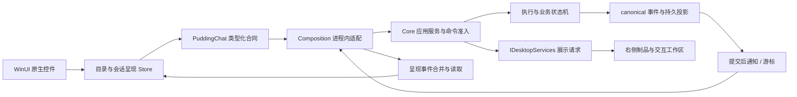

# Web Chat → WinUI 3 Native Chat：功能迁移与控件设计

- 日期：2026-09-29。
- 状态：规划设计，待实施；本轮只修改文档，不表示功能已经完成或恢复实施任务。
- 产品目标：用户打开 Desktop，选择角色，即可用原生界面完成真实 Coding Agent 对话、观察执行、介入操作并查看制品。既迁移 Web 的用户能力，也重新设计适合桌面的布局和控件。
- 技术约束：Core 已作为 DLL 在 Desktop 进程内运行。聊天通过应用服务函数、已提交事件通知和内部队列交互，不通过 WebApi、SSE、JWT 或聊天 WebView。
- 本文是 **Chat 功能迁移的主实施设计**；下文接口和新增文件名为建议，不是现存 API 清单。

## 1. 裁定与文档关系

1. **角色是一等公民。** 左侧每行是角色及其主会话入口，不是脱离角色的普通线程。角色、工作区、会话、Turn、Run 必须保持独立身份。
2. **中间是完整原生聊天体验。** 正文、模型实际返回且可展示的思考内容、工具调用、工具结果、子代理、审批、压缩、重试等，在原生消息控件中连续呈现。没有思考字段时不制造内容。
3. **右侧是制品与交互工作区。** 放制品、Agent 浏览器、代码、Diff、终端等；与消息来源双向定位。角色资料和配置另设入口。
4. **同进程消除传输层，不消除业务边界。** UI 不直接改数据库，不直接调用 Controller，不复制 Core 调度状态机；共享既有命令准入、执行、取消和持久化能力。
5. **交付单位是可完成的用户操作。** 一个控件须包含数据、状态、交互、错误恢复和接入验收；摆上按钮、显示静态卡片或组件测试通过，都不足以宣布迁移完成。
6. **先正常使用，再完成全量对齐。** R1 是可日常试用的原生 Chat 闭环；R2 完成下表中其余 Web 用户功能。R1 不得被命名为“Web Chat 全功能迁移完成”。

与现有资料的关系：

- [WinUI 3 总迁移计划](Desktop-WinUI3-Migration-Plan-2026-09-26.md)：总体产品和 Core DLL 边界继续有效。
- [聊天列表与启动审计](Desktop-Chat-List-Startup-Audit-Design-2026-09-28.md)：沿用聊天列表、启动测量和右侧制品交互区方案；本文补齐 Chat 组件、功能对齐与交付顺序。
- [原生聊天剩余任务书](../Tasks/Desktop-Native-Chat-Remaining-Tasks-2026-09-27.md)：NC-01～08 仍作为专项验收依据；按本文工作包归并执行，不能只累加小控件测试而遗漏业务闭环。其原先“右侧工作区不在本轮”的范围，在本设计中扩展为 R1 必须接通制品/浏览器入口，R2 完成其余交互面板。
- [完成度历史记录](../Reports/Desktop-Native-Chat-Completion-Audit-2026-09-27.md)：只作为已有组件和历史验证证据，不将历史测试数量当作当前发布通过证明。
- [审批接入设计](Desktop-Native-Approval-Integration-Design-2026-09-27.md)、[原生语音设计](Desktop-Native-Voice-2026-09-27.md)：继续约束持久审批及语音交互。

## 2. 当前基线：复用已有成果，补齐真实缺口

本轮为源码审计，没有启动产品、访问运行数据、调用真实模型或验证截图中的版本。仓库另有启动阶段、设置等未提交开发，实施前应对齐其提交；本文不覆盖它们。

| 当前事实 | 核对入口 | 设计含义 |
|---|---|---|
| 聊天已直接访问 Core 应用服务 | `InProcessChatClient.cs`：`ISubmitTurnHandler`、`IRequestTurnCancellationHandler`、会话投影；每操作异步作用域及停止排空 | 延续直调，不再建一套“Native REST 代理” |
| 已有提交信号和按游标读取 | `WaitForChangeAsync` 使用 `ICommittedEventSignal`；`InProcessChatClient.Activity.cs` 读取活动页 | 复用提交后通知、回放和追赶，补全呈现字段与生命周期 |
| 已有原生 Markdown、代码、图片、公式、历史、虚拟视口、附件、语音和子代理检查 | `Source/PuddingChat.WinUI`；逻辑在 `Source/PuddingChat` | 在现有组件上迭代，不重写成另一套聊天页面 |
| 思考/工具等主要通过通用展开区域呈现 | `TurnContentView.cs`、`ActivityContentView.cs`、`TurnFlow.cs` | 已能呈现活动，不等于完成 Web 专用工具卡、状态层级和动作迁移 |
| 呈现合同较窄 | `Contracts.cs` 的 `ProcessItem` 与 Composition 的 `Map` | 目前没有承载 Web `presentation.kind/meta` 的字段；上下文用量等需要独立类型化查询/通知，不能靠解析显示文本补齐 |
| 输入框仍是多个常驻文字按钮 | `ChatComposer.cs` | 重做紧凑编辑器、附件条、工具栏和运行中输入流程，保留已有 IME/粘贴/角色隔离处理 |
| 左侧目录存在双份读取与外壳状态问题 | 09-28 审计、Shell 与 `ChatWorkspace` | 先统一目录状态源，再美化头像行；未读和最近消息必须有真实数据源 |
| 独立原生审批控件不代表产品闭环完成 | `Approvals.cs`、`ApprovalCard.cs`、审批设计 | 必须交付真实等待、决定、恢复、重启后恢复；不可只接按钮 |

源码证据统一根目录：

- [Web Chat](../../Source/PuddingPlatformAdmin/src/pages/chat/index.tsx)、[ChatMain](../../Source/PuddingPlatformAdmin/src/pages/chat/components/ChatMain.tsx)、[IntentConsole](../../Source/PuddingPlatformAdmin/src/pages/chat/components/IntentConsole.tsx)。
- [原生合同](../../Source/PuddingChat/Contracts.cs)、[原生聊天组件](../../Source/PuddingChat.WinUI/ChatWorkspace.cs)、[Core 直调适配](../../Source/PuddingDesktop.Composition/InProcessChatClient.cs)。

## 3. Web → Native 功能对齐表

下表“Web 依据”为当前实现入口，不表示本轮逐一做过 Web 端到端验收。实施时必须继续追到 handler、canonical event 和持久状态；有 UI 而无服务闭环的项目登记为缺口，不能照搬为“已支持”。Web 文件均位于 `Source/PuddingPlatformAdmin/src/pages/chat/`。

R1 必须包含表中标为 R1 的完整操作；标为 R2 的能力保留明确入口方案和验收项，禁止静默删除。

| 用户能力 | Web 依据 | Native 现状与计划 | 阶段 |
|---|---|---|---|
| 选工作区/角色、头像、主会话、历史 | `SessionSidebar`、`AgentAvatar`、`ChatMain` | 已有基础；统一目录 Store，改聊天头像行、搜索、最近消息/时间、真实未读；停用角色可读历史但不能发送 | R1 |
| 正文、思考、工具按真实顺序流式输出 | `AgentMessageBubble`、`ReasoningPreview`、`executionFlowProjector` | 已有流与原生块；补全类型、状态、终态追赶、视图一致性；保留可展示思考全文 | R1 |
| Markdown、代码、列表、表格、链接、图片、公式 | `IncrementalMarkdown`、`MarkdownBlock` | 复用原生渲染；以共同样本确认信息不丢失、复制准确、长表格可横向阅读；复杂数学语法差异单列 | R1 基础；R2 差异收敛 |
| 终端/读文件/搜索/Diff/网页工具卡 | `presentation/PresentationRegistry` 与六类 renderer | 通用展开区升级为分类卡，保留原始输入/输出和未知类型回退；首轮完成六类渲染 | R1 |
| 子代理执行卡和详情 | `SubAgentActivityDock`、委派投影 | 复用 `SubAgentInspector`，按单次 delegation execution 定位，支持活动、结果、错误与来源 | R1 |
| 工具审批与权限模式 | `ApprovalCard`、`PermissionModeSelector`、`RecentlyDeniedPanel` | 已有独立审批控件；接入持久待办、版本校验、AllowOnce/Deny、失败恢复；权限按 Core 支持值显示 | R1 |
| 编辑、发送、停止、失败恢复 | `ComposerTextInput`、`IntentConsole` | 保留既有功能，整合草稿/附件/状态；发送受理与执行结束分离 | R1 |
| 运行中排队、补充指令、编辑/取消/排序待发、立即发送、停止全部 | `MessageQueueDropdown`、`ChatMain` 回调及 outbox | 原生公开合同仍需补齐；R1 完成排队、补充、取消；R2 完成 Web 其余队列操作和恢复语义 | R1/R2 |
| 图片、粘贴/拖入、文件上下文、相机 | `IntentConsole`、`CameraInputModal` | 图片/文本文件已有；R1 验证真实导入与发送；R2 接相机。PDF/Office 提取不凭按钮认定为已存在 Web 能力 | R1/R2 |
| @角色、技能、/命令、模型/模式选择 | `ComposerTextInput`、`MentionPalette`、`SkillPalette`、`CommandPalette`、`IntentConsole` | 建原生选择浮层与上下文 chip；R1 完成 Core 已支持的常用项，选择结果必须进入实际命令/请求 | R1 |
| 上下文环、用量分层、运行详情、压缩状态 | `ContextUsageRing`、`ComposerStatusDetails`、`CompactionCard` | 新建定制环和详情浮层；补类型化用量快照/压缩卡；不能用旋转图标代替 | R1 |
| 模型重试、缓存、消耗、余额、思考强度、索引/LSP | `ModelRetryRow`、`TokenBar`、`ProviderBalanceIndicator`、`ThinkingIntensityIndicator`、`IndexIndicator`、`AspLspIndicator` | R1 展示执行相关重试与真实用量；R2 完整诊断/余额/索引细节，缺数据明确标识 | R1/R2 |
| 复制、朗读、引用、重跑、删除、置顶、导出 | `MessageActions`、`ChatMain`、`PinnedMessageButton`、`ComposerActionMenu` | 复制/朗读有基础；R1 确认真实调用，R2 补余项。重跑不能意外重复已有副作用，删除/重跑由 Core 定义范围 | R1/R2 |
| 语音输入/输出、自动朗读 | Web voice hooks、`MessageActions` | 原生录音转写/朗读已有；R1 做真实设备/服务闭环，R2 对齐自动朗读和 Web 已有模式 | R1/R2 |
| Goal、计划、执行步骤和阻塞原因 | `GoalBanner`、`GoalStepsPanel`、`EditablePlanCard` | R1 保留已有运行 Goal/计划的可读状态，R2 补编辑/继续等操作；步骤数量不转换为 LLM 完成百分比 | R1/R2 |
| 历史搜索、Checkpoint 还原/分叉/删除 | `HistorySearchModal`、`CheckpointTimelinePanel`、`ChatMain` | R2 原生对话框和列表；先确认 Web 本地 checkpoint 与 Core 执行状态边界，不能把还原视图说成回滚文件副作用 | R2 |
| 阅读模式、过程摘要、等待状态、滚动定位 | `TranscriptModeSwitch`、`FocusViewToggle`、`MessageProcessSummary`、`WaitingBubble`、viewport | R1 自动贴底/返回最新/来源定位；R2 对齐阅读模式。原生交互可以不同，信息须等价 | R1/R2 |
| 制品/浏览器/代码/终端交互 | Web 工具呈现、Desktop 总迁移计划、用户右栏裁定 | 这是 Desktop 整体交互工作区，不能仅从 ChatMain 文件推断 Web 已完整具备。R1 制品预览、真实浏览器标签及来源跳转；R2 其余工作区交互 | R1/R2 |
| 开发诊断、任务板、技能管理等扩展入口 | `DevPanel`、`ChatMain` 的任务板入口、`IntentConsole` 的技能管理 | R2 提供原生入口或明确导航至单独功能页；不在 Chat 中复制整个管理系统 | R2 |

迁移对照样本应包含：普通问答、交错正文/思考、并发工具、失败工具、长终端输出、搜索/读文件/Diff、子代理、审批等待、压缩、重试、图片与语音。记录 Web 与 Native 信息/操作差异，不要求像素一致；不把旧 Web 登录、SSE 重连提示等传输层交互迁入本机产品。

## 4. 页面设计：聊天软件的连续体验

```text
┌ Pudding · 工作区                                  窗口操作 ┐
│ 搜索角色/消息      │ 头像 角色名 · 当前任务    历史 / 更多     │
│ 新对话/新工作      │────────────────────┬─────────────────│
│                   │ 用户消息/附件       │ 制品与交互      │
│ [头像] 角色名 时间 │ 思考（流式）        │ 文档 | 浏览器   │
│        最近消息 ② │ 工具调用卡          │ 代码 | Diff…   │
│ [头像] 运行角色   │ 子代理/审批/结果    │                 │
│        正在读文件 │                    │ 内容 + 操作栏   │
│                   │ [返回最新 ↓]        │                 │
│ 设置 / 运行中心    │ 附件 / @角色 / 技能 │ 来源角色/消息   │
│                   │ 描述工作…           │                 │
│                   │ ＋ 权限 模式 ○ 🎙 ↑│                 │
└───────────────────┴────────────────────┴─────────────────┘
```

### 4.1 布局与层级

- 左栏建议 288 DIP，可调 240～360；列表占剩余高度，虚拟化，不再固定 480 高。头像 44，行高约 76，标题一行、消息预览一行；职责介绍移到角色资料。
- 角色状态使用小标记与中文短文案。未读数字来自已读游标，不能显示固定 0；无数据不显示 badge。运行中不自动重排选中行，避免点击目标移动；闲置角色按最近活动排序，可置顶。
- 中间采用有节奏的消息流，正文建议 760～900 DIP 阅读宽度。用户消息轻底色靠右；助手正文少包一层大白卡，工具/审批使用局部卡片，避免“卡片里再套卡片”。
- 页头保留当前角色、模型/工作区和运行状态；停止、等待审批等影响执行的状态在输入框附近始终可达，不藏在滚到上方的历史消息里。
- 右栏建议 480～560 DIP，可拖动、收起、最大化。无活动内容时默认收起；新制品增加标签/提示，用户正在阅读或输入时不抢焦点。
- 内容宽度不足以容纳左 240 + 聊天 480 + 右 420 时，右栏切换为单独工作区视图并提供“返回聊天”；更窄时角色列表成为可展开导航。用实际可用 DIP 判定，不用物理像素硬套。

### 4.2 主题与材质

整体使用中性浅底和小面积柔和绿色强调；深色采用中性深灰，避免给每层都覆盖灰绿不透明色。窗口底层保留 Mica，内容层用主题资源控制透明度与边框；弹出菜单/浮层使用合适的 Acrylic，正文保持清晰可读。

Mica 是融合主题与壁纸的**不透明动态材质**，不是实时透视后方窗口的磨砂玻璃；长期窗口背景与临时浮层应分别选材。关闭系统透明效果、高对比度或不支持材质时必须有纯色回退。依据：[Microsoft Mica](https://learn.microsoft.com/en-us/windows/apps/design/style/mica)、[Microsoft Acrylic](https://learn.microsoft.com/en-us/windows/apps/design/style/acrylic)。本设计不引入新版文档中超出现有 Windows App SDK 1.8 依赖的 API。

## 5. 定制控件规格

### 5.1 控件树与职责

保留现有 `ChatWorkspace`、`VirtualTranscript`、`MessageCard`、`TurnContentView`；逐步增加可复用模板控件，而不是全面重写。

| 控件/呈现器（新增名称为建议） | 内容及交互 | 关键状态 |
|---|---|---|
| `RoleConversationItem` | 头像、名称、时间、最近消息、未读、运行提示；选择/右键/键盘导航 | Normal、Selected、Unread、Running、Frozen、Unavailable |
| `MessageCard` | 消息身份、内容块、结果状态、动作区；稳定 MessageId | Sending、Accepted、Streaming、Completed、Failed、Cancelled |
| `ReasoningBlock` | 思考标题、实际流式文本、耗时、展开/收起；生成中可直接阅读，用户收起后不强制展开 | Streaming、Completed、Unavailable；展开状态独立 |
| `ToolCallCard` | 工具名/目标/状态/耗时、类型化摘要、输入/输出、完整明细、来源动作 | Queued、Running、AwaitingApproval、Succeeded、Failed、Cancelled |
| `ToolPresentationRegistry` | generic / terminal / read / search / diff / web 呈现器；delegation 转专用卡，job 暂回退通用卡 | 未知 kind 保留原始数据并降级，不丢整条消息 |
| `DelegationCard` | 子代理名、单次任务、状态和结果摘要，打开已有 Inspector | 按 execution identity 隔离，复用 Agent 不合并两次任务 |
| `ApprovalCard` + 固定待办条 | 精确操作目标/风险摘要、允许一次/拒绝、版本、有效期、决定回执 | Pending、Submitting、Decided、Expired、恢复失败；由 Core 决定可用动作 |
| `CompactionCard` / `RetryStatusRow` | 压缩或重试的阶段、原因、实际结果、失败信息 | Running、Succeeded、Failed；终态停止动画 |
| `ContextUsageRing` | 定制上下文占用圆环与详情入口，见下一节 | NotStarted、Unknown、Known、Estimated、Stale、Error |
| `ExecutionActivityRing` | 当前动作的执行提示；有真实度量才显示进度 | Indeterminate、Determinate、Waiting、Succeeded、Failed、Cancelled |
| `ChatComposer` | 编辑器、附件条、选择浮层、紧凑工具栏、待发队列和停止/补充 | Editing、Submitting、Queued、Running、Stopping、Unavailable |
| `ArtifactInteractionWorkspace` | 标签管理、制品预览、浏览器/终端交互、来源导航 | Loading、Ready、Detached、Failed；角色切换不混淆归属 |

对外暴露稳定的 Snapshot、Command 和依赖属性，不把事件订阅、数据库读取写进控件模板。视觉状态、主题资源和尺寸放进 `Themes/Generic.xaml`；页面组合仍可用现有 UserControl。模板化控件有明确的 ControlTemplate/状态职责，符合 [WinUI 3 模板控件文档](https://learn.microsoft.com/en-us/windows/apps/winui/winui3/xaml-templated-controls-winui-3)。

### 5.2 工具卡不是通用文本框换标题

- **terminal**：命令、工作目录、运行状态/退出码、分段输出；长输出有独立阅读区和“在终端打开”。
- **read**：文件路径、行范围、原生代码片段、打开文件定位；不能从 Markdown 猜路径。
- **search**：查询、结果数、逐项文件/行/摘要，可打开对应位置。
- **diff**：文件、增删摘要、差异预览和打开 Diff；“应用”只在 Core 明确提供可执行操作时出现。
- **web**：标题、URL、动作与结果摘要、可用的截图/链接、打开对应 Agent 浏览器标签。
- **generic**：名称、输入、完整结果、错误及复制；未知工具仍完整可读。

每次调用以 TurnId + ToolCallId 配对。输入增量、输出增量、完成事件更新同一张卡；工具结果为空、非零退出码、拒绝执行、取消须明确区分。折叠只释放展示资源，不丢数据；展开后从最新快照恢复。工具含多个结构化段时按段展示，不压扁成一段 JSON。

### 5.3 定制环形控件：上下文占用与执行进度分开

Web 已有 [ContextUsageRing.tsx](../../Source/PuddingPlatformAdmin/src/pages/chat/components/ContextUsageRing.tsx)，不是简单 loading。Native 必须保留以下语义：

**上下文环**建议 `ContextUsageRing : Control`，内部为原生矢量圆弧、焦点区域和详情 Flyout。

- 输入快照：RoleKey、SessionId、UsedTokens、WindowTokens、EffectiveInputTokens、Breakdown、Source、Confidence、RecordedAt、MessageCount、Error。由 Core 产生，UI 不按文本长度重算 token。
- 工具栏命中区至少 34×34 DIP；环直径 22～24、线宽约 2.5；从 12 点方向顺时针。保留 Web 占用阈值：低于 50% 为正常、50%～69% 提醒、70% 起高占用，使用语义主题色并同时显示文字，不能只有颜色。
- `Used / Window` 为上下文用量。缺窗口、无数据、读取失败分别显示“未配置/暂无用量/获取失败”，不能伪装 0%。`MessageCount == 0 && Used == 0` 才视为尚未开始。
- Provider 报数可显示确定值；估算显示“≈”和来源。切角色时旧值不能移到新角色；数据过期保留数值并标采样时间/过期状态。
- Hover 显示用量、百分比与来源，点击或键盘激活打开详情；打开时直接函数刷新一次，结合事件刷新，不为每个圆环建轮询 Timer。
- 详情顺序：总用量 → 分层条 → 可用/预留 → 来源/采样时间 → 压缩状态 → 运行详情 → 子代理入口。分层为系统提示词、工具定义、压缩摘要、对话、思考、工具结果。
- 分层总量与 Provider 用量不同源时，沿用 Web 按总用量归一的展示口径并标注；输出预留放右端、不能算作可用输入。超限时圆弧上限裁剪，但文本保留真实超限数值；分层图也要在可用绘图区裁剪而不改原始事实。
- 压缩是独立事件状态；上下文 80% 绝不显示为“压缩完成 80%”。没有新用量不能在压缩结束时自行把圆环清零。

**执行环**建议共享底层圆弧视觉，业务合同独立：有 `CompletedUnits/TotalUnits` 且单位/范围可靠时才显示确定进度；LLM 思考/输出、未知时长工具默认不定进度。等待用户/审批为静态等待符号；完成/失败/取消显示相应终态图标。不把 elapsed、token 数、完成工具数映射为整个任务完成率。

原生 `ProgressRing` 已支持确定与不确定模式，可作为执行环基础；上下文环还需要自定义占用语义、详情、错误与可访问状态。依据：[Windows App SDK 1.8 ProgressRing](https://learn.microsoft.com/en-us/windows/windows-app-sdk/api/winrt/microsoft.ui.xaml.controls.progressring?view=windows-app-sdk-1.8)。

动效仅在控件可见且运行中激活；遵循系统减少动画设置。提供 Automation 名称/状态，确定数值可暴露只读 RangeValue；有 Flyout 的复合控件保留独立可操作语义，键盘可开合、Esc 关闭、焦点返回。屏幕阅读器不逐 token 播报，只播报状态变化和用户请求的内容。

### 5.4 输入框与运行中交互

编辑区建议最小 72、最大 220 DIP，自适应行高；附件缩略图和技能/角色 chip 放在文本上方。底部一行：`＋`、权限/模式、弹性间隔、上下文环、语音、主动作。罕用项进入菜单，快捷键放 Tooltip；保留 Ctrl+Enter 发送、Enter 换行和 IME 组合保护，可配置快捷键但默认一致。

空闲主动作为发送；执行中显示停止，并允许继续编辑草稿，通过明确动作“排队发送”或“补充当前任务”提交。停止仅取消当前 Turn；停止全部需明确队列处理结果，不能悄悄删草稿。发送失败保留正文与附件；未知受理结果按同一 RequestId 查询/重试，不能重新发出另一个任务。

语音转写先进入可确认草稿，不能因 UI 切角色把结果发送给另一角色。模型/权限/模式变更说明作用于“下一次发送”还是“当前执行”，实际能力由 Core 返回；不支持时显示原因，不做无效切换。

## 6. 同进程交互架构



图中是**调用/数据流**，不是程序集引用图；编译期依赖如下：

- `PuddingChat`：BCL 叶组件，合同、不可变快照、纯呈现 reducer，无 Core/WinUI/HTTP 包引用。
- `PuddingChat.WinUI → PuddingChat`：原生控件、视口、DispatcherQueue、交互状态，不反向引用 Desktop 或 Host。
- `PuddingDesktop.Composition → PuddingChat + Foundation + Core`：适配 Core 现有 handler/query、DI scope、生命周期。
- `PuddingDesktop`：装配 UI 与 Composition，提供 `IDesktopServices` 实现和工作区承载。Core 只面向展示抽象，不持有 WinUI Window/Control。
- 现有独立工程与编译期引用检查继续使用；不为每个控件增加程序集。新增边界先按[组件化交付规程](../Conventions/组件化交付规程.md)独立验证，再修改宿主接入。

### 6.1 三类通路各司其职

| 通路 | 内容 | 约束 |
|---|---|---|
| 类型化异步函数 | 目录、历史、用量查询；发送、停止、审批、排队/补充等命令 | 复用现有应用服务；每次操作绑定身份、scope、取消和内核代次；不经 Controller/JSON/loopback |
| 提交后通知 + canonical 回放 | 正文、思考、工具、状态、制品变化 | 通知只表示“有新事实”，权威顺序以会话事件游标为准；丢通知能追赶，不能丢事实 |
| 有界进程内队列 | 合并 UI 失效通知、限制 Dispatcher 工作量 | `Channel<T>` 可用于通知协调，不替代 Core 持久命令/outbox；慢 UI 不能阻塞执行线程 |

不是每个 Web endpoint 都新建一个 C# 接口。查询按目录/会话/用量聚合；命令按业务意图适配。Web 仍需要的入口也调用同一应用服务；若逻辑还困在 Controller，先抽取对应应用用例并独立测试，禁止 Native 构造假 HttpContext。

建议扩展现有合同的能力组：

| 能力组 | 直接操作/结果（建议） | Core 接入依据 |
|---|---|---|
| 目录 | DirectorySnapshot、角色摘要/已读游标更新 | 角色文件服务 + 会话/状态投影；补真实最近消息和已读存储 |
| 会话 | 现有 GetConversation/ReadActivity/WaitForChange，补类型化呈现段 | `IAgentConversationProjectionService`、事件库与提交信号 |
| 命令 | 现有 Send/Cancel；补排队、编辑/取消待发、Steer、能力查询 | 既有 SubmitTurn、RequestTurnCancellation、CreateSteering 等用例；先核对准入语义 |
| 上下文 | GetContextUsage / UsageChanged，运行摘要快照 | Web context-health 对应查询服务；若控制器仍编排查询，抽为共享应用用例 |
| 审批 | ListPending / Decide / DecisionReceipt / PendingChanged | 持久审批服务与恢复流程；不是 UI 自己解除暂停 |
| 展示 | OpenArtifact / OpenBrowser / RevealSource 的类型化请求与回执 | `IDesktopServices` 和现有展示控制器；权限与资源归属仍由 Core 校验 |

### 6.2 事件与快照合同

沿用已有字段；新增字段按实际事件来源补齐，不要求一次重写整套事件系统：

- 路由身份：WorkspaceId、AgentId、SessionId、TurnId、RunId；工具附 ToolCallId，委派附 DelegationExecutionId。
- 顺序：EventId/Sequence、快照覆盖到的 Cursor；局部流不得混用不同会话序号。
- 呈现：文本/思考增量、tool presentation kind + 类型化 payload、调用/结果、审批、重试、压缩、制品引用、运行终态。
- 数值快照：上下文与使用量携带 Source/Confidence/RecordedAt；可选字段缺失表示未知，不默认成 0。
- 命令回执：稳定 RequestId、Accepted/Rejected/Unknown 和关联 Turn；Accepted 只表示受理，执行完成来自 Core 终态事实。
- UI 代次：KernelGeneration、SelectionGeneration 为呈现侧隔离字段，不写成业务运行状态。

类型化 payload 只带展示所需数据，不泄漏 Core 对象或服务引用。未知类别回退通用原始展示；不要为了“无损”把所有内部对象序列化进 UI。

### 6.3 流式加载算法与队列背压

1. 用户选角色：递增 SelectionGeneration，取消旧订阅/查询；读取主会话快照及保守游标 C。复用现有“先捕获事件头，再读取投影”的防漏读规则。
2. 从 C 读取 canonical 增量，按固定追赶上界分页；订阅/等待提交信号前后都检查游标，避免快照到订阅之间漏事件。继续沿用 `RequiresSnapshot` 缺口恢复。
3. 后台串行呈现 reducer 去重并保持顺序；文本可按相邻块合并，工具按稳定身份更新。只在这一层生成不可变 RenderUpdate。
4. UI 更新初始建议 33 ms 合并窗口，作为可测参数；在 DispatcherQueue 上只改发生变化的属性/块。终态先补齐它之前的所有事件，再更新完成状态。
5. 队列有界。饱和时合并为“最新已知游标待追赶”，允许丢重复失效通知，不允许 `DropOldest` 丢掉正文、工具结果、审批或终态。待追赶最高游标单独保存，唤醒失败也可再次检查。
6. 同一角色只保留一个呈现消费者；切角色/内核重启后拒绝旧代次结果，清理订阅。按需保留非视觉阅读状态，不保留无限量控件/事件缓存。
7. 正在读历史时不自动滚到底，显示“有新消息”；贴底状态才跟随追加。历史前插按稳定消息锚点与偏移恢复，图片加载、工具展开不突然跳页。

Markdown 的解析/结构化工作可在后台生成不可变计划；XAML 对象只在 UI 线程创建。流式末尾未闭合代码围栏和公式有暂态回退，已稳定块不整条重建；若后台解析晚到，用版本号拒绝过时结果。现有虚拟视口、分页工具输出与折叠懒加载继续复用。

### 6.4 状态机、取消和资源

Core 唯一持有实际业务状态（排队、运行、等待审批、终态等，实际名称以当前 Core 为准）。UI 只持有 Selecting/Loading/Ready/Recovering/Unavailable，以及编辑、展开、滚动、Submitting 等呈现状态。

关闭卡片不是取消任务；取消订阅读取也不是停止执行。点击停止向 Core 发明确取消命令，显示“停止请求已受理”，待 Core 终态后显示已停止。内核停止后拒绝新操作，取消订阅、排空已在途 scope，释放 Desktop 展示资源后再退出，不能 UI 等待一个反向同步调用导致死锁。

默认数据目录和本机无登录模式继续沿用。UI 不暴露 Token/密钥，Core 的工作区、角色和资源归属校验不因同进程而移除。

## 7. 右侧制品与 Agent 浏览器的接入

每个标签有稳定资源 ID、资源类型、标题、来源 Workspace/Agent/Session/Turn/Run/ToolCall、资源版本。点击消息的“查看制品/浏览器”打开对应标签；点击“回到来源”定位消息，必要时分页载入，不能只滚动到列表底部。

制品卡只展示摘要，完整正文/图片/Diff 在工作区按需加载；更新保持当前视图和滚动位置，版本变更显示提示。角色切换默认展示当前角色资源；固定标签可保留，但必须显式标记原角色，不能把新角色指令发给旧资源。

浏览器不是聊天 HTML 容器：浏览器工具栏、标签、交互状态为原生；真实网页使用浏览器引擎（可由 WebView2 承载）。这不违反 Native Chat 要求。必须绑定 Agent 实际使用的浏览器上下文/页面，不能另开一个相同 URL 冒充它的现场。

Core 仲裁 Agent 与用户的控制权：提供“请求接管/交还 Agent”及明确状态；仲裁前不可并发操作同一页面。导航/点击/表单提交、终端输入等仍经过已有工具授权与执行通路；只读预览不触发执行。页面版本变更后旧定位引用失效，复用既有浏览器安全约束。

`IDesktopServices` 请求异步返回 Opened/Unavailable/Failed 等回执，不返回控件；UI 不可用、资源已删除、Core 重启、标签关闭均应有可解释结果，不阻塞 Core 无限等待。

## 8. 实施工作包与顺序

所有新增组件遵循独立逻辑/原生控件验证 → 边界门禁 → Composition/宿主接入 → 产品端到端。每包形成可 review 的独立提交；本次不分配执行者、不启动后台开发。

| 包 | 修改位置（建议） | 交付物与门禁 | 依赖 |
|---|---|---|---|
| P0 功能基线与合同 | `PuddingChat/Contracts.cs`、`ConversationActivity.cs`，新增 `ToolPresentation.cs`、`ContextUsage.cs`、`ChatCapabilities.cs` | 冻结 Web 对照样本；纯 reducer/数值/身份测试；新增合同与现有兼容策略限于本次迁移，不建长期双轨 | 无 |
| P1 目录和页面 | `RoleNavigation.cs`、`ChatWorkspace`、`RoleAvatarCard`，新增目录 Store/摘要合同；Shell 接入最后做 | 单一目录状态源、聊天头像行、主题和三栏布局；真实摘要/未读闭环 | P0 |
| P2 消息组件 | `TurnFlow.cs`、`MessageCard`、`TurnContentView`、`ActivityContentView`、新增工具 Registry/专用卡与主题模板 | 全部代表消息样本原生呈现；流式身份保持、折叠、错误、复制、来源动作 | P0 |
| P3 输入与环形控件 | `ChatComposer`、新增 `ContextUsageRing`、`ExecutionActivityRing`、用量浮层、队列/命令选择控件 | 控件测试覆盖用量语义和全部状态；紧凑输入交互；没有数据的场景真实降级 | P0，可与 P2 分别交付 |
| P4 Core 直接接入 | `InProcessChatClient` 各 partial；必要的共享应用用例和呈现投影扩展 | P2/P3 独立验证后，接用量、类型化工具、队列/Steer、审批与事件；真实 Host 集成测试 | 对应 P2/P3 门禁 |
| P5 制品交互工作区 | Foundation 展示合同、Composition 展示适配、Desktop 原生工作区 | 制品/真实浏览器标签、来源定位、控制权、生命周期；不能用演示页面代替真实标签 | 独立合同/组件通过，随后接 P4 |
| P6 R1 整体验收 | Composition 测试、原生窗口检查、隔离 DataRoot 产品验收脚本 | 完整用户链 + 性能/可访问性 + 全新包启动；收敛 NC-01～08 相应门禁 | P1～P5 |
| P7 R2 功能对齐 | 按 §3 的 R2 行逐项落在上述边界 | 每项“入口→服务→事件/状态→UI→失败恢复→验收”；维护差异清单至清零或用户明确取舍 | R1 |

启动性能沿用 09-28 设计，并与当前启动阶段记录/全文索引维护 WIP 对齐；不另建启动主管。区分 Shell 可见、目录可读、Chat 可执行、后台维护完成；影响执行正确性的初始化不能延后到执行之后。只有真实能力就绪才开放发送。

## 9. 验收：证明正常可用，不只证明有控件

### 9.1 R1 必过场景

1. 从明确的新发布目录冷启动，Shell 可操作；配置错误/目录被占用时可修复；成功后加载真实角色，无 Web 登录。
2. 选择角色发送真实请求，依次看到实际思考/正文、工具输入/输出与最终结果；中途切角色、回看历史再返回，内容顺序和身份一致。
3. 用 Coding Agent 完成“读取文件 → 搜索 → 修改生成 Diff/制品 → 执行验证”的任务，六类工具呈现均有样本；在右侧打开真实资源并返回来源消息。
4. 执行中补充指令或排队下一条，查看明确受理回执；取消待发与停止当前执行互不混淆；失败后不会重复执行已受理命令。
5. 触发真实审批，UI 可批准一次/拒绝，Core 正确恢复/结束；决定失败、过期及重启后待办都有可追踪状态。沿用 NC-01 持久审批门禁。
6. 上下文环显示 Core 真实数值/来源；验证未开始、缺窗口、估算、过期、获取失败、压缩成功/失败、50/70% 边界；不出现虚假进度。
7. 图片/文件粘贴、拖放、真实语音输入/朗读、IME、代码复制、长输出阅读均完成端到端；有明确外部设备/模型阻塞时列为未通过，不用 mock 结果代替。
8. 子代理显示单次执行详情；Core 重启后重新绑定会话/事件游标，无重复消息、跨角色污染、审批遗失或旧状态覆盖。
9. 浅/深主题、系统透明关闭、高对比度、100/150/200% DPI、键盘和 Narrator 可用；窄窗可访问全部主要动作。
10. 打包运行不依赖开发服务器，Native Chat 执行路径没有到自身 Core 的 HTTP 请求。仍有高级管理/其他集成 HTTP 时单列用途，不把“Chat 无 HTTP”夸大为“整个进程无端口”。

### 9.2 流式与性能门禁（待实测的初始目标）

| 指标 | 测量方法与目标 |
|---|---|
| 提交到可见 | 以 canonical 提交时间和 UI 应用序号计时；60 秒持续事件样本下 P95 ≤ 100 ms、P99 ≤ 250 ms；不混入 LLM 首 token 延迟 |
| UI 批处理 | 标准样本下单批 UI 工作 P95 ≤ 8 ms；复杂解析后台完成，不为每个 token 重建整条消息 |
| 压力样本 | 固定 100 次事件/秒、正文/工具混合 60 秒，另加 1,000 条历史和 500 个工具块；验证最终数据精确一致、队列有界、控件随视口而非历史总量增长 |
| 大内容 | 百万字符工具输出分页/延迟加载；不一次创建百万字符富文本树；复制完整内容走专用数据读取，失败有反馈 |
| 状态隔离 | 连续切换 100 次角色/重挂会话，旧订阅和作用域可回收；记录对象/订阅计数及内存平台值，不能持续线性增长 |
| 启动 | 至少记录 5 次冷/5 次热启动及数据量、磁盘、SDK/构建版本，报告各阶段与 P50/P95；先取得基线再制定 Core 时限，不预先声称快了多少 |

这些是验收目标而非已测成绩。必须保存输入样本、构建 commit、隔离 DataRoot、测量日志和结果；若目标需调整，记录瓶颈证据与决定，不能删掉失败样本。

### 9.3 测试层级与发布边界

- 纯组件：事件乱序/重复/缺口、终态追赶、审批版本、跨角色晚到、用量计算与快照来源。
- 原生控件：真实窗口中的流式更新、控件复用、视觉状态、滚动、Flyout 焦点、键盘/IME、主题和可访问性。
- Composition：真实 Host + 隔离 DataRoot，验证函数调用、DI 作用域、提交信号、生命周期与恢复；测试不读取或复制生产密钥。
- 产品：外部控制器部署到明确新构建并验证启动/退出；真实模型/设备验证功能。测试 doubles 只证明组件行为，不能代替产品闭环。

构建/发布沿用 `--artifacts-path temp/build/desktop-kernel`，同目录先 restore 后 `--no-restore`，Desktop 构建/测试串行。运行数据、其他开发中的修改与旧进程归属保持现有约束。

R1 交付记录必须给出 §3 对齐矩阵的逐行结果及 R2 剩余项；R2 只有所有迁移项通过或用户明确接受差异，才能称为完整功能对齐。相机、Checkpoint、复杂公式、完整管理页等是否进入某个发布批次，可调整顺序，但不因暂未实现而从目标中消失。
