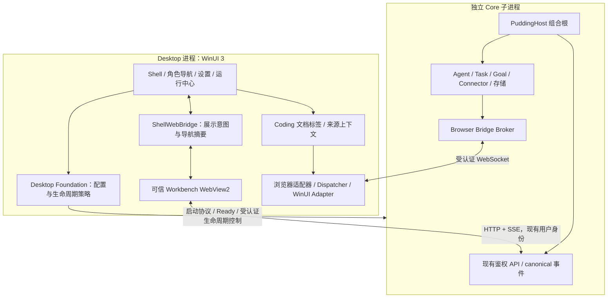

# PuddingDesktop：WinUI 3 工作台骨架、Core 接入与迁移计划

- 初稿：2026-09-26；修订：2026-09-27。
- 状态：**架构方向已由用户确认；本文是待实施设计，未完成 WinUI 构建、实机验证或产品验收。**
- 用户输入：2026-09-27 WorkBuddy 三栏截图，作为布局参考；截图内聊天文字、网页和品牌不是需求指令。同日补充裁定：**PuddingAgent 是以角色为一等公民的 Coding Agent**。
- 决策记录：[Desktop / Core 边界 ADR](ADR-Desktop-WinUI3-Shell-Core-Boundary-2026-09-27.md)。
- 当前实现仍是 WPF Desktop + 独立 ASP.NET Core。本文描述目标形态，不更改当前运行事实。

## 0. 本次修订的裁定

1. 主线是 **WinUI 3 Shell + 角色优先的原生导航 + 中间角色工作会话 + 右侧编码工作区**。右侧使用统一文档标签骨架，浏览器是首个完整适配器；代码、Diff、终端和产物按能力接入。保留现有聊天、管理页面和浏览器驱动资产。
2. **Core 长期保持独立子进程**。删除原 S4 进程内化、`coreMode` 双模式、ASP.NET Core ALC 热卸载方案；Desktop 不引用 `PuddingHost`，不加载 Agent Runtime / Connector / SQLite 业务层。
3. 原生聊天是后续独立项目，不阻塞 WPF 退役。首版中间只有一个 Workbench WebView2，不为每条富消息创建 WebView2。
4. 首版允许必要的前端嵌入模式和桥协议改造，取消“前端零改动”的承诺。浏览器直接打开 `/admin/` 的开发、使用路径继续可用。
5. 工作台与第三方网页使用隔离的 Environment / 用户数据目录；S0 使用产品实际隔离配置验证。
6. 按组件化交付规程先独立构建、测试、边界检查，再接入宿主。旧阶段编号全部由本文 M0–M5 取代，避免与组件规程 S1–S5 混淆。
7. 旧版 49–77 人日估算作废；主线范围改变后，应在 M0 结束按组件盘点重新估算。

## 1. 布局骨架：将参考图转为 Pudding 的职责分区

### 1.1 首版线框

```text
┌────────────────────────────────────────────────────────────────────────────┐
│ 面板 / 搜索 / 筛选   文件  编辑  窗口  帮助             拖拽区  ─ □ ×       │
├───────────────┬───────────────────────────────────┬────────────────────────┤
│ Pudding       │ 角色 / 项目 / 会话操作（Web）       │ 文件/Diff/终端/浏览器  │
│ 当前项目      │ 当前执行根 / 分支 / Run 状态       ├───────┬────────────────┤
│ 我的角色      │ 消息、推理摘要、工具调用、子代理    │ 概览  │ 文档专用工具条 │
│ 技能 / 连接器 │ 状态、错误与交付物（Web）          │ 产物  ├────────────────┤
│ 定时任务/知识 │                                   │ 活动  │ 第三方网页     │
│               │                                   │       │ 或产物预览     │
│ 角色下的会话  │                                   │       │                │
│ 工作区        ├───────────────────────────────────┤       │                │
│               │ 输入、附件、模型、权限、发送（Web）│       │                │
│ 用户 / 设置   │                                   ├───────┴────────────────┤
│ Core 状态     │                                   │ Agent控制状态/接管     │
└───────────────┴───────────────────────────────────┴────────────────────────┘
```

| 区域 | 实现与组件名（拟） | 首版职责 |
|---|---|---|
| 顶部 | WinUI `TitleBarView`、`ShellCommandRouter` | 原生菜单、面板显隐、搜索入口、系统按钮、拖拽热区 |
| 左栏 | WinUI `NavigationPaneView` | 当前项目、角色列表及角色状态、角色下会话/任务、用户入口、Core 状态 |
| 中栏 | `WorkbenchHostView` + 一个可信 WebView2 | 复用聊天、管理页面、现有事件投影、输入和附件链路 |
| 右栏 | WinUI `CodingWorkspaceView` + `BrowserWorkspaceView` 适配器 | 统一文档 Tab、按类型切换工具条、概览/产物/活动侧板；浏览器标签有地址栏 |
| 右栏内容 | `IWorkspaceDocumentHost`（拟）及各类适配器 | 代码/Diff/终端输出/网页/产物；功能按 capability 显示，不以浏览器 URL 模拟所有对象 |
| 设置 / 运行中心 | WinUI 原生视图，覆盖中间内容区域 | 无 Core、无 WebView2 Runtime、未设置 DataRoot 时仍能操作 |

左侧先选角色实例，再进入该角色的主会话或任务。截图中的“任务列表”不直接映射为 Pudding Task 状态机。“新建工作”必须显式绑定角色；不能默认把每次点击变成匿名聊天或新 Agent。显示名称可调整，实体必须用 `agentId` / `conversationId` / `taskId` / `workspaceId` 区分。

### 1.2 布局和交互规则

以下是待 M0 实测调整的初始设计值，单位为有效像素（DIP），不是设备像素：

- 顶部约 44–48；左栏默认 248、可调 200–320；中栏期望最小 480；右栏打开时默认占剩余宽度约 40%，期望最小 420。
- 用户可折叠左右栏、拖动分隔条；无文档时右栏可关闭，首次打开代码/Diff/终端/浏览器/产物或用户显式展开时出现，随后记住用户布局。
- 可用宽度不足时先折叠右栏内部侧板，再收起左栏，仍不足则由用户选择显示会话或右工作区。不得挤压到输入框不可用；不得销毁后台浏览器页面。
- 首版单主窗；右栏提供“在工作区内展开”。独立浮动窗口、跨窗拖 Tab 后续单列，不增加 M1–M3 范围。
- 用户上滚阅读消息时不强制拉回底部；打开右栏不重载中间会话。切换管理页前保留聊天草稿，恢复会话时恢复滚动锚点。
- `Ctrl+N` 路由到当前角色的新工作入口；未选择角色时先显示角色选择。全局搜索与“查找当前页”分开。编辑菜单的复制/粘贴/撤销按焦点路由到原生输入框或当前 WebView，禁止全局抢占 IME 组合输入。
- 深浅色、高对比度、键盘遍历、屏幕阅读器名称和 DPI 跨屏是首版门禁；参考图的配色、文案和品牌不直接复制。

### 1.3 内容生命周期

- `WorkbenchHostView` 在正常 SPA 路由切换时保持同一实例；不为每个会话建立浏览器环境。
- 切换到原生运行中心时隐藏 Workbench，保留可恢复的草稿；返回后重新核对 Core 状态和事件游标。
- Browser Page 的存活、可见、Agent 可操作三种状态分开。隐藏、折叠、最小化仅改变呈现，不自动取消 Agent 操作。
- 浏览器页面关闭是显式动作；若正在操作，先阻断新操作，再终止/结算在途操作并销毁页面。结果必须可观测，不能显示假成功。
- 会话关联浏览器是显示关联：保存 `workspaceId/conversationId/contextId/pageId` 的引用，不把 Page 所有权交给会话视图。首版不承诺跨 Desktop 重启保持活动 DOM、Locator 或未完成工具调用。

### 1.4 角色是一等公民：身份与工作模型

产品的主要操作对象是**有身份、职责、配置和持续工作状态的角色 Agent**。项目提供代码与执行边界，角色承担工作，会话承载沟通，Run 承载执行，右工作区呈现证据。这是导航、路由、日志关联和恢复的基础，不只是在聊天头加头像。

| 概念 | 现有映射 / 目标合同 | 不应混同 |
|---|---|---|
| 角色定义 | `AgentTemplateDefinition.TemplateId/Role/Responsibilities`，连同 Persona、Skill、能力、运行和记忆策略 | 不是模型名，不是 RBAC 权限角色，也不直接等于 `Skills.AgentRole`/`WorkerRole` 枚举 |
| 角色实例 | 项目/工作区内稳定 `agentId`；状态、未读、主会话与活动 Run 来自现有 Agent 投影 | 同模板多个实例仍是不同身份，不能按显示名合并 |
| 角色工作会话 | 复用 Agent 主会话和 `mainSessionId`/conversation 映射；历史工作可按 Run/Task 查看 | 切角色不重写旧会话的作者、不把旧角色草稿发给新角色 |
| 工作与执行 | 可选 taskId/goalId + turnId/runId；角色实例承担执行 | UI 选中角色不代表该角色正在执行，也不取消其他角色 |
| 项目上下文 | workspaceId + Core 解析的 repo/执行根/分支或 worktree（如可用） | Core 的 DataRoot、用户项目、命令工作目录不能混为一谈 |

现有 `Role` 是模板字段，不能宣称已经有独立 Role 表/全局 roleId。首版用 **模板来源作用域 + templateId** 表示定义引用，以 `workspaceId + agentId` 表示实例身份；全局与工作区模板 ID 不作未经验证的统一。若需独立角色目录、模板版本/快照、跨项目角色身份，另立 Core 领域设计，不在 Desktop 中发明持久业务主键。

**角色优先的导航**：左栏顶部项目选择；主体是角色列表（头像/名称/职责摘要/忙闲或等待输入/未读），选中角色下展开主会话、当前工作和历史。任务看板、项目文件、角色库、Skill/连接器、设置作为辅助入口。不强制“架构师→开发→测试”固定流程，角色由用户已有模板和实例配置决定。

角色头部常驻显示角色名称、职责、当前项目、实际执行根、模型与有效权限。模板默认值与本次执行有效值分开；当前执行根/分支拿不到时显示未提供，不能用 Desktop CWD 猜测。运行中变更角色配置由 Core 决定生效时点，UI 不追溯改写旧 Run，也不把角色切换理解为模型切换。

拟定义只读 `ActiveWorkContext` 投影，字段包括 `workspaceId, agentId, templateRef, mainSessionId, conversationId?, taskId?, runId?, executionRoot?, revision`。它由 Core/现有 Web 投影提供，Shell 持有选中引用。它不是新建数据库记录或客户端执行授权。日志、右栏文档和所有导航请求均携带可用关联 ID；执行请求以服务端重新校验为准。

角色切换流程：保存旧角色草稿/浏览位置 → 取消旧 UI 查询 → 获取目标 Agent 主会话 → 原子更新选中上下文与可操作按钮 → 恢复对应草稿。草稿按 workspaceId + agentId + conversationId 分区；加载失败保持旧上下文或显示明确未就绪，不能只换标题便允许发送。UI 请求带选择代次，旧角色的迟到响应不能覆盖新角色。发送期间角色变更不能修改已受理命令的接收者。

首版复用现有 Agent 主会话语义。若当前 API 不支持同角色并列新会话，“新建工作”进入主会话的任务/新工作输入，不擅自增加多会话生命周期。模板创建/编辑、实例创建、停用、历史查看都调用现有管理入口；切换角色不删除历史，不默认共享记忆，也不清理另一个角色的浏览器/终端。

### 1.5 Coding 工作区：代码与执行证据优先

右侧统一标签模型（拟）为 `DocumentId, Kind, ResourceRef, OwnerContext, PreviewOrPinned, State`。Kind 首版合同覆盖 `file/diff/terminal/browser/artifact`；底层是不同适配器，浏览器 PageId 仅用于 browser，不能作为所有文档的 ID。`OwnerContext` 明确 workspaceId、来源 agentId、runId，保留“谁产生/谁执行”和“当前谁在看”的区别。

| 类型 | 首版接入策略 | 不得误报的边界 |
|---|---|---|
| 代码 | 复用现有文件/产物读取能力，在右栏只读定位文件与行；无读取合同则 capability 禁用 | 编辑器、LSP、保存和冲突处理是独立功能，骨架不承诺已实现 IDE |
| Diff | 展示已有变更证据；显示来源 Run 与明确 base/head 或前后内容标识 | 无 Diff 服务时不从工具文本猜 patch，也不新增隐式 Git 写操作 |
| 终端 | 优先关联现有 Core terminal session / 工具输出，显示执行根、命令、退出状态 | 日志视图不标为交互终端；交互输入需现有或单列的受权 API，Desktop 不另启 Shell 绕开 Core |
| 浏览器 | 完整复用 Browser Bridge 与 WinUI Adapter，支持可见页/Agent 目标分离 | 打开网页不自动授予角色控制权 |
| 产物 | 关联角色和 Run，复用文件/HTML/图表等预览 | 不给产物脚本 Shell 或 ControlToken 权限 |

点击工具调用的文件定位、Diff、terminal session 或浏览器证据，在右栏打开对应标签；右侧“返回来源”能回到产生它的角色和 Run。消息区必须能看到计划/执行状态、工具调用、子代理委派、输入输出摘要、错误、测试与交付物，不能只保留最终回答。子代理轨迹带 parentRunId/childRunId 和 agentId（合同实际提供的字段），不伪装成用户手动创建的常驻角色。

选中角色默认筛选其文档，固定标签可跨角色保留并显示来源；不因角色切换改写文档所有权或工具执行目标。角色把工作交给其他角色必须经 Core 的委派/任务合同并有回执；在 Shell 中拖卡片、切头像不构成真实委派。

最低交付能力：角色选择与主会话连通、工具轨迹到右栏文档的定位、来源可回溯、浏览器实际可执行。代码/Diff/终端的实时数据合同先做盘点，缺失项显式登记，禁止以占位 Tab 宣称 Coding 工作区完成。

## 2. 总体架构和所有权



图中箭头描述调用/通信，不代表 Desktop 引用 Core 程序集。

| 状态/能力 | 权威所有者 | Desktop 的职责 |
|---|---|---|
| 角色定义、Agent 实例、Conversation、Turn、Run、Task、Goal、权限、工具结果、持久事件 | Core | 呈现或发送已定义命令，不另建领域状态机 |
| 模型/Agent/Connector 配置、SQLite 数据 | Core | 通过既有管理 API 编辑；不直接打开业务数据库 |
| Core 子进程与发布操作 | Desktop 生命周期组件 | 唯一监督者；启动租约、停止、退避、部署、恢复 |
| 窗口/面板/焦点/选中导航 | Desktop Shell | 本地 UI 状态，不代表 Run 状态 |
| 当前角色工作上下文、消息投影、输入草稿、消息滚动 | Core 提供身份与执行事实，首版 Web Workbench 投影 | 复用现有 Agent 会话链；草稿和视图状态分角色，Shell 不再投影完整 transcript |
| 导航名称/数量/任务状态 | Core，首版由 Web 适配器提供摘要 | 原生导航只缓存分页摘要与选中项；失联明确标旧 |
| Browser Context/Page、可见标签和工具执行落点 | Desktop 浏览器组件 | 管理实例、UI 线程、执行落点、暂停/接管本地门控 |
| Agent 执行准入与审计 | Core；Desktop 再做本地安全门控 | 不因 Web 展示消息而新增 Agent 权限 |

### 2.1 工程划分与依赖约束

| 工程（拟） | 责任 | 允许的依赖 / 禁止的依赖 |
|---|---|---|
| `PuddingDesktop.Foundation` | UI 无关的监督策略、配置 DTO、启动协议、Shell 布局/命令合同 | `net10.0-windows`、基础库；禁止 WPF、WinUI、WebView2、Host、Runtime、Platform |
| `PuddingDesktop.WinUi` | 产品组合根、WinUI 视图、主题/托盘、ShellWebBridge、平台适配 | Foundation、Browser Protocol/适配包；禁止 Host/Runtime/业务存储 |
| `PuddingBrowser.Abstractions`、`.Protocol` | 已有浏览器抽象与跨进程消息 | 保持现有底层边界，不加入 WebView2 或 UI 类型 |
| `PuddingBrowser.WebView2` | 框架中立驱动、CoreWebView2、Surface/Dispatcher 窄接口 | Browser 抽象与 WebView2 Core；不引用任一 UI 宿主 |
| `PuddingBrowser.WebView2.Wpf` | 过渡期 WPF surface/dispatcher/presentation 实现 | 驱动 + WPF；不得反向引用 Desktop |
| `PuddingBrowser.WebView2.WinUi3` | WinUI surface/dispatcher/presentation 实现 | 驱动 + WinUI；不得反向引用 Desktop |
| `PuddingDesktop` | 过渡期旧 WPF 产品壳 | 保留修复、必要装配变更；不与 WinUI 同进程运行 |

不一次性搬迁 `Bootstrap/Runtime/Storage/Browser/Diagnostics` 全目录。`DesktopBootstrapSignalService` 现直接依赖 `DesktopApplicationCoordinator`，后者又持有 `MainWindow`，因此不能宣称“原样搬到基础库”。先按调用面定义最小端口，端口在消费它的组件内，宿主实现；无法脱离宿主的装配文件留在宿主，记录原因。

提取时保持命名空间和行为；组件提取与功能变化分别提交。已有配置服务若依赖 `PuddingCore` 的重配置类型，先盘点传递依赖，未完成边界拆分前留在壳侧，不能为了移动文件让 Foundation 引入 Core 业务闭包。

`IBrowserSurface` 保留 `PageId` 和 `CoreWebView2`；删除外露的 WPF `Control`，不替换成 `object HostElement`。控件获取与容器装配留在对应 UI 适配层。`IWebView2UiDispatcher` 接口保持窄，WinUI 实现必须处理队列关闭、拒绝排队、取消与异常，不能遗留永不完成的 Task。

### 2.2 编译期与测试边界

- Foundation 不含 UI/宿主项目引用；Shell 仅能访问下层 public 合同，组件不能调用上层类型。给组件引入宿主引用时，依赖闭包检查必须使构建失败，不能只靠文档自律。
- 无 UI 行为在独立测试进程验证；测试项目只引用被测组件。真正 WebView2/WinUI 线程亲和性用单独 harness 验证，不能以 mock 通过替代。
- 最终边界由项目依赖图、程序集可见性和构建期引用白名单共同约束；需要 UI 的类型不藏进 `object` 或反射绕开。
- 现有 `Tests/PuddingDesktop.Tests` 不全量改指 Foundation。逐组按真实依赖分配：纯策略进入组件测试；Coordinator/Bootstrap 装配测试保留宿主引用，WinUI 另建组合测试。

## 3. PuddingAgent 的接入方式

### 3.1 启动与失败恢复

1. WinUI App 先取得与旧壳一致的单实例所有权，再显示 Shell。已有实例负责处理激活消息，第二次启动不再拉 Core。
2. 从 DesktopHome 读取 `desktop.json`。无 DataRoot/无 Core 路径时停留原生设置页，不能等待网页启动后才能修复。
3. 通过现有 Core 路径解析和 supervisor 启动 `core/PuddingAgent.exe --desktop-child`，保持父 PID、DataRoot 与退出回收契约。
4. 校验启动进度协议、进程身份、单调序号；保留静默租约与有界硬超时。只有 Ready 协议和 readiness 检查成立才接入工作台。
5. 分别维护 `CoreAddress`、`WorkbenchAddress`：产品静态资源走 Core `/admin/`；源码调试可走既有反向代理。不得用当前 CWD 或硬编码 `localhost:80` 推断地址。
6. 连接 `/desktop/browser-bridge` 并完成认证握手；Workbench 完成自身用户登录与 Shell 握手。三种状态分别展示：Core Ready、Workbench Ready、Browser Bridge Connected。
7. Core 重启时撤销旧连接代次、取消待完成请求，显示重连状态；新实例 ready 后按游标恢复投影。不得自动重发用户消息或重执行旧浏览器命令。

**现状差异**：当前 `CoreProcessSupervisor` 中监听地址常量是 `0.0.0.0`，不是已经实现动态 Loopback 隔离。此次 UI 迁移消费 supervisor 给出的地址，不擅自收紧现有外部服务监听；控制端点的本地限制沿用现有实现。监听策略收敛需另行盘点 Connector/外部 API 使用者。

### 3.2 三条通信通道

| 通道 | 使用者 | 身份 / 语义 |
|---|---|---|
| 业务 HTTP / SSE | 首版 Workbench | 沿用现有登录态和授权；消息、任务、权限、事件都经 Core |
| Browser Bridge WebSocket | Core Broker ↔ Desktop | 沿用 Desktop 认证、OperationId、deadline、连接代次和结果缓存 |
| ShellWebBridge | 可信 Workbench ↔ WinUI | 窗口展示、导航、有限摘要和状态；不是通用 HTTP/脚本代理，也不承担 Agent 执行准入 |

已有源码确认的业务入口：

- `GET /api/workspaces/{workspaceId}/agents/status`、`GET /api/workspaces/{workspaceId}/agents/{agentId}/conversation`：现有 `agentChatApi.ts` 使用的角色实例状态与主会话入口；原生导航优先复用这条链。
- `POST /api/v1/conversations/{conversationId}/turns`：发送；受理不等于执行完成。
- 同一路径下 `/{turnId}/cancel`、`/{turnId}/steering`：复用现有取消与引导语义。
- `GET /api/conversations/{conversationId}/bootstrap`：会话恢复入口。
- `GET /api/sessions/{sessionId}/events/stream`：支持 `Last-Event-ID` 或 `afterSequence` 补发。

`conversationId`、`sessionId`、`turnId`、`runId` 不互相冒充。首版直接复用现有前端 transport，本文不假定所有上述路径属于同一个 API 版本。

### 3.3 原生导航如何复用现有前端

首版不新增一套 C# 用户登录和完整聊天 SDK：

- Workbench 在现有用户身份下读取 Core，`DesktopNavigationAdapter` 通过 ShellWebBridge 发布白名单字段的导航摘要（workspaceId、agentId、模板引用、名称、职责摘要、主会话、状态/未读、页游标），不传 token、原始 transcript 或工具参数。
- 原生左栏点击产生有类型的 `navigation.open`；Web 用既有路由/权限执行，完成后返回当前选中项与标题。Shell 以回执提交选中状态，避免 UI 与路由分叉。
- 角色/工作区/历史工作列表有界分页，初始页建议最多 50 项；现有 API 若仅返回全量列表，须登记服务端分页缺口，不能只在桥截断后宣称端到端有界。查询有取消和代次，旧角色结果不能覆盖新选择。状态/计数更新合并发送，不逐 token 刷新左栏。
- 新建会话、任务等业务动作由有限 `workbench.command` 路由到现有业务入口，仍由 Core 鉴权。Shell 的启用/禁用显示不是授权结论。
- Web 加载失败或未登录：显示原生基础导航、设置/运行中心；业务区显示“请登录/未连接”，不展示假空列表或假成功。
- 前端加入 `desktopEmbedded` 呈现模式，隐藏重复的全局导航与网页外框，但保留会话头、消息工具条和输入区。模式由有效宿主握手启用；URL 参数本身不赋予任何权限。
- 浏览器独立访问时桥不可用，完整 Web 布局照常显示；宿主限定动作返回明确 unavailable，不把 no-op 当成功。

未来若导航需要完全脱离 Web，在独立切片中增加受限 Core UI 查询客户端和用户认证合同；不得复用 Desktop ControlToken 作为普通用户的管理员登录。

### 3.4 事件和断线恢复

Core 是业务事实真源；Web 首版是唯一完整会话投影消费者。Shell 只订阅摘要，避免两个客户端分别实现聊天状态机。恢复时先取得快照及游标、再补齐事件、进入 live；按现有事件合同去重，检测游标失效并重建，不能只订阅未来事件。

流式 UI 刷新允许合并（初始目标 30–60 ms 批次，最终事件立即落地），但持久事件不能丢失。窗口后台化不得中断 Core 执行。原生聊天如后续启动，应复用同一事件契约和测试样例，单列投影迁移。

## 4. ShellWebBridge 合同（拟新增 v1）

### 4.1 消息信封

```json
{
  "version": 1,
  "kind": "request",
  "type": "navigation.open",
  "requestId": "unique-id",
  "shellSessionId": "host-issued-id",
  "documentGeneration": 3,
  "payload": { "targetKind": "agent", "workspaceId": "workspace-id", "agentId": "agent-id" }
}
```

- `kind` 为 `request/response/event`。response 回显 requestId，返回 `status=completed|rejected`、结构化 error code；业务 accepted 状态放在业务结果中，不伪装 completed Run。
- 顶层导航导致 documentGeneration 更新并吊销旧请求。重建 Core 连接另有 core generation，不能混成同一个生命周期。
- Workbench 发 `bridge.hello`，宿主验证来源后回 `bridge.ready`（版本、capabilities、shellSessionId、generation）。重连重新握手，不自动重播命令。
- 请求默认超时初值 10 s、最多 32 个在途、单消息 64 KiB；均为可调初值。分页摘要拆批；大文件/截图用已有产物 ID，不走桥 Base64。高频状态合并，不能无限堆队列。
- 同一 document generation 内按 requestId 有界缓存响应；跨代次不接受重复执行。业务幂等使用现有 Core 请求合同，桥缓存不替代业务幂等。

### 4.2 首版消息表

| 类型 | 方向 | 行为与约束 |
|---|---|---|
| `bridge.hello/ready` | 双向 | 能力协商，未知必需版本失败可见 |
| `navigation.query/open` | host → web | 分页请求/导航意图，Web 按用户权限处理 |
| `navigation.snapshot/changed` | web → host | 受限摘要、选中路由；包含 revision，防旧快照覆盖 |
| `workbench.command` | host → web | 仅有限业务命令目录；禁止任意 URL、HTTP method、脚本执行 |
| `shell.panel.set` | web → host | 明确设置左右栏状态，使用幂等 set，不用可重复翻转 toggle |
| `browser.open` | web → host | 用户意图打开右栏网页；只允许规定 scheme，不赋予 Agent 操作权 |
| `artifact.show` | 双向 | 产物 ID 与显示位置，Core 校验访问权限；任意本地路径不作为授权 |
| `core.state.changed` | host → web | Core 状态和连接代次，不含 ControlToken |
| `shell.context.changed` | host → web | 当前面板/可见页摘要，不改变 Agent 目标 |
| `work.context.changed` | web → host | 已确认的角色/主会话/Run 引用及选择代次，不赋予执行权限 |
| `document.open/revealSource` | 双向 | 类型化资源引用与角色/Run 关联；验证项目范围，不接受任意本地路径执行 |

删除旧方案中有歧义的 `browser.takeover`：**人类接管/暂停是原生本地门控；Agent 操作仍经 Core → Browser Bridge**。若未来需要“授予 Agent 控制权”业务入口，先定义 Core 准入合同，不能仅增加一个 WebMessage。

### 4.3 信任与身份

- 只对可信 Workbench 控件的顶层文档启用桥。验证 `WebMessageReceived.Source` 的 scheme/host/port/path、实际导航代次和消息 schema；不接受 iframe/第三方页面伪造。
- 可信 origin 由产品/显式调试配置解析；不接受任意 localhost、任意端口，也不只比较 URL 前缀。
- 跳转至非工作台目标前撤销桥；新窗口/外部链接转交右侧非特权浏览器。结构化 PostWebMessage 通信，不拼接 ExecuteScript 字符串执行命令。
- Workbench 使用 `<DataRoot>/browser/workbench/user-data`；Agent browser 使用 `<DataRoot>/browser/contexts/{id}/user-data`。沿用现有隔离方向，不要求两边共用 Environment。
- ControlToken 只留宿主与认证控制链路，不能放 URL、前端 JavaScript、环境变量或日志。工作台摘要不得成为绕过 Core 授权的依据。

## 5. 右侧浏览器工作区与 Agent 控制

### 5.1 复用链路

```text
Core Agent Tool
  → RemoteBrowserRuntime / RemoteBrowserPage
  → DesktopBrowserCommandBroker
  → /desktop/browser-bridge
  → DesktopBrowserBridgeClient
  → BrowserBridgeCommandDispatcher
  → BrowserWorkspaceController
  → PuddingBrowser.WebView2 驱动
  → WinUI SurfaceHost / DispatcherQueue
```

沿用 OperationId 幂等、deadline、暂停/接管、Activity 证据、连接代次；不在 WinUI 新造一套 Agent 工具协议。所有 WinUI/WebView2 调用由 UI Dispatcher 执行；业务等待不能同步阻塞 UI 线程。

### 5.2 标签、会话与控制权

- `ActivePageId` 表示人正在看的标签；`AgentTargetPageId` 表示命令默认目标。当前代码已分开，迁移必须保留。
- 原生接管操作同时更新 Dispatcher 的准入门控和 UI 投影；只改 `BrowserWorkspaceController` 的显示状态不算生效。
- 本地人类接管后拒绝新 Agent 操作；在途操作按已有取消能力结算并显示状态。不能承诺已发出的网页点击可以回滚。
- 显式 pageId 的操作不得受用户切 Tab 影响。关闭目标页后命令返回 page_not_found/已定义等价错误，不能静默选另一个页面。
- Snapshot ref 必须保留 PageVersion；交互后用 Wait 或新 Snapshot 取状态，不重查旧 Locator。
- 首版支持一个 Agent context 内多 Tab，加一个隔离的 Workbench environment。当前 Controller 持单 `_context`；多 Agent context 同时存在需要独立 registry 改造与合同测试，不能标记成已有能力。
- “新建 Agent 浏览器”首版进入现有 context 生命周期；已有活跃 context 时不得静默替换或丢弃正在执行的页。多 context 产品入口在该切片验收前禁用。

### 5.3 概览、产物与执行轨迹

概览显示当前页标题/地址/加载状态；产物列表按工作区与会话关联、分页读取；活动显示 Agent/Run/ToolCall、起止时间、结果与可展开输入输出摘要。Core 持久记录为准，现有 Desktop 有界活动缓存只用于即时显示。

HTML/脚本产物进入无 ShellWebBridge 权限的独立预览 surface；普通网页无 ControlToken。下载、打开文件、定位产物沿用已有访问规则，不能因为文件来自 Agent 就自动信任。

### 5.4 呈现与执行分离

WPF 的 `WebView2PresentationGate` 操作 WPF `PART_image`，不直接移植。WinUI 先测可见/隐藏/最小化的 CPU 与行为，再决定是否需要适配器；验收关注空闲绘制开销与后台执行连续性，不只检查黑块。

不得用 Suspend、销毁 WebView 或停止页面脚本来“解决”隐藏窗口 CPU 而破坏正在执行的工具。无活动、允许挂起的用户标签可作为后续资源策略，不纳入迁移默认行为。

## 6. 发布、单实例与可回滚

- 最终用户入口保持 `PuddingDesktop.exe`，最终实现替换为 WinUI；Core 继续发布在 `core/`。开发期新工程可使用 `PuddingDesktop.WinUi.exe`。
- 过渡期双壳分别发布为完整版本目录，禁止覆盖运行中文件。WPF 和 WinUI 使用同一产品单实例协议和 DataRoot 互斥策略，不能同时启动两个 Core。
- 本轮不新造 `desktop.json.shell` 启动器开关。通过外部受控部署选择版本，退出旧实例并确认 Core 回收后启动选定版本。不要把“启动新 exe 被旧实例接收激活”当作迁移成功。
- 复用 Bootstrap 的 Core 构建/部署能力，但**更新 Desktop 自身必须由进程外部署方完成**；现有 Core 部署 API 不等价于 Desktop 自更新。
- 初选非打包发布以匹配现有目录和更新方式，Windows App SDK/.NET 是否 self-contained 在 M0 clean-machine 验证后确定；不在文档中捏造已支持版本。
- 保留 `core/PuddingAgent.exe` 与 `core/wwwroot/admin/index.html` 发布完整性检查。运行不依赖 Python、Node 或 dev-up。
- `desktop.json` 可增加有界 `shellLayout`（左右栏宽度/显隐、窗口恢复）；不保存消息正文、token、工具结果或 DOM ref。恢复时验证屏幕工作区，超出屏幕的窗口应重定位。
- Core 与前端合同在回滚窗口内保持对旧壳可用；只改 UI 布局配置的新增可选字段。必须实测旧版本读取新配置；不满足则按版本保存布局配置，不能拿清空 DataRoot 作回滚。
- 回滚使用完整旧版本目录并保留 DataRoot，核对发布哈希、PID、Ready、工作台和 Browser Bridge；目标停机时间在 M0 记录、M4 演练，不预先宣称已达成分钟级恢复。

## 7. 实施阶段与交付门禁

每个组件内部执行[组件化交付规程](../Conventions/组件化交付规程.md) S1–S5：独立工程 → 独立测试 → 无宿主验证 → 边界断言 → 接入。下面 M 编号是产品迁移阶段，不替代组件门禁。

| 阶段 | 交付范围 | 退出门禁 |
|---|---|---|
| M0 技术验证 | 独立 WinUI harness、隔离双 WebView2、发布试包、依赖盘点 | 下列 G0 全过；无宿主/DI/生产数据改动 |
| M1 骨架与组件 | Foundation/WinUI Adapter 独立测试、Mock 角色导航与文档标签、原生设置/运行中心；通过组件门禁后接入 | 无 Core 可启动；边界检查；单实例/托盘/IME/DPI；角色上下文不串线 |
| M2 Core 与 Workbench | supervisor/Ready 接线、嵌入模式、ShellWebBridge、角色状态与主会话、原生导航摘要 | G1：真实角色身份与业务 API/SSE、断线恢复、来源校验、旧 Web 模式回归 |
| M3 Coding 工作区接入 | 单 context 多 Tab、Agent 既有控制链、文档适配器、来源回溯、接管与活动；代码/Diff/终端接口缺口单列 | G2：真实角色执行与证据定位、浏览器工具、目标稳定、取消/断线/最小化；占位文档不算能力完成 |
| M4 发布与日常验收 | 干净机器包、外部部署、故障注入、WPF 回滚演练 | G3：明确新构建、进程生命周期和长期日常使用通过；业务数据不被回滚操作破坏 |
| M5 退役 | 默认入口转 WinUI、移除 WPF 装配/适配、更新构建测试文档 | 无 WPF 引用闭包；完整解决方案构建；可发布，原生聊天无需完成 |

### 7.1 G0：必须用产品配置验证

- 双 WebView2 使用不同 Environment/UDF；左侧本地 Workbench、右侧第三方页面可同时显示交互。
- XAML Menu/Flyout/ContentDialog、侧板遮挡、焦点、拖动热区和系统按钮均正常；30 次尺寸变化、最小化恢复、100%/150%/200% DPI 跨屏无残影/输入错位。
- 测量空闲、流式输出、后台浏览器执行时的 CPU/内存/输入延迟；记录硬件、版本、数据规模和 WPF 对照，性能阈值据此冻结。
- 验证 WinUI WebView2 实际初始化 API 与中立驱动编译；不把 WPF API 名称套用到 WinUI。
- 非打包发布在缺失运行时的测试环境给出安装/自包含结果；WebView2 不可用时原生修复页面可开。
- 保留小型 harness 源码以供 SDK 升级回归；输出只能放仓库 `temp/build`、`temp/test-out` 或系统 Temp。锁定 SDK、WebView2 包/Runtime、OS build 后记录，不写“最新即兼容”。

不再把 WPF 与 WinUI 两套 Application 同进程共存作为必做验证；设计采用分开的可执行程序，不依赖该能力。

### 7.2 G1–G3：重点验收用例

| ID | 场景 | 通过条件 |
|---|---|---|
| P01 | DataRoot 缺失、Core exe 缺失、Core 启动失败 | Shell 可用，设置和运行中心可修复 |
| P02 | 当前角色新工作、发送、停止、steering | 只有既有 Core 命令链；受理/执行/失败状态区分 |
| P03 | SSE 中断、页面重载、Core 重启 | 无重复发送、无重复事件；恢复快照/游标，旧代次无效 |
| P04 | 原生导航与 Web 内部导航交替 | 选中项与标题一致；草稿/历史位置可恢复 |
| P05 | 恶意第三方/iframe/旧 generation 消息 | 不能调用 Shell 命令；失败有结构化诊断 |
| P06 | 切可见 Tab、切会话、折叠右栏 | Agent target 不漂移；后台操作不中断 |
| P07 | 人类接管、关闭活动目标、Bridge 断开 | 准入门控生效；在途操作有终态，旧命令不重播 |
| P08 | 多 Tab、Cookie 登录隔离、产物 HTML | Workbench 与第三方数据隔离，预览无特权桥 |
| P09 | 中文输入、键盘菜单、DPI、屏幕阅读器 | 输入无误触，焦点可达，系统按钮可用 |
| P10 | 托盘、第二次启动、退出与崩溃恢复 | 单实例唯一监督者，进程外确认 Core 退出/恢复 |
| P11 | Windows/SDK/WebView2 支持矩阵与发布包 | 干净机器可启动，无 dev-up/Node/Python 产品依赖 |
| P12 | 回滚旧壳 | 完整包可恢复，DataRoot 不清理，配置可读取 |
| P13 | 同模板不同角色实例、跨角色切换/迟到响应 | 身份、草稿、主会话、未读不串线，已受理命令目标不变 |
| P14 | 项目/角色/会话/Run 与文件或终端来源不同 | 明示来源和实际执行根；打开文档不迁移执行归属 |
| P15 | 角色委派、工具调用、变更/测试产物 | 可从轨迹定位证据并返回来源；无接口的 capability 显式不可用 |

每条记录状态只用“未开始/进行中/通过/失败”，通过必须链接日志、测试或截图证据。M0 冻结性能阈值，M4 至少连续 3 个实际使用日覆盖流式聊天/浏览器/托盘恢复；这只是迁移门禁，不代表长期稳定性全部证明。

内部开发测试交付 `ready-for-external-deploy`；外部控制器部署到明确版本后，新 Pudding 会话执行功能 smoke 并给出 `in-product-functional-complete`。启动、重启、崩溃、退出回收由外部控制器判定。

## 8. 文件级实施地图（待实施）

| 目标 | 文件/目录 | 动作与边界 |
|---|---|---|
| Foundation | `Source/PuddingDesktop.Foundation/`、独立测试工程 | 提取可独立测试策略与合同；不反向引用宿主 |
| 原生 Shell | `Source/PuddingDesktop.WinUi/App.xaml`、`Shell/{ShellWindow,TitleBarView,NavigationPaneView,ShellCommandRouter,ShellLayoutState}` | 薄组合根、三栏布局、焦点/菜单路由 |
| 角色与文档骨架 | `Shell/ActiveWorkContext`、`Workspace/{CodingWorkspaceView,WorkspaceDocumentRegistry,IWorkspaceDocumentHost}`（拟） | 消费现有身份/投影；类型化文档，不在 Desktop 新建 Role/Run 数据库 |
| 工作台宿主 | `Source/PuddingDesktop.WinUi/Views/WorkbenchHostView`、`Shell/ShellWebBridge` | 来源校验、握手、generation、加载失败与重连 |
| Core 接线 | 现 `Source/PuddingDesktop/Core/`、`Hosting/DesktopApplicationCoordinator.cs` | 先审依赖再抽取；Coordinator 的窗口创建留壳侧 |
| 部署与修复 | 现 `Source/PuddingDesktop/Bootstrap/`、`Debug/`、`Configuration/` | 保留既有语义；依赖 Coordinator 的文件不得批量搬进 Foundation |
| 浏览器底层 | `Source/PuddingBrowser.WebView2/IBrowserSurfaceHost.cs`、`IWebView2UiDispatcher.cs` 与 csproj | 去除 UI 类型泄漏，驱动与 WPF 适配拆开 |
| WinUI 适配 | `Source/PuddingBrowser.WebView2.WinUi3/` | SurfaceHost、Surface、DispatcherQueue；门控按 M0 结果决定 |
| 浏览器编排 | 现 `Source/PuddingDesktop/Browser/`、新 WinUI browser view | 接线既有 Broker/Dispatcher/Controller，不同时改多 context 语义 |
| 前端接入 | `Source/PuddingPlatformAdmin/src/desktop-shell/`（新） | bridge、navigation adapter、embedded mode；有类型白名单 |
| 前端布局 | `src/layouts/AdminLayout/`、`src/pages/chat/`、`src/pages/workspace/` 的实际外框 | 盘点后消除重复导航；保留业务和消息行为 |
| 测试 | 现 `Tests/PuddingDesktop.Tests/` + 新组件/WinUI harness | 按依赖逐组迁移，不把全部测试改引用指向一个基础库 |
| 发布 | WinUI csproj、既有 Desktop 发布/外部部署脚本 | 保留 Core bundle 检查；Shell 自更新由进程外负责 |

拆分/命名空间变更后必须覆盖全部工程构建，不能只构建 Desktop。构建测试发布串行使用同一项目，输出不得进入 DataRoot。精确暂存、每原子切片验证后提交，保留其他任务 WIP。

## 9. 后续原生聊天的进入条件

不预定自研 `VirtualizingLayout`。先验证标准控件：`ItemsRepeater`/`StackLayout` 或适合的 ListView，再评估缺口。官方已有 `ScrollView.AnchorRequested`，旧版“无官方锚定 API”结论撤销；控件锚定仍不等于自动实现聊天的历史追加、用户上滚和底部跟随策略。

单独 spike 应验证流式变高、历史 prepend、异步图片、代码块展开、长 Markdown、选择复制、IME、辅助功能及合理规模的内存。只有实测显示现有布局不满足且原生收益明确，才设计自定义布局。

Markdown/公式/代码高亮/图表继续允许 Web；不默认每条消息嵌入 WebView2。性能预算与组件选择在该独立项目冻结，不使用旧版未经验证的包版本和“市场无可用件”结论作为依据。

## 10. 本次证据与未关闭项

### 10.1 本地代码依据（2026-09-27 只读核对）

- `Source/PuddingDesktop/PuddingDesktop.csproj`：WPF、独立 Core 发布、exe/SPA 断言。
- `Source/PuddingDesktop/Hosting/DesktopApplicationCoordinator.cs`：窗口耦合、Core/Workbench 地址分离和 Bootstrap 装配。
- `Source/PuddingDesktop/Core/CoreProcessSupervisor.cs`：启动监管、监听地址现状和启动租约。
- `Source/PuddingDesktop/Views/WorkbenchView.xaml.cs`：独立 Workbench UDF、WebView 加载与失败处理。
- `Source/PuddingDesktop/Bootstrap/DesktopBootstrapSignalService.cs`：直接依赖 Coordinator，非可直接整体迁移资产。
- `Source/PuddingDesktop/Browser/{BrowserWorkspaceController,BrowserBridgeCommandDispatcher,DesktopBrowserBridgeClient}.cs`：可见页/目标页分离、单 context 现状、本地门控、认证连接与代次。
- `Source/PuddingPlatform/Controllers/Api/{ConversationTurnsController,SessionEventsController}.cs`：发送/取消/steering、bootstrap 与 SSE cursor。
- `Source/PuddingPlatformAdmin/config/routes.ts`：独立 chat/workspace 路由；`layout:false` 不代表页面内部已没有自己的导航。
- `Source/PuddingCore/Platform/{AgentTemplateDefinition,AgentProjectionDtos}.cs`：角色定义字段、AgentStatusProjection/AgentRunView 身份链；`src/pages/chat/client/agentChatApi.ts`：Agent 主会话与 Agent 级有效权限查询。

### 10.2 官方参考

- [ScrollView.AnchorRequested](https://learn.microsoft.com/en-us/windows/windows-app-sdk/api/winrt/microsoft.ui.xaml.controls.scrollview.anchorrequested?view=windows-app-sdk-1.8)：锚点选择事件存在；实际锁定 SDK 的组合行为由 spike 验证。
- [ItemsRepeater](https://learn.microsoft.com/en-us/windows/apps/develop/ui/controls/items-repeater)：虚拟化与布局基础；它不是自带完整选择/焦点策略的列表控件。
- [WebView2 安全指南](https://learn.microsoft.com/en-us/microsoft-edge/webview2/concepts/security)：校验来源、导航和宿主能力边界。

### 10.3 未关闭项

| 未决项 | 关闭阶段 | 未关闭时的处理 |
|---|---|---|
| 锁定 SDK/.NET/WebView2/OS 支持矩阵与发布模式 | M0 | 不开始产品接入 |
| 双独立 Environment、浮层、DPI、隐藏时绘制表现 | M0 | 优先验证布局调整；单窗不可行则评审独立右窗口替代，不静默降级 |
| Foundation 提取清单与 Bootstrap 窄端口 | M1 前 | 耦合文件留宿主，不引入反向引用 |
| 前端各页面嵌入边界及草稿恢复现状 | M2 前 | 明确所需最小前端改动与契约测试 |
| 角色模板作用域映射、主会话恢复、Agent 状态列表服务端分页 | M2 前 | 复用真实 ID，不新造 roleId 或凭模板名合并实例 |
| 文件/Diff/terminal session 的读取、定位与授权合同 | M3 前 | 输出实际能力矩阵与缺口；只读展示和交互操作分别验收 |
| 导航摘要分页/认证失效、实际消息大小与性能阈值 | M2 | 默认初值不视为验收数据 |
| Desktop 自身外部部署与回滚执行入口 | M4 前 | 未定位并演练前不切默认产品入口 |
| 多 context registry / 多窗口 / 原生聊天 | 后续独立项目 | 不作为首版已具备能力 |

本次只完成设计修订、架构决策记录和索引登记；未修改产品代码、配置、数据库或运行数据，未运行构建/测试/真实模型 smoke。
