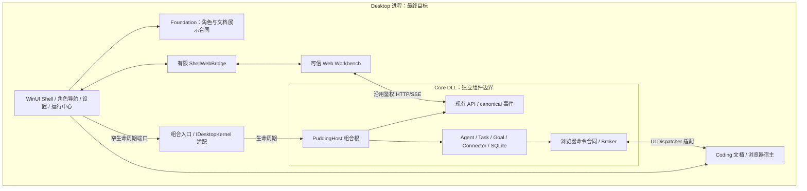

# PuddingDesktop：WinUI 3 工作台骨架、Core 接入与迁移计划

- 初稿：2026-09-26；修订：2026-09-27。
- 状态：**2026-09-27 用户追加裁定：原地重建 PuddingDesktop 为 WinUI 3，Core 已以 DLL 装配为进程内内核。原生角色卡、文字聊天与生命周期已接入，聊天直接调用 Core 应用服务；Agent 浏览器和其余富交互仍待迁移。**
- 用户输入：2026-09-27 WorkBuddy 三栏截图，作为布局参考；截图内聊天文字、网页和品牌不是需求指令。同日补充裁定：**PuddingAgent 是以角色为一等公民的 Coding Agent**。
- 决策记录：[Desktop / Core 边界 ADR](ADR-Desktop-WinUI3-Shell-Core-Boundary-2026-09-27.md)。
- 当前源码入口已改为 WinUI 3 骨架；旧 WPF 位于 `Source/PuddingDesktop.WpfArchive`，供测试/迁移参考。机器上运行中的旧产品未部署替换。当前源码已加载真实 Core DLL；验证使用隔离 DataRoot，未替换机器上运行中的旧产品。

## 0. 本次修订的裁定

1. 主线是 **WinUI 3 Shell + 角色优先的原生导航 + 中间角色工作会话 + 右侧编码工作区**。右侧使用统一文档标签骨架，浏览器是首个完整适配器；代码、Diff、终端和产物按能力接入。保留现有聊天、管理页面和浏览器驱动资产。
2. **Core 的最终形态为 Desktop 进程内 DLL 内核**（用户后续裁定，取代同日较早的长期独立子进程结论）。逻辑组件边界、唯一业务状态真源、独立测试不变。通过组合入口装配 `PuddingHost`，WinUI View 不直接调用 Runtime/SQLite；不承诺 ALC 热卸载或双模式永久维护。
3. **最新裁定：角色卡和聊天全部使用原生 WinUI 3 组件，当前已接入文字聊天闭环。** `PuddingChat.WinUI` 只依赖 `PuddingChat`；通过 Composition 中的 `InProcessChatClient` 直接调用 Core 应用服务，不使用 HTTP、JWT 或 WebView2 聊天。
4. 角色与模型管理暂保留独立 `/admin/` 页面，由用户点击“初始化与配置”进入；聊天不再依赖网页嵌入模式或 ShellWebBridge。
5. 工作台与第三方网页使用隔离的 Environment / 用户数据目录；S0 使用产品实际隔离配置验证。
6. 按组件化交付规程先独立构建、测试、边界检查，再接入。用户要求原地重建：唯一产品工程仍为 `Source/PuddingDesktop/PuddingDesktop.csproj`，不存在长期并行 WinUI 产品工程。WPF 归档只作旧测试基线；M0–M5 为迁移阶段，不替代组件门禁。
7. 旧版 49–77 人日估算作废；主线范围改变后，应在 M0 结束按组件盘点重新估算。

## 0.1 原生聊天体验与进程内消息流（2026-09-27 最新裁定）

审批迁移前置核查：现有 Web 审批卡的请求生产者和 Runtime 结果消费链路缺失，不能通过直接包装决定控制器完成原生迁移。真实工具审批票据、/authorize 与会话审批事件不是同一合同。设计、组件拆分和闭环门禁见 [原生审批接入方案](Desktop-Native-Approval-Integration-Design-2026-09-27.md)（Proposed，尚未实现）；待审批入口必须独立于历史/活动渐进窗口。

整体按聊天软件组织，但角色始终是一等公民：左侧工作空间与角色列表（头像、职责、状态、搜索），中间当前角色主会话与固定输入框，右侧按需打开编码产物。角色切换保存独立草稿与阅读锚点；新输出仅在用户已处于底部时跟随，阅读历史时显示“回到最新消息”。正文阅读宽度限制为 900 DIP，用户消息靠右，助手回复包含可展开的执行活动。

消息卡片以现有 Web `TurnContentStream.tsx`、`ReasoningDisclosureRow.tsx`、`ToolCallTree.tsx` 为行为基线，不移植 React 或 HTTP 协议：

| Web 行为 | Native 归属 | 当前实现 |
|---|---|---|
| 正文与活动按 canonical sequence 交错 | BCL `TurnFlow` → WinUI `TurnContentView` | 连续正文/思考分别成段，正文只渲染一次 |
| 思考输出可见、可展开 | `TurnContentView` 思考区 | 默认展开真实思考文本，不合成推理内容或耗时 |
| 工具调用与结果归并 | `TurnFlow` | 按 TurnId + ToolCallId 配对，展示输入、输出、状态与退出码；同名并行调用保持独立 |
| 稳定节点与折叠状态 | `MessageCard` / `TurnContentView` | 保留卡片和未变化的块，更新变化内容，不重建整个会话 |
| 历史过程水合 | `IChatClient.GetProcessAsync` | 历史明细按需直接调用 Core；活动 Turn 自动分批重放补齐 |

活动卡内容按需渲染：工具、子代理和其他折叠活动只创建标题控件，展开时使用当前 canonical 数据生成输入/输出 Markdown，收起即释放内容控件；折叠期间仍接收状态和结果更新。思考区继续默认展开并流式显示。500 个工具调用的窗口组件检查已覆盖此行为。

长 Turn 渐进展示：独立 BCL `FlowWindow` 默认显示最新 40 个内容块，顶部显式显示隐藏数量，每次展开更早 24 个；思考、正文、工具按既有顺序一起展示，不删除 canonical 数据。主动展开后以首个已展开块 ID 固定范围，追加活动不会收回旧记录；点击展开时保存可见块相对滚动视口的位置。`MessageViewState` 分别保存主内容和异常执行明细的范围，活动 Run 也保留独立范围，消息控件回收后能够恢复。窗口检查覆盖 100→120 个工具的范围保留和实际滚动偏移。渐进展开与消息级虚拟化共同限制初次创建量，但用户展开全部后仍会创建全部块，单个巨型文本块和全量数据归并的开销尚未消除。

调用链为 `WinUI → PuddingChat 端口 → Composition → Core 应用服务`。发送、取消、配置继续使用直接异步函数调用；`IConversationChanges.WaitForChangeAsync` 订阅已提交事件，Core 广播唤醒所有订阅者，原生端合并 40 ms 内的突发通知后通过 `IConversationActivity` 读取强类型活动差量，每批最多 256 条 canonical 事件。正文、思考和工具活动直接合并进当前会话；生命周期和未知事件回到 Core 权威投影。没有聊天 HTTP/SSE、JWT 或 DTO JSON 往返，也不读取 `StreamingEventBus` 的竞争消费通道。Core 的 Run/Turn 状态机仍是唯一执行真源；Desktop 只维护选择代次、草稿、阅读锚点、折叠和订阅生命周期。

已修复 `CommittedEventSignal` 的 Channel 竞争消费问题：保留单调 head、广播等待者、支持独立取消，覆盖先提交后订阅的竞态。投影读取前捕获 head，避免多查询投影末尾的较新游标确认尚未读入的事件。角色切换取消旧订阅；Core 停止时取消并等待进程内操作后释放宿主。

原生富文本使用 `MarkdownView`：Markdig 1.4.0 仅属于 WinUI 展示组件，解析 AST 后生成 TextBlock/Inlines、列表、引用、横向滚动表格与可复制代码块。支持标题、粗体、斜体、删除线、行内代码、任务清单、Web 链接和未闭合代码围栏。流式更新保留内容未变化的顶层块；引用链接定义变化会重新解析对应显示，避免陈旧 URL。HTML 按文字显示，不执行；只有 http/https 链接可点击，图片暂显示替代文本与地址。代码语法高亮、数学公式与图片/附件资源解析仍待后续迁移，不能把本轮基础 GFM 支持称为 Web 富文本完全等价。

执行活动补充：工具节点按显式 `ParentToolCallId` 建树，缺失父节点、跨 Turn 引用和循环关系保持为独立根节点；工具结果早于调用时仍保持结果终态，非零退出码不会显示成功。子代理使用 `DelegationExecutionId`（canonical payload 的 `run_id`）聚合创建/完成事件，同一个池化子代理的两次执行保留两张卡；没有执行 ID 时不按名称或会话 ID 猜测合并。原生区分超时、中断、取消与预算耗尽，主消息只显示任务与有界结果摘要。Core 保留原 Web 汇总 `Status`，增加精确委派状态供进程内适配器使用。工具生产者没有提供父调用 ID 时仍显示平铺根调用，不凭 UI 推断关系。

图片消息组件已接入：`IImageAttachmentClient` 定义进程内导入和受控本地预览，`ChatComposer` 提供原生多选图片与移除，`ChatSelection` 保存每个角色的附件草稿并冻结重试引用，`MessageCard` 内的 `ImageAttachmentView` 按需解码、缩放预览。Windows App SDK FileOpenPicker 使用当前 XamlRoot 的 AppWindowId 绑定窗口。Core 复用 VisionArtifactStorageService 验证真实图片、持久化 Artifact；SubmitTurn 传入 text/image typed parts，图片 detail 为 original，不发送本地路径、不自动代读、不伪造纯图片消息正文。UI 解码尺寸上限只影响预览，不改变模型输入原图。数量上限读取 Core 合同；收起或卸载预览释放图片，避免一次解码全部附件。图片选择对话框与真实视觉模型的手工验收仍需执行，当前自动化验证覆盖控件、导入、持久化和 PNG 解码。Markdown 内生成图片、相机和非图片文件仍待迁移。

剪贴板与拖放：输入框通过 TextBox.Paste 接收 Ctrl+V 图片，普通文字保持原生粘贴；提供“粘贴图片”按钮以覆盖纯图片时文本右键菜单可能不提供粘贴的场景。拖入文件显示添加到当前角色草稿的提示。`NativeImageTransfer` 读取 Windows DataPackageView 的 StorageItems/Bitmap，图片文件使用原路径，剪贴板编码流暂存于系统 Temp，导入结束（包括失败）后删除暂存文件，不重编码。异步读取开始前捕获角色并占用附件入口，期间切换角色不会误写新角色草稿。格式、数量与 Core 导入失败显示在输入框内，保留已成功的附件与文字；普通文件暂不作为图片接收。自动化覆盖真实 Windows 数据包与延迟提供者；系统剪贴板快捷键和 Explorer 拖放尚待手工验收。

运行中恢复：进入角色后，先将该活动 Turn 按固定快照游标分批补齐，再订阅新增事件，不再只保留最近 64 条活动。重放期间新提交的内容留给随后增量读取，避免持续输出让恢复永不结束。Core 校验会话/角色归属和根 Run，父输出只包含根 Run 的文本与同 Turn 的委派生命周期。BCL `ConversationActivity` 校验会话、Run、Turn、游标连续性并按事件 ID 去重；它不推断业务生命周期。窗口序列化快照/差量读取，角色取消可释放等待，晚到结果由选择代次拒绝。

历史翻页已接入：顶部“加载更早的消息”直接调用 Core，按 `CreatedAt + RowId` 的严格小于游标向前读取，每页最多 20 条展示消息，避免 offset 分页被新消息插入挤乱。窗口在插入前捕获当前阅读锚点，历史页不推进实时事件游标。已加载记录在最新投影刷新后保留，同 ID 消息使用最新内容；Message Fabric 信封跨页按 canonical identity 去重。最新页与已加载区间完全不重叠时保留补齐缺口的游标，不错误宣告已到开头。角色/主会话变化拒绝旧页，加载失败可重试，到末尾隐藏加载入口。

角色阅读恢复：每个角色只保存轻量 `ReadingBookmark`（会话 ID、消息 ID、创建时间、消息内偏移），不缓存旧控件或消息正文。切回时先读取最新权威会话，再按需翻页至目标消息，最后恢复滚动位置；读取期间显示恢复状态。主会话变化则跟随最新；找不到目标且游标已越过消息时间范围时停止查找。恢复中切走会取消等待，晚到页不能覆盖新角色，未完成恢复也不会覆盖原书签。书签仅存于当前窗口生命周期，尚未跨重启持久化。

消息控件虚拟化：`VirtualTranscript` 使用 `ItemsRepeater + StackLayout + IElementFactory`，只在视口附近创建原生消息控件，离开缓存区域后释放。数据行身份保持稳定，普通流式更新不拆掉仍在视口内的控件；离屏更新只改数据。`MessageViewState` 单独保留思考/工具展开、完整执行明细与图片展开状态，不保留旧控件；重新进入视口时重新创建控件，图片重新按需解码。阅读定位先实现目标行并布局，再提交一次滚动请求，避免异步 BringIntoView 覆盖消息内偏移。1000 条合成消息的真实 WinUI 窗口验证已通过，但这只是消息级 UI 虚拟化：已加载正文/事件数据仍留在内存，单个超长 Turn 内的行为块尚未虚拟化。

性能与迁移边界：普通流式活动已不再刷新整份会话，但仍查询持久事件并执行呈现归并，不是零查询或零分配。生命周期与未知事件保留整份权威投影刷新；角色列表状态仍每 15 秒刷新一次，当前会话不定时轮询。真实模型长会话的耗时/内存指标尚未测量。完整 Markdown/附件、子代理完整运行检查器、单 Turn 内行为块虚拟化、审批交互及真实模型长会话验收仍须逐项完成，不将本轮视为 Web 全量迁移验收。

异常终态的执行明细：失败、取消、执行租约丢失可能没有助手回复记录。此时在原始请求卡片显示终态与“加载完整执行明细”，直接从 Core 按会话、Turn 和根 Run 恢复正文片段、思考、工具与子代理活动；执行内容位于独立展开区，不混入用户输入，不伪造助手消息。明细不受活动快照的 64 条窗口限制；子代理正文不并入父回复，只纳入同 Turn 的委派生命周期。取消没有错误文本也显示状态，租约丢失显示失败。

## 1. 布局骨架：将参考图转为 Pudding 的职责分区

### 1.1 首版线框

```text
┌────────────────────────────────────────────────────────────────────────────┐
│ 面板 / 搜索 / 筛选   文件  编辑  窗口  帮助             拖拽区  ─ □ ×       │
├───────────────┬───────────────────────────────────┬────────────────────────┤
│ Pudding       │ 角色 / 项目 / 会话操作（原生）       │ 文件/Diff/终端/浏览器  │
│ 当前项目      │ 当前执行根 / 分支 / Run 状态       ├───────┬────────────────┤
│ 我的角色      │ 消息、推理摘要、工具调用、子代理    │ 概览  │ 文档专用工具条 │
│ 技能 / 连接器 │ 状态、错误与交付物（原生）          │ 产物  ├────────────────┤
│ 定时任务/知识 │                                   │ 活动  │ 第三方网页     │
│               │                                   │       │ 或产物预览     │
│ 角色下的会话  │                                   │       │                │
│ 工作区        ├───────────────────────────────────┤       │                │
│               │ 输入与发送（原生；附件等待迁移）│       │                │
│ 用户 / 设置   │                                   ├───────┴────────────────┤
│ Core 状态     │                                   │ Agent控制状态/接管     │
└───────────────┴───────────────────────────────────┴────────────────────────┘
```

| 区域 | 实现与组件名（拟） | 首版职责 |
|---|---|---|
| 顶部 | WinUI `TitleBarView`、`ShellCommandRouter` | 原生菜单、面板显隐、搜索入口、系统按钮、拖拽热区 |
| 左栏 | WinUI `NavigationPaneView` | 当前项目、角色列表及角色状态、角色下会话/任务、用户入口、Core 状态 |
| 中栏 | `PuddingChat.WinUI.ChatWorkspace` | 原生文字聊天、执行明细、草稿、发送、取消；管理页面独立打开 |
| 右栏 | WinUI `CodingWorkspaceView` + `BrowserWorkspaceView` 适配器 | 统一文档 Tab、按类型切换工具条、概览/产物/活动侧板；浏览器标签有地址栏 |
| 右栏内容 | `IWorkspaceDocumentHost`（拟）及各类适配器 | 代码/Diff/终端输出/网页/产物；功能按 capability 显示，不以浏览器 URL 模拟所有对象 |
| 设置 / 运行中心 | WinUI 原生视图，覆盖中间内容区域 | 无 Core、无 WebView2 Runtime、未设置 DataRoot 时仍能操作 |

左侧先选角色实例，再进入该角色的主会话或任务。截图中的“任务列表”不直接映射为 Pudding Task 状态机。“新建工作”必须显式绑定角色；不能默认把每次点击变成匿名聊天或新 Agent。显示名称可调整，实体必须用 `agentId` / `conversationId` / `taskId` / `workspaceId` 区分。

### 1.2 布局和交互规则

以下是待 M0 实测调整的初始设计值，单位为有效像素（DIP），不是设备像素：

- 顶部约 44–48；左栏默认 248、可调 200–320；中栏期望最小 480；右栏打开时默认占剩余宽度约 40%，期望最小 420。
- 用户可折叠左右栏、拖动分隔条；无文档时右栏可关闭，首次打开代码/Diff/终端/浏览器/产物或用户显式展开时出现，随后记住用户布局。
- 可用宽度不足时先折叠右栏内部侧板，再收起左栏，仍不足则由用户选择显示会话或右工作区。不得挤压到输入框不可用；不得销毁后台浏览器页面。
- 首版单主窗；右栏提供“在工作区内展开”。独立浮动窗口、跨窗拖 Tab 后续单列，不增加 M1–M3 范围。
- 用户上滚阅读消息时不强制拉回底部；打开右栏不重载中间会话。切换管理页前保留聊天草稿，恢复会话时恢复滚动锚点。
- `Ctrl+N` 路由到当前角色的新工作入口；未选择角色时先显示角色选择。全局搜索与“查找当前页”分开。编辑菜单的复制/粘贴/撤销按焦点路由到原生输入框或当前 WebView，禁止全局抢占 IME 组合输入。
- 深浅色、高对比度、键盘遍历、屏幕阅读器名称和 DPI 跨屏是首版门禁；参考图的配色、文案和品牌不直接复制。

### 1.3 内容生命周期

- `WorkbenchHostView` 在正常 SPA 路由切换时保持同一实例；不为每个会话建立浏览器环境。
- 切换到原生运行中心时隐藏 Workbench，保留可恢复的草稿；返回后重新核对 Core 状态和事件游标。
- Browser Page 的存活、可见、Agent 可操作三种状态分开。隐藏、折叠、最小化仅改变呈现，不自动取消 Agent 操作。
- 浏览器页面关闭是显式动作；若正在操作，先阻断新操作，再终止/结算在途操作并销毁页面。结果必须可观测，不能显示假成功。
- 会话关联浏览器是显示关联：保存 `workspaceId/conversationId/contextId/pageId` 的引用，不把 Page 所有权交给会话视图。首版不承诺跨 Desktop 重启保持活动 DOM、Locator 或未完成工具调用。

### 1.4 角色是一等公民：身份与工作模型

产品的主要操作对象是**有身份、职责、配置和持续工作状态的角色 Agent**。项目提供代码与执行边界，角色承担工作，会话承载沟通，Run 承载执行，右工作区呈现证据。这是导航、路由、日志关联和恢复的基础，不只是在聊天头加头像。

| 概念 | 现有映射 / 目标合同 | 不应混同 |
|---|---|---|
| 角色定义 | `AgentTemplateDefinition.TemplateId/Role/Responsibilities`，连同 Persona、Skill、能力、运行和记忆策略 | 不是模型名，不是 RBAC 权限角色，也不直接等于 `Skills.AgentRole`/`WorkerRole` 枚举 |
| 角色实例 | 项目/工作区内稳定 `agentId`；状态、未读、主会话与活动 Run 来自现有 Agent 投影 | 同模板多个实例仍是不同身份，不能按显示名合并 |
| 角色工作会话 | 复用 Agent 主会话和 `mainSessionId`/conversation 映射；历史工作可按 Run/Task 查看 | 切角色不重写旧会话的作者、不把旧角色草稿发给新角色 |
| 工作与执行 | 可选 taskId/goalId + turnId/runId；角色实例承担执行 | UI 选中角色不代表该角色正在执行，也不取消其他角色 |
| 项目上下文 | workspaceId + Core 解析的 repo/执行根/分支或 worktree（如可用） | Core 的 DataRoot、用户项目、命令工作目录不能混为一谈 |

现有 `Role` 是模板字段，不能宣称已经有独立 Role 表/全局 roleId。首版用 **模板来源作用域 + templateId** 表示定义引用，以 `workspaceId + agentId` 表示实例身份；全局与工作区模板 ID 不作未经验证的统一。若需独立角色目录、模板版本/快照、跨项目角色身份，另立 Core 领域设计，不在 Desktop 中发明持久业务主键。

**角色优先的导航**：左栏顶部项目选择；主体是角色列表（头像/名称/职责摘要/忙闲或等待输入/未读），选中角色下展开主会话、当前工作和历史。任务看板、项目文件、角色库、Skill/连接器、设置作为辅助入口。不强制“架构师→开发→测试”固定流程，角色由用户已有模板和实例配置决定。

角色头部常驻显示角色名称、职责、当前项目、实际执行根、模型与有效权限。模板默认值与本次执行有效值分开；当前执行根/分支拿不到时显示未提供，不能用 Desktop CWD 猜测。运行中变更角色配置由 Core 决定生效时点，UI 不追溯改写旧 Run，也不把角色切换理解为模型切换。

拟定义只读 `ActiveWorkContext` 投影，字段包括 `workspaceId, agentId, templateRef, mainSessionId, conversationId?, taskId?, runId?, executionRoot?, revision`。它由 Core/现有 Web 投影提供，Shell 持有选中引用。它不是新建数据库记录或客户端执行授权。日志、右栏文档和所有导航请求均携带可用关联 ID；执行请求以服务端重新校验为准。

角色切换流程：保存旧角色草稿/浏览位置 → 取消旧 UI 查询 → 获取目标 Agent 主会话 → 原子更新选中上下文与可操作按钮 → 恢复对应草稿。草稿按 workspaceId + agentId + conversationId 分区；加载失败保持旧上下文或显示明确未就绪，不能只换标题便允许发送。UI 请求带选择代次，旧角色的迟到响应不能覆盖新角色。发送期间角色变更不能修改已受理命令的接收者。

首版复用现有 Agent 主会话语义。若当前 API 不支持同角色并列新会话，“新建工作”进入主会话的任务/新工作输入，不擅自增加多会话生命周期。模板创建/编辑、实例创建、停用、历史查看都调用现有管理入口；切换角色不删除历史，不默认共享记忆，也不清理另一个角色的浏览器/终端。

### 1.5 Coding 工作区：代码与执行证据优先

右侧统一标签模型（拟）为 `DocumentId, Kind, ResourceRef, OwnerContext, PreviewOrPinned, State`。Kind 首版合同覆盖 `file/diff/terminal/browser/artifact`；底层是不同适配器，浏览器 PageId 仅用于 browser，不能作为所有文档的 ID。`OwnerContext` 明确 workspaceId、来源 agentId、runId，保留“谁产生/谁执行”和“当前谁在看”的区别。

| 类型 | 首版接入策略 | 不得误报的边界 |
|---|---|---|
| 代码 | 复用现有文件/产物读取能力，在右栏只读定位文件与行；无读取合同则 capability 禁用 | 编辑器、LSP、保存和冲突处理是独立功能，骨架不承诺已实现 IDE |
| Diff | 展示已有变更证据；显示来源 Run 与明确 base/head 或前后内容标识 | 无 Diff 服务时不从工具文本猜 patch，也不新增隐式 Git 写操作 |
| 终端 | 优先关联现有 Core terminal session / 工具输出，显示执行根、命令、退出状态 | 日志视图不标为交互终端；交互输入需现有或单列的受权 API，Desktop 不另启 Shell 绕开 Core |
| 浏览器 | 完整复用 Browser Bridge 与 WinUI Adapter，支持可见页/Agent 目标分离 | 打开网页不自动授予角色控制权 |
| 产物 | 关联角色和 Run，复用文件/HTML/图表等预览 | 不给产物脚本 Shell 或 ControlToken 权限 |

点击工具调用的文件定位、Diff、terminal session 或浏览器证据，在右栏打开对应标签；右侧“返回来源”能回到产生它的角色和 Run。消息区必须能看到计划/执行状态、工具调用、子代理委派、输入输出摘要、错误、测试与交付物，不能只保留最终回答。子代理轨迹带 parentRunId/childRunId 和 agentId（合同实际提供的字段），不伪装成用户手动创建的常驻角色。

选中角色默认筛选其文档，固定标签可跨角色保留并显示来源；不因角色切换改写文档所有权或工具执行目标。角色把工作交给其他角色必须经 Core 的委派/任务合同并有回执；在 Shell 中拖卡片、切头像不构成真实委派。

最低交付能力：角色选择与主会话连通、工具轨迹到右栏文档的定位、来源可回溯、浏览器实际可执行。代码/Diff/终端的实时数据合同先做盘点，缺失项显式登记，禁止以占位 Tab 宣称 Coding 工作区完成。

## 2. 总体架构和所有权




图中为最终目标；当前已实现 Shell/Foundation、Composition 真实内核适配和 Workbench WebView2。Core DLL 引用只属于组合边界；UI 状态组件不得反向引用内核。HTTP/SSE 可在同进程内继续保留，DLL 装配不自动等于无监听端口。

| 状态/能力 | 权威所有者 | Desktop 的职责 |
|---|---|---|
| 角色定义、Agent 实例、Conversation、Turn、Run、Task、Goal、权限、工具结果、持久事件 | Core | 呈现或发送已定义命令，不另建领域状态机 |
| 模型/Agent/Connector 配置、SQLite 数据 | Core | 通过既有管理 API 编辑；不直接打开业务数据库 |
| Core DLL 生命周期与发布操作 | Desktop 组合入口 + 进程外部署方 | 启动/停止/故障状态；程序集更新需退出进程，不能假设能原地替换已加载 DLL |
| 窗口/面板/焦点/选中导航 | Desktop Shell | 本地 UI 状态，不代表 Run 状态 |
| 当前角色工作上下文、消息投影、输入草稿、消息滚动 | Core 提供身份与执行事实，首版 Web Workbench 投影 | 复用现有 Agent 会话链；草稿和视图状态分角色，Shell 不再投影完整 transcript |
| 导航名称/数量/任务状态 | Core，首版由 Web 适配器提供摘要 | 原生导航只缓存分页摘要与选中项；失联明确标旧 |
| Browser Context/Page、可见标签和工具执行落点 | Desktop 浏览器组件 | 管理实例、UI 线程、执行落点、暂停/接管本地门控 |
| Agent 执行准入与审计 | Core；Desktop 再做本地安全门控 | 不因 Web 展示消息而新增 Agent 权限 |

### 2.1 工程划分与依赖约束

| 工程（拟） | 责任 | 允许的依赖 / 禁止的依赖 |
|---|---|---|
| `PuddingDesktop.Foundation` | UI 无关的监督策略、配置 DTO、启动协议、Shell 布局/命令合同 | `net10.0`、基础库；禁止 WPF、WinUI、WebView2、Host、Runtime、Platform |
| `PuddingDesktop` | 原地重建后的唯一 WinUI 产品入口、视图、主题、平台适配 | 显式引用 Foundation、Composition，禁用传递项目引用；视图编译时不可访问 Host/Runtime |
| `PuddingBrowser.Abstractions`、`.Protocol` | 已有浏览器抽象与跨进程消息 | 保持现有底层边界，不加入 WebView2 或 UI 类型 |
| `PuddingBrowser.WebView2` | 框架中立驱动、CoreWebView2、Surface/Dispatcher 窄接口 | Browser 抽象与 WebView2 Core；不引用任一 UI 宿主 |
| `PuddingBrowser.WebView2.Wpf` | 过渡期 WPF surface/dispatcher/presentation 实现 | 驱动 + WPF；不得反向引用 Desktop |
| `PuddingBrowser.WebView2.WinUi3` | WinUI surface/dispatcher/presentation 实现 | 驱动 + WinUI；不得反向引用 Desktop |
| `PuddingDesktop.WpfArchive` | 原 WPF 源码和测试基线 | 现有 `PuddingDesktop.Tests` 改指归档；不作为新产品入口，不与 WinUI 同进程装配 |

不一次性搬迁 `Bootstrap/Runtime/Storage/Browser/Diagnostics` 全目录。归档的 `DesktopBootstrapSignalService` 直接依赖 `DesktopApplicationCoordinator`，后者又持有 `MainWindow`，因此不能宣称“原样搬到基础库”。先按调用面定义最小端口，端口在消费它的组件内，宿主实现；无法脱离宿主的装配文件留在宿主，记录原因。

提取时保持命名空间和行为；组件提取与功能变化分别提交。已有配置服务若依赖 `PuddingCore` 的重配置类型，先盘点传递依赖，未完成边界拆分前留在壳侧，不能为了移动文件让 Foundation 引入 Core 业务闭包。

`IBrowserSurface` 保留 `PageId` 和 `CoreWebView2`；删除外露的 WPF `Control`，不替换成 `object HostElement`。控件获取与容器装配留在对应 UI 适配层。`IWebView2UiDispatcher` 接口保持窄，WinUI 实现必须处理队列关闭、拒绝排队、取消与异常，不能遗留永不完成的 Task。

### 2.2 编译期与测试边界

- Foundation 不含 UI/宿主项目引用；Shell 仅能访问下层 public 合同，组件不能调用上层类型。给组件引入宿主引用时，依赖闭包检查必须使构建失败，不能只靠文档自律。
- 无 UI 行为在独立测试进程验证；测试项目只引用被测组件。真正 WebView2/WinUI 线程亲和性用单独 harness 验证，不能以 mock 通过替代。
- 最终边界由项目依赖图、程序集可见性和构建期引用白名单共同约束；需要 UI 的类型不藏进 `object` 或反射绕开。
- 现有 `Tests/PuddingDesktop.Tests` 不全量改指 Foundation。逐组按真实依赖分配：纯策略进入组件测试；Coordinator/Bootstrap 装配测试保留宿主引用，WinUI 另建组合测试。

## 3. PuddingAgent 的接入方式

### 3.1 进程内内核启动与失败恢复（基础接入已实施）

1. `PuddingDesktop.exe` 启动 WinUI Shell，先显示设置/运行中心，再由组合入口加载内核；不得在 App 构造函数同步启动耗时数据库/索引任务。
2. Foundation 的 `IDesktopKernel` 暴露 Snapshot、StartAsync、StopAsync、DisposeAsync；Core 宿主适配器实现它，UI 不拿 `IServiceProvider` 或业务数据库实例。
3. 组合入口构建 Core Host 的独立服务容器，负责唯一生命周期；启动异常映射为 Failed，界面仍可修复。UI 和内核 Dispatcher/线程职责分开，长任务不阻塞 UI。
4. 原生聊天使用应用接口直接调用 Core，由 Composition 提供固定的 `single-user` 本机身份，无需账号口令，业务调用不经 HTTP。管理页面和外部接口仍可使用 Host HTTP；内容根/default-data/wwwroot 随发布包显式解析。
5. 普通内核停止需有界取消后台任务、解除事件订阅、关闭 DB/文件句柄。是否支持同进程再次启动必须独立测试；没有证据前以完整 Desktop 重启为恢复方式。
6. .NET 未处理异常、原生崩溃/OOM 仍可能结束整个进程；进程内设计不提供原有子进程崩溃隔离。外部部署/恢复工具负责新构建启动和崩溃后的恢复，不承诺 View 层 catch 可以兜住进程故障。
7. 关闭到托盘、显式退出、Windows 会话结束、真实配置修复和内核资源回收，在内核接入阶段完成；本轮骨架关闭即退出，未声称达到原产品生命周期对等。

当前由 `InProcessKernel` + `DesktopKernelFactory` 装配 PuddingHost，启动/停止/重启可用，关闭等待内核释放。默认数据根 `%LOCALAPPDATA%/Pudding/DesktopData`，配置为 StateRoot/desktop.kernel.json。Core 通过 DI 注入 `IDesktopServices` 直接调用原生页面导航或只读文档展示，DispatcherQueue 负责线程切换；不会直接持有控件，也不绕过业务权限。新版开发入口与 Desktop 共享数据根租约。既有旧进程必须先停止才能沿用其数据根。

### 3.2 三条通信通道

| 通道 | 使用者 | 身份 / 语义 |
|---|---|---|
| 聊天应用接口 | 原生控件 → Composition → Core | 直接函数调用；用户身份、统一 Turn 准入、幂等和 canonical 投影保留 |
| Browser 命令通道 | Core Broker ↔ WinUI 浏览器适配 | 保留 OperationId、deadline、准入/接管门控和结果合同；内核接入时用进程内 adapter 接 UI Dispatcher，现有 WebSocket 作为迁移参考，不重复建设工具语义 |
| ShellWebBridge | 可信 Workbench ↔ WinUI | 窗口展示、导航、有限摘要和状态；不是通用 HTTP/脚本代理，也不承担 Agent 执行准入 |

以下是保留的 Web/外部接口索引；原生聊天直接调用其应用服务，不请求这些 HTTP 入口：

- `GET /api/workspaces/{workspaceId}/agents/status`、`GET /api/workspaces/{workspaceId}/agents/{agentId}/conversation`：现有 `agentChatApi.ts` 使用的角色实例状态与主会话入口；原生导航复用其 Core 投影服务。
- `POST /api/v1/conversations/{conversationId}/turns`：发送；受理不等于执行完成。
- 同一路径下 `/{turnId}/cancel`、`/{turnId}/steering`：复用现有取消与引导语义。
- `GET /api/conversations/{conversationId}/bootstrap`：会话恢复入口。
- `GET /api/sessions/{sessionId}/events/stream`：支持 `Last-Event-ID` 或 `afterSequence` 补发。

`conversationId`、`sessionId`、`turnId`、`runId` 不互相冒充。首版直接复用现有前端 transport，本文不假定所有上述路径属于同一个 API 版本。

### 3.3 原生聊天直接接入 Core

`IChatClient` 是 BCL 应用端口。WinUI 控件负责角色选择、草稿和显示；`InProcessChatClient` 创建独立 DI scope，在后台线程调用 Core。角色是 `(workspaceId, agentId)` 实例，模板不是实例身份。客户端启动自动读取工作空间与角色，无登录界面、账号查询或口令校验；本机身份固定为 `single-user`，重启后直接可用。停机仍取消并排空旧客户端。Web/远程入口继续使用原有账号认证，禁止把本机免登录扩展为 HTTP 匿名访问。

- 查询：`WorkspaceAgentFileService`、`IAgentRunProjectionService`、`IAgentConversationProjectionService`。后两者已直接引用 `ISessionRepository`，不再向本机 HTTP 回绕。
- 主会话：Core `AgentMainSessionService` 负责创建、重定向与绑定。
- 发送：`ISubmitTurnHandler`，稳定 ClientRequestId/ClientMessageId；受理不是完成。
- 取消：`IRequestTurnCancellationHandler`，仅使用服务端 TurnId，取消回执不是已停止。
- 停机：拒绝新调用、取消并排空旧调用，再释放 Host。重启创建全新的适配器与 UI 控件。

### 3.4 本次投影范围与后续门禁

当前消费 Core 最近 20 条消息和有限活动事件窗口，活跃 1 秒/空闲 4 秒查询游标，隐藏页面暂停查询。历史明细按展开动作加载，按 canonical Sequence 排序；旧角色响应通过选择代次拒绝。未接入直接事件推送、完整历史分页、附件/语音/Live2D/审批卡；不将当前版本称为全部网页功能等价迁移。

完整实现、测试入口与留白以 [原生聊天实施记录](../Reports/Desktop-Native-Chat-2026-09-27.md) 为准。本节取代本文件早期阶段表中“Web 是唯一聊天消费者”“原生聊天属于后续项目”“导航必须经 Web 桥”的前提。后续浏览器适配和编码文档合同继续有效。
## 4. ShellWebBridge 合同（历史扩展参考；原生聊天不采用）

### 4.1 消息信封

```json
{
  "version": 1,
  "kind": "request",
  "type": "navigation.open",
  "requestId": "unique-id",
  "shellSessionId": "host-issued-id",
  "documentGeneration": 3,
  "payload": { "targetKind": "agent", "workspaceId": "workspace-id", "agentId": "agent-id" }
}
```

- `kind` 为 `request/response/event`。response 回显 requestId，返回 `status=completed|rejected`、结构化 error code；业务 accepted 状态放在业务结果中，不伪装 completed Run。
- 顶层导航导致 documentGeneration 更新并吊销旧请求。重建 Core 连接另有 core generation，不能混成同一个生命周期。
- Workbench 发 `bridge.hello`，宿主验证来源后回 `bridge.ready`（版本、capabilities、shellSessionId、generation）。重连重新握手，不自动重播命令。
- 请求默认超时初值 10 s、最多 32 个在途、单消息 64 KiB；均为可调初值。分页摘要拆批；大文件/截图用已有产物 ID，不走桥 Base64。高频状态合并，不能无限堆队列。
- 同一 document generation 内按 requestId 有界缓存响应；跨代次不接受重复执行。业务幂等使用现有 Core 请求合同，桥缓存不替代业务幂等。

### 4.2 首版消息表

| 类型 | 方向 | 行为与约束 |
|---|---|---|
| `bridge.hello/ready` | 双向 | 能力协商，未知必需版本失败可见 |
| `navigation.query/open` | host → web | 分页请求/导航意图，Web 按用户权限处理 |
| `navigation.snapshot/changed` | web → host | 受限摘要、选中路由；包含 revision，防旧快照覆盖 |
| `workbench.command` | host → web | 仅有限业务命令目录；禁止任意 URL、HTTP method、脚本执行 |
| `shell.panel.set` | web → host | 明确设置左右栏状态，使用幂等 set，不用可重复翻转 toggle |
| `browser.open` | web → host | 用户意图打开右栏网页；只允许规定 scheme，不赋予 Agent 操作权 |
| `artifact.show` | 双向 | 产物 ID 与显示位置，Core 校验访问权限；任意本地路径不作为授权 |
| `core.state.changed` | host → web | Core 状态和连接代次，不含 ControlToken |
| `shell.context.changed` | host → web | 当前面板/可见页摘要，不改变 Agent 目标 |
| `work.context.changed` | web → host | 已确认的角色/主会话/Run 引用及选择代次，不赋予执行权限 |
| `document.open/revealSource` | 双向 | 类型化资源引用与角色/Run 关联；验证项目范围，不接受任意本地路径执行 |

删除旧方案中有歧义的 `browser.takeover`：**人类接管/暂停是原生本地门控；Agent 操作仍经 Core → 受控浏览器命令适配**。若未来需要“授予 Agent 控制权”业务入口，先定义 Core 准入合同，不能仅增加一个 WebMessage。

### 4.3 信任与身份

- 只对可信 Workbench 控件的顶层文档启用桥。验证 `WebMessageReceived.Source` 的 scheme/host/port/path、实际导航代次和消息 schema；不接受 iframe/第三方页面伪造。
- 可信 origin 由产品/显式调试配置解析；不接受任意 localhost、任意端口，也不只比较 URL 前缀。
- 跳转至非工作台目标前撤销桥；新窗口/外部链接转交右侧非特权浏览器。结构化 PostWebMessage 通信，不拼接 ExecuteScript 字符串执行命令。
- Workbench 使用 `<DataRoot>/browser/workbench/user-data`；Agent browser 使用 `<DataRoot>/browser/contexts/{id}/user-data`。沿用现有隔离方向，不要求两边共用 Environment。
- ControlToken 只留宿主与认证控制链路，不能放 URL、前端 JavaScript、环境变量或日志。工作台摘要不得成为绕过 Core 授权的依据。

## 5. 右侧浏览器工作区与 Agent 控制

### 5.1 旧链路与 DLL 内核适配边界

```text
Core Agent Tool
  → RemoteBrowserRuntime / RemoteBrowserPage
  → DesktopBrowserCommandBroker
  → /desktop/browser-bridge
  → DesktopBrowserBridgeClient
  → BrowserBridgeCommandDispatcher
  → BrowserWorkspaceController
  → PuddingBrowser.WebView2 驱动
  → WinUI SurfaceHost / DispatcherQueue
```

上图为 WPF 归档的现有链路。DLL 接入时以本地窄端口替换进程间 transport，保留 OperationId 幂等、deadline、暂停/接管、Activity 证据和内核运行代次；不在 WinUI 新造一套 Agent 工具协议。所有 WinUI/WebView2 调用由 UI Dispatcher 执行；业务等待不能同步阻塞 UI 线程。

### 5.2 标签、会话与控制权

- `ActivePageId` 表示人正在看的标签；`AgentTargetPageId` 表示命令默认目标。当前代码已分开，迁移必须保留。
- 原生接管操作同时更新 Dispatcher 的准入门控和 UI 投影；只改 `BrowserWorkspaceController` 的显示状态不算生效。
- 本地人类接管后拒绝新 Agent 操作；在途操作按已有取消能力结算并显示状态。不能承诺已发出的网页点击可以回滚。
- 显式 pageId 的操作不得受用户切 Tab 影响。关闭目标页后命令返回 page_not_found/已定义等价错误，不能静默选另一个页面。
- Snapshot ref 必须保留 PageVersion；交互后用 Wait 或新 Snapshot 取状态，不重查旧 Locator。
- 首版支持一个 Agent context 内多 Tab，加一个隔离的 Workbench environment。当前 Controller 持单 `_context`；多 Agent context 同时存在需要独立 registry 改造与合同测试，不能标记成已有能力。
- “新建 Agent 浏览器”首版进入现有 context 生命周期；已有活跃 context 时不得静默替换或丢弃正在执行的页。多 context 产品入口在该切片验收前禁用。

### 5.3 概览、产物与执行轨迹

概览显示当前页标题/地址/加载状态；产物列表按工作区与会话关联、分页读取；活动显示 Agent/Run/ToolCall、起止时间、结果与可展开输入输出摘要。Core 持久记录为准，现有 Desktop 有界活动缓存只用于即时显示。

HTML/脚本产物进入无 ShellWebBridge 权限的独立预览 surface；普通网页无 ControlToken。下载、打开文件、定位产物沿用已有访问规则，不能因为文件来自 Agent 就自动信任。

### 5.4 呈现与执行分离

WPF 的 `WebView2PresentationGate` 操作 WPF `PART_image`，不直接移植。WinUI 先测可见/隐藏/最小化的 CPU 与行为，再决定是否需要适配器；验收关注空闲绘制开销与后台执行连续性，不只检查黑块。

不得用 Suspend、销毁 WebView 或停止页面脚本来“解决”隐藏窗口 CPU 而破坏正在执行的工具。无活动、允许挂起的用户标签可作为后续资源策略，不纳入迁移默认行为。

## 6. 原地重建、发布与恢复

- 唯一新产品入口是 `Source/PuddingDesktop/PuddingDesktop.csproj` → `PuddingDesktop.exe`。旧源码移至 `Source/PuddingDesktop.WpfArchive`，独立 AssemblyName，现有测试保留；这不是永久双壳产品策略。
- 本轮 Foundation 已独立测试后接入 WinUI，新的 UI 工程不加载旧 WPF；Core 由单独 Composition 层装配。临时验证工程在原地替换后撤除。
- 当前锁定 Windows App SDK `1.8.260921001`、SDK BuildTools `10.0.26100.9169`、WebView2 `1.0.4078.44`，非打包、Windows App SDK self-contained、win-x64；.NET 是否随最终产品打包由发布切片确定。本机验证不是干净机器验收。
- 骨架阶段使用独立的实例 key 与预览配置，避免干扰旧产品；在真实内核接入前必须恢复唯一产品实例/DataRoot 所有权门禁，不能同时读写同一业务数据。
- 发布现已包含 Core DLL 及其依赖、default-data、SPA。移除对子进程 exe 的最终发布要求，原生角色同步、Agent 浏览器适配、托盘及干净机器验收仍是产品交付门禁。
- DLL 被 Desktop 加载后，更新由进程外部署方执行：退出 → 核对回收 → 部署完整版本 → 启动并验证；不实现未经证明的 ALC 热卸载。
- 运行中心在内核启动失败时可用；硬崩溃的恢复必须依赖进程外工具。旧版已发布产物可用于版本级恢复，不靠删除 DataRoot 回滚。
- 骨架只保存主题/面板尺寸等展示配置，坏配置保留原文件并报告。内核配置由 desktop.kernel.json 单独保存，测试已覆盖隔离 DataRoot 的真实启动与资源回收。

## 7. 实施阶段与交付门禁

每个组件内部执行[组件化交付规程](../Conventions/组件化交付规程.md) S1–S5：独立工程 → 独立测试 → 无宿主验证 → 边界断言 → 接入。下面 M 编号是产品迁移阶段，不替代组件门禁。

| 阶段 | 交付范围 | 退出门禁 |
|---|---|---|
| M0 技术验证 | 独立 WinUI harness、隔离双 WebView2、发布试包、依赖盘点 | 下列 G0 全过；无宿主/DI/生产数据改动 |
| M1 骨架与组件 | Foundation 独立测试后原地重建 WinUI；角色导航、文档标签、原生设置/运行中心 | 骨架构建/窗口 smoke；角色上下文不串线。托盘/真实配置/全部 DPI 门禁仍待后续验收 |
| M2 Core DLL 与 Workbench | IDesktopKernel 适配、Host 容器/内容根/生命周期、嵌入模式、真实角色与主会话 | G1：真实内核启动/停止/失败修复、API/SSE、鉴权、资源回收；不以 Shell smoke 替代 |
| M3 Coding 工作区接入 | 单 context 多 Tab、Agent 既有控制链、文档适配器、来源回溯、接管与活动；代码/Diff/终端接口缺口单列 | G2：真实角色执行与证据定位、浏览器工具、目标稳定、取消/断线/最小化；占位文档不算能力完成 |
| M4 发布与日常验收 | 完整 Shell + Core DLL 包、干净机器、外部部署、故障注入和版本恢复 | G3：明确新构建、内核/产品生命周期和实际日常使用；业务数据不被恢复操作破坏 |
| M5 归档收口 | 完成真实产品对等后退役 WPF 归档/旧测试或迁移其必要测试 | WinUI 产品闭包无 WPF；完整构建、完整发布与业务验收，原生聊天不作前提 |

### 7.1 G0：必须用产品配置验证

- 双 WebView2 使用不同 Environment/UDF；左侧本地 Workbench、右侧第三方页面可同时显示交互。
- XAML Menu/Flyout/ContentDialog、侧板遮挡、焦点、拖动热区和系统按钮均正常；30 次尺寸变化、最小化恢复、100%/150%/200% DPI 跨屏无残影/输入错位。
- 测量空闲、流式输出、后台浏览器执行时的 CPU/内存/输入延迟；记录硬件、版本、数据规模和 WPF 对照，性能阈值据此冻结。
- 验证 WinUI WebView2 实际初始化 API 与中立驱动编译；不把 WPF API 名称套用到 WinUI。
- 非打包发布在缺失运行时的测试环境给出安装/自包含结果；WebView2 不可用时原生修复页面可开。
- 保留小型 harness 源码以供 SDK 升级回归；输出只能放仓库 `temp/build`、`temp/test-out` 或系统 Temp。锁定 SDK、WebView2 包/Runtime、OS build 后记录，不写“最新即兼容”。

不再把 WPF 与 WinUI 两套 Application 同进程共存作为必做验证；设计采用分开的可执行程序，不依赖该能力。

### 7.2 G1–G3：重点验收用例

| ID | 场景 | 通过条件 |
|---|---|---|
| P01 | DataRoot 缺失、Core exe 缺失、Core 启动失败 | Shell 可用，设置和运行中心可修复 |
| P02 | 当前角色新工作、发送、停止、steering | 只有既有 Core 命令链；受理/执行/失败状态区分 |
| P03 | SSE 中断、页面重载、Core 重启 | 无重复发送、无重复事件；恢复快照/游标，旧代次无效 |
| P04 | 原生导航与 Web 内部导航交替 | 选中项与标题一致；草稿/历史位置可恢复 |
| P05 | 恶意第三方/iframe/旧 generation 消息 | 不能调用 Shell 命令；失败有结构化诊断 |
| P06 | 切可见 Tab、切会话、折叠右栏 | Agent target 不漂移；后台操作不中断 |
| P07 | 人类接管、关闭活动目标、Bridge 断开 | 准入门控生效；在途操作有终态，旧命令不重播 |
| P08 | 多 Tab、Cookie 登录隔离、产物 HTML | Workbench 与第三方数据隔离，预览无特权桥 |
| P09 | 中文输入、键盘菜单、DPI、屏幕阅读器 | 输入无误触，焦点可达，系统按钮可用 |
| P10 | 托盘、第二次启动、退出与崩溃恢复 | 单实例唯一监督者，进程外确认 Core 退出/恢复 |
| P11 | Windows/SDK/WebView2 支持矩阵与发布包 | 干净机器可启动，无 dev-up/Node/Python 产品依赖 |
| P12 | 回滚旧壳 | 完整包可恢复，DataRoot 不清理，配置可读取 |
| P13 | 同模板不同角色实例、跨角色切换/迟到响应 | 身份、草稿、主会话、未读不串线，已受理命令目标不变 |
| P14 | 项目/角色/会话/Run 与文件或终端来源不同 | 明示来源和实际执行根；打开文档不迁移执行归属 |
| P15 | 角色委派、工具调用、变更/测试产物 | 可从轨迹定位证据并返回来源；无接口的 capability 显式不可用 |

每条记录状态只用“未开始/进行中/通过/失败”，通过必须链接日志、测试或截图证据。M0 冻结性能阈值，M4 至少连续 3 个实际使用日覆盖流式聊天/浏览器/托盘恢复；这只是迁移门禁，不代表长期稳定性全部证明。

内部开发测试交付 `ready-for-external-deploy`；外部控制器部署到明确版本后，新 Pudding 会话执行功能 smoke 并给出 `in-product-functional-complete`。启动、重启、崩溃、退出回收由外部控制器判定。

## 8. 文件级实施地图（待实施）

| 目标 | 文件/目录 | 动作与边界 |
|---|---|---|
| Foundation | `Source/PuddingDesktop.Foundation/`、独立测试工程 | 提取可独立测试策略与合同；不反向引用宿主 |
| 原生 Shell | `Source/PuddingDesktop/App.xaml`、`Shell/{ShellWindow,TitleBarView,NavigationPaneView,ShellCommandRouter,ShellLayoutState}` | 薄组合根、三栏布局、焦点/菜单路由 |
| 角色与文档骨架 | `Shell/ActiveWorkContext`、`Workspace/{CodingWorkspaceView,WorkspaceDocumentRegistry,IWorkspaceDocumentHost}`（拟） | 消费现有身份/投影；类型化文档，不在 Desktop 新建 Role/Run 数据库 |
| 工作台宿主 | `Source/PuddingDesktop/Views/WorkbenchHostView`、`Shell/ShellWebBridge` | 来源校验、握手、generation、加载失败与重连 |
| Core 接线 | `Source/PuddingDesktop.Foundation/IDesktopKernel.cs`、`Source/PuddingDesktop/Kernel/`；后续独立 Host adapter | 骨架已有未配置适配器；真实 DLL 装配/容器/启动停止待实现，不直接搬旧 supervisor |
| 部署与修复 | 归档 `Source/PuddingDesktop.WpfArchive/{Bootstrap,Debug,Configuration}/` | 保留既有语义；依赖 Coordinator 的文件不得批量搬进 Foundation |
| 浏览器底层 | `Source/PuddingBrowser.WebView2/IBrowserSurfaceHost.cs`、`IWebView2UiDispatcher.cs` 与 csproj | 去除 UI 类型泄漏，驱动与 WPF 适配拆开 |
| WinUI 适配 | `Source/PuddingBrowser.WebView2.WinUi3/` | SurfaceHost、Surface、DispatcherQueue；门控按 M0 结果决定 |
| 浏览器编排 | 归档 `Source/PuddingDesktop.WpfArchive/Browser/`、新 WinUI browser view | 接线既有 Broker/Dispatcher/Controller，不同时改多 context 语义 |
| 前端接入 | `Source/PuddingPlatformAdmin/src/desktop-shell/`（新） | bridge、navigation adapter、embedded mode；有类型白名单 |
| 前端布局 | `src/layouts/AdminLayout/`、`src/pages/chat/`、`src/pages/workspace/` 的实际外框 | 盘点后消除重复导航；保留业务和消息行为 |
| 测试 | 现 `Tests/PuddingDesktop.Tests/` + 新组件/WinUI harness | 按依赖逐组迁移，不把全部测试改引用指向一个基础库 |
| 发布 | WinUI csproj、既有 Desktop 发布/外部部署脚本 | 建立 Core DLL 完整性检查；Desktop 自更新由进程外负责，当前仅骨架包 |

拆分/命名空间变更后必须覆盖全部工程构建，不能只构建 Desktop。构建测试发布串行使用同一项目，输出不得进入 DataRoot。精确暂存、每原子切片验证后提交，保留其他任务 WIP。

## 9. 后续原生聊天的进入条件

不预定自研 `VirtualizingLayout`。先验证标准控件：`ItemsRepeater`/`StackLayout` 或适合的 ListView，再评估缺口。官方已有 `ScrollView.AnchorRequested`，旧版“无官方锚定 API”结论撤销；控件锚定仍不等于自动实现聊天的历史追加、用户上滚和底部跟随策略。

单独 spike 应验证流式变高、历史 prepend、异步图片、代码块展开、长 Markdown、选择复制、IME、辅助功能及合理规模的内存。只有实测显示现有布局不满足且原生收益明确，才设计自定义布局。

Markdown/公式/代码高亮/图表继续允许 Web；不默认每条消息嵌入 WebView2。性能预算与组件选择在该独立项目冻结，不使用旧版未经验证的包版本和“市场无可用件”结论作为依据。

## 10. 本次证据与未关闭项

### 10.1 迁移前本地代码依据（旧 WPF 文件现位于 WpfArchive）

- `Source/PuddingDesktop/PuddingDesktop.csproj`：WPF、独立 Core 发布、exe/SPA 断言。
- `Source/PuddingDesktop/Hosting/DesktopApplicationCoordinator.cs`：窗口耦合、Core/Workbench 地址分离和 Bootstrap 装配。
- `Source/PuddingDesktop/Core/CoreProcessSupervisor.cs`：启动监管、监听地址现状和启动租约。
- `Source/PuddingDesktop/Views/WorkbenchView.xaml.cs`：独立 Workbench UDF、WebView 加载与失败处理。
- `Source/PuddingDesktop/Bootstrap/DesktopBootstrapSignalService.cs`：直接依赖 Coordinator，非可直接整体迁移资产。
- `Source/PuddingDesktop/Browser/{BrowserWorkspaceController,BrowserBridgeCommandDispatcher,DesktopBrowserBridgeClient}.cs`：可见页/目标页分离、单 context 现状、本地门控、认证连接与代次。
- `Source/PuddingPlatform/Controllers/Api/{ConversationTurnsController,SessionEventsController}.cs`：发送/取消/steering、bootstrap 与 SSE cursor。
- `Source/PuddingPlatformAdmin/config/routes.ts`：独立 chat/workspace 路由；`layout:false` 不代表页面内部已没有自己的导航。
- `Source/PuddingCore/Platform/{AgentTemplateDefinition,AgentProjectionDtos}.cs`：角色定义字段、AgentStatusProjection/AgentRunView 身份链；`src/pages/chat/client/agentChatApi.ts`：Agent 主会话与 Agent 级有效权限查询。

### 10.2 官方参考

- [ScrollView.AnchorRequested](https://learn.microsoft.com/en-us/windows/windows-app-sdk/api/winrt/microsoft.ui.xaml.controls.scrollview.anchorrequested?view=windows-app-sdk-1.8)：锚点选择事件存在；实际锁定 SDK 的组合行为由 spike 验证。
- [ItemsRepeater](https://learn.microsoft.com/en-us/windows/apps/develop/ui/controls/items-repeater)：虚拟化与布局基础；它不是自带完整选择/焦点策略的列表控件。
- [WebView2 安全指南](https://learn.microsoft.com/en-us/microsoft-edge/webview2/concepts/security)：校验来源、导航和宿主能力边界。

### 10.3 未关闭项

| 未决项 | 关闭阶段 | 未关闭时的处理 |
|---|---|---|
| 锁定 SDK/.NET/WebView2/OS 支持矩阵与发布模式 | M0 | 不开始产品接入 |
| 双独立 Environment、浮层、DPI、隐藏时绘制表现 | M0 | 优先验证布局调整；单窗不可行则评审独立右窗口替代，不静默降级 |
| Foundation 提取清单与 Bootstrap 窄端口 | M1 前 | 耦合文件留宿主，不引入反向引用 |
| 前端各页面嵌入边界及草稿恢复现状 | M2 前 | 明确所需最小前端改动与契约测试 |
| 角色模板作用域映射、主会话恢复、Agent 状态列表服务端分页 | M2 前 | 复用真实 ID，不新造 roleId 或凭模板名合并实例 |
| 文件/Diff/terminal session 的读取、定位与授权合同 | M3 前 | 输出实际能力矩阵与缺口；只读展示和交互操作分别验收 |
| 导航摘要分页/认证失效、实际消息大小与性能阈值 | M2 | 默认初值不视为验收数据 |
| Desktop 自身外部部署与回滚执行入口 | M4 前 | 未定位并演练前不切默认产品入口 |
| 多 context registry / 多窗口 / 原生聊天 | 后续独立项目 | 不作为首版已具备能力 |

2026-09-27 后续已实现 WinUI 骨架与 Foundation，并将原 WPF 纳入归档测试基线。具体构建、窗口/双 WebView2 验证与未完成项见 [骨架实施记录](../Reports/Desktop-WinUI3-Skeleton-2026-09-27.md)。后续同日已接入真实 Core DLL，见 [进程内内核实施记录](../Reports/Desktop-Core-DLL-Integration-2026-09-27.md)；未改既有生产配置/数据库/运行数据。

### 2026-09-27：客户端首次使用

原生入口“创建工作空间与角色”使用 `WorkspaceSetupForm`，通过独立 BCL `IWorkspaceSetupClient` 直接调用 Core `LocalWorkspaceSetupService`。创建工作空间与首个角色无需管理员账号；已有工作空间/角色直接复用，不覆盖名称、模型或模板。可选择已配置且启用的非 embedding、未废弃模型；无模型可先创建角色，但不表示模型调用可用。

数据库工作空间先提交，角色由既有文件服务创建；角色写入失败保留工作空间，重试继续完成。进程内串行 gate 避免重复首角色，DataRoot 租约仍排除双 Host。UI 在保存期间阻止重复提交/关闭，失败留在表单，成功刷新并选中角色。服务商密钥不出 Core；模型新增/编辑尚留在“高级管理（Web）”，Web 认证和 Bootstrap 独立保留。

### 2026-09-27：模型与角色常用设置原生化

新增“模型与密钥”：创建/编辑服务商及单个聊天模型，包含 API 地址、启用状态、协议、上下文/输出上限；密钥显式保留、替换或清除。新增“编辑当前角色”：名称、职责、启用、主模型、角色类型和系统提示词。保存直接调用 Core，角色保存后刷新并保持选中；已有高级字段保留。

本轮不迁移价格窗口、配额编辑、embedding/语音模型、完整角色文档和权限审批，不新增服务商/模型删除入口，也不自动发出付费模型连接测试。Web 高级管理保留认证。

### 2026-09-27：默认数据目录修订

默认 DataRoot 为 `D:\data`。优先级为显式 `--data-root`、已保存 `desktop.kernel.json`、默认值；不自动覆盖用户已有配置。运行中心可在内核运行时编辑、保存及恢复默认目录；保存只更新下次启动设置，切换目录需重开 Desktop，不自动迁移数据。同目录 Host 租约继续生效，验证仍使用隔离临时目录。

### 2026-09-27：原生工具卡准入状态

进程内工具结果保留业务 Status 与原始 ExitCode，流式工具事件透传；原生卡区分“需人工决定”“等待依赖恢复”和普通失败。此项仅修复状态丢失，不意味着人工决定请求、Run 挂起/恢复或原生审批入口已接通；后续门禁见 Desktop-Native-Approval-Integration-Design-2026-09-27.md。

### 2026-09-27：消息明细加载与回收

原生 MessageCard 明细按消息/Run 绑定；Run 变化清理旧执行内容、取消旧等待并允许重新加载，释放控件时取消等待。晚到结果不能污染新 Run 或回收缓存，历史明细补充缺失事件而不覆盖当前较新的快照。独立原生窗口验证覆盖竞争、回收与错误重试；实际产品部署验收仍独立执行。

### 2026-09-27：输入区自适应

ChatComposer 宽度小于 480 DIP 时采用两行操作区，附件在前、停止/发送在后；宽度恢复后回到同一行。附件名称按剩余宽度省略，完整名称可通过提示读取，移除按钮保持可见。已通过 320/360/900 DIP 的独立原生窗口布局检查，包含重试按钮与长附件名；保留草稿和附件，不改变发送协议。

### 2026-09-27：独立原生代码块

CodeBlockView 承担代码语言、复制与自动换行交互；MarkdownView 在流式追加时保留同一代码控件/滚动容器，横向阅读位置与换行选择不因普通追加而重置。真实窗口测试覆盖未闭合围栏、追加与换行切换；语法高亮和公式仍是剩余功能，不以此项代替完整 Web 内容能力对等。

### 2026-09-27：原生语法高亮

CodeBlockView 已使用 ColorCode.WinUI 2.0.15 原生 Inline 着色，覆盖库支持的语言并归一常用围栏别名。高亮只属于展示层，复制读取原始代码；未知语言、长代码、高对比度或格式化不保真时显示完整纯文本。支持浅/深主题重绘；非打包宿主缺少高对比度通知时保留加载/更新时检查，不声称实时切换已验收。公式与完整富文本产品验收仍未完成。

## 原生文本文件上下文接入（2026-09-27）

已完成文本快照独立组件、原生选择/预览/移除、角色草稿隔离和直接 Core text 提交；不增加文件 HTTP 接口。范围、限制与未完成的 PDF/Office 等能力见 [文本上下文设计](Desktop-Native-Text-Context-2026-09-27.md)。组件 57 逻辑/132 窗口检查、真实 Core 3/3 通过；未发布当前 Desktop。

## 聊天自适应角色入口（2026-09-27）

原生 ChatWorkspace 在窄布局或宿主隐藏侧栏时保留标题“角色”入口，通过 WinUI Flyout 展示同一导航控件；恢复宽屏后还原偏好宽度与角色草稿。57 逻辑/139 窗口检查通过，含 320 DIP 整页与重复展开/收起。实现与范围见原生聊天实施报告；当前产品发布和完整 DPI/键盘/IME 矩阵仍待验。
