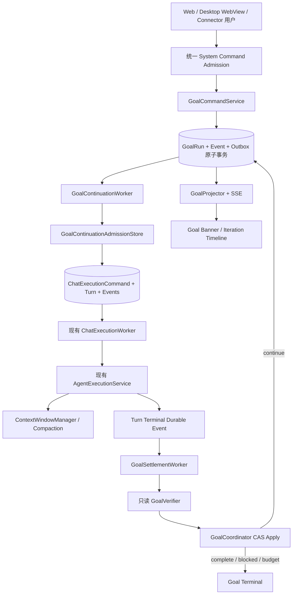
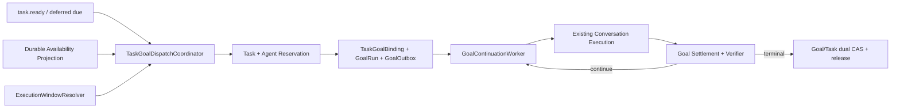

# Goal 持久目标、自主续行与自动压缩完整设计方案

> 状态：Proposed（完整目标设计，不代表已实现）
> 日期：2026-08-18；2026-08-21 增补 Task-bound Goal 集成
> 决策 ADR：[ADR-074 Goal 持久目标、自主续行与自动压缩](../07架构/89ADR-074Goal持久目标自主续行与自动压缩ADR.md)
> 适用入口：Admin Web Chat、PuddingDesktop 内嵌 Web 客户端、认证后的 Connector/Bot Channel
> 核心约束：Goal 自主续行不依赖 Heartbeat；单个 Goal 最多 256 个 Goal Iteration；Auto-dispatched WorkspaceTask 必须启动 Task-bound GoalRun；本方案不修改产品代码。
> 代码级落点：[Task-bound Goal 与 Agent 状态感知自动派发代码级施工计划](TaskBoundGoal与Agent状态感知自动派发代码级施工计划.md)

## 1. 结论

Pudding 应把 `/goal` 实现为一个持久、可恢复、可暂停、有证据门禁和有限预算的 `GoalRun`，而不是把“继续做”塞进 Heartbeat，也不是把现有单次 Agent Loop 的 `MaxRounds` 简单改成 256。

用户从网页、PuddingDesktop 客户端或授权连接器发送：

```text
/goal 尽你最大所能完成 XXXXX；以 YYYY 为完成证据；不得破坏 ZZZZ
```

服务端应当：

1. 通过统一系统命令入口创建一个持久 `GoalRun`；
2. 立即为当前会话和 Agent 投递第 1 个 Goal Iteration；
3. 每个物理 Turn settle 后，基于工具结果、文件/Artifact、测试、子代理和待办事实做一次只读验证；
4. 验证为 `continue` 时直接投递下一 Iteration，不等 Heartbeat，不等用户再说“继续”；
5. 验证为 `complete`、出现必须由用户解决的硬阻塞、被暂停/取消，或耗尽系统预算时停止；
6. 长会话达到上下文压力阈值时，调用既有自动压缩能力，在同一 Goal 上继续；Goal 的目标、预算和当前状态不依赖被压缩的自然语言历史；
7. 进程重启后保留 Goal 和证据，但默认停用自主续行，必须由用户显式 `/goal resume`，避免无人知晓的后台恢复。

“尽最大所能”在系统中的精确定义是：在目标完成、硬阻塞、安全门禁或有限预算任一条件触发前，持续选择有证据支持的下一步并执行；它绝不意味着无限轮次、提升权限、绕过审批、伪造完成或在无进展时反复自激。

## 2. 目标与非目标

### 2.1 目标

- Web、Desktop/WebView 和 Connector 都能发送同一组 `/goal` 命令。
- `/goal`、`/goal status` 等控制命令不创建普通 Agent Turn。
- Goal 创建后无需 Heartbeat 即可连续执行，默认且硬上限均为 256 个 Goal Iteration。
- 每一 Iteration 都是现有 Conversation/Turn/Command/Run 链上的正式执行事实，可重放、可取消、可观察。
- 目标完成必须由结构化证据验证，不接受“模型觉得差不多完成了”。
- 长运行中自动压缩上下文，压缩失败不得静默丢失目标、未完成项或工具调用配对。
- 用户消息、暂停、取消、审批和安全策略优先于自动 continuation。
- Core 重启、SSE 断线、Worker 崩溃和幂等重放不会重复启动同一 Iteration。
- 复用现有 Agent Loop、Conversation Event Store、ChatExecutionWorker、ContextCompaction 和权限体系，不建设平行执行引擎。

### 2.2 非目标

- 不支持一个会话/Agent 同时运行多个 Goal。
- 不把 Goal 当作通用定时任务、Heartbeat、WorkspaceTask 或 Workflow Graph 的替代物；WorkspaceTask 仍拥有任务状态和调度偏好，GoalRun 只在自动执行时作为持续执行控制面。
- 不允许 Agent 自己提升 Goal 轮数上限、权限、费用上限或峰谷优先级。
- 不在 PuddingDesktop/WPF 中实现 Goal 业务逻辑；Desktop 仍只承载产品 Shell 和 WebView。
- 不要求本阶段先完成整个通用 Plugin/Microkernel 重构；Goal 逻辑边界必须可插件化，但可以先在现有程序集内纵向落地。
- 不允许压缩摘要成为唯一证据源；原始事件、工具结果 Artifact 和验证事实仍可追溯。
- 不声明本方案中的任何类、表、接口或 UI 已实现。

## 3. 参考实现与 Pudding 现状证据

### 3.1 DeepSeek Harness

本地参考仓库：`E:\github\deepseek\deepseek-harness`。

关键证据：

| 位置 | 已确认语义 | Pudding 吸收方式 |
|---|---|---|
| `packages/goal/goal/src/index.ts`、`types.ts` | Goal 是同会话持久状态；默认 `defaultMaxGoalRounds=256`；状态变更带 revision/CAS | 采用持久 Goal 聚合、版本号和 256 硬上限 |
| `packages/goal/goal-round-driver/src/index.ts` | Agent idle 且 Goal active/armed 时主动投递下一 Round；普通用户消息优先；陈旧 reservation 不进入执行 | 使用 durable continuation outbox、session gate 和用户优先 admission |
| `packages/goal/goal-round-driver/src/prompt.ts` | 每轮显式带 objective、round/limit，要求以当前工作区和工具事实为准 | 使用可信 `GoalRuntimeContext` 生成 continuation，不从用户消息猜 Goal 身份 |
| `packages/goal/command-goal/src/index.ts` | `/goal` 命令直接读写 Goal，不需要模型参与命令解析 | 复用 Pudding 的 `SystemCommandHandler`，命令不创建普通 Agent Turn |
| `packages/goal/tool-goal/src/index.ts` | 直接用户才有 create/edit/resume 权限；模型只能在 Goal Round 中报告 complete/blocked | 用户拥有控制权；Agent 只能提出完成/阻塞建议，Coordinator 最终裁决 |
| `packages/compaction/*` | 压缩是独立能力；有 start/end 锁、safe span、tool pairing、checkpoint | Goal 只消费 Compaction，不在 Goal Driver 内实现摘要算法 |

Harness 的重要安全边界也应保留：恢复或 fork 后只恢复持久状态，不继承隐藏的自动续行权限；取消后 Goal 不应自动重新启动；每轮进入同一会话而不是复制一份会话前缀。

### 3.2 外部产品资料

- [Qoder Goal 命令参考](https://docs.qoder.cn/cli/goal-reference)：提供 `set/status/clear/pause/resume`、轮数和用时状态、重启后 active 降为 paused。
- [ZCode 目标模式](https://zcode.z.ai/cn/docs/goal)：强调每轮结束后的独立校验、证据完成、可视化摘要面板、中途介入与停止键自动暂停。
- [Codex Goals 使用指南（第三方整理）](https://xaicontrol.com/blog/codex-goals-guide/)：把 Goal 描述为“持续目标契约”，建议目标明确 outcome、verification、constraints、boundaries、iteration policy 和 blocked stop condition。该文是二手资料，只用于产品语义参考，不作为实现合同来源。

### 3.3 Pudding 当前可复用基础

| 当前基础 | 源码位置 | 设计判断 |
|---|---|---|
| 统一 Slash Command 解析 | `Source/PuddingCore/Tools/ToolAuthorization.cs` 的 `SystemCommandParser` | 增加 Goal grammar，不新建前端私有 parser |
| Web 系统命令入口 | `Source/PuddingPlatform/Controllers/Api/SystemCommandsController.cs` | `/goal` 沿用认证 HTTP 入口 |
| Web Chat 路由 | `Source/PuddingPlatformAdmin/src/pages/chat/hooks/useMessageSend.ts` | 当前 `/...` 已走 `executeConversationSystemCommand`，可直接扩展 |
| Connector 命令入口 | `Source/PuddingHost/Services/MessageGatewayIngress.cs` | 当前先拦截 Slash Command，再按 whitelist 鉴权和幂等回复 |
| 命令持久回执 | `Source/PuddingPlatform/Services/Conversation/SystemCommandHandler.cs` | Goal 命令继续写 user/system transcript pair，但交给独立 Goal Command Service 执行业务事务 |
| 正式 Turn 受理 | `Source/PuddingPlatform/Services/ConversationAcceptanceStore.cs` | Synthetic Goal Turn 必须复用 Message/Batch/Command/Turn/Event 事实，不直接调用 Runtime |
| 执行 Worker | `Source/PuddingPlatform/Services/AgentChat/ChatExecutionWorker.cs` | Goal Turn 仍由同一个 lease/coordinator/Runtime 链执行 |
| 内层 Agent Loop | `Source/PuddingRuntime/Services/AgentExecutionService.cs` 及 Buffered/Streaming partial | 继续负责一个 Turn 内的 LLM/Tool Round，不持有 Goal 外层循环 |
| 完成策略 | `Source/PuddingRuntime/Services/AgentLoop/CompletionPolicy.cs` | 当前 MVP 对 `DONE` 直接接受，不足以作为 Goal 最终完成门禁 |
| 自动压缩 | `Source/PuddingRuntime/Services/ContextWindowManager.cs` | `TrimHistoryAsync` 在发送模型前检查 context health，并触发 auto compaction |
| 压缩覆盖合同 | `Source/PuddingCore/Runtime/ContextCompactionContracts.cs` | `CompactionCoverageManifest` 可作为“完整覆盖后才提交”的基础 |
| Conversation Event Store | `Source/PuddingCore/Platform/ConversationEventContracts.cs` 等 | Goal 生命周期进入同一 durable event/replay-to-live SSE 体系 |
| Session 单飞 | `ISessionExecutionGate`、ChatExecutionWorker 的 session lock | 用户 Turn、Goal Turn 和其他自动工作不得并发执行同一 Agent Session |

### 3.4 必须正视的现状缺口

1. `SystemCommandParser` 尚不认识 `/goal`。
2. `SystemCommandHandler` 目前只有 Help/Status/Compact/Yolo 等分支，没有 Goal 聚合或 CAS。
3. `ConversationAcceptanceStore` 把受理输入固定视作普通 user message，没有 Goal source、优先级和确定性 iteration identity。
4. `ChatExecutionWorker` 以 2 秒 polling 发现 Command；这能恢复但不是低延迟 event wake，Goal 需要 signal + durable scan。
5. 当前 `AgentExecutionGuardrails.MaxRounds` 默认支持到 600 个内层 LLM Round；它与 256 个外层 Goal Iteration 语义不同。
6. 当前 `CompletionPolicy` 对 Agent `DONE` 直接批准，不能证明完整目标已经满足。
7. 自动压缩已存在，但 Goal 还没有独立的 durable state/context layer；只靠 transcript 摘要会遗失目标版本、预算和未满足项。
8. 手动 `/compact` 当前可能创建 successor conversation；Goal 需要原子 rebind 或迁移到同会话 checkpoint，不能在旧会话继续。
9. Heartbeat 当前可唤醒 Agent，但它没有 Goal revision、iteration id、完成验证和 continuation 幂等语义，不能承担本功能。
10. 现有 `GoalModeService` 使用 Agent 目录下 `goal_queue.json` 和自然语言 MessageEnvelope 模拟有界注入，不是本方案的 GoalRun；它没有 Goal/Iteration/Verification/Outbox 持久事实。
11. 现有 Task Dispatcher 主要完成手工派发，可用性主要来自进程内 Registry；Message Delivery Dispatcher 还可能批量合并多条非前台消息。这些都不能作为“一 Task 一 GoalRun”的生产语义。

## 4. 术语冻结

| 术语 | 精确定义 |
|---|---|
| `GoalRun` | 一个用户授权的持久目标聚合；拥有 objective、状态、预算、版本、当前会话和 Agent |
| `Goal Iteration` | Goal Driver 自动受理的一个完整 Conversation Turn；最多 256 个 |
| `Agent Loop Round` | 单个 Turn 内的一次 LLM 请求/响应迭代；由现有 AgentExecutionService 管理 |
| `Verification` | Turn settle 后对完成证据、未满足项、阻塞和下一步的只读裁决；不算 Goal Iteration |
| `Continuation` | Verification 为 continue 后，为下一 Goal Iteration 创建的 durable intent/Command |
| `Activation Epoch` | create/resume/replace 时递增的自动续行代际；旧 epoch 的结果和 outbox 不能推进新状态 |
| `Progress Fingerprint` | 由代码根据文件/Artifact/Tool/Test/Task 等事实计算的无进展判定摘要，不含 Secret 和大正文 |
| `Hard Blocker` | 必须由用户、审批、权限或外部状态解决，继续消耗轮次没有意义或不安全的条件 |
| `Soft Failure` | 可通过重试、换策略或进一步诊断解决的失败，不应立即冒充 blocked |

最关键的不变量：

```text
Goal Iteration != Agent Loop Round
256 限制 Goal Iteration，不修改现有 Agent Loop 的全局 MaxRounds。
```

一个 Goal Iteration 可以包含多个内层 LLM/Tool Round；因此必须同时存在外层 256 上限、单 Iteration 内层预算和 Goal 生命周期累计资源预算。

## 5. 总体架构



### 5.1 组件职责

| 组件 | Owner | 职责 | 明确禁止 |
|---|---|---|---|
| `GoalCommandService` | Platform（实现 Core 合同） | create/status/edit/replace/pause/resume/cancel/clear 的事务和鉴权 | 不调用 LLM，不直接执行 Agent |
| `GoalRunStore` | Platform | Goal/Iteration/Verification/Outbox 的 SQLite 持久化、CAS、lease、fencing | 不解析自然语言完成状态 |
| `GoalContinuationWorker` | Platform | 从 durable outbox claim continuation，做最终 admission 并创建正式 Turn | 不直接调用 `AgentExecutionService` |
| `GoalSettlementWorker` | Platform | 消费 terminal facts，为精确 Goal Iteration 创建 verification job | 不相信 UI 文案或日志字符串 |
| `GoalVerificationExecutor` | Runtime | 用只读 evidence capsule 调用 verifier，返回严格 schema | 无工具、无文件写、无 spawn、无 Goal 写权限 |
| `GoalCoordinator` | Platform | 组合 deterministic gates 与 verifier verdict，CAS 应用下一状态 | verifier 不能直接提交终态或下一 Turn |
| `GoalContextContributor` | Runtime | 从可信 `GoalRuntimeContext` 生成模型可见目标/轮次/下一步 | 不从 message text 猜 Goal ID |
| `GoalProjector` | Platform | 从 durable facts 生成 snapshot + cursor 增量 | 不从聊天自然语言推断状态 |
| `Goal UI` | Admin Web | 展示状态、预算、证据和命令按钮 | 不持有权威 Goal 状态机 |

### 5.2 Heartbeat 的边界

Goal 的以下动作均不得由 Heartbeat 驱动：

- 首次启动；
- 下一 Iteration；
- verifier 调度；
- transient retry；
- compaction 后恢复；
- Core 重启后的状态判定；
- 用户 pause/resume/cancel 的生效。

Heartbeat 可以继续服务其原有“周期性唤醒/检查”用途，但即使所有 Agent 的 heartbeat interval 都为 0，Goal 仍必须完整运行。Goal continuation 的唤醒来自已提交事件/outbox signal；数据库扫描只承担崩溃恢复，不承担业务节奏。

## 6. 命令与多客户端合同

### 6.1 统一 grammar

```text
/goal
/goal status
/goal <objective> [--rounds N]
/goal set <objective> [--rounds N]
/goal edit <objective>
/goal replace <objective> [--rounds N]
/goal pause
/goal resume
/goal cancel [--reason <text>]
/goal clear
```

语义：

| 命令 | 语义 |
|---|---|
| `/goal`、`/goal status` | 只读当前 Goal snapshot，不创建 Agent Turn |
| `/goal <objective>` | `/goal set` 的简写；当前无未终结 Goal 时创建 |
| `/goal set` | 创建新 Goal；若存在未终结 Goal，返回 conflict，并提示使用 edit/replace |
| `/goal edit` | 修改 objective，objectiveVersion 和 activationEpoch 递增；撤销旧 continuation |
| `/goal replace` | 原子取消旧 Goal 并创建新 Goal；必须显式使用，避免无意覆盖 |
| `/goal pause` | 撤销未 claim continuation；当前已开始 Turn 在安全边界取消/收口后暂停 |
| `/goal resume` | 对 paused/blocked 且仍有预算的 Goal 创建新 activationEpoch 并立即续行 |
| `/goal cancel` | 保留 Goal 卡片和完整历史，终态为 cancelled |
| `/goal clear` | 写 clear tombstone 并移除 current pointer；若 Goal 未终结，事务内先 cancel |

约束：

- objective 去除首尾空白后必须为 1–4000 个 Unicode 字符；多行内容保留。
- `N` 必须是 `1..256` 的十进制整数；非法值返回明确错误，不能静默忽略。
- 默认 `N=256`，部署和用户均不能把单个 Goal 的 lifetime 上限提高到 256 以上。
- objective 中的 `pause`、`resume` 等单词只是数据；只有精确子命令位置才是控制语法。
- `/goal` 的状态变更命令属于 privileged system command；`status` 为 read-only。
- Connector 继续使用现有 whitelist/绑定身份；未经授权的外部用户不能创建或恢复 Goal。
- 每条命令必须携带稳定 `ClientRequestId`/消息 ID，重复投递返回第一次提交结果。

### 6.2 Web 与 Desktop 客户端

Admin Web 当前已把 `/...` 发送到：

```text
POST /api/v1/conversations/{conversationId}/system-commands
```

因此前端不增加另一套 `/goal` parser。只需要：

- Command Palette 增加 Goal 项；
- 显示服务器返回的结构化 Goal snapshot；
- 控制按钮调用同一个 Goal Command API；
- PuddingDesktop 的 WebView 自动获得同样能力；
- 如果未来 WPF 增加原生命令框，也只能调用 Core HTTP API，不能在 Desktop 内维护 Goal 状态。

### 6.3 Connector/Bot Channel

`MessageGatewayIngress` 继续拦截 Slash Command，并把它交给 `ISystemCommandHandler`。Goal 返回文本回执和结构化 metadata；不能把 `/goal` 原文再转发给 Agent。

只有 Goal Driver 创建的 synthetic continuation 才进入 Agent，且 canonical source 是 `system:goal-continuation`，不是外部用户。模型协议可以使用 user-role wake message，但存储、UI、审计和权限必须保留真实来源。

### 6.4 结构化 Control Plane API

除了 Slash Command，按钮和管理页面使用结构化 API：

```text
GET  /api/v1/conversations/{conversationId}/goals/current?agentId={agentId}
POST /api/v1/conversations/{conversationId}/goals/commands
GET  /api/v1/goals/{goalRunId}
GET  /api/v1/goals/{goalRunId}/iterations?cursor=...
GET  /api/v1/goals/{goalRunId}/verifications?cursor=...
```

写命令 DTO 至少包含：

```json
{
  "commandId": "client-stable-id",
  "action": "pause|resume|cancel|clear|edit|replace",
  "expectedVersion": 7,
  "objective": "optional",
  "maxIterations": 256,
  "reason": "optional"
}
```

Slash Command Service 在事务内读取当前 version 并做 CAS；结构化按钮显式传 `expectedVersion`。陈旧写返回 `409 goal_stale_revision` 和最新 snapshot。

## 7. 状态机

### 7.1 GoalRun 状态

```text
active
paused
blocked
completed
budget_exhausted
cancelled
failed
```

`executing`、`verifying`、`queued` 不属于 GoalRun 顶层 phase，它们属于当前 GoalIteration/Outbox。这样用户 pause 时不需要把多个并发状态压进一个枚举。

### 7.2 合法转换

| From | Command/fact | To | 说明 |
|---|---|---|---|
| none/terminal | create | active | 新 goalRunId、version=1、epoch=1 |
| active/paused/blocked | edit | 原 phase 或 active | version/epoch 递增，旧 outbox 失效 |
| active | pause/stop/cancelled turn | paused | 不自动续行 |
| paused/blocked | resume | active | 新 epoch；lifetime counter 不清零 |
| active | verified complete | completed | 必须通过 deterministic gates + verifier |
| active | hard blocker / repeated soft blocker | blocked | 保存稳定 code、message、evidence refs |
| active | lifetime budget exhausted | budget_exhausted | 不能通过 resume 绕过 256 上限 |
| non-terminal | cancel | cancelled | 撤销 pending continuation |
| any | integrity/runtime fatal | failed | Error ID 和恢复方法必须持久化 |

`complete`、`budget_exhausted`、`cancelled`、`failed` 是不可恢复终态；继续工作必须创建/replace 新 Goal。可恢复的基础设施、路由或验证故障应进入带 Error ID 的 `paused`，而不是滥用 `failed`；用户修复后显式 resume 会创建新 epoch，且不能复用旧 lease。

### 7.3 Activation/重启 fence

`active` 还必须携带：

```text
activationEpoch
activationBootId
aggregateVersion
```

Goal Worker 只有在 `activationBootId == currentCoreBootId` 时才可投递 continuation。Core 启动时 Reconciler 将旧 boot 的 active Goal 原子转换为 `paused(reason=runtime_restarted)`，且必须在 Goal Worker 开始 claim 前完成。

这比“重启后自动继续”更安全：状态和产物仍在，但不会在用户不知情时恢复高成本或有副作用的工作。

## 8. 256 轮与资源预算

### 8.1 计数规则

- `maxIterations` 默认 256，硬上限 256。
- 只有 synthetic Goal Turn 被原子受理并写出 `turn.accepted` 时才消耗一个 Goal Iteration。
- 只创建 outbox、被用户消息抢先、CAS 失败或 stale epoch 被 suppress 的 continuation 不消耗 Iteration。
- 普通用户 Turn、`/goal status`、Verification、Compaction 和底层 LLM transparent retry 不消耗 Goal Iteration。
- 已受理后被用户停止或执行失败的 Goal Turn仍消耗该 Iteration，避免反复取消绕过上限。
- Iteration 编号严格递增且不复用，范围为 `1..maxIterations`。

### 8.2 外层与内层预算

建议初始系统配置：

```json
{
  "goal": {
    "enabled": false,
    "defaultMaxIterations": 256,
    "hardMaxIterations": 256,
    "maxAgentLoopRoundsPerIteration": 32,
    "maxTotalToolCalls": 4096,
    "maxActiveElapsedSeconds": 86400,
    "maxWallClockSeconds": 604800,
    "maxVerifierAttemptsPerIteration": 3,
    "maxConsecutiveNoProgress": 3,
    "maxConsecutiveSameBlocker": 3,
    "maxConsecutiveInfrastructureFailures": 3,
    "resumeAfterRestart": false,
    "maxObjectiveChars": 4000
  }
}
```

说明：

- `maxAgentLoopRoundsPerIteration` 是 Goal 专属的单 Turn 上限，传入 `RuntimeDispatchRequest.MaxRounds`；不得更改全局 `AgentExecutionGuardrails.MaxRounds`。
- Token/cost 上限应由 Workspace Policy/Provider quota 额外提供；缺失计价时仍由 iteration/tool/time 上限兜底。
- `maxActiveElapsed` 不计 paused/peak-deferred 时间；`maxWallClock` 从创建开始计自然时间。
- Goal resume 只清零连续失败/无进展计数，不清零 lifetime iterations、tool calls、tokens、cost 或 active elapsed。
- 配置文件可以降低默认值；任何请求级参数都不得超过系统 hard cap。

### 8.3 预算终态

到达以下任一条件后，不再创建 continuation：

- `iterationsStarted >= maxIterations`；
- total tool calls 超限；
- active elapsed 或 wall clock 超限；
- Workspace token/cost quota 超限；
- verifier/基础设施连续失败达到阈值；
- circuit breaker 打开。

系统写 `goal.budget_exhausted`，输出已完成内容、最后证据、未完成项和创建新 Goal 的建议；不得把预算耗尽伪装成 completed。

## 9. Event-driven 自主续行

### 9.1 创建和首次投递

`/goal set` 的单事务：

1. 校验用户、Workspace、Conversation、Agent、Objective 和系统配置；
2. 检查同一 `(conversationId, agentInstanceId)` 没有未终结 Goal；
3. 写 `goal_runs`；
4. 写 `goal.created`、`goal.activated` Conversation Events；
5. 写 `goal_outbox(kind=continuation, iteration=1, epoch=1)`；
6. commit 后 signal Goal Worker；
7. 返回 Goal snapshot。

若第 6 步进程崩溃，Worker 重启后的 durable scan 会发现 outbox；不依赖 Heartbeat 补偿。

### 9.2 Continuation admission

Goal Worker claim outbox 后按顺序检查：

1. Goal 仍是 active；
2. goal version、epoch、boot ID 与 outbox 完全一致；
3. Iteration 尚未受理且未达 256；
4. 没有 pause/cancel/replace tombstone；
5. 同一 Session 没有正在执行或已受理的 Goal Iteration；
6. 用户/steering/approval 消息优先；有更高优先级输入则把 outbox 延后并重新评估；
7. `WorkAdmissionFence`、权限、quota 和 Agent availability 允许；
8. 当前 Conversation 是 Goal 的 `currentConversationId`，不是压缩前的旧 successor；
9. 通过后原子写 synthetic message、AcceptanceBatch、ChatExecutionCommand、ConversationTurn、`turn.accepted`、`goal.iteration.accepted` 并增加 counter；
10. commit 后唤醒现有 ChatExecutionWorker。

Synthetic message metadata：

```json
{
  "sourceType": "goal_continuation",
  "sourceKind": "goal",
  "goalRunId": "...",
  "goalVersion": 7,
  "activationEpoch": 2,
  "iteration": 18,
  "objectiveVersion": 3,
  "causedByVerificationId": "...",
  "automationExclusion": "goal_continuation"
}
```

`automationExclusion` 防止 synthetic message 再触发 `message_event` automation、机器人回环或另一个 Goal。

### 9.3 模型可见 continuation

Runtime 从可信 `GoalRuntimeContext` 生成固定结构，而不是照抄一段可伪造的用户文本：

```text
<goal_iteration>
Objective: "...JSON quoted..."
Iteration: 18/256
Last verified progress: ...
Next action: ...
Unmet criteria: ...

Continue working toward the objective in this same session. Treat the current
workspace, durable event facts, artifact references, and fresh tool results as
authoritative. Make concrete progress and verify it. Do not mark the goal
complete merely because a plan or narrative was produced.
</goal_iteration>
```

Goal state作为 `goal-state` Context layer 放在动态用户尾部前，不污染稳定 system/tool prefix。旧 Iteration prompt 可被 compaction 遮蔽，当前 Goal snapshot 每轮重新注入。

### 9.4 用户输入优先

- 用户普通消息进入同一 Conversation 时，未 claim continuation 让行。
- 若 synthetic Turn 已受理但尚未开始，优先队列可以取消该 Command，并在用户 Turn settle 后重新验证是否仍需继续；已消耗 Iteration 不回退。
- 若 Goal Turn 已开始，用户使用现有 steering/stop 机制；stop 必须同时将 Goal pause。
- 普通用户 Turn 不消耗 Goal Iteration。它完成后，如果 Goal 仍 active，则其新事实进入下一次 Verification，再决定 continuation。
- `/goal pause|cancel|replace|clear` 高于普通 steering，立即使旧 epoch 失效。
- Goal continuation 不得抢占正在执行的用户 Turn，也不得与同 Session 工具副作用并发。

### 9.5 暂时错误

Provider 的 3–5 次透明指数退避重试仍位于 LLM 调用层，Goal 只看到一个逻辑成功或失败。Goal 外层不能因一次流式 delta 后重试而重复工具副作用。

物理 Turn 失败后：

- 明确不可重试的权限/配置/安全错误：立即 blocked/failed；
- 可重试基础设施错误：创建带 `dueAt` 的 durable retry outbox，最多 3 次同类失败；
- 每次 retry 仍使用同一 Iteration/Run 恢复合同或创建明确的新 attempt，不重复 `turn.accepted`；
- 达阈值后 pause/blocked，并保留原 Error ID、异常身份和尝试记录。

## 10. 证据驱动的完成验证

### 10.1 为什么不能复用当前 DONE

当前 `CompletionPolicy` 的 MVP 行为是 Agent 发出 `DONE` 就接受。对普通单 Turn 可以暂时成立，对 `/goal 尽最大所能完成...` 不成立，因为：

- Agent 可能只写了计划；
- 测试可能未跑或失败；
- 子代理、工具或审批仍 pending；
- 目标可能包含多个 acceptance criterion；
- 长上下文压缩后，模型可能遗漏早期未完成项；
- 输出文案无法替代文件、命令、事件和外部状态证据。

因此 Agent 的 `DONE` 在 Goal 中只形成 `goal.completion_proposed`，不直接写 completed。

### 10.2 Evidence Capsule

GoalSettlementWorker 从 canonical facts 构造有界、可追溯的 capsule：

```json
{
  "goal": {
    "id": "g1",
    "objectiveVersion": 3,
    "objective": "...",
    "iteration": 18,
    "maxIterations": 256
  },
  "turn": {
    "turnId": "...",
    "runId": "...",
    "terminal": "completed",
    "stopReason": "done"
  },
  "facts": {
    "changedFiles": [{"path": "...", "sha256": "..."}],
    "artifacts": [{"id": "...", "sha256": "..."}],
    "toolResults": [{"callId": "...", "tool": "...", "status": "succeeded"}],
    "verifications": [{"command": "...", "exitCode": 0, "artifactRef": "..."}],
    "pendingSubAgents": [],
    "pendingApprovals": [],
    "unresolvedTodos": []
  },
  "previous": {
    "unmetCriteria": [],
    "nextAction": "...",
    "progressFingerprint": "sha256:..."
  }
}
```

大正文进入受保护 Artifact，capsule 只保留 hash、大小、有限 preview 和 locator。Secret、ControlToken、provider key 和未授权文件内容不得进入 verifier 输入。

### 10.3 Deterministic gates

在调用 verifier 前后，代码必须执行：

- 有 pending tool/subagent/approval/required TODO 时不能 complete；
- 必需测试有失败事实时不能 complete；
- objective 指定的文件/命令/指标没有对应 evidence ref 时不能 complete；
- Goal version/epoch 已变化时丢弃 late verdict；
- Turn 未到 canonical terminal 时不开始 Verification；
- 相同 `goalRunId + epoch + turnId + verifierContractVersion` 只创建一次 Verification；
- verifier 不能把确定性的 `unchanged progress` 改成“有进展”；
- unsafe 或越权建议不能生成 continuation。

### 10.4 Verifier 合同

Verifier 无工具、无文件写、无网络、无 spawn、无长期记忆，只接受 Evidence Capsule，返回严格版本化 JSON：

```json
{
  "schemaVersion": 1,
  "verdict": "continue|complete|blocked|needs_user|unsafe",
  "summary": "...",
  "satisfiedCriteria": ["..."],
  "unmetCriteria": ["..."],
  "nextAction": "...",
  "blocker": {"code": "...", "message": "..."},
  "evidenceRefs": ["event:...", "artifact:..."],
  "confidence": 0.0
}
```

应用优先级：

```text
cancel/pause/stale epoch
  > unsafe / approval / permission hard blocker
  > budget / circuit breaker
  > deterministic completion gates
  > verifier verdict
```

`complete` 必须所有 gate 通过且 verifier evidence refs 非空。Verifier 调用失败最多重试 3 次；仍失败则 `paused(reason=verification_unavailable)`，不能默认 continue 或 complete。

### 10.5 Blocked 策略

- Hard blocker：需要用户选择、审批、凭据、权限扩展、不可逆操作授权或外部状态变化，立即 blocked，不浪费后续 Iteration。
- Soft failure：困难、不确定、单次测试失败、单次网络错误或仍有可尝试路径，不算 blocked。
- 同一 soft blocker fingerprint 至少连续 3 个 Goal Iteration，且每轮确实尝试了合理替代后，才可进入 blocked。
- 连续无 ProgressFingerprint 变化达到 3 次，触发 `goal.circuit_opened(code=no_progress)`。
- blocked 回执必须列出已尝试内容、最后证据、所需用户动作和 `/goal resume` 条件。

## 11. 自动上下文压缩

### 11.1 复用而不复制

Goal 不实现自己的摘要器。每个 Goal Turn 仍在模型请求前经过：

```text
ContextWindowManager.TrimHistoryAsync
  -> GetHealthAsync
  -> ShouldAutoCompact
  -> Pre-Compaction Flush
  -> ContextCompactionService.CompactAsync
  -> rehydrate current history
```

当前 `ContextCompactionOptions.AutoCompactionThreshold` 默认 0.65；Goal 不复制这一阈值，避免两份策略漂移。

### 11.2 Goal 压缩不变量

1. `goal_runs`、iteration counter、budget、current verifier outcome 和 activation epoch 永不只存在于 transcript。
2. 当前 Goal snapshot 由 `GoalContextContributor` 每轮重新注入，旧 Goal prompt 可安全被摘要遮蔽。
3. 压缩范围必须保持 tool call/result 原子配对；不能留孤儿 tool result。
4. `CompactionCoverageManifest.OmittedCount` 必须为 0，才允许把源消息标记 `CompactedBy`。
5. 压缩摘要至少覆盖：原始目标、objective version、已完成事实、未满足项、最后验证结论、下一步、blocker、关键 artifact refs。
6. Verifier 仍以 canonical event/artifact 为证据，不能只读取压缩后的叙述。
7. Compaction 失败时不删除/遮蔽源消息；Goal 根据 context health 决定继续、一次 overflow compact-and-retry 或 pause。
8. 压缩生命周期必须带 `compactionId + goalRunId + iteration + traceId`，但 `compactionId` 与 trace/idempotency 语义不得混用。
9. Compaction 自己的摘要请求设置 `SuppressContextAutoCompaction=true`，禁止递归。

### 11.3 Context overflow 恢复

一个模型请求最多一次：

```text
provider confirmed context overflow
  -> close failed request attempt
  -> auto compact with complete coverage
  -> reassemble context
  -> retry logical request once
```

若单个保留单元、Goal anchor、工具 schema 或当前请求本身就超过窗口，普通 surface compaction 无法解决；Goal 转为 paused/blocked，回执指出具体 oversized unit 和可操作的修复方式。

### 11.4 Manual `/compact` 与 successor conversation

目标架构默认同会话 checkpoint，不因压缩改变 Goal/Conversation identity。当前手动 Compact 仍可能创建 successor，因此过渡实现必须满足：

- 只在 Goal 没有 executing/verifying Iteration 时开始 manual compact；
- compaction + successor + Agent main-session rebind 成功后，原子更新 `goal_runs.current_conversation_id` 并递增 version/epoch；
- 旧 conversation 上的 outbox、verification 和 late event 全部因 epoch/version fence 失效；
- successor 创建或摘要语义失败时不迁移 Goal；
- Web/Connector 回执返回新 Conversation ID，Goal banner 从 snapshot 重载；
- 最终迁移到 same-session checkpoint 后删除该过渡分支，不保留长期双路径。

### 11.5 压缩完整性前置门禁

Goal 的 256 轮压力会显著放大历史压缩风险。生产启用前必须证明：

- active message 分页/Map-Reduce 覆盖完整，而不是只总结最新固定 80 条；
- `CoverageManifest` 与 `CompactedBy` 在同一事务；
- summaryGenerator 记录实际使用的 generator 和 degraded 状态；
- semantic failure 不切换 successor；
- 工具结果完整原文可通过 Artifact/事件追溯；
- Goal 100+ Iteration 的多次 compaction 后，目标、未满足项和证据引用仍一致。

## 12. 持久化模型

### 12.1 `goal_runs`

主要字段：

```text
goal_run_id PK
workspace_id
current_conversation_id
agent_instance_id
objective
objective_version
status
blocked_code / blocked_message
max_iterations
iterations_started / iterations_settled
activation_epoch / activation_boot_id
aggregate_version
created_by_user_id / source_channel
permission_snapshot_hash / policy_snapshot_hash
route_snapshot_json
active_elapsed_ms / total_tool_calls / input_tokens / output_tokens / cost
consecutive_no_progress / consecutive_same_blocker / consecutive_infra_failures
last_progress_fingerprint
last_verification_id / last_next_action
created_at / updated_at / terminal_at
```

约束：

- partial unique：`(current_conversation_id, agent_instance_id) WHERE status IN ('active','paused','blocked')`；
- `max_iterations BETWEEN 1 AND 256`；
- counters 非负且 `iterations_started <= max_iterations`；
- 每次 mutation 使用 `aggregate_version` CAS。

### 12.2 `goal_iterations`

```text
goal_run_id + activation_epoch + iteration_no UNIQUE
status = accepted|running|settled|cancelled|failed
command_id / turn_id / run_id / trace_id
accepted_sequence / terminal_sequence
stop_reason / error_id
started_at / settled_at
llm_rounds / tool_calls / usage totals
progress_fingerprint
```

物理 Turn IDs 是事实引用，不允许从 Goal ID 或 Session ID 反推。

### 12.3 `goal_verifications`

```text
verification_id PK
goal_run_id / activation_epoch / iteration_no
source_turn_id / source_terminal_sequence
contract_version / route_snapshot
status = pending|running|succeeded|failed
verdict / summary / unmet_criteria_json / next_action
blocker_code / blocker_message
evidence_refs_json
raw_output_artifact_ref / raw_output_sha256
usage / cost / error_id
created_at / completed_at
```

Unique：`(goal_run_id, activation_epoch, source_turn_id, contract_version)`。

### 12.4 `goal_outbox`

```text
outbox_id PK
goal_run_id / activation_epoch / aggregate_version
kind = continuation|verification|notification|retry
idempotency_key UNIQUE
payload_json
status = pending|leased|completed|cancelled|dead_lettered
due_at / lease_owner / lease_until / fencing_token
attempt_count / last_error
created_at / completed_at
```

Outbox worker 先按 `due_at` 和 lease claim，再次校验 Goal CAS 和 Session admission；旧 epoch 永远只能 suppress，不能“帮忙”恢复。

### 12.5 事实与投影

`goal_runs` 是聚合当前状态和 CAS owner；每次状态转换与相关 Conversation Event 在同一 SQLite 事务提交。UI、SSE、审计和学习只消费 committed facts。

事件最小目录：

```text
goal.created
goal.edited
goal.activated
goal.paused
goal.resumed
goal.cancelled
goal.cleared
goal.completed
goal.blocked
goal.budget_exhausted
goal.failed
goal.iteration.accepted
goal.iteration.started
goal.iteration.settled
goal.verification.requested
goal.verification.completed
goal.verification.failed
goal.continuation.requested
goal.continuation.dispatched
goal.continuation.suppressed
goal.progress.recorded
goal.circuit_opened
```

Envelope 规则：

- `CorrelationId = goalRunId`；
- `CausationId` 指向命令、terminal event 或 verification event；
- `RunId` 只表示物理 Agent/Verifier Run，不拿 goalRunId 代替；
- `SourceKind` 新增 `Goal`；
- `ProducerComponent` 明确为 `goal.command`、`goal.continuation`、`goal.verifier` 或 `goal.coordinator`；
- payload 只保存结构化状态和 artifact locator，不保存 Secret。

## 13. 权限、安全与执行模式

### 13.1 Goal 不提升权限

Qoder 会在 Goal active 时切到 auto 权限模式；Pudding 不照搬。Pudding 在 Goal 创建时冻结：

- 当前用户和 channel authority；
- Workspace/Agent capability；
- Tool permission snapshot；
- approval policy；
- model/provider route snapshot；
- WorkAdmission policy version。

Goal continuation 不能将 Normal/Safe 自动升级成 Yolo，不能用 objective 文本绕过 `IExecutionControlService`，也不能访问用户未授权的 DataRoot、Secret 或浏览器 Profile。

### 13.2 Approval

需要审批时：

1. 当前物理 Turn 进入现有 waiting approval 事实；
2. Goal 不创建下一 continuation；
3. UI/Connector 告知待审批项；
4. 审批结果是高优先级输入；
5. approval accepted 后由事件驱动恢复当前 Turn 或显式 Goal resume，仍不使用 Heartbeat。

### 13.3 Prompt injection

- objective 以 JSON quoted 数据放入固定标签，不能改变外层系统合同。
- Web 页面、工具输出、仓库文件和 verifier capsule 的外部文本均标记 untrusted。
- Verifier 没有工具和写权限；其 verdict 只是建议，Coordinator 执行 deterministic gates。
- GoalRuntimeContext 的 ID、epoch、iteration 和预算来自服务端，不接受模型回填。
- Agent 的 `propose_complete`、`report_blocked` 工具只能操作当前 Runtime 注入的 Goal，参数中不接受任意 goalRunId。

### 13.4 Destructive actions

“尽最大所能”不扩大用户授权范围。删除、覆盖、发布、发送外部消息、购买或其他高风险行为继续遵循现有审批与权限。缺少授权属于 Hard Blocker，不允许为了“完成 Goal”自行假设。

## 14. Agent 工具合同

完整目标设计提供三个模型工具：

```text
get_goal()
propose_goal_complete(summary, evidence_refs[])
report_goal_blocked(code, message, evidence_refs[])
```

规则：

- create/edit/pause/resume/cancel/clear 只属于用户 Command，不暴露给普通 Agent。
- `get_goal` 只读取当前注入 Goal snapshot。
- `propose_goal_complete` 只写 proposal fact，不能写 completed。
- `report_goal_blocked` 在 Hard Blocker 可立即建议；Soft Blocker 仍受连续阈值 gate。
- 工具结果必须返回最新 aggregate version 和 proposal ID。
- Goal Verifier 不拥有这些工具。

第一实现切片可以只依赖 Turn terminal + verifier，不强制 Agent 主动调用 proposal 工具；但生产完成判定必须统一走同一个 GoalCoordinator，不能形成两种终态 writer。

## 15. UI 与用户体验

### 15.1 Goal Banner

Chat 顶部显示：

- objective；
- active/paused/blocked/completed/budget exhausted；
- Iteration `18 / 256`；
- active time、wall time、tool/token/cost（可得时）；
- 最近 verified progress、未满足项、next action；
- 当前阶段：queued/executing/verifying/waiting approval；
- Pause、Resume、Cancel、Clear、查看证据。

### 15.2 Timeline

- synthetic Goal Iteration 显示为“第 N 次目标迭代”分隔行，不使用用户头像。
- Verification 显示 verdict、evidence refs、耗时和 route，不展示隐藏 chain-of-thought。
- Compaction 显示 compacted 范围、before/after tokens、generator、degraded 和 artifact locator。
- blocked/budget exhausted 回执包含准确恢复方式。
- 历史和实时使用同一 event projector；重连先 GET snapshot，再从 cursor watch/SSE 追增量。

### 15.3 Command 回执

Web/Connector 的 `/goal status` 示例：

```text
Goal active · iteration 18/256
Objective: 修复全部失败测试并保持公开 API 不变
Verified progress: 43/47 tests passed; 2 files changed
Unmet: 4 tests; API compatibility check
Next: isolate the shared timeout failure
Active time: 00:42:17
Commands: /goal pause · /goal cancel · /goal edit ...
```

该文本是 presentation，不是权威状态；客户端不能解析它来驱动按钮。

## 16. 配置

系统配置优先放 `<DataRoot>/config/system.json` 对应的 Runtime/Goal section，或项目既定的配置文件化入口，不把 Goal 默认策略塞进数据库。Workspace quota 可以收紧预算；Task 的执行时段偏好以 `Task.executionWindow` 为权威，低价时段由现有 LLM provider/model 配置扩展字段提供，不新增工作区 `work-policy.json`。

必须配置/解析：

- enabled；
- default/hard max iterations；
- per-iteration Agent Loop budget；
- cumulative time/tool/token/cost budgets；
- no-progress/blocker/infra failure threshold；
- verifier provider/model/timeout/max tokens；
- restart behavior（必须默认 false）；
- work admission/quiet hours；
- objective/evidence capsule size limits。

Verifier route 必须冻结到 Goal snapshot；配置变更不悄悄改变进行中 Goal。不可解析的 route 导致 Goal paused，并在 UI 保留原配置，不可静默 fallback 到任意模型。

## 17. 文件级实施图

### 17.1 PuddingCore

新增：

- `Source/PuddingCore/Goals/GoalContracts.cs`：ID、snapshot、phase、command、result、runtime context。
- `Source/PuddingCore/Goals/GoalStateMachine.cs`：纯状态机与不变量。
- `Source/PuddingCore/Goals/GoalVerificationContracts.cs`：Evidence Capsule、verdict、executor seam。
- `Source/PuddingCore/Goals/IGoalCommandService.cs`、`IGoalQueryService.cs`。
- `Source/PuddingCore/Goals/GoalEventTypes.cs`。

修改：

- `Source/PuddingCore/Tools/ToolAuthorization.cs`：增加严格 `/goal` grammar、help 和 privilege 分类。
- `Source/PuddingCore/Platform/ConversationContracts.cs`：Goal event 常量；不改变现有 Turn/Command 状态语义。
- `Source/PuddingCore/Platform/ConversationEventContracts.cs`：`ConversationEventSourceKind.Goal`。
- `Source/PuddingCore/Platform/MessageContracts.cs`：增加可信 `GoalRuntimeContext`/ExecutionPurpose，不从 MessageText 推断。
- `Source/PuddingCore/Runtime/ITurnExecutor.cs`：透传 Goal execution context。

### 17.2 PuddingPlatform

新增实体/存储：

- `Data/Entities/GoalRunEntity.cs`
- `Data/Entities/GoalIterationEntity.cs`
- `Data/Entities/GoalVerificationEntity.cs`
- `Data/Entities/GoalOutboxEntity.cs`
- `Data/Entities/TaskGoalBindingEntity.cs`
- `Services/Goals/GoalSchemaBootstrapper.cs`
- `Services/Goals/GoalRunStore.cs`
- `Services/Goals/GoalCommandService.cs`
- `Services/Goals/GoalQueryService.cs`
- `Services/Goals/GoalContinuationAdmissionStore.cs`
- `Services/Goals/GoalContinuationWorker.cs`
- `Services/Goals/GoalSettlementWorker.cs`
- `Services/Goals/GoalCoordinator.cs`
- `Services/Goals/GoalRestartReconciler.cs`
- `Services/Goals/GoalProjector.cs`
- `Services/Goals/TaskBoundGoalCommandHandler.cs`
- `Controllers/Api/GoalCommandsController.cs`
- `Controllers/Api/GoalQueriesController.cs`

修改：

- `PlatformDbContext.cs`：DbSet、索引和约束。
- `Services/Conversation/SystemCommandHandler.cs`：委托 `IGoalCommandService`，不内嵌 Goal 状态机。
- `Services/ConversationAcceptanceStore.cs`：抽取可复用的原子 acceptance primitive；普通用户入口保持原合同。
- `Services/ExecutionLeaseStore.cs`（实际 lease owner 文件）：人类/steering/approval 高于 Goal continuation；同优先级保持 FIFO。
- `Services/AgentChat/ChatExecutionWorker.cs`：commit signal + durable scan，Goal metadata 透传；不增加 Goal 业务分支。
- `Services/Conversation/CompactionSessionSuccessor.cs`：过渡期 Goal rebind 事务/fence。
- `Services/Conversation/RequestTurnCancellationHandler.cs`：停止 Goal Turn 时 pause Goal。
- Conversation projector/checkpoint：Goal snapshot/replay。

### 17.3 PuddingRuntime

新增：

- `Services/Goals/GoalContextContributor.cs`
- `Services/Goals/GoalVerificationExecutor.cs`
- `Services/Goals/GoalEvidenceSanitizer.cs`
- `Services/Goals/GoalTools.cs`

修改：

- `AgentExecutionService` Buffered/Streaming：只透传 Goal identity、usage/progress facts 和 per-iteration budget；禁止内嵌外层 continuation loop。
- `ContextPipeline.cs`：增加 `goal-state` 动态层，保持稳定 prefix。
- `ContextWindowManager.cs`：compaction event 加 goal correlation；复用阈值。
- `ContextCompactionService.cs`：保证 coverage/tool pairing/actual generator 事实满足 Goal 门禁。
- `RuntimeAgentDispatcher.cs`、`TurnExecutorAdapter.cs`：透传 Goal runtime context。
- `Services/Messaging/MessageDeliveryDispatcher.cs`：Task-bound Goal 不参与普通多消息批合并；每次受理保留唯一 Task/Assignment/Goal 上下文。

### 17.4 PuddingHost

- 在 Runtime/Platform DI 扩展中注册 Goal contracts、store、workers、verifier 和 projector。
- Composition validation：Goal enabled 时必须恰有一个 store、command service、continuation worker、verification executor 和 projector。
- 启动顺序：schema -> restart reconciler -> workers -> Connector acceptance。
- `MessageGatewayIngress.cs` 继续复用系统命令入口，不增加第二套 Goal handler。
- Heartbeat service 不引用 Goal Driver，Goal Driver 也不引用 Heartbeat service。

### 17.5 PuddingPlatformAdmin

新增：

- `pages/chat/components/GoalBanner.tsx`
- `pages/chat/components/GoalIterationTimeline.tsx`
- `pages/chat/hooks/useGoal.ts`
- 对应 reducer/interaction tests。

修改：

- `CommandPalette.tsx`：Goal 命令提示。
- `useMessageSend.ts`：继续统一 Slash Command 路由，消费结构化 Goal result。
- `services/platform/api.ts`：Goal snapshot/command/query DTO。
- Conversation event reducer/type：Goal lifecycle、iteration、verification、compaction correlation。

### 17.6 PuddingDesktop

第一阶段不需要 Goal 业务代码。Desktop 内嵌现有 Admin Workbench 即获得命令和 Banner。只有未来增加原生通知/托盘进度时，才消费 Core 提供的只读 projection，不引用 PuddingRuntime/PuddingPlatform。

## 18. 分阶段施工计划

### G0：冻结合同与测试夹具

目标：先冻结术语、状态机、命令 grammar、事件、256 计数和 multi-channel contract。

步骤：

1. 增加 Core Goal 值类型和纯状态机测试。
2. 为 `/goal` parser 建立中文、多行、引号、非法 rounds、4000 字符、子命令歧义测试。
3. 建立 Conversation Event、Goal snapshot 和 synthetic message fixture。
4. 冻结外层 Iteration/内层 Agent Round 的不同字段名。
5. 验证无任何测试需要 Heartbeat 才推进。

出口：只读合同测试通过，未注册 Goal 时普通 Chat/Compact/Heartbeat 行为不变。

### G1：持久 Goal 与多端命令，不自动续行

目标：Web/Desktop/Connector 能 create/status/edit/pause/resume/cancel/clear，状态可重启重放。

步骤：

1. 建表、索引、CAS、idempotency 和 events。
2. `SystemCommandHandler` 委托 Goal Service。
3. Web API、Connector whitelist 和 transcript 回执贯通。
4. Goal snapshot + SSE projector + 最小 Banner。
5. 重启 active -> paused 验收。

出口：命令不创建 Agent Turn；重复 Connector 消息不重复创建 Goal；重启后状态一致。

### G2：Event-driven continuation 与 256 上限

目标：创建 Goal 后自动执行连续 Turn，不依赖 Heartbeat。

步骤：

1. Goal outbox/lease/fencing worker。
2. Synthetic acceptance 与 canonical source。
3. 可信 GoalRuntimeContext 和 continuation prompt。
4. 用户输入优先、session single-flight、stop->pause。
5. 精确 255/256/257 边界、stale epoch 和 crash recovery tests。

出口：`heartbeat=0` 时 Goal 连续至少 20 Iteration；第 257 次永不受理；同一 Iteration 只执行一次。

### G3：Verifier、完成门禁和熔断

目标：从“自动说继续”升级为“证据驱动地继续或完成”。

步骤：

1. Evidence Capsule、Artifact 引用和 sanitizer。
2. 无工具 verifier route 与 strict schema。
3. deterministic completion gates。
4. complete proposal、hard/soft blocker 和 3 轮阈值。
5. ProgressFingerprint、no-progress circuit breaker。
6. verifier transient retry 与 fail-closed pause。

出口：计划/文案不能冒充完成；失败测试阻止 complete；同一 blocker 未达阈值不停止；无进展达到阈值只通知一次。

### G4：自动压缩与长会话恢复

目标：100–256 Iteration 的上下文压力下保持目标、证据和工具配对完整。

步骤：

1. 修复/证明全量 compaction coverage 和实际 generator 记录。
2. Goal snapshot 动态注入与旧 Iteration prompt 遮蔽。
3. 多次 auto compaction、overflow compact-and-retry tests。
4. manual successor 的 Goal rebind/fence。
5. compaction failure/oversized unit pause 回执。

出口：多次压缩后 objective version、unmet criteria、iteration counter、artifact refs 不漂移；OmittedCount 非 0 时不提交。

### G5：完整 UI、观察性和连接器体验

目标：用户能看清 Goal 正在做什么、为什么继续/停止和花费多少。

步骤：

1. Banner、Iteration divider、verification/compaction timeline。
2. snapshot + cursor reconnect。
3. Connector status/blocked/completed 文本和按钮替代链接（能力允许时）。
4. tokens/cost/active time/queue latency metrics。
5. Command Palette 和 help 文档。

出口：Web 重连、Desktop WebView、Connector 重投都显示同一 Goal 状态。

### G6：可靠性、发布和回滚

目标：以 feature flag 安全发布。

步骤：

1. 默认 `goal.enabled=false`，先 shadow verifier，不自动 continuation。
2. 开启内部测试 Workspace，限制较低 iteration/cost。
3. 注入 worker crash、Core restart、SSE gap、provider timeout、compaction failure、lease loss。
4. 扩大到真实 DeepSeek smoke；使用用户明确选择的 Agent/DataRoot，不读取 Secret 绕过准入。
5. 回滚只停用新 Goal admission/continuation；已存在 Goal 转 paused，保留所有状态和产物。

出口：所有 chaos/权限/成本/数据完整性 gate 通过后再默认启用。

### 18.1 G0+G1 施工记录（2026-08-24 第一批交付）

G0（合同与测试夹具）与 G1（持久 Goal 与多端命令，不自动续行）已按本方案交付：

- **PuddingCore/Goals/**：`GoalContracts`（GoalPhase/GoalSnapshot/GoalLimits/错误码）、`GoalStateMachine`（转换矩阵、终态、resume/edit 卫兵、计数不变量、CanAcceptNewIteration）、`GoalEventTypes`（goal.* 目录一次性冻结）、`GoalCommandTextParser`（严格 grammar：中文/多行 objective、--rounds 1..256 显式拒绝越界、保留字子命令消歧）、`IGoalCommandService`/`IGoalQueryService`、`GoalRunOptions`（`GoalRuns` 节，Enabled 默认 false）。
- **ToolAuthorization**：`SystemCommandKind.Goal` + `/goal` 识别（RawText 原样透传，不走参数清洗）；`/goal` 全部视为 privileged（外部渠道白名单裁决）。`ConversationEventSourceKind.Goal` + 诊断投影映射。
- **PuddingPlatform/Services/Goals/**：5 张表实体与 `GoalSchemaBootstrapper`（含"单 (conversation,agent) 一个非终态 Goal" partial unique、`source_command_id` 幂等唯一、outbox 幂等键）；`GoalRunStore`（Create/TryMutate CAS + goal.* 事件同事务直写，照 AcceptanceStore 模式）；`GoalCommandService`（set/edit/replace/pause/resume/cancel/clear/status 全合同：conflict、幂等重放、expectedVersion、budget_exhausted 不可 resume、flag 关闭时保留 status/pause/clear 语义、clear 拒绝藏匿 active Goal）；`GoalQueryService`；`GoalRestartReconciler`（启动 active→paused disarm，bootId 锚点，幂等）。
- **入口**：`SystemCommandHandler` /goal 分支（Web/Desktop WebView/Connector 网关统一）；`GoalCommandsController`（POST /api/v1/conversations/{id}/goals/commands）与 `GoalQueriesController`（GET /goal、/goals/{id}、/goals/{id}/iterations）。
- **Admin 前端**：`api.ts` Goal fetchers、`useGoal` hook、`GoalBanner`（objective/phase/iteration + pause/resume/cancel；终态隐藏控件）、CommandPalette /goal 提示；5 项 jest 组件测试通过。
- **已知边界**：G2 起才有的 durable outbox 续行/256 计数/Verifier 未包含在本批；`GoalApiContractTests` 已编写但受环境限制未运行（PuddingHost 曾被并行进行中的 ADR-076 Storage 在制品阻塞编译，随后恢复；最终受阻于运行中的 PuddingAgent 开发进程锁定 PuddingAgent.dll 的已知问题，需停掉 dev 栈后运行）；旧 `PuddingRuntime/Services/GoalMode`（JSON 注入队列原型）按计划原样保留，待 G2 落地后另行处理。
- **验收证据（2026-08-24 实测）**：`PuddingCoreTests` Goals+SystemCommandParser 过滤集 40/40 通过；`GoalRunStoreTests`/`GoalCommandServiceTests`/`GoalRestartReconcilerTests`/`SystemCommandHandlerTests`（含 /goal 分支）34/34 通过（因共享测试项目一度被并行会话的在制品阻塞，经临时隔离项目以相同源文件与项目引用验证后删除）；`PuddingPlatform`/`PuddingHost` 生产编译通过；Admin 前端 `GoalBanner.test.tsx` 5/5 通过。G1 出口三条（命令不创建 Turn、重投不重复建 Goal、重启 active→paused）均有对应用例。

## 19. 验收矩阵

### 19.1 命令与渠道

- Web `/goal ...` 走 system-command endpoint，不走 `submitConversationTurn`。
- PuddingDesktop WebView 行为与 Web 一致。
- 授权 Connector 可 create/status/pause/resume/cancel；未授权用户只能读允许的 status 或被拒绝。
- 同一外部消息重投只返回第一次结果。
- `/goal x --rounds 257` 明确拒绝；默认值精确为 256。

### 19.2 自主续行

- 全部 Heartbeat 关闭仍可从 Iteration 1 自动到 20。
- Turn terminal 触发 Verification，continue 后无需用户消息进入下一 Turn。
- 用户消息先于 queued Goal continuation。
- pause/cancel/replace 后旧 epoch 不再启动 Turn。
- stop 当前 Goal Turn 后 Goal 为 paused，不会立刻自启。
- Core crash 在 outbox commit 前后、Turn accepted 前后、verdict commit 前后均不重复执行。

### 19.3 256 与预算

- stale/suppressed outbox 不消耗 Iteration。
- accepted 后 cancelled/failed 消耗 Iteration。
- human Turn、Verifier、Compaction 不消耗 Iteration。
- lifetime iteration/tool/time/token/cost counter 不能被 resume 清零。
- 256 达到后只有一个 budget exhausted 终态和通知，无第 257 个 Command。

### 19.4 完成与阻塞

- Agent `DONE` 只产生 proposal。
- required tests failed、pending approval/subagent/tool 时无法 complete。
- complete 必须包含 canonical evidence refs。
- verifier schema 错误/超时 3 次后 pause，不默认 continue。
- Hard Blocker 立即停止；Soft Blocker 至少连续 3 Iteration 才 blocked。
- no-progress circuit 只打开一次，恢复条件明确。

### 19.5 Compaction

- 100+ Iteration 至少触发两次 auto compaction，Goal 仍继续。
- summary coverage 完整，tool call/result 配对不破坏。
- objective、budget、current next action 来自 Goal store，不因摘要遗漏而丢失。
- compaction 失败不写 `CompactedBy`，不迁移 successor，不继续发送超窗请求风暴。
- manual successor 成功后只在新 Conversation 继续，旧 continuation 全部 suppress。

### 19.6 安全与观察性

- Goal 不切换 Yolo，不扩大 Tool/Workspace/Secret 权限。
- Synthetic continuation 不伪装真实用户、不触发 message-event automation。
- 每个 Goal 可沿 `goalRunId -> iteration -> commandId -> turnId -> runId -> verificationId -> compactionId` 追踪。
- UI/SSE/历史重放状态一致；迟到事件不回滚终态。
- 日志、event、verifier capsule 和 artifact metadata 不回显 Secret。

## 20. 指标与诊断

至少记录：

```text
goal_active_total{workspace,agent}
goal_command_total{action,result,channel}
goal_iteration_total{result}
goal_iteration_latency_seconds
goal_verification_total{verdict,model}
goal_verification_failure_total{reason}
goal_continuation_total{result}
goal_no_progress_total
goal_circuit_open_total{reason}
goal_budget_exhausted_total{dimension}
goal_user_preemption_total
goal_compaction_total{result,generator,degraded}
goal_primary_tokens / goal_verifier_tokens / goal_compaction_tokens
goal_cost_total{purpose,provider,model}
```

结构化日志统一带：

```text
goalRunId, goalVersion, activationEpoch, iteration,
conversationId, agentId, commandId, turnId, runId,
verificationId, compactionId, traceId, fencingToken
```

诊断页面必须区分：排队、用户让行、WorkAdmission defer、执行、验证、压缩、blocked、budget exhausted，不能只显示“Goal 还在运行”。

## 21. 风险与缓解

| 风险 | 缓解 |
|---|---|
| 256 × 大型内层 Loop 造成成本爆炸 | Goal 专属 per-iteration 和 lifetime budgets，Workspace quota，实时用量 |
| Agent 过早 DONE | proposal + deterministic gates + verifier |
| Verifier 被 prompt injection | 有界 evidence capsule、无工具权限、Coordinator 最终应用 |
| 无进展自激 | deterministic fingerprint + 3 轮 circuit breaker |
| 用户输入与 continuation 竞态 | 单一 session gate、优先级、CAS、epoch fence |
| Worker/进程崩溃重复执行 | outbox idempotency、lease/fencing、确定性 Command ID |
| Compaction 丢失早期未完成项 | Goal store 独立状态、coverage manifest、artifact evidence |
| 手动 compact 切换 session | idle gate + 原子 Goal rebind；最终 same-session checkpoint |
| Connector 重投创建多个 Goal | external message/client request id 唯一 |
| Goal 绕过权限/峰谷 | 权限与 policy snapshot、两次 admission check、Goal 不自定优先级 |
| 重启后隐藏恢复 | boot fence；默认 active -> paused；显式 resume |

## 22. Task-bound Goal、Availability Sensor 与低峰派发增补

### 22.1 为什么 Goal 是 Auto Task 的前置

Task Ledger 可以证明“有一项待做工作”，Message Delivery 可以证明“有一条消息被投递”，但它们都不能单独证明 Agent 会在用户不再输入时持续推进，并最终以验收证据收口。Task-bound GoalRun 补足的正是这一层：

```text
WorkspaceTask = 任务、优先级、执行窗口偏好和业务终态权威
Assignment/Reservation = 谁获得本次自动执行权的并发权威
GoalRun = 如何在有界预算内持续执行、验证和停止的控制面
Conversation/Run = 每一次实际模型/工具执行事实
```

因此开启 Auto Dispatcher 的前置不是“能向 Agent 发消息”，而是 ADR-074 G0–G3 的 Goal 持久化、可靠续行和证据验证已经通过。

### 22.2 正常链路



Coordinator 通过受信内部命令 `StartGoalFromTask` 启动，命令不暴露给模型、Connector 或前端随意构造。同一短事务写入：

- Task/Assignment 当前版本校验；
- Agent Reservation 和单调 fencing token；
- `task_goal_bindings` 唯一活动绑定；
- Task-bound `goal_runs` 及预算快照；
- `task.goal.bound`、`goal.created`、`goal.activated` canonical events；
- 第一个 `goal_outbox` 持久意图。

任意一项失败则事务不提交；不先建 Assignment 再期待 Heartbeat 或后置检查补一个 Goal。

### 22.3 Agent Availability Sensor

`idle` 的权威不是前端“在线”、进程内字典或一次心跳。`AgentAvailabilityProjector` 从已提交事实生成持久投影：

```text
unknown -> offline | busy | reserved | waiting_approval | cooling | idle | frozen
```

仅当以下事实同时成立才能投影 `idle`：

1. 最近有可验证的 Agent/Runtime 生命周期事实，投影未过 TTL；
2. 无 active/accepted/executing Turn，无未 settle Tool/SubAgent；
3. 无 waiting approval 或必须用户响应的 steering；
4. 无排队中的直接用户消息；
5. 无其他 active auto Reservation，cooldown 已结束；
6. Workspace/Agent 未 frozen，且相关 session gate 可以开始新 Turn。

Core 重启后所有 Agent 先置 `unknown`，再从持久事实重建。`RuntimeAgentDispatcher` 的进程内变化可发 signal 降低延迟，但不能让 stale/unknown Agent 通过 Auto Claim。

### 22.4 低价窗口解析

Task 看板的 `executionWindow` 已表达偏好，因此不新增 `work-policy.json`。还需要的是一个只负责回答“这个 Agent 当前的实际模型路由是否处于低价”的 `IExecutionWindowResolver`。

输入必须包含 Task 偏好、Agent 有效 provider/model route、现有 LLM 配置中的价格时段、`TimeProvider` 时刻和可选用户 Run Now override。输出包含：

```text
allow | defer | unknown
reason_code
provider_id / model_id
window_key / profile_version
resolved_at_utc / valid_until_utc / next_eligible_at_utc
```

`off_peak_only` 且路由/档案不确定时 fail closed。Task 显式选择 `off_peak_only` 时，P0 也不能自动越过；只有带权限、原因和审计事件的用户 Run Now override 能改变本次执行。

### 22.5 Task/Goal 状态映射

| Goal 结果 | Task 处理 | Reservation/Binding |
|---|---|---|
| `active` + iteration executing | `Assigned/InProgress` | 保留并按 lease 续期 |
| `completed` + Task acceptance gates pass | `Completed` | 终止 binding，释放 reservation |
| `blocked/needs_user` | `Blocked/NeedsReview` | 终止自动 reservation，保留证据与恢复动作 |
| `budget_exhausted` | `NeedsReview` | 不自动补预算，释放 reservation |
| `cancelled` by user/task | `Cancelled` 或按当前 Task command 映射 | 旧 epoch/fence 失效 |
| `failed` | 按可恢复策略 `Ready/NeedsReview/Failed` | 保留 attempt，释放 reservation |
| restart disarm | Goal `paused`；Task 不冒充执行 | binding 保留但不自动续行，等显式 resume/requeue |

Task 与 Goal 终态需使用 Task version、Goal aggregate version、activation epoch 和 reservation fencing token 做双 CAS。Delivery ACK 只证明投递，Agent `DONE` 只是 proposal，两者都不能直接把 Task 写成 Completed。

### 22.6 触发、恢复与批处理边界

主触发为 `task.ready`、`agent.availability.changed -> idle`、`execution_window.opened`、`reservation.expired`、用户消息 settle 后的 availability 变更，以及事务提交后的进程内 signal。低频恢复扫描只读取已存在的 Ready/Deferred/Outbox/Expired Lease，不通过时间猜测并新建派发意图。

Task-bound Goal 必须从 `MessageDeliveryDispatcher` 的通用多消息合并中排除。一个物理受理单元只有一个 `taskId/assignmentId/goalId/epoch/fencingToken`；多个 Task 可并行分配给不同空闲 Agent，但不得合并成同一个自然语言消息让单一 ActiveTaskContext 猜测归属。

### 22.7 启用顺序

1. 先交付 Goal contracts/store/outbox/continuation/verifier，完成 ADR-074 G0–G3；
2. Availability Sensor 先 shadow 记录并重建，验证没有 false-idle；
3. Execution Window Resolver 完成路由/价格档案边界和 unknown fail-closed 测试；
4. TaskGoalDispatchCoordinator 先 evaluate-only，比对 candidate/defer 决策；
5. 启用 `TaskBoundGoals.Enabled`，在单 Workspace/单 Agent 上验收手工 `StartGoalFromTask`；
6. 最后启用 `TaskAutoDispatch.Enabled`，验收真实低价窗口、用户抢占、重启 disarm 和故障恢复。

任一前置未满足时 Auto 必须保持关闭或 evaluate-only。不得为了“先跑起来”而临时退回 Heartbeat 或普通消息提醒。

## 23. 最终不变量

实现完成时必须同时成立：

1. Goal 自主续行链中没有 Heartbeat 依赖。
2. 一个 Goal 最多 256 个 accepted Goal Iteration。
3. Goal Iteration 与 Agent Loop Round 是两个字段、两个计数器、两个预算域。
4. Goal 状态不从自然语言 transcript 推断。
5. Agent/Verifier 都不能直接写 Goal completed。
6. 每次 continuation 都有 durable intent、CAS、idempotency 和 fencing。
7. 用户输入、pause/cancel、approval 和安全策略优先。
8. 重启后不自动继承续行权限。
9. 自动压缩不改变 Goal identity、预算和证据权威；不完整覆盖不提交。
10. Web、Desktop/WebView、Connector 使用同一服务端命令和投影。
11. Synthetic continuation 不冒充真实用户，也不触发自动化回环。
12. 终态、预算耗尽和阻塞均有证据、Error ID/原因和明确恢复方式。
13. Auto-dispatched WorkspaceTask 只能通过唯一 Task-bound GoalRun 持续执行。
14. Availability 从已提交事实持久投影；`unknown`、stale 和只有进程内状态时不得 Auto Claim。
15. Task 执行偏好与 provider/model 价格时段各有单一权威，不新增工作区 `work-policy.json`。
16. Task-bound Goal 不进入通用多消息批合并，绑定和终态可用 Task/Goal/Reservation canonical facts 重建。

在这些边界下，`/goal 尽你最大所能做一个 XXXXX` 才是一个真正可交付的产品能力：它会主动工作、基于证据自我校验、在长上下文中持续推进，并在完成或确实无法继续时诚实停下；它不是靠 Heartbeat 周期性问 Agent“还要不要继续”。
