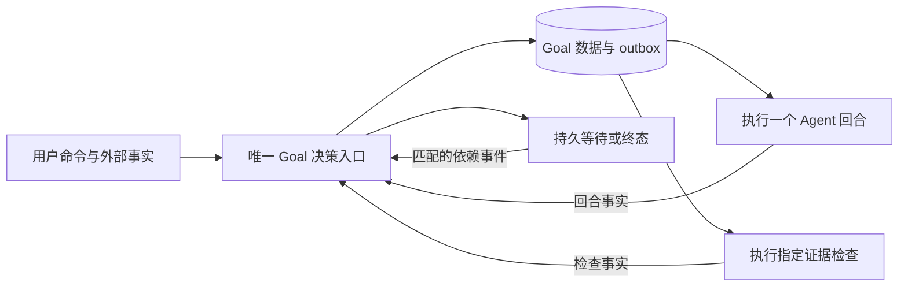

# Goal 模式简化设计（ADR-092 第二版）

> **2026-09-20 存量施工补充**：[全量看板施工方案](任务规划与实施分工及存量看板施工方案-2026-09-20.md) §3 已定位 `GoalSettlementStore.TryReplanBoundPlan` 递增语义 `PlanVersion` 的直接缺陷（现有任务5413ce1b）。冻结PlanVersion为协议语义、独立PlanRevision计Task计划修订；不放宽执行版本校验。重规划仍归Task适配器，不能借修复扩建Goal步骤引擎。本文状态仍为待完整实现/验收，新增设计不是上线声明。

修订：2026-09-17。状态：**Proposed，待实现与验收**。本次是用户要求的重新规划，不是已部署声明。

本文与 [ADR-092](../07架构/106ADR-092目标驱动执行与分层验证闭环ADR.md) 是当前 Goal 设计入口，**整体替代本文件第一版及其附加施工指令**。路径保留以免破坏链接，旧版本见 Git `bf46c68`；历史报告中的验收事实不被重写。旧 §13、刀 A–D、两级 Verifier 和独立 Goal 复用 Task 步骤树不再作为新实现要求。[现场依据](../Reports/Goal多轮效率与缓存命中评估-2026-09-17.md)。

## 1. 定位与边界

**Goal 模式只负责：保存一次用户目标，在授权范围内驱动 Agent 继续工作，根据证据决定继续、等待或结束。**

`goal.md` 是 **Agent 自己的目标存储**，可供 Agent 自主工作和心跳使用。它不是 Goal 模式的状态文件、缓存、计划、合同或恢复点，不降格为 Goal 的笔记副本，也不迁入 Goal 数据表。`goal_read/goal_update` 继续属于 Agent 目标管理。

Goal 模式的启动、执行、续行、等待、暂停、恢复、预算和完成判定 **只依赖自己的结构化持久数据及执行系统的权威事实**。不得要求读取、压缩、归档或写入 `goal.md` 才能推进。缺失、损坏、超限、拒绝访问该文件均不改变 Goal 生命周期。用户明确要求修改该文件时，它可作为普通交付物接受验证，仍不是运行状态来源。

| 领域 | 唯一职责 | Goal 如何使用 |
|---|---|---|
| Goal | 目标、完成条件、生命周期、续行决策 | 本文内核 |
| Agent Runtime | 单回合推理、工具使用、已有子代理编排 | 接收一个明确下一动作，返回事实/提议 |
| 检查执行 | 运行指定检查，生成可追溯证据 | 使用既有执行准入，不能自行结束 Goal |
| Task / Scheduler | 任务计划、分派、预约、任务版本和生命周期 | 可选适配器；无 Task 的 Goal 不加载计划体系 |
| 工具审批 / 安全 | 权限、审批依赖及执行准入 | 返回准入结果；Goal 无旁路、无自己的审批系统 |
| Agent 目标管理 / Memory / TODO | Agent 自身目标、记忆及用户交流 | 不提供 Goal 状态真值；TODO 勾选不能完成 Goal |

Goal 不做任务拆解图调度、子代理管理、Memory 维护、上下文压缩、模型路由和 Desktop 进程管理。这些系统可以服务 Goal，不能各自再建立一个 Goal 循环。

## 2. 最小闭环：一个决策入口、两类执行工作

复用现有 `GoalSettlementWorker/Store` 和纯 `GoalSettlementDecisionCalculator` 收敛这个入口，不新建平行 Coordinator。命令、回合结果、检查结果、恢复事件都经过同一状态转换规则。`GoalContinuationWorker` 只投递回合，`GoalCheckRunner` 只执行检查；worker 数量不代表多个状态所有者。统一入口不做万能Service：纯规则、事务提交、外部执行分别保持单一职责；Store不能运行工具，执行器不能改生命周期。

- **执行回合**：运行既有 canonical Turn。输入为目标、尚未满足条件、本次下一动作和必要证据摘要；不附整本历史报告。Agent 可连续多轮工作，不要求每轮交付完整目标。
- **执行检查**：只对有候选证据且需要验证的条件工作。程序断言、受控测试、产物语义审阅、外部验收都是检查类型；不要求每个 Goal 跑 build/test。
- **唯一决策规则**：纯函数消费结构化快照，返回 `RunTurn / RunChecks / Wait / Pause / Complete / Fail / NoOp`，无模型、无工具、无外部 I/O。Pause/Cancel 等用户命令走同一规则，Cancel 是明确控制动作。
- 语义检查若需要模型，属于检查执行器的一次有界、只读、无工具调用，产出条件结果；不再新增“步骤审阅 Agent + 整体审阅 Agent”。确定性条件不调用语义模型。

**删除 Goal 专属步骤推进与两级 Verifier。** Agent 的计划/TODO 可以保留为工作方法；Task 计划仍归 Task 系统。Goal 不持有 CurrentWorkUnit、不数 RemainingWorkUnits、不推进 task_nodes，不把“回合结束”转换为“步骤完成”。

## 3. 一个状态字段

| 状态 | 含义 | 离开条件 |
|---|---|---|
| Running | 已允许推进；可能排队或有一个回合在运行 | 新事实触发决策 |
| Waiting | 有明确依赖或检查在进行，无可执行的下一动作 | 依赖版本变化、匹配事件或有界超时 |
| Paused | 用户暂停、预算不足、合同需确认或无进展需决定 | 获授权的恢复/修订/补额度 |
| Completed | 全部目标义务有同版本有效证据 | 终态，只能另建新 Goal |
| Cancelled | 明确取消 | 终态 |
| Failed | 确认不可恢复且无继续义务的失败 | 终态 |

不再叠加 `Active + Executing/Verifying/Waiting` 第二套持久状态。UI 的“正在测试/排队”从当前执行记录派生。缺审批配置等可恢复故障不是 Failed；检查 failed 是证据结果，不直接等于 Goal Failed。

`Waiting` 保存一个结构化等待说明：`reason、dependencyRefs、observedVersions、deadline、resumeAction`；多个必需检查由其记录集合提供，固定等待全部完成，不另造通用等待图。检查失败时先取消/收敛仍占用同一可变输入的检查，再安排修复，避免修复与测试互相污染。

**等待不调用模型。** 依赖更新只触发重新判断，并不直接触发 Agent Turn；先看新事实是否足够。恢复扫描只补丢失事件、回收超时租约，不定时让模型重读任务。同一事件幂等处理，Pause/Cancel 后旧事件不能唤醒。

## 4. Goal 自己的持久数据

使用现有平台数据库中的 **Goal 专属表**，不需要额外数据库进程或第二份文件账本。字段是目标合同，迁移实现按既有实体收敛，不为匹配命名重建所有表。

| 已有表 | 保留的职责 |
|---|---|
| `goal_runs` | objective、contract revision 引用、status/reason、下一动作或等待说明、授权/额度、累计用量、epoch/version、resume policy |
| `goal_acceptance_contracts` | 原始要求到目标条件的映射、版本及检查规格；旧版本审计保留 |
| `goal_iterations` | canonical Turn/Run 身份、受理/结束事实、使用量；一轮不代表一个步骤 |
| `goal_check_records` | 逻辑检查身份、执行尝试/租约、输入身份、结果及证据引用 |
| `goal_verifications` | 唯一决策的审计记录，不维护第二份生命周期或当前条件列表 |
| `goal_outbox` | 待投递回合/检查/恢复工作；投递成功不代表工作完成 |
| `task_goal_bindings`（可选） | Task/Goal 的逻辑关联及任务版本；当前执行认领独立管理 |

当前条件状态从当前合同及其有效检查记录投影，不在 Goal、Task description、聊天和 Markdown 中各存一份可写真值。文档可以引用状态，但必须注明快照时间。

长运行不持有 SQLite 写事务。短事务原子提交新状态、决策与 outbox；CAS 拒绝冲突。epoch 隔离暂停/恢复/替换前后的执行，执行租约的 fence 拒绝迟到 writer；不再引入额外的一组版本号完成同样工作。outbox按`goalId/epoch/decisionId/workKind/targetId`唯一去重；已有未结束回合不再投递同Goal回合，事件重评不重复创建同一检查。

## 5. 完成条件要小而完整

最小结构为 `Criterion(id, revision, requirement, requirementRefs, verificationSpec)`。每条都是本目标的必要义务；可选建议不进入完成条件集合。每项结果为 `unknown / pending / passed / failed / invalidated`，并带 producer、输入身份、定义版本和原始证据引用。

**建立合同**：保存原始目标及来源。结构化条件直接使用；自然语言目标允许一次有界条件整理，可由现有 Agent 回合承担，计入预算，不启动独立规划循环。记录每项用户要求的覆盖关系；不明或实质有歧义才一次性请求澄清。普通目标不要求用户逐项批准实现细节。模型整理的完整性不是数学保证，至少以固定的误完成反例与只读审阅检验；不得宣称“非空”即可证明覆盖。

| 用户目标 | 足够小的合同示例 |
|---|---|
| 输出指定一句话，其他什么也不做 | 输出内容匹配、无工具副作用；一轮可完成，无项目发现/build/test |
| 交付设计文档 | 指定文档落盘且覆盖用户明确设计维度；存在检查 + 必要的内容审阅 |
| 修复代码并部署 | 缺陷复现/修复断言、相关测试、指定新构建功能验收；部署等待保留为未满足条件 |
| 完成指定 Task | 由权威 Task 读取验收条件和必要依赖；Task 适配器绑定，不能退化成独立 build/test Goal |

文本任务编号只作候选定位，服务端必须唯一解析并校验访问与启动权限；歧义或缺授权时不得悄悄按独立 Goal 跑。Task 状态不是自身验收条件（避免循环）；必要子任务的通过事实可以作为明确依赖条件。

`Complete` 必须同时满足：合同存在且覆盖目标、全部条件有有效 passed 证据、没有未完成的必要检查或部署义务、输入/授权/绑定版本仍有效。工程回归门禁只能补充合同，不能成为未知目标的默认完整合同。Agent 的 DONE、报告文件、exit 0、TODO 全勾选都不单独构成完成证明。

**修订**：实现方法可调整，缩减用户目标/必要义务必须经用户修订命令授权。新增/改变条件提升合同版本并失效受影响证据；Agent 不能通过删除失败条件完成。已有终态保留原合同和证据，不暗改成当前版本验收通过。

## 6. 证据与重复检查

优先复用已有 canonical 工具执行生成的可验证事实，缺少证明才投递检查；避免 Agent 测一次、步骤 Verifier 测一次、整体 Verifier 再测一次。检查只验证其条件，不能自行写 Task/Goal 终态。

结果复用的逻辑键为 `(goalId, contractRevision, criterionId, definitionHash, inputIdentity)`，执行尝试另带 epoch/fence。新 epoch 不能自行证明源码变化，也不能接受旧执行晚到写回；已存证据只有重新核实适用版本和输入后才允许复用。瞬态重试保留同一逻辑检查及持久 attempt 预算，不能换 epoch 刷新重试额度。

输入身份使用检查声明的相关文件**原始字节**、配置、依赖清单及适用环境/BuildId。只规范化清单排序和路径表达，不擅自归一源码字节或换行而抹掉真实变化；不得记录秘密明文。HEAD 仅为来源信息。范围不确定则扩大范围或保守重跑。无关变化有明确范围依据才复用，相关变化使旧成功与旧失败都失效。

执行前后核实输入身份；最终完成提交前用执行资源门禁或不可变快照保证该身份未被受管写操作改变，短事务内核对已冻结的证据版本。对系统无法冻结的外部可变资源，必须定义验收时点/有效期；无法保证则保持未知，不宣称最新状态已通过。

受控检查复用既有准入、超时、取消和租约。真实测试需当前 invocation 报告、预期测试集且数量大于0、进程结束及退出码；优先读结构化报告，文本只作诊断。输出采用有界摘要+原始制品引用，避免巨大工具结果灌入后续上下文。检查进程与会话构建共享输入/输出时互斥；不能用 `--no-build` 免除互斥。

## 7. Task 适配器：可选接入，不把 Task 引擎搬入 Goal

复用 `TaskGoalLaunchService/TaskGoalDispatchTransactionStore` 建立绑定，适配器只提供四项能力：读取任务合同、取得执行认领、处理等待/恢复、提交任务终态。通过 Task 已有领域方法操作计划，不在 Goal Store 内复制 Task 的计划算法。

- Task 系统负责其计划步骤及局部验证；Goal 只消费目标相关的证据，不重复步骤判定。Task 计划若包含额外必需交付物，必须明确映射进合同，不将节点数量作为暗门禁。
- 回合失败不释放逻辑绑定。等待释放短期执行占用；恢复由已有 admission/预约服务取得**新的有效认领和 fence**，再构造 ActiveTask。历史 assignment 不能当作当前认领。
- `TaskExecutionTracker`、`TaskExecutionRepairCoordinator`、`TaskCompletionSettlementService` 对有存活 Goal 绑定的任务只发布异常事实，不能独立 Block/Fail/释放绑定；由 Goal 决策入口结合 Task 规则统一处理。未绑定任务继续由 Task 系统处理。
- 完成时，纯决策产生完成提议；同一短事务内调用 Task 领域完成方法并写 Goal Completed，核对合同、Task版本、有效逻辑绑定与证据版本；存在活动认领时同时校验其fence。仅等待检查时没有执行租约是合法状态，结算权限来自当前逻辑绑定及Task版本CAS，不要求伪造执行回合或复活旧assignment。若Task已合法转交/取消，绑定必须同步失效，旧Goal不能再结算。Task必需事实不足或CAS冲突则整体回滚，转等待/重评，不先写任一终态。
- 所有 Agent/Admin/API 的完成入口对绑定任务走相同提议路径；用户取消/暂停仍可用。Task 外部修订、取消、合法人工复核会触发 Goal 重评；不会强行把 NeedsReview/Blocked 改成功。

保持现有单库事务优势，暂不引入跨库分布式事务。无 Task 的 Goal 不受任务计划、预约恢复或 task_nodes Schema 限制。

## 8. 自动续行、预算与成本

每次回合结束都记录事实；只有下一动作可执行且受授权才立即投递下一轮。未满足条件、检查或外部依赖的变化决定动作，不按回合序号推动模板步骤。

- 同一输入、相同失败、无新增证据时不给相同检查无限重试。允许一次有界诊断/修复动作；之后仍无变化则等待明确外部条件，或 Paused(no_progress) 请求一次具体决定。新进展必须有可核实的相关事实，换措辞、写汇报和刷新时间不能清零计数。
- 委派前的能力/路径准入检查由 Runtime/委派系统负责，Goal 只接收不可执行原因。审批依赖不可用时不创建必败子任务、不反复调用工具探测相同拒绝。修复审批解析必须保留权限边界。
- 外层迭代仅在 canonical Turn 首次受理时计数；重放同一受理幂等。检查/等待不消耗外层轮次，但真实费用都入账。用户消息、心跳和其他任务不混计本 Goal。
- 最大迭代/费用等由现有预算服务及授权决定，预算不足转 Paused(budget)，扩额须授权；恢复不清零。内层、子代理和外层预算分开，本次重构不顺带重写预算产品。
- 复用已有使用量事件，以 Goal/Iteration/Run/Check关联成本；缺失显示“未知/未对账”，不记0。前缀稳定与压缩优化仍归 ContextPipeline，不内嵌 Goal 调度策略。
- 重启按持久 ResumePolicy 处理；显式用户暂停/取消最高优先。外部副作用完成状态未知时先对账，禁止盲目重放。恢复扫描只恢复同一持久工作，不重新建立一个 Goal。

## 9. 用户与 Agent 看到什么

一个查询投影展示：原始目标、目标条件与证据、当前状态/等待原因、下一动作、迭代预算、用量及可用控制。`15/32` 标为已用迭代，不作为完成百分比。无计划不提示“尚未拆解所以无法执行”；TODO 另属自述区。

复用 `/goal`、现有HTTP命令及状态查询；Task启动使用已有受授权入口。Agent 所需进展/等待/完成提议经统一结果适配进入决策入口，不新增三套同义工具；确需工具暴露时只做薄适配，不拥有状态。`goal_read/goal_update` 文案清楚注明“Agent 自身目标文件，不控制 Goal 模式”。

## 10. 实施切片与移除清单

这次只更新设计。实现遵循**先固化误完成反例，再替换一条生产路径；不并行扩建新旧两套循环**。

| 切片 | 现有落点与工作 | 完成门槛 |
|---|---|---|
| S1 合同与纯决策 | Core `GoalContracts/GoalStateMachine/GoalVerificationContracts`；Platform `GoalAcceptanceContractPlanner`、`ConservativeGoalIterationVerifier`、`GoalSettlementStore` | 合同覆盖验证、统一判定；删工程门禁兜底完成及Goal步骤advance/remaining/scope分支 |
| S2 事件等待与执行分离 | `GoalSettlementWorker`、`GoalContinuationWorker`、`GoalCheckRunner/RecordStore`、`GoalOutboxStore`、`GoalRestartReconciler` | worker薄化，等待无LLM、检查完成直接重评、租约恢复及重复事件幂等 |
| S3 Task适配与入口统一 | `TaskGoalLaunchService/DispatchTransactionStore`、Task完成服务/Tracker/RepairCoordinator、`TaskAgentCommandService` | 存活绑定唯一写入口、恢复认领有效、无执行租约也能凭有效绑定结算、Task/Goal同事务完成；Goal Store不遍历计划树 |
| S4 投影与删除 | `GoalQueryService`、Goal Controllers、Workbench Goal面板、Host注册、Runtime旧GoalMode | 同一投影；关闭/删除`goal_queue.json`旧循环的生产注册与提示注入；保留Agent goal.md管理 |

每片有明确责任边界，可拆小提交；S1/S2先通过定向调用验证，Task-bound生产切换必须等S3接线和四类smoke齐备，不能先删旧步骤分支却留下旧Task写入口。切换时只有一套生产状态写入口，切片间尚未闭合不得宣布产品完成。继续利用现有已验证能力；已在途 `GoalCheckInputIdentity` 工作按§6审阅归属，未经验证不算已交付，不覆盖他人WIP。G92-0/1/2/3是历史工作载体，可对应S1–S4重整实施范围，但本轮不修改看板、不自动接管依赖卡。

**切换**：外部控制器选择无存活执行者的窗口，备份数据后做版本化原地Schema升级与实体投影调整。新枚举不能复用旧数字含义：显式映射旧Active→Running、Blocked→Waiting或Paused（按原因）、BudgetExhausted→Paused(budget)；无法判定的旧活跃目标暂停待核，不默认为可运行。旧终态保留原始状态/合同/证据，界面区分历史裁决与新合同验收；不批量改成新验收成功。未完成目标补齐合同并重新准入才能续行。迁移仅是切换工序，不保留常驻旧模型兼容层。

**回退**：切换前记录Schema与构建版本。升级失败恢复备份；切换后若已产生新数据，先停止执行并保全新增数据，由外部控制器修复或制定转换方案，不让旧二进制读写新Schema，也不盲目回滚丢失执行记录。源码交付、外部部署、新构建功能验收分别记录。

## 11. 简化后的验收门槛

| 场景 | 必须成立 |
|---|---|
| Agent goal.md 缺失/损坏/超限/无访问权限 | 相同Goal启动、续行、重启恢复与裁决一致；不调用goal_read/update作前置 |
| 只输出指定文本 | 一轮完成、零工具调用、零build/test、无需Task/Plan |
| G92反例：build/test绿而业务条件缺失 | 不得Complete；没有Task绑定不能冒称指定Task已完成 |
| Agent回复结束/DONE/TODO全勾选 | 只提供事实或提议，未满足条件仍继续或等待 |
| 一次真实失败→修复→通过 | 同Goal自动续行，修复只检查受影响条件，不跑两级重复验证 |
| pending检查或审批依赖未变化 | 无轮询式LLM、无必败委派；匹配事件后恰好一次有效决策/必要续行 |
| 相关/无关输入变化、执行期间改动 | 旧成功/失败按依赖范围失效；不可证明当前身份则不完成 |
| 重复事件、超时、Core崩溃、暂停取消后旧结果 | 单次结算、无复活；旧writer fence拒绝；不确定外部副作用先对账 |
| Task-bound完成与Tracker竞争、CAS冲突 | 无双写、无半终态、无孤儿认领；恢复取得新合法ActiveTask |
| 真实新构建与使用量 | BuildId匹配，Goal成本与关联usage对账；缺值不是0 |

源码断言、真实Store/SQLite回归、新构建普通文本/文件/代码/Task四类smoke分别记录。固定负例覆盖不可删，不能以修改测试预期来接受旧误完成。首批看误完成=0、无变化等待的额外模型调用=0、每个达成目标的耗时/输入/miss/费用；长程24小时/7天观测为后续稳定性证据，不作为每个小目标运行前置。无需为证明“多轮”强制简单目标跑三轮。
