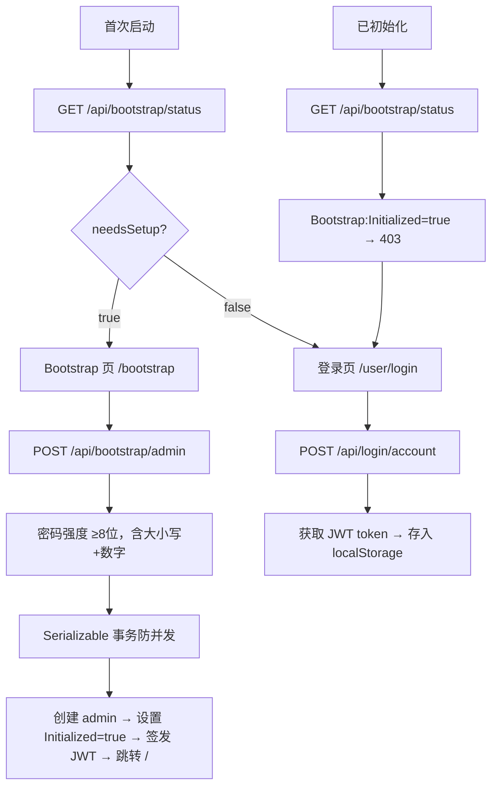

# Pudding Agent Web 用户认证系统

> **关联任务**：task-20260502-011  
> **实现日期**：2026-05-02

## 概述

Pudding Agent 使用基于 Web UI 的 JWT 认证系统，通过 **Bootstrap 引导初始化 → 登录 → 受控用户管理** 三阶段流程，替代了早期传统桌面端登录窗口。公开注册被禁止，仅 admin 用户可创建其他用户。

## 认证流程



### 路由守卫三态分发（app.tsx）

| 状态 | 路由 | 行为 |
|------|------|------|
| 无 admin 用户 | `/bootstrap` | 显示 Bootstrap 初始化向导 |
| 有用户但未登录 | `/user/login` | 显示登录页 |
| 已登录（有效 token） | 正常页面 | 进入管理后台 |

## 核心 API

| 端点 | 方法 | 说明 | 鉴权 |
|------|------|------|------|
| `/api/bootstrap/status` | GET | 检查系统是否需要初始化（返回 `needsSetup`、`hasAdmin`、`userCount`） | 匿名 |
| `/api/bootstrap/admin` | POST | 创建首个管理员账号（需系统未初始化） | 匿名 |
| `/api/login/account` | POST | 已有用户登录 | 匿名 |

### POST /api/bootstrap/admin 请求体

```json
{
  "userId": "admin",
  "email": "admin@example.com",
  "password": "StrongP@ss1",
  "displayName": "管理员"
}
```

**安全约束**：
- 密钥在首次启动时由 CSPRNG 自动生成（32 字节 base64），无需手动配置
- admin 创建后 `Bootstrap:Initialized` 置为 `true`，后续所有 bootstrap API 返回 403
- 密码强度正则：`^(?=.*[a-z])(?=.*[A-Z])(?=.*\d).{8,}$`
- 使用 `Serializable` 事务隔离级别防止 TOCTOU 并发创建多个 admin
- 仅当数据库中无任何 Admin 用户时允许调用

## 关键文件

| 文件 | 说明 |
|------|------|
| `Source/PuddingPlatform/Controllers/Api/BootstrapApiController.cs` | Bootstrap 状态检查 + admin 创建 API |
| `Source/PuddingPlatform/Services/BootstrapStateService.cs` | bootstrap-state.json 读写与初始化锁定 |
| `Source/PuddingPlatform/Program.cs` | JWT 认证中间件注册、Bootstrap 密钥自动生成 |
| `Source/PuddingAgent/Program.cs` | Agent 进程 Bootstrap 密钥自动生成 |
| `Source/PuddingPlatformAdmin/src/pages/bootstrap/index.tsx` | Bootstrap 初始化向导页面 |
| `Source/PuddingPlatformAdmin/src/pages/user/login/index.tsx` | 登录页 |
| `Source/PuddingPlatformAdmin/src/app.tsx` | 路由守卫三态分发逻辑 |
| `.env.example` | 环境变量配置示例 |

## 用户模型（AppUserEntity）

| 字段 | 说明 |
|------|------|
| `UserId` | 登录用户 ID（唯一） |
| `Username` | 用户名（同 UserId） |
| `Email` | 邮箱 |
| `DisplayName` | 显示名称 |
| `PasswordHash` | PBKDF2 哈希密码 |
| `UserType` | `Admin` / `User` |
| `IsEnabled` | 是否启用 |

## 安全特性

- 密码使用 PBKDF2 哈希存储（`PasswordHasher.Hash`）
- JWT Bearer 认证（可配置 Key / Issuer / Audience / ExpiryHours）
- 公开注册禁止，用户管理仅限 admin
- Bootstrap 初始化密钥在首次启动时由 CSPRNG 自动生成
- Session Cookie `HttpOnly` + `SameSite=None`
- Serializable 事务防并发竞态

## 部署注意事项

- Bootstrap 初始化密钥在首次启动时自动生成（`data/bootstrap-state.json`），无需手动配置
- admin 创建成功后，`bootstrap-state.json` 的 `Bootstrap:Initialized` 自动置为 `true`，后续 bootstrap API 返回 403
- `JWT_KEY` 必须替换为高强度随机密钥（≥ 32 字符）
- Bootstrap 成功后即可通过登录页使用已创建的 admin 账号