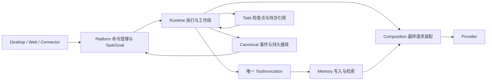

# PuddingAgent 下一阶段：缓存 >99%、Memory 主导的长程自治与架构收敛

> **2026-09-14 Memory定位纠偏：** [Memory快照索引与历史溯源设计](Memory快照索引与历史溯源设计-2026-09-14.md)是§4–5的最新补充。Memory是Agent主动维护的当前知识快照、多级索引和外部正文引用；记忆图书馆复用Book/Page/Pointer；聊天与向量命中只提供候选证据，不能代表最终裁决。先M02最小写读，再M01移除默认日志召回/整摘要，C03完善按需溯源；此前性能报告的日志优先路线不再适用。设计已明确，运行时尚未按此修改。

> **后续用户修订：子代理采用弹性预算。** [最新子代理设计](子代理弹性预算与双向交互设计-2026-09-12.md)及ADR-087规定600只是可选示例，不是全局默认/下限/上限；支持短轮次及任意合法正整数。生命周期系统托管，加入双向send_message、120秒ask_question、按Run停止和Web检查器。下文600验收数字按“一个必须支持的实例”理解，独立LLM grace已改为系统有界清理。


日期：2026-09-12。状态：**设计已交付，待实施及验收**。本文件是本阶段的实施主线；设计状态不代表现有产品已具备这些能力。

配套：[ADR-084](../07架构/98ADR-084稳定请求前缀与缓存99验收ADR.md)、[ADR-085](../07架构/99ADR-085Memory主导的长程任务连续性ADR.md)、[ADR-086](../07架构/100ADR-086长程执行预算与运行内核收敛ADR.md)。[任务路线、看板回执和证据包](../Reports/PuddingAgent-Next-Phase-2026-09-12/README.md)。

## 1. 冻结本阶段目标与纠偏

1. **P0：真实输入 Token 加权缓存命中率 >99%**。保持任务目标、必要工具能力和交付质量；同时降低每个验收通过任务的输入、未命中、输出、费用和耗时。不得通过堆积重复历史、填充前缀、制造预热调用或减少必要工作抬高比例。
2. **长程工作由 Task/Goal 和 Memory 承载**。Session 保留消息、会话隔离、UI 和审计职责；Session 切换不再等同于必须整段摘要，也不再负责保存全部长期状态。压力压缩和显式 compact 继续存在。
3. **支持数十天连续推进任务**，跨 Session、进程重启、子代理等待和部署仍可恢复。这里的连续性是逻辑工作连续，不要求一个上下文窗口或一个进程永不结束。
4. **纠正子代理短预算**：正常子代理和 managed WorkUnit 都支持可选的任意合法正整数轮次（如8、600、1200），600不是统一上限或下限，不能藏有32/40轮或120次工具的二次截断。轮次计数、工具计数、耗时与成本必须分别展示。
5. **收敛运行内核**：清理无业务依据的兼容适配和反馈补丁；Native tool、Shell、Memory、事件与持久任务各自有唯一合同与所有者。保留明确的错误结果、用户反馈和可靠恢复。

本次要求明确取代前轮审计 01 文档 A03（含“可先配置25–40轮/单元”的段落）及既有 WorkUnit 方案中的小轮数建议。旧运行数据、旧提交和旧验收记录保留；旧阈值不能继续作为新实现的依据。

## 2. 已核实的现状：哪些应该最先改

### 2.1 源码与运行证据是两个时间基线

本次源码检查包含 `bfbb003`（A01-slice-4b）、`264e398`（父执行身份）、`defd1dd`（C01-B-3 定义身份恢复）、`b29355f`（C01-B-2 工具追加序）等提交。工作树仍有并行未提交改动，实施者须重新核对 HEAD 和文件所有权。上述提交说明已有实现增量，不能说明当前 Core 已加载或端到端验收通过。

缓存与子会话启动实测使用冻结窗口 **北京时间 9月11日 00:00 至 9月12日 06:24**；并非今天全部运行结果。898 次 gateway 请求：输入 78,228,078、命中 74,694,848、未命中 3,533,230，命中率 **95.4834%**。DeepSeek 9月11日 95.3506%、9月12日部分时段 96.4832%；GLM 9月11日 91.9559%。这批样本不足以证明连续运行数天。

| 已核实的问题 | 当前入口 | 优先动作 |
|---|---|---|
| 系统上限 600，但普通未指定请求默认 32，managed WorkUnit 被 `Math.Min(...,40)` 限制，工具上限另压到 120（2026-09-12 已由 N00 修复，commit f096bc5） | `SubAgentInvocationContracts.cs`、`SubAgentManager.NormalizeExecutionBudget` | P0 纠偏：单一有效预算，删小轮数截断，补 600 轮穿透测试 |
| Planner 固定 Explore/Plan/Change/Test/Review，每类 25–40 轮、20–60 分钟、10万–25万输入预算 | `TaskExecutionPlanCompiler.Budget` | 消除不同入口预算打架；简单任务不强制生成五段重复探索 |
| 新 Session 整段注入最近摘要，未在该入口应用独立摘要预算 | `AgentMemorySummaryContextBuilder.BuildAsync`、`ContextPipelineOrchestrator` | 改为任务续行引用和有界记忆索引，旧摘要按需读取 |
| 最近摘要只向前查 7 天；清理默认也为 7 天 | `SessionSummaryStore.LoadLatestAsync/Cleanup` | 长任务恢复不依赖该目录“最近一份”；活跃任务引用不能因摘要过期而失效 |
| 技能、重要记忆、偏好、历史摘要、多种召回共同装配；预算使用局部百分比 | `ContextPipelineOrchestrator`、`ContextBudgetAllocator` | 对最终请求统一核算，各层绝对预算和来源去重 |
| Recall 状态按 Agent 保存，缓存 key 使用 Agent + `GetHashCode()`，未显式包含 workspace/版本/权限；每 5 轮可强制 Recall | `SubconsciousRecallPipeline` | 稳定 key、作用域与版本失效；取消按轮数强制召回，改成需求和证据驱动 |
| Native function 与正文 JSON 工具路径分别存在；遗留测试 fallback 进入生产类 | `AgentExecutionService.Buffered` | 删除不再支持的正文工具协议，收敛统一执行/审计入口 |
| 存在正式接受的 Harness 别名适配和旧 Memory fallback | `HarnessToolCompatibilityAdapter`、ADR-081、MemorySummary/Recall 分支 | 以 ADR-086 修订架构方向，登记删除清单与真实调用覆盖，不再叠适配补丁 |
| 失败指纹只看完全相同参数不能解释所有空转 | `FailedToolCallTracker` + `RuntimeControlService` | 保留既有同族检测，验证两种 loop 接线，合并同一判定入口，避免新增第二套熔断器 |

### 2.2 新 Session 第一轮已经占用多少

12 个新子 Session 的第一个 `agent_llm` 请求均为 `TurnRound=0`，并按 `source_id` 匹配首个分层记录。Provider 实际输入 **20,847–25,148**，中位数 **22,773.5** Tokens。不是“空会话只需要几千 Tokens”。

代表样本 `...-sub-e6f59aec`：Provider 第一轮输入 **21,007**；分层是本地估算，示例如下：

| 层 | 本地估算 Tokens | 解释 |
|---|---:|---|
| 静态提示 `L0-STATIC` | 2,617 | 系统规则主体 |
| 工具定义 | 5,804 | Native schema；不能与“工具说明”混算成同一层 |
| 工具说明 | 559 | 提示中的额外说明 |
| 技能 | 7,047 | 是首轮缩减的重要候选，应检查目录与全文是否混装 |
| 历史摘要 | 3,609 | 后续代表样本达到 4,554 |
| 用户偏好记忆 | 1,622 | 与用户画像、重要记忆需按来源去重 |
| 重要记忆 | 554 | 应只包含当前任务必须遵守的事实/偏好 |
| 当前输入 | 1,636 | 委派指令等，不能算成纯系统启动税 |
| 运行提示 | 586 | 与真实预算/状态一致，避免每轮重复扩写 |

样本系统消息估算 16,974、工具估算 5,804、历史消息估算 1,840；这些数值**不能相加冒充 Provider 精确分解**。分层估算使用的序列化面和 Token 估算器与最终 Provider usage 不完全相同。现有分层记录没有 L6 行，也不能推导所有其他场景都没有召回。

主会话在窗口内第一个观测请求为 **49,201** 输入 Tokens，但可能早已存在历史，因此不作为新主 Session 冷启动验收值。两个错误派生的 `msg-*` 会话首个观测值为 25,559 / 26,496；它们属于历史事故样本，不能代表新规范。

若有效输入容量为 65,536，12 个子会话首轮占比为 **31.81%–38.37%**；若为 131,072，则是 **15.91%–19.19%**。这是容量情景计算，**未将这两个容量冒充现场模型的实际上限**。实施时必须记录每次真实模型、配置上限、保留输出额度和最终有效输入容量。

新增统一 `ContextStartupSnapshot` 观测记录，绑定 requestId/SessionId/TaskId/PrefixEpoch，记录：

```text
kind = new_main | new_child | restored | pressure_rollover
effectiveInputLimit, reservedOutputTokens, safetyMarginTokens
system, schemas, skillIndex, pinnedPreferences, continuation,
memoryIndex, recall, compactSummary, parentHandoff, currentInput
estimatedFinalInput, providerActualInput, remainingInput, sourceIds
```

各层必须互斥；无法分解的 Provider 差额单列 estimationResidual，不能强行摊给记忆。诊断面默认只存计数、hash 和引用，明文遵循已有权限与保留策略。

## 3. P0 缓存方案：从最终请求向上收敛

### 3.1 不可改变的统计口径

`hitRate = sum(providerCacheHitTokens) / sum(providerCacheHitTokens + providerCacheMissTokens)`。按北京时间完整自然日、provider/model、主/子代理/后台、冷启动/稳定运行/恢复分组。以 gateway 为计费事实；归因表和 layer 表不重复求和。缺失 usage 或不提供 cache 信息的调用单列 unknown 和覆盖率，不能填 0 或从总成本中消失。

正式门槛：连续 **7 个完整自然日**，总体以及每个实际启用、支持缓存计量的主力模型的每日加权率均 >99%，7日加权率也 >99%。冷启动、召回、压缩、后台调用计入其所属模型；无样本日不算通过。Stable-only 和 warm-only 是诊断指标，不能代替总体验收。不为完成验收增加没有任务价值的调用。

当前冻结样本若分母不变，99% 的未命中预算是 782,280.78；严格 >99% 要低于该值。需要消除至少约 **2.751M（77.86%）** 未命中。新设计如果减少总输入，允许的 miss 也同步下降，必须重新计算，不能沿用旧预算。

### 3.2 明确数学约束，避免优化目标互相伤害

一个请求含稳定可复用前缀 P 和本轮必须新写的尾部 D，即使 P 全命中，理论上该请求也只有 `P/(P+D)` 命中率。若 D=1,000，P 必须大于 99,000 才可能单请求 >99%。这说明短任务、全新输入和后台短请求未必能达到单请求 >99%。整体优化应降低真正需要重算的内容、减少重复探索和请求，而不是把 P 人为做大。

必须同时画出命中率、miss/验收任务、总 input/验收任务、输出、费用和耗时；比例改善但总消耗上升时不接受。缓存由 Provider 实际返回决定，客户端 PrefixHash 相同只证明请求稳定，不能证明远端一定命中。若真实工作负载的不可避免新输入已超过 1%，报告缺口和证据，不能悄悄降低或改写验收口径。

### 3.3 唯一请求装配与稳定前缀

复用已有 CompositionSnapshot/PersistentCompositionVersionRegistry/C01-B 实现，**不新建平行 PromptRegistry**。职责分为三个数据面：

| 数据面 | 内容 | 变更规则 |
|---|---|---|
| 稳定定义 | 系统模板版本、canonical 工具 schema、稳定环境约定、必要技能目录 | 固定字节序与序列化规则；不含时间、随机 ID、进度、召回文本 |
| 工作段快照 | 任务固定目标/约束、必要偏好、已选技能正文及记忆引用快照 | 工作段内不重写；有真实变更再提交新版本 |
| 追加内容 | 用户最新输入、工具结果、实际召回、进展和纠错、新的事实 | 追加到消息尾部；不在下一轮挪回 system 的前部 |

Native tools 是 Provider 请求的独立字段，不能仅靠把它叫“尾部”就宣称不会破坏缓存。provider adapter 应在最终编码后记录实际字段序列和 hash；工具变化若导致不可避免的前缀失效，明确归因。

工具集合以当前授权、任务需要的稳定 capability bundle 启动，保留 `search_tools` 发现入口。发现新工具沿 C01-B 的追加序，在下一 LLM round 边界一次提交；去重，不因心跳、无关目录扫描或新 Agent 名单重排。权限撤销立即生效，必要时新建 epoch；缓存不能延缓撤权。禁止为了缓存暴露未经授权工具。

技能默认注入有界名称/用途目录；本任务实际需要的正文通过现有技能读取入口加载一次并保留引用。7,047 Token 的首轮技能层必须逐项确认用途，不是按字符机械裁短指令。

### 3.4 在最终 Provider 调用边界生成 Manifest

实施 C02：在 `DirectLlmClient`/真正 adapter 序列化边界，而非早期 ContextPipeline 中产生 `RequestShapeManifest`。至少包含 schemaVersion、provider/model、requestId、attemptId、Task/Run/Session、compositionRevision、permissionEpoch、prefixEpoch、按最终序列的 segment hash/bytes/估算tokens、tools有序定义hash，以及 memory/skill 版本引用。

每次比较同一工作段的上一份 manifest：`firstChangedSegment`、firstChangedByte、可估算的 tokenOffset、changeReason。reason 使用有限枚举：new_session、permission_changed、tool_added、tool_definition_changed、template_changed、memory_snapshot_changed、compaction、history_rewrite、provider_route_changed、incremental_tail、unknown。不得把没有 reason 直接解释成 stable。

网络重试保留逻辑 requestId、生成 attemptId；只把实际发生的 Provider usage 计入成本。S01-B 的 outbox/幂等对账是该指标可信度的依赖。Manifest payload hash ≠ Provider 分词前缀 hash；二者标识不同语义。

### 3.5 后台与召回是 P0 miss 的一部分

旧样本后台 60 次输入 589,315，命中率仅 0.41268%，贡献约 16.61% 的总 miss。优先做：确定性去重/upsert 不调用模型；候选确有变化才提交记忆整理；同一授权范围内按有界增量批处理；固定短提示模板，候选放尾部；不每次重送整本 Memory。延迟批处理不能推迟下一轮需要的关键记忆写入。

Memory 检索优先词法/混合索引与引用读取；复杂歧义确实需要排序才调用模型。保留原有真实调用记账，不能把辅助模型调用藏到“免费预处理”。模型路由保持任务段内稳定；不按随机时段或缓存波动频繁切换 provider。

## 4. Memory 主导的长程状态模型

### 4.1 职责拆分



Task/Goal 保存状态、依赖、下一动作、等待对象和验收证据；Memory 保存跨轮必要的知识、事实、经验、用户偏好与工作笔记；Session 保存有序对话证据；Run/Attempt 保存一次执行事实。不得把所有内容都塞进一份不断追加的 `goal.md` 或巨型摘要，也不让 Memory 文本充当任务状态机。

### 4.2 续行胶囊：不是第二套长期知识库

复用 Task/Goal checkpoint 的存储/版本机制，增加或归一化这些最小字段，而非创建新的平台级 Coordinator：

```json
{
  "taskId": "full-id", "workUnitId": "optional", "revision": 12,
  "objectiveRef": "task://full-id", "checkpointState": "working",
  "nextAction": "对指定构建执行缓存恢复 smoke",
  "verifiedEvidenceRefs": ["artifact://test-result"],
  "memoryRefs": [{"id": "page-id", "version": 3}],
  "pendingOperationIds": ["tool-operation-id"],
  "waitingOn": [], "executionRoot": "resolved-path",
  "codeRevision": "commit", "loadedBuildId": "observed-or-unknown"
}
```

框架注入 workspace/agent/Task 身份；模型不能通过填写文本取得其他 workspace 的范围。版本写入失败时返回冲突并读最新记录，不能盲目覆盖另一个 Agent 的检查点。完整任务 ID 不截短。

一个活跃 Task 只有一个 current checkpoint；历史版本进入有界审计保留。跨数据库不追求伪跨库原子事务：先写入并获得 Memory 版本回执，再 CAS 更新 checkpoint 的引用；失败重试使用同一幂等键。已经写成但暂未引用的版本可回收，尚未写成的内容不能被标为“已记住”。

### 4.3 Agent 什么时候主动写 Memory

在这些边界保存下一轮确实需要的内容：新确认且后续依赖的事实/用户修正；关键失败根因与有效替代方法；阶段产物完成；即将长时间等待；上下文压力压缩前；计划性 Session rollover；源码修改交付外部部署前。

不要求每个工具调用后再写一份摘要。连续编辑、已存在且未变的事实不重复写。工作段可每约 20–50 轮检查一次“是否有未持久化的新事实”，这是可配置检查频率，**不是中止/重开 Session 的阈值**；优先使用事件触发。无新增则零写入、零额外模型调用。

保留现有 `save_memory`、`manage_memory` 的页/章节更新、`grep_memory`/`search_memory`；保持 Wiki Book v1 的简单写入面。`edit_page` 是拟收敛的目标语义，不是现有 `manage_memory` 已实现的 action。框架提供稳定业务 key、expectedVersion 和写入回执，写入层执行 upsert/replace 与索引更新。不要重新引入 F0–F10、多 intent merge/reuse/validate 链或让模型操作复杂维护状态机。

对关键边界使用“记忆回执 + checkpoint 引用已持久化”作为完成依据。崩溃可能发生在任何一条工具返回前，不能保证未确认内容已经保存；恢复时从 canonical transcript 和工具 postcondition 补查这一小段，不重新总结全部历史。

### 4.4 防止记忆膨胀与杂乱

复用 Book/Page，最小元数据为稳定 ID、scope、kind、version、sourceRefs、updatedAt、status（current/archived）及按类型适用的 expiresAt。框架维护；模型仍只选择合适页面和内容。

| 类型 | 写入规则 | 默认维护策略（本阶段设计值，需实测校准） |
|---|---|---|
| 用户明确偏好/长期约束 | 同 key 更新，冲突以用户新指令为准 | 无自动 TTL；只有明确变更才替换 |
| 项目确定事实/架构决策 | 引用源码版本、ADR、可追溯来源 | 依赖变化时标待复核；保留一份 current |
| 活跃任务工作记忆 | 一任务一索引、页面按主题，稳定 key 更新 | 活跃期间不因日期删除；完成后 30 天转归档候选 |
| 临时排障/查询缓存 | 错误族+目标版本作为 key；同一结果不追加 | 短 TTL，例如 7 天；引用仍有效则延后 |
| 工具原始大输出/会话历史 | 保存到 artifact/transcript | Memory 只存引用、摘要与来源范围，不复制全文 |

默认页面正文目标 ≤2K Tokens，超过则按主题拆页并维护有界目录；这是内容组织目标，不能裁掉必要事实后谎报成功。启动索引只返回 top-K 相关页，不枚举全部书。每任务 current index ≤1K Tokens、续行文本 ≤2K Tokens，历史版本与 artifact 不自动注入。

维护按变更量/积压量触发，增量扫描、有界批次；没有变化不启动 LLM。删页必须同步索引，归档不得继续普通检索命中。存在活跃 checkpoint/等待对象引用时禁止 GC；先证明引用可达性，再归档或迁移，不能仅靠 lastAccessTime 自动删事实。

检索命中但未实际使用不能算“有效记忆”。指标包括新增/替换/重复跳过、活跃事实数、历史体积、每任务增长、检索精确率、过期/冲突命中、引用读取失败和恢复成功率。为 30 日负载定义稳定事实集，重复写同一事实不增长 current 页数；新事实正常增长，不能以固定总页数掩盖丢失。

### 4.5 检索合同与缓存失效

检索请求由 query、由框架约束的 scope、task/project、可选 kind、topK、maxTokens 组成。输出稳定 Memory ID/version、短摘要、匹配原因、sourceRef、updatedAt、是否待复核，以及 continuation/read 指针。结果分 `found / no_match / contract_error / unavailable / stale_reference`，空结果不是故障重试信号。

优先级为：用户指定引用 → 当前任务 current checkpoint 引用 → 当前项目词法/语义混合检索 → 授权范围内历史归档按需扩展。读取原文再确认关键事实；不得把从旧 Session 召回的建议升格为当前用户指令。

本地检索 cache key = workspace + principal/permissionEpoch + task/project/scope + normalizedQuery + filters + topK/maxTokens + indexRevision。使用稳定 hash，不用进程 `GetHashCode()` 作为持久或跨作用域身份。修改页后失效对应引用和索引版本；同 query 在数据版本变化后可再次检索。新会话不重置共享知识，只重建本次检索状态。

## 5. Session、压缩和首轮预算如何改变

### 5.1 新会话装配

新 Session 首轮 = 稳定规则/必要工具 + 最小偏好 + 活跃任务续行胶囊 + 有界 Memory 索引 + 当前用户输入。**不默认注入最近一次完整摘要、不遍历最近七天所有知识、不默认把所有技能全文塞进去**。需要旧细节时由检索工具获得，再留在消息尾部。

建议初始预算（设计值，不是已测结果）：

| 内容 | 目标 Tokens |
|---|---:|
| 核心规则与环境 | ≤3,000 |
| 基础工具定义与必要说明 | ≤4,000；复杂工具包需单列原因 |
| 技能目录 | ≤800 |
| 必要偏好/重要约束（去重后） | ≤800 |
| 任务续行文本 | ≤2,000 |
| 记忆引用索引 | ≤1,000 |
| 初始定向召回 | 默认 0；有明确需要时 ≤2,000 |

共同要求：无特大用户附件/继承输入时，首轮启动装配开销 P95 ≤12K 且 ≤有效输入容量20%，较旧同类负载下降至少30%。这些目标需要匹配 Provider tokenizer/usage 做校准；系统约束不得因超预算直接截断。若所需 schema 本身过大，调整 capability bundle 和说明重复，报告超额原因。保留输出空间、下一次工具输出空间及安全余量，不能沿用固定 4096 覆盖所有模型场景。

### 5.2 压缩保留，但从生命周期事件改为上下文压力处理

2026-09-15实施基线：572c394采用默认80%（下面85%是早期建议，已由本条替代），移除固定128K cap，保留输出预留和独立输入上限；循环内另有既有1024安全余量。Provider实报与本地估算分开，当前装配请求优先，checkpoint以前的usage失效。见[部署报告](../Reports/百万上下文频繁压缩修复-2026-09-15.md)。此子项已部署；有界Memory装配和无收益抑制等仍待实现。

只切换前端 Session Tab 不触发压缩。新建独立任务 Session 不先压旧 Session；继续旧任务则读取 checkpoint + Memory。压力接近有效输入容量、显式 compact、模型容量变化等才进入 compaction 决策。

统一计算 `effectiveInputLimit=min(providerMaxInputTokens, modelContextWindow-reservedOutput, configuredContextWindow-reservedOutput)-safetyMargin`，不存在的独立上限不参与min；若配置本身定义为“输入额度”，不能再扣一次输出。先统一字段语义，再按同一口径做 75% 预警、85% 候选压缩（初始建议）。替换目前 0.60/0.80、子代理0.65→0.50等互不解释的触发规则；这些不是必须照抄的新常量，先记录实际触发成本再校准。

处理顺序：大工具结果 artifact 化并保留可读引用 → 剪除确定重复/过期检索结果 → 保留近期完整 tool-call/result 组 → 必要时总结较早原文。压缩输入必须含新原文，复用现有 canonical ChatMessages 导入和 CoverageManifest 保障；summary-only no-op，禁止摘要套摘要或以摘要成功掩盖覆盖缺失。

压缩完成先确认关键工作记忆和引用可恢复，再提交新工作段上下文；若失败，保留原文/旧 checkpoint，报告具体失败。压缩本身可以产生 prefix epoch 变化，单独归因，不为了继续缓存旧大前缀而无限拖延。

Session summary 仍可供用户查阅、旧对话定位和故障恢复，但不再是 30 天自治的唯一载体。新 Session 不等于新 Task；新 Context epoch 也不必新建 Session。不要通过频繁换 Session 来替代压力管理。

## 6. 600 轮长程执行：把能力放宽，把判定做准

### 6.1 统一有效预算

长程profile可以使用600轮作为示例，也可以选择其他合法正整数；未指定由系统配置决定，不统一强制600。2,400工具/24小时也不再作为本阶段强制默认的附加硬限制，只在用户或工作区明确配置资源政策时执行。统一预算合同见ADR-087；所有耗时、工具和Tokens仍计量。30日任务通过durable continuation跨多个Run延续，主代理不用管理计时、续租和清理。

达到所选轮数N后系统做有界checkpoint与资源清理，不再增加需主代理感知/管理的20–50个LLM grace轮。达到显式资源政策上界时不能靠新Run绕过；确需继续则保留partial与nextAction，通过既有政策授权恢复，不能误标完成。

RuntimeExecutionConfigService 曾用 `Math.Max(600, configured)` 强制抬高配置（已由 N00 删除，现为 `Math.Max(1, cfg)`，commit f096bc5），也是隐式补丁。新合同分别定义 profile 默认值、实例显式设置、请求显式设置、管理员上界；一个 resolver 一次得出 EffectiveExecutionBudget，显示来源。用户明确设置较小上界也必须尊重，不再出现“配置写40但实际600”反向漂移。

必须核对整链：配置文件 → template/instance → task plan → spawn request → manager → invocation → dispatch snapshot → TurnExecutorAdapter → AgentLoop → grace。round/tool/time/input/output/cost 每个维度保留 configured/requested/effective/source，拒绝请求时说清是哪一级限制。禁止 Planner 用固定 100K 输入预算让 600 轮在第几轮就被截断。

输入计数拆分 replay input、cache miss/new input、output、真实计费；短 WorkUnit 的旧固定价格/输入阈值不能伪装成用户预算。成本不明应暴露 unknown，不能猜价授权扩费；若用户明确设置了硬货币上限且无法计量，显式阻塞该约束，而不是整个产品默认“所有短任务都因缺价失败”。

### 6.2 运行时间与等待时间

区分墙钟时长、主动工作时长、LLM等待、工具运行、外部依赖等待、调度排队。正常异步子任务使用自己的持久截止时间，不被父级当次 HTTP/工具调用超时截断；同步调用若剩余父预算不足，应明确拒绝或由调用方选择异步，不偷偷改小。

待子代理、测试进程、外部部署、文件锁时写带 identity 的 AwaitHandle/既有等待记录，并订阅结果；释放 CPU 与不必要 LLM 轮次。Heartbeat 只修复遗漏唤醒和推进就绪工作，不反复查询一组不变对象。不同等待类型有 deadline 和恢复策略，不以“有日志输出”无限续命。

no-progress lease 可从现有 1小时设计起步，但可按任务类型调整。构建/下载等工具心跳是活性证据，不等于任务进展；正确进行的长工具不得因父进度计时误杀。取消和权限撤销仍及时响应。

### 6.3 有效进展与低效循环

对外暴露简单的进度事实：新证据、成功状态变更、完成验证、生成可读取产物、依赖解除。用证据 fingerprint 去重，不以输出字数、git改动行数、轮数、cache rate 或模型自称“有进展”单独续租。

相同工具+目标版本+相同失败的原样重试阻断；同一错误族即使修改空白参数也累计。现有 FailedToolCallTracker 与 RuntimeControlService 应汇合为一个判定结果，Buffered/Streaming 共用。每类错误给简短、确定的下一动作，例如 patch context mismatch → 读取准确目标范围 → 重建补丁；no_match → 结束或扩大合理范围；approval_pending → await；timeout_running → 获取 operationId 后续等候，不能再启动副本。

“缺进展”先要求一次重新检查目标/postcondition、缩小问题或读取新证据；若仍未改变，转为 blocked/await 并登记原因，而不是持续写反思提示词。合法地检查另一个文件、继续长测试、修复不同错误不能被同族误伤。

## 7. 架构清理：删除面与保留面

### 7.1 唯一所有者

| 组件 | 保留职责 | 应移出/删除 |
|---|---|---|
| Platform Task/Goal/Command | durable状态、受理、reservation、续行、验收 | 在Controller/Heartbeat中复制AgentLoop或临时造会话 |
| Runtime Loop | LLM轮次、规范化输出、调用唯一工具入口、预算/取消 | Native/正文JSON两套完整工具执行器、测试专用业务fallback |
| ToolInvocationService | canonical工具解析、权限、参数校验、执行、单次审计结果 | 分支各自追加trace、猜参数、结果字符串替代执行状态 |
| Composition | 唯一冻结/版本/恢复/最终装配合同 | 回收Session时重建另一套工具定义缓存或动态重排 |
| MemoryEngine/写入口 | Book/Page、索引、一致写入、范围检索 | 通过多套legacy目录回退掩盖依赖未注册 |
| Desktop | 进程监督与Workbench容器 | Core业务、第二个调度/记忆状态机 |
| Frontend | canonical状态投影、用户操作与证据呈现 | 从“已投递”推导“已完成”，刷新修复丢事件 |

### 7.2 Feedback 与兼容补丁清单

“Feedback”按实际语义清理。本次检索发现的 `ShowFeedback`、`ComposerFeedbackStrip` 是用户可见反馈，不是执行兼容补丁；用户事实类型 `feedback` 也不能按名字删除。重点删除运行过程中靠反复注入文字纠错、推测终态、猜工具名和参数来维持运行的补丁。

| 候选 | 处理方案 | 删除门槛 |
|---|---|---|
| `HarnessToolCompatibilityAdapter` 的历史别名/参数映射 | 默认 canonical schema；只把有明确现用业务调用者的外部协议适配保留在边界 | 现用调用者/模板/fixture切到canonical；真实模型工具成功率对照不退化；未迁移者显式报错，不双栈猜测 |
| `AgentLoopResponse.Tool` 正文JSON执行和 DONE 文本提升 | Native function call 是执行请求；普通文本不能偷偷变工具或任务完成 | Buffered/Streaming用同一 invocation result、终态和工具归档；API确需其他协议时边界规范化一次 |
| Buffered 中 `legacy fallback for tests only` | 测试注入真实接口fake，不让生产类保留另一执行面 | 更新测试组合根与fixture，零生产调用者后删除 |
| `BuildLegacyMemorySummaryAsync`、legacy AgentLog recall | 统一Memory写/读合同，必要依赖在组合根明确注册 | 导入必要当前数据或提供离线迁移说明；不得以删除 fallback 为理由丢活跃任务资料 |
| SessionSummary“只找最近7天”作为恢复事实源 | 从Task current checkpoint定位Memory；摘要仅证据 | 30天跨会话恢复通过后不再依赖旧入口 |
| 前端状态猜测、服务器临时repair补写、重复usage归因 | 对齐canonical事件、S01-B可靠对账；修源头，移除掩盖故障分支 | 无补写仍可故障重放/恢复；明确业务恢复流程保留 |

列出每个候选的文件/方法、实际调用者、存在原因、替代路径、删除提交、验证与回滚方式。按文件名全局删除 Feedback/fallback 是不合格实现。无明确需求不新建兼容层；必须支持的外部合同用显式版本适配，有退役日期，核心只认一种合同。

架构简化成功应体现为重复状态机/执行分支/注册源减少和依赖方向更清楚，不能仅把长函数拆到更多 partial 文件。先把 Native 工具归档、父身份、usage、Memory 写入这些合同收敛，再分模块；不开展全仓库改名大重构。

## 8. 自改进闭环与长期运行验收

运行期间识别问题时记录：触发 Task/Run/tool/requestId、复现证据、预期/实际、影响、源码定位和可实施方案。先登记/复用看板，再在授权范围修源码；继续原工作有替代路径时不必整批停摆。修复产物绑定 issueId、commit/buildId、验证结果与待恢复原任务。

保留 A08 的阶段：Observed → Planned → SourceVerified → ready-for-external-deploy → BuildLoaded（外部证明）→ in-product-functional-complete → OriginalWorkResumed → Accepted。不得让修复 Agent 在旧进程编译完后宣布自己已运行新代码。框架有可证实已加载构建后才推进产品阶段；生命周期控制由进程外控制器负责。

每次 Heartbeat 记录一个明确结果：progressed、awaiting_external、no_ready_work、recovered、failed；附对应Task/待等对象/下一次触发条件。no_ready_work 是有效调度决策，但不计入任务产出；maintenance-only 与有效进展分开。每次都应有可解释结果，而不是强迫每个心跳制造任务或调用模型。

验收按阶段累计：

1. **源码合同验证**：600正常轮穿透、取消/等待、恢复一致性、Memory 幂等和范围隔离、最终manifest归因、删除分支反例。
2. **外部部署+24小时试运行**：确认新build与数据根、全链回执与故障注入，不声明长期通过。
3. **72小时 soak**：子任务完成回执重投、进程重启、网络失败、Memory写成功checkpoint失败、长工具等待、缓存恢复、无任务时静默。
4. **7日真实任务对照**：完整7日缓存>99%验收；相同任务族的验收质量、工具成功率、每任务总消耗与耗时。目标首轮开销下降≥30%、可避免重复失败≥50%下降；耗时P95不恶化超过10%，差异给出样本量和难度限制。
5. **30日逻辑任务连续性**：跨数次部署/会话切换仍恢复待办和正确记忆；零活跃任务引用丢失、零重复副作用，所有心跳可归类；记录最长无进展时间、恢复时延、DB/WAL/内存/索引增长。重复固定事实 workload 的current记录不增长；真实新知识允许增长。30天墙钟尚未走完就保持运行验收状态，不能用模拟测试冒充。

24小时、72小时、7日、30日均以明确新构建开始计时；缓存口径变更、重大实现变更须新开可解释对照窗口。一个故障无需丢弃所有历史数据，但对应“连续通过”计时和受影响验收项必须重新开始。

## 9. 实施顺序和交付边界

**先做 N00（600轮纠偏）与现有 A01/C01/S01-B 收口，再做 C02最终请求证据与 M01有界启动，然后 M02关键记忆/检索、N03内核删除、N04效能与长期验证。** C02 可先做只读观测，不能依赖所有重构完成才开始。缓存P0贯穿所有阶段；不能把7日验收前置成阻塞所有后续工作的空等。

复用已有看板卡：缓存总卡、C01、C02、WorkUnit、子代理效率、Harness总卡、Goodput、自改进、长期验收；增加有明确边界的 Memory 启动、Memory 写检索、兼容删除、后台miss任务。任务ID和依赖以配套路线文件为准，不在源码另造状态表。

每个实施切片交付：问题反例 → 最小改动 → 正常/失败/恢复证据 →删改清单→源码提交→产品待验收项→更新看板。修改已有受理中任务时读取最新版本，412 后停止并重新协调，禁止覆盖他方进度。保留不相关 dirty 工作树，构建输出只在仓库临时目录或系统Temp，不清理D:\data来代替修复。

本轮只交付设计、路线、ADR、看板修订与执行指令；没有改动产品源码或运行配置。实施与真实7日/30日结论由后续可追溯回执证明。
