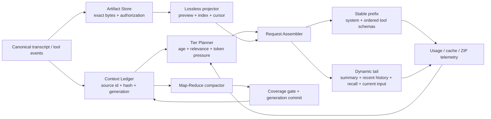

# 上下文 Token 效率、缓存命中与分级压缩优化设计方案

> 状态：Proposed，尚未实施或发布  
> 日期：2026-08-17  
> 数据基线：2026-08-11 至 2026-08-17，8 月 17 日为 16:59 左右导出的部分日  
> 关联文档：[ADR-042 上下文自动压缩与主动 Compact 命令](../07架构/43ADR-042上下文自动压缩与主动Compact命令ADR.md)、[上下文自动压缩与 Compact 命令设计方案](上下文自动压缩与Compact命令设计方案.md)、[上下文缓存可观测性 ADR](../07架构/18上下文缓存可观测性ADR.md)、[缓存统计闭环 ADR](../07架构/44ADR-043缓存统计闭环ADR.md)  
> 本轮边界：只形成设计和施工/验收合同，不修改源码、配置、数据库或运行数据。

## 1. 结论

Pudding 的主要成本问题不是输出 Token，而是大体积历史在每轮重放、工具结果被长期重复回放，以及稳定前缀在 system prompt 或 tool schema 变化后失去缓存。7 天 DeepSeek 账单口径的缓存命中率为 `95.8218%`；达到 `99%` 需要把约 `92,719,263` 个输入 Token 从未命中转为命中。

优化采用四条并行但有先后依赖的主线：

1. 先补齐逐请求、逐段的真实 Token/字节/ZIP/缓存归因，避免继续用字符估算替代服务商事实。
2. 先修复 Compact 覆盖不完整却提交 `CompactedBy` 的数据损失风险，再建设按时间、相关性和不可逆风险分级的压缩。
3. 工具完整原文保持不变并可校验取回；模型窗口只接收规范化的有界投影、游标和原文引用，避免大结果在后续几十轮重复回放。
4. 固化 session 级 Composition Snapshot，使 system、工具 schema 和序列化字节稳定；动态日期、召回、会话摘要和当前输入只追加在稳定前缀之后。

本方案不以脱敏换取压缩。任务所需的原始内容、机密信息、工具输出和执行证据必须保持完整、真实，并沿用原来源的授权边界。遥测不复制正文，是数据职责分离，不是修改或脱敏模型实际输入。

### 1.1 实施进度（2026-08-17）

- 已开始 P0-1：`ContextCompactionService` 改为分页读取全部 active 消息；每 80 条形成一个 map 摘要块，再做 reduce；在任何 `CompactedBy` 写入前校验待压缩消息全部进入 map 输入。
- 已增加 94 条和 594 条回归用例，分别防止 80 条窗口截断和 500 条数据库页截断复发。
- 已开始 P0-0：`context_layer_metric_events` 现持久化每层 Token、UTF-8 字节、GZIP 字节、GZIP 比、hash 和按前缀位置分摊的 cache hit/miss；`GET /api/stats/tokens/context-layers` 可按层聚合读取这些数值。指标不保存正文，旧 SQLite 表启动时幂等补列。
- 已完成 P0-1 遗留：`CompactionCoverageManifests` 覆盖清单持久化（§6.3 数据合同 + entity + 表）；session 递增 `CompactionGeneration`（`Sessions.CompactionGeneration` 列，manifest 记 Source/TargetGeneration）；写 `CompactedBy` 前强制 `OmittedCount == 0` 的持久化门禁；失败不写 `CompactedBy`、不切 successor。
- 尚未完成：generation/recall 过滤、逐 segment 的服务商 Token 精确归因、日报自动对账和生产 7 日验收。因此本文件的总体状态仍为 Proposed，不能据此宣称缓存目标已达成。

## 2. 目标与非目标

### 2.1 目标

- 在任务目标和有效工具能力不变的前提下，显著降低每轮进入模型窗口的输入 Token。
- DeepSeek 直连请求按 Token 加权的 7 日缓存命中率稳定达到 `> 99%`。
- 压缩前后的所有原始事实可按内容哈希定位和恢复；任何语义摘要都不能冒充字节级无损结果。
- 越久远的信息压缩比越高，越近的信息越接近原始表达；当前轮和最近轮默认保护。
- 阻止 Compact、冷启动、窗口重建和记忆召回重复压入相同来源的信息。
- 减少参数合同错误、无结果后原样重试、无边界 grep/rg 超时形成的工具循环。
- 用真实 tokenizer Token、UTF-8 字节和 ZIP/GZIP 压缩比共同衡量压缩收益。

### 2.2 非目标

- 不删除原始工具结果、原始消息、机密信息或执行证据。
- 不通过 KeyVault、掩码、替换、截断原始事实等“脱敏”手段改变任务信息。
- 不把 ZIP 压缩比当作语义正确性的替代指标。
- 不在本轮修改代码，也不把当前 dirty worktree 中的原型视为已发布能力。
- 不承诺对任意高熵内容在“窗口内同时保留全部字节”的前提下仍能大幅缩短。信息论上做不到时，必须使用原文 artifact 引用，而不是伪称无损摘要。

## 3. 7 日基线与问题量级

### 3.1 服务商账单基线

数据来自 `E:\github\deepseek\费用分析报告`：

| 指标 | deepseek-v4-flash | deepseek-v4-pro | 合计 |
| --- | ---: | ---: | ---: |
| 请求数 | 10,004 | 13,507 | 23,511 |
| 缓存命中输入 Token | 1,306,769,024 | 1,488,671,360 | 2,795,440,384 |
| 缓存未命中输入 Token | 51,095,844 | 70,796,749 | 121,892,593 |
| 输入 Token | 1,357,864,868 | 1,559,468,109 | 2,917,332,977 |
| 命中率 | 96.2370% | 95.4602% | 95.8218% |
| 达到 99% 需转为命中的 Token | 37,517,195 | 55,202,068 | 92,719,263 |

本地 `llm_gateway_usage_events` 中的 DeepSeek 直连请求覆盖 23,403 次、2,911,040,765 个输入 Token，约覆盖账单输入的 `99.78%`。它可用于请求级归因，但最终成本验收仍以服务商账单口径为准。

### 3.2 不同信息的 Token 占比

请求级类别遥测覆盖 2,686,922,328 个 prompt Token，约占账单输入的 `92.1%`。按已覆盖样本占比缩放到服务商输入总量：

| 类别 | 样本占比 | 缩放后的输入 Token | 设计判断 |
| --- | ---: | ---: | --- |
| 历史消息 | 88.617% | 约 2,381,077,619 | 最大来源；应优先阻止旧工具结果和重复摘要随历史反复重放 |
| system/context layers | 6.929% | 约 186,188,837 | 体积次要但位于前缀，字节变化会放大未命中成本 |
| 工具定义 | 4.453% | 约 119,655,872 | schema 较稳定却会因集合/排序变化破坏缓存 |

另一个基于组装层估算器的原生样本用于判断 system 子层排序，不能与上表直接相加：工具定义约 139.38M、Skills 67.84M、Runtime 50.65M、静态指令 24.85M、用户偏好 19.93M、当前上下文 13.48M、Pinned 10.38M、Recall 10.36M、L1 tools 10.25M。结论是：工具 schema、Skills 和 Runtime 指令最值得先做去重与前缀稳定化。

### 3.3 工具结果重放

7 日样本包含 25,637 个工具事件：

| 指标 | 结果 |
| --- | ---: |
| 唯一工具输出字符 | 121,032,997 |
| 估算的后续轮次重复回放字符 | 10,040,052,608 |
| 回放放大倍数 | 82.95x |
| p50 / p90 / p95 / p99 | 1,262 / 10,464 / 16,194 / 54,377 字符 |
| 最大单结果 | 365,082 字符 |
| 超过 8 KiB | 3,569 次，13.92% |
| 超过 32 KiB | 540 次 |
| 按 8 KiB 窗口投影估算的回放字符降幅 | 59.94% |

`8 KiB` 不是信息删除阈值，而是初始模型内联预算。完整原文必须原样进入 artifact；模型获得首尾、结构索引、内容哈希、长度和渐进取回游标。

### 3.4 搜索失败和循环

| 路径 | 调用数 | 失败/无效数 | 比例 | 主要原因 |
| --- | ---: | ---: | ---: | --- |
| 主 Agent `search_grep + file_search` | 971 | 232 | 23.89% | 无效 JSON 121、Everything 绝对目录 97、其他 14 |
| 子 Agent 原生搜索 | 396 | 37 | 9.34% | 参数或范围错误 |
| 子 Agent shell rg-like | 2,372 | 289 | 12.18% | timeout 163、no match 110、approval 14、bad cwd 1、其他 1 |

主 Agent 精确重复搜索只占 `0.82%`，子 Agent 原生搜索没有精确重复，shell rg-like 精确重复 2 次。因此首要问题不是“模型总在原样重搜”，而是工具参数合同、路径归一化和过宽 shell 搜索造成的一次性失败；只有在规范化之后，失败账本才负责阻止确定性重复。

### 3.5 思考流与存储表示

7 日样本有 426 条消息带 thinking 数据，共 1,885,178 个 delta 对象。JSON 为 83,245,178 字符，实际 reasoning text 为 6,121,245 字符，表示开销约 `13.6x`。JSON 的 GZIP 比为 `6.603`，纯文本为 `2.848`。

这不等于 83M 字符都进入了模型 prompt，但说明逐 delta 重复字段、时间戳和 JSON 结构不适合参与窗口压缩、冷启动重建或长期归档。模型可见的近期 reasoning text 应保持原文；UI 时间线另存紧凑 offset/timestamp 索引，禁止把 `ThinkingJson` 诊断结构直接回灌为 `reasoning_content`。

### 3.6 ZIP 信息稀疏度

现有 `EntropyProbe` 使用 GZIP。本文统一定义：

```text
zipRatio = rawUtf8Bytes / gzipBytes
```

`zipRatio` 越大，表示重复和结构开销越多，信息越稀疏；压缩后的会话如果 `zipRatio` 仍很高，说明摘要仍含大量模板、重复标题或重复事实，不能仅凭 Token 下降宣称有效。

近期样本：

| 场景 | 压缩前 zipRatio | 压缩后 zipRatio | UTF-8 字节降幅 | Token 降幅 |
| --- | ---: | ---: | ---: | ---: |
| 冷启动摘要样本 | 2.202 | 1.693 | 67.7% | 无活跃 Compact 口径 |
| 活跃 Compact 样本 | 2.974 | 2.006 | 77.36% | 13,497 → 4,772，64.64% |

这证明 ZIP 比可作为冗余探针，但样本量仍不足，必须在逐请求和逐 Compact manifest 上持续记录。

## 4. 不可违反的设计不变量

1. **原始事实不变**：原始 UTF-8 字节、来源、权限和内容哈希必须可恢复；不做脱敏或语义替换。
2. **窗口不等于事实库**：模型窗口允许携带任务充分的投影，但必须给出原文引用和确定性取回方式。
3. **覆盖后才能提交**：只有 `CoverageManifest.OmittedCount == 0` 且全部 source hash 可解析时，才允许设置 `CompactedBy` 或切换 successor session。
4. **最近优先保真**：当前轮、未完成工具组和最近两轮不做语义摘要；最近可见 reasoning text 保留原文。
5. **工具原子性**：assistant tool call、对应 tool result 和紧邻解释不能被拆散到不同压缩层级。
6. **单一注入身份**：同一 source message/chunk/fact 在一个请求中最多有一个默认投影；详细证据按需取回不算重复。
7. **稳定前缀字节级确定**：缓存相同必须以最终序列化 UTF-8 字节相同判定，不能只比较对象语义。
8. **可回滚**：新 schema 和 artifact 索引先 additive 写入，旧数据不删除；关闭功能旗标后仍能从 canonical transcript 构建上下文。

## 5. 总体架构



新增的是逻辑合同，不预先决定必须拆成多少个物理服务。优先复用现有 `ContextUsageSnapshotStore`、`PromptPrefixSnapshot`、`EntropyProbe`、`ContextPipeline`、`ContextCompactionService` 和 `llm_gateway_usage_events`。

## 6. 核心数据合同

### 6.1 ContextSegmentLedger

每一段可进入模型的内容先登记身份，再决定投影：

```text
ContextSegment
  SegmentId
  SessionId / RunId / TurnId
  SourceKind / SourceId / SequenceStart / SequenceEnd
  Role / ContentType
  CanonicalContentHash
  RawUtf8Bytes / EstimatedTokens / ProviderTokens
  ArtifactRef
  ContextGeneration
  CoveredByManifestId
  Tier
  IsAtomicToolGroup
  AuthorizationScope
```

`CanonicalContentHash` 对原始规范化 UTF-8 字节计算；换行只在来源合同允许时规范化。不能为了获得相同 hash 改变用户文本或工具原始输出。

### 6.2 ToolResultEnvelope

```text
ToolResultEnvelope
  SchemaVersion
  ToolCallId / ToolName / Status / ErrorCode
  ProjectionKind
  InlinePayload
  RawChars / RawUtf8Bytes / InlineTokens
  ContentHash / ArtifactRef
  LineCount / ItemCount / JsonPointerIndex
  NextCursor
  WorkspaceVersion
```

`InlinePayload` 是模型窗口投影，`ArtifactRef` 指向完整原文。取回必须支持 byte range、line range、JSON Pointer 和搜索命中附近窗口，避免模型为了一个局部细节再次读取全量。

### 6.3 CompactionCoverageManifest

```text
CompactionCoverageManifest
  CompactionId / SessionId
  SourceGeneration / TargetGeneration
  SourceMessageIds[] / SourceSequenceRanges[] / SourceHashes[]
  AtomicToolGroupIds[]
  ChunkSummaryRefs[] / FinalSummaryId / FinalSummaryHash
  CoveredCount / OmittedCount / DuplicateCount
  RawUtf8BytesBefore / RawUtf8BytesAfter
  TokensBefore / TokensAfter
  ZipRatioBefore / ZipRatioAfter
  ProtectedFactChecks[]
  Generator / Degraded / FailureReason
```

数据库事务只允许依据 manifest 中确实被覆盖的 message id 写 `CompactedBy`。不得再把“选中的待压缩集合”与“实际送入摘要的最后 80 条”当成同一个集合。

### 6.4 ContextUsageBreakdown

在现有 usage 与 prefix snapshot 上扩展逐段观测：

```text
ContextUsageBreakdown
  RequestId / Provider / Model / SessionId / TurnId
  SegmentKind / Layer / Role / Tier
  RawUtf8Bytes / EstimatedTokens / ProviderAttributedTokens
  ZipBytes / ZipRatio
  ContentHash / PrefixPosition / IsCacheEligible
  CacheHitTokens / CacheMissTokens
  ProjectionKind / ArtifactRefPresent
  DuplicateSourceCount
```

普通 telemetry 只保存长度、hash、枚举和受控引用，不复制正文。正文仍原样存在 canonical store/artifact store，并受同样的 workspace/session 权限控制。

## 7. 更少字节表达相同信息

压缩按可逆性从高到低执行，不能跳级：

| 级别 | 方法 | 是否字节可逆 | 模型窗口是否含全部原文字节 | 例子 |
| --- | --- | --- | --- | --- |
| L0 | 稳定序列化、去重复 envelope、移除派生 UI 字段 | 是 | 是 | reasoning delta 改为 text + offset/timestamp 索引 |
| L1 | GZIP/ZIP、内容寻址 artifact | 是 | 否，窗口含引用 | 完整日志压缩存储，窗口含索引和游标 |
| L2 | 结构投影 + 原文引用 | 系统整体可逆 | 否 | JSON 保留 schema、异常、关键键、样本和 JSON Pointer |
| L3 | 抽取式摘要 + source ranges | 原文可取回，摘要本身非无损 | 否 | 旧搜索结果只保留命中行和证据位置 |
| L4 | 生成式分层摘要 | 否，仅能回查原文 | 否 | 久远会话的决策、约束、未完成项摘要 |

具体策略：

- JSON：窗口使用稳定字段顺序、去空白的 canonical JSON；大数组保留 count、字段集合、异常项、首尾样本和分页游标。完整 JSON 原样 artifact 化。
- 日志：折叠完全相同行和已知模板，保留时间范围、级别计数、error/warn、完整 stack trace 引用和首尾窗口。
- 文件：保留文件 hash、编码、总行数、读取行段和相关符号；后续只取未读或命中附近行段。
- 搜索：保留 query、scope、workspace version、匹配总数、文件/行号和有界上下文；全量匹配结果进入 artifact。
- diff：保留文件、hunk header、变更行和必要上下文；相同 base/target hash 的 diff 不重复压入。
- reasoning：最近轮保留模型可见 reasoning text 原文；UI delta 时间线用 `(utf8Offset, timestampDelta)` 的 varint/gzip sidecar 表达，可通过 hash 验证重建。

## 8. 分级上下文压缩

### 8.1 分级策略

| Tier | 默认范围 | 表达 | 压缩目标 |
| --- | --- | --- | --- |
| T0 当前执行 | 当前用户输入、未完成 assistant/tool group | 原文 | 不做语义压缩 |
| T1 近期 | 最近 2 个完整轮次 | 原文；大工具结果使用 envelope + artifact | 最大保真 |
| T2 温数据 | 第 3–10 轮 | canonical text、抽取事实、工具证据索引 | 可逆投影优先 |
| T3 冷数据 | 第 11–50 轮或超出软预算部分 | chunk summary + coverage ranges + artifact refs | 更高压缩比 |
| T4 归档 | 更久远、已稳定结论 | 多级 reduce summary + durable facts + source refs | 最高压缩比 |

轮次只是默认值。Tier Planner 还必须考虑：当前 query 相关性、用户显式引用、未关闭任务、错误/安全事实、文件是否仍在编辑、工具组完整性和 token pressure。被当前 query 命中的旧证据可临时晋升，但只晋升所需段落，不恢复整个旧窗口。

### 8.2 Compact 执行

1. 按 sequence 升序分页读取全部 active messages，不使用 `Take(500)` 作为完整性边界。
2. 将 tool call/result 合并为不可拆原子组，按 provider tokenizer 的目标 Token 分块。
3. 每块生成结构化 map summary，记录 source id/range/hash 和 protected facts。
4. 对 map summaries 递归 reduce，直到进入目标预算；每次 reduce 都产生父子 manifest。
5. 校验 source coverage、原子组覆盖、hash 可解析、protected facts 和 `OmittedCount == 0`。
6. 在同一事务写 final summary、manifest、精确的 `CompactedBy` 与 generation；失败不写覆盖标记、不切 successor。

现有 `MaxActiveMessagesToLoad=500` 与 `MaxCompactionInputMessages=80` 是两个独立截断点。已观察到 494 条被标记压缩但只有 Sequence 415–494 进入摘要，以及 256 条中只有 177–256 进入摘要。修复完整性是所有 Token 优化之前的 P0 阻断项。

### 8.3 压缩时机

- **每轮组装前**：只做 L0/L1/L2 可逆投影、去重和预算分层，不启动生成式摘要。
- **每轮完成后**：当 T2/T3 超过软预算时异步准备 map summaries；不修改 active generation。
- **窗口 Warning**：完成下一代摘要的 shadow build 与覆盖校验。
- **窗口 Critical/手动 `/compact`**：提交已通过覆盖门禁的 generation；若没有合格结果则同步生成并 fail closed。
- **冷启动**：不重新总结；加载最新已提交 manifest、summary chain、近期原文和去重后的 query-specific recall。
- **模型/工具集合变化**：新建 Composition Snapshot 版本，不回写旧摘要，也不把全部历史重新冷压入。

## 9. 会话压缩、窗口压缩与记忆召回去重

冷启动请求按以下顺序组装：

1. 字节稳定的 system/agent/runtime/tool prefix。
2. 最新且唯一的 active compact summary chain。
3. 未被该 manifest 覆盖的最近原始轮次。
4. 当前 query 相关、且不与 2/3 同源的 recall evidence。
5. 日期、inbound metadata、当前用户输入等动态尾部。

去重规则：

- `SourceId + CanonicalContentHash` 相同：只保留一个投影。
- recall chunk 的 source message 已被当前 summary 覆盖：默认不注入；只有摘要缺少当前问题所需细节时才注入一个有界证据片段。
- Session summary、compact summary、Agent content summary 若来自同一 source range：只能由一个 canonical summary identity 进入窗口。
- JSONL、Platform DB 与 memory vector 不能各自宣称 active。Context generation/manifest 是统一过滤依据；缺少 `CompactedBy` 的旧 JSONL 记录也不能复活已覆盖消息。
- `SessionChunkVectors` 增加 source generation/covered 状态或查询时联表过滤；召回结果返回 source message id/hash，供 assembler 去重。
- Pre-Compaction Flush 产生的 memory fact 只有在 query 命中且事实未在 active summary 中出现时才注入。

由此消除“压缩摘要 + 上一轮原文 + 召回到的同一旧消息 + memory summary”四重重复。

## 10. 工具结果进入上下文前的处理

### 10.1 写入路径

```text
tool executes
  → canonical raw result committed
  → SHA-256 + artifact metadata
  → type-aware projector
  → bounded ToolResultEnvelope enters live history
  → later turns reuse envelope, not raw result
  → exact ranges are fetched only when required
```

当前 dirty worktree 已出现 `ToolResultContextPolicy` 的 8 KiB spill 原型，但它不是发布事实。本方案要求实施时补齐 artifact 生命周期、hash、权限、cursor、按类型投影、usage 归因和新 Core 进程验收；不能只依赖首尾截断字符串。

### 10.2 内联预算

- 默认 `8 KiB` 是 P0 起点，不是所有类型的永久统一阈值。
- 错误、单个 JSON 对象和短 diff 可以按 tokenizer 预算小于 8 KiB。
- 高价值代码或 stack trace 可在总请求预算允许时扩大，但必须登记原因。
- 同一 artifact 后续轮默认只重放 envelope；取回的新 range 作为独立 segment 登记，已读 range 不重复压入。
- spill 失败时 fail-open 使用原文，记录 `artifact_write_failed`，不能静默丢信息。

## 11. 搜索和 grep 无效循环治理

### 11.1 参数合同

在执行器前增加统一、确定性的参数归一化：

- 接受工具 schema 明确声明的少量历史别名，并在执行边界转为 canonical 字段；不让模型靠多次试错发现字段名。
- JSON 解析失败返回 `invalid_arguments`、错误字段路径、canonical schema hash 和一个最小示例；不回显整份工具说明。
- `file_search`/Everything 收到 workspace 内绝对路径时转为相对根；根外路径返回结构化 allowed roots，不进入重复 fallback。
- `search_grep` 的 no match 是成功状态 `no_match`，与工具执行失败、timeout 分开。
- glob、case、regex、max results、timeout 采用一致默认值，并把最终 normalized arguments 回传到 envelope。

### 11.2 SearchAttemptLedger

以 `(tool, normalized query, scope, glob, case, workspaceVersion)` 为键记录：

- 已扫描范围；
- 结果/无结果/timeout；
- 已读取命中 range；
- 下一步建议是缩小范围、改 query 还是停止。

只有 normalized key 与 workspaceVersion 都相同的确定性重试才短路。有效的新范围、新 query 或文件发生变化仍正常执行；不会为了降低指标而阻断必要工具调用。

### 11.3 宽搜索治理

- shell `rg` 前检查 scope 文件数/估算字节；过宽时在同一次调用内部路由到索引或分区扫描，不要求模型重新发起相同调用。
- timeout 返回已扫描分区、最后游标和建议范围，下一次从游标继续，不从根目录重新开始。
- 对仓库查找默认先使用 `rg --files`/代码索引缩小候选，再在候选内 grep。
- 指标分别统计 `contract_error`、`no_match`、`timeout`、`exact_retry_suppressed`，不能把 no match 全记成工具失败。

## 12. 缓存命中率提高到 >99%

### 12.1 Session Composition Snapshot

每个 live session 固化：

- system prompt 模板版本和最终字节 hash；
- Agent identity/runtime/skills 的稳定顺序；
- 已发现工具 schema 的 append-only 有序集合；
- JSON property 顺序、null 处理、换行、数字和枚举序列化规则；
- provider/model/protocol compatibility 版本。

同一个 snapshot 内不得因日期、当前用户消息、随机 ID、trace ID、日志召回、memory recall 或 dictionary 枚举顺序改变 prefix bytes。

### 12.2 前缀和动态尾部

稳定区：system 基线、Agent/Runtime 固定规则、固定 Skills、按 ToolId 排序的 schema。  
动态区：active compact summary、近期历史、按需召回、日期、inbound metadata、当前输入。

动态工具通过 `search_tools` 发现后，以稳定 ToolId 顺序追加并在该 session 后续请求中保留，不能每轮缩回核心 schema 再扩张。若新增 schema 必然造成一次 miss，记录 `tool_spec_changed`；之后相同 snapshot 必须恢复高命中。

### 12.3 现有 miss 归因

本地跨 provider usage 样本中：

- `system_prompt_changed`：334 次请求、34,095,164 prompt Token、30,477,500 miss Token；
- `tool_spec_changed`：144 次请求、12,281,011 prompt Token、10,641,203 miss Token；
- 两类合计约 41.12M miss Token。

这些数字跨 provider，不直接等于 DeepSeek 账单缺口，但已证明前缀漂移是重要原因。即使全部消除，仍不足以填平 92.72M 目标缺口，因此还必须减少动态历史首部变化、冷启动重复和长工具结果重放。

### 12.4 观测闭环

逐请求记录：

- `prefixHash/systemPromptHash/toolSpecHash/compositionVersion`；
- 第一处变化的 segment id、byte offset 和 change reason；
- provider cache hit/miss/eligible Token；
- system/history/tool definitions/recall/current/tool result 的 Token 和 ZIP 占比；
- warm/cold start、snapshot age、prefix-stable request ordinal。

不得用“总命中率上升”替代归因。Dashboard 至少按 provider/model/session/compositionVersion/changeReason/hour 分组，Pro 独立列出。

## 13. ZIP/Token/语义联合验收

每次请求和 Compact 同时计算：

```text
tokenReduction = 1 - tokensAfter / tokensBefore
byteReduction  = 1 - rawBytesAfter / rawBytesBefore
zipRatio       = rawUtf8Bytes / gzipBytes
zipRatioDrop   = 1 - zipRatioAfter / zipRatioBefore
duplicateRate  = duplicatedSourceBytes / rawBytesBefore
```

解释规则：

- Token 和字节下降，但 `zipRatioAfter >= zipRatioBefore`：摘要更短却更模板化，标记 `sparse_summary`，进入改进队列。
- `zipRatio` 很高且 duplicateRate 高：优先做确定性去重，不浪费 LLM 摘要调用。
- `zipRatio` 接近 1：内容高熵，ZIP 无明显收益；采用 artifact + 局部取回，不做无意义文本重写。
- ZIP 比下降但 protected facts/coverage 未通过：压缩无效，禁止提交。
- 4 KiB 以下短段默认不单独 ZIP；避免容器头和索引反而增大内容。

建议 Compact 质量门禁：`OmittedCount=0`、protected facts `100%`、Token 降幅 `>=50%`、字节降幅 `>=50%`、`zipRatioAfter < zipRatioBefore` 或给出高熵跳过原因。阈值应先 shadow 运行，再按真实分布校准。

## 14. 分阶段施工计划

### P0-0：量化基线和逐段归因

当前状态：**进行中**。现有 ContextLayer ledger 已补齐 layer 的 UTF-8/GZIP 数值、hash、prefix 变化与估算 hit/miss；provider Token 仍只能落在整个请求，尚未能精确拆分到单个动态 segment。

修改范围：

- `Source/PuddingCore/Platform/LlmOptions.cs`
- `Source/PuddingCore/Platform/EntropyProbe.cs`
- `Source/PuddingCore/Runtime/PrefixCacheContracts.cs`
- `Source/PuddingPlatform/Data/Entities/TokenUsageEventEntity.cs`
- `Source/PuddingPlatform/Data/Entities/LlmGatewayUsageEventEntity.cs`
- `Source/PuddingPlatform/Services/TokenUsageRecorder.cs`
- `Source/PuddingPlatform/Services/LlmGatewayUsageRecorder.cs`

交付：逐 segment Token/bytes/zip、compositionVersion、首个变化点、provider cache usage；与服务商日报自动对账。

### P0-1：Compact 完整性修复

当前状态：**进行中**。分页全量读取、分块 Map-Reduce、写入前覆盖校验和回归测试已完成；持久化 manifest/generation、tool group 原子性和 successor 事务门禁仍待实施。

修改范围：

- `Source/PuddingRuntime/Services/ContextCompactionService.cs`
- `Source/PuddingRuntime/Services/ContextWindowManager.cs`
- `Source/PuddingPlatform/Services/ChatMessageRepository.cs`
- 相应 Core contract、Platform entity/migration 和 Runtime/Platform tests

交付：分页 Map-Reduce、CoverageManifest、精确 `CompactedBy`、generation commit、失败不切 successor；移除 500/80 截断造成的覆盖语义。

### P0-2：工具结果有界投影与原文 artifact

当前状态：**进行中**。大于 8 KiB 的工具结果保留完整原文于 workspace-scoped artifact，并生成包含 SHA-256、UTF-8 字节、行数、session/tool/call 身份与续读路径的 sidecar manifest；模型只收到有界预览和引用。artifact 写入失败时 fail-open，不丢失原文。权限校验、生命周期清理、按类型投影和逐段 provider usage 仍待完成。

修改范围：

- `Source/PuddingRuntime/Services/AgentExecution/ToolResultContextPolicy.cs`
- `Source/PuddingRuntime/Services/AgentExecution/AgentExecutionService.Streaming.cs`
- `Source/PuddingRuntime/Services/AgentExecution/AgentExecutionService.Buffered.cs`
- `Source/PuddingRuntime/Tools/BuiltIns/Files/FileTools.cs`
- Core artifact contract、Platform artifact metadata/store 和测试

交付：完整原文、hash、授权、cursor、类型投影、内联预算、fail-open 和逐段 usage。现有 dirty worktree 原型需按本合同复核，不能直接标记完成。

### P0-3：搜索合同和失败账本

修改范围：

- `Source/PuddingRuntime/Tools/BuiltIns/Search/SearchGrepTool.cs`
- `Source/PuddingRuntime/Tools/BuiltIns/Files/FileTools.cs`
- Runtime 工具参数规范化与 SearchAttemptLedger 新组件
- `Source/PuddingRuntimeTests/Tools/SearchGrepToolTests.cs` 及 file/shell 搜索测试

交付：JSON/path 归一化、no_match 语义、timeout cursor、确定性重复抑制和失败分类。

### P0-4：缓存稳定前缀

修改范围：

- `Source/PuddingRuntime/Services/SystemPromptBuilder.cs`
- `Source/PuddingRuntime/Services/ContextPipeline.cs`
- `Source/PuddingRuntime/Services/ContextPipelineLayers.cs`
- `Source/PuddingRuntime/Services/ContextPipelineOrchestrator.cs`
- `Source/PuddingRuntime/Services/AgentSessionManager.cs`
- `Source/PuddingRuntime/Services/DirectLlmClient.cs`
- prefix/usage tests

交付：Composition Snapshot、动态字段后移、schema append-only 稳定排序、字节级 prefix regression fixtures。

### P1-1：分级压缩和冷启动去重

修改范围：Context Ledger、Tier Planner、`ContextPipeline`、`ContextWindowManager`、JSONL/session projection 和相关持久化。

交付：T0–T4、唯一 summary chain、generation 过滤、cold-start assembler 和 query-specific detail promotion。

### P1-2：Recall 代际与同源去重

修改范围：

- `Source/PuddingRuntime/Services/SessionChunkIndexer.cs`
- `Source/PuddingMemoryEngine/Services/MemoryRecallService.cs`
- SessionChunkVectors entity/schema/query
- recall/context pipeline tests

交付：source message/hash/generation、covered filter、summary/raw/recall 同源去重。

状态：已完成（2026-08-19，T1-T7 全落地：schema 扩展 → 写侧 hash → 查询侧联表过滤 → 契约透传 → 管道内过滤 → 删死代码 → 端到端回归）。

### P1-3：Reasoning 紧凑归档

修改范围：`JsonlSession`、transcript writer/projection、ReasoningContent persistence 和 UI timeline projection。

交付：近期 reasoning text 原文、紧凑 offset/timestamp sidecar、hash 级重建测试；`ThinkingJson` 不进入后续模型 prompt。

状态：已完成（2026-08-20，T1 `ReasoningCompactCodec` `6e12830`、T3 读侧双格式解码 `3f75c58`、T5 ThinkingJson 隔离断言 `42cb5a2`、T2 写侧 v2 落库与 T6 端到端回归 `0e515e4` 全部提交；实现完成，待验收）。

### P2：自适应预算

在 P0/P1 有至少 7 日生产数据后，按任务类型、内容类型、cache benefit 和取回率自适应调整内联预算与 Tier 阈值。P2 不能提前阻塞 P0 的完整性和稳定性修复。

## 15. 验收门槛

### 15.1 正确性

- 任意 Compact：`OmittedCount == 0`，source id/hash 解析率 `100%`，原子 tool group 拆分数 `0`。
- 随机抽样和预置 protected facts 恢复率 `100%`；摘要失败/降级/超时时不写 `CompactedBy`、不切 successor。
- artifact 原文 SHA-256 与工具 canonical output 一致；权限不弱于原来源；不含脱敏、替换或不可说明的截断。
- cold start 不复活已覆盖 raw message；同一 source 默认注入次数 `<=1`。
- reasoning text + sidecar 可逐字节重建原归档，并通过 hash 校验。

### 15.2 Token 和工具效率

- 固定 7 日 replay fixture 中，任务目标和有效工具能力不变；工具原始结果 hash 不变。
- 工具结果历史回放字符/Token 较基线下降 `>=55%`。
- 总 input Token/turn 下降 `>=30%`，任务质量、引用正确率和关键事实门禁不下降。
- 主 Agent 搜索 `invalid_arguments + path_contract_error` 低于 `0.5%`；shell 搜索 timeout 低于 `1%`。
- 确定性重复被抑制，但 workspaceVersion/query/scope 变化后的必要搜索不得被阻断。

### 15.3 缓存

- 连续 7 个完整自然日，DeepSeek 直连按 Token 加权总命中率 `>99%`。
- 当日输入达到 10M Token 的 Pro/Flash 分组各自 `>99%`；小样本单独展示，不用大流量掩盖。
- 同一 Composition Snapshot 预热后的稳定前缀请求命中率 `>=99.5%`。
- `system_prompt_changed` 和非预期 `tool_spec_changed` 在 session 预热后合计低于请求数 `0.1%`。
- 本地 usage 与服务商账单输入 Token 差异 `<0.5%`；否则该日不作为最终验收日。

### 15.4 ZIP 有效性

- 每个 Compact 记录 before/after raw bytes、gzip bytes 和 ratio。
- 在 byte/token 门禁通过的样本中，`zipRatioAfter < zipRatioBefore` 的比例 `>=95%`；例外必须有 `high_entropy` 或 protected-format 原因。
- duplicateRate 高的输入先去重再摘要；禁止把重复内容直接交给摘要模型后再以高压缩率邀功。

## 16. 迁移、发布与回滚

1. 先 additive 增加 manifest/generation/artifact/usage 字段，不删除旧列和旧文件。
2. 对历史 7 日请求做只读 replay/shadow projection，比较 Token、ZIP、coverage 和任务评测；shadow 阶段不写 `CompactedBy`。
3. P0-1 完整性门禁先发布，再启用工具有界投影和 cache snapshot。
4. 使用新 Core 进程验证；编译和单测不能证明运行中进程已加载新代码。
5. 逐 provider/model/agent feature flag 灰度。异常时关闭新 assembler/projector，回退 canonical transcript；artifact 和 manifest 保留供诊断。
6. 不清理或重置 `D:\data`。任何历史回填先备份、dry-run、报告影响范围，再执行原地升级。
7. 连续 7 日观测通过后才宣布 `>99%` 完成；未满足时按 prefix change reason 和最大 miss Token 来源继续迭代。

## 17. 文档与 ADR 关系

- ADR-042 继续负责 Compact 状态机、命令和持久化摘要的上位决策。
- 本文负责 Token 分层归因、无损 artifact 边界、分级压缩、coverage generation、搜索失败治理和 `>99%` 缓存验收。
- 进入代码实施前，应更新 ADR-042：明确“覆盖后提交”、generation、单一注入身份、原文不脱敏和失败不切 successor。
- 当前 `上下文自动压缩与 Compact 命令设计方案` 的 dirty worktree 含 P0 原型状态描述；发布状态必须以合并后的源码、新 Core 运行证据和本文验收门槛为准，不能由文档文字自行宣布。

## 18. 第一批施工顺序

严格按以下顺序开始 fix：

1. P0-0 逐段基线和账单对账。
2. P0-1 Compact 覆盖完整性。
3. P0-2 工具 artifact/envelope。
4. P0-3 搜索合同与失败账本。
5. P0-4 Composition Snapshot 和稳定前缀。
6. 连续观察后实施 P1 分级压缩、Recall 代际和 Reasoning 紧凑归档。

P0-1 是数据正确性阻断项；P0-0 是收益可证阻断项。其余优化不得以节省 Token 为理由绕过这两个门禁。
