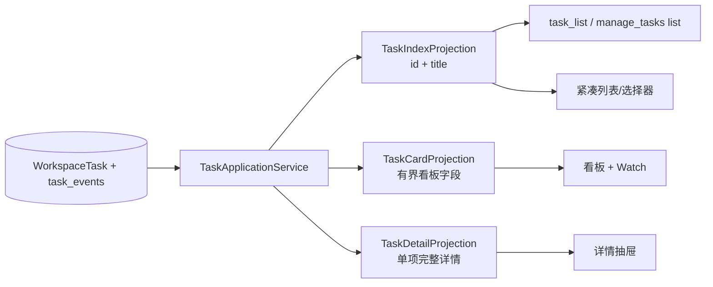

# 任务看板状态机、子任务、渐进披露与高性能拖拽优化设计方案

> 状态：Proposed，仅完成设计，尚未修改产品代码、配置、数据库或运行数据
>
> 日期：2026-08-26
>
> 决策记录：[ADR-080：任务看板分层读取、子任务与命令化拖拽](../07架构/94ADR-080任务看板分层读取子任务与命令化拖拽ADR.md)
>
> 影响范围：`WorkspaceTask` 领域、Internal/External Task API、Runtime Task Tools、Admin Task Board、Task Watch
>
> 取代范围：本方案只取代 ADR-072/ADR-073/ADR-075 中与任务列表响应、详情聚合、状态流转入口、看板实时投影有关的合同；峰谷调度、Assignment、Goal 与 Access Token 认证边界保持不变。

## 0. 结论摘要

本轮不把“拖拽”理解为前端直接 PATCH 一个状态字符串，也不把“子任务”实现成第二套待办表。目标架构为：

1. `WorkspaceTaskStatus.Ready -> Completed` 成为合法领域迁移，但只能通过显式 `complete` 命令完成；命令必须携带结果摘要并经过 CAS、幂等、子任务门禁和审计，通用 PATCH 不再修改状态。
2. 子任务仍是 `WorkspaceTask`，增加 `parentTaskId/rootTaskId/depth` 关系字段；每个子任务拥有自己的状态、版本、Assignment、Execution、评论、备注和事件。
3. 普通任务 List API、`task_list`、`manage_tasks list` 只返回 `taskId + title`。看板使用独立、字段有界的 `TaskCardProjection`；完整数据只允许通过单任务详情读取。
4. 单任务详情返回有界的评论与备注窗口、计数和游标；评论与备注有明确的 `kind`，不再使用一个含混的“评论/备注”资源。
5. 看板拖拽调用统一 `move`/Command 应用服务。跨列拖拽必须解析为合法命令；需要补充信息时打开确认面板；不合法目标明确禁用。列内拖拽只改排序。
6. 性能优化不只调虚拟列表参数，而是同时修复重复全量读取、SSE 游标错误、每事件二次 GET、全列数组重建、客户端伪全量搜索、详情假空态和动态卡片高度抖动。

## 1. 需求与范围

### 1.1 本期目标

- 状态机允许 `Ready -> Completed`。
- 支持单层子任务，子任务拥有独立状态。
- 普通列表与 Agent 管理工具执行渐进披露。
- 详情 API 与工具可读取评论和备注。
- 看板支持跨列移动和列内排序。
- 在任务规模扩大时保持正确分页、实时一致性和流畅滚动。
- 修复当前实现中会造成数据遗漏、重复读取或错误空态的相邻问题。

### 1.2 非目标

- 不把 `WorkspaceTask` 与 `TaskPlanRun/TaskNode` 合并。
- 不允许通过拖拽绕过 Assignment、WorkAdmissionFence、CAS 或权限。
- 不把任意深度任务树、依赖 DAG、关键路径或自动分解纳入本期。
- 不让父任务自动替代子任务执行，也不级联修改子任务状态。
- 不在普通 List 中通过 `include=all` 恢复全量 DTO。
- 不在前端复制状态机、列投影或迁移规则。
- 不在本规划阶段修改源码、数据库或 `D:\data`。

## 2. 当前实现证据与问题清单

### 2.1 已有能力

| 能力 | 当前证据 | 结论 |
|------|----------|------|
| 12 态任务状态机 | `Source/PuddingCore/Tasks/TaskStateMachine.cs` | 状态事实集中，适合作为唯一 Owner |
| 五列投影 | `TaskStateMachine.ProjectBoardColumn` | 列是状态投影，不应成为第二状态机 |
| Internal Task API | `Source/PuddingPlatform/Controllers/Api/TaskController.cs` | 已有 list/get/create/patch/commands/comments/watch |
| External API v1 | `Source/PuddingPlatform/Controllers/External/V1/ExternalTaskController.cs` | 已有 Token Policy、ETag、幂等、comments/evaluations/commands |
| Agent/管理工具 | `TaskListTool`、`TaskGetTool`、`ManageTasksTool` | 已复用 Core/Platform 服务，但 list 输出过宽 |
| 列内虚拟化 | `TaskColumn.tsx` 使用 `@tanstack/react-virtual` | “已有虚拟化”不等于数据链和更新链已经高性能 |
| 评论存储 | `task_comments` + `/comments` | 当前将评论和备注混为一种资源，详情还需单独请求 |

### 2.2 与本需求直接冲突的事实

1. `TaskStateMachine` 的普通迁移表没有 `Ready -> Completed`；Core 测试还明确把它列为非法转换。
2. Internal、External、`task_list` 和 `manage_tasks list` 都返回状态、优先级、执行窗口、进度、版本等字段；HTTP List 甚至复用完整 `TaskDto/ExternalTaskDto`，包含描述、验收标准和大量时间字段。
3. 单任务详情 DTO 不包含评论或备注；Admin 打开详情后再请求 `/comments`。请求失败时直接把数组置空，UI 会把“读取失败”误显示成“暂无备注”。
4. Internal PATCH 接受任意合法目标 `status`。若只把 `Ready -> Completed` 加入转换表，前端就能绕过结果摘要、Artifact、子任务门禁和完成审计。
5. 看板没有拖拽，`sortOrder` 默认大量为 `0`，同序时按 `taskId` 排序，不能提供稳定的用户排序体验。
6. 使用当前官方 Skill 读取一个没有评论的新任务时，`list-comments` 虽然返回 HTTP 200，但包装结果为 `data: null`；空集合、字段缺失和读取失败缺少稳定区分。

### 2.3 截图与代码共同暴露的 UI/性能问题

用户提供的截图显示：完成列有明显独立滚动卡顿，详情抽屉中的评论/备注空态占用较大高度。代码进一步证明：

- 首屏对五列并行调用五次 List，每列最多读取 100 个完整 `TaskDto`；
- Watch 同时发送最多 500 个完整 Task 的 snapshot，但前端忽略 snapshot；
- 每个 Task Event 服务端已经附带完整 Task，前端仍再次调用 `getTask`；
- SSE `id` 才是 `task_events` 全局游标，前端却持久化和比较 per-task `sequence`；多个任务的 sequence 会重复，可能错误丢弃事件；
- 前端发送 `afterSequence`，Internal Controller 接收的是 `afterId`，查询参数名称不一致；
- 每次事件 upsert 都遍历并复制五列、过滤每列全部卡片，再对目标列全量排序；
- `TaskCard` 未 memo，每次渲染即时创建完整菜单结构；
- 卡片高度随描述、阻塞、失败、进度和元数据变化，虚拟列表需要持续测量；
- 搜索只过滤当前已经加载的页面，却以“搜索标题/描述”呈现为完整搜索；
- 列头数字使用 `slice.items.length`，是已加载数量，不是任务总数；
- 列表视图由五列已加载卡片拼接，因此不是完整列表；
- 详情抽屉直接使用列表中的 `TaskDto`，没有重新读取单项权威详情，可能展示旧版本。

这些问题必须与拖拽一起治理，否则 DnD 的 pointer move、auto-scroll 和 optimistic update 会进一步放大重渲染与一致性问题。

## 3. 架构原则

### 3.1 一个领域事实、三种读取投影



三种投影有清晰边界：

- `TaskIndexProjection`：只能包含 `taskId`、`title`。
- `TaskCardProjection`：只包含看板立即渲染和并发移动所需的固定字段。
- `TaskDetailProjection`：只用于单项读取，包含完整任务、允许动作、执行摘要、子任务摘要以及有界评论/备注窗口。

任何调用方不得把 Detail DTO 当作 List Item。

### 3.2 命令拥有状态，PATCH 只拥有元数据

- `PATCH /tasks/{id}` 只修改 title、description、acceptanceCriteria、priority、executionWindow、agent preference 和日期等元数据。
- 所有状态迁移通过 `TaskCommandService/TaskTransitionService` 的结构化命令完成。
- `allowedTransitions` 升级为 `allowedActions`，返回 command、目标状态/列、必填字段和禁用原因。
- Admin、External API、Runtime 工具、拖拽和自动派发复用同一个应用服务，不各自解释状态。

### 3.3 渐进披露不是“少返回后让客户端 N+1”

普通 List 极简；看板和详情使用各自的批量投影。禁止先返回 100 个 id，再为每个卡片发 100 次详情请求。渐进披露的目标是让每个界面只取一次与其展示层级匹配的有界响应。

## 4. 状态机与 `Ready -> Completed`

### 4.1 新增合法迁移

普通状态图增加：

```text
Ready --complete--> Completed
```

该迁移用于“无需实际 Agent 执行、已经由用户或外部系统完成并可给出结论”的任务，例如核销、线下确认或历史任务补录。它不是跳过验收的快捷写状态。

### 4.2 新增 `Complete` 命令

新增 `TaskCommand.Complete`，第一期允许来源：

| 当前状态 | 调用者 | 是否允许 | 说明 |
|----------|--------|----------|------|
| `Ready` | Admin/Internal | 是 | 本需求的直接完成路径 |
| `Ready` | External `tasks.command` | 是 | 要求 ETag + Idempotency-Key |
| `Assigned`/`InProgress` | Admin | 否，沿用现有执行链 | 防止管理员绕过活跃 Assignment；应由 Agent disposition 或先取消/回队 |
| `InProgress` | 当前执行 Agent | 是，仍用 `task_update completed` | 保持 Active Task Context、assignmentId 和 version 校验 |
| 其他状态 | 任意 | 否 | 返回 `task.invalid_transition` |

命令体：

```json
{
  "expectedVersion": 7,
  "resultSummary": "验收清单已由负责人线下核对",
  "artifacts": ["artifact://..."],
  "reason": "无需启动 Agent",
  "idempotencyKey": "由协议层提供"
}
```

规则：

- `resultSummary` 必填，1–4000 字符；
- Acceptance Criteria 声明必需 Artifact 时，`artifacts` 必须满足；
- 有未闭合子任务时拒绝，错误为 `task.children_incomplete`；
- 无 Assignment 的直接完成写入 Task 级 `resultSummary/resultArtifacts/completionMode=manual/completedBy`；
- 产生 `task.completed` 事件，事件携带 completion mode 和 result reference，不复制大正文；
- Task/version、完成证据和 event 在一个事务内提交；
- 重复幂等请求返回原完成收据，不产生第二个事件。

### 4.3 禁止的简化

- 禁止只在 `BuildTransitions()` 加一条边而保留通用 PATCH 状态写入。
- 禁止拖入完成列后先 PATCH，再单独 POST 评论；当前两步可能部分成功。
- 禁止把 `reason` 当作完成证据；`resultSummary` 与操作原因语义分离。

## 5. 子任务领域设计

### 5.1 关系模型

第一期冻结为**单层子任务**，避免把 Workspace Task Board 演变成任意深度计划树。字段增加到 `workspace_tasks`：

```text
parent_task_id?       null = 顶层任务
root_task_id          顶层任务等于自身 task_id；子任务等于 parent_task_id
depth                 0 | 1
```

约束：

- 父子必须属于同一 workspace；
- 父任务必须是顶层任务，子任务不能继续创建子任务；
- 不能以自身为父，不能形成环；
- 子任务仍使用全局唯一 `taskId`；
- 子任务的 `sortOrder` 只在同一父任务的子任务集合内排序；顶层卡片排序与子任务排序互不干扰。

如果未来确有多层拆解需求，应另行升级 `depth` 上限与树查询，不在本期偷偷放开无限递归。

### 5.2 生命周期独立

每个子任务拥有自己的：

- `status/boardColumn/version`；
- priority、executionWindow、preferredAgentId；
- Assignment Attempt、Delivery、Execution、Session、Run；
- progress、blocker、failure、completion evidence；
- comments、notes、evaluations 和 task_events。

父任务状态不会级联覆盖子任务，移动父卡片也不会批量移动子任务。

### 5.3 父任务派生摘要

父任务详情和卡片可返回有界聚合，不把全部子任务详情嵌入：

```json
{
  "subtasks": {
    "total": 6,
    "open": 2,
    "completed": 3,
    "failed": 1,
    "progressPercent": 50
  }
}
```

其中 `progressPercent = terminal-success children / non-cancelled children` 只用于子任务进度展示，不覆盖父任务显式的执行进度字段。

### 5.4 完成、归档与删除门禁

- 父任务有任何 `Backlog/Ready/Deferred/Reserved/Assigned/NeedsReview/InProgress/Blocked/Failed` 子任务时，父任务不能 `Complete`。
- 所有非取消子任务都为 `Completed/Archived` 后，父任务仍不自动完成；父任务可能还需要汇总结论和验收。
- 子任务终态变化产生 `task.child.changed` 投影事件，更新父卡片计数，不直接修改父状态/version。
- 有子任务的父任务不能硬删除。
- 归档父任务前，所有子任务必须为终态；归档不级联，需显式批量操作并逐项留事件。
- 重新打开/恢复子任务不会自动重新打开父任务；父任务已经 `Completed/Archived` 时禁止重开其子任务，本期应创建新的跟进任务，避免父子语义倒置。

### 5.5 API

```text
POST /api/workspaces/{workspaceId}/tasks/{parentTaskId}/subtasks
GET  /api/workspaces/{workspaceId}/tasks/{parentTaskId}/subtasks
```

`GET subtasks` 是索引读取，只返回 `taskId/title`。详情抽屉使用 `TaskDetailProjection.subtaskCards` 返回当前页的有界子任务卡片投影，并带 `nextCursor`；需要完整内容时再读取单个子任务详情。

## 6. 评论与备注

### 6.1 语义拆分

当前 `task_comments` 把“评论/备注”混为同一概念。新逻辑资源为 `TaskAnnotation`：

```text
annotation_id
workspace_id
task_id
kind                 comment | note
author_kind          user | agent | system | external_access_token
author_id?
content
created_at_utc
```

- `comment`：面向协作讨论和评审的追加式消息。
- `note`：任务执行与管理的追加式操作备注，例如“等待线下确认”“状态移动原因”。
- 两者都是审计资源，不允许原地覆盖或删除；更正通过追加新记录并可选 `supersedesAnnotationId`。
- Note 不是 Secret 容器；API、日志与 UI 均应提示不要记录凭据。

### 6.2 详情响应

`GET /tasks/{taskId}` 默认返回：

```json
{
  "task": { "...": "完整单任务字段" },
  "allowedActions": [],
  "activeAssignment": null,
  "recentEvents": { "items": [], "total": 0, "nextCursor": null },
  "comments": { "items": [], "total": 0, "nextCursor": null },
  "notes": { "items": [], "total": 0, "nextCursor": null },
  "subtaskCards": { "items": [], "total": 0, "nextCursor": null }
}
```

每个内嵌窗口默认最近 20 条、最大 100 条。完整历史继续通过分页子资源读取：

```text
GET  /tasks/{taskId}/annotations?kind=comment|note&limit=&cursor=
POST /tasks/{taskId}/annotations
```

Internal 旧 `/comments` 可在迁移期映射到 `kind=comment`；External V1 `/comments` 保持已承诺语义。新 External V2 暴露 `/annotations`。

空集合在 HTTP、工具和 Skill 各层都必须稳定为 `items: []`、`total: 0`、`nextCursor: null`，不得折叠成 `null`；读取失败使用结构化 error，不能复用空集合。

### 6.3 工具响应

- `task_get` 和 `manage_tasks get` 返回 comments、notes、total、next_cursor。
- 工具参数增加 `annotation_limit`，默认 20、最大 100；不允许无限返回全部历史。
- `task_list` 和 `manage_tasks list` 不返回 annotations。
- `manage_tasks add_comment/add_note` 分开，避免 Agent 用自然语言猜 kind。

## 7. 渐进披露 API 合同

### 7.1 普通索引 List

Internal、Runtime 管理工具和新版 External API 的普通 List Item 冻结为：

```json
{
  "taskId": "4bd536f46a36443cb2f26c65027f471a",
  "title": "视觉理解增强"
}
```

分页 envelope 只可增加分页元数据，不能给 item 追加 status、priority、description、comments 或 version：

```json
{
  "items": [],
  "nextCursor": null
}
```

筛选条件仍可包含 status、boardColumn、priority、agentId、parentTaskId 和服务端 search；“可筛选”不等于“结果必须回显筛选字段”。

### 7.2 看板卡片投影

新增专用端点：

```text
GET /api/workspaces/{workspaceId}/task-board/bootstrap
GET /api/workspaces/{workspaceId}/task-board/columns/{column}?limit=&cursor=&filters...
GET /api/workspaces/{workspaceId}/task-board/watch?afterId=
```

`TaskCardProjection` 固定字段：

```text
taskId, title, status, boardColumn, priority,
preferredAgentId?, dueAtUtc?, progressPercent?,
blockerCode?, failureCode?, version, rank,
parentTaskId?, subtaskCounts,
allowedBoardMoves[]
```

明确排除 description、acceptanceCriteria、完整原因、comments、notes、events、evaluations、创建/更新时间全集和执行详情。

Bootstrap 在同一只读事务中返回：

- 每列首屏卡片页（默认 30，最大 50）；
- 每列真实 `totalCount`；
- 每列 cursor/hasMore；
- 当前全局 `eventCursor`；
- 服务端解释后的筛选摘要。

### 7.3 单项详情

只有以下路径返回完整任务：

```text
GET /api/workspaces/{workspaceId}/tasks/{taskId}
GET /api/external/v2/workspaces/{workspaceId}/tasks/{taskId}
task_get(task_id)
manage_tasks(action=get, task_id)
```

创建、更新和命令响应可以返回单项详情或精简 mutation receipt；它们不是 List，不受 id/title 限制。

### 7.4 External API 版本策略

External V1 已是明确版本化合同，不能静默改变列表 item 形状。本方案采用：

1. 新增 `/api/external/v2/**`，按本方案提供 index/card/detail/annotation/subtask/move 合同；
2. 官方 `pudding-task-board` Skill 迁移到 v2；
3. V1 在一个明确迁移里程碑内保持既有行为但不增加新能力，原 comments 语义不变；
4. External API 默认关闭的开发环境完成 Skill/调用方迁移后删除 V1，不维护永久双写或第二状态机。

V1/V2 都只做协议适配，继续复用同一应用服务、Store、状态机和事件。

## 8. 看板拖拽设计

### 8.1 两类拖拽

1. **列内排序**：状态不变，只修改 rank。
2. **跨列移动**：必须解析为一个结构化 Command；排序和状态事件在同一事务提交。

前端不得发送 `status=Completed` 或自行猜测聚合列中的具体目标状态。

### 8.2 `allowedBoardMoves`

每个卡片由服务端返回允许移动：

```json
{
  "targetColumn": "Done",
  "command": "complete",
  "targetStatus": "Completed",
  "requires": ["resultSummary"],
  "enabled": true,
  "disabledReason": null
}
```

目标列高亮完全由此字段驱动。没有 entry 的列不可放置；键盘移动菜单使用同一数据。

### 8.3 第一阶段映射

| 源状态 | 目标列 | 行为 |
|--------|--------|------|
| `Backlog` | Todo | `promote`：Backlog -> Ready |
| `Ready` | Done | `complete`：弹出完成面板，要求 resultSummary |
| `Ready/Deferred` | InProgress | 打开 Run Now/指派面板；Task 先进入 Reserved/Assigned，待 Agent accept 后由事件进入 InProgress，不伪造运行中 |
| `InProgress/Blocked/NeedsReview` | Todo | `return-to-ready/resume`，要求原因 |
| `Failed` | Todo | `reopen`，要求原因 |
| 任意同列 | 同列 | `reorder`，只改 rank |
| `Completed` | 其他列 | 不允许；归档走菜单命令 |
| `Cancelled/Archived` | 任意 | 不出现在主看板 |

Todo 列聚合多个真实状态，因此同列拖拽不改变真实状态。状态徽标继续解释 Ready/Deferred/Reserved/Assigned/NeedsReview。

### 8.4 Move API

```text
POST /api/workspaces/{workspaceId}/tasks/{taskId}/move
```

请求：

```json
{
  "expectedVersion": 7,
  "targetColumn": "Done",
  "beforeTaskId": "...",
  "afterTaskId": null,
  "command": "complete",
  "resultSummary": "...",
  "reason": "..."
}
```

服务端必须：

- 重新计算当前 `allowedBoardMoves`，不能信任客户端 command；
- 校验目标锚点属于同 workspace、同目标列和同一 parent scope；
- 通过 CAS 拒绝陈旧卡片；
- 同事务执行状态命令、生成新 rank、递增 version、写 event；
- 返回更新后的 `TaskCardProjection`、global event cursor 和 mutation receipt；
- External V2 要求 `If-Match + Idempotency-Key`。

### 8.5 排序

保留 `long sort_order`，但采用有间隔的 rank：

- 初始间隔 `1024`；
- 插入相邻卡片中点；
- 无可用间隔时，只对目标列/parent scope 的有界窗口重排；
- 重排属于投影排序，不递增未被直接移动 Task 的领域 version，也不产生伪状态事件；
- 并发移动以 moved task 的 CAS + 目标 rank epoch 解决，冲突返回 `task.rank_conflict` 并让客户端重载受影响列。

### 8.6 前端交互

- 使用 `@dnd-kit/core` + `@dnd-kit/sortable`，并保留按钮/键盘“移动到…”替代操作。
- 拖动时使用 portal overlay，不把原卡片从虚拟列表物理移除。
- 边缘自动滚动只作用于当前列，不同时驱动页面和横向容器。
- 立即做 optimistic projection；412/409/422 时动画回滚并显示服务端原因。
- 需要 resultSummary、Agent 或 reason 时，drop 只打开确认面板；提交成功后才移动。
- `aria-live` 宣告“已将任务移动到已完成”或冲突失败；支持 Space 拾取、方向键选择、Enter 放下、Escape 取消。

## 9. 实时一致性与 Watch 修复

### 9.1 游标合同

必须区分：

- `eventId`：业务事件幂等 ID；
- `sequence`：单 Task 内单调序号；
- `cursor`：`task_events.id` 全局自增游标，用于 Watch 恢复。

客户端只持久化 `cursor`，不得用 per-task sequence 代替。查询参数统一为 `afterId`，Header 使用 `Last-Event-ID`。

### 9.2 Bootstrap + Delta

```text
GET board/bootstrap -> cards + counts + eventCursor
GET board/watch?afterId=eventCursor -> TaskCardDelta...
```

- 不再在 SSE 中发送一份被客户端忽略的 500 Task 全量 snapshot；
- 每个 delta 携带 global cursor、taskId、version、oldColumn/newColumn 和可选最新 CardProjection；
- 客户端可直接 reducer merge，不再每事件调用 `getTask`；
- 16–50ms 内的同 task 多事件按最高 version 合并后批量提交 React store；
- cursor 过期返回 `task.watch_cursor_expired`，客户端重新 bootstrap；
- Snapshot + Delta 从头 replay 的结果必须一致，迟到 progress 不得覆盖终态。

## 10. 前端信息架构与 UI 优化

### 10.1 页面框架

- 宽屏使用五列自适应网格，`minmax(260px, 1fr)` 吃满可用宽度，避免截图中的右侧大块空白。
- 窄屏保留一个水平滚动 owner；工具栏 sticky，不随列滚动消失。
- 每列保留独立纵向虚拟滚动，但页面本身不参与同方向滚动；触控板滚动只命中悬停列。
- 列头显示真实总数和已加载数，例如“已完成 2,348 · 已载入 30”，不再把 loaded count 当总数。

### 10.2 卡片

- 固定紧凑高度；标题最多两行。
- 卡片不显示 description 全文，改为状态原因的一行摘要；完整描述进入详情。
- 显示优先级、真实状态、Agent/执行标记、截止时间、子任务进度。
- 操作菜单按需构造或共享模板；`TaskCard` 使用语义 memo，未变化卡片不重渲染。
- 被拖卡片、drop target 和不可放置列有清楚的视觉/焦点状态，不能只依赖颜色。

### 10.3 列加载

- 首屏每列 30；滚到末端通过 sentinel 自动加载下一页，同时保留“加载更多”作为可访问性兜底。
- `Done` 默认按最近完成时间/用户 rank，不一次加载全部历史。
- 卡片采用稳定高度，虚拟化避免每帧 `measureElement`；确需变化的阻塞详情放入 drawer。
- DnD 期间锁定 virtualizer 的测量和 dragged item key，防止跳位。

### 10.4 详情抽屉

从当前单一长页面改为：

- 顶部：状态、优先级、Agent、版本和主操作；
- 概览：描述、验收、执行摘要；
- 子任务：进度 + 子任务卡片页 + 新建子任务；
- 活动：评论 / 备注 / 事件三个 Tab，首次打开对应 Tab 时再加载后续页；
- 危险操作：放入“更多”菜单或独立折叠区，不长期占据主阅读流。

空态应为一行轻量提示。加载失败显示“读取失败，重试”，不得伪装成“暂无”。评论和备注分别显示数量、作者、时间和 kind。

### 10.5 紧凑列表与搜索

- 表格不再拼接五列已加载页，而是独立使用 `TaskIndexProjection` 分页。
- 默认仅显示 ID 与标题；点击行读取详情。
- 搜索由服务端执行，250ms debounce；客户端不把首 100 条过滤结果冒充全量结果。
- 若需要 status/priority 等批量管理字段，使用专用 `TaskAdminTableProjection` 路由并明确命名，不扩充通用 List。

## 11. 存储与查询

### 11.1 表结构

`workspace_tasks` 增加：

```text
parent_task_id TEXT NULL
root_task_id TEXT NOT NULL
depth INTEGER NOT NULL DEFAULT 0
result_summary TEXT NULL
result_artifacts_json TEXT NULL
completion_mode TEXT NULL
completed_by TEXT NULL
```

新增 `task_annotations`，现有 `task_comments` 数据一次性迁入 `kind=comment`。开发阶段采用原地 schema 升级，不增加长期双写兼容层。

### 11.2 索引

```text
(workspace_id, status, sort_order, task_id)
(workspace_id, parent_task_id, sort_order, task_id)
(workspace_id, root_task_id, depth)
(workspace_id, task_id, kind, created_at_utc, annotation_id)
task_events(workspace_id, id)
```

标题/描述搜索使用 SQLite FTS5 的任务搜索投影；搜索索引只存可搜索字段，不复制评论、备注或 Secret。

### 11.3 查询约束

- Index 查询只 SELECT task_id/title。
- Card 查询显式列清单，禁止 `SELECT *` 后映射完整聚合。
- Detail 可并行读取 Task、最近事件、annotation 两类窗口和子任务卡片，但由一个 application query 统一组装。
- 所有 cursor 绑定 workspace、filter hash、sort key 和 taskId；不同筛选不能复用 cursor。

## 12. 错误、权限与审计

新增稳定错误：

| code | HTTP | 含义 |
|------|------|------|
| `task.children_incomplete` | 422 | 父任务仍有未闭合子任务 |
| `task.invalid_parent` | 422 | 父任务不存在、跨 workspace、非顶层或形成非法层级 |
| `task.rank_conflict` | 409 | 排序锚点或 rank epoch 已变化 |
| `task.move_not_allowed` | 422 | 当前状态不能移动到目标列 |
| `task.annotation_kind_invalid` | 422 | annotation kind 非 comment/note |
| `task.watch_cursor_expired` | 409 | Watch 游标不再可追赶，需要 bootstrap |

权限：

- Internal/Admin 沿用 JWT + workspace 权限。
- Runtime 执行者 `task_list/get/claim/update` 仍限 mine scope；子任务不扩大可见范围。
- External V2 沿用 `tasks.read/write/comment/evaluate/command`，新增 `tasks.note` 用于追加 note；读取 annotation 仍需 `tasks.read`。
- 创建子任务需要 `tasks.write`，跨列状态命令需要 `tasks.command`。
- 每次 move/complete/subtask create/annotation append 写 actor、origin、traceId、causationId 和 idempotency key 摘要。

## 13. 代码级实施矩阵

### 13.1 PuddingCore

| 文件 | 目标 |
|------|------|
| `Tasks/WorkspaceTaskModels.cs` | parent/root/depth、完成证据、Complete command、错误码和事件 |
| `Tasks/TaskStateMachine.cs` | Ready -> Completed；命令化完成；父子门禁不放进纯状态边表 |
| `Tasks/TaskProjectionContracts.cs`（新增） | Index/Card/Detail/AllowedAction/Annotation contracts |
| `Tasks/TaskAdminContracts.cs` | list 极简、get 聚合、move/subtask/annotation 命令 |
| `Tasks/TaskAgentCommandContracts.cs` | task_list 极简；task_get 返回 comments/notes 窗口 |

### 13.2 PuddingPlatform

| 文件 | 目标 |
|------|------|
| `Services/Tasks/WorkspaceTaskSchemaBootstrapper.cs` | 父子、完成证据、annotation schema/index/migration |
| `Services/Tasks/SqliteWorkspaceTaskStore.cs` | 专用 index/card/detail/children/annotation 查询，不以完整 Task 查询代替 |
| `Services/Tasks/TaskCommandService.cs` | Complete/Move 原子命令、子任务门禁、rank CAS |
| `Services/Tasks/TaskBoardProjectionService.cs` | bootstrap、列页、总数和 CardDelta |
| `Controllers/Api/TaskController.cs` | PATCH 元数据化；detail 聚合；subtask/annotation/complete |
| `Controllers/Api/TaskBoardController.cs`（新增） | bootstrap/column/move/watch |
| `Controllers/External/V2/*`（新增） | v2 渐进披露合同与外部幂等/ETag 适配 |
| `Controllers/External/V1/*` | 迁移期冻结，不复制新状态机；最终删除 |

### 13.3 PuddingRuntime

| 文件 | 目标 |
|------|------|
| `TaskListTool.cs` | item 仅 task_id/title |
| `TaskGetTool.cs` | 单项完整读取，带 comments/notes/subtask card page |
| `ManageTasksTool.cs` | list 极简；新增 complete/move/create_subtask/add_comment/add_note |
| `TaskToolModels.cs` | annotation_limit/cursor 与新 mutation 参数 |

### 13.4 PuddingPlatformAdmin

| 文件 | 目标 |
|------|------|
| `workspace-tasks/types.ts` | Index/Card/Detail 分型，禁止一个 TaskDto 到处复用 |
| `workspace-tasks/store.ts`（新增） | normalized tasksById + columnIds + batched delta reducer |
| `TaskBoard.tsx` / `TaskColumn.tsx` | 自适应布局、虚拟列、自动分页和 DnD context |
| `TaskCard.tsx` | 固定高度、memo、拖拽/键盘语义和子任务摘要 |
| `TaskDetailsDrawer.tsx` | 单项读取、子任务、评论/备注/事件 Tabs、失败态 |
| `api.ts` | bootstrap + global cursor Watch，不重复 getTask |
| `TaskTable.tsx` | 独立 index 分页，不拼接 board 缓存 |

### 13.5 测试

| 层 | 覆盖 |
|----|------|
| Core | Ready complete、非法 complete、allowedActions、父子完成门禁、层级/环约束 |
| Store | index 只取两字段、card 投影、annotation kind、子任务分页、rank 冲突、索引查询计划 |
| API | Internal/External v2 DTO 快照、ETag/幂等、comments+notes、move 与错误码 |
| Tool | task_list/manage list 仅 id/title；get 返回 annotation；参数有界 |
| Watch | 全局 cursor、多任务相同 sequence、不丢不重、cursor expiry、bootstrap gap |
| React | DnD 合法/非法目标、完成面板、rollback、键盘移动、虚拟化 item 稳定 |
| 性能 | 10k 总任务、单列 2k、每任务 500 annotations 的数据集 |

## 14. 性能预算与验收

在本机 Release/生产前端构建、10,000 个任务且单列 2,000 个任务的数据集上：

- Board bootstrap P95 ≤ 250ms，响应压缩后 ≤ 250KiB；
- 单列下一页 P95 ≤ 150ms，默认 30、最大 50 张卡；
- 普通 List 每个 item JSON 只有 `taskId/title`；契约测试禁止新增字段；
- 初始看板同时挂载卡片 DOM ≤ 100，任一列 overscan ≤ 8；
- 连续滚动 5 秒期间长任务（>50ms）为 0，目标平均帧率 ≥ 55fps；
- 单个 delta 只重渲染受影响卡片和至多两个列容器；
- 100 个连续事件在 UI 侧合并后 React commit 次数 ≤ 10；
- Watch 使用 global cursor，两个不同 Task 的 `sequence=1` 均能到达且各处理一次；
- 打开详情只发一次 detail 请求；评论/备注读取错误显示错误态而非空态；
- 服务端搜索覆盖全部匹配项，不只覆盖已加载页面。

性能测试记录硬件、数据规模、构建模式、浏览器版本、P50/P95、DOM 数、long task 和丢帧，不只给主观“流畅”。

## 15. 分期

### P0：正确性先行

1. 冻结 Index/Card/Detail/Annotation/AllowedAction 合同。
2. 修复 Watch global cursor 与 `afterId` 命名，消除 snapshot/事件二次读取。
3. 新增 Complete command，移除 PATCH status。
4. 让详情返回评论、备注和明确错误态。

### P1：子任务

1. schema 与领域约束。
2. create/list/detail projection。
3. 父任务计数、完成/归档/删除门禁。
4. Runtime/External v2 合同。

### P2：拖拽与排序

1. allowedBoardMoves + move API。
2. rank/CAS/rebalance。
3. dnd-kit、键盘移动、确认面板和回滚。

### P3：规模化 UI

1. normalized store、固定卡片、memo 和事件批处理。
2. 自适应列、自动分页、详情 Tabs、服务端搜索。
3. 10k/2k 性能基线和浏览器 smoke。

### P4：External/Skill 迁移与收口

1. External V2 OpenAPI/DTO 快照。
2. 官方 `pudding-task-board` Skill 改用 v2 并通过 doctor/list/get/create/comment/note/complete 测试。
3. 迁移窗口结束后移除 External V1 兼容入口。
4. 进程外重启到明确新构建，再做真实浏览器与 Token smoke。

## 16. 完成定义

以下全部满足才能把 ADR 从 Proposed 转 Accepted/Implemented：

1. `Ready -> Completed` 可通过 complete 命令完成，结果摘要、CAS、幂等与事件可复核；PATCH 不能直接改状态。
2. 子任务有独立状态/version/执行链；父子门禁和非级联规则有自动测试。
3. 所有普通 List 与 `task_list/manage_tasks list` 的 item 仅有 id/title；看板和详情使用独立投影。
4. 单项详情和相关工具返回分页、有界且可区分的 comments/notes；空集合保持 `items: []`，读取失败不显示为空。
5. 看板支持列内排序、合法跨列拖拽、完成确认、冲突回滚和键盘等价操作。
6. Watch 使用全局 cursor，无参数名漂移、无每事件二次 GET、无重复全量 snapshot。
7. 搜索/表格覆盖完整数据集，列头显示真实总数。
8. 性能预算、契约测试、恢复测试、External v2/Skill smoke 和外部进程生命周期验收都有证据。

在以上完成前，本文件只代表设计完成，不代表代码实现、部署或生产验收。
