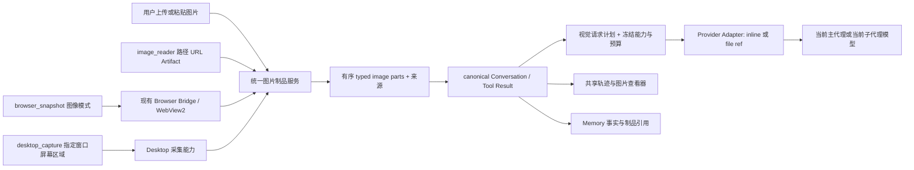

# 原生视觉与统一取图、截图优化设计

> 日期：2026-09-12；状态：设计完成，待实施与真实运行验收。
> 范围：用户附件、Agent 自主取图、WebView2 页面截图、Windows 桌面截图、图片型工具结果及其上下文/缓存/轨迹。
> 决策：[ADR-088](../07架构/102ADR-088原生视觉取图与截图统一链路ADR.md)。延续 ADR-077 已交付的 Artifact、typed parts 和 Files API；本轮不修改产品源码或运行配置，看板与执行通知通过已授权的外部 API 登记。
> 看板映射：[登记记录](../Reports/原生视觉优化看板修订-2026-09-12.md)。本方案加入上一阶段路线，不替代缓存 >99%、Memory、子代理弹性预算和长程自治任务。

## 1. 优先结论

模型已具备图片理解能力后，Pudding 的职责应集中在“正确取得图片、可靠交给当前模型、保存可追溯的引用”。用户图片不再需要一个中间 Agent 先描述一次；Agent 取图和截图也不应自动再调用辅助 LLM。

保留 `image_reader` 的按需取图功能，收敛为一个简单工具；保留显式第二意见能力，走通用子代理委派。截图是视觉数据来源，图片生成和向外发送图片是另外两种能力。共享制品存储和授权服务，不把这些操作挤进一个模式繁多的超级工具。

最先处理 **V5 能力声明和图片预算纠偏**。随后 V6 收敛取图、V7 收敛传输，V8/V9 补齐 Web/桌面截图，V10 完成统一展示；最终使用既有 V4 卡做当前两种主力模型的真实验收。

## 2. 当前证据与问题

以下为 2026-09-12 的源码和配置只读快照；配置事实不等于某个正在运行的 Agent 已加载相同 Execution Snapshot。

| 编号 | 已核实的事实 | 影响与优化 |
|---|---|---|
| F1 | `D:/data/config/llm.providers.json` 中 `deepseek/deepseek-flash`、`bigmodel/glm-5.3-flash` 均使用 `responses`，两者 `capabilityTags` 均缺少 `vision`；`ExecutionRunContracts.cs` 的 `SupportsVision` 依赖该标签 | 模型升级不能自动穿过旧能力门禁。核验真实路由和能力后更新配置、模型目录及新 Run Snapshot；不得仅凭名字或 Responses 协议默认全支持 |
| F2 | `ImageReaderTool.cs` 仍以 `NativeToolOutputProtocol = "responses"` 判断图片工具结果，`auto` 在不满足时自动进入 `visionHelperModel` | 取图工具承担了协议适配、模型选择和第二次推理；旧标签错误可能触发辅助调用或缺少辅助模型错误 |
| F3 | ADR-077 V0–V2 已有 typed parts 持久化、用户附件直接入模、多轮恢复；V3 已有 Files 上传与 remote ref store | 不重写这些链路。历史“只有设计”“Image Reader 只能本地路径”“Files 尚未实现”的描述需要修正 |
| F4 | `IVisualArtifactResolver` 返回 Data URI；`LlmVisualInputPlanner` 大图分支再解码上传，直接接收 `IDeepSeekFilesUploader` | 大图存在二进制→Base64→二进制绕行；通用规划层耦合具体厂商。改流式读取和 Provider 传输策略 |
| F5 | `VisionRequestPolicy` 默认 8 张、2,000,000 字节 inline 门槛、40 MiB 解码总量、每图 384 tokens | 产品限制、传输选择和厂商硬限制混在一起；解码字节预算不能代替最终 JSON 请求体预算，图片 token 估计已过时 |
| F6 | `BrowserSnapshotTool` 返回 DOM/AX/HTML；`WebView2BrowserPage.ScreenshotAsync` 抛出 `NotSupportedException`，`RemoteBrowserPage.ScreenshotAsync` 也 Unsupported | 不能因存在 Screenshot 接口就宣称 Web 可截图。补齐 Abstractions → Bridge → Desktop WebView2 → Artifact → typed result |
| F7 | 本次检索未发现通用 Windows 桌面图像采集实现；`CaptureActivityEvidenceAsync` 是 Browser 活动证据文档，不是屏幕像素截图 | 新增 Desktop 设备能力；Web 摄像头采集也不等同于桌面截图 |
| F8 | `import_image` 使用独立远程导入服务、输出 Artifact 元数据；`image_reader` 也做 URL/本地导入；`visionHelperModel` 遍布 manifest、DTO、Snapshot 与 Web 编辑表单 | 复用获取/验证/落盘实现；先查清调用者再删除专属 helper 字段和重复导入分支，避免只删工具描述留下旁路 |

### 2.1 当前公开协议核验

核验日期为 2026-09-12，以下是厂商事实，不作为永久写死的产品限制：

- DeepSeek 当前公开文档明确 `deepseek-flash` 接收图片；单图 token 上界为 1024，inline 单图上限 32 MiB，请求体 48 MiB，Files 单图 64 MiB。代码的 384 估计和 2 MB 强制上传门槛不能再被解释为该模型的现行协议限制。[Vision](https://api-docs.deepseek.com/guides/vision/)
- DeepSeek Responses 支持用户图片及 `function_call_output.output` 内的图片。`image_url` 与 `file_id` 互斥；Files 路径不使用 `detail` 参数调整清晰度。因此低清 Files 输入要先生成有独立 hash 的派生图。[Responses API](https://api-docs.deepseek.com/guides/responses_api/)
- Z.ai 官方模型卡确认 GLM-5.3-Flash 是原生多模态模型。这不能单独证明本机所选服务端的 Responses、工具图片、Files 和具体限制都已实现；必须逐项做该路由的请求合同测试及 smoke。[官方模型卡](https://huggingface.co/zai-org/GLM-5.3-Flash)
- WebView2 有 `CapturePreviewAsync`；首个 `ContentLoading` 之前不能可靠截图，导航过渡时可能取得旧页面。因此截图要绑定本次页面版本和加载状态。[Microsoft API](https://learn.microsoft.com/en-us/dotnet/api/microsoft.web.webview2.core.corewebview2.capturepreviewasync)

Embedding 和图片生成模型仍按各自职责配置，不因主力推理模型升级而统一标记 `vision`。本阶段也不据此启用音频/视频输入输出；后续可复用内容块与制品协议扩展。

## 3. 目标链路与组件职责

| 所属层 | 唯一职责 | 复用/调整入口 |
|---|---|---|
| Core 合同/Runtime | typed parts、预算计划、模型能力快照、canonical 事件和上下文选择 | `LlmImagePart`、`ExecutionRunContracts`、`LlmVisualInputPlanner` |
| Platform | Workspace 授权、图片导入验证、原图/派生图落盘、引用生命周期、下载和预览 | `VisionArtifactStorageService`、`VisualArtifactReference`、现有 API |
| Host 工具 | 接收来源与裁剪请求，调用服务，返回图片块与简短元数据 | `ImageReaderTool`、`ImportImageTool`；不选辅助模型 |
| Provider Adapter | 根据当前路由编码图片块、流式上传、remote ref 失效恢复、实际 usage | `ResponsesLlmGateway` 及现有其他 Gateway；Files 客户端留在 Provider 实现 |
| Desktop | 按授权目标取得 Windows/WebView2 像素，报告尺寸、坐标与采集状态 | 现有认证 Bridge、WPF Dispatcher、Browser 实现；不管理 LLM/Memory/数据库 |
| Web | 上传/截图目标选择、进度、图片预览、Run 轨迹投影 | 复用 Chat content parts 与子代理检查器，不自建采集/执行状态机 |

沿用 `vision-*` Artifact 与现有持久化结构扩展元数据，不新建平行的“多模态数据库”或全套媒体框架。需要的新接口保持小而具体：把 Artifact resolver 演进为元数据查询 + 授权流读取；把 Provider visual transport 从现有 Planner 中抽离。名称可以随仓库规范调整，职责不可回流到工具层。

## 4. 模型能力：既简洁，又不能把协议名字当能力

### 4.1 一个有效能力快照

在已有 `AgentExecutionSnapshot` 内增加/收敛视觉能力结构，不在每个工具重复查配置。有效值由“选定模型能力 ∩ 选定 endpoint/adapter 合同 ∩ 产品策略”形成：

| 字段 | 含义 |
|---|---|
| `userImageInput` | 当前路由能接收用户图片 |
| `toolImageOutput` | 当前路由能原样表达图片型工具结果并保留 call ID |
| `inlineImage` / `fileImageReference` | 当前路由可用的传输方式 |
| `supportedMimeTypes` / `detailModes` | 实际格式与细节控制，不按模型家族猜测 |
| `maxImageBytes` / `maxBodyBytes` / `maxImages` | Provider 硬限制；注明 bytes 是解码后还是 wire body |
| `imageTokenEstimatorVersion` | 当前模型图像预算算法或保守上界，以及已验证日期 |
| `capabilityRevision` / `source` | 配置和 Adapter 合同版本；区分声明、合同测试和真实 smoke |

`vision` 标签可以在 V5 先修复现有路径，最终作为该结构的投影；不能再出现标签一套、Snapshot 一套、Image Reader 常量又一套判断。配置优先、版本化生效，不在每次请求在线探测模型能力。模型/Provider 更新后通过专门验证任务重新确认，失败保持明确的 unknown/unsupported 状态，不伪造成功。

### 4.2 配置与长程 Run 的边界

更新模型配置后，新 Run 冻结新快照；已有 Run 不因热更新突然改变路由、工具 schema 或图片编码。对已存在 Agent 的 Creation Snapshot/实例配置，明确显示“当前执行版本/可更新版本”，通过现有更新命令执行；不能只更新模板而认为所有 Agent 已生效。

上传图片时尽早检查目标 Agent 的有效能力。缺少能力时保留附件与输入草稿，并返回可操作的配置/路由错误。后台事件同样使用 Core admission，不能因为没有 Web 就绕过验证。取图工具遇到不支持的图片型结果，返回结构化错误，不自动开第二个 LLM，不把工具图片伪装成用户消息。

若用户或任务显式要求第二意见，使用现有子代理 API，传授权 Artifact 引用和问题；由通用委派入口冻结该子代理模型能力、记录预算和生命周期。子代理没有视觉能力时在派发前报错，不在子代理内再次递归寻找 helper。

## 5. 四种来源的具体流程

### 5.1 用户主动发送图片

1. Web 拖入、粘贴、文件选择、摄像头或 Connector 接入，复用服务端图片导入；上传返回 Artifact ID 与展示元数据。
2. `SubmitTurn` 提交有序文本/图片块；已上传图片不再触发 `image_reader`。保持多图原始顺序，单次消息的幂等键防双击重发和网络重试重复建 Turn。
3. 图片成为用户消息的一部分，第一次主模型请求就收到图片。后续工具轮次按同一 canonical 历史装配；不能只在第一次 HTTP 请求临时加图片。
4. 服务端产出缩略图给 Web，原图用于需要的精细阅读。不能为了前端预览清晰或上传速度暗中改写唯一原图。
5. 上传部分失败时，明确指出失败附件；不自动提交“只有成功图片”的不完整问题。用户可以移除失败附件后再发送。
6. 现有“Chat 图片消息回放丢失与旧 Bundle”任务继续负责历史图片呈现和发布验证；本阶段不把这个问题归为缺少模型能力，也不重复实现一套回放。

### 5.2 Agent 主动读图片

建议工具合同保留 `image_reader(path, region?, detail?)`：

- `path` 接受现有 URL、绝对本地路径、`artifact://`；返回 `OkWithParts`，包含短文字元数据与 `LlmImagePart`。
- `region` 为可选图片像素矩形；`detail` 为产品语义（如 overview/original），由 Adapter 映射。原图不覆盖，裁剪图形成带父引用的派生制品。
- 删除 `auto/native/delegate` 的业务分叉和 helper 提示；普通取图成功对应零个额外 LLM invocation。
- `import_image` 若仍被图片生成工作流使用，保留“只导入、返回引用、不送入本次模型”的语义，与 Reader 共享 importer。调用图无真实消费者才删除入口；不新增别名维持重复工具列表。
- `generate_image` 和 `send_image` 保持生成/对外发送职责；绝不能因读取/截图授权而自动发布图片。

移除 helper 字段时，先登记现有实例是否使用；有显式第二意见用途的，将配置转换为通用子代理模板/模型选择。用一次有版本、可回滚的配置更新处理既有 manifest；无使用者的字段直接移除。运行热路径不保留永久双读、legacy fallback 或自动文本代读。历史工具事件仍作为历史事实展示，无需为重放再次执行旧 helper。

URL 导入复用已存在的来源授权、DNS/重定向校验、大小限制和 MIME 签名检查；每次重定向重新核验目标。登录态页面需要 Browser 目标采集，不复制 Cookie 到通用下载器，也不将认证 URL 暴露给 Provider。路径授权沿用现行读文件策略，截图和网络各走本身能力授权。

### 5.3 Web 页面截图

优先扩展现有 `browser_snapshot`，增加 `mode=structure|image|both`，默认保持 structure。`both` 只返回有界结构摘要与图像；完整 HTML/全量 DOM 通过已有显式参数或制品按需查看。保留既有七工具的定位/交互习惯，不增加多个同义截图工具。

实现链路：`BrowserSnapshotTool` → `IBrowserPage.ScreenshotAsync` → `RemoteBrowserPage` → Bridge 命令 → `BrowserBridgeCommandDispatcher` → WebView2 截图 → Core Artifact 接收 → typed image tool result。

首版只承诺指定标签页的 viewport/region。`FullPage` 不能因已有布尔字段就假装支持：需独立声明支持能力，并在滚动拼接/渲染方案通过验收后启用。首版返回明确 unsupported，不自动滚动长页面。

一次截图必须携带 `contextId/pageId/pageVersion/captureId/capturedAt/viewport/scrollOffset/deviceScale`。导航和交互使用既有互斥与 PageVersion 规则；采集前后检查版本，变化时返回过期错误，不能把旧像素标成新页面。DOM 与图像不能声称逐像素原子一致：动画/异步渲染存在时记录采集时间范围、各自版本和一致性标记；需要精确对齐则等待稳定条件后重采。

优先 DOM/AX 查找文字、按钮和状态；Canvas、图表、布局、图片或 DOM 不足时才请求图像。模型点击后等待状态变化再观察；旧图和旧 Locator 不作为新状态的操作证据。跨标签页读取必须使用已选定的 pageId，禁止默认捕获当前任意前台页。

### 5.4 桌面截图

新增一个 `desktop_capture` 通用采集工具，目标为当前已授权的 display/window/region，不混入鼠标键盘控制。Agent 可通过复用 Desktop 能力查询取得可用目标；实际权限由现有 capability/Bridge admission 承担。

Desktop 负责原生采集提供者和 WPF/OS 线程约束。采用一个经目标 Windows 版本验证的截图实现，避免为每种异常串联 PowerShell、GDI、外部程序的无声回退。首轮实现先对窗口/屏幕采集可靠性做小型技术验证，再选择能覆盖目标环境的单一主实现；如果某类目标不支持，以能力结果明确表达。

Core 保持工具调用、权限、Artifact 存储、事件、预算和模型调用的所有权。Bridge 控制消息携带目标、captureId、大小限制、取消与传输引用；大图通过受认证、一次性、限定 workspace/run/captureId 与字节数的二进制流上传，完成后提交元数据和引用，不把 Base64 大字符串塞入活动日志或长期 WebSocket 队列。复用既有上传服务；新增传输授权不成为可任意写路径的接口。

桌面坐标使用明确的物理像素矩形，另带 DPI/缩放、虚拟桌面原点、显示器 ID；负坐标、多显示器不同缩放、窗口移动和关闭都有定向验证。窗口截图不是全屏截图再默默裁出一块；若实现实际采用全屏裁剪，需要按真实采集范围申请能力并记录来源。

Web 面板控制场景可以选择窗口/屏幕后发起单次截图或为指定 Agent 配置允许的采集范围；已有有效授权内不每次弹确认。无人值守任务依赖预先授予的能力和在线 Desktop 会话，不依赖 Web 打开。Desktop 离线、会话锁定、目标关闭或受保护表面无法采集时，返回分类错误；不把黑图、缓存旧图或空文件报告为成功。

截图权限不自动扩大到键盘记录、持续录像、任意窗口操作或对外发送图片。本设计只增加任务驱动的取图；不会启动每次心跳全桌面截屏。

## 6. 图片制品、传输和生命周期

### 6.1 复用现有 Artifact，减少复制

现有 `vision-*` ID 继续作为不透明公开引用；内部用内容 hash 关联 blob，Workspace 授权独立校验，不能把知道 hash 当成访问权限。元数据至少包含 MIME、宽高、字节数、内容 hash、来源类别、创建时间、父图/裁剪矩形/变换版本；截图额外携带目标与观察时间。

Resolver 分为 `GetMetadata` 和 `OpenRead`。Planner 先用元数据校验全部请求，再按计划读取流；Files 上传直接消费文件流，inline 只在最终编码时生成 Base64。取消立即传播到下载、图像变换、上传和 Bridge；临时制品未提交不进入 canonical 消息，失败按现有清理策略回收。

同一来源的重复字节只复用存储和上传，**不去掉逻辑上的第二次观察**。同图跨工具调用仍各保留 callId、时间和顺序。URI 相同不等于图片相同；URL 内容更新要重新固化，不能仅按 URL 无限缓存。

### 6.2 Provider 传输策略

通用 Planner 输出逻辑计划；Provider Adapter 决定 inline 或 Files。远程引用缓存键至少区分 Provider endpoint/账户凭据版本、内容 hash、实际图像变体与相关协议用途，继承 Workspace/调用者授权。remote fileId 仅为加速缓存，本地 Artifact 是恢复权威。

Files 是否值得使用由请求大小、重复使用、上传延迟和有效期限决定，不把所有 >2 MB 图强制上传，也不把所有小图永久 inline。无 Files 的合法原生路由可以在预算内使用 inline；超限则明确要求裁剪/压缩或允许的路线，不退回 helper。并发上传同一 cache key 使用 single-flight；重启后复用持久引用，过期后有界重建一次，认证失败直接返回配置错误，禁止“删除→上传→再失败”的无界循环。

历史 canonical 内容始终持有 Artifact ID，不持久化会过期的 provider fileId 作为唯一事实。某次请求准备完成后冻结 transport manifest；同一次网络重试保持同一份字节/引用，不因重试重新生成不同图像或新的随机 URL。过期导致必须重建时创建可归因的新 attempt，记录前缀变化原因。

### 6.3 预算与图片清晰度

统一计划按整个最终请求计算：包含用户、工具、保留历史和多图重复出现；不能每条消息单独通过校验后合并成超限请求。区分原图解码字节、内存分配、Base64 编码长度、JSON 总体积、估计视觉 tokens 与 Provider 实际 tokens。

2026-09-19 更新：按用户要求取消 `8 张` 产品门槛，默认采用 DeepSeek 官方 `600 张`，唯一策略源对主/子代理一致生效，其他模型可通过合同收紧；见[修复记录](../Reports/图片请求官方限制与预处理恢复修复-2026-09-19.md)。同样，图像质量/裁剪由统一策略定义，不在前端、Reader、Planner 各压一次。Provider 边界按 endpoint/model/版本维护；预算预检必须考虑完整序列化请求体，禁止用 40 MiB 解码量来保证 48 MiB body 可发送。

默认优先任务所需清晰度。大屏先概览、明确需要的小字再裁剪原图；为节省 tokens 而导致看错文件名、数字、按钮的方案不能验收。未知模型估计保守标注，usage 缺少图像明细时保留未知，不能把总输入 tokens 假拆成精确视觉消耗。

### 6.4 长程上下文和 Memory

近期仍影响操作的图片留在工作上下文；完成阶段后，将结论、可核验字段、来源 Artifact/Hash、观察时间、可信度和失效条件写入 Memory 的既有 upsert/任务 checkpoint。Memory 不写 Base64、不复制全图 OCR，不按每张截图新建无限条目。

屏幕状态与网页状态属于会过期的观察，不进入长期偏好或永久事实。相同任务/目标/事实 key 更新版本，保留必要证据引用；下一 Session 先读取任务 checkpoint 与有界检索，再按需重开原图或重新采集当前页面。压缩可以裁掉旧图片块，但必须留下明确摘要和引用；禁止让摘要伪装成当前视觉证据。

活动任务、未完成 Run、待验收证据和 Memory 明确引用的本地制品由引用计数/lease 保护。GC 分开管理临时上传、派生图、未引用原图、remote fileId；30 天任务不会因远端 7 天文件过期丢失本地证据。清理和删除后再引用返回明确 expired/missing，不偷偷补上一张新截图。

## 7. 缓存命中与效率目标

沿用 ADR-084 的口径：在保持任务与工具需求不变的前提下，所有请求（含冷启动、图片、子代理、后台）进入分模型、自然日、token 加权统计。视觉优化不能通过不读图、不回传必要图像、排除图片请求或增加无意义长前缀来制造 >99%。

| 指标 | 目标/验收方法 |
|---|---|
| 普通用户附图的辅助 LLM 次数 | 0；从 canonical invocation/usage 证明，不凭工具名字 |
| 普通 Reader/截图的辅助 LLM 次数 | 0；读到图后只由当前 Agent 正常下一轮理解 |
| 大图编码绕行 | Files 路径无 Base64→bytes 回转；inline 无持久化 Base64，性能剖析确认复制/LOH 峰值 |
| 相同制品的 remote ref 重用 | 同一授权缓存键、未过期条件下不重复上传；并发 single-flight 有证据 |
| 截图有效性 | 成功结果均有非空可解码图像、目标/时间/版本与来源；黑图/过期/目标丢失分类明确 |
| 调用效率 | 默认不同时取完整 DOM + AX + HTML + 全屏图；重复无变化观察进入既有低效循环治理 |
| 上下文成本 | 每个新 Session 报告系统/工具/Memory/召回/图像预算及剩余空间，不把图片占用记为 0 |
| 缓存指标 | 文本前缀命中、Artifact 去重、remote ref 复用、视觉编码复用分别统计；文件复用不等于 Provider token cache hit |

最终请求 manifest 扩展图片顺序、hash、变体、detail、transport identity、能力/估计版本。不要把随机 captureId/当前时钟反复写进历史前缀；观察的真实时间是事件事实，发生一次后保持不变。新的截图必须真实反映新状态，不能为保缓存省略必要观察。

先在相同图片和问题集上记录至少 30 次可重复比较的调用分布（冷/热分列），比较端到端时间、首 token 延迟、上传时间、输入/输出/缓存 tokens、分配峰值和识别正确率。长程验收再接入 L30 与 7 个完整自然日的 >99% 门禁；这次静态设计不提供未测得的节省百分比。

## 8. 统一 Web 展示与可观察性

用户侧保持“附件上传 → 已准备 → 已交给模型 → 回复/错误”的简短状态；显示缩略图、原图、移除/重传，不在聊天主路径暴露协议名、fileId 或内部编码策略。截图选择器显示目标名称与采集范围，能够预览当前一张图。

Agent 行为卡显示“读取图片/页面截图/桌面截图”、来源、状态、时间、图像预览和必要的错误动作；主代理和子代理共用同一卡片。沿用 ADR-073/079 与 SA-OBS/SA-UI 的 canonical 行为投影，支持事件重放、断线恢复、惰性缩略图与虚拟列表；不因子代理详情折叠就丢失图像事件，也不强制将全部大图解码到 DOM。

诊断面板按 `workspace/conversation/run/toolCallId/captureId/invocation/attempt` 关联：来源→获取→验证→制品提交→计划→上传复用→请求提交→usage/终态。建议事件名和字段先放入现有 registry，不能由组件拼造另一个事实源。

区分三个结论：工具取得图片、请求确实包含图片、模型确实回答了依赖图片的问题。HTTP 200 或模型说“我看到了”都不足以单独验收。模型能正常读取的可公开 reasoning 摘要按既有产品策略展示，不新增要求模型输出隐藏内部思维。

日志只记录必要 IDs、维度、字节数、耗时、错误码与 hash；不记录原图/Base64、Cookie、密钥或带认证查询的 URL。浏览图像本身走当前用户/Workspace 的授权制品端点。

## 9. 实施路线、文件级落点与清理

| 阶段 | 优先级 | 工作与文件入口 | 出口 |
|---|---|---|---|
| V5 能力与预算纠偏 | P0 | `ExecutionRunContracts.cs`、`AgentExecutionSnapshotFactory.cs`、模型目录/配置入口、`LlmVisualInputPlanner.cs`、`VisionRequestPolicy` | 当前路由能力证据，缺失 vision 纠偏步骤，估计版本化，完整请求数量/字节预检；配置修改由实施阶段执行 |
| V6 Reader 收敛 | P1 | `ImageReaderTool.cs`、`ImageReaderSourceResolver.cs`、`ImportImageTool.cs`、`RemoteImageArtifactImportService`，manifest/DTO/`SmartRoleModelFields.tsx` helper 调用图 | 取图零辅助调用；显式第二意见复用子代理；相关废字段/分支一次性清理 |
| V7 传输与制品内核 | P1 | `IVisualArtifactResolver.cs`、`VisualArtifactResolverBridge.cs`、`VisionArtifactStorageService.cs`、`VisualArtifactReference.cs`、`LlmVisualInputPlanner.cs`、各 Gateway/Files store | 流式原图/派生图、Provider 隔离、全请求计划、稳定 remote ref、引用 GC、取消和并发上传 |
| V8 Web 截图 | P1 | `BrowserSnapshotTool.cs`、`BrowserTypes.cs`、`RemoteBrowserPage.cs`、`BrowserBridgeCommandDispatcher.cs`、`WebView2BrowserPage.cs` | 指定页面 viewport/region 的真实图像型工具结果与 PageVersion；不把接口存在当完成 |
| V9 Desktop 截图 | P1 | `Source/PuddingDesktop` 现有能力/Bridge 层、Host 工具注册、Core/Platform 制品接收 | display/window/region，明确坐标，在线/锁屏/取消错误，Web 关闭仍可按预授权工作 |
| V10 统一视觉观察 UI | P1 | `useMessageSend.ts`、Chat image parts/预览、共享 ExecutionFlow/PresentationRegistry、子代理检查器 | 用户附件与主/子代理取图/截图可查看来源、状态和轨迹；现有回放故障卡负责历史丢图/旧 Bundle |
| V4 真实验收（修订旧卡） | P1 | 既有视觉 smoke、进程外控制器、当前选择的 Agent/DataRoot | 当前 DeepSeek/GLM 路由分别证据化，明确新构建，外部重启恢复与无人值守条件 |

顺序：V5 先行；V6、V7 在能力合同冻结后推进。V8/V9 可先完成设备采集部分，但端到端验收依赖 V7 的制品合同；V10 使用共享事件合同，可先做组件接线。第二意见依赖 SA-MSG/SA-OBS/SA-ASK 的通用生命周期，不再另建视觉子代理池。Browser 变更需回归 DY-00 的七工具；不借此提前实施抖音业务。

删除范围有明确出口：Reader 的协议字符串判断、自动 helper 路由、helper 专属配置/UI/Snapshot、重复下载/校验、Core 中 DeepSeek 类型依赖、通用层旧 384 常量和“Files 未实现”注释。保留有真实消费方的图片生成、显式导入、发送与历史事件渲染。正常 Provider 协议适配不是应删除的兼容补丁；为已废弃配置永久双读、吞错误、隐式换模型才是本次清理对象。

## 10. 验收矩阵与完成定义

| 场景 | 必须观察到的结果 |
|---|---|
| 当前两种主力模型：用户单图/多图/中文小字/图表 | 顺序正确、真实依赖像素作答；记录有效 Snapshot、最终图片块数量和 usage；无 helper |
| 工具返回图片后续轮次、主/子代理传图 | 保留 tool call 配对和有序内容，不伪装 user、不截断成纯文本；子代理轨迹可回放 |
| URL/绝对路径/Artifact、重复调用、同 URL 内容变化 | 同字节复用，变化产生新制品；跨 Workspace 未授权引用拒绝 |
| inline/Files 边界、超大/损坏图片、多图分散于历史 | 按最终请求统一预算；失败保留原始消息，不悄悄少发图片 |
| fileId 过期、凭据版本变化、上传并发、进程重启 | 旧引用隔离，single-flight，合法有界重建；历史靠本地 Artifact 恢复 |
| Web 导航/切页/Canvas/滚动/截图时页面变更 | 真实目标、加载就绪、版本正确；不能以旧图证明新操作成功 |
| Desktop 多屏/DPI/负坐标/窗口关闭/锁屏/断连 | 目标与坐标一致；不可采集明确失败，不回传缓存旧图或空文件 |
| 取消、超时、事件重放、Web 关闭 | 采集/上传停止并清理未提交资源；后台不依赖浏览器页面；同一事实不重复消费 |
| Session 切换、压缩、长程 Memory、GC | 原图可按需取回；Memory 不膨胀；当前界面需重新观察；活动证据不被提前清理 |
| UI 多图长历史和子代理检查器 | 有界加载、键盘可达、原图查看、失败重试、来源清晰，不加载全部全分辨率图 |

确定性测试复用 `ImageReaderToolTests`、`VisualPipelineContractTests`、`ExecutionRunCoordinatorVisionTests`、`VisionArtifactStorageServiceTests`、Gateway 请求体及 Browser Bridge 测试，新增有意义的跨边界/失败/取消用例；不要重复测试每个 getter。

内部实施完成交付 `ready-for-external-deploy`，列 commit/构建/定向测试/待验收配置。外部控制器部署明确构建后，用用户明确选择的测试 Agent/DataRoot 做真实图片和截图任务，交付 `in-product-functional-complete`；Desktop/Core 启动、重启、崩溃恢复和退出回收仍由外部控制器确认。V4 不因截图接口编译通过、源码测试通过或当前旧进程答对一张图而完成。

本轮已完成源码/配置审阅、公开协议核验和设计；未调用真实模型、未采集用户桌面、未修改能力标签、未部署，亦未宣称视觉链路或 >99% 目标已经验收。
