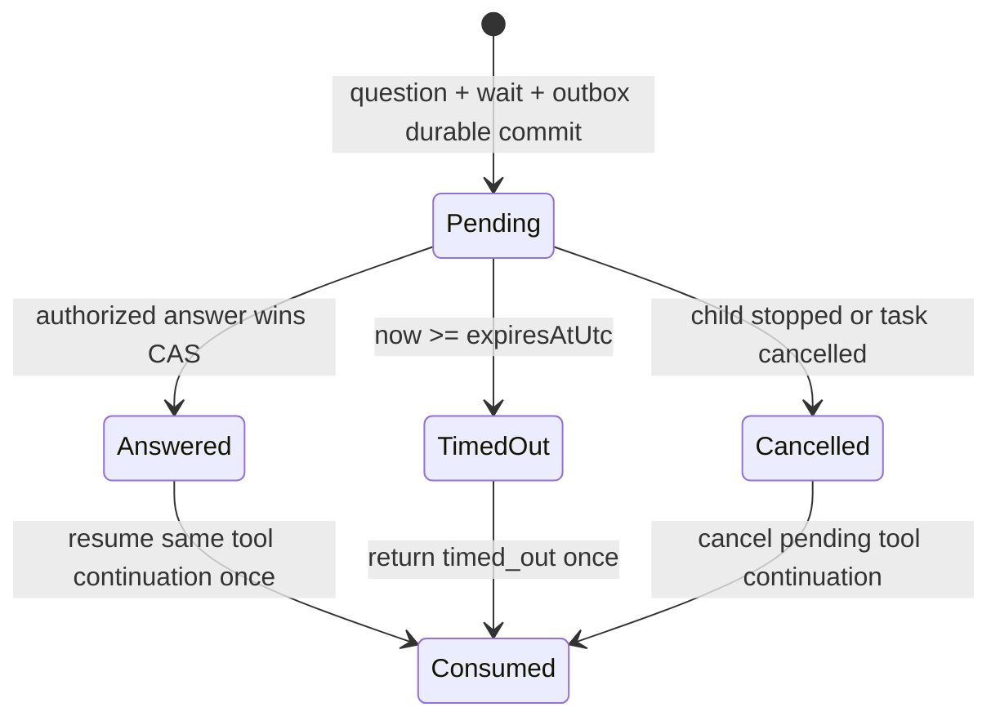

# 子代理弹性预算、双向交互与可观察运行设计

日期：2026-09-12（后续修订）。状态：设计交付，待实施；适用于 Web 交互、异步事件驱动、无人值守运行。

本文件补充并修订[长程自治方案](PuddingAgent长程自治与缓存99优化设计-2026-09-12.md)和[ADR-086](../07架构/100ADR-086长程执行预算与运行内核收敛ADR.md)；配套[ADR-087](../07架构/101ADR-087子代理托管运行与持久问答ADR.md)。**600 只是可选预算示例，不是统一默认要求、下限或上限。** 短轮次、600、1200以及其他合法正整数均应支持。

## 1. 产品合同：主代理表达意图，系统托管运行

主代理能够派发、查状态/最近轨迹、发送消息、回答问题和请求停止；不负责计时、续租、轮询、处理进程重启、清理子代理或反复推算父子预算。系统负责这些机制，并以简单快照和明确事件展示结果。

“透明”包含两层：生命周期复杂性由系统隐藏；预算配置来源、实际消耗和停止原因可查看。不能通过隐藏预算数值实现所谓简化，也不能让主代理每次填写七种限制才允许启动。

默认采用异步委派；显式同步调用保留。无人值守时不能依赖 Web 页面开着、用户在线、浏览器计时器或用户点击“继续”；Web 只是同一控制面的观察者和操作者。

## 2. 本次源码核对与问题边界

基线包含 `bfbb003` 及今天既有 A01/C01 增量，工作树有他方改动。本轮没有改产品代码，也没有宣称已在浏览器重现用户报告的具体 Run；以下是已核实的代码结构和应验证链路。

| 已核实情况 | 文件/入口 | 影响 |
|---|---|---|
| `MaxRounds`、`TimeoutSeconds` 在 SubAgentSpawnRequest 中标为内部覆盖；工具描述默认 `sync=true` | `ISubAgentManager.cs`、`SubAgentTool.cs` | 主代理不能按统一合同选择灵活轮次；当前默认与异步主场景不一致 |
| 全局600、WorkUnit默认32/上限40/工具120及Planner小预算并存（2026-09-12 注：Manager Math.Min(40/120)、默认32、Normalize强抬600、三常数已由 f096bc5 删除；Planner 小预算与 >600 Math.Min 压制仍未删） | `SubAgentInvocationContracts.cs`、`SubAgentManager.NormalizeExecutionBudget`、`TaskExecutionPlanCompiler` | 限制散落；上轮只提600仍不足以定义灵活产品能力 |
| query工具主要按Session/SubSession查询文本，输出总Tokens/费用，未统一输出实时消耗/预算/最近轨迹 | `QuerySubAgentsTool.cs` | 不适合跨Session和无人值守主代理监督；短ID不应作为调用身份 |
| send_message已有Message Fabric、`intent=ask`、`requiresResponse`和`ReplyToMessageId` | `SendMessageTool.cs` | 可复用消息与关联机制，但不等于存在120秒阻塞问答工具 |
| 管理接口有`CancelAllAsync(parentSessionId)`；当前Run Controller主要是GET接口 | `ISubAgentManager.cs`、`SubAgentRunController.cs` | 需要按不可变runId停止单个执行，不能把停止一个子代理变成取消整会话 |
| 已有持久WorkUnit AwaitHandle，kind为TerminalJob/SubAgent/Approval/External，owner绑定Plan/WorkUnit | `TaskExecutionPlanContracts.cs`、`WorkUnitAwaitHandleEntity.cs` | 可扩展复用，但必须支持无TaskPlan的普通子Run，不能造假Plan ID才能提问 |
| 活跃检查器主动跳过归档读取，依赖canonical SSE；终态才分页读归档 | `SubAgentActivityDock.tsx` 约629–722 | 轨迹空白应查事件源/父路由/bootstrap/replay/reducer，而非恢复频繁读活动events.jsonl |
| reducer只接`subagent.run/round/llm/tool.*`且要求run_id | `subAgentReducer.ts` | 新message/question/stop状态必须显式纳入合同和投影；不能只发事件但UI永远过滤 |
| rail宽40px、按钮36px、窄屏<767px隐藏；活跃集合仅spawning/running | `SubAgentActivityDock.tsx` | 发现入口困难，等待答复/停止中状态不完整，移动端缺少等价入口 |

用户报告“Web子代理指示器内行为轨迹不显示”登记为现存缺陷，复用原轨迹卡 `791d062fa6ea44f18bfe5027a37696d0`，优先级P0。确切断点应对照实际runId、父Conversation、服务器事件水位、前端水位和已加载Bundle逐层定位，不先假定是单一CSS或旧Bundle问题。

## 3. 弹性预算与限制代码收敛

### 3.1 最小主代理输入

在既有spawn工具保留任务、模型/模板等必要参数，预算只新增/恢复一个可选 `max_rounds` 正整数参数。未指定时系统按配置profile决定，并在启动回执中返回实际策略。短任务不必填写预算；显式填8、32、600、1200、10000均走同一路径，不用特殊模板或“长任务许可”才能跨过600。

```json
{"task":"核对这一个函数","max_rounds":8,"sync":false}
{"task":"完成长期重构与验证","max_rounds":1200,"sync":false}
```

这里是目标工具合同示例，不代表当前工具已支持。参数名称、DTO、schema、配置读写和运行快照一起改，不能只增加description。

“任意数字”定义为可表示、可校验的合法正整数，不限枚举档位；0、负数、小数和溢出返回明确validation error。只有用户/管理员实际设置的资源政策可形成上界，超出时返回具体policy来源和可用值，**不暗中clamp、不把600硬编码为全局上界或下界**。普通/managed/batch入口一视同仁。

### 3.2 只保留一个有效策略对象

扩展已有执行预算合同，不额外建立与SubAgentManager平行的生命周期管理器。一个resolver在Run admission时生成持久 `ExecutionPolicySnapshot`，所有执行器只消费该结果：

```text
roundLimit: configured value or null
taskDeadlineUtc: explicit business deadline or null
costLimit: explicit user/workspace policy or null
policyRevision, source, grantedAtUtc
```

默认是否配置roundLimit由系统设置决定；600可作为长程profile示例，短profile可更小。工具调用总数、输入/输出/缓存命中、时间全部计量，但不各自偷偷形成另一套默认小硬上限。已有安全并发和工作区授权仍由系统执行。明确的资源上界不能靠转到另一个Run规避。

当前同一个`MaxRounds`兼任默认值和请求上界，需要在配置语义上分开：例如`defaults.roundLimit`与可空的`policy.maxRounds`。系统预制默认600不等于用户显式上界600；默认600而请求1200应成功，只有确实配置了资源上界才拒绝。旧配置如何一次性升级应附字段来源和迁移记录，不能永久增加兼容分支，也不能把无法确认来源的旧值悄悄解释成新的用户限制。

删除/合并清单：Manager managed `Math.Min(40/120)`；默认32强制选择；Planner按阶段固定小round/tool/input/cost限制；Normalize强抬600；invocation/adapter重复clamp；Loop各分支独立定义超时。配置、schema、测试一起改，核心只维护一个source-of-truth。

> **实施状态（2026-09-12，N00，commit f096bc5；2026-09-13 token 轴重标定更新）**：已完成——Manager managed Math.Min(40/120)、默认32强制选择、Normalize强抬600、SubAgentInvocationContracts 三常数（DefaultWorkUnitMaxRounds/MaxWorkUnitMaxRounds/DefaultWorkUnitMaxToolCallsTotal）删除；TaskExecutionPlanCompiler 阶段小预算已完成 token 轴重标定（ADR-087 §3.2：MaxInputTokens=MaxCost×1,000,000、MaxOutputTokens=MaxRounds×4,000，六轴保持>0，token 轴降为计量轴、不再早于 rounds/cost 成为终止轴）。待完成（已登记的重开纠正片）——TaskExecutionPlanCompiler 阶段小预算的结构性删除（Planner 阶段预算整体移除＋单一策略对象 resolver）、AgentExecutionService.Buffered 对 >600 的 Math.Min 压制、AgentExecutionGuardrails 上界语义、SubAgentInvocationContracts.MaxRounds 的 XML 注释「Parent agents cannot override it」纠正。

资源清理不继续使用可由主代理感知和调度的20–50额外LLM grace轮。运行截止或stop后由系统做有界checkpoint/清理；关键记忆平时已持久化，停止时不依赖额外模型调用才能安全收尾。上轮“600正常轮+独立grace”方案在此进一步简化。

### 3.3 时间不是一种限制

分别记录wallElapsed、activeExecution、providerWait、toolElapsed、blockedWait、queueWait；问答等待120秒不占LLM轮次，不计作无进展故障。显式业务deadline仍走墙钟，不因提问自动顺延。LLM首token/idle超时、工具自身超时、无进展检测属于系统健康策略，不要求主代理传入参数。

真正的无进展由执行证据判断；使用既有RuntimeControl，不新增另一个“反思循环”。停止、超时、预算耗尽、错误和完成的原因分别返回。不要为了跑到N轮让已完成任务继续，也不要因未用完预算把已完成任务算失败。

## 4. 统一只读快照：Web和主代理看同一个事实

扩展`query_sub_agents`，保留list/status等便捷面，新增有界recent_activity（或status带recent参数），按**runId**寻址。返回结构化DTO，文本仅作为简短展示。列表不返回所有历史全文；分页、`sinceSequence`、`limit`和输出Token上限共享同一个服务。

```json
{
  "runId":"run-id", "parentRunId":"parent-run", "parentConversationId":"conversation",
  "state":"waiting_for_answer", "phase":"question",
  "budget":{"roundLimit":1200,"roundsUsed":73,"roundsRemaining":1127,"policySource":"request"},
  "usage":{"inputTokens":120000,"outputTokens":3000,"cacheHitTokens":110000,"cacheMissTokens":10000,
           "toolCalls":95,"cost":null,"asOfSequence":210,"isFinal":false},
  "time":{"wallElapsedSeconds":900,"activeSeconds":760,"blockedSeconds":120},
  "lastActivity":{"sequence":210,"kind":"question.opened","summary":"等待主代理选择验证环境"},
  "pendingQuestion":{"questionId":"q-id","expiresAtUtc":"..."},
  "recentActivities":[], "nextCursor":null
}
```

数据不存在时用null/unknown及coverage，不用0伪装。Tokens以Provider事实去重归因；预算与已用轮次基于同一Run，复用子Session启动新Run不能把旧消耗混入。可另外显示logicalTask累计，但与本Run分开；不直接相加双份ledger。

recentActivities默认最近20条，按需取某轮/工具的脱敏输入输出摘要和artifact引用。聚合轮次/工具/Tokens独立于有界详情窗口，保留20条不代表只执行20次。只展示已公开记录的行为、进展摘要和工具事实，不把“完整内部思维链”作为产品交付要求。

状态至少区分queued、running、waiting_for_answer、waiting_external、stop_requested、cancelled、completed、failed、timed_out、budget_exhausted；复用既有运行状态/phase/reason表达，避免再造一套不兼容终态枚举。

## 5. 双向send_message与插嘴

### 5.1 复用现有Message Fabric

复用IMessageSystem、MessageEnvelope、Delivery/outbox与canonical command admission。增加明确受信目标解析：`parent`（由执行身份解析真实父Run/Conversation）和`run:<runId>`（主代理发给自己的子Run）。持久身份来自RuntimeExecutionIdentity/父子关系，不能由正文、可复用SubSessionId或Agent模板ID猜测。

主→子：使用同一send_message，支持inform/steer意图。inform投递信息；steer请求在下一安全执行边界应用新的任务补充，不取消原目标、不偷偷重启Run。子→主：inform/report等异步消息，默认不阻塞子Run；重要阻塞/错误与需要答复的消息可唤醒父级。

插嘴复用既有CreateSteeringHandler/SessionSteeringService的语义，但把目标解析扩展到Run，不能把子Run命令硬塞成错误的主Turn或调用私有旁路。各入口统一权限、幂等、目标终态检查和状态回执；该通道不授予额外工具/文件权限。

### 5.2 回执与执行边界

回执分 `accepted`（持久受理）、`delivered`（进入目标inbox）、`applied`（在特定round/boundary被读取）以及rejected/expired；关键字段为messageId、targetRunId、appliedSequence。UI不把已发送写成“子代理已理解”。

运行中的LLM请求不原地改Prompt；系统在下一轮边界把补充追加到尾部，保持已有缓存前缀。长工具执行期间消息可入队，停止命令另走控制面，不等该轮结束。若Run已终态，返回run_terminal，不悄悄新建/复活另一个Run。

父忙时消息持久排队并在安全边界消费；父休眠/等待子结果时系统唤醒原Conversation的合法续行。父子均保持单写者，不能为每条进展消息新建并发父Turn。重复messageId只应用一次；进展可合并展示，但提问/答复/停止/终态不可静默丢弃。

普通进度消息不自动触发一轮对话互相确认；使用相同correlation防止“收到→收到”回音循环。未经用户选择，不把子代理私有消息广播到用户、飞书或其他connector。

## 6. ask_question：阻塞子代理，系统持久等待120秒

### 6.1 工具合同尽量少

新增`ask_question`作为现有消息+等待机制的薄封装，不建立第二套消息系统：

```json
{"question":"验证应使用哪个已有测试工作区？","options":["workspace-a","workspace-b"],"context_refs":["artifact://evidence"]}
```

目标默认且受信绑定父代理，默认超时固定 **120秒**；主/子代理不需要自己创建计时器，也不要求填写复杂问答状态。问题可自由文本，options可省略。questionId由系统生成，工具重试沿用同一toolCallId/idempotencyKey，不能生成重复问题。

父代理使用既有`send_message`的`reply_to_message_id`回答该question message；系统由关联表解析questionId，校验答复者/父子关系并完成等待。Web“回答”按钮调用同一个AnswerQuestion应用入口，用户回答有自己的actor来源，不伪造父Agent回答。无需额外暴露answer_question工具，除非实践证明send_message参数无法清晰表达。

### 6.2 持久状态机和原子性



复用既有WorkUnit AwaitHandle/outbox/fencing；把等待owner扩展为可辨识的Run/WorkUnit/Conversation，允许普通子Run无TaskPlan。不要创建假Plan、空WorkUnit来通过模型验证，也不要为了问答复制另一套wait、timer、scheduler表。若现有表绑定太深，做一次明确schema调整及调用者迁移，而非长期双实现。

Question包含questionId、requestMessageId、toolCallId、ownerRunId、parentRunId/Conversation、createdAtUtc、expiresAtUtc、status、version、answerMessageId/actor。问题与等待及投递意图在一个可恢复事务边界登记；跨存储用既有outbox，不把“先发消息再随便建等待”当可靠实现。

120秒从持久受理时刻开始，包含父忙/离线的投递等待；绝对UTC deadline重启后不重新计时。到期由系统timer/队列恢复处理，不能依赖浏览器。答案与timeout用版本/事务仲裁；规则为服务端成功受理时间严格早于expiresAtUtc且Pending才可胜出。客户端时钟不决定先后。

### 6.3 阻塞语义与避免父子死锁

子Run进入waiting_for_answer，暂停后续LLM轮与业务工具，不以每秒查询父代理消耗Tokens。释放可复用执行槽/并发permit，不持有长事务或父级互斥锁；保存挂起工具调用的continuation，恢复时将一次tool result对应回原toolCallId。与提问无关的既有在途OS/远端操作保留operationId，不能误声称自动冻结了外部世界。

父代理若正同步等待该子代理，系统必须让父级处理问题：把父级工具等待也表示为可恢复await，在释放执行租约后接入问答事件，处理完答复再继续原等待。不在持有父Turn单写者锁时另外启动父LLM，也不等子终态才读取子问题。复用同一continuation调度；如果父有不可中断的长工具，问题可以真实超时，不能无限延长120秒。

同一子Run默认仅一个未解决问答；重复调用返回已有pending question，不制造自问自答链。检测依赖环（例如父问回一个已阻塞的子），明确返回问答环路/阻塞状态，不能不断创建新问题续命。父不可达或撤权有明确terminal/timeout结果。

### 6.4 返回值、超时与迟到答复

成功返回`{status:"answered", questionId, answer, answeredBy, answerMessageId}`；到期返回`{status:"timed_out", questionId}`，不填默认答案、不当授权、不继续重复提问重置计时。子代理此后可继续不依赖答案的工作；确实无法继续则交付partial/blocked和缺失条件，等待后续显式新输入。

取消先赢则停止Run且等待关闭；答案不能把已停止Run复活。迟到答复保存为late/rejected回执供查看，不再次完成旧tool或自动新建Run；若仍有活跃Run，可由后续普通消息明确告知，不能隐式恢复已终态任务。父Agent与Web用户竞答只接受首个有效CAS，另一方看到already_answered。

答复只是任务上下文，不能改变权限、扩充工具能力或替代现有审批系统。ask_question对父代理的等待与真正的人类授权区别明确；复用等待机制不等于混淆问答和审批业务状态。

## 7. 尽快停止：系统命令，不是给子代理发“请停下”

提供薄工具`stop_sub_agent(run_id, reason?)`，Web使用同一StopRun应用入口；系统内部复用现有Cancellation/command/outbox。按不可变runId停止目标；默认不影响父Run或同级子Run。目标自己的后代遵循系统owner关系一起停止，范围在回执中说明，主代理不枚举每个孙Run清理。

停止持久受理后立即写stop_requested，阻止新LLM/工具派发，通知真实CTS、待问答和等待句柄。幂等重复停止返回相同stop operation；完成与取消通过既有终态仲裁。若成功完成先发生，则回already_terminal，不能把真实成功覆盖成取消。

可取消Provider/工具立刻传播取消。系统管理的子进程按执行根/operationId在有限期限内退出；不能杀承载全部Agent的Core或其他任务进程。不可取消的外部副作用要记录in_flight/需核查postcondition，不谎报回滚。

验收目标：本地正常负载停止受理后状态在1秒内可见，调度器不再启动新工作；可取消执行P95在5秒内停止。不可中断操作明确显示stopping及原因、最后响应时间和系统后续处理；超限报stop_timeout，不伪装cancelled。停止不依赖120秒问答到期，也不等待几十轮grace。

## 8. Web子代理入口和检查器

### 8.1 入口：先能看见，再看得懂

主会话保留紧凑委派摘要，但不再只靠右侧36px图标找子代理。在消息/输入区附近提供持续可见的“子代理：运行2 · 待答1 · 异常1”入口，显示最近一项行为摘要与更新时间。无运行子代理时可收起计数，但仍能查看历史。

点击一行委派摘要或子代理入口，直接打开该runId详情。窄屏保留等价按钮，详情为全宽sheet；桌面为右侧检查器。键盘可聚焦/关闭，不能遮挡输入区。未读问题和错误显著，不能让完成后12秒消失的icon成为唯一入口。

### 8.2 检查器信息结构

```text
子代理  [运行2] [待答1] [异常1]       搜索 / 筛选
任务摘要 | 状态 | 最新动作 | 时间 | 轮次已用/上限 | Tokens

选中Run：修复检索去重
运行中 · 已用73/1200轮 · Input/Output/Hit/Miss · 用时/等待
最近行为：读取 MemoryLibrary.cs（2秒前）
[插嘴] [停止] [打开产物]

轨迹（默认最近事件，可加载更早） | 消息与问答 | 产物 | 预算详情
pending问题：正文、选项/自由输入、剩余120s、[回答]
```

预算进度不是任务完成百分比。有限轮次显示73/1200；未设round上限显示“已用73轮”，不除以0。Tokens字段不足则显示“统计更新中/未知”，不显示假0。成本没有可信币种/价格就不加固定美元符号。

轨迹至少展示阶段、公开进展摘要、工具开始/结束/耗时/错误/摘要、消息送达/应用、问题/答复/超时、停止请求/真实终态。重复小事件折叠，连续LLM流不逐token写UI；原文和大输出按需读取受权artifact。不要求主消息区复制完整子代理轨迹。

### 8.3 修复不显示和可靠数据衔接

保持活动Run零归档轮询。后端提供Run快照+snapshotSequence，再接已有canonical SSE/增量回放；按runId和sequence去重，与既有subAgentReducer共用投影。父Turn结束后异步子Run仍属于活跃订阅/缺口恢复对象，不因父Turn terminal而丢后续轨迹。

重连/切回Session/新开Web页先显示已知快照，再补缺口；列表聚合与详情的水位明确。服务器水位领先而前端没有事件时显示“同步中”，持续超阈值显示“同步异常”及一次受控重试，不长期写“暂无行为”。要区分no_events、loading、gap、error、forbidden与archived。

终态归档仍按需分页，不一次拉完上万事件；从live切到archive按稳定event identity去重。现代码do/while读取全部500页批次也应收敛为有界详情加载。工具总数和round/token聚合独立，不因分页窗口变小而少计。

新事件语义映射到既有canonical协议，更新reducer过滤、DTO、bootstrap、replay、state types和UI；不要只加后端事件。是否事件扩展或复用run phase由实际协议版本决定，必须在同一变更中冻结，不长期同时维护两套状态。

## 9. 无人值守与交互共用一套内核

| 场景 | 系统行为 |
|---|---|
| Web全部关闭 | 子任务继续、消息持久、问答由父Agent处理、120秒期限照常；重开后回放 |
| 父Agent空闲/休眠 | 问题/重要事件唤醒原父身份；不依赖Heartbeat才投递 |
| 父Agent忙 | 安全边界合并处理inbox；停止走控制面；不能产生并发父写者 |
| 父正在等子 | 可重入处理问题后继续原await；不死锁 |
| 用户在Web插嘴/答复/停止 | 与Agent工具进入同一命令入口、权限和幂等；展示actor与受理/应用回执 |
| Core重启 | 从持久Question/Await/Message恢复剩余期限；超时立即结算；答复与唤醒最多一次 |
| 限流/离线/资源满 | 保留等待和expiresAt；不以创建新Session绕过容量，不按一次失败无限重发 |

本轮不新建完整“Agent协作平台”。复用Message Fabric、A01 canonical接续、Task/Run等待、现有Steering、Cancellation、SubAgent投影和权限。共用的只是基础机制；业务问答、工具授权和停止仍有各自明确结果合同。

## 10. 任务拆分、实施顺序与验收

1. **原N00修订（P0）**：灵活预算+限制收敛；8/32/600/1200/10000及未指定进入同一路径；普通/managed/batch均一致。不要再把600写成全局硬上限。
2. **原轨迹卡SA-TRACE（P0）**：先定位实际不显示的断点，恢复快照/回放/事件水位与聚合。UI可用新查询DTO迭代接入，不能等完整问答功能才修空白。
3. **新增SA-OBS（P1）**：共享Run快照、预算/usage/最近行为查询，供query_sub_agents和Web复用。
4. **新增SA-MSG（P1）**：主子双向消息、steer应用回执、按Run幂等停止；沿用已有消息与控制面。
5. **新增SA-ASK（P1）**：ask_question薄工具、120秒持久等待、send_message回复、父等待子时可答、重启/竞态/超时。
6. **新增SA-UI（P1）**：可发现的入口、列表+详情、插嘴/停止/答复、窄屏与无障碍；对接上述统一合同。
7. 原WorkUnit/前端状态投影/子代理工具总卡/30日验收修订依赖和范围；历史完成任务不重开。

必须做有意义的反例：父同步等子时提问且并发容量1；父忙120秒；0Web客户端；第119.9秒与120秒答复/timeout竞争；双答复/重复message/停止与答复竞态；Core在等待持久后、消息提交后、答复后唤醒前重启；终态Run收到消息；复用SubSession不同Run；弱网重连乱序/重复；主Turn结束后子轨迹仍更新；600以上的正常轮次和显式小预算。

源码fixture可使用假时钟和fake Provider，不能空烧10000次真实调用。真实产品smoke需明确新Core与Bundle，在有Web/无Web两组验证；内部Agent不能自证承载自己的部署生命周期。长期卡追加问答/停止/消息回放与日积累指标，未走完30日不报长期完成。

具体任务ID、写入前后版本和下发回执见同日[看板修订记录](../Reports/子代理弹性交互看板修订-2026-09-12.md)。
