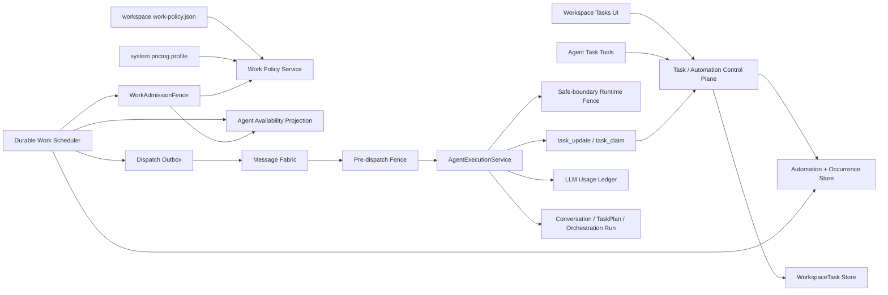
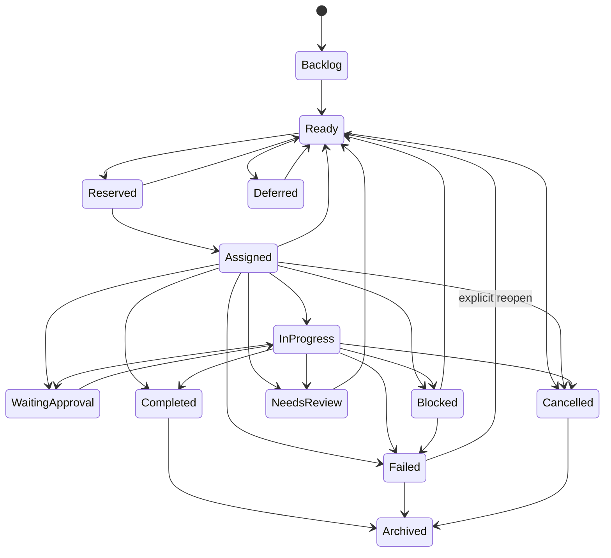

# 工作区 TODO 与峰谷节能任务编排设计方案

> 日期：2026-08-15
> 状态：设计基线（本文件不表示已经实现）
> 范围：工作区任务台账、Agent 认领与回报、自动派发、定时消息、Agent 空闲生命周期、峰谷执行栅栏、回合后质询器、Goal 目标冲刺、前端管理与审计
> 价格生效时间：北京时间 2026-08-17 00:00
> 关联文档：`Docs/deepseek-harness-pi-plugin-hook-event-architecture-2026-08-14.md`、`Docs/superpowers/specs/2026-06-08-task-dynamic-planning-design.md`、`Docs/superpowers/specs/2026-06-07-agent-to-agent-message-fabric-design.md`、`Docs/07架构/82ADR-071通用Agent编排平台完整设计方案ADR.md`、`Docs/07架构/83通用Agent编排后端执行内核与ControlPlane施工图.md`
> 产品施工顺序：`Docs/07架构/87ADR-073任务看板优先的Agent工作台轨迹与实时指标施工ADR.md`

## 1. 结论

本需求不应实现成“给 Agent 一段提示词，让 Agent 自觉等到非高峰期”，也不应继续扩展当前进程内 `CronSchedulerService` 形成第二套调度中心。推荐增加一个工作区级 **Workspace Task Control Plane**，并复用现有 Message Fabric、Agent 执行单写者、通用编排的 claim/lease/fencing token 和事件投影能力。

核心决策如下：

1. 新增面向用户的 `WorkspaceTask` 聚合，作为 TODO 的权威事实；它与现有面向 Leader 内部拆解的 `TaskPlanRun/TaskNode` 分离，但可以建立链接。
2. 所有自动工作在进入 Agent 前必须经过统一的 `WorkAdmissionFence`。心跳、自动派发、定时消息、潜意识任务和编排 Trigger 都不能绕过它。
3. 栅栏分为两层：
   - **运行资格栅栏**：决定当前时刻是否允许自动工作开始或继续到下一个安全执行边界；
   - **并发所有权栅栏**：用原子 claim、lease 和 fencing token 防止重复派发与过期 Worker 提交。
4. 用户直接发送的消息以 `origin=user.direct` 标记，始终绕过峰谷节能栅栏，但仍受会话单写者、权限和安全审批约束。
5. 工作区默认在北京时间高峰时段进入节能模式；一般自动工作延迟，`P0/紧急且重要` 任务可越过峰谷栅栏。
6. 心跳 `0` 是明确的禁用值，不是零延迟。高峰期有效心跳间隔为 `0` 时，不创建、不补填、不重试心跳。
7. 自动派发使用“系统生成、对模型呈现为 user role 的任务指令”，但消息事实仍记录真实来源 `system:task-orchestrator`，不能在审计层伪造为真人消息。
8. Agent 必须通过任务工具做结构化表态；自然语言中的“完成了”不能单独推进任务终态。
9. 定时自动化持久化 `next_fire_at`、触发 occurrence 和幂等键，支持进程重启追赶；当前只在内存保存 `LastFiredMinute` 的 Cron 路径逐步退役。
10. PuddingDesktop 不承载任务业务逻辑；WPF 继续只作为产品 Shell，任务 UI 和 Core API 位于现有 WebView2 Workbench/Core 边界内。
11. 质询器通过回合结算阶段的内部 Typed Hook 接入，但 Hook 只产生 durable challenge job；临时质询子代理不得在 Hook 调用栈内运行，也不得直接发消息或修改任务。
12. Goal 模式是一个持久化的 `GoalRun` 外层状态机，不等于当前 `goal_queue.json` 的逐条目标注入，也不等于 `goal.md` 便条。每个主 Agent 回合结束后由干净上下文的临时质询子代理裁决是否继续。
13. Goal 循环同时受峰谷 `WorkAdmissionFence`、会话单写者、次数/时长/成本/无进展预算和熔断器约束；任何质询失败都不能被解释成“继续”，达到阈值必须停在可审阅状态。

## 2. 背景与价格窗口

DeepSeek 新价格从北京时间 2026-08-17 00:00 生效：

| 模型 | 时段 | 百万 tokens 输入（缓存命中） | 百万 tokens 输入（缓存未命中） | 百万 tokens 输出 |
|------|------|-----------------------------:|--------------------------------:|-----------------:|
| deepseek-v4-flash | 空闲 | 0.05 元 | 1.5 元 | 4.5 元 |
| deepseek-v4-flash | 高峰 | 0.10 元 | 3.0 元 | 9.0 元 |
| deepseek-v4-pro | 空闲 | 0.15 元 | 4.5 元 | 13.5 元 |
| deepseek-v4-pro | 高峰 | 0.30 元 | 9.0 元 | 27.0 元 |

北京时间高峰窗口采用左闭右开区间：

- `[09:00, 12:00)`；
- `[14:00, 18:00)`；
- 其他时间为空闲时段。

边界例子：`08:59:59.999` 为空闲，`09:00:00` 进入高峰，`12:00:00` 恢复空闲，`14:00:00` 再次进入高峰，`18:00:00` 恢复空闲。

价格窗口只解释本次默认策略的来源。运行资格栅栏本身必须是 Provider 无关的工作区能力，以后可以承载电价、限额、安静时段、企业维护窗口或其他模型的动态价格策略。

## 3. 目标与非目标

### 3.1 目标

- 用户能查看一个工作区的全部任务，也能按 Agent、状态、优先级和自动化类型过滤。
- 用户能新增、编辑、删除/归档、排序、指派、取消和手工运行任务。
- Agent 能查询、认领、接受、推进、完成、释放、阻塞、请求审批、声明无法进行或拒绝任务。
- 自动模式只在任务符合窗口、Agent 确实空闲且 claim 成功时派发。
- 定时模式支持一次性、每天、每周、固定间隔和“每个符合条件的消息”触发。
- 工作区高峰节能模式能确定性停止新的心跳和一般自动工作，而不依赖 Agent 判断。
- Agent 或用户能显式进入、查询、暂停、完成或退出 Goal 冲刺模式，不需要用户反复发送“继续”。
- Goal 模式下每个主回合结束后都能产生一次可恢复、可去重的独立质询；未完成才生成下一轮继续消息。
- 质询器使用 Agent manifest 中显式选择的服务商和模型，以临时、干净上下文、最小权限子代理运行。
- 质询器异常、主 Agent 无进展、重复输出、预算耗尽或策略阻止时能确定性熔断，不会无限自激。
- 任何拒绝、阻塞、审批请求、提醒、自动派发和越过高峰的决定都有可审计原因。
- Core 重启、短暂断网、事件丢失和重复信号不会造成重复任务执行。
- 用户直接消息在高峰期仍可正常执行。

### 3.2 非目标

- V1 不让 LLM 自己决定当前是否为高峰期。
- V1 不以浏览器定时器、前端页面是否打开或心跳事件作为调度权威。
- V1 不在一个正在流式输出或正在执行有副作用工具的物理尝试中间强杀 Agent。
- V1 不把 TODO 列表等同于通用 Agent DAG 蓝图；简单任务不要求先创建 Graph。
- V1 不允许任意脚本式 Cron、动态 C# 或任意表达式求值。
- V1 不只凭主 Agent 的自然语言“已完成”声明推进任务终态；语义质询必须结合结构化 disposition、验收标准和确定性证据 gate。
- V1 不对普通闲聊的每个回合都启动质询器；只有活动 GoalRun 或显式启用 after-turn supervision 的任务才进入该链路。
- V1 不在同步 Hook 内执行 LLM、等待子代理、递归 dispatch 或发送下一条消息。
- V1 不允许 Agent 自己提高 Goal 的优先级、次数、时长或成本上限，也不把质询器故障当成继续许可。
- V1 不把业务服务迁入 `PuddingDesktop`。

## 4. 当前代码基线与缺口

| 能力 | 当前事实 | 本方案处理 |
|------|----------|------------|
| 任务规划 | 已有 `TaskPlanRun/TaskNode`、SQLite store、委派深度策略和 SubAgent 上下文；主要用于一次 Leader 计划树 | 保留为内部执行计划；新增独立 `WorkspaceTask` 用户台账，并可链接 plan/node |
| 任务工具/API/UI | 目前没有完整的用户任务 CRUD API、任务工具和 TODO 页面 | 增加统一 API、Agent 工具和工作区任务中心 |
| Message Fabric | 已有 durable delivery、原子 claim、Busy 延迟、重试/死信和会话单写者 | 作为任务指令进入 Workspace Agent 的唯一投递路径 |
| Agent 空闲 | `AgentExecutionStateRegistry` 主要是进程内 `idle/busy`；未知 Agent 默认被当成 idle | 增加可恢复的 Availability Projection；`unknown` 绝不能自动派发 |
| 心跳 | `heartbeat.json` 的正数会恢复；`0` 当前被视为无效；空队列会默认补一小时心跳 | 定义 `0=disabled`，并让工作区策略在创建心跳前执行栅栏 |
| Cron | 启动时读配置；使用 `DateTime.Now`；只支持简单五段格式；触发去重仅在内存 | 由 durable automation/occurrence 取代；固定时区、misfire、幂等和重启恢复 |
| 通用编排 | 已有不可变 Revision、Run/NodeRun、claim/lease/fence 和 Worker；Deployment/Schedule 仍是目标设计的一部分 | 复用并发所有权语义；后续让 Schedule Trigger 通过统一 occurrence 创建 Run |
| 工作流管理 | 工作区页面已有 Workflow 元数据 CRUD，但没有执行调度闭环 | 不把 Workflow 元数据表冒充 Scheduler；任务可选择链接已部署 Graph |
| 用量计费 | 已有 LLM gateway usage 事实和 Token 统计 | 给 execution/occurrence/task 增加 correlation，计算峰谷节省，不复制计费账本 |
| 当前 GoalMode | `GoalModeService` 在成功投递后推进 `goal_queue.json` 游标；`goal_read/goal_update` 只读写 `goal.md` | 明确保留/迁移为 Follow-up Queue；新增持久 `GoalRun` 与 `goal_mode` 控制工具，不复用旧语义 |
| Agent Loop Hook | `IAgentLoopHook.OnLoopCompleteAsync` 已覆盖 buffered/streaming 终态，但故障被吞掉，且当前 `HookPublisher` 实际是异步 lifecycle event adapter | 增加回合结算提交点的 Typed Hook contribution；终态与 challenge job/outbox 原子落盘，再由 durable worker 异步质询 |
| 子代理 | 已有临时子会话、运行归档、上下文快照和系统管理预算 | 增加 `executionPurpose=goal-questioner` 的受限调用档案；每次新建干净子会话，不继承父对话，不允许写工具和继续委派 |
| Agent 模型配置 | 实例 `manifest.json` 已是主模型和 Smart 角色模型的权威来源，Admin 已有 provider/model 选择模式 | 在同一实例 manifest 增加质询器 provider/model；Create/Get/Update/API/UI 必须完整往返且运行时禁止隐式回退 |

## 5. 领域边界与权威事实

### 5.1 为什么 `WorkspaceTask` 不能直接等于 `TaskNode`

`WorkspaceTask` 是用户的长期工作台账：它可以尚未派发、跨会话、反复指派、设置自动化、被多个 Agent 拒绝，且用户需要稳定查看。现有 `TaskNode` 是某一次 `TaskPlanRun` 内的执行拆解节点，依赖 root session、leader、depth 和 plan 终态。

如果二者合并，会出现以下问题：

- 新建一个简单 TODO 也被迫创建 Leader plan；
- Agent 拒绝一次就污染内部任务树终态；
- 周期任务的每次 occurrence 和长期任务定义混在一起；
- 用户修改标题可能反向改写已执行 run 的历史输入；
- 任务列表状态和 DAG 节点执行状态无法保持清晰语义。

因此采用“台账定义 + 执行绑定”：

```text
WorkspaceTask (长期用户事实)
  -> TaskAssignmentAttempt (一次候选 Agent 指派)
  -> TaskExecutionBinding (一次实际执行)
     -> MessageDelivery / ConversationRun
     -> optional TaskPlanRun + root TaskNode
     -> optional AgentOrchestrationRun
```

### 5.2 五类独立事实

| 事实 | 说明 | 是否可修改历史 |
|------|------|----------------|
| `WorkspaceTask` | 当前任务定义和状态投影 | 通过 version/CAS 更新当前投影 |
| `TaskAutomation` | 自动化定义、时区、调度和派发策略 | 修改产生新 version，不改旧 occurrence |
| `AutomationOccurrence` | 某次触发事实和其 policy snapshot | 不可变输入；状态通过受控转换推进 |
| `TaskAssignmentAttempt/ExecutionBinding` | 候选 Agent、拒绝原因、delivery/run 身份 | 历史不可覆盖 |
| `TaskEvent` | append-only 审计序列 | 只追加 |

## 6. 总体架构



分层归属：

| 层 | 责任 |
|----|------|
| PuddingCore | 任务、自动化、策略判定、状态转换、错误码、Store/Clock/Availability 契约 |
| PuddingPlatform | SQLite 实现、工作区权限、配置文件服务、API、transactional outbox、查询投影 |
| PuddingRuntime | 自动派发协调、Agent 工具、执行前栅栏、运行上下文注入、监督协议 |
| PuddingHost | Hosted Service 注册；现有 Heartbeat/Cron 入口适配到统一调度，不承载领域状态 |
| PuddingPlatformAdmin | 工作区任务/自动化/策略/审计页面和实时投影 |
| PuddingDesktop | 仅托管 Workbench 和 Core 生命周期，不新增任务业务逻辑 |

## 7. 工作区峰谷策略

### 7.1 配置权威

遵循“配置优先于数据库”：工作区偏好保存在：

```text
<DataRoot>/workspaces/<workspaceId>/work-policy.json
```

系统随程序发布价格档案，例如：

```text
<ProgramRoot>/config/pricing/deepseek-2026-08-17.json
```

价格档案用于 UI 展示和成本核算；工作区 `work-policy.json` 才是是否阻止自动工作的运行权威。前端保存策略必须使用 `expectedVersion`/ETag 和原子文件替换，防止两个页面相互覆盖。每次 occurrence 固化实际使用的 `policyVersion`、`windowKey` 和 `decisionCode`，避免后续改配置后历史解释发生变化。

### 7.2 建议配置

```json
{
  "schemaVersion": "pudding.workspace-work-policy/v1",
  "workspaceId": "default",
  "version": 1,
  "timeZone": "Asia/Shanghai",
  "effectiveAt": "2026-08-17T00:00:00+08:00",
  "mode": "eco-during-peak",
  "peakWindows": [
    { "days": [1, 2, 3, 4, 5, 6, 7], "start": "09:00", "end": "12:00" },
    { "days": [1, 2, 3, 4, 5, 6, 7], "start": "14:00", "end": "18:00" }
  ],
  "peakHeartbeatIntervalSeconds": 0,
  "offPeakHeartbeatIntervalSeconds": 3600,
  "defaultAutomaticWorkWindow": "off-peak-only",
  "priorityRules": {
    "p0": "anytime",
    "p1": "off-peak-only",
    "p2": "off-peak-only",
    "p3": "off-peak-only"
  },
  "sourceRules": {
    "user.direct": "always-allow",
    "task.auto": "apply-priority-rule",
    "automation.schedule": "apply-priority-rule",
    "system.heartbeat": "off-peak-only",
    "system.subconscious": "off-peak-only",
    "orchestration.trigger": "apply-priority-rule"
  }
}
```

实现必须同时识别 Windows `China Standard Time` 与 IANA `Asia/Shanghai`，内部统一通过 `TimeProvider` 和时区解析器计算，禁止直接以 `DateTime.Now` 作为业务判断。

`days` 使用 ISO-8601：1=周一、7=周日。当前时间早于 `effectiveAt` 时，默认档案返回 `windowKind=inactive`，不因尚未生效的 DeepSeek 价格阻止自动工作；用户可以通过显式修改工作区配置选择提前启用，并留下策略变更审计。

### 7.3 心跳 `0` 的语义

- `min_idle_seconds=0` 且 `max_idle_seconds=0`：该 Agent 心跳长期禁用。
- 工作区策略计算出的 `effectiveHeartbeatIntervalSeconds=0`：只在当前策略窗口禁用，不覆盖 Agent 自己的持久偏好。
- 一个值为 0、另一个为正数属于无效配置，API 返回稳定校验错误。
- `0` 不得传给 `Task.Delay`、不得创建 `EarliestWakeAt=now`、不得进入重试队列。
- `AgentWakeQueue.EnsureDefaultAsync` 在显式禁用或高峰节能时不得补填默认一小时心跳。
- 进入高峰时，尚未 claim 的心跳 occurrence 直接标记 `suppressed_by_policy`；已在 Busy 上被拒绝的心跳仍遵守现有 ack/drop 规则，不重试。

### 7.4 高峰切换时正在执行的任务

为了不破坏工具副作用和流式协议，默认规则是：

1. 高峰开始后不创建、不 claim 新的一般自动执行；
2. 已经开始的单个 LLM 流或工具调用允许完成；
3. 在下一次安全提交边界（完整 LLM response、完整 tool result、无部分 tool-call）重新检查栅栏；
4. 若仍为高峰且任务不是 `P0/anytime`，生成 `deferred_by_peak_window` checkpoint，释放执行所有权，并设置 `nextEligibleAt`；
5. 空闲期从同一 session/run 的已提交边界续跑，不能重放未确认副作用。

如果 V1 尚未具备安全 checkpoint/resume，则必须明确降级为“只阻止新 execution，已经开始的一整个 turn 运行到终态”，并在 UI 标示这一限制；不能用强制取消冒充节能完成。

## 8. 优先级与运行窗口

任务优先级采用清晰的产品枚举，不让模型自由解释：

| 优先级 | 产品含义 | 峰谷默认 |
|--------|----------|----------|
| `P0` | 紧急且重要 | `anytime`，可越过峰谷栅栏 |
| `P1` | 重要但不紧急 | `off-peak-only` |
| `P2` | 一般 | `off-peak-only` |
| `P3` | 低优先级/可延后 | `off-peak-only` |

任务还可以显式设置 `executionWindow=inherit|anytime|off-peak-only|custom`。判定优先级为：

```text
用户直接消息 bypass
  > 任务显式 executionWindow
  > 工作区 priorityRules
  > 工作区 defaultAutomaticWorkWindow
```

“立即运行”不是隐式绕过。高峰期用户在 UI 点击立即运行时，应显示本次可能产生高峰价格，并要求明确选择：等待空闲时段，或“本次越过节能栅栏”。后者写入 actor、原因和审计事件。

## 9. `WorkspaceTask` 模型

建议字段：

```text
task_id                  stable id
workspace_id
title
description
acceptance_criteria
status
priority                 p0 | p1 | p2 | p3
execution_window         inherit | anytime | off_peak_only | custom
preferred_agent_id       用户偏好，不等于已获得执行权
active_assignment_id
not_before_utc
due_at_utc
next_eligible_at_utc
progress_percent
progress_summary
blocker_kind
blocker_reason
failure_code
failure_reason
approval_request_id
linked_plan_id
linked_root_task_node_id
linked_orchestration_graph_id
version                   optimistic concurrency
created_by / updated_by
created_at_utc / updated_at_utc / completed_at_utc / failed_at_utc / archived_at_utc
```

`description` 表示要做什么，`acceptance_criteria` 表示如何判断完成，不能只保留一个自由文本 prompt。自动派发时这两者都进入任务指令。

### 9.1 状态机



状态语义：

| 状态 | 含义 |
|------|------|
| `Backlog` | 用户记录但尚未进入可派发队列 |
| `Ready` | 符合业务前置条件，等待窗口/Agent/claim |
| `Deferred` | 暂时不可运行；必须带 reason 和 `nextEligibleAt` |
| `Reserved` | Scheduler 已原子保留，尚未完成消息 outbox 提交 |
| `Assigned` | 指令已绑定到某 Agent，等待其结构化接受/处理 |
| `InProgress` | Agent 已接受并正在推进 |
| `WaitingApproval` | 等待用户审批，自动提醒不得催 Agent 继续执行受限操作 |
| `Blocked` | 存在外部阻塞或声明无法进行，必须记录原因和建议 |
| `NeedsReview` | 所有候选被拒绝、提醒耗尽或出现无法自动恢复的矛盾 |
| `Completed` | 结构化完成，带摘要和可选产物引用 |
| `Failed` | Task 级闭合失败；仅用于不可恢复、重试耗尽、验收失败且不再继续或用户显式终止 |
| `Cancelled` | 用户或授权主体取消 |
| `Archived` | 从活动列表移除但保留审计历史 |

`Rejected` 不是任务本身的终态，而是某个 `TaskAssignmentAttempt` 的终态。一个 Agent 拒绝后，任务回到 `Ready` 并排除该候选；没有其他候选时进入 `NeedsReview`。这保证“Agent 拒绝后派发下一个任务”和“同一任务可换人继续”都能成立。

同理，单次 LLM/Tool/Execution 失败先结束 Attempt，并按策略进入 `Ready` 或 `NeedsReview`；只有明确闭合失败才进入 `Failed`。`Failed -> Ready` 只允许显式 `reopen` Command，必须递增 Version 并记录 `task.reopened`，不能由迟到 Agent 自动复活。

### 9.2 Agent 表态与状态映射

用户要求的工具结果映射如下：

| Agent 表态 | 任务/指派变化 | 必填字段 |
|------------|---------------|----------|
| `accept` | Assigned -> InProgress | next action（可选） |
| `todo` | 释放当前指派，任务回 Ready | 原因或建议执行者（可选） |
| `blocked` | Assigned/InProgress -> Blocked | blocker reason、需要谁做什么 |
| `cannot_proceed` | Assigned/InProgress -> Blocked 或 NeedsReview | 原因、已尝试内容、建议 |
| `needs_approval` | Assigned/InProgress -> WaitingApproval | 审批问题、风险、拟执行动作 |
| `rejected` | 当前 attempt -> Rejected；任务回 Ready/NeedsReview | 拒绝原因、意见/替代建议 |
| `completed` | Assigned/InProgress -> Completed | result summary；按任务要求附 artifact refs |

为避免很小的任务被迫调用两次工具，`blocked/needs_approval/completed` 也允许从 `Assigned` 原子进入对应状态；后端在同一事务中补记隐式接受事件。它仍然是结构化状态转换，不从自然语言猜测。

所有状态写入都必须携带 `expectedVersion` 和当前 `assignmentId`。旧 Agent、旧提醒或过期 lease 不能更新已经转派的任务。

### 9.3 删除语义

- 从未派发、没有 occurrence/event 历史的草稿可硬删除。
- 一旦存在 assignment、delivery、run、审批或审计事件，“删除”在产品上执行归档，不物理删除历史。
- 用户仍可在“已归档”中恢复或执行合规清理；清理不能级联删除 Conversation、usage 或 orchestration run 事实。

## 10. 自动化模型

### 10.1 两种产品模式

1. `auto-dispatch`：任务进入 Ready 后，非高峰且目标 Agent 空闲时自动派发。它是任务分配策略，不是一个时间表达式。
2. `scheduled-message`：按时间或消息事件生成一次 occurrence，把用户预设消息发送给 Agent；可选择是否同步创建/关联一个 WorkspaceTask。

二者不得混成一个 `cron` 字符串。自动派发回答“什么时候有合适 Agent 就做”，定时消息回答“这个触发条件发生时发送什么”。

### 10.2 `TaskAutomation`

```text
automation_id
workspace_id
task_id?                      可空；纯定时消息不必有长期任务
name
mode                          auto_dispatch | scheduled_message
enabled
trigger_kind                  ready_task | once | calendar | cron | fixed_interval | message_event
trigger_definition_json       结构化且按 trigger_kind 校验
time_zone
target_agent_id
message_template
priority
execution_window
misfire_policy
overlap_policy
next_fire_at_utc
last_fire_at_utc
version
created_by / updated_by
created_at_utc / updated_at_utc
```

### 10.3 支持的 Trigger

| Trigger | V1 输入 | 说明 |
|---------|---------|------|
| `once` | 本地日期时间 + timezone | 只产生一个 occurrence |
| `calendar` | 每天/每周结构化选择；内部可规范化为受限 RRULE | 不直接接受任意脚本 |
| `cron` | 标准五字段 `minute hour day-of-month month day-of-week` + timezone | 允许 `0 23 * * *`、`0 9 * * 1`；拒绝秒/年、宏、`L/W/#/?`、脚本和动态表达式 |
| `fixed_interval` | days/hours/minutes，最小间隔和最大频率受策略限制 | 默认 fixed-rate，以锚点计算下一次 |
| `message_event` | 来源、workspace/channel、Agent、message kind 过滤器 | 对每个符合条件的真实入站消息产生 occurrence |
| `ready_task` | task query、候选 Agent 策略 | 仅供 auto-dispatch |

“每个消息”默认只匹配 `origin=user.direct|connector.inbound`，排除 `system.*`、Agent 回复、自动化生成消息和同一 automation 的输出，防止递归风暴。用 `sourceMessageId + automationId` 作为幂等键，并支持 debounce/rate limit。

### 10.4 occurrence 与错过触发

每次触发先持久化 `AutomationOccurrence`，再投递：

```text
occurrence_id
automation_id / automation_version
source_event_id
scheduled_for_utc
materialized_at_utc
status: pending | deferred | reserved | dispatched | running | completed | failed | skipped | needs_review
next_eligible_at_utc
policy_version / window_key / decision_code
delivery_id / execution_id / task_id
attempt_count / last_error
idempotency_key
```

默认策略：

- 一次性任务：Core 恢复后在 grace period 内补发一次；超过 grace period 进入 `needs_review`。
- 每天/每周/固定间隔：多次错过默认 `coalesce-one`，只生成一个追赶 occurrence，不突发补齐全部历史。
- overlap 默认 `forbid`：上一次仍运行时，下一次标为 `skipped_overlap` 或按配置合并。
- `message_event`：每个 source message 独立幂等，不做时间追赶。
- `next_fire_at_utc` 和 occurrence 由数据库事务推进；内存 timer 只是唤醒优化。

## 11. 统一运行资格栅栏

### 11.1 输入与输出

`IWorkAdmissionFence.EvaluateAsync` 只做确定性判定，不执行 LLM、不发送消息、不修改任务正文。

输入至少包括：

```text
now_utc
workspace_id
agent_id?
origin                        user.direct | task.auto | automation.schedule | ...
priority
execution_window
task_id / occurrence_id?
policy_version_hint?
requested_operation          materialize | reserve | dispatch | continue
```

输出：

```text
decision: allow | defer | deny
code
reason
evaluated_at_utc
policy_version
window_key
window_kind: peak | off_peak | inactive
valid_until_utc
next_eligible_at_utc?
bypass_kind?
```

稳定 decision code 建议：

```text
allowed_user_direct
allowed_off_peak
allowed_priority_bypass
allowed_explicit_override
deferred_peak_window
deferred_not_before
deferred_agent_busy
deferred_agent_cooldown
deferred_agent_offline
deferred_waiting_approval
deferred_workspace_limit
denied_workspace_frozen
denied_agent_frozen
denied_policy_invalid
denied_task_state_changed
denied_stale_assignment
```

### 11.2 判定顺序

```text
1. 验证 workspace/agent/task/automation 仍存在且允许执行
2. 验证 occurrence/task version、notBefore、依赖和审批状态
3. 若 origin=user.direct，记录 bypass 后允许
4. 解析任务 executionWindow 和 priority policy
5. 计算当前北京时间窗口及 nextEligibleAt
6. 检查 Agent lifecycle/idle/cooldown/用户消息积压
7. 检查 workspace/agent concurrency、频率和预算
8. 返回带 validUntil 的决定
```

权限、安全审批、Agent 冻结等是硬拒绝；高峰、Busy、Cooldown 是可恢复 defer，二者不能都用“失败”表示。

### 11.3 为什么必须多次检查

只在 Scheduler 选任务时检查一次不够：任务可能在 08:59 被排入 Message Fabric，到 09:01 才因 Agent 空闲而执行。必须在以下边界重复判定：

1. **materialize**：定时器准备生成 occurrence；
2. **reserve**：Scheduler 准备给 Agent 保留任务；
3. **dispatch**：MessageDeliveryDispatcher 原子 claim 前；
4. **continue**：自动执行准备进入下一次安全 LLM/tool round 前。

每次判定都以当前时间和最新 policy 为准。`validUntilUtc` 只允许在很短窗口内复用结果，跨过窗口边界必须重算。

### 11.4 自动来源不可绕过

Message envelope 必须保留不可由用户 prompt 覆盖的结构化 metadata：

```text
origin
task_id
assignment_id
occurrence_id
automation_id
policy_version
priority
execution_window
dispatch_idempotency_key
```

Agent 在回复文本中声称“这是用户消息”或“这是 P0”不能改变这些字段。只有 Control Plane 的授权命令能修改任务优先级或创建一次显式 override。

## 12. Agent 生命周期与空闲判定

### 12.1 目标状态

自动派发不能继续依赖“字典里查不到就默认 idle”。建议统一 Agent 可用性投影：

| 状态 | 自动派发 | 说明 |
|------|----------|------|
| `unknown` | 否 | 启动后尚未建立可信事实 |
| `offline` | 否 | Agent/Core 不可达或状态 TTL 过期 |
| `starting` | 否 | 正在创建/恢复主会话 |
| `idle` | 是 | 满足全部空闲条件 |
| `reserved` | 否 | 已被一个 dispatcher CAS 保留，尚未 Busy |
| `busy` | 否 | 正在执行 turn/tool/workflow |
| `waiting_approval` | 否 | 等待用户审批，不可自动推进受限任务 |
| `cooling_down` | 否 | 刚完成执行，等待最小静默时间 |
| `sleeping` | 否 | 主动睡眠或工作区策略要求休眠 |
| `frozen` | 否 | 管理员冻结 |

### 12.2 `idle` 的充分条件

只有同时满足以下条件才投影为 `idle`：

- Workspace 和 Agent 已启用且未冻结；
- Agent 有可解析的 main session，或调度策略明确允许创建隔离 session；
- 没有活跃 `ISessionExecutionGate`、Conversation Run lease、Agent orchestration execution 或 tool approval；
- 没有 `reserved/busy` 的自动 execution；
- 没有等待处理的用户直接消息或 steering message；
- 距离最后一次用户/Agent/tool 活动超过 `AutoDispatchCooldown`；
- 运行状态新鲜度没有超过 TTL；
- 当前工作区并发配额允许。

`IdleDetector` 的全局空闲时长可以作为一个输入，但不是单一权威。它当前把广义 message/tool event 视为全局活动，不能独自回答某个 Agent 是否可接任务。

### 12.3 Reservation 与用户消息优先

Scheduler 选中 Agent 后先执行原子 `TryReserve(agentId, assignmentId, lease)`：

- 同一 Agent 同时最多一个自动 reservation；
- reserve 返回 monotonic fencing token；
- 用户直接消息在 execution 开始前到达时，释放自动 reservation，用户消息优先；
- 自动任务已经开始后，用户消息进入最高优先级队列或 steering 路径，不在未知副作用点强杀执行；
- reservation 超时由 lease recovery 释放。

Availability projection 由 committed runtime/session/message facts 重建，进程内事件只用于降低延迟。Core 重启后在重建完成前状态为 `unknown`，不能自动派发。

## 13. 自动派发算法

### 13.1 候选任务排序

默认顺序：

```text
priority DESC
due_at 是否临近 DESC
ready_since ASC（防饥饿）
用户显式 order ASC
task_id ASC（确定性兜底）
```

`P0` 不应无限饿死其他任务；可配置每个 Agent 的连续 P0 上限和工作区公平性。任务显式指定 Agent 时只尝试该 Agent；未指定时根据 enabled、capability/tag、最近拒绝列表、当前负载和用户偏好选择。

### 13.2 一次派发事务

```mermaid
sequenceDiagram
    participant S as "Task Scheduler"
    participant F as "Admission Fence"
    participant DB as "Task Store"
    participant O as "Dispatch Outbox"
    participant M as "Message Fabric"
    participant R as "Runtime"
    S->>F: evaluate(task, agent, reserve)
    F-->>S: allow + validUntil + policyVersion
    S->>DB: CAS Ready -> Reserved + agent reservation/fence
    DB-->>S: assignmentId + fencingToken
    S->>O: same transaction append task.dispatch.requested
    O->>F: re-evaluate(dispatch)
    F-->>O: allow/defer
    O->>M: SendAsync(idempotencyKey, envelope)
    M-->>O: deliveryId
    O->>DB: bind delivery; Reserved -> Assigned
    M->>R: claim when agent idle
    R->>F: re-evaluate before execution
    F-->>R: allow/defer
```

任务 reserve 与 dispatch outbox 必须同一 SQLite 短事务提交。调用 Message Fabric、LLM 或网络不得发生在数据库事务内。Outbox 重试使用稳定 idempotency key：

```text
task-dispatch/<taskId>/<assignmentId>/<attempt>
```

若发送成功但绑定 delivery 前进程退出，恢复 Worker 通过 idempotency key 找回既有 delivery；不能新发一条消息。

### 13.3 对 Agent 透明但可审计的消息

自动任务在模型消息序列中使用 `user` role，以便复用正常 Agent 执行路径；但持久消息来源必须是：

```text
From.Kind = system
From.Id = task-orchestrator
ContentType = task_instruction
metadata.origin = task.auto | automation.schedule
```

UI 显示“自动任务”徽标、任务链接和策略原因；运行归档记录真正 actor。这样 Agent 不需要学习另一套“系统任务协议”，同时不会在安全、审计或用户历史中假冒真人发言。

建议任务指令模板：

```text
任务 ID: {taskId}
标题: {title}
目标: {description}
验收标准: {acceptanceCriteria}
优先级: {priority}

请继续推进此任务。你必须使用任务工具明确返回以下一种结果：
accept / todo / blocked / cannot_proceed / needs_approval / rejected / completed。
若不能推进，请提供原因、已经尝试的内容和建议；不要只在自然语言回复中声明状态。
```

任务工具调用身份、assignmentId 和 expectedVersion 由 Runtime context 注入，不应要求 Agent 从长对话中猜测。

## 14. 监督、提醒与质询

### 14.1 监督不是心跳

任务监督不依赖通用心跳 prompt。活动 GoalRun 或启用 after-turn supervision 的任务在主 Agent 回合结算时，由内部 Hook 生成 durable `GoalChallengeJob`；长时间没有回合可结算时，`TaskSupervisionCheckpoint` 只承担恢复扫描和 stale 提醒。两条入口最终进入同一个质询协调器，不能各自发“继续”消息。

心跳关闭后，已经落盘的质询 job、continuation outbox 和监督 checkpoint 仍可由 durable scheduler 在非高峰期恢复；高峰期统一受 `WorkAdmissionFence` 限制。Hook 内不得调用 LLM、等待子代理或直接递归派发，详细合同见第 28～41 节。

### 14.2 何时提醒

只有同时满足以下条件才产生提醒：

- 任务为 `Assigned` 或 `InProgress`；
- 距离上次结构化任务更新超过 `progressStaleAfter`；
- Agent 当前 idle，且没有待处理用户消息；
- 不存在未 ack 的同任务提醒 delivery；
- 当前运行窗口允许；
- 未达到 `maxReminders`；
- 任务不在 `WaitingApproval/Blocked/Cancelled/Completed`。

默认建议：首次派发后 10 分钟仍未 `accept` 才做一次确认；InProgress 的 stale interval 默认 30 分钟；最多 3 次提醒，具体值由工作区配置。这里的默认值应通过产品测试校准，而不是写死在 prompt。

### 14.3 提醒内容与 Agent 义务

提醒继续使用任务指令 role，并要求 Agent：

- 如果正在推进：用 `task_update(progress)` 记录最新进展和下一步；
- 如果已完成：用 `task_update(completed)` 提交结果；
- 如果不能推进：在 blocked/cannot_proceed/needs_approval/rejected 中选择一个并给出原因。

自然语言回答但未调用工具时，不自动完成任务。系统记录 `unstructured_response_without_task_update`；下一次符合条件时再次提示。达到最大提醒数后任务进入 `NeedsReview`，不无限烧 Token。

### 14.4 拒绝后的行为

1. 原 assignment attempt 以 `Rejected` 终止并固化原因/意见；
2. 将该 Agent 加入当前任务的候选排除集，除非用户手动重新指派；
3. 任务回 `Ready`；
4. 同一 Agent 的自动调度继续选择下一个 Ready task，不因一个任务拒绝而停摆；
5. 原任务由 Scheduler 尝试下一个匹配 Agent；没有候选时进入 `NeedsReview`；
6. UI 在任务详情和 Agent 工作记录中展示拒绝原因。

## 15. Agent 任务工具

V1 建议控制在四个清晰工具，避免给模型暴露大量相似动作：

### `task_list`

参数：`scope=mine|workspace`、status、limit、cursor。默认 `mine`，只返回必要摘要。

### `task_get`

参数：`task_id`。返回任务、当前 assignment、允许的状态转换、验收标准和最近有意义事件，不返回无界完整审计日志。

### `task_claim`

参数：`task_id`、`expected_version`。只在 policy/permission/availability 允许时认领，返回 `assignment_id` 和新 version。

### `task_update`

参数建议：

```text
task_id
assignment_id
expected_version
disposition: accept | progress | todo | blocked | cannot_proceed | needs_approval | rejected | completed
summary
reason
next_action
progress_percent
artifact_refs[]
approval_request?
```

后端根据 disposition 执行状态机，不接受 Agent 直接写任意 status string。`reason` 在 blocked/cannot_proceed/rejected 必填；completed 在任务要求产物时必须满足 artifact contract。

Agent 默认不能删除任务、提高任务优先级或设置峰谷 bypass。可选的 `task_create` 属于单独的 capability grant，不进入 V1 默认工具面。

运行上下文只注入当前 active task 的紧凑层：

```text
--- ACTIVE WORKSPACE TASK ---
task_id / assignment_id / version
title / objective / acceptance criteria
allowed dispositions
required update tool contract
```

## 16. Control Plane API

### 16.1 工作策略

| 方法 | 路径 | 说明 |
|------|------|------|
| GET | `/api/workspaces/{workspaceId}/work-policy` | 当前配置、有效窗口、下一空闲时刻、ETag |
| PUT | `/api/workspaces/{workspaceId}/work-policy` | expectedVersion CAS 保存并热更新 |
| POST | `/api/workspaces/{workspaceId}/work-policy/evaluate` | 无副作用预览某时间/优先级的判定 |

### 16.2 任务

| 方法 | 路径 | 说明 |
|------|------|------|
| GET | `/api/workspaces/{workspaceId}/tasks` | 按 Agent/状态/优先级/automation 查询 |
| POST | `/api/workspaces/{workspaceId}/tasks` | 创建任务 |
| GET | `/api/workspaces/{workspaceId}/tasks/{taskId}` | 详情、assignment、链接 run 和近期事件 |
| PATCH | `/api/workspaces/{workspaceId}/tasks/{taskId}` | expectedVersion 更新可编辑字段 |
| DELETE | `/api/workspaces/{workspaceId}/tasks/{taskId}` | 草稿硬删或有历史时归档 |
| POST | `/api/workspaces/{workspaceId}/tasks/{taskId}/assign` | 手工指派/重新指派 |
| POST | `/api/workspaces/{workspaceId}/tasks/{taskId}/run-now` | 等待空闲或显式单次 bypass |
| POST | `/api/workspaces/{workspaceId}/tasks/{taskId}/cancel` | 幂等取消 |
| POST | `/api/workspaces/{workspaceId}/tasks/{taskId}/transitions` | 受状态机约束的用户/Agent 命令 |
| GET | `/api/workspaces/{workspaceId}/tasks/{taskId}/events` | cursor 分页审计事件 |

### 16.3 自动化与 occurrence

| 方法 | 路径 | 说明 |
|------|------|------|
| GET/POST | `/api/workspaces/{workspaceId}/automations` | 列表/创建 |
| GET/PUT/DELETE | `/api/workspaces/{workspaceId}/automations/{automationId}` | CAS 编辑、禁用/归档 |
| POST | `/api/workspaces/{workspaceId}/automations/{automationId}/preview` | 预览未来触发时间和峰谷判定 |
| GET | `/api/workspaces/{workspaceId}/automations/{automationId}/occurrences` | 执行历史和失败原因 |
| POST | `/api/workspaces/{workspaceId}/automations/{automationId}/run-now` | 显式产生手工 occurrence |

所有错误使用稳定 `code`、面向操作者的 `message`、`traceId` 和当前 version；CAS/状态冲突用 409，合法 JSON 但规则无效用 422，权限用 401/403。

## 17. 持久化设计

建议新增表：

```text
workspace_tasks
task_assignment_attempts
task_execution_bindings
task_automations
automation_occurrences
task_supervision_checkpoints
task_events
task_dispatch_outbox
agent_availability_projection
agent_execution_reservations
```

关键约束和索引：

- `workspace_tasks(task_id)` unique；
- `workspace_tasks(workspace_id,status,priority,next_eligible_at_utc)` 调度索引；
- 每个 task 最多一个 active assignment 的 partial unique index；
- 每个 Agent 最多一个 active auto reservation 的 partial unique index；
- `automation_occurrences(automation_id,idempotency_key)` unique；
- `task_dispatch_outbox(idempotency_key)` unique；
- event 使用 `(task_id, sequence)` unique 且 sequence 单调；
- terminal commit、任务投影和 task event 同事务；
- reservation/assignment 更新检查 version、lease owner 和 fencing token；
- 所有 UTC 时间用 Unix milliseconds 或明确的 UTC 存储，时区只保存在定义中。

现有 `task_plan_runs/task_nodes` 不做兼容性包装，也不改成 TODO 表。`task_execution_bindings` 保存 `linked_plan_id/root_task_node_id`，需要复杂拆解时才创建 plan。开发阶段使用幂等 schema bootstrap + 新 migration；不为尚未发布的数据引入长期双写兼容层。

配置文件和数据库职责：

- `work-policy.json`：当前用户偏好权威；
- SQLite task/automation tables：运行事实和查询权威；
- occurrence 中的 policy snapshot：历史解释权威；
- `llm_gateway_usage_events`：实际成本权威；
- 前端状态和内存 Channel：只做投影/低延迟通知。

## 18. 前端信息架构

### 18.1 导航

新增工作区范围的主页面：

```text
/workspace/:id/tasks
```

它应是工作区日常入口，不埋在“系统配置”或 Agent 模板编辑器中。工作区详情页保留配置型 Tab，并提供跳转到任务中心的入口。

### 18.2 页面布局

```text
┌──────────────────────────────────────────────────────────────────┐
│ Workspace / Tasks   [当前：高峰节能] 下一空闲 12:00  [+ 新任务] │
├──────────────────────────────────────────────────────────────────┤
│ 任务看板 | 我的/Agent | 自动化 | 执行记录 | 工作偏好            │
├──────────────────────────────────────────────────────────────────┤
│ 筛选：状态  优先级  Agent  运行窗口  到期时间  搜索              │
├──────────────────────────────────────────────────────────────────┤
│ 待规划 │ 待办 │ 进行中 │ 已完成 │ 已失败                         │
│ 目标不足│ P2 延迟 │ P1 Agent A │ result │ failure/reopen          │
└──────────────────────────────────────────────────────────────────┘
```

V1 首先实现服务端分页、列内虚拟化的五列任务看板和详情抽屉；紧凑表格作为同一 `TaskBoardProjection` 的辅助视图。两者不得各自维护状态事实，Board Column 只能由后端 Task Status 投影。

### 18.3 关键交互

- 新建/编辑抽屉：标题、目标、验收标准、优先级、Agent、notBefore/dueAt、运行窗口、自动化。
- 任务详情：状态时间线、当前 assignment、Agent 拒绝/阻塞原因、消息 delivery、Conversation/Plan/Orchestration Run 链接、Token/成本摘要。
- 自动化编辑器：结构化 once/daily/weekly/interval、受限五字段 cron 和 message-event 表单，显示未来 5 次触发时间和其中哪些会被峰谷延迟。
- 工作偏好：当前时间段、下一次切换、心跳有效间隔、默认规则、按优先级规则和“立即测试判定”。
- 高峰横幅必须明确：“自动任务和心跳已暂停；你直接发送的消息不受影响；已开始的安全执行按当前策略收尾/检查点暂停。”
- 高峰点击“立即运行”必须展示空闲/高峰预计价格差和本次 bypass 审计提示。
- 拒绝、阻塞和审批都显示原因，不只显示颜色标签。
- 页面通过 workspace SSE/notification 订阅 task event 摘要；断线后按 cursor 追赶，不能靠全量高频轮询保持正确。

### 18.4 Agent 过滤视图

同一页面支持：

- `workspace=当前工作区, agent=all`：工作区全部任务；
- `agent=<id>`：已指派、偏好指派或由该 Agent 创建/处理的任务；
- Agent 行显示 lifecycle、当前任务、上次结构化进展、待审批和最近拒绝数；
- Agent 被删除/冻结后，相关任务进入 `Deferred` 或 `NeedsReview`，不丢失历史。

## 19. 权限、安全与审计

建议能力：

```text
tasks.read
tasks.create
tasks.update
tasks.assign
tasks.delete
tasks.execute
tasks.override_peak
automations.manage
work_policy.manage
```

规则：

- Workspace ReadOnly 用户只读；Write 用户可创建/更新任务；Manage 才能改策略、管理自动化和越过高峰。
- Agent 只能读取授权 scope，默认只处理自己的 assignment。
- Agent 不能通过任务工具提高 priority、改变 work policy、给自己发 bypass 或删除审计。
- scheduled message 的作者、最后编辑者、实际触发 actor 和 Runtime target 分开记录。
- Prompt 不存 secret；自动化只存 credential reference，不回显凭据。
- message-event trigger 必须限制来源、频率、最大 payload 和递归深度。
- Task Event 只存摘要、原因、ID 和 ArtifactRef，不复制无界聊天或秘密数据。

最低审计事件：

```text
task.created
task.updated
task.ready
task.reserved
task.assigned
task.accepted
task.progressed
task.blocked
task.approval_requested
task.assignment_rejected
task.completed
task.cancelled
task.archived
task.dispatch.deferred
task.reminder.sent
automation.created
automation.occurrence.materialized
automation.occurrence.deferred
automation.occurrence.dispatched
work_policy.changed
work_policy.override_used
```

## 20. 可观测性与成本归因

### 20.1 结构化日志字段

```text
workspace_id
task_id
assignment_id
automation_id
occurrence_id
agent_id
delivery_id
execution_id
session_id
plan_id / task_node_id
orchestration_run_id
origin
priority
policy_version
window_kind / window_key
admission_decision / decision_code
next_eligible_at_utc
fencing_token
trace_id / correlation_id / causation_id
```

### 20.2 指标

- `task_ready_total`、`task_completed_total`、`task_needs_review_total`；
- `task_queue_age_seconds`、`task_time_to_accept_seconds`、`task_time_to_complete_seconds`；
- `task_dispatch_decisions_total{code}`；
- `automation_occurrences_total{status}`、`automation_misfire_total{policy}`；
- `agent_auto_dispatch_reservations{status}`；
- `task_reminders_total`、`assignment_rejections_total{reason_kind}`；
- `automatic_llm_cost{window_kind,model,origin}`；
- `estimated_peak_cost_avoided`，必须注明是估算而非账单事实。

### 20.3 成本关联

每次自动 execution 将 `taskId/occurrenceId/origin/windowKind` 放入 trace/correlation metadata，成功 Provider usage 仍写现有 `llm_gateway_usage_events`。统计层通过 execution/trace 关联计算：

- 空闲时段实际 Token 和成本；
- P0/手工 override 在高峰产生的成本；
- 因 policy 延迟后在空闲执行的估算节省；
- 被栅栏抑制、最终未执行的请求数。

不能在任务表再维护一套“推测 Token 账本”。

## 21. 失败恢复与边界场景

| 场景 | 处理 |
|------|------|
| Core 在 reserve 后、发消息前退出 | transactional outbox 重放；同 idempotency key 不重复消息 |
| 消息已发但 task 未绑定 delivery | 恢复时按 dispatch idempotency key 查询并补绑定 |
| Agent 在执行中退出 | execution lease 过期；从最后安全 checkpoint 恢复或进入 NeedsReview |
| 自动信号/内存 Channel 丢失 | 数据库扫描 pending/deferred/expired lease 兜底 |
| 高峰边界期间刚好 dispatch | dispatch/runtime 二次栅栏阻止过期 allow 决定 |
| 系统时钟回拨/跳跃 | 用 TimeProvider；每次以持久 nextFire 和幂等键计算，不用累加内存 delay 作为权威 |
| 时区无效 | 禁用 automation/policy 并显示 `denied_policy_invalid`，不静默按本机时间执行 |
| Agent unknown/offline/frozen | defer，不自动当 idle；到期后 NeedsReview |
| 用户消息与自动任务竞争 | 用户直接消息优先；自动 reservation 在未执行前释放 |
| 所有 Agent 拒绝 | 任务 NeedsReview，保留所有意见，不无限轮询同一候选 |
| Agent 只文本说“完成” | 记录未结构化回复，任务不完成，按监督规则提示 |
| 任务在 WaitingApproval | 不催 Agent继续；只通知审批人，批准/拒绝形成审计命令 |
| 规则在排队期间改变 | 后续 admission 使用新规则，occurrence 保留旧/新 decision 历史 |
| P0 长期过多 | 指标和策略告警；权限控制谁能标 P0，支持 workspace P0 并发上限 |
| message-event 自动化输出再次命中自己 | origin filter + sourceMessageId idempotency + hop/recursion guard |
| 当前 Cron 和新 Scheduler 同时启用 | 迁移期间每个 automation 必须只有一个 owner；切换后禁用旧 Cron job |

## 22. 与通用 Agent 编排的关系

简单 TODO 的默认执行是：

```text
WorkspaceTask -> Message Fabric -> Workspace Agent main/isolated session
```

复杂任务可以在接受后创建或链接：

```text
WorkspaceTask
  -> TaskPlanRun/TaskNode（动态拆解、委派树）
  -> AgentOrchestrationRun（显式部署的确定性 DAG）
```

自动化的 Schedule/Webhook/Connector trigger 最终应统一为规范化 occurrence，并通过 Deployment 解析创建固定 Revision 的 Orchestration Run。任务 Scheduler 不复制 DAG node claim 算法；通用编排 Worker 也不直接读取用户 TODO 列表。

共享能力：

- `WorkAdmissionFence`：决定 trigger/run 是否可开始；
- Agent Availability：决定 Workspace Agent 自动指令是否可投递；
- claim/lease/fencing token：并发所有权；
- event/outbox/checkpoint：恢复和投影；
- trace/correlation：连接 Task、Message、Conversation、TaskPlan 和 Orchestration Run。

## 23. 文件级实施图

以下是建议落点，不表示本会话已经创建这些代码：

### PuddingCore

```text
Source/PuddingCore/Tasks/WorkspaceTaskModels.cs
Source/PuddingCore/Tasks/TaskAutomationModels.cs
Source/PuddingCore/Tasks/TaskStateMachine.cs
Source/PuddingCore/Tasks/TaskPersistenceContracts.cs
Source/PuddingCore/Scheduling/WorkPolicyModels.cs
Source/PuddingCore/Scheduling/IWorkAdmissionFence.cs
Source/PuddingCore/Scheduling/IAgentAvailabilityProjection.cs
```

保留 `Models/TaskPlanningModels.cs` 的内部计划语义，通过 execution binding 关联，不在原模型中堆入 UI TODO/automation 字段。

### PuddingPlatform

```text
Source/PuddingPlatform/Services/Tasks/SqliteWorkspaceTaskStore.cs
Source/PuddingPlatform/Services/Tasks/TaskAutomationStore.cs
Source/PuddingPlatform/Services/Tasks/TaskDispatchOutbox.cs
Source/PuddingPlatform/Services/Tasks/WorkspaceWorkPolicyFileService.cs
Source/PuddingPlatform/Services/Tasks/TaskSchemaBootstrapper.cs
Source/PuddingPlatform/Controllers/Api/WorkspaceTaskApiController.cs
Source/PuddingPlatform/Controllers/Api/WorkspaceAutomationApiController.cs
Source/PuddingPlatform/Controllers/Api/WorkspaceWorkPolicyApiController.cs
```

### PuddingRuntime

```text
Source/PuddingRuntime/Services/Scheduling/WorkAdmissionFence.cs
Source/PuddingRuntime/Services/Scheduling/DurableTaskSchedulerService.cs
Source/PuddingRuntime/Services/Scheduling/AgentAvailabilityProjectionService.cs
Source/PuddingRuntime/Services/Scheduling/TaskSupervisionService.cs
Source/PuddingRuntime/Services/Messaging/TaskDispatchEnvelopeFactory.cs
Source/PuddingRuntime/Services/TaskTools/TaskListTool.cs
Source/PuddingRuntime/Services/TaskTools/TaskGetTool.cs
Source/PuddingRuntime/Services/TaskTools/TaskClaimTool.cs
Source/PuddingRuntime/Services/TaskTools/TaskUpdateTool.cs
```

`MessageDeliveryDispatcher` 增加自动来源的 dispatch admission 检查；`AgentExecutionService` 只增加窄的安全边界检查和 active task context，不承载任务排序算法。

### PuddingHost

- `Services/HeartbeatService.cs`：在补填/出队前接入工作区策略，支持 0 禁用；
- `Services/CronSchedulerService.cs`：先作为旧配置 adapter 生成 durable occurrence，完成迁移后退役其内存调度权威；
- 组合根注册 Store、Fence、Scheduler、outbox、tools 和 TimeProvider。

### PuddingPlatformAdmin

```text
Source/PuddingPlatformAdmin/src/pages/workspace-tasks/
  index.tsx
  TaskTable.tsx
  TaskEditorDrawer.tsx
  TaskDetailsDrawer.tsx
  AutomationEditor.tsx
  WorkPolicyPanel.tsx
  TaskEventTimeline.tsx
  api.ts
  types.ts
```

并更新 `config/routes.ts`、工作区导航工具、菜单文案和服务 API。类型以 Core/API contract 为权威，不能另造前端 status。

## 24. 分阶段交付

### Phase 0：时间与策略基础（P0）

- 冻结北京时间边界、价格生效时间、priority/window/bypass 语义；
- 引入 TimeProvider 和 timezone resolver；
- 实现 work-policy 文件、预览 API、decision code；
- 给心跳实现 `0=disabled`，高峰不补默认心跳；
- 先把现有 Heartbeat、Cron、Subconscious 自动入口接到只读/阻止型 Fence。

这是最小的成本保护切片，即使 TODO UI 尚未完成，也能先停止高峰自动消耗。

### Phase 1：Task Ledger 与手工闭环

- WorkspaceTask/TaskEvent/Assignment schema 和状态机；
- CRUD/assign/cancel/archive API；
- 工作区任务列表、详情、编辑和 Agent 过滤；
- 四个 Agent 任务工具；
- 手工指派经 Message Fabric 执行并结构化回报。

### Phase 2：可信 Agent 生命周期与自动派发

- Availability projection、unknown/offline/reserved/cooldown；
- 原子 Agent reservation 和 task claim；
- outbox、idempotency、恢复扫描；
- 用户消息优先和高峰二次 admission；
- auto-dispatch 完整闭环。

### Phase 3：Durable Automation

- once/daily/weekly/fixed interval/message event；
- occurrence、nextFire、misfire/overlap；
- automation UI 预览和执行历史；
- 旧 Cron adapter 迁移并确保单一 owner。

### Phase 4：监督与审批

- stale progress checkpoint、有限提醒和 NeedsReview；
- refusal candidate rotation；
- approval request/resolve；
- 任务 timeline、workspace notification 和审计视图。

### Phase 5：计划/编排/成本联动

- TaskExecutionBinding 链接 TaskPlan/Orchestration Run；
- Schedule Trigger 走 Deployment + immutable Revision；
- 安全边界 checkpoint/resume；
- 峰谷成本归因、节省估算和告警。

每个 Phase 都必须是可关闭 feature flag 的纵向切片。不能在新 Scheduler 尚未成为权威时同时让旧 Cron 和新 occurrence 重复派发。

## 25. 验收矩阵

### 25.1 时间与栅栏

- `2026-08-16 09:00 +08:00`：默认档案尚未生效时按配置预期处理；
- `2026-08-17 00:00 +08:00`：新策略准确生效；
- 08:59:59.999 允许一般自动工作，09:00:00 defer 到 12:00；
- 11:59:59.999 defer，12:00:00 允许；
- 13:59:59.999 允许，14:00:00 defer 到 18:00；
- 17:59:59.999 defer，18:00:00 允许；
- 用户直接消息在所有高峰边界都允许；
- P0 允许且记录 priority bypass；P1/P2/P3 默认 defer；
- 排队时是空闲、dispatch 时进入高峰：不得执行；
- `heartbeat=0` 不产生 wake request、不补默认、不 busy-loop。

### 25.2 任务与 Agent

- 用户创建/编辑/指派/归档任务，workspace 和 Agent 过滤一致；
- unknown、offline、busy、waiting approval、cooldown、frozen 均不自动 claim；
- 同一任务并发两个 Scheduler 只有一个 reservation；
- 同一 Agent 并发两个任务只有一个 active auto reservation；
- 旧 assignmentId/fencing token 不能更新已转派任务；
- Agent `rejected` 缺 reason 被 422 拒绝；合法拒绝记录原因并尝试下一候选；
- completed 缺少要求产物时不进入 Completed；
- Agent 只用文本说完成不会误更新任务；
- 最大提醒数后进入 NeedsReview，不无限提醒。

### 25.3 自动化与恢复

- once、daily、weekly、interval 的 nextFire 在指定 timezone 正确；
- Core 在触发点停机，重启按 misfire policy 只生成规定 occurrence；
- 同一 sourceMessageId 只触发一次 message-event；
- 自动化生成消息不会再次触发自身；
- overlap=forbid 时不会并发执行同一 automation；
- reserve/outbox/send/bind 任一步退出后恢复不重复消息；
- 丢失内存 signal 后数据库恢复扫描仍能推进；
- 旧 Cron 与新 Scheduler 不会同时拥有同一个 job。

### 25.4 可观测性与产品

- Task -> Assignment -> Delivery -> Execution -> Usage 可用 ID 完整串联；
- UI 显示当前窗口、下一空闲时刻、effective heartbeat 和 defer 原因；
- 用户能审阅 Agent 拒绝、阻塞、审批请求和系统质询；
- 高峰手工 run-now 需要明确 override 且产生审计；
- SSE 断线重连后按 cursor 恢复，不丢任务终态；
- 日志、API、UI 和诊断包不泄漏 provider secret 或 automation credential。

### 25.5 测试边界

- Core：纯状态机、时间窗口、priority/bypass、nextEligibleAt、transition/property tests；
- Platform：SQLite claim/CAS/fence、partial unique、outbox、misfire、restart recovery；
- Runtime：availability、dispatch 二次 fence、用户消息优先、工具 disposition、提醒抑制；
- Admin：筛选、CAS 冲突、future-fire preview、refusal/approval timeline、SSE replay；
- 端到端：使用 fake TimeProvider 和 fake LLM，测试数据库只放 `.tmp-test-out` 或系统 Temp；
- 最后再做用户明确授权的真实 DeepSeek smoke，并按 off-peak/P0 两条路径分别留证据。

## 26. 已决事项与后续产品选择

本设计先冻结以下事项：

- TODO 台账与内部 TaskPlan 分离；
- 用户直接消息始终绕过峰谷节能；
- P0 默认可跨高峰，其余默认延迟；
- `0` 明确表示心跳禁用；
- 自动消息在模型层使用 user role，但审计来源保持 system orchestrator；
- Agent 拒绝终止 assignment，不终止任务；
- 已有历史的任务删除采用归档；
- 不在不安全物理尝试中间强杀执行；
- 任务状态只由结构化命令推进；
- Scheduler、Message Dispatcher 和 Runtime 都必须执行栅栏检查。

后续可配置但不阻塞 V1 的产品项：

- 是否周末沿用同一高峰窗口；默认按用户提供的每日窗口执行；
- 首次确认和 stale progress 的具体默认分钟数；
- P0 每 Agent/工作区并发上限；
- 一次性任务的 misfire grace period；
- 自动任务默认使用 main session 还是隔离 session；推荐用户可见 TODO 默认 main session，纯周期维护默认 isolated；
- `cannot_proceed` 默认进入 Blocked 还是 NeedsReview；推荐按是否提供可恢复 next action 判断；
- Phase 5 后是否启用安全边界 checkpoint pause，未启用前维持“阻止新 execution、已有 turn 收尾”的明确语义。

## 27. 最终原则

这套能力的正确性边界是：“系统在每个自动执行入口用持久事实、当前时间、Agent 生命周期和原子所有权做决定”，而不是“Agent 看见一条心跳后愿不愿意遵守”。

用户任务、自动化定义、触发 occurrence、消息 delivery 和实际 execution 必须各自有稳定身份，再通过 correlation 串联。这样 Pudding 才能在非高峰期可靠工作、在高峰期确定性休眠、在 Agent 拒绝或阻塞时继续编排，并让用户清楚看到系统为什么运行、为什么没有运行、花了多少以及下一步由谁处理。

---

## 28. 质询器与 Goal 冲刺增补：范围和命名

本增补把“每轮结束后监督、未完成就继续”落到 Hook、durable job、临时子代理和 Goal 状态机上。这里将需求中的“HOO 钩子”按 **Hook 钩子**理解。

首先冻结三个容易混淆的概念：

| 名称 | 当前/目标语义 | 本方案处理 |
|------|---------------|------------|
| `goal.md` | Agent 给自己的非结构化便条 | 继续由 `goal_read/goal_update` 维护，不作为运行状态或完成权威 |
| 现有 `GoalModeService` / `goal_queue.json` | 队列中的“下一个目标”成功注入一次后游标前进 | 重命名为 Follow-up Queue，或在迁移期作为兼容 adapter；不再代表 Goal 冲刺 |
| 新 `GoalRun` | 围绕同一个 objective 连续执行多个主 Agent 回合，直到完成、暂停、熔断或退出 | 作为本设计中唯一的“Goal 模式”权威事实 |

质询器也不是已有 Smart `Reviewer` 角色的别名。Reviewer 面向代码/方案审查，质询器面向一个 GoalRun 的继续/完成裁决；两者的 prompt、权限、输入证据、运行频率和失败策略不同，不能共用 `reviewerModel` 字段。

质询触发范围如下：

- 活动 `GoalRun`：每个 **主 Agent 回合**进入可靠终态后都质询；
- 任务配置 `supervisionPolicy=after_turn`：只质询与该 assignment 绑定的回合；
- 普通聊天、质询器自己的子会话、记忆维护、其他子代理回合：不触发；
- 没有新主回合但任务长时间无进展：由 stale checkpoint 产生一次恢复性质询，不通过心跳轮询猜测。

## 29. 总体结构与唯一所有者

建议新增独立模块 `GoalSprint`，由 `GoalChallengeCoordinator` 成为每个 GoalRun 的唯一推进者。主 Agent、质询器、Hook、Scheduler 和 Message Fabric 都只能提交命令或事实，不能各自实现继续循环。

```text
Primary Agent Turn
  -> Turn terminal/settling boundary
  -> AfterPrimaryTurnSettlingHook (同步、纯决策、有界)
  -> terminal fact + GoalChallengeJob/outbox 原子提交
  -> GoalChallengeWorker (异步、可恢复)
  -> 临时 GoalQuestioner SubAgent（干净上下文）
  -> validated GoalChallengeVerdict
  -> GoalChallengeCoordinator（唯一状态机 owner）
     -> complete / pause / suspend
     -> 或写 GoalContinuation outbox
  -> WorkAdmissionFence + SessionExecutionGate
  -> Message Fabric 投递模拟 user role 的继续消息
  -> 下一次 Primary Agent Turn
```

关键不变量：

1. 同一 `(goalRunId, sourceTurnId, epoch)` 最多一个 challenge；
2. 同一 challenge 最多产生一个 continuation delivery；
3. 同一 Agent/session 最多一个非终态 GoalRun；
4. 质询器子会话不能触发新的质询；
5. Hook 调用栈内不运行 LLM、不等待 worker、不发消息、不递归 dispatch；
6. 质询器只给出裁决，不能直接改变 Goal、Task 或消息状态；
7. 每次自动质询和自动继续都必须重新通过 `WorkAdmissionFence`；
8. 没有有效裁决时默认停止推进，绝不默认继续；
9. 终态、challenge job/outbox 和幂等键必须可从持久事实恢复，不能只留在进程内 Channel；
10. 用户直接消息优先于自动 continuation，且始终可以暂停或退出 Goal。

## 30. Hook 合同：触发质询，不执行质询

### 30.1 为什么不能直接在现有 `OnLoopCompleteAsync` 中调用模型

现有 `IAgentLoopHook.OnLoopCompleteAsync` 已能观察 buffered/streaming Agent Loop 的结束，但它不是本能力最终所需的可靠提交点：

- Hook 异常当前会被记录后吞掉，无法保证 challenge 一定落盘；
- streaming 和 buffered 的完成路径、output commit、delivery ack 仍需统一 terminal identity；
- 在 Hook 中等待 LLM 会延长用户回合、阻塞 SSE 收口，并可能在同一调用栈递归派发；
- 进程在主回合完成后、challenge 创建前退出，会永久丢失质询；
- 临时子代理完成时也会经过 Agent Loop Hook，若不按 execution purpose 排除会自激。

因此，现有 `IAgentLoopHook` 只能作为迁移 adapter，目标能力必须落在统一的回合结算提交边界。

### 30.2 建议的 Typed Hook

新增内部 Hook 点：

```text
hook: agent_turn.before_settle
input:
  turnId / runId / sessionId / workspaceId / agentId
  executionPurpose / origin / stopReason
  terminalOutputRef / toolOutcomeRefs
  activeTaskBinding / activeGoalRunSnapshot
output contribution:
  noop
  enqueue_goal_challenge(goalRunId, sourceTurnId, reason, idempotencyKey)
```

这个 Hook 是同步、确定顺序、只读输入、有短超时的控制面。它只判断是否需要质询并返回 contribution；Turn Coordinator 校验 contribution 后，把回合终态、`goal_challenges` queued 记录和 job/outbox 在同一事务提交。提交后再发布 `agent.turn.settled` durable fact 唤醒 worker。

`HookPublisher` 当前实际是 lifecycle event publisher，不应继续扩展成“在名为 Hook 的异步事件中偷偷做控制”。目标命名保持清晰：

- `IHookDispatcher`：提交前同步收集 contribution；
- `IDomainEventPublisher` / `LifecycleEventPublisher`：提交后发布不可变事实；
- `GoalChallengeWorker`：消费持久 job，执行耗时 LLM 工作。

### 30.3 fail-safe 与恢复

Goal 活动时，Hook contribution 缺失不能让系统假装已经监督。Turn 可完成并向用户收口，但 Goal projection 必须保持 `challengePending=true`；reconciler 扫描“已 settled 主回合但无 challenge”的缺口并用同一幂等键补建。

Hook 只对以下条件返回 enqueue：

- `executionPurpose=primary-agent`；
- 存在匹配 session/agent 的非终态 GoalRun，或存在 after-turn task supervision；
- source turn 尚未被 challenge；
- Goal 不在 Paused、Suspended、WaitingApproval 或终态；
- 当前回合不是由 `goal-questioner`、memory、heartbeat maintenance 等内部 purpose 产生。

## 31. 临时质询子代理

### 31.1 生命周期与干净上下文

每次 challenge 创建一个新的临时 `SubSessionId` 和 run archive，并固定：

```text
executionPurpose = goal-questioner
templateId       = system.goal-questioner
parentTranscript = none
reuseSubSession  = false
allowSubDelegation = false
allowAgentCreation = false
```

`ParentSessionId` 只用于 correlation 和审计，不能据此继承 transcript；`ConfigurationAgentInstanceId` 只用于读取被监督 Agent manifest 中的质询器 route。Questioner request 必须显式把 `ParentContextSnapshot` 置空，并由专用 evidence capsule 取代通用 fork/compaction 上下文。

“干净上下文”意味着不 fork 父会话历史、不读取 Agent 的长期记忆、不继承父 Agent skills/tool grants。它并不意味着没有证据；`GoalEvidenceAssembler` 为每次质询生成一个有界、不可变、可审计的 evidence capsule：

- Goal objective、逐条 acceptance criteria 和当前 epoch；
- 绑定 WorkspaceTask 的版本、状态和 required artifacts；
- source turn 的 terminal output、stop reason 和结构化 task/goal tool dispositions；
- 本回合工具结果摘要、测试/构建结果、artifact refs 和错误事实；
- 自上次 challenge 后的 progress delta；
- 最近少量 challenge verdict 摘要与未满足项；
- 当前次数、时长、成本和无进展预算；
- Fence 判定只作为事实，不允许质询器自行改优先级或 bypass。

证据正文一律标为 untrusted data。Secret、完整环境变量、凭据、无限日志、整段父对话和无界文件内容不得进入 capsule。需要查看产物时，只开放专用只读 `goal_evidence_get`，由后端执行 workspace 边界、大小、类型和脱敏；V1 也可以完全禁用工具，由确定性 Evidence Assembler 预先提供结果。

### 31.2 最小权限

质询器不得拥有：

- 文件写入、Shell、网络写入或浏览器交互；
- `task_update`、`goal_mode`、消息发送、审批、调度和配置修改；
- `spawn_sub_agent` 或创建 Agent；
- 任意 Workspace/Agent 记忆写入；
- 读取 provider secret 或用户私密数据的能力。

质询器不是普通的开放式委派任务。它使用 Runtime 内建、purpose-specific 的系统预算，通常只允许一次结构化模型完成；若启用 `goal_evidence_get`，也只允许极少量只读调用。主 Agent、用户消息和 challenge prompt 都不能传入或降低/提高 questioner `maxRounds`、timeout、tool budget。

质询器输出不能被直接当作 prompt 转发。Coordinator 只接受 schema 校验后的字段，并使用系统固定模板生成 continuation，防止被主 Agent 输出中的 prompt injection 劫持。

### 31.3 结构化裁决合同

建议返回严格 JSON：

```json
{
  "schemaVersion": 1,
  "verdict": "complete | continue | blocked | needs_approval | unsafe | invalid",
  "confidence": 0.0,
  "criteria": [
    {
      "criterionId": "ac-1",
      "satisfied": false,
      "evidenceRefs": ["artifact:...", "tool-result:..."],
      "reason": "..."
    }
  ],
  "progress": "meaningful | unchanged | regressed | unknown",
  "unmetCriteria": ["..."],
  "nextAction": "一个可执行、有限的下一步",
  "operatorReason": "面向用户审阅的简短原因"
}
```

校验规则：

- `complete` 必须逐条覆盖 acceptance criteria，且所需 artifact/test gate 已通过；
- `continue` 必须给出至少一个未满足项和一个可执行 next action；
- `blocked` 必须指出阻塞事实和可解除条件；
- `needs_approval` 必须关联现有或待创建的 approval request；
- `unsafe` 立即暂停，不产生 continuation；
- schema 解析失败、证据引用不存在或 verdict 矛盾统一视为 `invalid`，进入有限重试，不视为 continue。

质询器是语义监督层，不替代确定性检查。产物存在、测试退出码、Task 状态版本、审批状态、预算和 Fence 由代码裁决；模型不能用自然语言覆盖这些事实。

## 32. 质询器模型路由与 Agent manifest

### 32.1 配置权威

运行时只从当前 Agent 实例的 `data/agents/{agentInstanceId}/manifest.json` 读取质询器路由。模板 manifest 可以提供创建时默认值，但 Agent 实例创建后自包含，运行时不能回查模板或全局默认偷偷补模型。

V1 建议采用与主 Agent 路由一致的显式双字段：

```json
{
  "goalQuestionerProviderId": "deepseek",
  "goalQuestionerModelId": "deepseek-v4-flash"
}
```

选择 Flash 仅是可能的产品默认，不是代码硬编码。`reviewerModel`、主 Agent `preferredProviderId/preferredModelId`、memory LLM 或平台第一个可用模型都不得作为静默 fallback。

路由解析要求：

- provider 和 model 必须同时存在；只填一个是配置错误；
- provider 已启用、model 属于该 provider，且不是 embedding/deprecated；
- 模型必须支持文本对话和本模块要求的结构化输出能力；
- 每个 challenge lease 时解析一次 immutable `LlmInvocationProfile`，运行中不因 Admin 改配置而漂移；
- 配置缺失或失效产生稳定错误 `goal_questioner_route_missing` / `goal_questioner_route_invalid`，Goal 转 `SuspendedConfiguration`；
- 配置恢复后由用户显式 resume，不能由失败 worker 无限重试。

是否允许 Goal 能力可用可以增加 `goalSprintEnabled`，但活动状态、计数器和当前目标绝不能写进 manifest。manifest 是配置，`GoalRun` store 是运行事实。

### 32.2 Admin UI

Workspace Agent 配置抽屉增加“Goal 冲刺”分区：

- `启用 Goal 冲刺能力` switch；
- `质询器服务商` 下拉框；
- `质询器模型` 级联下拉框，只显示选中服务商下已启用、非 embedding、未废弃且满足能力的模型；
- 配置状态提示：有效、缺字段、服务商禁用、模型不可用、已保存但当前不可解析；
- 说明文案：质询器每轮可能产生额外调用，仍受峰谷和 Goal 预算控制；
- 保存前做 provider/model pair 校验，保存后重新 GET 并展示实际 manifest 值。

前后端必须同时扩展 `AgentInstanceManifest`、Workspace Agent DTO、Create/Update Request、`WorkspaceAgentFileService` 读写映射和 TypeScript API 类型。加载 provider 列表失败时不能把已保存值清空；UI 应保留原始 route 并提示无法验证。

## 33. `GoalRun` 聚合、状态与控制工具

### 33.1 GoalRun 最小模型

```text
GoalRun
  goalRunId
  workspaceId / agentId / sessionId
  taskId? / assignmentId?
  objective
  acceptanceCriteria[]
  activationSource: user_command | agent_tool | task_automation
  prioritySnapshot / policyVersion
  status / pauseReason / suspensionReason
  epoch / version
  startedAt / lastProgressAt / nextEligibleAt / deadlineAt?
  sourceTurnCount / continuationCount / challengeFailureCount
  noProgressCount / repeatedFingerprintCount
  inputTokens / outputTokens / estimatedCost
  lastProgressFingerprint / lastChallengeId / activeDeliveryId?
```

每个 Goal 必须有明确 objective 和 completion contract。来源优先级：

1. 绑定 WorkspaceTask 的 acceptance criteria；
2. 用户 `/goal` 命令提供的 criteria；
3. 当前用户请求中可确定提取的交付物约束。

如果只有模糊目标且无法形成可检查 criteria，Goal 进入 `NeedsDefinition`，允许当前用户回合继续，但不得自动发 continuation。Agent 可用工具补全 criteria，用户也可在 UI 编辑确认。

### 33.2 状态机

GoalRun 主状态保持有限，challenge 和 delivery 拥有各自状态，避免把所有排列塞进一个 enum：

```text
NeedsDefinition -> Active
Active -> CompletionProposed -> Completed
Active -> DeferredByFence -> Active
Active -> PausedBlocked / WaitingApproval -> Active
Active -> Suspended -> Active
Active -> Completed / Cancelled / Expired
任意非终态 -> Cancelled（仅用户/Admin 强制退出）
```

- `CompletionProposed`：Agent 表示完成，等待质询和确定性 gate；
- `DeferredByFence`：当前不能自动质询或继续，已保存 `nextEligibleAt`；
- `PausedBlocked`：需要外部条件，不再自动“继续”；
- `WaitingApproval`：审批完成事件到达后才可 resume；
- `Suspended`：熔断，需要明确 resume 命令；`suspensionReason` 取 `stalled/questioner_failure/configuration/budget/needs_review`，文中 `SuspendedStalled` 等写法是便于阅读的状态+原因简写，不是额外主状态；
- `Completed/Cancelled/Expired`：终态，不再生成质询或 continuation。

同理，文中 `CancelledByAssignment` 表示 `status=Cancelled, terminalReason=assignment_rejected_or_reassigned`，不新增另一种终态。

### 33.3 `goal_mode` 工具

新增一个 canonical `goal_mode` 工具，避免与 `goal_read/goal_update` 的便条语义混在一起：

```text
action: enter | status | define | complete | pause | resume | exit
objective?
acceptance_criteria[]?
reason?
evidence_refs[]?
expected_version?
```

权限和转换：

- `enter`：Agent 可为当前 session/active task 申请进入；必须受 `goalSprintEnabled`、权限、单 active Goal 和 Fence 策略校验；
- `status`：返回紧凑状态、未满足项、nextEligibleAt 和剩余系统预算，不返回内部 prompt；
- `define`：只允许补充/收紧 completion contract；放宽验收标准需要用户确认；
- `complete`：只提交 `CompletionProposed` 和 evidence refs，不能直接写 `Completed`；
- `pause`：进入明确的 blocked/approval/unsafe 等暂停状态；
- `resume`：只在阻塞条件解除、审批完成或操作者确认后创建新 epoch；
- `exit`：永远允许 Agent 停止自动循环，但 `reason=completed` 映射为 `CompletionProposed`，blocked/approval 映射为 Pause，abandon/unsafe 映射为 SuspendedNeedsReview；Agent 不能借 exit 自己把任务写成 Completed；
- 用户/Admin `force exit` 可立即 Cancelled，并撤销尚未 claim 的 continuation。

Agent 不得通过工具传入 `maxTurns/maxCost/bypassPeak` 等系统护栏。任务优先级和高峰 bypass 仍由 WorkspaceTask/WorkPolicy 权威决定。

### 33.4 用户命令

Workbench/Connector 统一解析：

```text
/goal on [目标]
/goal status
/goal complete [说明]
/goal pause [原因]
/goal resume
/goal exit [原因]
```

`/goal on` 没有显式目标时，引用当前用户消息或 active task；无法形成 completion contract 时进入 `NeedsDefinition`。命令最终转成同一个 `GoalCommand`，不能在每个 Connector 各写一套状态机。

## 34. 回合后的完整推进流程

### 34.1 从主回合到 challenge

1. 主 Agent 回合到达 terminal/settling boundary；
2. Hook 根据 `executionPurpose`、GoalRun 和 source turn 幂等键返回 challenge contribution；
3. Turn Coordinator 原子提交 terminal fact、GoalRun `challengePending` 和 queued challenge/job；
4. 对用户的本轮结果正常收口，调用栈结束；
5. Worker lease challenge，先调用 `WorkAdmissionFence(origin=goal.questioner)`；
6. 若 defer，写 `DeferredByFence + nextEligibleAt` 并释放 lease，Scheduler 到时唤醒；
7. 若 allow，解析 manifest 中质询器 route，构造 evidence capsule，创建临时子代理；
8. 校验结构化 verdict，将原文、解析结果、usage 和 run identity 记入 challenge 历史；
9. Coordinator 在 CAS/fencing token 下应用 verdict；
10. 需要继续时只写 continuation outbox，不在当前 worker 栈内直接执行主 Agent。

### 34.2 continuation 投递

Dispatcher 发送前再次调用 `WorkAdmissionFence(origin=goal.continuation)` 并获取 session/agent reservation。排队时允许、发送时已进入高峰，必须 defer；不能沿用旧 allow 结论。

对模型呈现为 user role 的固定模板至少包含：

```text
Goal 冲刺仍处于活动状态（GoalRun: {goalRunId}）。

质询结论：当前尚未满足以下验收项：
{unmetCriteria}

请立即推进这个有限下一步：
{nextAction}

约束：
- 不要只复述进度；优先完成可验证工作并记录证据。
- 完成时调用 goal_mode(action=complete, evidence_refs=[...])。
- 被阻塞时调用 goal_mode(action=pause, reason=...)；需要审批时明确提交 needs_approval。
- 无法安全继续或希望退出自动循环时调用 goal_mode(action=exit, reason=...)。
- Goal 仍受峰谷、权限、审批、会话单写者和系统预算约束；你不能修改这些上限。
```

Message Fabric 中保留真实 metadata：

```text
source=system:goal-coordinator
origin=goal.continuation
goal_run_id / challenge_id / source_turn_id / epoch
synthetic_user=true
exclude_from_message_automation=true
execution_purpose=primary-agent
```

它在模型层模拟用户“继续”，但审计/UI 必须显示“Goal 自动继续”，不能伪装成真人消息。`exclude_from_message_automation=true` 防止“每个消息”自动化再次触发自身。

### 34.3 完成闭环

完成权限分三类：

- 用户/Admin 显式标记完成：最高权威，可直接 Completed，并记录 override；
- Agent 调用 `goal_mode complete`：进入 CompletionProposed，必须经过一次质询和确定性 gate；
- 质询器自行判断 complete：只有所有 criteria 都有有效 evidence 且 deterministic gate 通过时 Coordinator 才可直接 Completed；否则生成一次“补齐完成证据”的 continuation，而不是无限重复询问。

Goal Completed 后，同一事务或可靠 outbox 更新绑定 WorkspaceTask/assignment；若 Task 还有额外人工验收要求，Goal 可 Completed 但 Task 进入现有 `WaitingApproval`，并以 `approvalKind=user_acceptance` 标明等待用户验收。两者不能被强行合并。

## 35. 峰谷栅栏、用户消息和自动任务的组合

### 35.1 Goal 不是高峰绕过手段

`goal.questioner` 和 `goal.continuation` 都属于自动来源。一般任务在高峰期：

- 当前已开始的物理 Agent turn 只在安全边界收口；
- 不启动新的质询 LLM；
- 不发送下一条 continuation；
- GoalRun 进入 `DeferredByFence`，保存北京时间策略版本和 `nextEligibleAt`；
- 到非高峰由 durable Scheduler 恢复，不等待心跳。

P0 任务只有在工作区策略明确允许时才可 bypass，并记录 `priority_bypass`、policy version 和成本。Agent 自己进入 Goal 不能把任务升为 P0。

### 35.2 用户消息优先

- 用户直接消息仍可在高峰执行；
- 自动 continuation 等待 reservation 时若出现用户消息，用户消息先执行，continuation 重新评估是否仍必要；
- 用户消息改变目标时，Coordinator 暂停旧 Goal 并提示确认，不把明显无关的新需求悄悄并入旧 Goal；
- 用户消息只是补充同一目标时，作为新的 goal input fact 记录，后续 challenge 使用更新后的 contract/version；
- 用户 `/goal exit` 立即撤销未发送 continuation；已经被 Agent claim 的物理 turn 只在安全边界停止。

### 35.3 与 WorkspaceTask auto 模式

Task assignment 增加执行策略：

```text
executionMode = single_turn | goal_until_terminal
supervisionPolicy = none | stale_only | after_turn
```

- `single_turn`：保持一次派发，是否后续提醒由 supervision policy 决定；
- `goal_until_terminal`：assignment claim 成功后创建绑定 GoalRun，直到 task disposition 终态、暂停或熔断；
- Agent 拒绝任务时 GoalRun 立即 `CancelledByAssignment`，Scheduler 选择下一个任务/候选 Agent；
- blocked/approval 不继续质询轰炸，而进入对应 pause 状态；
- Task 重新指派时旧 GoalRun 不可跨 Agent 复用，必须关闭旧 run 并为新 assignment 创建新 run。

## 36. 防失效、防自激和熔断

“一直质询失败”必须被建模为一组有限状态和正交预算，不能只靠 prompt 说“不要循环”。建议 Workspace WorkPolicy 持有系统管理默认值，Agent manifest 不能覆盖：

| 护栏 | 示例默认 | 触发行为 |
|------|---------:|----------|
| 每个 source turn 的质询尝试 | 2 | schema/暂态错误重试耗尽后 `SuspendedFailure` |
| 连续质询基础设施失败 | 3 | 停止 worker 重试，提示修复 route/provider |
| 无实质进展回合 | 3 | `SuspendedStalled`，要求用户审阅 |
| 相同进展指纹重复 | 2 | 视为循环，不再发相同 continuation |
| 自动 continuation 总数 | 8 | `SuspendedBudget` |
| Goal wall-clock | 12 小时 | `Expired` 或待审阅 |
| Goal token/cost | 工作区策略 | 预算保留失败即暂停 |
| 同 Agent 活动 Goal | 1 | 新 enter 返回冲突，不能嵌套 |

表中数值是产品初始建议，必须配置化并通过真实运行校准；但它们始终是系统/工作区上限，不接受 Agent 或 prompt 覆盖。

### 36.1 进展判定

`ProgressFingerprint` 由代码根据可审计事实构造，而不是只让另一个模型说“有进展”：

```text
taskVersion
goalContractVersion
normalizedDisposition
artifact IDs + content hashes
tool result IDs + exit status
test/build verification facts
approval state
bounded normalized terminal-output hash
```

不能把 secret 或完整正文放进 fingerprint。若连续回合只换措辞、没有新 artifact/tool/task fact，计为 unchanged。质询器可补充语义判断，但不能抹掉确定性 unchanged 事实。

### 36.2 熔断后的行为

任何阈值触发后必须一次性完成：

1. CAS 把 GoalRun 转为对应 `Suspended*`；
2. 撤销未 claim continuation，释放 Agent/task reservation；
3. WorkspaceTask 进入 `NeedsReview` 或保持 Blocked/WaitingApproval；
4. 只发送一条用户可见通知，包含原因、已尝试内容、最后证据和恢复方法；
5. 记录 audit/event/metric，不再由 heartbeat 或 stale scanner重复唤醒；
6. 只有用户/Admin，或满足明确恢复条件的 `goal_mode resume` 才创建新 epoch。

Resume 清零“连续失败”计数，但保留 lifetime counters、历史 verdict 和成本；因此反复 resume 也不能绕过工作区总预算。

### 36.3 必须排除的循环

- Questioner run 终态再次触发 Questioner；
- continuation 消息触发 message-event automation；
- outbox retry 生成新的 challenge ID；
- 同一 settled turn 被 buffered/streaming 两条 Hook 路径重复处理；
- stale scanner 与 turn Hook 同时各发一条继续消息；
- Goal complete 后迟到的 worker 把状态改回 Active；
- 配置缺失时无限切换到主 Agent 模型；
- blocked/needs approval 状态仍按固定间隔发送“继续”。

这些都用 execution purpose、唯一索引、epoch/version、lease/fencing token 和终态吸收规则解决，不能只用进程内布尔变量。

## 37. 持久化、事件和 API 增补

### 37.1 持久事实

建议增加：

```text
goal_runs
goal_acceptance_criteria
goal_challenges
goal_challenge_attempts
goal_continuation_outbox
goal_events
```

也可以让 challenge/continuation 复用统一 Durable Job/Message Outbox 表，但 Goal 领域状态和 verdict 历史必须有明确投影。关键索引：

- `(agent_id, session_id) WHERE status NOT IN terminal` partial unique；
- `(goal_run_id, source_turn_id, epoch)` unique；
- `(goal_run_id, challenge_id)` continuation unique；
- `(goal_run_id, sequence)` event unique；
- worker lease 带 `lease_owner/lease_until/fencing_token`；
- late result 必须同时匹配 goal version、epoch 和 fencing token。

事件目录：

```text
goal.run.created / activated / deferred / paused / resumed
goal.completion.proposed / completed / cancelled / expired
goal.challenge.queued / started / verdict_recorded / failed / dead_lettered
goal.continuation.queued / deferred / delivered / cancelled
goal.circuit.opened
```

事件 payload 保存 route identity、prompt/evidence 版本和 usage correlation，但不保存 provider secret。质询器原始输出可进入受限 run archive；普通 task timeline 展示经过 schema 解析和脱敏的 verdict。

### 37.2 Control Plane API

```text
GET  /api/workspaces/{workspaceId}/agents/{agentId}/goal
POST /api/workspaces/{workspaceId}/agents/{agentId}/goal/commands
GET  /api/workspaces/{workspaceId}/goals/{goalRunId}
GET  /api/workspaces/{workspaceId}/goals/{goalRunId}/challenges
GET  /api/workspaces/{workspaceId}/goals/{goalRunId}/events
POST /api/workspaces/{workspaceId}/goals/{goalRunId}/retry-questioner
POST /api/workspaces/{workspaceId}/goals/{goalRunId}/force-exit
```

命令统一使用 `expectedVersion`。`retry-questioner` 只允许对失败 challenge 新建 attempt，不得复制 source turn；`force-exit` 需要操作者原因并撤销 pending continuation。

### 37.3 UI 投影

除了 Agent 设置中的质询器模型，Task Center 和 Chat 增加：

- Chat 顶部 Goal banner：目标、状态、绑定任务、当前未满足项、下一可运行时间；
- 明确按钮：暂停、恢复、标记完成、退出、查看质询历史；
- 预算条：continuation 次数、无进展次数、wall-clock、tokens/cost；
- “本轮由 Goal 自动继续”消息徽标，不伪装为用户头像；
- challenge timeline：source turn、质询器 route、verdict、证据、usage、失败/重试；
- `DeferredByFence` 显示“等待非高峰”和准确 `nextEligibleAt`；
- `Suspended*` 显示恢复前置条件，不提供会悄悄重置 lifetime budget 的按钮。

UI 采用 snapshot + cursor watch；重新打开页面必须先加载当前投影和最近历史，再订阅增量，不能只依赖未来 SSE。

## 38. 可靠性、安全和可观测性

### 38.1 崩溃恢复

- turn terminal 已提交、worker 未启动：job scanner 恢复；
- questioner 已调用、verdict 未提交：同一 attempt 可重试，但按 invocation identity 做 usage 去重；
- verdict 已提交、continuation 未发：outbox 恢复；
- continuation 已发、ack 未提交：Message Fabric delivery idempotency 吸收重复；
- 高峰 defer 后 Core 重启：根据 `nextEligibleAt` 和 policy version 恢复；
- Goal 已终态、迟到 attempt 返回：记录 `late_result_ignored`，不得复活；
- manifest route 在等待期改变：旧 attempt 使用 lease 时冻结的 profile，新 attempt 使用新配置并记录 route change。

### 38.2 审计与成本

全链路必须能从以下 ID 串联：

```text
taskId -> assignmentId -> goalRunId -> sourceTurnId
       -> challengeId -> questionerSubSessionId/runId
       -> continuationDeliveryId -> nextTurnId -> usage records
```

指标至少包含：

- `goal_active_total{workspace,agent}`；
- `goal_challenge_total{verdict,model,window}`；
- `goal_questioner_failure_total{reason}`；
- `goal_continuation_total{result}`；
- `goal_no_progress_total`；
- `goal_circuit_open_total{reason}`；
- `goal_deferred_seconds{fence_reason}`；
- `goal_questioner_tokens/cost` 与 `goal_primary_tokens/cost`；
- 从 enter 到 complete 的 turns、wall-clock 和 off-peak 等待时间。

### 38.3 威胁模型

- 主 Agent 输出试图指示质询器忽略规则：evidence capsule 标记 untrusted，固定 system contract 优先；
- 质询器输出试图发送消息/写文件：无权限，Coordinator 只消费 schema 字段；
- Agent 伪造 complete：必须有 criterion evidence 和 deterministic gate；
- Agent 伪造 task/goal ID：工具上下文注入 identity，后端校验 assignment/agent/session；
- Prompt 中要求无限继续：系统预算和 Fence 高于 prompt；
- 用户消息与自动 continuation 竞态：session reservation + 用户优先队列 + 发送前 revalidation；
- 通过 Goal 绕过峰谷：两次 admission check，且 priority/bypass 不由 Agent 控制；
- 通过更换 manifest 模型逃避审计：每次 attempt 记录 immutable route snapshot。

## 39. 文件级实施图与分期调整

### 39.1 PuddingCore

- `GoalRun`、`GoalChallenge`、verdict、command、event、policy 和状态机合同；
- `agent_turn.before_settle` Typed Hook input/contribution；
- execution purpose 和 canonical event names；
- Agent manifest 增加 `GoalQuestionerProviderId/GoalQuestionerModelId`、可选 `GoalSprintEnabled`；
- `IGoalRunStore`、`IGoalChallengeCoordinator`、`IGoalEvidenceAssembler` 等抽象放 Core，具体 EF/SQLite 不得进入 Runtime。

### 39.2 PuddingRuntime

- `GoalSprint` coordinator、Hook contributor、questioner invoker 和 evidence assembler；
- `goal_mode` 工具与紧凑 active-goal context provider；
- 临时子代理 purpose/capability profile，禁止 context fork 和子委派；
- 将当前 `GoalModeService` 重命名/迁移为 Follow-up Queue，删除成功回合后的无条件旧式注入 owner；
- buffered/streaming 统一走 turn settling identity，不能各挂一个业务回调；
- questioner 和 continuation 分别调用 WorkAdmissionFence。

### 39.3 PuddingPlatform

- SQLite/EF Goal stores、partial unique、CAS、lease/fencing 和 outbox；
- WorkspaceAgentFileService 对新 manifest 字段完整 create/get/update round-trip；
- route resolver 显式解析 provider/model，禁止 fallback；
- Goal API、projection、cursor watch、reconciler 和 durable job consumer；
- task assignment 与 GoalRun binding。

### 39.4 PuddingHost

- 注册 Hook contribution、worker、reconciler、API 和 Scheduler wake；
- 启动时做 composition validation：Goal 能力启用时必须有 store、coordinator、questioner invoker、Fence 和 message outbox；
- 不在 Desktop 或 dev-up 中放 Goal 业务 owner。

### 39.5 PuddingPlatformAdmin

- Workspace Agent 设置新增 Goal/质询器 provider/model；
- Goal banner、控制按钮、challenge timeline、预算和 defer/suspension 状态；
- Task automation 增加 `executionMode` 和 `supervisionPolicy`；
- 已保存但当前不可解析的 route 要保留展示，避免一次加载失败擦除配置。

### 39.6 分期

原 Phase 4“监督与审批”扩展为：

1. **4A：可靠 Hook/Job 基础**——统一 turn settling identity、Typed Hook contribution、challenge store/outbox、reconciler；
2. **4B：只读质询器**——manifest route、Admin 下拉框、干净临时子代理、strict verdict，不自动继续；
3. **4C：Goal 状态机**——`goal_mode`、用户命令、Goal banner、completion/blocked/approval 闭环；
4. **4D：受控自动继续**——continuation outbox、用户优先、两次 Fence、去重和 message automation 排除；
5. **4E：熔断与运营**——无进展指纹、次数/时长/成本预算、通知、resume epoch、完整指标。

每一期都可独立关闭。4B 在观察期只生成“shadow verdict”，与人工判断比较；达到准确率和稳定性门槛后才启用 4D 自动继续。

## 40. 质询器与 Goal 验收矩阵

### 40.1 Hook 与幂等

- 同一主 turn 被重复 settle，只产生一个 challenge；
- buffered/streaming 对同一 terminal contract 行为一致；
- questioner 子会话完成不产生二级 challenge；
- Hook contribution 生成后进程退出，重启仍能运行 challenge；
- Hook adapter 失败但 turn 已完成，reconciler 能补齐且不重复；
- Goal 终态后迟到 verdict 被忽略。

### 40.2 模型与上下文

- manifest 明确 route 时，run archive 的 provider/model 完全一致；
- 缺 provider、缺 model、provider disabled、model deprecated 都进入明确配置暂停，不 fallback；
- Admin 保存后 GET、重新打开和运行时解析值一致；
- provider 列表加载失败不清空已保存字段；
- questioner 没有父 transcript、长期记忆、写工具和 spawn 能力；
- evidence capsule 超限时确定性截断并留 artifact ref，不泄漏 secret。

### 40.3 Goal 控制

- Agent/user enter 后无需心跳即可在每轮后继续；
- `goal_mode complete` 不直接 Completed，质询通过后才终态；
- blocked/needs approval 不再自动发送“继续”；
- Agent exit 一定停止自动循环，但不能把未验证任务伪装为 Completed；
- user force-exit 撤销 queued continuation；
- 绑定 Task 被拒绝/转派时旧 Goal 不会跟随到新 Agent；
- 只有一个 active Goal，重复 enter 返回 409/CAS conflict。

### 40.4 Fence 与并发

- 08:59:59.999 可启动一般 challenge，09:00:00 后新的 questioner/continuation defer；
- challenge 完成时已经进入高峰，continuation 发送前二次 Fence 能阻止；
- `DeferredByFence` 到 12:00/18:00 由 Scheduler 恢复，不依赖 heartbeat；
- 用户直接消息抢占等待中的自动 continuation；
- P0 bypass 有审计，Agent 自建 Goal 不能升为 P0；
- 两个 worker claim 同一 challenge 只有一个 fencing token 可提交。

### 40.5 熔断

- questioner 连续 timeout/schema invalid 达上限后只通知一次并停止；
- 连续相同 progress fingerprint 达阈值后 `SuspendedStalled`；
- continuation、wall-clock、token 或 cost 任一预算耗尽都不能继续；
- resume 创建新 epoch，旧 worker/旧 delivery 不能提交；
- lifetime cost 不因 pause/resume 清零；
- `unsafe` verdict 立即暂停且不生成 continuation；
- 同一 synthetic continuation 不触发 message-event automation。

## 41. 本增补冻结的设计决策

- 使用 Hook 接入，但 LLM 质询通过 durable job 异步执行；
- 新 Goal 冲刺以 `GoalRun` 为权威，不复用 `goal.md` 或现有消费式 goal queue；
- 每次质询都是全新临时子会话，不继承父上下文，只接收 evidence capsule；
- 质询器没有写权限，只有 Coordinator 能应用 verdict；
- 质询器 provider/model 必须在 Agent 实例 manifest 显式配置，Admin 完整往返，禁止隐式 fallback；
- Agent 的“完成”是 completion proposal，不是未经验证的最终事实；
- 质询失败默认暂停，不默认继续；
- Goal 自动质询与自动继续都是受峰谷约束的自动工作，非高峰恢复不依赖心跳；
- 模拟 user role 仅用于模型交互，真实来源始终是 `system:goal-coordinator`；
- 次数、时长、成本、无进展和重复指纹共同构成外层有限预算；
- blocked、approval、unsafe、配置错误和熔断均停止自动循环，必须有明确恢复条件；
- 先以 shadow verdict 验证质询质量，再开放自动 continuation。

在这套边界下，Goal 模式不是“让 Agent 永远自己说继续”，而是一个可暂停、可恢复、可审计、有成本上限的持久工作流。Hook 保证每个需要监督的主回合都形成可靠意图，临时子代理提供独立判断，Coordinator 和 Fence 则保证系统无论模型如何回答都不会无限自激或跨越用户设定的运行窗口。

## 42. 与 Plugin / Function / Hook / Event / Projection 底座的收敛

TODO、Automation、Questioner 和 Goal 不能形成第三套 Agent Runtime。它们必须作为公共架构的插件贡献和函数组合落地。

### 42.1 五类合同映射

| 需求 | 合同类型 | 说明 |
|------|----------|------|
| 创建/认领/拒绝/完成 Task | Command | 改变 `WorkspaceTask` 聚合，要求 expected version 与 idempotency key |
| 峰谷资格检查 | Guard Hook + Policy Capability | 在自动工作 admission 与 continuation 发送前执行；决策可解释、deny 单调 |
| 自动派发 | Scheduler Contribution + Command | Scheduler 只产生 durable dispatch intent，不直接调用 Agent |
| Agent 执行任务 | AgentFunction | 创建绑定 Task/Goal 的 Agent Run，返回 output、artifacts、usage、runRef |
| 临时质询器 | AgentFunction | 使用独立 route、干净 evidence capsule、只读 capability grant 和严格 verdict schema |
| Goal 自动继续 | Goal Coordinator Function + Command | 应用 verdict 并决定新 epoch，不让 Questioner 直接写 Goal 或发送消息 |
| 定时消息 | Scheduler Contribution + Message Command | 支持一次、周期、事件触发和 message-event exclusion |
| 状态更新 | Durable Event | Task/Goal/Challenge/Dispatch 的每次已提交转换都产生领域事件 |
| TODO 列表/Goal Banner/审计 | Projection | UI 使用 snapshot + watch，不从聊天文本猜测状态 |
| Admin 配置 | Configuration + Presentation Contribution | Agent manifest route、工作区策略、预算和 Provider/Model 选择完整往返 |

### 42.2 插件贡献建议

```text
pudding.workspace-tasks
  TaskCommandHandlers
  TaskFunctionDescriptors
  TaskEventSchemas
  TaskProjectors
  TaskAdminPresentation

pudding.work-admission
  WorkAdmissionPolicy
  PeakOffPeakGuardHook
  CostBudgetGuardHook
  FenceDecisionProjector

pudding.goal-supervision
  TurnSettledHook
  QuestionerAgentFunction
  GoalCoordinatorFunction
  GoalEventConsumers
  GoalAdminPresentation

pudding.automation
  SchedulerContributions
  TriggerAdapters
  AutomationProjectors
```

这些名称表示逻辑插件边界，不要求第一阶段立即拆成独立 DLL。built-in 实现也必须通过同一 Contribution Host 注册，以便未来替换和测试。

### 42.3 TurnSettled Hook 的精确职责

`TurnSettledHook` 只能同步完成轻量判断和持久意图提交：

1. 判断该 Run 是否存在 active Goal；
2. 排除 questioner/self-supervision 等来源；
3. 计算稳定 challenge idempotency key；
4. 在同一事务或可靠 Outbox 中写入 `GoalChallengeRequested`；
5. 立即返回。

它不能：

- 直接调用 Questioner LLM；
- 同步等待临时子代理；
- 直接发送“继续”消息；
- 修改 Task/Goal 终态；
- 因为 Hook 超时让已经提交的 Agent Answer 消失。

如果 intent 写入是 correctness-critical，则使用 `FailOperation` 或 Outbox reconciliation；不能沿用“记录异常后继续且永不补偿”的通用回调行为。

### 42.4 Questioner 是 Function，不是特权子系统

`QuestionerAgentFunction` 的 Descriptor 固定声明：

- input：`GoalEvidenceCapsule`；
- output：严格版本化 `GoalVerdict`；
- side effect：none/read-only；
- capabilities：无文件写、无网络、无工具、无 spawn、无长期记忆；
- route：来自 Agent 实例 `manifest.json` 的 provider/model 配置；
- budget：单次 token/time/cost 与 Goal lifetime budget；
- idempotency：`goalRunId + epoch + settledTurnId`；
- presentation：Admin 中的 route、health、最近 verdict、耗时和成本。

每次调用创建新的临时 Child Run/Session。它只读 evidence capsule 和引用的只读 Artifact，不继承父对话 Context。Questioner 输出只是建议事实，只有 `GoalCoordinatorFunction` 能通过 CAS/Fence 应用。

### 42.5 GoalRun 是有界 Loop Function

Goal 模式在公共 Function Graph 中表现为：

```text
AgentFunction
  -> TurnSettledHook
  -> GoalChallengeRequested
  -> QuestionerAgentFunction
  -> GoalCoordinatorFunction
     -> Complete
     -> Pause(Blocked/Approval/Unsafe/Failure/Fence)
     -> Continue(next epoch -> AgentFunction)
```

它不是一个图中的循环边，而是 Coordinator 在满足边界时创建下一 epoch/Child Run。以下值在 Goal 创建时冻结：

- max continuations；
- max wall clock；
- max token/cost；
- max consecutive questioner failures；
- max repeated progress fingerprints；
- route 与 composition snapshot；
- work priority、峰谷策略和 bypass authority；
- task binding 与 workspace/agent identity。

Agent 可以调用 `goal_mode enter/status/complete/block/needs_approval/exit`，用户可以通过 Command 进入/退出/恢复。任何退出都撤销尚未投递的 continuation；恢复创建新 epoch generation，旧 Fence Token 失效。

### 42.6 Event 与 Projection

新增领域事件至少包括：

```text
workspace.task.created/assigned/accepted/rejected/blocked/completed
work.admission.allowed/deferred/denied/bypassed
automation.trigger.due/intent_created/dispatched/skipped
goal.run.entered/paused/resumed/completion_proposed/completed/exited
goal.challenge.requested/started/verdict_committed/failed
goal.continuation.requested/dispatched/suppressed
goal.circuit_breaker.opened
```

Event payload 使用统一 correlation/causation：

```text
WorkspaceTask -> DispatchIntent -> AgentRun -> SettledTurn
  -> GoalChallenge -> QuestionerChildRun -> Verdict
  -> ContinuationIntent -> next AgentRun
```

前端 Projection 至少提供：

- Workspace Task Board；
- Agent workload 与真实 idle/settled 状态；
- Automation next fire / next eligible；
- Fence 状态、原因和下次开放时间；
- Goal 当前 epoch、进度指纹、预算、最近 verdict、阻塞与恢复动作；
- Questioner route health 与配置错误；
- 完整 audit timeline。

### 42.7 与编排图的关系

- 一次 Task 执行可以引用一个 AgentFunction 或一个已部署 GraphFunction；
- Automation Trigger 可以创建 Task、发送 Message Command 或创建 Graph Run；
- Graph 的 HumanInput/Approval 节点与 Goal `needs_approval` 共用 Approval Capability 和 Projection；
- Goal 监督的是一个明确的 Task/Run Objective，不能在同一 Goal 中随意改绑无关图；
- 编排 Worker、Goal Coordinator、Task Dispatcher 共用 Claim/Lease/Fence/Outbox 基础设施，但各自拥有不同 aggregate；
- 任何路径都不能因“模拟用户消息”而绕过 origin、Policy、峰谷 Fence 或幂等检查。

### 42.8 Admin 新增系统构成视图

除任务/自动化/Goal 操作页外，Admin 应提供只读高级检查器：

- 哪个插件贡献了 Task/Goal/Scheduler/Questioner 能力；
- TurnSettled Pipeline 中 Hook 的顺序、超时和失败策略；
- Questioner 实际冻结的 provider/model/contract hash；
- Goal 事件 producer-consumer、consumer lag 和 dead letter；
- 每次 Continue 的 reason、causation、Fence 决策和预算变化；
- 当前 Run 使用的 Composition Snapshot。

普通用户界面仍保持简洁：默认只显示“为什么等待、何时继续、需要什么操作”。技术合同放入 Inspector 渐进展开。

### 42.9 新增验收

- 禁用 `pudding.goal-supervision` 后，普通 Agent Loop 仍正常，且不残留 Hook、timer 或 consumer；
- 同一 TurnSettled 重放只创建一个 challenge invocation；
- Questioner 插件升级不改变进行中 Goal 冻结的 route/contract；
- 高峰 Fence Guard deny 后，后续 Hook 不能重新 allow；
- Goal Coordinator 重启后从 Event/Projection 恢复，不依赖内存计数；
- Task/Goal/Run/Questioner 的 correlation chain 可从 Timeline 单向追到根 Command；
- Chat、Task Board、Goal Banner 和 Graph Run 对同一终态使用相同 aggregate sequence；
- Presentation 插件失败时，Task 和 Goal 仍可由通用 Admin Renderer 操作；
- 自动化、心跳、Goal continuation 和 questioner 都经过同一 WorkAdmissionFence，但用户直接消息仍按显式 bypass 规则受理；
- 关闭 Goal 插件或达到熔断后，不再产生新的 Synthetic Continuation。

这样，峰谷节能、TODO、质询器和 Goal 模式不再是 Agent Loop 周围不断增加的特殊分支，而是 Plugin 提供 Function/Hook/Event/Projection 的一个完整纵向样板。它也成为公共底座是否真正支持“可组合、可治理、可恢复”的首个验收场景。
