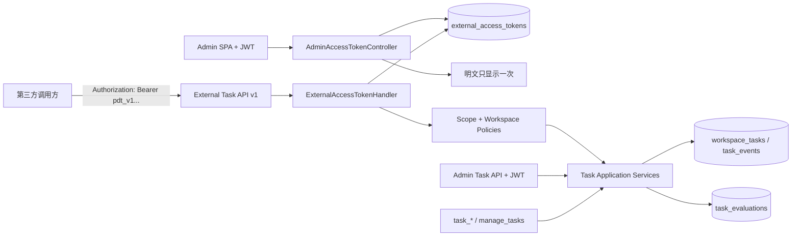

# 第三方任务看板 Access Token 与外部 API 详细设计方案

> 状态：Design Complete / Implementation Not Started
> 日期：2026-08-21
> 对应 ADR：[ADR-075 第三方任务看板 Access Token 与外部 API](../07架构/90ADR-075第三方任务看板AccessToken与外部APIADR.md)
> 本轮边界：只输出 PuddingAgent 侧文档产物（详细设计、ADR 与索引）；未修改源码、配置、数据库或运行数据。

## 0. 结论摘要

本方案为 PuddingAgent 的任务看板增加一套专门面向第三方调用方的认证、授权与稳定 API 边界。冻结的核心结论如下：

1. Admin 登录 JWT 与第三方 Access Token 是两种不同凭据，不复用、不互换。
2. Access Token 使用不可自描述的高熵 opaque token；数据库只保存 SHA-256 摘要，明文只在创建成功响应中出现一次。
3. 认证接入 ASP.NET Core 标准 `AuthenticationHandler<TOptions>`、多认证方案和 Policy-based Authorization；不在 Controller Action 内手写 Header 校验。
4. 现有 `/api/workspaces/{workspaceId}/tasks` 继续只服务 Admin JWT；第三方使用稳定的 `/api/external/v1/workspaces/{workspaceId}/tasks`，两者复用同一个 Task 应用服务、状态机、CAS、Store 与事件事实，不复制业务状态机。
5. Token 采用显式 scope 与 workspace allow-list 双重约束；不存在 `*` 超级 scope，Access Token 永远不能创建、查看或撤销其他 Token。
6. “评价”是一等、追加式 `TaskEvaluation` 子资源，不伪装为评论，不自动改变 Task 状态；需要改变状态时必须另行调用受 CAS 保护的 Task Command。
7. 第三方入口默认关闭；非 Loopback 访问必须经过 HTTPS。PuddingDesktop 动态 Loopback Core 不是远程第三方 API 的部署证明。

## 1. 现状与代码证据

### 1.1 当前认证基线

- `Source/PuddingHost/Hosting/PuddingApplicationHost.cs:122-146` 只注册了 `JwtBearerDefaults.AuthenticationScheme`，JWT 是当前默认认证方案。[R01]
- `Source/PuddingHost/Extensions/PuddingWebApplicationExtensions.cs:43-48` 已按 `UseAuthentication` → Session → `UseAuthorization` 组织中间件。[R02]
- `Source/PuddingPlatform/Controllers/Api/AuthApiController.cs:19-147` 登录成功后签发 8 小时左右的 Admin SPA JWT。[R03]
- `Source/PuddingPlatformAdmin/src/app.tsx:67-88` 从 `localStorage.pudding_token` 读取 Admin JWT。[R04]

这套 JWT 适合交互式 Admin 登录，但不适合作为长期第三方凭据：它缺少按 Token 的名称、workspace、scope、到期、撤销、最后使用时间和独立审计。

### 1.2 当前任务看板基线

- `Source/PuddingPlatform/Controllers/Api/TaskController.cs:21-373` 已提供 Task CRUD、评论、Command 与 SSE Watch，Controller 目前整体使用 `[Authorize]`。[R05]
- `Source/PuddingPlatform/Controllers/Api/TaskDtos.cs:7-178` 已存在专用 wire DTO、稳定 Task 错误结构和评论 DTO，没有直接暴露 EF Entity。[R06]
- `Source/PuddingCore/Tasks/WorkspaceTaskModels.cs:88-572` 已冻结 `TaskOrigin`、`TaskEventType`、`WorkspaceTask` 和 `TaskEvent`。[R07]
- `Source/PuddingCore/Tasks/TaskPersistenceContracts.cs:4-107` 已有 Task Store 与 CAS 请求合同。[R08]
- `Source/PuddingPlatformAdmin/src/services/platform/api.ts:3633-3790` 已有 Admin Task API 客户端；`workspace-tasks/api.ts` 已实现携带 Bearer Header 的 SSE cursor watch。[R09]

因此第三方 API 不能再造一套 Task 表、状态枚举或转移规则。它只做协议适配、认证授权、幂等和 DTO 稳定化。

### 1.3 当前 Admin 基线

- `Source/PuddingPlatformAdmin/config/routes.ts:167-190` 已有“系统配置”分组，适合新增 Access Token 管理页。[R10]
- `Source/PuddingPlatformAdmin/src/pages/user-management/index.tsx:46-340` 提供 ProTable + Drawer/Modal 的管理页模式。[R11]

## 2. 目标、非目标与解释

### 2.1 目标

- Admin 能创建、查看元数据、复制一次、撤销第三方 Access Token。
- Token 能被限制到一个或多个 workspace 和最小权限 scope。
- 第三方能读取、创建/导入、修改、评论、评价 Task；高风险命令只有显式 `tasks.command` scope 才可调用。
- 外部 API 具有版本、幂等、CAS、错误码、限流、审计和 OpenAPI 合同。
- Admin JWT、现有 Task Board 和 Runtime `task_*` 工具的行为不回归。

### 2.2 非目标

- 不实现 OAuth 2.0 Authorization Server、OIDC、第三方用户登录或委托授权页面。
- 不把 Access Token 放进 URL、Query String、服务端配置、日志或数据库明文列。
- 不允许 Access Token 管理 Token、用户、角色、Provider、KeyVault、会话或任意非 Task 资源。
- 不通过评价文本自动完成、重开、失败或归档任务。
- 不为第三方复制 Task 状态机、SQLite Task Ledger 或前端 reducer。
- 不把“上传任务”解释为任意附件上传；V1 指创建单个 Task 或从 JSON/CSV 批量导入 Task。附件属于后续独立设计。
- 不规定第三方调用方的 SDK、脚本、凭据注入或本地重试实现；本文只冻结 PuddingAgent 服务端合同。
- 本文不是已实现或已投产的声明。

## 3. 术语和信任边界

| 术语 | 精确定义 |
|------|----------|
| Admin JWT | 用户通过 `/api/login/account` 获得的交互式登录 JWT，只供 Admin SPA/用户 API 使用 |
| External Access Token | Admin 创建、服务端只存摘要、面向自动化客户端的长期 opaque token |
| Token owner | 创建 Token 的 Admin 用户；owner 被禁用或删除时，该用户创建的 Token 全部失效 |
| Scope | Token 可执行的动作集合，例如 `tasks.read`、`tasks.write` |
| Workspace allow-list | Token 可访问的明确 workspaceId 集合；不支持全局通配符 |
| External API | `/api/external/v1/**`；只接受 External Access Token scheme |
| Internal Task API | 现有 `/api/workspaces/{workspaceId}/tasks/**`；继续接受 Admin JWT |
| TaskEvaluation | 对某一 Task 的追加式、结构化评价记录，不是 Task 状态 |

信任边界：



## 4. 总体分层

### 4.1 PuddingCore

只放与 ASP.NET/EF 无关的稳定合同：

- scope 常量、actor 类型、Access Token 公共只读元数据；
- `TaskEvaluation`、verdict、Store/Service 抽象；
- 外部 Task 命令输入与幂等上下文；
- `TaskOrigin.ExternalApi` 和追加在枚举末尾的 `TaskEventType.TaskEvaluated`；
- 任何权限判断所需的纯事实，不放数据库或 HTTP 类型。

### 4.2 PuddingPlatform

负责：

- Access Token 实体、SQLite 表、Store、Secret 生成/摘要/验证；
- ASP.NET Core Authentication Handler 和 Authorization Requirement/Handler；
- Admin Token 管理 API；
- External Task API v1 DTO/Controller、幂等 Store、评价 Store；
- `ProblemDetails`、审计、`last_used_at` 合并写、OpenAPI 文档分组。

### 4.3 PuddingHost

只做组合根：

- 注册第二认证方案；
- 注册外部 Task policies；
- 注册 ASP.NET Core Rate Limiter；
- 按配置启用 External API；
- 维持现有 JWT 默认方案，不能把 External Token 设为全局默认方案。

### 4.4 PuddingPlatformAdmin

只提供 Token 管理与状态展示，不实现 Secret 验证、scope 决策或 workspace 鉴权。

## 5. Access Token 领域设计

### 5.1 Token 名称与格式

用户界面统一称“Access Token”；代码命名统一使用 `ExternalAccessToken`，避免与现有登录 JWT 的 `token` 混淆。

V1 wire 格式：

```text
pdt_v1_<keyId>.<secret>
```

- `pdt_v1_`：可识别前缀，方便 Secret Scanner 和人工判断；
- `keyId`：128 bit 随机公开定位符，Base64Url 编码；
- `secret`：`RandomNumberGenerator.GetBytes(32)` 生成的 256 bit 随机值，Base64Url 编码；
- 总长度设置硬上限，解析前拒绝异常长 Header；
- `keyId` 只用于 O(1) 查询，不能作为认证证据；
- 服务端对完整 canonical token 做 SHA-256，并使用 `CryptographicOperations.FixedTimeEquals` 比较摘要。

高熵随机 Secret 不需要可逆加密。V1 不增加可恢复密钥或“再次查看”能力。

### 5.2 Token 只显示一次

`POST /api/admin/access-tokens` 的 201 响应是唯一包含 `accessToken` 明文的响应。此后：

- GET 列表只返回 `tokenId`、`name`、`displayPrefix`、scope、workspace、状态、到期和最后使用时间；
- 数据库只保存 32-byte digest；
- 后端日志、审计事件、Trace、异常、ProblemDetails 不包含 Header 或 Secret；
- Admin 页面关闭一次性 Secret Modal 后不能恢复；只能创建新 Token 并撤销旧 Token。

### 5.3 生命周期

```text
Create -> Active -> Expired
                 -> Revoked
```

- 默认有效期：90 天；
- 最大有效期：365 天；
- V1 不允许永不过期；
- 每名 Admin 最多 20 个 Active Token，均为配置上限；
- scope、workspace allow-list 与到期时间在创建后不可原地扩大；需要扩大权限时创建新 Token；
- 名称可改，但不改变安全事实；
- 撤销不可逆且即时生效；
- owner 被禁用/删除时 fail closed；
- “轮换”是先创建新 Token、验证新 Token、再撤销旧 Token的引导流程，不暗中覆盖 Secret。

### 5.4 持久化表

#### `external_access_tokens`

| 列 | 类型/约束 | 说明 |
|----|-----------|------|
| `token_id` | TEXT UNIQUE NOT NULL | 稳定内部 ID |
| `key_id` | TEXT UNIQUE NOT NULL | Header 中的公开定位符 |
| `secret_hash` | BLOB(32) NOT NULL | canonical token SHA-256 |
| `display_prefix` | TEXT NOT NULL | 安全显示前缀 |
| `name` | TEXT NOT NULL | 1-100 字符 |
| `owner_user_id` | TEXT NOT NULL | 创建 Token 的 Admin UserId |
| `version` | INTEGER NOT NULL | 管理操作 CAS |
| `created_at_utc` | TEXT NOT NULL | UTC |
| `expires_at_utc` | TEXT NOT NULL | UTC，必填 |
| `revoked_at_utc` | TEXT NULL | 撤销时点 |
| `revoked_by_user_id` | TEXT NULL | 撤销者 |
| `revocation_reason` | TEXT NULL | 1-500 字符 |
| `last_used_at_utc` | TEXT NULL | 合并写入的近似最后使用时间 |

#### `external_access_token_scopes`

联合主键 `(token_id, scope)`，scope 只允许服务端白名单中的精确值。

#### `external_access_token_workspaces`

联合主键 `(token_id, workspace_id)`；创建时必须至少选择一个现存 workspace。

#### `external_access_token_audit_events`

记录 create、rename、revoke、authentication_succeeded（采样/合并）、authentication_failed（按原因类别聚合）、scope_denied、workspace_denied。事件只保存 `token_id/key_id`，不保存 token 或摘要。

### 5.5 `last_used_at` 不进入认证写路径

Pudding 使用单 SQLite writer 场景。认证每次成功都同步 UPDATE 会增加无价值写竞争，因此：

- Handler 的正确性路径只读 Token；
- 成功使用写入有界 Channel/内存合并器；
- 同一 Token 最多每 5 分钟持久化一次 `last_used_at_utc`；
- 进程崩溃最多丢失这 5 分钟的展示精度，不影响认证和审计正确性；
- revoke/create 仍是同步持久事实。

## 6. ASP.NET Core 认证与授权设计

### 6.1 多认证方案

保留当前 JWT 默认方案，并增加唯一名称：

```text
JwtBearerDefaults.AuthenticationScheme = Bearer      // Internal/Admin
PuddingExternalAccessToken              // External API v1
```

注册形态：

```csharp
services
    .AddAuthentication(JwtBearerDefaults.AuthenticationScheme)
    .AddJwtBearer(...)
    .AddScheme<ExternalAccessTokenOptions, ExternalAccessTokenHandler>(
        ExternalAccessTokenDefaults.Scheme,
        _ => { });
```

这段是目标结构示意，不是本轮代码。ASP.NET Core 官方文档明确支持为额外认证方式注册唯一 scheme，并通过 Policy 选择 scheme。[R12]

不设置全局 Policy Scheme，也不根据 token 字符串猜测并转发，因为 Internal 与 External 已由路由边界明确分开：

- Internal Controller 继续使用 JWT 默认 scheme；
- External Controller 的每个 Policy 显式只选择 `PuddingExternalAccessToken`；
- Token 管理 Controller 显式只选择 JWT scheme 并要求 `admin` role。

### 6.2 Handler 处理序列

`ExternalAccessTokenHandler.HandleAuthenticateAsync`：

1. Header 缺失：`NoResult()`；
2. Header 不是单个 Bearer 或超过长度：`Fail("invalid_token")`；
3. 前缀/分隔符/Base64Url 格式非法：统一失败；
4. 通过 `keyId` 索引查 Token；
5. 检查摘要、revoked、expires、owner 是否仍启用；
6. 构造 ClaimsPrincipal；
7. 投递 `last_used_at` 合并更新；
8. 返回 `Success(ticket)`。

Claims：

| Claim | 值 |
|-------|----|
| `sub` / NameIdentifier | `access-token:{tokenId}` |
| `name` | Token name |
| `pudding.actor_type` | `external_access_token` |
| `pudding.token_id` | tokenId |
| `pudding.owner_user_id` | owner UserId |
| `pudding.scope` | 每个 scope 一个重复 claim |
| `pudding.workspace` | 每个 workspaceId 一个重复 claim |

绝不注入 `admin` role。401 响应统一为 `invalid_token`，不向攻击者区分“未知、过期、撤销、owner 禁用”。

### 6.3 Policy 与 Requirement

Policy-based authorization 使用 Framework 的 requirement/handler 模型，而不是 Controller 内 if/else。[R13]

每个外部 Policy 包含：

1. 显式 `PuddingExternalAccessToken` scheme；
2. `RequireAuthenticatedUser()`；
3. 一个 `ExternalScopeRequirement`；
4. 一个 `ExternalWorkspaceRequirement`，从 route value 读取 `workspaceId` 并与 claim 做 ordinal 比较。

Token 管理 Policy：

```text
AdminAccessTokenManagement
  scheme = Bearer(JWT)
  role = admin
```

即使未来有人错误地给 External Token 添加同名 claim，它仍不能进入管理 API，因为认证 scheme 不匹配。

## 7. Scope 模型

| Scope | 允许端点 | 风险 |
|-------|----------|------|
| `tasks.read` | list/get/comments/evaluations/watch/whoami | 低 |
| `tasks.write` | create、patch 元数据、JSON/CSV 导入 | 中 |
| `tasks.comment` | 新增评论 | 中 |
| `tasks.evaluate` | 新增结构化评价 | 中 |
| `tasks.command` | assign/run-now/cancel/reopen/archive/mark-failed/resume/requeue | 高 |

规则：

- 创建 Token 默认只勾选 `tasks.read`；
- `tasks.write` 不隐含 `tasks.command`；
- `tasks.evaluate` 不隐含状态变更；
- V1 不提供 `tasks.delete`，第三方不能调用硬删除；
- 查询评论/评价依赖 `tasks.read`，创建分别依赖 comment/evaluate；
- scope 与 workspace 均必须满足，二者是 AND；
- 未知 scope 在 Token 创建时 422，运行时 fail closed。

## 8. External Task API v1

### 8.1 路由与版本

固定基座：

```text
/api/external/v1/workspaces/{workspaceId}/tasks
```

现有 `/api/workspaces/**` 不是第三方稳定合同。External V1 Controller 只做以下适配：

- external DTO ↔ Core contract；
- Actor/Origin/Correlation 注入；
- scope/workspace policy；
- `If-Match`/Idempotency-Key；
- ProblemDetails；
- 调用现有 Task application service。

### 8.2 端点矩阵

| Method | Route | Scope | 语义 |
|--------|-------|-------|------|
| GET | `/api/external/v1/token` | authenticated | 返回当前 Token 名称、scope、workspace、到期时间，不返回 Secret |
| GET | `/workspaces/{workspaceId}/tasks` | `tasks.read` | keyset list/filter |
| POST | `/workspaces/{workspaceId}/tasks` | `tasks.write` | 创建一个 Task；要求 Idempotency-Key |
| GET | `/workspaces/{workspaceId}/tasks/{taskId}` | `tasks.read` | Task 详情 |
| PATCH | `/workspaces/{workspaceId}/tasks/{taskId}` | `tasks.write` | 只修改元数据；要求 `If-Match` |
| GET | `/workspaces/{workspaceId}/tasks/{taskId}/comments` | `tasks.read` | 评论列表 |
| POST | `/workspaces/{workspaceId}/tasks/{taskId}/comments` | `tasks.comment` | 追加评论；要求 Idempotency-Key |
| GET | `/workspaces/{workspaceId}/tasks/{taskId}/evaluations` | `tasks.read` | 评价列表 |
| POST | `/workspaces/{workspaceId}/tasks/{taskId}/evaluations` | `tasks.evaluate` | 追加结构化评价；要求 Idempotency-Key |
| POST | `/workspaces/{workspaceId}/tasks/{taskId}/commands/{command}` | `tasks.command` | 显式命令；要求 `If-Match` + Idempotency-Key |
| GET | `/workspaces/{workspaceId}/tasks/watch` | `tasks.read` | Snapshot + Last-Event-ID SSE |

`command` 只接受冻结白名单：`assign`、`run-now`、`cancel`、`reopen`、`archive`、`mark-failed`、`resume`、`requeue`。

### 8.3 DTO 约束

外部 DTO 与 Internal DTO 分文件、分 namespace。V1 只承诺 external DTO，不承诺 EF Entity 或内部 C# 枚举数值。

创建示例：

```http
POST /api/external/v1/workspaces/default/tasks
Authorization: Bearer pdt_v1_...
Idempotency-Key: 019f1d0e-4b8d-7c91-a5ab-4a4f1571d0d4
Content-Type: application/json

{
  "title": "核对周报数据",
  "description": "从财务导出核对本周异常项",
  "acceptanceCriteria": "异常项均有来源与处置结论",
  "priority": "p2",
  "executionWindow": "inherit",
  "dueAtUtc": "2026-08-25T10:00:00Z"
}
```

响应：201，`Location` 指向 External V1 resource，Header 返回：

```text
ETag: "task-v1"
```

PATCH 使用：

```http
If-Match: "task-v3"
```

External Controller 将 ETag 解析为现有 `expectedVersion`。不同时支持 body `expectedVersion`，避免两个并发事实源。

### 8.4 Actor 与 Origin

External 写入统一注入：

```text
actorId = access-token:{tokenId}
origin  = external.api
```

客户端不能覆盖 `createdBy`、`updatedBy`、`origin`、`workspaceId`、`version`、Task 状态或事件字段。

### 8.5 Idempotency

对创建 Task、评论、评价和命令要求 `Idempotency-Key`：

- key 作用域：`tokenId + HTTP method + canonical route + key`；
- 持久表保存 request body SHA-256、状态、response resource id、response status 与创建时间；
- 同 key + 同 hash：返回原结果；
- 同 key + 不同 hash：409 `external.idempotency_conflict`；
- key 最长 128，拒绝控制字符；
- 默认保留 7 天；Task/evaluation 自身仍永久按业务保留；
- mutation 只有具备 Idempotency-Key 时可在网络失败后安全重试。

### 8.6 CAS 和冲突

- PATCH/Command 必须有有效 `If-Match`；缺失返回 428 `external.precondition_required`；
- 版本不匹配返回 412 `task.version_conflict`，响应包含当前 ETag 与最小当前 Task 快照；
- 412 响应必须返回当前 ETag 与最小当前 Task 快照，使调用方能重新读取并显式解决冲突；服务端不能自动用新版本覆盖；
- 底层仍调用 `TaskCommandService`/`ITaskStore`，不绕过 `TaskStateMachine.CanTransition`。

### 8.7 评价合同

`TaskEvaluation`：

```json
{
  "evaluationId": "tev_...",
  "taskId": "task_...",
  "workspaceId": "default",
  "verdict": "accepted",
  "score": 5,
  "comment": "验收证据完整，结果可复现",
  "taskVersionObserved": 7,
  "supersedesEvaluationId": null,
  "evaluator": {
    "type": "external_access_token",
    "id": "access-token:pat_...",
    "displayName": "third-party reviewer"
  },
  "createdAtUtc": "2026-08-20T08:00:00Z"
}
```

约束：

- `verdict`: `accepted | needs_changes | rejected`；
- `score`: 1-5，必填；
- `comment`: 1-4000，必填；
- `taskVersionObserved` 必须等于调用前读取的 Task version，防止评价错误版本；
- 已归档 Task 不再接受新评价；
- 评价追加后写 `task_evaluations` 与 `task.evaluated` event，二者同事务；
- 评价不会增加 Task aggregate version，也不会迁移状态；
- 更正使用新评价 + `supersedesEvaluationId`，不 UPDATE/DELETE 历史评价；
- `supersedesEvaluationId` 必须属于同一 workspace/task/同一 token actor；
- Board 可以投影“最新评价”，但 Task 主状态仍来自 `WorkspaceTaskStatus`。

### 8.8 SSE

External Watch 复用 Task 事件 follower/DTO mapper，不能复制轮询状态机：

- 只接受 Authorization Header，禁止 `?access_token=`；
- 首帧为当前 workspace snapshot；
- `Last-Event-ID`/`afterId` 恢复；
- `task.evaluated` payload 只带 evaluationId 与当前 Task 摘要，需要详情时 GET evaluations；
- 401/403/409 不重连；429 按 `Retry-After`；网络断开指数退避，最大 4 秒；
- Token 在流中被撤销时，最长一个 15 秒 heartbeat 周期内重新验证并关闭；不能让已建立流永久绕过撤销。

### 8.9 错误协议

统一使用 `application/problem+json`：

```json
{
  "type": "https://pudding.local/problems/task-version-conflict",
  "title": "Task version conflict",
  "status": 412,
  "code": "task.version_conflict",
  "traceId": "...",
  "expectedVersion": 3,
  "actualVersion": 4
}
```

| HTTP | code | 说明 |
|------|------|------|
| 400 | `external.invalid_request` | JSON/参数非法 |
| 401 | `external.invalid_token` | 缺失、未知、过期、撤销或 Secret 错误 |
| 403 | `external.scope_denied` / `external.workspace_denied` | 已认证但无权 |
| 404 | `task.not_found` | 资源不存在；跨 workspace 也返回 404 防枚举 |
| 409 | `external.idempotency_conflict` / Task state conflict | 幂等或状态冲突 |
| 412 | `task.version_conflict` | ETag 不匹配 |
| 422 | 稳定 Task/评价错误码 | 领域校验失败 |
| 428 | `external.precondition_required` | 缺 If-Match |
| 429 | `external.rate_limited` | 超限，带 Retry-After |

## 9. Rate Limit 与容量保护

使用 ASP.NET Core Rate Limiting Middleware，并按认证后的 `pudding.token_id` 分区；官方文档支持按用户、API key 或其他 partition key 分桶。[R14]

默认：

- REST：每 Token 120 requests/minute，burst 30；
- mutation 并发：每 Token 4；
- SSE：每 Token 最多 3 条并发流；
- request body：普通 256 KiB；JSON/CSV 导入由调用方拆分为单条创建请求，V1 不开放超大批量 body；
- 429 包含 `Retry-After`，不暴露其他 Token 的配额。

中间件顺序：

```text
UseRouting
UseAuthentication
UseRateLimiter        // 需要 token_id claim 后分区
UseAuthorization
MapControllers
```

## 10. Admin Access Token 管理器

### 10.1 路由和权限

新增：

```text
/system-config/access-tokens
```

页面和后端均要求 Admin JWT。前端隐藏菜单不是安全边界。

### 10.2 页面结构

ProTable 列：

- Name；
- Prefix（可复制识别前缀，不含 Secret）；
- Workspaces；
- Scopes；
- Status：Active/Expired/Revoked/OwnerDisabled；
- ExpiresAt；
- LastUsedAt；
- CreatedBy/CreatedAt；
- Actions：查看详情、重命名、撤销、创建替代 Token。

过滤：状态、owner、workspace、scope、到期时间。

### 10.3 创建 Drawer

字段：

- 名称；
- workspace 多选，至少一项；
- scope checkbox，默认只有 `tasks.read`；
- 到期日，默认 90 天，最长 365 天；
- 每个 scope 展示明确风险说明；
- 提交前展示实际 Public Base URL、HTTPS 状态和 External API Enabled 状态。

### 10.4 一次性 Secret Modal

创建成功后：

- 用不可恢复警示显示一次 Token；
- 提供 Copy Token、Copy PowerShell、Copy curl、下载 `.env.example`（只在用户显式选择时，文件仍包含 Secret，需醒目标注）操作；
- 关闭前要求勾选“我已安全保存”；
- 页面状态或 Redux 不持久化明文，刷新即消失；
- 不把 Secret 放 URL、analytics、notification 描述或错误报告。

### 10.5 管理 API

| Method | Route | 说明 |
|--------|-------|------|
| GET | `/api/admin/access-tokens` | 分页/筛选元数据 |
| POST | `/api/admin/access-tokens` | 创建；明文只在本响应出现 |
| GET | `/api/admin/access-tokens/{tokenId}` | 详情，无 Secret/Hash |
| PATCH | `/api/admin/access-tokens/{tokenId}` | 只允许重命名；要求 expectedVersion |
| POST | `/api/admin/access-tokens/{tokenId}/revoke` | 撤销；要求 expectedVersion + reason |

不提供 reveal、unrevoke、硬删除或扩大 scope/workspace 的端点。

## 11. 配置设计

配置属于 Core 运行策略，进入 `<DataRoot>/config/system.json` 对应强类型 section；Token 记录本身属于运行事实，进入数据库。

```json
{
  "ExternalTaskApi": {
    "Enabled": false,
    "PublicBaseUrl": null,
    "RequireHttps": true,
    "DefaultTokenLifetimeDays": 90,
    "MaxTokenLifetimeDays": 365,
    "MaxActiveTokensPerOwner": 20,
    "RequestsPerMinutePerToken": 120,
    "MutationConcurrencyPerToken": 4,
    "SseConnectionsPerToken": 3,
    "IdempotencyRetentionDays": 7
  }
}
```

校验：

- Enabled=true 且非 Loopback 时 PublicBaseUrl 必须是 HTTPS absolute URL；
- PublicBaseUrl 不包含 path/query/fragment；
- 数值越界导致启动期配置错误，不静默回默认；
- Admin 页面显示实际绑定地址与 advertised PublicBaseUrl 的区别；
- Token Secret 不进入此配置。

## 12. 审计、日志与指标

### 12.1 审计字段

每次 External mutation 记录：

- tokenId、ownerUserId、workspaceId；
- scope、endpoint operation；
- taskId/evaluationId；
- idempotency key hash，不保存原 key；
- traceId/correlationId/causationId；
- before/after Task version；
- result code、latency；
- IP 只按现有隐私策略记录，默认不保存原值。

### 12.2 指标

- `external_access_token_auth_total{result}`；
- `external_task_api_requests_total{operation,status}`；
- `external_task_api_duration_ms`；
- `external_task_api_rate_limited_total`；
- `external_task_api_idempotency_replay_total`；
- `external_task_api_scope_denied_total{scope}`；
- `external_task_api_active_sse`；
- `external_task_evaluations_total{verdict}`。

禁止 label 使用 tokenId、taskId、workspaceId 等高基数字段。

## 13. 目标文件矩阵

以下是实施目标，不表示文件已存在。

### 13.1 Core

| 目标文件 | 职责 |
|----------|------|
| `Source/PuddingCore/Security/ExternalAccessTokenContracts.cs` | Token 公共元数据、actor/claim 名称 |
| `Source/PuddingCore/Security/ExternalTaskApiScopes.cs` | scope 白名单与组合 |
| `Source/PuddingCore/Tasks/TaskEvaluationContracts.cs` | Evaluation/verdict/store/service 合同 |
| `Source/PuddingCore/Tasks/WorkspaceTaskModels.cs` | 枚举末尾追加 ExternalApi/TaskEvaluated |

### 13.2 Platform

| 目标文件 | 职责 |
|----------|------|
| `Data/Entities/ExternalAccessTokenEntity.cs` | Token 主表实体 |
| `Data/Entities/ExternalAccessTokenScopeEntity.cs` | scope 联结 |
| `Data/Entities/ExternalAccessTokenWorkspaceEntity.cs` | workspace 联结 |
| `Data/Entities/ExternalAccessTokenAuditEventEntity.cs` | 安全审计 |
| `Data/Entities/TaskEvaluationEntity.cs` | 追加式评价 |
| `Data/Entities/ExternalApiIdempotencyEntity.cs` | mutation 幂等事实 |
| `Services/Security/ExternalAccessTokenSchemaBootstrapper.cs` | SQLite 表/索引一次性原地升级 |
| `Services/Security/ExternalAccessTokenStore.cs` | 查询、创建、撤销、摘要验证 |
| `Services/Security/ExternalAccessTokenService.cs` | RNG、生命周期、管理命令 |
| `Services/Security/ExternalAccessTokenHandler.cs` | ASP.NET 认证 scheme |
| `Services/Security/ExternalAccessTokenAuthorizationHandler.cs` | scope/workspace requirements |
| `Services/Security/ExternalAccessTokenUsageCoalescer.cs` | last-used 合并写 |
| `Services/Tasks/TaskEvaluationStore.cs` | evaluation + task event 原子提交 |
| `Services/ExternalApi/ExternalApiIdempotencyStore.cs` | request hash/replay |
| `Controllers/Api/AdminAccessTokenController.cs` | JWT Admin-only 管理 API |
| `Controllers/External/V1/ExternalTaskController.cs` | 外部 v1 Task API 适配 |
| `Controllers/External/V1/ExternalTaskDtos.cs` | v1 stable DTO/ProblemDetails extensions |
| `Controllers/External/V1/ExternalTokenInfoController.cs` | doctor/whoami |

`PlatformDbContext.cs` 增加 DbSet/索引映射；初始化器显式运行 schema bootstrapper。不得创建第二个 Task DbContext 或数据库。

### 13.3 Host

| 目标文件 | 职责 |
|----------|------|
| `Source/PuddingHost/Hosting/PuddingApplicationHost.cs` | AddScheme、Policies、RateLimiter、options |
| `Source/PuddingHost/Extensions/PuddingWebApplicationExtensions.cs` | UseRateLimiter 顺序与 endpoint gate |
| `Source/PuddingHost/Extensions/PuddingServiceCollectionExtensions.Platform.cs` | Store/Service/Handler 注册 |

### 13.4 Admin

| 目标文件 | 职责 |
|----------|------|
| `Source/PuddingPlatformAdmin/config/routes.ts` | 系统配置下新增路由 |
| `src/pages/access-token-management/index.tsx` | Table/Drawer/一次性 Secret Modal |
| `src/pages/access-token-management/types.ts` | Admin DTO |
| `src/pages/access-token-management/components/*` | Scope、状态、Secret Modal |
| `src/services/platform/api.ts` | Token 管理 API client |
| `src/locales/zh-CN/menu.ts` / `en-US/menu.ts` | 菜单文案 |

### 13.5 测试

| 目标文件 | 职责 |
|----------|------|
| `Source/PuddingPlatformTests/Security/ExternalAccessToken*Tests.cs` | Token/Auth/Policy/DB |
| `Source/PuddingPlatformTests/Controllers/ExternalTaskApiV1Tests.cs` | API、scope、workspace、idempotency、CAS |
| `Source/PuddingPlatformTests/Services/Tasks/TaskEvaluationStoreTests.cs` | 评价追加与事件原子性 |
| `Source/PuddingPlatformAdmin/src/pages/access-token-management/*.test.tsx` | UI 与 once-only Secret |

## 14. 实施分期

### P0：合同冻结

1. 固化 scope、external routes、DTO、错误码、ETag 和评价 schema；
2. 冻结 Token format/Secret 规则；
3. 生成 external OpenAPI v1 snapshot；
4. 完成威胁模型测试清单。

退出：合同评审通过，尚不暴露 endpoint。

### P1：Token 后端

1. 表/索引/Store；
2. create/list/rename/revoke；
3. AuthenticationHandler；
4. scope/workspace policies；
5. last-used coalescer；
6. security tests。

退出：Admin API 可通过集成测试创建 Token；明文只出现一次；撤销立即 401。

### P2：External Task API v1

1. read/create/patch；
2. comments/evaluations；
3. commands；
4. ETag/idempotency；
5. watch；
6. ProblemDetails/OpenAPI/RateLimiter。

退出：外部 API 与 Internal API 对同一 Task Ledger 行为一致，无重复状态机。

### P3：Admin UI

1. route/menu/access；
2. list/filter/create；
3. once-only Secret Modal；
4. revoke/replace flow；
5. UI tests、错误和空状态。

退出：Admin 能完整管理 Token 且不能再次读取 Secret。

### P4：部署与收口

1. HTTPS/reverse proxy；
2. feature flag 启用；
3. 指标/日志验证；
4. Token 轮换演练；
5. 外部客户端文档；
6. 两段式产品验收。

退出：实现完成与生产接受分别留证，不把构建通过当作投产。

## 15. 测试与验收矩阵

### 15.1 Token 与认证

- Secret 使用 CSPRNG，数据库和日志无明文；
- 同名 Token 可存在，keyId/tokenId 唯一；
- malformed/unknown/wrong/expired/revoked/owner-disabled 均 401；
- digest 比较为固定时间；
- revoke 后下一请求立即失败；
- JWT 不能调用 external endpoint，External Token 不能调用 admin token endpoint；
- scope 与 workspace 交叉矩阵全部覆盖；
- last-used 合并写不影响认证结果。

### 15.2 Task API

- list/get 与 Internal Task DTO 核心字段一致；
- create 的 origin/actor 由后端注入；
- PATCH 缺 If-Match 428，旧版本 412；
- state command 仍经现有状态机；
- 外部无 delete；
- 幂等 replay 不重复创建 Task/comment/evaluation/command；
- 同 key 不同 body 409；
- 跨 workspace 资源返回 404；
- 评价不会改变 Task status/version；
- evaluation correction 保留历史；
- SSE snapshot/replay/live 等价，撤销后流关闭。

### 15.3 Admin UI

- 非 Admin 不渲染入口且 API 仍 403；
- create 默认最小 scope；
- workspace 为空不能提交；
- 明文只存在于一次性 Modal 的内存状态；
- 关闭/刷新后不能 reveal；
- revoke 有强确认并显示立即影响；
- OwnerDisabled/Expired/Revoked 不混淆。

### 15.4 真实 smoke

1. Admin JWT 创建只读 Token；
2. 使用集成测试工具调用 Token 自检与 Task list 成功，create 被 403；
3. 创建带 `tasks.write/comment/evaluate` 的替代 Token；
4. 通过 External API 创建 Task，Admin Board 实时出现；
5. 通过 External API update、comment、evaluate；
6. Admin 详情显示 external actor 与最新评价；
7. 制造版本冲突，验证 412 响应携带当前 ETag 与可刷新资源快照；
8. 撤销 Token，下一 REST 请求 401，SSE 关闭；
9. Admin JWT 与 Runtime `task_*` 工具仍通过；
10. 检查 platform.db/日志/诊断包均无 Secret。

## 16. 威胁与缓解

| 威胁 | 缓解 |
|------|------|
| 数据库泄漏后 Token 可直接使用 | 只存 SHA-256 digest；Secret 256 bit 高熵 |
| Token 出现在日志/URL | 只允许 Authorization Header；Header 不记录；统一脱敏 |
| External Token 冒充 Admin | 独立 scheme；无 admin role；管理 API JWT scheme 锁定 |
| Token 横向访问 workspace | workspace requirement 与路由值比对；跨 workspace 404 |
| scope 扩权 | scope 白名单、不可原地扩大、无 `*` |
| 重试重复建任务 | durable Idempotency-Key + request hash |
| 并发覆盖任务 | ETag/If-Match 映射现有 CAS |
| 评价文本改变状态 | evaluation 与 command 分离 |
| SSE 撤销后长期存活 | heartbeat 周期重新验证 |
| 每请求 last-used 造成 SQLite 锁 | 有界合并写，不在 auth hot path UPDATE |
| 调用方凭据泄漏 | 最小 scope/workspace、强制到期、即时撤销和可见 last-used 降低影响面 |
| 明文 HTTP 窃听 | 非 Loopback 强制 HTTPS |
| 大量请求拖垮 Core | per-token rate/concurrency/SSE limits + body limit |

## 17. 发布、回滚与兼容

发布顺序：schema → disabled backend → Admin UI → create test token → external API enable → External API smoke。

回滚：

- 关闭 `ExternalTaskApi.Enabled` 立即停止外部 endpoint；
- 不删除 Token/评价/审计表，保留证据；
- Internal JWT Task API 和 Runtime tools 不依赖 feature flag；
- 撤销所有 active Token 作为安全 kill switch；
- 不回滚已提交的 Task/evaluation 事实；
- 若 DTO 需要破坏性变化，新增 `/v2`，V1 不做隐式兼容猜测。

## 18. 完成定义

设计完成仅表示本文和 ADR 已冻结；实现完成必须同时满足：

- 所有目标文件按职责落地且无第二状态机；
- 定向 backend/frontend/integration 测试通过；
- `git diff --check` 通过；
- External OpenAPI snapshot 已评审；
- HTTPS、Rate Limit、Secret 扫描和撤销演练通过；
- 真实 External API smoke 完成；
- Admin JWT、Task Board、Runtime task tools 回归通过；
- 文档索引和 code map 更新；
- 明确记录 `ready-for-external-deploy` 与 `in-product-functional-complete`，最终进程生命周期结论由外部控制器验收。

## 19. 参考

### 仓库参考

- [R01] `Source/PuddingHost/Hosting/PuddingApplicationHost.cs:122-146`
- [R02] `Source/PuddingHost/Extensions/PuddingWebApplicationExtensions.cs:43-48`
- [R03] `Source/PuddingPlatform/Controllers/Api/AuthApiController.cs:19-147`
- [R04] `Source/PuddingPlatformAdmin/src/app.tsx:67-88`
- [R05] `Source/PuddingPlatform/Controllers/Api/TaskController.cs:21-373`
- [R06] `Source/PuddingPlatform/Controllers/Api/TaskDtos.cs:7-178`
- [R07] `Source/PuddingCore/Tasks/WorkspaceTaskModels.cs:88-572`
- [R08] `Source/PuddingCore/Tasks/TaskPersistenceContracts.cs:4-107`
- [R09] `Source/PuddingPlatformAdmin/src/services/platform/api.ts:3633-3790`
- [R10] `Source/PuddingPlatformAdmin/config/routes.ts:167-190`
- [R11] `Source/PuddingPlatformAdmin/src/pages/user-management/index.tsx:46-340`
- [R15] [ADR-072 工作区 TODO、峰谷 Auto 派发与定时任务](../07架构/86ADR-072工作区TODO峰谷Auto派发与定时任务第一阶段ADR.md)
- [R16] [ADR-073 任务看板施工顺序](../07架构/87ADR-073任务看板优先的Agent工作台轨迹与实时指标施工ADR.md)
- [R17] [任务看板施工合同冻结 v1](../07架构/88任务看板施工合同冻结v1.md)

### ASP.NET Core 官方参考

- [R12] [Authorize with a specific scheme in ASP.NET Core (.NET 10)](https://learn.microsoft.com/en-us/aspnet/core/security/authorization/limitingidentitybyscheme?view=aspnetcore-10.0)
- [R13] [Policy-based authorization in ASP.NET Core (.NET 10)](https://learn.microsoft.com/en-us/aspnet/core/security/authorization/policies?view=aspnetcore-10.0)
- [R14] [Rate limiting middleware in ASP.NET Core (.NET 10)](https://learn.microsoft.com/en-us/aspnet/core/performance/rate-limit?view=aspnetcore-10.0)
