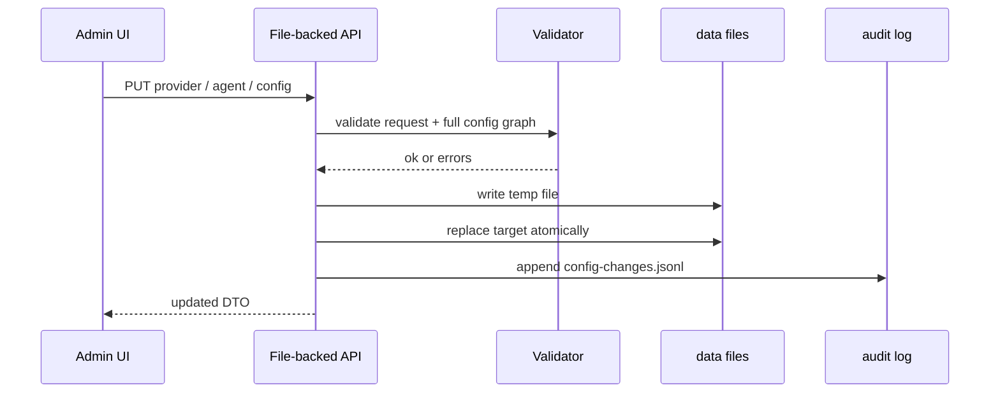

# 系统级配置文件化实施方案

> 日期：2026-05-23  
> ADR：[37ADR-036系统级配置文件唯一来源ADR](../07架构/37ADR-036系统级配置文件唯一来源ADR.md)  
> 目标：把系统级配置、LLM 服务商/模型、全局 Agent、工作区 Agent 等配置类数据从 SQLite 主源移除，统一由 `data/` 下的本地文本文件加载。当前开发环境按干净新启动处理，旧 SQLite 配置数据直接丢弃。

---

## 1. 施工原则

1. **文件是唯一事实来源**：配置读取只允许来自 `data/config`、`data/agent-templates`、`data/agents`、`data/workspaces`。
2. **数据库不再保存 canonical 配置**：SQLite 中已有配置数据直接丢弃，不导出、不迁移。
3. **不做配置双写**：Admin 修改配置时写文件，不写配置表。
4. **运行态继续持久化**：用户、会话、消息、诊断、事件队列、记忆、token 使用量仍可使用 SQLite/JSONL。
5. **干净环境优先**：开发环境允许删除旧 SQLite 文件并重建运行态数据库；不通过 EF migration 清理配置列。
6. **启动 fail fast**：文件缺失或配置引用错误时，明确报错，不从 SQLite fallback。

---

## 2. 配置分类

### 2.1 文件唯一来源

| 当前 DB / 模块 | 目标文件 |
|----------------|----------|
| `LlmProviderEntity` | `data/config/llm.providers.json` |
| `LlmModelEntity` | `data/config/llm.providers.json.providers[].models[]` |
| `LlmProviderQuotaEntity` 中 quota limit | `data/config/llm.providers.json.providers[].quota` |
| `GlobalAgentTemplateEntity` | `data/agent-templates/{templateId}/manifest.json` + Markdown |
| `WorkspaceAgentTemplateEntity` | 取消独立 DB 主源；用 workspace override 文件表达 |
| `WorkspaceAgentEntity` | `data/agents/{agentInstanceId}/manifest.json` + `config/*.json` |
| Workspace agent membership | `data/workspaces/{workspaceId}/agents/{agentInstanceId}/ref.json` |
| `CapabilityEntity` | `data/config/capabilities.json` 或 template `permissions.json` |
| `AgentAvatarEntity` | `data/config/avatars.json` + `data/assets/avatars` |
| 系统、连接器、安全配置 | `data/config/system.json`、`security.json`、`connectors.json` |

### 2.2 数据库保留

| 数据 | 保留原因 |
|------|----------|
| `AppUsers` / `AppRoles` | 登录、权限、用户业务态。 |
| `Teams` / `Workspaces` / memberships | 多用户与工作区业务态；workspace manifest 可作为补充配置，不替代权限数据。 |
| `ChatMessages` / `SessionEventLogs` | 会话历史和可回放事件。 |
| `RuntimeActivities` / `EventQueue` / `SubAgentRuns` | 运行调度和诊断。 |
| `TokenUsageStats` | 实际用量计量；quota limit 不在这里。 |
| Memory DB | 用户记忆和检索索引。 |
| `KeyVaults` | 如果继续使用 DB key vault，只保存 secret 运行态；provider/model 定义不在 DB。 |

---

## 3. 目标文件契约

### 3.1 `data/config/llm.providers.json`

```json
{
  "defaultProviderId": "local-openai",
  "defaultModelId": "gpt-4o-mini",
  "providers": [
    {
      "providerId": "local-openai",
      "name": "OpenAI Compatible",
      "protocol": "openai",
      "baseUrl": "http://localhost:11434/v1",
      "apiKeyRef": "llm/openai-compatible",
      "isEnabled": true,
      "requestTimeoutSeconds": 120,
      "streamTimeoutSeconds": 300,
      "models": [
        {
          "modelId": "gpt-4o-mini",
          "name": "GPT-4o Mini",
          "maxContextTokens": 128000,
          "maxOutputTokens": 4096,
          "capabilityTags": ["text", "function-calling", "streaming"],
          "isDefault": true,
          "sortOrder": 10,
          "pricePer1MInputTokens": 0.15,
          "pricePer1MOutputTokens": 0.60
        }
      ],
      "quota": {
        "dailyTokenLimit": null,
        "monthlyTokenLimit": null
      }
    }
  ],
  "profiles": {
    "default-conscious": {
      "providerId": "local-openai",
      "modelId": "gpt-4o-mini",
      "reasoningEffort": "medium",
      "maxContextTokens": 65536,
      "maxReplyTokens": 4096
    },
    "default-subconscious": {
      "providerId": "local-openai",
      "modelId": "gpt-4o-mini",
      "reasoningEffort": "low",
      "maxContextTokens": 32768,
      "maxReplyTokens": 2048
    }
  },
  "roles": {
    "conscious": "default-conscious",
    "subconscious": "default-subconscious"
  }
}
```

### 3.2 `data/agent-templates/{templateId}/manifest.json`

```json
{
  "templateId": "general-assistant",
  "name": "通用助手",
  "description": "通用型本地 Agent",
  "role": "Service",
  "avatarId": "agent-avatar-neutral",
  "defaultLlmProfiles": {
    "conscious": "default-conscious",
    "subconscious": "default-subconscious"
  },
  "memorySearchMode": "deep",
  "reasoningEffort": "medium",
  "maxContextTokens": 65536,
  "maxReplyTokens": 4096,
  "isBuiltIn": true,
  "isEnabled": true,
  "capabilities": {
    "allowTools": true,
    "allowedToolIds": []
  }
}
```

同目录 Markdown：

```text
SOUL.md       # 身份、人设、语气
AGENTS.md     # 操作规则
TOOLS.md      # 工具边界
BOOTSTRAP.md  # 首次运行引导
MEMORY.md     # 记忆策略
permissions.json
```

### 3.3 `data/agents/{agentInstanceId}`

`manifest.json`：

```json
{
  "agentInstanceId": "default.general-assistant-001",
  "templateId": "general-assistant",
  "workspaceId": "default",
  "displayName": "Pudding",
  "description": "默认工作区助手",
  "avatarId": "agent-avatar-neutral",
  "isEnabled": true,
  "paths": {
    "config": "config",
    "workspace": "workspace",
    "state": "state",
    "logs": "logs"
  }
}
```

`config/llm.json`：

```json
{
  "conscious": {
    "profileId": "default-conscious"
  },
  "subconscious": {
    "profileId": "default-subconscious"
  }
}
```

### 3.4 `data/workspaces/{workspaceId}/agents/{agentInstanceId}/ref.json`

```json
{
  "agentInstanceId": "default.general-assistant-001",
  "workspaceId": "default",
  "agentPath": "../../../agents/default.general-assistant-001",
  "isEnabled": true
}
```

---

## 4. 架构改造

### 4.1 新增配置仓储层

新增 file-backed service，集中处理读、写、校验、缓存失效和配置写入审计。

```text
Source/PuddingCore/Configuration/
  FileConfigStore.cs
  ConfigValidationError.cs
  AtomicFileWriter.cs

Source/PuddingCore/Agents/
  AgentConfigStore.cs
  WorkspaceAgentConfigStore.cs

Source/PuddingPlatform/Services/
  LlmProviderFileService.cs
  AgentTemplateFileService.cs
  WorkspaceAgentFileService.cs
  CapabilityFileService.cs
  AvatarFileService.cs
```

职责：

- `FileConfigStore`：加载 `data/config/*.json`，提供 typed config 和 validation result。
- `AtomicFileWriter`：跨平台原子写入；是否生成 `.bak` 仅针对配置文件本身，不针对旧 SQLite 数据。
- `AgentConfigStore`：加载 template manifest、Markdown、permissions。
- `WorkspaceAgentConfigStore`：加载 agent instance 和 workspace ref。
- Platform file services：把 file model 映射成现有 Admin DTO，保持前端改动最小。

### 4.2 禁止 DB-backed 配置解析

以下服务必须从 DB 改为文件：

```text
AgentTemplateProvider
AgentLLMConfigResolver
LlmProviderApiController
LlmModelApiController
GlobalAgentTemplateApiController
WorkspaceAgentTemplateApiController
WorkspaceAgentApiController
StatsApiController 中模型价格读取
```

替换方向：

- `AgentTemplateProvider.GetPersonaAsync()` 改为调用 `AgentProfileProvider` / `AgentConfigStore`；
- `AgentLLMConfigResolver` 改为只调用 `LlmProfileResolver` 和 `PuddingLlmProvidersConfig`；
- LLM provider/model API 改为读写 `llm.providers.json`；
- Agent template/instance API 改为读写 `data/agent-templates`、`data/agents`、`data/workspaces`；
- token 价格统计从 `llm.providers.json` 构建 price map，不查 `LlmModels`。

### 4.3 Admin 写配置流程



写入失败时：

- 不修改目标文件；
- 返回 400/409/500；
- 错误中包含文件路径、字段路径和原因；
- 不 fallback 写 SQLite。

---

## 5. SQLite 既有配置数据处理

### 5.1 直接丢弃

当前开发环境已经重置为干净新启动环境。施工时不需要考虑旧 SQLite 配置数据：

```text
data/pudding_platform.db
data/databases/pudding_platform.db
```

如其中存在 LLM provider/model/template/agent 等配置数据，直接视为无效旧数据。运行时、API、Admin UI 均不得读取这些配置表。

允许的处理方式：

```text
删除旧 SQLite 文件 -> 由启动流程创建新的运行态数据库
清空 legacy config tables -> 由 data 文件提供配置
保留 legacy config tables -> 代码完全忽略这些表
```

不新增 `LegacyConfigExportService`，不新增 `export-legacy-config` 命令。

### 5.2 启动忽略

`Program.cs` 启动时：

- 不再 seed `LlmProviderEntity`、`LlmModelEntity`、`CapabilityEntity`、`GlobalAgentTemplateEntity`；
- 不再用 `DbContext` 补列维护配置表；
- 不再因为配置表迁移失败阻断启动；
- 必需配置缺失时，只检查文件。

### 5.3 表清理策略

代码层面不要求通过 EF migration drop 表或 drop column。文档和代码注释标记：

```text
Discarded config tables: LlmProviders, LlmModels, GlobalAgentTemplates,
WorkspaceAgentTemplates, WorkspaceAgents, Capabilities, AgentAvatars
```

开发环境可以直接删除旧 DB 文件，不需要备份旧配置数据。后续如有生产数据保留需求，另开 ADR，不进入本次施工范围。

---

## 6. 实施阶段

### Phase 1：冻结配置表写入

目标：防止继续产生 DB 配置漂移。

1. 在 DB-backed 配置 API 前增加 feature flag 或直接切换到只读/弃用响应。
2. 禁止新代码写入 `LlmProviders`、`LlmModels`、`GlobalAgentTemplates`、`WorkspaceAgentTemplates`、`WorkspaceAgents`。
3. 删除或清空开发环境旧 SQLite 后，用 `default-data` + `data/` 文件启动。
4. 测试确认登录、chat、session 等运行态不受影响。

验收：

- 配置表写入 API 不再调用 `db.SaveChangesAsync()`；
- 所有新配置修改路径都计划写文件；
- runtime 不因配置表为空或旧 DB 文件不存在而失败。

### Phase 2：补全文件模型和 validation

目标：让 `data/` 文件足以表达全部配置。

1. 扩展 `PuddingConfigModels.cs`：
   - `PuddingLlmProviderConfig.Quota`；
   - `AgentTemplateManifest.AvatarId`；
   - `AgentTemplateManifest.SortOrder`；
   - `AgentInstanceManifest.AvatarId`；
   - `CapabilitiesConfig`；
   - `AvatarsConfig`。
2. 强化 `PuddingFileConfigLoader.ValidateLlmProviders()`：
   - provider/model/profile/role 引用完整校验；
   - duplicate id 校验；
   - disabled provider 被 profile 引用时报错；
   - quota limit 非负校验。
3. 新增 agent graph validation：
   - agent instance 指向存在的 template；
   - workspace ref 指向存在的 agent instance；
   - template permissions 中 tool id 存在；
   - avatarId 存在或可 fallback。

验收：

- 故意写坏 provider/model/profile 引用时启动失败；
- 文件缺失时从 `default-data` 复制模板或明确报错；
- 校验错误包含文件名和 JSON path。

### Phase 3：实现 file-backed API

目标：Admin API 行为保持，数据源改为文件。

1. `LlmProviderApiController`：
   - `GET` 从 `llm.providers.json` 返回 provider 列表；
   - `POST/PUT/DELETE` 更新 `llm.providers.json`；
   - quota limit 写文件；
   - daily/monthly used 仍读写 usage store。
2. `LlmModelApiController`：
   - model 是 provider 内嵌数组；
   - create/update/delete 通过 provider id 定位数组。
3. `GlobalAgentTemplateApiController`：
   - 读写 `data/agent-templates/{templateId}`；
   - prompt/persona/tools/memory 映射到 Markdown 文件；
   - manifest 字段映射到 DTO。
4. `WorkspaceAgentApiController`：
   - create 生成 `data/agents/{agentInstanceId}` 和 workspace ref；
   - update 修改 agent manifest/config；
   - delete 默认软删 `isEnabled=false`，可选 move 到 `data/backups/deleted-agents`。
5. `WorkspaceAgentTemplateApiController`：
   - 第一阶段可降级为 workspace override 文件 API；
   - 若 UI 仍依赖模板列表，返回由 global template + workspace override 合成的 DTO。

验收：

- Admin 页面刷新后看到的是文件内容；
- 修改文件后 API 返回变化；
- API 写入后文件内容变化，SQLite 配置表为空或不存在也不影响结果。

### Phase 4：替换 Runtime 解析路径

目标：Agent 运行时完全脱离配置表。

1. `AgentTemplateProvider` 改为 file-backed：
   - 通过 `workspaceId + templateId` 或 `agentInstanceId` 解析 profile；
   - Markdown 来自 template 文件；
   - workspace override 来自 agent instance/config。
2. `AgentLLMConfigResolver` 改为 `PuddingLlmProvidersConfig + LlmProfileResolver`。
3. Chat/session 创建时保存 `agentInstanceId`，不再只保存 template id。
4. Runtime diagnostics 记录：
   - `configSourcePaths`；
   - conscious/subconscious provider/model；
   - resolved profile id。

验收：

- 删除 SQLite 文件或清空 LLM provider/model/template 行后 chat 仍可解析模型；
- 修改 `SOUL.md` 后新 session 使用新 persona；
- diagnostics 能看到配置来源文件路径。

### Phase 5：启动和迁移调整

目标：启动流程不再被旧配置库 schema 影响。

1. `Program.cs`：
   - 配置文件 validation 移到 DB migrate 前；
   - DB migration 不处理配置表补列；
   - 配置相关 seed 从 `PlatformDbContext.SeedBuiltInData()` 移出。
2. EF migrations：
   - 不新增配置表结构迁移；
   - 已存在配置 migration 改为 no-op 或 provider-safe；
   - 不再依赖 `DropColumnOperation` 清理配置列；
   - 开发环境可直接删除旧 SQLite 文件验证干净启动。
3. `build-and-up.ps1`：
   - 确保 `data/config/*.json` 存在；
   - 打印真实访问地址 `http://localhost:5000`；
   - 失败时输出配置 validation 错误和 `docker compose logs` 提示。

验收：

- `.\build-and-up.ps1` 后 `http://localhost:5000/health` 正常；
- 旧 `pudding_platform.db` 删除后服务可用，配置来自 `data/` 文件；
- Docker 日志不再出现配置表迁移阻断。

### Phase 6：文档与运维说明

目标：明确“配置只看文件，旧 SQLite 配置数据直接丢弃”的运维路径。

1. 在 README 和 Admin 设置页说明：
   - SQLite 配置数据已废弃并可直接删除；
   - 修改配置应编辑文件或通过 Admin file-backed API；
   - 如何备份 `data/config`、`data/agent-templates`、`data/agents`、`data/workspaces`。
2. 在 `build-and-up.ps1` 输出中提示：
   - 旧 `pudding_platform.db` 可删除；
   - 首次启动会从 `default-data` 补齐缺失配置文件；
   - 配置问题先检查 `data/config/*.json`。

验收：

- 文档明确旧 SQLite 配置数据不迁移；
- 文档明确配置备份对象是 `data/` 文本文件；
- 启动日志不建议用户修复配置表。

---

## 7. 测试策略

### 7.1 单元测试

新增或更新：

```text
Source/PuddingCoreTests/Configuration/PuddingFileConfigLoaderTests.cs
Source/PuddingCoreTests/Configuration/LlmProfileResolverTests.cs
Source/PuddingCoreTests/Agents/AgentProfileProviderTests.cs
Source/PuddingPlatformTests/Services/LlmProviderFileServiceTests.cs
Source/PuddingPlatformTests/Services/WorkspaceAgentFileServiceTests.cs
```

覆盖：

- provider/model/profile 引用校验；
- agent -> template -> profile 解析优先级；
- 原子写失败不破坏原文件；
- 删除 SQLite 文件后 file-backed service 仍返回配置；
- Markdown prompt 文件变更被读取。

### 7.2 集成测试

新增测试 fixture：

```text
Tests/fixtures/file-config-data/
  config/
  agent-templates/
  agents/
  workspaces/
```

用临时 `PUDDING_DATA_ROOT` 启动服务，验证：

- `/api/llm/providers` 返回文件 provider；
- `/api/workspaces/default/agents` 返回文件 agent；
- chat 使用文件 profile；
- `pudding_platform.db` 中无 provider/model 行时仍通过。

### 7.3 E2E

在 Docker smoke 中加入：

1. 删除开发环境旧 SQLite 文件；
2. 使用 `data/config` 和 `data/agents` 启动；
3. 登录；
4. 创建 session；
5. 发送消息；
6. 读取 diagnostics，确认 `configSourcePaths` 指向 `data/` 文件。

---

## 8. 风险与处理

| 风险 | 处理 |
|------|------|
| Admin UI 原本依赖自增 DB id | DTO 保留 `id` 字段时可用 stable hash 或 sort index 生成临时 id；写 API 使用 providerId/templateId/agentInstanceId。 |
| 文件写入损坏 | 原子写、写前全图 validation，可选生成配置文件 `.bak`。 |
| 并发写配置 | `FileConfigStore` 使用 named semaphore / lock file。 |
| secret 暴露 | API 永远只返回 `hasApiKey` / `apiKeyRef`，不返回明文 `apiKey`。 |
| 用户误以为 DB 仍生效 | 启动日志和文档明确“配置表内容已丢弃，配置只看 data 文件”。 |
| 工作区 agent 与模板关系复杂 | 强制引入 `agentInstanceId`，workspace ref 只引用实例，不复制模板。 |
| SQLite 旧迁移阻断启动 | 开发环境直接删除旧 DB；配置表清理不走常规 migration。 |

---

## 9. 交付检查清单

- [ ] `data/config` 是系统和 LLM 配置唯一来源。
- [ ] `data/agent-templates` 是全局 Agent 模板唯一来源。
- [ ] `data/agents` 是工作区 Agent 实例唯一来源。
- [ ] `data/workspaces/{workspaceId}/agents` 是 workspace-agent membership 唯一来源。
- [ ] LLM provider/model/template/agent API 不再写 SQLite。
- [ ] Runtime 不再从 `GlobalAgentTemplates` / `WorkspaceAgentTemplates` / `WorkspaceAgents` / `LlmProviders` / `LlmModels` 解析配置。
- [ ] SQLite 中旧配置数据可直接丢弃，不会被运行时读取。
- [ ] 常规启动不 drop 配置列、不因配置表 schema mutation 失败。
- [ ] `build-and-up.ps1` 后 `http://localhost:5000` 可访问。
- [ ] 测试覆盖文件配置、API 写文件、Runtime 解析和 Docker smoke。

---

## 10. 建议提交顺序

1. `docs: accept file-only system configuration ADR`
2. `feat(config): add file config store and validation`
3. `feat(llm): serve providers and models from data config`
4. `feat(agent): serve templates and workspace agents from files`
5. `refactor(runtime): resolve agent llm profiles from file config`
6. `chore(db): stop seeding and migrating legacy config tables`
7. `test(config): cover file-only configuration source`
8. `docs(config): document discarded sqlite config and data layout`
