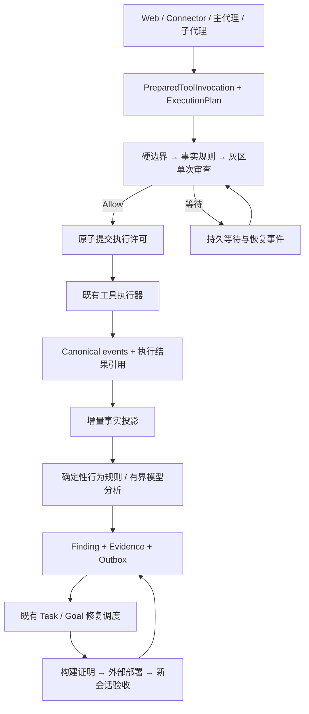

# 自动审计与执行准入闭环：代码级修复设计

> **2026-09-20 证据更新**：下文9月15日缺陷表保留为历史基线；注册IApprovalService（c1c2abf）、认证主体写ResolvedBy（3e6aa0f）、确认码尝试限制（bfbf745）、过期回收（8d5fc2d）已见提交。看板Completed子卡908328f0、f09e49e4分别记录签章和once次数的非缺陷复核，不得再仅凭缺HMAC或常量2下结论。剩余原子准入/身份隔离/真实构建验收见[施工方案§8](任务规划与实施分工及存量看板施工方案-2026-09-20.md)。这些局部证据不等于ADR-091整体验收。

日期：2026-09-15。状态：**Proposed，设计交付；尚未实施、部署或完成运行验收**。

关联：[ADR-091](../07架构/105ADR-091自动审计与执行准入闭环ADR.md)、[旧自动权限设计](../superpowers/specs/2026-06-03-auto-tool-approval-design.md)、[看板交付记录](../Reports/自动审计方案与派发记录-2026-09-15.md)。主任务：`e187a8bbd2d640bb87b96fd3cf548966`。

## 1. 结论与边界

保留旧设计“确定性规则优先、系统采集事实、灰区最多一次隔离模型审查”的方向，替换其未落地的执行机制。自动审计必须同时覆盖两件事：执行前判断这个操作是否可以做；执行中和执行后判断 Agent 是否取得进展、是否正确完成、是否需要改进自身。

二者共享操作身份与证据，但不能共用一个任意运行的审计 Agent。准入链是同步、确定、可取消的运行内核；行为审计是持久、增量、可恢复的后台消费者。审计模型没有业务工具，不负责消费授权，不直接修改代码或裁决自己的修复已经成功。修复由既有 Task/Goal 调度链执行，并经过独立证据验收。

本次不改变产品代码、运行配置、权限或 D:\data。截图中 `/authorize shell once`、推送指令以及 Agent 自述仅作为事件证据，不能被当作本次用户授权。实现不得以开启 YOLO、全局授权 shell、创建审计 Agent 或提示词劝说代替修复。

## 2. 已核实的事实与缺陷

代码基线：当前 HEAD `c582009`；工作树存在他方 WIP，以下结论基于本轮实际文件。旧漏斗提交 `e716829` 不是当前 HEAD 的祖先，不能把分支代码或历史任务完成状态当作当前已具备的能力。

| 事实/入口 | 当前行为 | 修复要求 |
|---|---|---|
| `Source/PuddingAgent/appsettings.json` 的 ToolApproval；`PuddingHost/Extensions/PuddingServiceCollectionExtensions.Platform.cs` | 开启 RequireAuditAgent；Host 总是注入工作空间审计 Agent provider | 审计能力与工作空间 Agent 实例解耦 |
| `PuddingRuntime/Tools/Approval/LlmToolApprovalReviewer.cs` 的 `StrictConfiguredToolApprovalLlmProfileResolver.ResolveAsync` | 只要 provider 已注入，优先查审计 Agent；不存在即抛异常，显式 LLM profile 分支也到不了 | 独立、确定的模型路由；缺配置返回依赖状态 |
| 同文件 `InvocationToolApprovalLlmClient.ReviewAsync` | 配置失败、调用失败、空回复被转成 NeedHuman | 区分 Policy/Human/Dependency，禁止把依赖故障永久转成人工审批 |
| `InMemoryToolApprovalService.CheckAsync` | allowlist、内置规则、已批准票据在命令防火墙前；定义漂移仅记录警告 | 强制边界先检查；授权、旧决定与模型均不能越过硬拒绝 |
| 同类 `OnceTicketAllowedUses = 2` | 一次授权允许两次检查消费，补偿验证重放 | 检查纯读；一次授权只在一次执行提交时原子消费 |
| `InMemoryToolAuthorizationService.CheckAsync` | Once 检查删除 grant 后返回授权，但不检查 TryRemove 是否成功 | 并发消费存在风险；改为数据库 CAS 事务，不以进程字典承担一次性权限 |
| `AgentFirewall.cs` | AuthorizationGate 在 Sandbox/Workspace/Resource/State 之前；ModeGate 和授权 YOLO 判定读取来源不一致 | 准备阶段冻结上下文；派发前复核策略代际/取消；消除中途切换语义 |
| `ToolApprovalCommandFirewall.cs` | 安全首词含 node/npm/npx/dotnet 等；Git 子命令范围较宽 | 按可执行计划和影响判断；运行时/构建器名称不能证明其内部动作安全 |
| `ToolInvocationService.cs`、`PuddingToolRegistry.cs` 内的 `PuddingToolExecutionService` | 多处拒绝被转成普通工具失败/请求审批提示 | 单一 typed disposition；基础设施等待不计 Agent 工具错误 |
| `FileToolApprovalStores.cs` | 票据 JSON 集合读取/写回；当前 tickets.json 约 2.27 MB | 并发授权/去重/恢复进入事务存储；不把长程运行建立在整文件扫描上 |
| Web 的 `autoReviewClassifier.ts`、`useAutoReviewClassifier.ts`、`ChatMain.tsx` | 浏览器 localStorage 计数；连续 block 3 次或累计 20 次自动切 manual | 仅展示服务端投影；浏览器关闭不能改变系统审计能力 |
| 已完成看板 `a543e4bb86904588b68a96315d3d16f0` | 工作内容是行为检查与主/子 Agent 卫生提示词增强 | 保留历史完成，不能将其等同于自动行为审计服务验收 |

现场持久票据 `tap_c7430ff355d3429b8073690d9f2adcc4`：2026-09-15 01:28:30（北京时间）创建，toolId=shell，参数包含 dotnet build，状态 Pending，decisionReason=“当前工作空间不具有审计类型的agent”，reviewerModel 为空。它证明模型未参与裁决，不能归因于模型思考能力不足。截图中的其他会话旧票据不能借用来授权本会话操作。

尚未证明：当前进程已加载 HEAD、一次授权的并发双执行已在生产发生、所有低效心跳均来自这一故障。实现验收需分别采样，不能由代码风险推断真实事件数量。

## 3. 总体链路及组件所有权



| 层 | 所有权和拟新增内容 | 不承担的职责 |
|---|---|---|
| PuddingCore | `Tools/Review/` 下的契约、decision/permit/wait 类型；`Audit/` 下的事实、finding、游标契约 | 不引用 EF、Host、WPF，不实现模型路由/数据库 |
| PuddingRuntime | `Tools/Review/ToolAdmissionService`、`ExecutionEvidenceCollector`、`ToolRiskPolicy`、`IsolatedToolReviewer`；工具执行入口集成 | 不重复创建工作空间调度器或业务 Agent |
| PuddingPlatform | 事务 store、`BehaviorAuditWorker`、事实投影、`AuditRepairCoordinator`、服务端 API/event 投影 | 不把 Web 客户端当作审计状态机 |
| PuddingHost | 配置绑定、实现注入、后台服务注册和启动健康检查 | 不通过存在审计 Agent 来决定是否注册运行内核 |
| PuddingPlatformAdmin | 等待原因、证据、执行轨迹、finding/修复进度、授权交互 | 不计算最终风险，不自动修改权限模式 |
| PuddingDesktop | 延续既有 Core 生命周期监督、展示运行健康信息 | 不承载审计业务或直接操作审批数据库 |

上表类名是拟新增设计，不代表当前已有实现。`CommandExecutionPlan` 也尚未成为本次检查到的现成类型；应在既有 `HostShellExecutor`/`ITerminalCommandPolicy` 与终端执行路径上实现共享计划，衔接已有 Shell 架构方案，不能各造一个命令解释器。`PuddingToolExecutionService` 当前位于 `PuddingToolRegistry.cs`，实施时可将该类独立成文件，禁止遗留两份实现。

## 4. 执行准入的代码契约

以下为接口草图，需要按项目实际类型完成编译实现，不要求逐字照抄。

```csharp
public enum AdmissionDisposition {
    Allow, DenyPolicy, NeedEvidence, AwaitingHuman, DeferredDependency
}

public sealed record PreparedToolInvocation(
    string InvocationId, string WorkspaceId, string RunId, string SessionId,
    string AgentId, string ToolId, string ArgumentsHash, string ToolDefinitionHash,
    string PolicyRevision, string ExecutionPlanHash, string EvidenceVersion);

public sealed record AdmissionDecision(
    string DecisionId, AdmissionDisposition Disposition, string ReasonCode,
    string EvidenceRef, string? WaitId, DateTimeOffset? ExpiresAtUtc);

public interface IToolAdmissionService {
    Task<AdmissionDecision> EvaluateAsync(PreparedToolInvocation call,
        CancellationToken cancellationToken); // 不消费 grant
    Task<PermitCommitResult> CommitExecutionAsync(string invocationId,
        string decisionId, CancellationToken cancellationToken); // 唯一消费点
}
```

身份中 Agent/Session/Run 是权限边界，不可直接使用调用者传来的任意字符串；取服务端可信执行上下文。InvocationId 在首次进入执行服务时分配，早于任何检查；同一次工具调用跨重试/恢复保持一致，新的逻辑执行必须使用新 ID。模型给出的 ToolCallId 若只在单个 response 内唯一，应组合 Run/Turn/response namespace，避免全局碰撞。

### 4.1 固定顺序和职责

1. **Prepare**：解析工具 schema、规范化参数并保留原始字节摘要；解析真实执行根、稳定 shell profile/executable、参数数组、目标路径/URL、网络和写入影响、工具定义与策略版本。Canonical JSON 只规范属性顺序等无语义内容；数组顺序、字符串大小写/空格、命令文本必须保留。对符号链接、junction、工作目录映射使用实际解析结果与版本复核。
2. **Hard gates**：取消/停止、Agent 工具能力、沙箱、工作空间范围、资源边界、不可覆盖的危险策略优先。任何失败不申请模型、不创建人工授权、不消费一次性 grant。权限模式一次冻结；派发前若策略/模式/执行根变化，废弃旧决定并重新判断。
3. **Deterministic admission**：已授权任务操作策略、精确约束授权、类型化操作规则；普通可证明满足策略的操作直接通过。grant 仅表示一定范围的授权事实，不是越过 hard gates 的通行证。
4. **Collect evidence**：补齐范围、目标存在性、允许写入/网络、任务授权依据、计划、版本等缺失事实。收集器只做受限只读操作，不能执行待审命令、嵌套调用普通工具或递归申请审批。
5. **One isolated review**：仍有语义灰区才调用一次模型；无业务工具、无会话全文、无秘密配置。系统规则与 schema 稳定放前缀；仅传规范计划、事实、授权依据及有界上下文。返回严格 schema；不符合 schema 或模型不可用进入 DeferredDependency，不伪造批准，也不自动等同于 NeedHuman。
6. **Commit**：复核决定有效期、取消、策略/执行计划版本，在事务内 CAS 消费 grant、插入唯一 permit。随后交给既有工具执行器；把结果、退出、产物后置条件和 execution/build identity 写入 canonical evidence。

阻塞文本必须给出 reasonCode、缺少的具体证据或外部条件、系统下一步行为。删除“被拒后统一 request_tool_approval”和训斥式提示，避免 Flash 模型在无解门禁前不断换命令、换包装器、写重复总结。

### 4.2 不能用首个单词证明命令安全

`dotnet build` 可以执行项目 targets；`npm run`、`node -e`、shell `-Command`、脚本解释器都能包含任意行为。新规则要识别 `TaskOperationPolicy`：用户/项目治理配置已批准的仓库开发工作流、允许的命令模板、工作目录、构建/测试输入、输出目录和网络范围。该策略是既有用户意图的结构化投影，不能由 Agent 在工具参数里自报“可信”。

对已批准项目的指定 build/test/git diff 等流程，计划和边界完全匹配时可确定性通过，缺审计 Agent 不应阻断。未知仓库、动态脚本、命令替换、跨根写入、发布/推送/改凭据仍按实际影响处理。`git config`、`git remote`、`git checkout` 等也需区分只读与修改以及目标。复杂包装器解析不确定时进入 NeedEvidence/灰区，不能把“没匹配危险正则”当作安全证明。

计划指纹包含真正影响执行的项目/脚本/targets/配置文件版本；不得每次扫描整个仓库再计算所有文件 hash。由变更索引和依赖清单增量失效。对于不能冻结的外部目标，派发前复核；文件/网络沙箱仍在实际执行时强制约束，审查不能消除所有 TOCTOU 风险。

### 4.3 一次授权、裁决缓存和执行许可必须分开

* Decision cache 只复用风险分析结果，不增加使用次数。键至少包含 workspace/有效权限域、规范参数、工具定义、执行计划、policyRevision、证据代际和审核规则/模型版本；授权绑定时包括身份与 grantRevision。
* Grant 保存授权来源、约束、用途、有效期、最大使用次数、撤销代际；一次性 grant 的剩余数只能在 Commit 中 CAS 更新。
* Permit 绑定唯一 InvocationId、DecisionId、GrantId（如需要）。同一 Invocation 重复检查/恢复返回同一许可；另一个 Invocation 无法复用已消费的一次授权。
* 定义变化、路径变化、参数变化、授权撤销、证据变化使决定失效；不能继续“记录定义漂移但放行”。迟到的模型回复也必须检查原来的 policy/evidence generation。
* 事务只能保证许可和内部派发记账的一致性，不能承诺外部命令 exactly-once。崩溃发生在进程启动和结果落盘之间时进入 DispatchUnknown，先查已有进程/产物/工具幂等键，不能自动重执行潜在副作用。状态不确定不能简单返还 once 授权。

### 4.4 等待不是工具执行失败

| 类型 | 例子 | 调度动作 |
|---|---|---|
| DenyPolicy | 越界、不可覆盖危险策略 | 终结该操作；需要新方案/新事实，不等待相同审批 |
| NeedEvidence | 缺目标范围、工作目录无法确定 | 系统收集器补齐一次；仍缺时返回一次结构化请求 |
| AwaitingHuman | 业务确实需要人工决定的外部影响 | 一个持久 wait；Web/Connector 展示同一个请求 |
| DeferredDependency | 模型配置缺失、服务不可达、审查超时 | 配置代际/服务恢复事件唤醒；不要求业务 Agent 持续轮询 |

等待键 = 权限域 + invocation/operation fingerprint + 原因 + evidence generation。重复工具调用返回同一 WaitId。重启恢复等待；取消或 Run 终止废弃等待和迟到结果。等待有依赖健康订阅、指数退避和持久 nextAttemptAt，兜底扫描不能唤醒业务模型进行空转。长期不可用只维护一个可更新的告警/问题，不自动把用户之前的选择改成 manual。

## 5. 配置与旧实现退出

沿用程序默认配置 + `<DataRoot>/config/system.json` 用户覆盖的单一配置来源。建议 ToolReview 配置含 Mode、ProfileId、FallbackProfileIds（显式名单）、ReviewTimeoutSeconds、MaxInputTokens、PolicyRevision；BehaviorAudit 配置含 Enabled、RuleSetVersion、ProfileId、ModelDailyBudget、Retention 与自动修复许可范围。验证配置时输出状态和脱敏错误，不显示 secret。

模型选择复用 `ILlmConfigService`/`ILlmResourcePoolService.LoadAsync` 读取配置，**实际调用仍是现有 `ILlmInvocationService`**。资源池读取接口不是模型执行 API。删除审批链中的 `IWorkspaceAuditAgentProvider` 依赖；审计 Agent 若仍用于对话/人工专家，可作为可选 persona 存在。清除 `WorkspaceBusinessService` 中与“没有审计 Agent 就不可用”相关的旧判据，但不得因此解除独立禁用/冻结原因。

生产不允许 FakeToolApprovalReviewer 兜底；fake 仅测试注册。配置缺失产生明确 degraded health，受该依赖影响的灰区等待，已经能被规则证明允许的普通任务继续执行。

旧票据只保留真正人工审批的入口和历史查询。写一次离线/维护窗口升级工具：备份旧票据，校验权限域及字段，将待人工决定项映射到新 wait；已有 approved 项不能扩大范围或自动获得第二次使用。缺少可证明剩余次数/版本的旧 once 票据按不可复用处理。迁移计数、摘要和问题记录可审计；成功后切断旧执行消费路径，不建立长期双写/双读兼容层。不重置全体运行数据，不在当前活跃进程中手工改 Pending→Approved。

不整体 rebase `e716829`。只选择性复用其经过验证的纯规则/测试；旧分支中的 `Evidence = null` 必须由新的事实投影替代。每阶段只保留一个生产执行入口，旧 `CheckAsync` 如暂时保留应为委托 façade，禁止在 façade 中另做授权、LLM 或消费。

## 6. 行为自动审计：输入、规则与证据

### 6.1 输入是事实增量，不是把日志全文塞进模型

复用 `IConversationEventStore`/`ConversationEventStore` 的 canonical 工具、轮次、压缩、终态事件，关联 Task/Goal 状态、子代理执行事件、现有运行进度和 `llm_gateway_usage_events`。系统运行日志用于按需故障取证，不作为最终结论快照。

新增 `AuditFactProjector` 将事件投影为窄记录：workspace/conversation/run/turn/agent/parent IDs、InvocationId、事件时间、source sequence、operation fingerprint、policy/build revision、结果状态、wait reason、duration、真实 token usage/source、artifact refs、postcondition refs。事实不保存完整 reasoning，不默认读取大段消息；回答中“已完成/已测试”只能作为 claim，与 execution evidence 分开存。

现有 conversation sequence 只在各 conversation 内有序，不能当全库自增游标。建议复用 canonical 事件写入事务并追加轻量 `audit_event_inbox` 引用，提供内部单调 offset；外部源用 `(sourceKind, sourceId, sequence)` 唯一键幂等导入。首次部署只建立切换点与限定最近 24 小时的回填，不全量扫描多年历史。既有事件行无需复制全文。跨源迟到事件用小水位窗口与修订事件处理，不能覆盖更晚终态。

`ExecutionProgressRegistry` 是即时提示，不能替代持久证据。事件遗漏、截断、源不可用要记录 coverage=partial，并建立取证问题；不能因为没有看到失败就判健康。

### 6.2 确定性规则首先覆盖这些场景

| 规则 | 触发和事实 | 归因与动作 |
|---|---|---|
| R01 重复无进展操作 | 同 Run/操作/证据代际，连续 3 次相同失败或后置条件未改变；跨包装器按解析后的计划关联 | 产生 execution_stalled；建议更改方案，停止相同操作重放。合法并行/显式重试按规则排除 |
| R02 审批或基础设施空转 | 相同 WaitId、依赖未变化仍建票/轮询/唤醒模型 | 归因运行内核，不能算 Agent 偷懒；合并等待，建立单个基础设施修复任务 |
| R03 声称成功但证据不足 | claim=build/test/done，仅有进程开始、exit0但必需产物不符，或没有相应执行记录 | finding=completion_unverified；要求补证，不直接宣告撒谎或回退 Completed |
| R04 子代理完成未消费 | terminal result 已持久化，父 Run 尚可继续且超出事件投递 SLA，没有 delivery/consumed 证明 | 排查既有 outbox/wakeup；复用终态 ID 投递，禁止重跑子任务 |
| R05 心跳有效性 | 记录 due/scheduled/start/end 与激活原因、任务/依赖状态变化、产物或下一次唤醒 | 分类 completed_work / waiting_dependency / no_work_due / skipped_policy / failed / missed，不能以回复字数评价 |
| R06 不必要压缩/上下文重复搬运 | 相同候选窗口和代际、压缩无收益；输入来源重复或无新原文反复压缩 | 引用 context health 与压缩事件；链接既有压缩任务，不再建重复工单 |
| R07 消耗异常 | 单 Run/任务的真实工具失败率、单位有效动作 token、token 加权缓存和耗时偏离基线 | 区分模型、输入增长、冷启动、前缀改变；成本异常不是立即阻断所有工作 |
| R08 修复未生效/循环修复 | 同一 finding 的目标后置条件失败，运行 BuildId 与提交不符，或重复提交无验证 | 等待明确部署/验收；同根因只保留一个修复链，记录尝试代际 |

阈值是可配置初值，必须在影子模式校准。只要任务处于有效等待、工作窗口未到、没有可执行任务或用户停止，心跳无工具调用可以完全正确。反之，没有发生应有心跳也是审计对象：服务端 scheduler 记录的 dueAt 是分母，不能只检查已经成功开始的轮次。

### 6.3 模型分析只能补充判断

确定性规则不能判清的行为异常，按 findingKey 聚合一次模型分析：稳定规则前缀 + 有界事实摘要 + 必要片段 + 可展开的证据引用。建议初值单次输入上限 8K、输出 1K、超时 30 秒；均需按配置、模型有效窗口与真实负载验证。无工具调用、无隐式委派、无完整历史加载。证据不足返回 insufficient_evidence，而不是编造责任归属。

模型输出包含 category、severity、confidence、evidenceRefs、hypothesis、recommendedAction；每个证据引用必须在输入白名单内，代码校验后保存。模型不能自行批准被规则拒绝的操作、冻结整个工作空间、改权限、修改审计规则或关闭自己的 finding。审计工作产生的事件标记 Origin=Audit；不会递归触发相同模型审计。审计系统自身的故障用独立确定性 watchdog 监控，避免审计套审计无限调用。

### 6.4 持久化与事务

优先在拥有 canonical 事件/Task 的既有 Platform 数据库新增表，所有权为 PuddingPlatform；Runtime 只依赖接口。实施前核对现有 DbContext、连接和事务边界，不另起一套运行历史数据库。

| 拟新增表 | 核心键/约束 | 用途 |
|---|---|---|
| tool_review_decisions | decision_id；fingerprint+policy/evidence version 索引 | 有界裁决缓存与原因 |
| tool_execution_permits | invocation_id UNIQUE；grant_id；state/version | 一次派发资格与消费凭证 |
| tool_review_waits | active_wait_key UNIQUE；state/version；next_attempt_at | 幂等等待、订阅和恢复 |
| tool_authorization_grants | grant_id；constraints/version/remaining_uses | 权限的原子消费和撤销 |
| audit_event_inbox / audit_source_cursors | source identity UNIQUE；offset；consumer cursor | 增量输入、恢复、覆盖证明 |
| audit_findings / audit_finding_evidence | finding_key UNIQUE；revision；rule_version；refs | 当前审计结论与可追踪证据 |
| audit_action_outbox | finding_id+revision+action UNIQUE；lease/fence | 通知、任务提议、复核调度 |

一批输入的 cursor 推进、finding upsert、outbox 插入在同一事务；失败一起回滚。长模型调用不占数据库事务，先持久化 review lease；返回后检查 lease fence、输入代际和取消，再 CAS 提交。已有 TaskDispatchOutboxStore/GoalOutboxStore 的租约、重试、signal 模式优先复用为共享基础设施，不复制另一份通用调度引擎。

内存、数据库与模型均有有界预算：初始每批最多 100 事件；事实只保留审计所需字段；证据正文按需展开并截断。建议热事实 14 天、已闭环 finding 90 天，实际保留期配置化；未解决问题引用的必要证据做 pin，与现有 retention 接口联动。超过 retention 的历史显式标 unavailable，不能补造证明。敏感原始参数仅在已有受控 Artifact 中保存，审计正文用脱敏摘要/hash；不给 Memory 灌入每次工具/心跳记录。

## 7. 从发现到自修复的受控循环

Finding 的建议状态为 Open → Triaged → RepairQueued → Repairing → AwaitingDeployment → Verifying → Resolved；证据变化可 Reopened，同一根因保持 lineage。Rejected/AcceptedRisk 单独终结并记录授权者与理由。状态属于新审计域，不要直接把这些字符串写进现有 TaskStateMachine。

`AuditRepairCoordinator` 通过既有 Task 服务提议/创建任务，唯一约束确保一个 finding generation 只创建一张有效修复卡。任务包含复现、文件/符号、建议方案、禁止扩大范围、验收后置条件、运行 BuildId、证据引用和预算。由既有任务准入/调度决定谁执行，不能直接调用业务 Agent 循环直到成功。修复发现是代码/内核问题时，可以让 PuddingAgent 修改自己的源代码；配置/服务未启动等问题先走明确运维动作，不默认改源码掩盖故障。

自动修复权限是明确配置范围：允许仓库/分支、变更种类、测试预算和派发条件。本方案不授权系统在无人确认下放宽自身权限、删除数据或修改审计基准让测试变绿。审计策略及权限内核的修复需要外部控制器验证；Agent 自身可以准备代码、静态证明和测试计划。

同一问题自动修复建议默认最多 2 次无进展尝试，之后转需要新事实/人工计划；这是**该 finding 的重复自动修复预算**，不是限制子代理轮数/时长。子代理仍按 ADR-087 的任务预算运行，不引入 600 轮等新的硬编码限制。

验收分三段：

1. 源码与测试证据：commit、diff、测试命令/过滤条件/输出摘要、退出码、产物 hash，声明本次未覆盖的检查。Agent 或子代理的口头“通过”不够。
2. 外部部署证明：进程外控制器验证新 Core BuildId/二进制 hash、PID、Ready、加载策略版本。Agent 修改承载自身的代码不能证明当前进程已加载。
3. 新运行功能与持续性：新 session/run 在非 YOLO、无审计 Agent 工作空间完成真实普通任务、灰区等待/恢复和审计复核；外部控制器确认生命周期。验收证据来自修复后的新事件，不能复用修复前的快照。

同一个行为模型生成补丁建议与复核描述不等于独立验收。确定性规则、目标后置条件与外部部署证明才可关闭对应 finding。历史 Completed 任务用评论补充本次新证据/新问题，不能为制造干净看板而强制改终态。

## 8. 无人值守、Web 与可观测性

服务端 API（拟新增、实施时对齐现有路由约定）提供 audit health、finding 列表/详情、审查 wait、只读操作计划与证据展开；resolve/acknowledge/retry/human-decision 是认证 command，带 expectedRevision/幂等键。scope 继承现有工作空间/Agent 访问控制，不把原始秘密参数返回浏览器。

事件投影包含 `review.waiting/resumed/decided`、`audit.finding.changed`、`audit.repair.changed`，沿既有 SSE/canonical projection 回放。Web 不再因本地计数自动切 manual；显示“等待模型配置恢复”与“等待用户决定”的区别、最后活动、已耗 token/时间、关联父子 Run、当前 build 与证据。窗口关闭、刷新、另一设备连接均读取同一状态。

关键指标：static/LLM/manual/dependency 决策占比、审核 P50/P95、相同 WaitId 重复调用、模型审查成本、permit 冲突/未知派发、audit lag/coverage、finding 重复率/误报率、任务闭环率、从发现到部署复核时间。缓存分别统计本地 decision cache 与 provider prompt cache；按模型/source 分组并使用 sum(cached_input)/sum(input)，不得平均百分比或挑选热样本。审核额外模型调用也必须进入成本分母。

心跳报告以应触发次数为分母，分别列工作完成、有效等待、无需工作、策略跳过、失败、漏触发；不要将所有无工具调用标为低消。长期验收建议先 72 小时覆盖重启、模型故障和跨静默时段，再连续 7 天覆盖真实任务；静默时段只控制外部通知，不停止审计入库、已授权工作或恢复调度。目标是重复阻断模型调用归零、同根因不重复建有效任务、授权硬边界零绕过；命中率 99% 是独立实测目标，不能由本设计宣称已达成。

## 9. 实施顺序、文件改动与验收矩阵

### A91-0 / P0：正确分类与解除审计实例耦合

改 `LlmToolApprovalReviewer.cs`、`PuddingToolServiceCollectionExtensions.cs`、Host 注册和默认配置，模型选择与 Agent 实例脱钩；引入 typed decision/reason，生产去 fake；收敛调用端拒绝提示，区分依赖等待与人工决定。核对 WorkspaceBusinessService 的审计实例门禁。先输出可外部构建测试的最小补丁，不向业务 Agent 索取全局 shell 授权。

测试：没有审计 Agent 但配置有效审查 profile 时可完成隔离 review；无 profile 为 DeferredDependency；声明假的审计 Agent 不改善任何权限；模型超时/空输出/非法 JSON 不变成批准或无期限人工票据；真正需要人的动作仍可人工决定。**本阶段单独完成不能宣称自动审计系统完成，也不能用旧白名单路径为放行验收。**

### A91-1 / P0：唯一执行入口、硬边界和原子许可

改 `AgentFirewall.cs`、`PuddingToolRegistry.cs` 中的执行服务、`ToolInvocationService.cs`、授权/票据 store、命令策略及 Shell/Terminal 计划解析；新增 Core 契约与 Platform store。所有执行经过 hard gate → decision → commit，删除 Once=2 和先放行后防火墙路径。真实开发工作流放行须 A91-0、A91-1 同时部署验收。

测试：有效 grant/allowlist/YOLO 遇不可覆盖 deny 仍拒绝；不同调用并发消费 once 只有一个许可；同 invocation 10 次 evaluate 不消费授权；拒绝后一次授权仍可用；撤销/模式/根/定义变化使旧决定失效；包装器/动态命令不被首词放行；准入取消与派发竞争、崩溃 DispatchUnknown 不重复副作用。主/子代理、shell/terminal、Web/headless 使用同一服务，但保持各自实际权限域。

### A91-2 / P1：增量行为审计与证据闭环

新增 Core Audit 契约、Platform 事实投影/游标/finding store/BehaviorAuditWorker，复用 canonical events 与 usage 账本。先交付 R01–R05，之后 R06–R08；模型分析不是第一阶段前置条件。影子模式只记录、不影响执行。

测试：重复/乱序/丢失/重启、每会话相同 sequence 不串线；cursor 与 finding/outbox 原子提交；等待/no_work 不误报；应触发但未触发的 heartbeat 可发现；真实失败后重复静态总结识别为无新证据；旧 build 测试不能关闭新修复；模型引用不存在 evidence 被拒；百万历史行只处理增量，覆盖缺口显式显示。

### A91-3 / P1：等待恢复、修复任务与外部验证

新增 `AuditRepairCoordinator` 和 durable wait recovery，复用 Task/Goal outbox、admission/fencing、终态投递。以 A91-0/1 的现场问题做端到端案例：服务缺失 → 单一等待/问题 → 依赖恢复 → 一次继续；行为 finding → 单修复卡 → 提交 → 新构建 → 新测试 → 关闭。

测试：两个 worker 同时处理一个 finding 不双建单；重启/重复唤醒不会双派发；取消 Run 不恢复旧命令；未部署不自动 Resolved；两次无新证据修复停止重复派发；静默时段不阻断工作、通知无重复；审计事件不递归创建自己的审计模型任务。

### A91-4 / P1：服务端 UI 投影、清理与运行验收

改 `autoReviewClassifier.ts`、`useAutoReviewClassifier.ts`、`ChatMain.tsx` 及服务端 API/projection，移除客户端决定权限模式的行为；迁移后删除旧执行消费分支和废弃配置。增加可观测性仪表与诊断索引，完成 72 小时和 7 天观察报告。

测试：页面关闭仍审计，多个浏览器看到相同 wait/finding，SSE 回放无重复告警，实际图表符合 canonical 分母；授权界面有 revision 冲突提示；无 token/完整敏感命令泄露；现有授权命令和业务工具功能回归；非 YOLO 和无审计 Agent 条件下验收。长时间观察未结束时保持 NeedsReview/相应等待状态，不勾选运行完成。

依赖：A91-0 → A91-1；A91-2 可在新契约稳定后开发，但完整联调依赖 A91-1；A91-3 依赖 A91-1/2；A91-4 贯穿 UI 工作、最终验收依赖前四项。使用看板现有状态迁移，不手工伪造 Assigned=已执行。

## 10. 交付纪律

每个阶段单独提交，精确暂存，保留并行 WIP；测试依据实际 csproj/过滤器运行，构建产物使用仓库允许的隔离目录或系统 Temp。不能把测试未执行写成通过，不能推送他方提交。构建承载进程前先确认文件锁与 Desktop/Core 所有权，不自行停止承载自己的进程以假装完成部署。

本次交付是设计及任务派发。实施报告逐项列源码、测试、部署、功能、长期运行五个状态；外部部署是显式交接点，PuddingAgent 到此应交付 ready-for-external-deploy，不在心跳中反复请求相同授权或复述同一静态审查。
