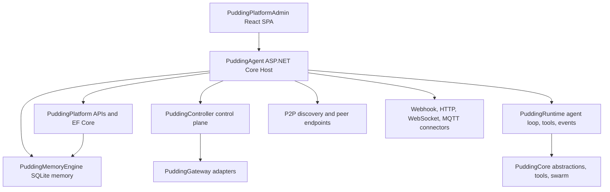

# PuddingAgent 当前项目架构审计报告

审计日期：2026-05-18  
审计范围：仓库根目录、`Source/`、`Docs/`、`TestScripts/`、部署与前端工程配置  
审计目标：评估当前架构是否支撑“单进程、零外部基础设施、P2P Agent”的产品定位，并识别近期应优先处理的工程风险。

## 结论摘要

当前代码库已经形成了较完整的 Agent 平台能力：主程序 `PuddingAgent` 承载 ASP.NET Core 宿主、Controller、Runtime、MemoryEngine、Platform API、连接器、P2P、前端静态资源和 SQLite 数据库；测试项目覆盖 Core、MemoryEngine、WebApi；文档体系也比较充分。

但架构仍处于明显的迁移中段：文档宣称“单进程、无 PostgreSQL/Redis/MinIO/Nginx”，而项目引用和运行时注册仍保留旧平台化依赖与多模块耦合。主入口 `Source/PuddingAgent/Program.cs` 已经膨胀到约 939 行，前端聊天状态 Hook `useChatState.ts` 约 1340 行，二者都是当前架构复杂度最高的风险点。

综合评估：架构方向正确，但当前健康度为 **B-**。适合继续快速迭代，但不建议在未清理配置、测试和启动边界前宣称“可稳定交付”。

## 当前架构地图



主要项目边界：

| 项目 | 当前角色 | 观察 |
| --- | --- | --- |
| `Source/PuddingAgent` | 单进程宿主和产品入口 | 实际聚合了大部分能力，是正确的发布目标，但启动注册过重 |
| `Source/PuddingCore` | 抽象、模型、工具、Swarm 基础 | 边界相对健康，适合作为稳定内核 |
| `Source/PuddingRuntime` | Agent 执行、工具、事件、上下文、子代理 | 能力完整，但反向引用 Platform，降低可独立测试性 |
| `Source/PuddingPlatform` | 管理 API、EF Core 数据模型、MVC 视图 | 仍带平台化包袱，部分职责与 Agent 单进程定位重叠 |
| `Source/PuddingController` | 控制面、审计、路由、审批、知识/存储 | 保留了 Redis/PostgreSQL 依赖信号，与简化架构冲突 |
| `Source/PuddingMemoryEngine` | 会话、记忆、图书馆、FTS 检索 | 领域清晰，但当前测试暴露 FTS/Schema 兼容问题 |
| `Source/PuddingPlatformAdmin` | Ant Design Pro 管理端和聊天 UI | 功能密集，类型检查当前失败 |

## 主要发现

### P0：配置安全存在直接风险

根目录存在真实 `.env`，其中包含 LLM API Key、Endpoint、模型名和 JWT Key。`git ls-files` 显示 `.env` 当前未被 Git 跟踪，但 `.gitignore` 没有忽略 `.env`，后续极易误提交。

影响：

- API Key 和 JWT Key 有泄露风险。
- 本地、Docker、CI 的配置来源不统一。
- 生产环境安全依赖开发者手动记忆，风险不可接受。

建议：

1. 立即轮换当前 `.env` 中的 LLM API Key 和 JWT Key。
2. 在 `.gitignore` 增加 `.env`、`.env.*`，保留 `!.env.example`。
3. 将 `docker-compose.yml`、`appsettings`、`config/llm-config.json` 的配置优先级写入一份短 ADR。

### P0：当前测试健康度不足以支撑交付声明

本轮验证结果：

| 命令 | 结果 |
| --- | --- |
| `dotnet test PuddingAgentNetwork.slnx --no-restore --nologo` | 120 秒超时，无有效测试摘要 |
| `dotnet test Source\PuddingCoreTests\PuddingCoreTests.csproj --no-restore --nologo --logger "console;verbosity=minimal"` | 120 秒超时 |
| `dotnet test Source\PuddingMemoryEngineTests\PuddingMemoryEngineTests.csproj --no-restore --nologo --logger "console;verbosity=minimal"` | 失败：61 通过，3 失败 |
| `npm run tsc` in `Source/PuddingPlatformAdmin` | 失败：3 个 TypeScript 错误 |

MemoryEngine 失败集中在：

- `MemoryLibrary.SearchBooksFtsAsync` 读取 ordinal 8/9 时遇到 NULL。
- `MemoryLibrary.SearchChaptersFtsAsync` 读取 ordinal 9 时遇到 NULL。
- `MemoryLibraryConvenience.UpsertExperienceAsync` 依赖 FTS 搜索后连带失败。

前端类型失败集中在：

- `SubAgentIndicator.tsx`：`useEffect` 回调路径返回不一致。
- `SubAgentIndicator.tsx`：Ant Design `ModalProps` 不支持 `extra` 属性。
- `useChatState.ts`：事件类型收窄错误，联合类型被错误约束为 `"session.closed"`。

建议：

1. 先修复 MemoryEngine FTS NULL 读取，避免记忆图书馆检索在空字段或迁移字段下崩溃。
2. 修复前端 TypeScript 错误，把 `npm run tsc` 作为 PR 必跑门禁。
3. 拆分测试命令为 Core、Memory、WebApi、Frontend 四条 CI job，避免全量测试超时后没有定位信息。

### P1：目标架构与依赖图仍不一致

既有文档 `Docs/架构.md` 与 `Docs/07架构/01总览与分层.md` 明确写明当前方向是单进程、SQLite、无需 PostgreSQL/Redis/RabbitMQ/MinIO/Nginx。

但项目引用仍显示：

- `PuddingController.csproj` 引用 `Npgsql.EntityFrameworkCore.PostgreSQL` 和 `StackExchange.Redis`。
- `PuddingPlatform.csproj` 引用 `Microsoft.EntityFrameworkCore.SqlServer`、`Npgsql.EntityFrameworkCore.PostgreSQL` 和 `Minio`。
- `.env.example` 仍包含 `POSTGRES_PASSWORD`、`RABBITMQ_PASSWORD`、`MINIO_ROOT_USER`、`MINIO_ROOT_PASSWORD`。
- `docker-compose.yml` 已收敛为单服务，但环境变量仍保留 `Pudding__ControllerEndpoint` 与 `Pudding__RuntimeEndpoint` 这类旧分层命名。

影响：

- 新贡献者难以判断哪些依赖是必要能力，哪些是旧架构残留。
- 发布产物可能携带不必要依赖，增加供应链和升级成本。
- 文档和代码的差异会削弱架构决策的可信度。

建议：

1. 建立“允许的生产依赖白名单”：PuddingAgent、Core、Runtime、MemoryEngine、Platform 中哪些包允许进入发布。
2. 对 PostgreSQL、Redis、MinIO、SqlServer 依赖做引用链审查，能删除则删除，暂不能删除则标注为 legacy/compat。
3. 更新 `.env.example`，将旧多服务变量移入 `Docs/Archive` 或 legacy section。

### P1：启动入口承担过多组合根和业务初始化职责

`Source/PuddingAgent/Program.cs` 当前约 939 行，包含：

- Serilog 配置
- CORS/JWT/Session 配置
- Platform、Controller、Runtime、MemoryEngine、Connector、P2P、事件管道、Cron 的 DI 注册
- SQLite 初始化、补丁式 DDL、Capability seed、JSON seed
- 健康检查、Chat API、SPA fallback
- Connector ingress 到 InternalEventBus 的桥接逻辑

影响：

- 任何模块改动都容易触碰主入口，冲突概率高。
- 测试宿主需要大量替换服务，`CustomWebApplicationFactory` 已经体现出这一点。
- 难以区分“产品启动失败”“数据库迁移失败”“某个后台服务失败”。

建议：

按职责拆成扩展方法，不改变行为：

- `AddPuddingLogging`
- `AddPuddingAuth`
- `AddPuddingDataStores`
- `AddPuddingRuntime`
- `AddPuddingConnectors`
- `AddPuddingEventPipeline`
- `UsePuddingEndpoints`
- `InitializePuddingDatabasesAsync`

每个扩展方法配一个极小 smoke test，先压低未来改动风险。

### P1：Runtime 对 Platform 形成反向依赖

`PuddingRuntime.csproj` 引用 `PuddingPlatform.csproj`。从架构分层看，Runtime 应依赖 Core 抽象和 MemoryEngine 能力，不应依赖 Platform API/EF/MVC 方向的模块。

影响：

- Runtime 无法作为轻量执行内核独立复用。
- Platform 的数据库和 Web 包会被带入 Runtime 依赖闭包。
- 单元测试需要更多宿主配置，测试速度和稳定性下降。

建议：

1. 把 Runtime 需要的 DTO/接口下沉到 `PuddingCore/Platform` 或新建 `PuddingContracts`。
2. Platform 提供接口实现，Agent 组合根注入给 Runtime。
3. 拆出后运行 `dotnet test Source\PuddingMemoryEngineTests` 和 WebApi TestServer 验证。

### P1：前端聊天状态模块已经成为大对象

`Source/PuddingPlatformAdmin/src/pages/chat/hooks/useChatState.ts` 约 1340 行，管理 workspace、agent、session、message history、SSE、workspace notification、token cache、modal、CRUD、导出等多类职责。

影响：

- 类型错误已经出现在事件流分发附近，说明联合类型和状态迁移开始难以维护。
- UI 行为、网络订阅、缓存和业务转换强耦合，不利于局部测试。
- Chat 页继续扩展子代理、记忆、上下文固定时，回归成本会继续升高。

建议：

按稳定边界拆 Hook：

- `useWorkspaceAgents`
- `useSessionList`
- `useSessionEvents`
- `useWorkspaceNotifications`
- `useChatTurns`
- `useTokenUsage`

拆分顺序优先从 SSE/事件流开始，因为当前 TypeScript 错误就在该区域。

### P2：生成物、数据库和外部代码治理需要收紧

观察：

- `git ls-files` 显示 `pudding_platform.db` 和 `Source/PuddingPlatform/pudding_platform.db` 已被跟踪。
- `Source/PuddingPlatformAdmin/src/.umi` 与 `.umi-production` 存在于工作区，虽然未跟踪，但不在当前 `.gitignore` 明确规则中。
- `external/github.hyfree.GM` 在 `git status` 中呈现特殊状态，且解决方案直接引用其中项目。

影响：

- 数据库文件进入版本库会带来迁移漂移、测试污染和潜在数据泄露。
- 生成目录容易干扰搜索、类型检查和审计。
- external 依赖如果没有固定来源、许可证和升级策略，会形成供应链盲点。

建议：

1. 评估是否需要从 Git 中移除已跟踪 `.db`，改为 migration + seed 生成。
2. `.gitignore` 增加 `Source/PuddingPlatformAdmin/src/.umi/` 和 `.umi-production/`。
3. 为 `external/github.hyfree.GM` 增加 `Docs/07架构` ADR：来源、用途、许可证、升级方式、安全边界。

## 正向信号

- 产品定位清晰：README、`Docs/架构.md`、`Docs/07架构/01总览与分层.md` 都指向单进程 P2P Agent。
- 主发布路径明确：`PuddingAgent.csproj` 是实际聚合宿主，Dockerfile 也发布 `PuddingAgent.dll`。
- Core/Memory/WebApi 都已有测试项目，不是完全无测试状态。
- WebApi 测试使用 `WebApplicationFactory<Program>` 和 SQLite in-memory，方向正确。
- Connector、InternalEventBus、SessionStateManager、SubAgent、MemoryLibrary 等能力已经具备可演进的模块雏形。

## 建议的整改路线

### 第 1 阶段：止血，1 到 2 天

1. 轮换 `.env` 中的真实密钥，并补 `.gitignore`。
2. 修复 MemoryEngine 3 个失败测试。
3. 修复 `npm run tsc` 的 3 个前端类型错误。
4. 将全量测试拆成可独立运行的验证命令，并记录在 `Docs/QA/联调与端到端测试方案.md` 或新的 QA runbook。

### 第 2 阶段：稳定组合根，2 到 4 天

1. 拆分 `PuddingAgent/Program.cs` 为 DI 与 endpoint 扩展方法。
2. 把数据库初始化和 seed 迁移到显式 initializer，并让测试宿主可选择跳过后台服务。
3. 给 PuddingAgent 启动 smoke test 加断言：`/health`、静态资源、关键 API 路由、后台服务替换。

### 第 3 阶段：收敛架构边界，3 到 7 天

1. 消除 Runtime 对 Platform 的项目引用，以下沉接口替代。
2. 审查并删除或隔离 PostgreSQL、Redis、MinIO、SqlServer 遗留依赖。
3. 明确 `PuddingController` 是“进程内模块”还是“旧服务兼容层”，并在解决方案/命名中体现。

### 第 4 阶段：前端可维护性，3 到 5 天

1. 先拆 `useSessionEvents` 与 `useWorkspaceNotifications`。
2. 给事件归一化函数加纯函数单测。
3. 将子代理 UI 的状态模型与 API DTO 分离，避免组件直接承载协议兼容逻辑。

## 审计命令记录

```powershell
rg --files
git status --short
Get-Content PuddingAgentNetwork.slnx
Get-Content Docs\架构.md -TotalCount 260
Get-Content Docs\07架构\01总览与分层.md -TotalCount 260
Get-Content Source\PuddingAgent\PuddingAgent.csproj
Get-Content Source\PuddingAgent\Program.cs -TotalCount 520
Get-Content Source\PuddingAgent\Program.cs -Tail 260
dotnet --info
npm --version
dotnet test PuddingAgentNetwork.slnx --no-restore --nologo
dotnet test Source\PuddingCoreTests\PuddingCoreTests.csproj --no-restore --nologo --logger "console;verbosity=minimal"
dotnet test Source\PuddingMemoryEngineTests\PuddingMemoryEngineTests.csproj --no-restore --nologo --logger "console;verbosity=minimal"
npm run tsc
git ls-files .env .env.example pudding_platform.db Source\PuddingPlatform\pudding_platform.db
```

## 最终评估

PuddingAgent 的目标架构是有吸引力的：一个可双击运行、可 P2P 协作、带本地记忆的单进程 Agent。当前实现也已经具备这个方向的核心骨架。

真正需要警惕的是“平台时代的旧肌肉记忆”：旧依赖、旧命名、旧配置和过重组合根还在牵引系统。近期最值得投入的不是继续加新能力，而是让测试重新变绿、把启动边界拆清楚、把生产依赖和配置治理收紧。这样后续加连接器、子代理和记忆系统时，系统会明显更稳。
