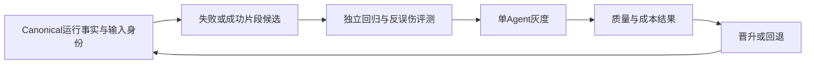

# PuddingAgent 夜间工作效率、缓存与 RSI 评估

结论：**这一夜的编码产出较高，DeepSeek 缓存已接近 99%；更明显的短板是任务身份与验收闭环、同目标失败止损，以及自改进评测的可信度。** 已有一项可量化的运行收益：后台 skip 汇总把对应写入行数降低了 99.66%。新增分类器等后半夜代码有测试产出，但尚未进入当前 Core，不能计作已上线能力。

本报告为只读评估。未修改产品源码、配置、运行数据库或任务状态，未调用模型、重跑测试或重启服务。仅新增报告、汇总数据和文档索引。

## 1. 窗口、来源和统计边界

- 固定窗口：北京时间 **2026-09-20 22:00:00 ≤ t < 2026-09-21 08:09:00**，共 10 小时 9 分；UTC 为 09-20 14:00 至 09-21 00:09。评估期间后续活动不滚入分母。
- 服务商账单：`E:/github/deepseek/usage_data_2026-09-15_2026-09-21.zip` 中 amount/cost CSV。按自然日聚合；21 日是导出时的未完整日，CSV 的 end_time 次日零点不是实际结算水位。ZIP 文件时间约 08:07，不据此假定请求级覆盖精确到该秒。
- 用量主账本：`D:/data/databases/pudding_platform.db` 的 `llm_gateway_usage_events`；归因为 `TokenUsageEvents`，不将两表相加。窗口内 2,410 条 Gateway 记录均按 session/provider/model/input/output/hit/miss 七元组唯一匹配归因；这是内容关联，不是共享 requestId。
- 查询使用 SQLite `mode=ro`、`query_only`、时间索引及查询限时。用量/归因/层指标在同一读取事务取出；任务、事件、运行进程和 Git 是独立读取，非跨源原子快照。时间列混有空格和 `T` 格式，任务查询分别取范围并归一 UTC。
- Gateway 指标仅覆盖有 usage 的 Core 调用，不能保证包含中途取消、未回 usage、独立测试探针或其他客户端的所有服务商请求。
- Git 按窗口内提交时间统计，窗口最后提交为 `a375de5`（08:06:14）；08:10 后的三个文档提交不算入 82 个提交。源码落点另外于取证时核对。
- 可复核聚合：[metrics.json](PuddingAgent夜间效率与RSI评估-2026-09-21.metrics.json)。原始会话、账单行和临时查询保留在 ignore 的 `temp/overnight-*`，不提交正文或凭据。

## 2. 模型用量、缓存和费用

缓存统一采用 `sum(hit) / sum(hit + miss)`，不平均每次调用的百分比。当前窗口两者之和与 prompt_tokens 一致。

| 模型 | 调用记录 | 输入 tokens | 输出 tokens | 未命中 tokens | 加权命中率 |
|---|---:|---:|---:|---:|---:|
| DeepSeek Flash | 1,498 | 251,924,622 | 1,532,002 | 4,862,606 | **98.0698%** |
| GLM-5.3-Flash | 912 | 95,337,445 | 743,665 | 5,892,325 | **93.8195%** |
| 合计 | **2,410** | **347,262,067** | **2,275,667** | **10,754,931** | **96.9029%** |

调用构成完整相加为 2,410：主 Agent 1,032、子代理 1,291、上下文摘要 17、记忆相关 70。GLM 的 912 次均为子代理；另有 379 次 DeepSeek 子代理调用。不能用两个模型的原始命中率直接评价模型优劣，它们承担的任务和会话长度不同。

### 2.1 费用不能直接取本地 TotalCost

账单在 20 日和 21 日列出的 DeepSeek 单价相同：命中输入 ¥0.02/M、未命中输入 ¥1/M、输出 ¥4/M。本地 Gateway 相应记录使用 ¥0.04/M、¥2/M、¥8/M，因此本窗口本地 **31.86370864** 是按双倍单价算出的数值。

以账单单价对精确窗口的本地 token 重算，DeepSeek 估算为 **¥15.93185432**，其中命中输入 ¥4.94124032、未命中输入 ¥4.862606、输出 ¥6.128008。**这是重估，不是供应商针对这 10 小时的已结算金额。**

| 对账范围 | 服务商账单 | 本地 Gateway | 差异解释边界 |
|---|---|---|---|
| 9月20日完整自然日 | 2,058 次；¥27.76989092；命中96.5783% | 2,050 次；账单单价重算¥27.13794108 | 缺8次记录或其他归集差异；不能宣称完全对账 |
| 9月21日未完整日 | 导出时1,031次；¥11.04329796；命中98.1469% | 截至08:09有1,040次；重算¥11.04147636 | 导出水位不同，hit/miss差异也非单纯尾部增加；金额接近不能证明逐请求一致 |

GLM 本地计价值为 **98.312105**，本轮没有 GLM 账单和有效优惠证据，不能把它叫实际费用，更不能将其与 DeepSeek 的重估金额相加后声称是总账单。独立 Jev/Live 探针的外部调用成本也未在此得到全面核验。

代码原因明确：`Source/PuddingPlatform/Services/LlmGatewayUsageRecorder.cs:54–66` 从当前模型配置取静态单价后 Normalize，未按请求发生时的有效价格冻结账本。建议复用既有时段政策，新增请求级有效价格解析（拟议 `EffectiveLlmPriceResolver`），冻结 currency、unit、priceProfileVersion、effectiveAt、discount、priceSource。先用 20/21 日账单回放核对，保留原 usage，不能覆盖原始事实或将缺价格当零费用。

### 2.2 缓存问题已收敛到具体来源

| DeepSeek 分组 | 调用 | 命中率 | miss tokens | 含义 |
|---|---:|---:|---:|---|
| 未标注变化原因的普通 Agent 请求 | 1,389 | **99.3214%** | 1,654,373 | 可说明常规请求已很高；未标注不等于证明最终字节完全不变 |
| 压缩后的首轮 checkpoint | 17 | **21.5708%** | **1,983,982** | 占全部 DeepSeek miss 的 **40.80%** |
| 保存记忆的语义去重 | 68 | **0%** | **956,558** | 占 DeepSeek miss 的 **19.67%**；平均每次约14,067输入 |
| 生成压缩摘要的 replay | 17 | **96.1293%** | 168,629 | 摘要请求本身大部分复用缓存 |
| 工具定义变化 | 3 | 33.1433% | 58,870 | 本夜主模型的这类问题已非最大来源 |

另有一次 session_rehydrated，miss 38,258；一次 history_anchor_changed，miss 1,516；两次 skill-consolidation 各 miss210。上述分组与未标注普通请求构成 DeepSeek 全部 miss。

GLM 工具变化标签有23次，命中0.9760%，贡献922,018 miss；16个子会话第一轮均未命中，合计347,005输入。其余大量 miss 仍未标注原因，不能全部归咎工具变化。应补最终请求首个变化段和变化偏移，再调整工具曝光；不能为了提高命中率一次性暴露所有工具。

源码与现象一致：`WarmPrefixCompaction.cs:89–118` 先复用原请求生成摘要，再把 checkpoint 插到 system 后，后续历史前缀自然改变。17次 checkpoint 的实际命中大致停在32K静态前缀；这能解释首轮变冷，**不能据此判定压缩触发错误**。建议在 `AgentExecutionService.TryWarmPrefixCompactionAsync:2037` 记录触发前后有效容量、保留段身份、摘要覆盖、后续N次成本，再比较不同保留窗口。不能单纯推迟压缩而牺牲上下文容量、工具对或信息完整性。

层指标本夜没有 system 静态层变化；主 Agent 81个工具在1,017次调用中保持稳定。`ToolDefinitionTokens`、`ToolResultTokens` 等本地估计与服务商 tokenizer 口径不同，只用于构成诊断，不能和真实 prompt_tokens 直接叠加或称为可节省 token。

即使假设 checkpoint 与记忆去重的所有 miss 都能变为 hit，以当前账单价计算的**理想节省上限约¥2.88**；这不是保证收益。优化重复执行、输出和任务闭环同样重要。

### 2.3 分时观察

下表为双模型合计；08时只有9分钟，不与完整小时直接比较吞吐。

| 北京时间小时 | 调用 | 输入M tokens | 命中率 |
|---|---:|---:|---:|
| 20日22时 | 334 | 51.840 | 97.708% |
| 20日23时 | 227 | 32.572 | 95.727% |
| 21日00时 | 185 | 29.096 | 97.466% |
| 21日01时 | 272 | 34.747 | 94.318% |
| 21日02时 | 359 | 51.835 | 96.599% |
| 21日03时 | 189 | 28.689 | 96.903% |
| 21日04时 | 384 | 46.393 | 97.515% |
| 21日05时 | 201 | 28.264 | 97.707% |
| 21日06时 | 100 | 16.529 | 97.768% |
| 21日07时 | 141 | 24.465 | 98.023% |
| 21日08:00–08:09 | 18 | 2.832 | 94.412% |

七天供应商日命中率依次95.8014%、95.8291%、96.7906%、96.2099%、97.0494%、96.5783%、98.1469%（末日未完整）。本窗口接近99%，仍不满足“七个完整自然日持续>99%”验收。

## 3. 实际产出与交付闭环

### 3.1 编码产出真实，但提交数不是任务完成数

窗口内82个提交、83个不同文件：29个涉及产品代码/配置，20个仅测试/测试工具，33个纯文档。累计增删行约产品7,356、测试8,357、文档1,645、脚本281，是 churn，不是净新增。

主要交付：

1. `d401879c`：Agent 的 Goal 生命周期工具与宿主适配，落点 `GoalLifecycleTools.cs` / `GoalLifecycleService.cs`。
2. `114bbe86`、`b0b5f049`、`392c4fc5`：Jev 决策服务、配置与资源池接线，落点 `JevDecisionService.cs` / `JevDecisionOptionsProvider.cs`。
3. `57863dc4`、`19bfd5f2`、`efa83cda` 等：分类器准入、规则策展与管理，落点 `ClassificationRuleCurator.cs`、`ToolCallClassifierPipeline.cs`、`ClassifierToolApprovalReviewer.cs`。
4. `2cf1c9de`、`a1a526b0`、`169e8d26`：审批门户与临时完全访问接线；后续修复 Jev choice 请求缺 Instructions。
5. 健康 API/前端提示、审计 wire 和异常记录、菜单 hdd/key 图标等实际修复。前端红测试17→3有真实改善，但大部分属于过时测试修正/超时调整，不全是新增产品能力。

纯文档提交占40.2%并不等于40.2%的时间或费用浪费。文档包含必要设计与部署核查；但部署手册反复改10次、规格改16次，适合用结构化证据一次汇总，避免相同源码身份下反复要求模型全文复核。已验证的原子代码仍按仓库纪律及时提交。

### 3.2 自主工作路径与 Task/Goal 统计脱节

窗口新建主会话命令92条：**66 heartbeat、19 subagent_result、7 user/unlabeled**；另有21:59:42跨入窗口的用户命令，重叠窗口共93条，91 succeeded/2 failed。最后user/unlabeled为23:35:13，此后由心跳和子代理结果持续推进。

主工具 `goal_update` 81次、`sleep` 82次，分别更新 Agent 私有 goal.md 和心跳偏好，**不是81/82次平台 Goal 迭代**。平台 Goal、iteration、check 在本窗口均无新增或更新。

Task 只有3条事件：22:36:25降噪卡 `06898d5dfe004c69ab6d5baf18b2674a` 被置Blocked；23:55创建缺陷 `c426c2fe7e9349a1963f00c3d90be4a2`；00:14将该缺陷Cancelled，实际修复提交为 `1a5293f2`。没有Completed事件。123次 scheduler scan 均0候选/0启动，不能把本夜代码产出计为调度器成功派发的任务。

降噪卡的身份链：assignment=`7174df160d5d43f58acd43af326c21d3`，binding session正确但execution_id为空；delivery=`878df62fd9911d19bfc26aa70249cdbe` 已delivered但claimed_by_execution_id为空。21:50 accepted、21:54 progressed，22:36被 `execution_claim_orphaned` 收口。`LegacyTaskExecutionProbe.cs:70–77` 找不到canonical run，`TaskExecutionRepairCoordinator.cs:212–224` 清认领并置Blocked；`TaskAgentCommandService.cs:623–648` 仅在调用方提供executionId时回填。

这说明执行身份链不足，不能简单解释为Agent没工作。应在受理/认领事务绑定command/run身份，以明确结果关闭Task；不能仅凭会话活跃无限延租，也不能用文档或commit自动宣布业务完成。

19条子代理结果的父命令均成功；另有reply_projection的target unavailable，属于回投目标投影，不等于父代理没有收到结果。适合独立修正回执路由和指标。

### 3.3 一项已上线收益，以及一项未上线边界

取证时 Core **PID31188，启动于20日23:32:34**。较早的降噪提交 `8377491` 写于21:54:33（窗口外），在本窗口重启后实际生效：旧skip明细最后23:32:12；23:35–08:05的**103条summary汇总15,265次skip**。按旧双写等价30,530行，实际103行，**下降99.66%**。这证明C1–C3运行生效；两秒IdlePollDelay仍在 `SubconsciousWorkerService.cs:18/107/133`，C4及12小时CPU/IO验收未完成，不能推算CPU也下降99.66%。原卡“未部署”进度已陈旧。

后半夜分类器尚未进入该进程：运行Runtime.dll为23:32:26版本，SHA256 `F7E50D0846D7C89C5D34063A41666B98DCAB997032E9CF7F5C76F4F5980B9965`；测试构建08:05:46版本为 `37D0726F9CDE33E055185BB5ADE18ECD6684FB22A1839D1ED4AF70BC70100454`。源码Reviewer为classifier，运行目录仍llm。[部署手册](../安全分类器部署与回滚运行手册-2026-09-21.md)也明确未部署；独立Live探针2/2不能代替加载验证。

## 4. 低效行为：区分可证实浪费和必要调试

主会话1,366次工具请求、18条失败回执；子代理21个Run，16 completed/5 failed，1,291模型轮、1,706次工具调用（1,662 completed、44 failed）。主/子共226次terminal_wait。失败工具统计不包括wait成功但内部命令失败，不能当全口径任务失败率。

### 4.1 高命中率也可能伴随低效

`run_20260920_204757_6d202060f56f` 的任务只是归因17个前端红测试，却耗14分25秒、**188模型轮、187次canonical工具请求**，输入20,523,642 tokens；命中率**99.2373%**，DeepSeek按账单价折算约¥0.93。它最终被标failed，却给出了有效归因报告，因此不能将全部成本计为浪费，也不能将预期红测exit1直接视为任务验收失败。

明确可优化部分在04:49:49–04:52:02：围绕同一 `src/pages/workspace/[id]` 历史，round36–68出现23条Shell变体，反复调整literal pathspec、glob、ls-files、ls-tree、findstr；还有读取未生成的grep_revs.txt。只按完全相同命令hash去重会漏掉这种循环。

另一个子Run `run_20260920_181254_8088c1bccfed` 两次向不存在的 `Source/PuddingCode` 搜索，仅换query；主代理22:30也已遇到同路径错误。`FailedToolCallTracker.cs:15` 的canonicalCallKey不能代表“同一目标+同一根因”。

五个终态failed子Run合计410调用、40,967,055输入，说明需要重点回看；因有诊断任务及有效产物，**不将这4,097万tokens直接称为可节省量**。

### 4.2 Wait 的问题是日志截断，不是所有轮询都无效

主52次wait中14次截断、9次返回Running；子174次wait的预览中至少82次截断、55次Running。`TerminalTools.cs:271` 在snapshot.Truncated时返回。示例job=`bc41bba76c0e`：420/420/300秒wait被日志预览上限提前打断，第三次才得到测试结果。

建议把日志展示预算与等待退出条件分离：持续排空/保留完整日志、只给有限预览，以退出/明确失败/超时唤醒。不能删除必要输出，也不能忽视测试失败信号。

反误伤样本：07:04–07:06同一InputArea测试重跑四次，中间每次均有补丁且失败推进，属于正常调试，应允许继续。复用测试结果必须绑定源码/依赖/工具链/命令指纹；不能仅按命令字面缓存。

## 5. RSI：可以做，但闭环必须有可信判据

本报告的RSI指“收集运行证据→生成策略/Skill/代码候选→独立评测→小范围启用→验证收益→继续改进”，不指模型权重已经递归提升。

### 5.1 当前实绩

主Agent主动save_memory 68次，分布于63个Turn；不能与后台自进化混称。后台skill.improve两次、auto_dream一次均completed，但operationCount均0；improve evaluated/patched/consolidated均0，窗口内没有新建skill.extract_patterns。两次skill-consolidation仍产生8,530输入与19,962/16,559输出，约80/68秒；应记录候选集与策略的input hash，内容/证据未变化时复用“无需操作”的判定。相同token数本身不足以证明内容相同。

已有版本、轨迹去重和禁用基础，后半夜又新增 `ClassificationRuleCurator` 等能力，具备工程自改进底座；本窗口尚无“自动Skill晋升且产品收益成立”的证据。

### 5.2 先修评测门禁，避免优化错误指标

原始日志：Core910通过/1失败；Runtime1659/0；Platform1363/0；Admin1349/3；WebApi因MSB3027文件锁未执行。**不是全套全绿。**

当前 `TestScripts/test-pudding-suite-gates.ps1` 有两项可直接从代码核实的缺口：

- Admin KnownRed=null、AllowedFailures=3（约86–88行）：只按失败数量。修一个旧红、引入一个新回归，总数未增也可能PASS。
- 167行默认UNMEASURED，192/202–203行只将FAIL映射为非零退出：必测SKIPPED_LOCKED/UNMEASURED仍可能exit0。

优先改为具体case身份与输入指纹，必测未测/构建失败返回非零；使用TRX/Jest JSON而非仅正则抓末尾数字。增加“旧红减少但新红增加”“全部未测”“日志没有统计”“命令非零但有旧统计”负例。Skill或规则候选不得修改评测标准来通过自己的晋升。

### 5.3 四个适合优先落地的小闭环

| 候选 | 代码级方案 | 评测和晋升标准 |
|---|---|---|
| 同目标失败止损 | 在FailedToolCallTracker旁增加标准目标/错误族/输入身份的失败episode；路径不存在、产物未生成先返回确定性纠偏。新证据或文件变化才重置；先shadow | 用本夜路径变体作负例、补丁后重测作正例；减少无进展调用且不误拦合法修复。保护审批与权限边界 |
| 测试证据复用、终端日志聚合 | TerminalTools/TerminalProcessManager记录command、source/dependency/toolchain指纹、exit和case集合；同指纹复用可重复测试结果；排空日志不因预览截断唤醒模型 | 新补丁必须失效缓存；Live/副作用命令不复用；比较工具往返、耗时和错误检测完整性 |
| 记忆写入质量与前缀 | `MemoryLibraryConvenience.cs:173–206` 当前同Agent按ChapterOrder取前20章，incoming还排在候选之前。先按相关性选择小候选，再稳定排序/版本化候选快照，把incoming放尾部 | 同时测候选召回、新增事实保留、错误覆盖、成本。只交换字段可能改善缓存，却不能修复候选召回。保留Chapter旧版与来源 |
| 从恢复片段生成Skill | 为ConversationSkillEvolutionTrajectorySource新增隔离的“失败→纠偏→验证”片段源；收集subagent.tool事件；复用AgentSkillEvolutionStore、BenchmarkEvaluationService晋升版本 | 当前成功轨迹门禁会排除含失败工具的整条轨迹，不能直接放宽它。候选默认禁用、隔离重放、单Agent灰度；质量不退化后才比较成本/耗时；可回退旧版 |

需要额外保护来源：07:09:28的canonical goal_update却写“15:10 BJT”，存在二次时区换算。经验必须绑定canonical时间、Turn、Run、源码身份和检查证据，不能用模型写的便条日期当事实。评测样本标记excludeFromLearning，避免评测内容反复进入训练/技能轨迹。分类器涉及审批，不以减少拒绝数作为成功指标，不自动学习扩大权限。

## 6. 建议施工次序与验收

1. **P0 评测门禁可信化**：失败case身份、必测未测失败、机器可读证据、禁止候选改自己的验收线。无需调用模型即可测试。
2. **P1 Task执行身份与交付登记**：修复command/run绑定，区分源码/部署/产品验收；对账降噪卡，保留其未完成C4，不重新开发已部署C1–C3。
3. **P1 同目标失败episode和恢复片段学习**：先用已有23条Shell变体与不存在目录样本做离线回放，再单Agent灰度。
4. **P1 价格与usage对账**：本地静态价格不能支撑精确费用预算和路由比较；先补有效价格快照及GLM账单覆盖，再谈低成本模型选择。
5. **P2 记忆候选/输入顺序、压缩经济性、Wait与测试复用**：分别做对照，不一次改变所有变量。减少miss与减少有效信息是不同指标。

评价下一夜使用：通过业务验收的工作单元数、实际部署数、修复恢复成功率、每个通过单元的费用/耗时/工具数、无进展调用率、缓存miss来源、未测/未知比例。82个提交、99%缓存、后台job completed都不能单独证明递归自改进成功。
