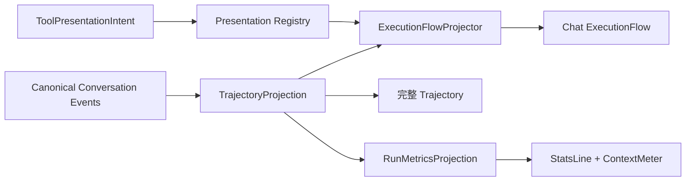

# PuddingAgent 消息、推理与工具调用 UI 对齐方案

> 日期：2026-08-14
> 复核日期：2026-08-17
> 状态：设计修订完成；已完成实现差距复核，等待按纵向切片实施
> 参考实现：`E:\github\deepseek\deepseek-harness\packages\client`
> Pudding 基线：`Source/PuddingPlatformAdmin/src/pages/chat`
> 关联基线：`Docs/message-card-ui-design-2026-08-13.md`

## 1. 结论

PuddingAgent 不复制 deepseek-harness 的品牌外观，而采用它已经验证过的**行式执行流信息架构**：消息正文保持 Pudding 的暖色气泡和头像体系；推理、工具调用、错误与运行状态统一为紧凑、可展开、可审计的行。

本方案确定六项核心改造：

1. 主代理运行过程统一为 `ReasoningRow + ToolCallRow + DelegationRow`，按真实发生顺序插入消息卡片，不再依赖多个互相竞争的运行面板。
2. 推理行折叠时展示真实 reasoning 的首行或最新一行，展开后展示该事件携带的完整可审计文本；没有 reasoning 事件时只显示运行状态，不生成“复杂推理”伪内容。
3. 工具调用按稳定 `toolCallId` 配对输入与结果，折叠态显示工具名、摘要与状态，展开态显示结构化 `IN/OUT`；失败首行直接成为红色摘要。
4. 主消息只展示“主代理正在委派/等待子代理”的父级事实；子代理内部推理和工具轨迹继续由右侧运行坞及检查器承载，避免重复渲染。
5. bootstrap、gap recovery 与实时 SSE 必须先进入同一个 `ExecutionFlowProjector`；React 组件不再生成事件 ID、时间戳、顺序或业务终态。
6. 工具展示由现有 `ToolPresentationIntent` 决定，前端通过最小 Presentation Registry 选择 renderer；禁止继续按 `toolName` 猜测卡片类型。

## 2. 参考实现证据

| 能力 | deepseek-harness 源码 | 可采用的设计决策 |
|---|---|---|
| 状态语义 | `ui-primitives/src/StateDot.tsx`、`StateDot.module.css` | `done/warning/ongoing/error` 四态，颜色 token 化，状态点与可访问文本分离 |
| 统一折叠行 | `ui-primitives/src/DisclosureRow.tsx` | 24px 行式 chrome，整行可点击，支持 Enter/Space，图标与 chevron 占位稳定 |
| 推理展示 | `ui-conversation/src/client/chat/ReasoningRow.tsx` | 运行中折叠摘要取最新行，完成后取首行；展开显示完整 reasoning；运行中摘要自动跟随末尾 |
| Turn 运行态 | `ui-conversation/src/client/chat/ChatView.tsx:98-135,401-403` | 一条 turn-level 状态贯穿首 token、工具执行和流式输出，15 秒后才显示计时 |
| 工具调用 | `ui-tool/src/client/tool/components/ToolRow.tsx` | 单行摘要、整行展开、错误摘要优先、结构化 IN/OUT、状态替换 leading 图标 |
| 调用树 | `ui-tool/src/client/tool/ToolCallTree.tsx` | 以 `callId` 为锚点组织调用及子调用，不依赖展示顺序猜测配对 |
| 错误/重试 | `ui-conversation/src/client/chat/MessageItem.tsx` | 错误使用状态点+摘要行；重试详情可展开，不把整张消息卡染红 |
| 代码输出 | `ui-primitives/src/markdown/CodeBlock.tsx` | 统一代码表面、sticky 语言/复制栏、复制成功反馈 |
| 消息操作 | `ui-conversation/src/client/chat/MessageIconActions.tsx` | 时钟、复制、分支等使用同一紧凑操作行；复制防重入并短时反馈 |
| 会话统计 | `ui-conversation/src/client/chat/StatsLine.tsx` | 只显示有数据的统计组，数据来自 durable projection，刷新后不归零 |

## 3. Pudding 当前基线

### 3.1 已经完成，直接保留

以下能力已经落地，不再作为新施工项：

- `StateDot.tsx` 已提供四态状态点和 ongoing 像素动画。
- `AgentMessageBubble.tsx` 已提供错误摘要行、完整错误 tooltip 和同行重试入口。
- `MarkdownBlock.tsx` 已提供深色代码表面、sticky banner、语言标签与复制成功反馈。
- `MessageActions.tsx` 已提供复制成功反馈、朗读、重试、固定和删除动作。
- `TimelineItem` 和 `ProcessSummaryItem` 已贯通 `toolCallId`；`ToolCallRow.tsx` 已能按 ID 精确配对乱序到达的 call/result。
- `ReasoningPreview.tsx` 已具备“运行中取最新行、落定后取首行”的基础摘要能力。
- `MessageProcessSummary.tsx` 已支持推理/工具事件、三种 transcript mode、历史详情按需加载；其中可复用的格式化和按需加载能力保留，但该组件不再作为第二套执行流 UI。
- `SubAgentActivityDock.tsx` 已能用实时事件与 run archive 恢复子代理时间线。
- 消息列表已经具备虚拟化、稳定行 memo、流式正文轻量 fallback 和按需 Markdown。
- Core 已定义 `ToolPresentationIntentKind` 与 `ToolPresentationIntent`，覆盖 `generic/terminal/diff/search/read/web/delegation/job`；前端尚未消费。

### 3.2 当前主要问题

| 问题 | 当前表现 | 目标表现 |
|---|---|---|
| 首 token 前信息层级过多 | WaitingBubble、CurrentActivity、ReasoningPreview、过程摘要可能并存 | 一条 TurnStatus + 当前执行流，避免多个“正在运行”卡片 |
| 推理只在首 token 前可见 | `AgentMessageBubble` 用 `isBeforeFirstToken` 门控 `ReasoningPreview`；正文开始后推理行退出主视图 | reasoning 在整个 turn 内保持同一行，运行中增长、落定后可审计 |
| 工具与消息顺序断裂 | `ToolCallRowList` 固定渲染在回答正文之后，无法表达 reasoning → tool → message 的实际顺序 | `ExecutionFlowProjector` 输出有序 node，Chat 与 Trajectory 复用 |
| 过程 UI 重复 | `ToolCallRowList` 与 `MessageProcessSummary` 同时解释相同工具/推理事件 | 主路径只保留 `ExecutionFlow`；摘要模式是同一 ViewModel 的密度选择 |
| canonical 事件被降级 | `api.ts` 将新事件名映射回 legacy 名称；hook 使用 `createId()`/`Date.now()` 重造展示事实 | 前端保留 eventId/sequence/occurredAt，删除 legacy 映射与本地事实生成 |
| 工具展示没有插件化 | Core 已有 `ToolPresentationIntent`，但前端仍从参数文本自行概括 | intent 随事件/归档持久化，renderer registry 按 `presentation.kind` 分派 |
| 委派状态与子代理详情边界不够直观 | 主消息提示去托盘，但父级操作不易展开 | 主消息显示 DelegationRow，右侧检查器显示子代理内部事件 |
| 历史与实时可能使用不同 UI | 实时过程与历史 summary/detail 路径不同 | 同一 ViewModel、同一 Row 组件，数据源不同但呈现一致 |
| 完整轨迹缺失 | 当前只有 Chat 摘要和子代理 Drawer，没有可搜索、可缩放的统一 ledger | 独立 Chat/Trajectory 视图，工具行可按 callId 深链 |

## 4. 目标信息架构

### 4.1 Assistant 消息结构

```text
头像  Agent 名称  时间
┌─────────────────────────────────────────────┐
│ [TurnStatus] 正在运行 · 1m 24s              │ 仅运行中
│                                             │
│ ▸ 思考 · 正在核对调用结果……                 │ ReasoningRow
│ ▸ shell · git status                 已完成 │ ToolCallRow
│ ▾ file_patch · 修改 2 个文件          失败 │ ToolCallRow
│   IN   { patch... }                          │
│   OUT  apply_patch verification failed      │
│ ▸ 子代理 · 1 个运行中                        │ DelegationRow
│                                             │
│ 最终回答 Markdown                            │ Answer body
│                                             │
│ 6 轮 · 12 工具 · 3m01s    [复制][重试][朗读] │ Stats + actions
└─────────────────────────────────────────────┘
```

显示顺序固定为：

1. 运行态 `TurnStatus`；
2. 按事件顺序排列的推理、工具和委派行；
3. 最终回答；
4. 错误/截断等终态通知；
5. 统计与消息操作。

运行过程与最终回答属于同一个 assistant turn，不能再创建独立“运行中消息”占位。回答开始流式输出后，TurnStatus 仍可保留到 turn 终态，但不重复显示“等待首个事件”。

### 4.2 三层信息密度

| 层级 | 默认内容 | 用户动作 |
|---|---|---|
| L0 状态 | `正在运行`、已等待时间、当前阶段 | 无需展开 |
| L1 执行流 | reasoning/tool/delegation 单行摘要 | 点击整行展开 |
| L2 审计详情 | 完整 reasoning、工具 IN/OUT、Call ID、诊断入口 | 复制、打开运行检查器 |

普通模式显示 L0+L1；详细模式默认展开 L2；摘要模式只显示 L0 和聚合统计。现有 `TranscriptModeSwitch` 继续作为三层密度控制入口。

### 4.3 单一数据路径



边界要求：

- 服务端 Projection 负责 durable replay、分页、cursor、gap recovery 和业务终态；
- `ExecutionFlowProjector` 是前端纯函数，只把冻结 DTO 投影为行式 ViewModel；
- Chat、Trajectory、Inspector 使用同一组稳定 ID，不各自维护 reducer；
- `AgentMessageBubble` 只负责布局，不再解释低层事件或拼接调用结果；
- 完整子代理轨迹属于 child run，Chat 只消费 parent delegation 摘要。

## 5. 组件设计

### 5.1 `TurnStatus`

职责：表示整个主代理 turn 仍在进行，而不是猜测模型当前在“复杂推理”。

- 文案来自已知事实：`正在连接模型`、`正在推理`、`正在执行工具`、`正在等待子代理`、`正在生成回答`。
- 没有任何可见事件时显示 `默认助手正在运行`；不展示“复杂推理”“深入分析”等推断文案。
- 运行不足 15 秒不显示计时；达到 15 秒后显示基于持久化 turn start 的时间，刷新不归零。
- 只允许一个 `aria-live="polite"` 状态区域，避免屏幕阅读器重复播报。
- 终态到达后立即移除；错误由终态错误行负责展示。

替换范围：`WaitingBubble.tsx` 与 `CurrentActivityPanel` 的重复状态区域收敛为一个组件。

### 5.2 `ReasoningDisclosureRow`

职责：展示模型实际返回并进入事件流的 reasoning 文本。

折叠态：

- leading 使用思考图标；运行中附 `StateDot(ongoing)` 或轻量 sweep，完成后为中性色。
- 标题固定为“思考”。
- 运行中摘要取 reasoning 的最新非空行；完成后取第一条非空行。
- 单行截断，不增加消息高度；运行中内容增长时跟随摘要末尾。

展开态：

- 原样展示该 reasoning 事件携带的可审计文本，保留换行。
- 内容区最大高度 320px，超出内部滚动；提供复制按钮。
- 没有 reasoning payload 时不渲染此行，不用字符数或占位文案伪造内容。
- 相邻 reasoning delta 先在投影层按 block/event 合并，再交给组件；组件不自行猜测事件边界。

与当前实现的关系：`ReasoningPreview` 迁移为该行式组件；`MessageProcessSummary` 内已有 thinking 合并算法可以抽成共享 projector。

### 5.3 `ToolCallRow`

职责：将一次调用的开始、输入、结果和终态聚合成一个可审计单元。

折叠态布局：

```text
[状态/工具图标] 工具显示名  ·  参数/目标摘要       状态/耗时
```

- running：工具图标 + 轻量 sweep；done：工具图标或 `StateDot(done)`；failed：`StateDot(error)`；cancelled：`StateDot(warning)`。
- 成功摘要优先使用结构化 presenter，例如：
  - `shell`：命令首行；
  - `file_read`：相对路径和行范围；
  - `file_patch`：文件数与增删行；
  - `search`：查询词与命中数；
  - `web`：browser 动作与页面标题；
  - 其他工具：安全截断后的参数摘要。
- 失败时以错误首行替代参数摘要，使用 error token；完整错误仅在展开态显示。

展开态：

```text
IN   结构化参数 / 命令 / 请求
────────────────────────────
OUT  工具输出 / 错误 / exit code
```

- IN/OUT 各自最大高度 220px，独立滚动，保留等宽字体与复制入口。
- terminal、diff、read、search、web 可注册专用 presenter；未注册展示类型使用 Generic 文本/JSON presenter。
- “查看诊断”跳转到对应 call/run，不在主消息内加载完整诊断 Drawer。
- 超大输出只渲染 preview，并显示“查看完整输出”；禁止把完整输出直接挂在历史消息 DOM。

### 5.4 `ToolCallTree`

投影层必须按 `toolCallId` 配对：

```ts
interface ToolCallViewModel {
  callId: string;
  parentCallId?: string;
  name: string;
  title: string;
  state: 'running' | 'done' | 'failed' | 'cancelled';
  startedAt: number;
  completedAt?: number;
  inputPreview?: string;
  outputPreview?: string;
  errorPreview?: string;
  exitCode?: number;
  presentationKind: 'generic' | 'terminal' | 'diff' | 'read' | 'search' | 'web' | 'delegation' | 'job';
}
```

约束：

- `TimelineItem` 新增 `toolCallId?: string`、`parentToolCallId?: string`、`durationMs?: number`。
- Runtime/Conversation Event 已存在的 `tool_call_id` 必须穿透 DTO、bootstrap、gap replay、live SSE 与历史详情 API。
- `toolCallId` 是工具事件必填字段；缺失时记录协议错误并阻止该事件进入工具行，不建设旧事件展示分支。
- 子调用只在 `parentToolCallId` 明确存在时构成树；否则保持同级顺序。

### 5.5 `DelegationRow`

职责：在主消息中显示主代理的委派事实，不复制子代理内部过程。

- 折叠态：`子代理 · N 个运行中/已完成/失败`，显示最长运行时间。
- 展开态：每个子代理仅显示任务摘要、模型、状态和“打开检查器”。
- reasoning、tool input/output、完整结果由 `SubAgentActivityDock` 和运行检查器显示。
- 父 turn 完成后保留终态摘要；历史刷新后通过 canonical runId 恢复。

### 5.6 错误、输出上限与重试

- 错误继续使用已经落地的 `StateDot + 标题 + 摘要 + tooltip`，不扩大整卡红色面积。
- `max_output_tokens` 使用 warning 行：`已达到输出上限`，提供“继续”动作，不混同普通运行失败。
- 只有在后端提供 `attempt/maxAttempts/delayMs/deadline/retryState/error` 时才渲染 ModelRetryRow；禁止从错误文本正则猜测重试状态。
- 重试倒计时以服务端 deadline 为锚，刷新后不重置。

### 5.7 代码块和工具输出

沿用当前深色 `CodeBlock`，统一以下入口：

- Markdown 围栏；
- 工具 IN/OUT 中的代码/JSON；
- `run_code` 程序体；
- 诊断面板的原始片段。

专用 presenter 与通用 CodeBlock 的关系是互斥替换，不在同一展开体重复显示相同输出。

## 6. 视觉规范

| 项目 | 规范 |
|---|---|
| 行高 | 执行流 header 最小 28px；可点击区域最小 32px |
| leading | 16px 固定槽；状态点 10px，工具图标 14–16px |
| 标题 | 14px/22px，500–600 weight |
| 摘要 | 13px/20px，`--pudding-chat-text-secondary`，单行 ellipsis |
| 行间距 | 4px；同一 turn 内执行流形成一个垂直组 |
| 展开体 | 左缩进 22px；圆角 10px；使用 muted surface，不新增重阴影 |
| IN/OUT 标签 | 11px 等宽、uppercase、sticky；正文 12–13px 等宽 |
| 动效 | 同屏最多一个持续 sweep；其余状态静态；完整支持 `prefers-reduced-motion` |
| 主题 | 保留 Pudding 暖色表面；状态色只使用 `--pudding-status-*`；代码面使用 `--pudding-chat-code-bg` |

不采用 deepseek-harness 的品牌字体、图标造型、背景色和像素级间距原值；只复用信息层次、交互规律和状态语义。

### 6.1 Chat 页面密度

- Agent 已落定正文使用轻量、无重阴影的内容面，不再把长 Markdown 包成接近整栏宽度的厚重白卡；用户消息继续保留右侧气泡，以维持角色辨识。
- `TurnStatus`、reasoning、tool、delegation 与正文共享同一内容列和左边界，不在正文上下形成互相独立的大卡片。
- 消息最大阅读宽度与 Markdown 排版宽度一致；轨迹行摘要超长时单行 ellipsis，不通过扩大整条消息宽度解决。
- “普通/详细/摘要”只改变执行流密度，不改变事件集合、顺序或事实源。

### 6.2 Composer

- 第一层只放输入区；第二层左侧放 `StatsLine + ContextMeter`，右侧放运行模式、权限策略、语音和发送。
- 低频上下文、子代理、Auto-review 等选项进入一个可恢复设置 Popover，避免所有 tag 长期平铺在输入框下方。
- 上下文占用只在 `ContextMeter` 出现一次；StatsLine 不重复相同百分比。
- 任务看板是 workspace 控制面，入口保留在顶部 workspace header；不作为输入框下方的消息模式 tag。

## 7. 数据与状态契约

### 7.1 权威来源

| UI 信息 | 权威来源 |
|---|---|
| 主代理运行状态 | Conversation turn/run lifecycle |
| 主代理 reasoning | `thinking/reasoning` Conversation Event payload |
| 主代理工具 | tool started/completed/failed 事件，按 `toolCallId` 配对 |
| 子代理摘要 | parent delegation event + session sub-agent snapshot |
| 子代理内部轨迹 | canonical subagent event + run archive |
| 历史统计 | durable process summary / run manifest，不从当前 DOM 累计 |

执行流 DTO 的最小公共字段冻结为：

```ts
interface ExecutionEventDto {
  eventId: string;
  sequence: number;
  occurredAt: string;
  runId: string;
  turnId: string;
  step?: number;
  requestId?: string;
  type: string;
}

interface ToolExecutionEventDto extends ExecutionEventDto {
  toolCallId: string;
  parentToolCallId?: string;
  durationMs?: number;
  presentation: {
    kind: 'generic' | 'terminal' | 'diff' | 'search' | 'read' | 'web' | 'delegation' | 'job';
    meta?: Record<string, unknown>;
  };
}
```

`services/platform/api.ts` 不再把 canonical 类型映射为 `delta/thinking/tool_call/tool_result`。如果服务端缺少上述必需字段，应作为协议错误暴露并修复生产者，不在前端生成 fallback ID、时间或配对关系。

### 7.2 单调状态

- `running → done/failed/cancelled`，终态不得被迟到的 started/progress 事件降级。
- tool result 可能先于 started 经 gap replay 到达；projector 应创建占位调用并在 started 到达后补全。
- 同一 `eventId` 经 bootstrap、gap replay、live SSE 重复到达时只消费一次。
- 历史详情和实时事件必须走同一 `ExecutionFlowProjector`，不能维护两套展示模型。

## 8. 前端组件与文件规划

| 文件 | 设计动作 |
|---|---|
| `services/platform/api.ts` | 删除 `NEW_TO_LEGACY_EVENT`；保留 canonical envelope 的 eventId/sequence/occurredAt/ID 链 |
| `client/types.ts`、`types.ts` | 用冻结的 Execution/Trajectory DTO 替代前端本地事件事实；补 parentToolCallId/durationMs/presentation |
| `hooks/useSessionEventProjection.ts` | 只负责 Snapshot + Watch 输入协调；移除 `createId()`、`Date.now()` 和业务状态解释 |
| `projections/executionFlowProjector.ts` | 新建统一 reasoning/message/tool/delegation/retry/terminal ViewModel 投影 |
| `components/execution-flow/ExecutionDisclosureRow.tsx` | 新建共享行式折叠 chrome，支持键盘、固定 leading/chevron 布局 |
| `components/execution-flow/ReasoningDisclosureRow.tsx` | 由现有 `ReasoningPreview` 迁入，整个 turn 持续存在 |
| `components/execution-flow/ToolCallRow.tsx` | 迁移现有精确配对能力，改为消费 projector 输出和 presentation intent |
| `components/execution-flow/ToolCallTree.tsx` | 新建按 callId/parentCallId 组织的工具树 |
| `components/execution-flow/DelegationRow.tsx` | 新建父级委派摘要；详情跳转 child run/运行检查器 |
| `components/execution-flow/TurnStatus.tsx` | 收敛 WaitingBubble/CurrentActivity 的重复状态 |
| `presentation/PresentationRegistry.ts` | 最小 keyed registry；按 presentation.kind 选择 renderer，不按 toolName 分支 |
| `presentation/renderers/*` | built-in generic/terminal/diff/read/search/web/delegation/job renderer |
| `AgentMessageBubble.tsx` | 只负责组装 TurnStatus、执行流、回答、终态和 actions |
| `MessageProcessSummary.tsx` | 退出主消息生产路径；保留可复用格式化/历史按需加载后删除重复 UI |
| `process.styles.ts` | 新增执行流行、IN/OUT、tree indent 样式；继续使用现有 token |

## 9. 分阶段实施

### Phase 0 — P0：canonical 合同硬切

1. 冻结 `ExecutionEventDto`、工具 presentation 和稳定 ID 合同。
2. 删除 canonical → legacy 事件名映射。
3. bootstrap、gap recovery、live SSE 统一进入同一个 Projection 输入。
4. 禁止 hook/component 创建 eventId、occurredAt、sequence 或业务终态。

完成标准：同一份事件集经 bootstrap、gap replay、live SSE 任意组合后得到完全相同的排序、状态和工具配对。

### Phase A — P0：Chat 执行流纵向切片

1. 新建 `ExecutionDisclosureRow` 和 `TurnStatus`。
2. 将 `ReasoningPreview` 替换为 `ReasoningDisclosureRow`。
3. 建立 `ExecutionFlowProjector`，输出 reasoning/message/tool/delegation/retry/terminal 有序节点。
4. 迁移现有 `ToolCallRow` 的 callId 精确配对，增加 `parentToolCallId` 调用树。
5. 建立最小 `PresentationRegistry` 与 Generic renderer，先贯通 Core 已有 intent。
6. 主消息加入 `DelegationRow`，保持子代理详情不重复。
7. `MessageProcessSummary` 退出主路径，普通/详细/摘要成为同一 ViewModel 的密度选项。

完成标准：用户在一次运行中能持续看到真实推理摘要、当前工具、输入输出和委派状态，刷新后历史呈现一致。

预计工作量：8–12 人日，包含 DTO、projector、Chat 重构、定向测试和文档；不包含完整 Trajectory 页面。

### Phase B — P1：工具专用 presenter

1. terminal：命令、exit code、尾部输出。
2. diff/file_patch：文件列表、增删行、diff 预览。
3. file_read/search：路径、范围、命中摘要。
4. web：browser 动作、页面标题、目标摘要和截图入口。
5. 完整诊断通过 callId/runId 深链打开，不膨胀消息 DOM。

所有内置 presenter 都通过同一个 registry 注册；不存在 renderer 时使用 Generic。这里的 registry 是 TR-04 所需的最小前端分派能力，第三方动态贡献、卸载和跨表面生命周期属于 ADR-073 `PL-01`。

### Phase C — P2：统计与流式性能

1. 增加 turn-level duration、TTFT、tok/s、cache hit 统计行。
2. reasoning/markdown 采用稳定块 + 尾部增量解析，避免长回复全量重渲染。
3. StatsLine 只消费 durable projection；ContextMeter 独占上下文占用，避免同一事实出现两个位置。
4. 完成 500 Turn/2000+ 执行行的虚拟化、滚动锚定和 replay 一致性测试。

## 10. 验收矩阵

| 场景 | 必须满足 |
|---|---|
| 首事件未到达 | 只显示一个 TurnStatus，不出现伪造推理文本 |
| reasoning 流式增长 | 折叠行显示最新非空行；展开内容实时追加且不抢页面滚动 |
| reasoning 完成 | 摘要稳定为首行；刷新后内容与落定前一致 |
| 工具运行 | 一行显示工具名、参数摘要与 running 状态 |
| 工具成功 | 同一行变为 done，展开可看 IN/OUT，不新增第二条结果行 |
| 工具失败 | 错误首行替换参数摘要；完整错误在 OUT；支持复制 |
| 并发同名工具 | 依靠 toolCallId 正确配对，不串输出 |
| 事件缺少 callId | 作为协议错误记录并阻止错误配对；不创建 legacy 合并路径 |
| 调用子代理 | 主消息只显示 DelegationRow；子代理内部过程只在检查器 |
| 页面刷新 | 运行态、统计、工具配对和展开数据可从 durable projection 恢复 |
| 超长输出 | 默认 DOM 仅含 preview；完整内容按需加载 |
| 键盘操作 | 行可聚焦，Enter/Space 展开，焦点样式可见 |
| reduced motion | ongoing 状态仍可辨识，所有持续动画停止 |
| 手机/窄窗口 | 摘要单行截断，状态不挤出容器，展开体横向滚动 |

建议自动化覆盖：

- `ReasoningDisclosureRow.test.tsx`：running 最新行、completed 首行、无 payload 不渲染。
- `ToolCallRow.test.tsx`：四状态、IN/OUT、错误摘要、键盘展开、超长输出。
- `executionFlowProjector.test.ts`：bootstrap/gap/live 重放等价、乱序事件、重复 eventId、消息与工具顺序、parentToolCallId 树、终态单调。
- `AgentMessageBubble.test.tsx`：执行流顺序、主/子代理边界、首 token 前可见、回答落定后状态移除。
- `PresentationRegistry.test.tsx`：八类 intent、Generic 默认 renderer、实时/历史 renderer 一致。
- `MessageList`/viewport 定向测试：流式更新不导致历史行重渲染和滚动跳动。

## 11. 明确不做

- 不复制 deepseek-harness 的 CSS、品牌色、字体和图标资源。
- 不把子代理完整轨迹重新塞回主消息。
- 不在前端从自然语言错误中猜测 retry/attempt/deadline。
- 不将隐藏或不存在的模型思维链伪装成真实内容；仅展示系统实际收到并记录的 reasoning 字段。
- 不为旧事件设计兼容层；开发阶段采用一次性数据重建/迁移并删除旧 DTO，缺 callId 时记录协议错误。
- 不在常驻消息列表加载完整工具输出、完整诊断或完整子代理 archive。
- 不增加 Feedback、评分、点赞/点踩或偏好采集入口；本方案只处理运行事实的呈现与审计。

## 12. 最终落地顺序

`canonical DTO 硬切 → ExecutionFlowProjector → TurnStatus/ReasoningRow → 最小 PresentationRegistry → ToolCallTree → DelegationRow → 专用 presenter → Trajectory → StatsLine/ContextMeter`

前五项属于消息、思维链和工具调用模块内部的 P0 主路径，应作为同一设计切片完成；工具 presenter 和统计属于该模块的后续增强。

## 13. 产品级优先级说明

本文的 `P0/P1/P2` 只表示**消息轨迹模块内部依赖**，不再作为全产品施工顺序。产品级顺序以 [ADR-073 任务看板优先的 Agent 工作台、完整轨迹与实时指标施工方案](07架构/87ADR-073任务看板优先的Agent工作台轨迹与实时指标施工ADR.md) 为准：

1. 先完成五列 Task Board、真实 Agent 执行、结构化自动回写、失败/重开、会话深链和恢复；
2. 再完成 Auto、受限 Cron、Occurrence 和峰谷调度；
3. 随后施工本文的完整 reasoning/message/tool/subagent Trajectory；
4. 最后接入 TTFT、TPS、上下文、缓存和 Token 指标。

这个排序不改变本文内部的 `TurnStatus -> Reasoning -> toolCallId -> ToolCallRow -> DelegationRow` 依赖，只改变它相对任务看板和自动调度的产品交付批次。
