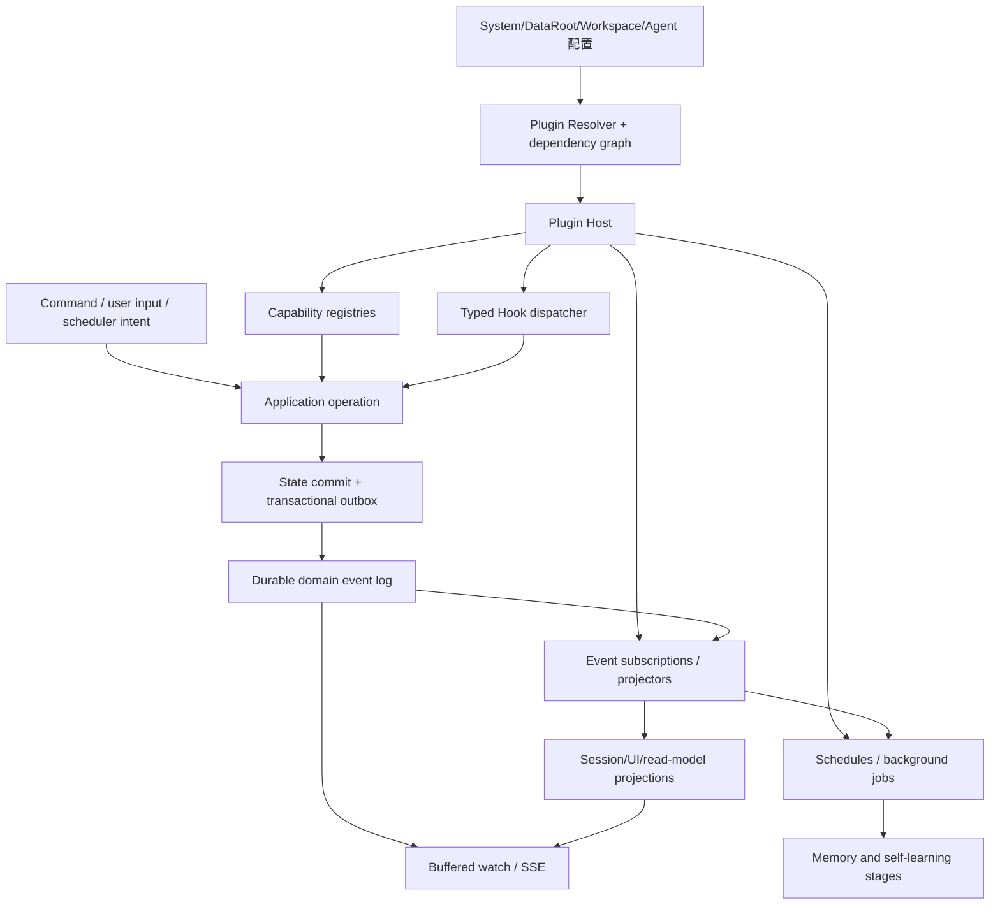
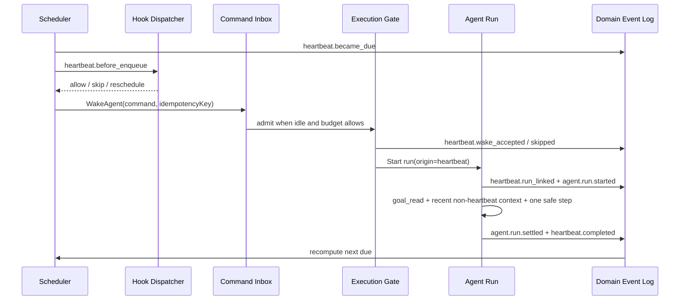

# PuddingAgent 插件、Hook、生命周期与事件驱动自学习架构方案

> 首次提出：2026-08-14
> 本次修订：2026-08-15
> 状态：Proposed
> 范围：Pudding Core/Runtime/Host/Platform/MemoryEngine/Admin 的插件组合、Typed Hook、持久事件、Agent FSM、函数图编排、心跳、Goal 与自学习闭环
> 参考实现：`E:\github\deepseek\deepseek-harness`、`E:\github\deepseek\pi`

## 1. 决策摘要

Pudding 应把现有“工具就是插件”的思路扩展为：**除最小 Microkernel 外，所有业务能力都是插件贡献项**。这同时包括标准 Profile 强制要求的 Model、Agent Loop、Session、Storage、Sandbox、Scheduler，也包括可选的 Tool、Skill、Prompt、Hook、事件订阅者、Connector、学习阶段和声明式 UI presentation。必需能力通过 composition validation 保证，不通过写死实现保证。

但“万物皆插件”不等于“万物皆事件”。目标架构必须分清三种协作机制：

1. **Capability/Service**：一个模块需要另一个模块提供明确能力时直接调用；用于强类型、可替换的同步协作。
2. **Hook**：在一次操作提交前或执行中允许多个插件按确定顺序参与决策、变换或包裹；可改变当前操作结果，必须同步、有界、可审计。
3. **Event**：状态提交后发布不可变事实；用于异步订阅、投影、通知、重放和自学习，订阅者不得回写过去。

本次修订进一步把协作合同补全为五类：**Command 表达意图，Function/Capability 执行工作，Hook 治理当前操作，Event 记录已提交事实，Projection 解释这些事实**。它们可以由同一个插件贡献，但不能因为“万物皆 Hook / Event”的口号而混成同一种调用协议。

Pudding 当前已经具备插件目录、工具 Registry、多个事件总线、SQLite 事件队列、HookPublisher、心跳编排和持久潜意识 Job。问题不是从零开始，而是这些能力的语义和生命周期尚未统一：

- `PluginManifestCatalog` 目前只接受至少一个工具，且 DLL 仍是 `ManifestOnly`；
- `HookPublisher` 实际发布异步 `InternalEvent`，不是可干预当前操作的 Hook dispatcher；
- `IInternalEventBus`、`IPriorityEventQueue`、`IStreamingEventBus`、`ICoordinationEventBus` 各自承担部分事件职责；
- `EventQueue` 是工作队列，不是可供新订阅者重放的领域事件日志；
- 心跳、Auto-Dream、经验提取和 Skill 改进仍各自持有定时/轮询逻辑；
- 会话、Run、Turn、工具、子代理、压缩和学习候选的状态边界没有一份统一的生命周期词典。

本方案的最终目标是：

```text
配置组合插件
  -> 插件提供能力、Hook、事件消费者、Job、Projection
  -> 业务操作经 Typed Hook 做同步决策
  -> 状态与 Domain Event 在提交点一起落盘
  -> 事件驱动 UI、心跳、潜意识和自学习
  -> 所有实时状态都能从 snapshot + durable facts 无缝恢复
```

## 2. 两个参考项目真正值得借鉴的部分

### 2.1 deepseek-harness：可组合能力，而不是巨型 Agent Loop

deepseek-harness 的关键不是 npm 包数量，而是 Cordis 提供的组合语义：

- 模型适配器、工具注册表、Session Log、Agent Loop 都是插件；
- 插件通过 Context 贡献服务、typed event 和可逆 effect；
- `inject` 声明必需服务，消费者在依赖不存在时保持 `PENDING`，而不是依赖配置文件顺序碰运气；
- 服务消失时，依赖它的插件会卸载，服务恢复后再重新激活；
- `ctx.on()`、registry registration、child plugin 和 `ctx.effect()` 都归属插件 fiber，卸载会清理注册、定时器、连接和子插件；
- 插件失败、加载中、活动、卸载和已释放有明确 fiber 状态；
- event 的 `emit/parallel/serial/bail/waterfall` 模式是事件合同的一部分，不把所有监听器当成同一种回调；
- 能力设计强调 Service Definition / Provider / Consumer 三个角色，消费者不应反向定义能力接口。

Pudding 应直接吸收以下原则：

1. 配置顺序不是依赖顺序；依赖图决定激活。
2. 每一项动态注册都必须有 owner 和 disposer。
3. reload 是“构建新快照、原子切换、排空旧实例、释放旧资源”，不是原地修改全局集合。
4. 插件提供能力，核心循环只保留稳定扩展点；新增行为优先作为插件，不继续扩大 Agent Loop。
5. 插件边界的可观测性至少包含状态、依赖、贡献项、激活版本、失败原因和 disposer 结果。

### 2.2 pi：生命周期 Hook 与普通扩展事件分层

pi 的 coding-agent extension API 把生命周期节点公开为有语义的 Hook：

- 启动：`project_trust -> session_start -> resources_discover`；
- 用户输入：`input -> before_agent_start -> agent_start`；
- 每轮：`turn_start -> context -> provider request/response -> tool lifecycle -> turn_end`；
- Agent：`agent_end` 后还可能 retry/compact/follow-up，真正无自动工作时才触发 `agent_settled`；
- Session：switch/fork/compact/tree 都有可取消或可自定义的 `before_*`，成功后才发完成事件；
- Tool：`tool_call` 可阻断，`tool_result` 可按顺序变换；
- `session_shutdown` 负责清理 session-scoped 资源，替换 Session 后扩展实例重建并重新收到 `session_start`。

pi 的新 Agent Harness 又进一步区分：

- Hooks：`before_run`、`before_resume`、`transform_context`、`before_request`、`before_tool`、`after_tool`、`before_compaction` 等；
- Events：`run_start`、`run_end` 等被动通知；
- Hook 调用本身进入 telemetry，带稳定 registration id 和 completed/skipped/blocked/failed outcome；
- 普通 `events.on()` 只监听未来事件，不保证 replay；需要当前状态时使用 `watch()`，先挂缓冲监听器、再捕获 snapshot、最后顺序冲刷缓冲，避免 snapshot 与 subscribe 之间的事件缺口。

Pudding 应吸收：

1. `agent_end` 与 `agent_settled` 必须分开；前者结束一次底层执行，后者表示 retry、compaction、follow-up 和子工作均已收敛。
2. Hook 是同步控制面，Event 是被动事实面；不能再把二者都叫 Hook。
3. 事件处理顺序、是否可阻断、是否可变换、失败时 fail-open/fail-closed 都必须写进合同。
4. Session reload/switch 会使 session-scoped 插件实例失效；资源必须在 shutdown 释放，在 start 恢复。
5. UI、检查器和状态 API 采用 snapshot + buffered watch，不能只订阅未来 SSE。

### 2.3 关于“pi 心跳”的证据边界

当前本地 `E:\github\deepseek\pi` 中，`heartbeat` 的代码命中主要属于 SQLite writer lease，并没有发现 Agent 自主心跳插件的成品实现。deepseek-harness Cordis 教程中的 `heartbeat` 也是演示 timer 如何作为 effect 随插件释放的示例。

因此本方案不声称“复制 pi 的 Agent 心跳实现”。真正借鉴的是：

- 用 session/plugin lifecycle 启停心跳资源；
- 用 `agent_settled` 作为安全的重新调度点；
- 用 before-run/context Hook 注入心跳上下文；
- 用被动事件记录心跳接受、跳过、运行、完成和下次计划。

## 3. 总体架构



### 3.1 第一原则：一切业务能力皆插件

DeepSeek Harness 最值得吸收的决定是：model adapter、tool registry、session log、agent loop 本身也都是插件。Pudding 不把“当前必需”误写成“内核不可替换”。以下能力全部通过插件提供：

- 模型与 LLM Adapter；
- Agent Loop 与 Inbox；
- Tool Registry、Tool Provider 与 Code Runtime；
- Skill Catalog 与 Skill Provider；
- Session Service、Session Log、Persistence 与 Query；
- Sandbox、Filesystem、Subprocess 与 Terminal；
- Storage Backend、typed domain form、Artifact/Spill；
- Job、Schedule、Heartbeat 与后台维护；
- Prompt、Context、Compaction、Goal、Subagent；
- Projection、Presentation、Connector 与 Learning。

标准产品可以要求某个 capability 必须存在，但必需 Provider 仍由 first-party plugin 交付和替换。缺失时 composition validation 失败，而不是把实现重新塞回内核。

### 3.2 最小内核

最小内核只保留安全组合插件所需的机制：

- bootstrap profile 定位、manifest parser、依赖/capability graph；
- 通用 Registry、Scope、不可变 snapshot 和原子 activation；
- effect/disposer、activation generation、drain 和 shutdown 顺序；
- Typed Hook、Domain Event、Stream Event 的基础合同与 dispatch 机制；
- 权限、审批、安全门和 Secret opaque handle；
- typed ID、trace、审计、单调 clock 和 Runtime Invariant Host。

内核不实现具体 Session Log、Storage、Scheduler、Sandbox、模型、工具或 Skill。bootstrap 阶段只读取“从哪里加载哪个 Profile/插件”以及信任根；普通业务配置在 Settings/Storage 插件激活后读取。

### 3.3 强制插件与 Capability Seam

| 插件族 | Definition | 标准 Provider | Consumer |
|---|---|---|---|
| LLM/Model | `ILlmRuntime`、`ILlmAdapter`、`IModelCatalog` | DeepSeek/OpenAI Adapter | Agent Loop、Compaction、ImageReader |
| Agent Loop | `IAgentRunner`、`IAgentInbox` | Default Agent Loop | Chat、Goal、Heartbeat、Subagent |
| Tools | `IToolCatalog`、`IToolExecutionPipeline` | Runtime Tool Registry + tool plugins | Agent Loop、Code Mode、UI |
| Skills | `ISkillCatalog`、`ISkillProvider` | Filesystem/Built-in Skill Provider | Prompt、Skill Tool、Learning |
| Session | `IAgentSessionLog`、`ISessionPersistence` | SQLite Session Plugin | Agent Loop、Projection、Fork、Query |
| Sandbox | `ISandboxProvider`、`IFileSystemProvider`、`ISubprocessProvider` | Windows Local/Restricted Provider | Shell、Terminal、Browser、LSP |
| Storage | `IStorageBackend`、typed domain form、`IArtifactStore` | SQLite/File Provider | Session、Memory、Settings、Jobs |
| Job/Schedule | `IJobRuntime`、`IScheduleRuntime` | Local Job + SQLite Schedule | Heartbeat、Learning、Maintenance |
| UI | `ISessionProjector<T>`、`IPresentationProvider` | Built-in Chat/Tool/Subagent projectors | SSE、Admin Workbench |

一个 seam 必须说明 Service Definition、至少一个 Provider 和 Consumer。只有接口没有 Provider、只有实现没有 Consumer，或者 Consumer 直接引用实现程序集，都不算插件化完成。

### 3.4 插件可贡献的能力

| 贡献类型 | 例子 | 运行时接口 |
|---|---|---|
| `service` | LLM resolver、filesystem、memory librarian | typed capability registry |
| `tool` | `file_read`、`spawn_sub_agent` | Tool Registry |
| `prompt_section` | SOUL、AGENTS、工具指南、心跳上下文 | Prompt Section Registry |
| `context_provider` | Memory、session recall、workspace facts | Context Provider Registry |
| `hook` | tool permission、context transform、compaction flush | Hook Registry |
| `event_handler` | UI projection、learning signal、notification | durable subscription |
| `projector` | Session/Run/Tool/SubAgent read model | Projection Registry |
| `job_handler` | memory extraction、dream、skill evaluation | Job Handler Registry |
| `schedule` | heartbeat due、daily maintenance | Scheduler Registry |
| `connector` | Feishu、Webhook、MQTT | Connector Registry |
| `presentation` | tool/delegation/memory cards | declarative Presentation Registry |
| `provider` | OpenAI/DeepSeek/Anthropic | LLM Provider Registry |

这些 contribution 是通用 `Provide<TCapability>` 的类型安全便捷入口，不意味着内核要为每个插件族硬编码分支。

外部插件第一阶段只允许声明式 UI presentation，不允许上传任意 React/JavaScript 到 Admin 页面执行。需要自定义前端代码时必须是受信任、签名、随产品构建的插件。

### 3.5 单一标准 Profile

Pudding 第一阶段只发布 `pudding.standard`：它组合模型、Agent Loop、工具、技能、会话、沙箱、存储、调度和 UI 插件。`pudding.test-minimal` 仅用于测试，不作为用户模式。Code Mode/PTC 是 Tool Runtime 插件的配置，不复制 Agent Host。

Profile 负责“选择哪些 Bundle”；Bundle 负责“挂载哪些插件”；Agent Overlay 只覆盖明确允许覆盖的 provider/model/tool/prompt 配置。运行中心提供 composition dump，能解释每个 capability 最终由哪个插件、哪个版本、哪一层配置提供。

## 4. Pudding 插件模型

### 4.1 插件合同

建议在 Core 定义不暴露根 `IServiceProvider` 的窄接口：

```csharp
public interface IPuddingPlugin
{
    PluginDescriptor Descriptor { get; }

    ValueTask ConfigureAsync(
        IPluginBuilder builder,
        CancellationToken ct = default);
}

public interface IPluginBuilder
{
    IRegistrationHandle Provide<TCapability>(
        CapabilityKey<TCapability> key,
        Func<IPluginRuntimeContext, TCapability> factory,
        CapabilityRegistration options);
    void RegisterTool(ToolDefinition definition, IPuddingTool tool, RegistrationOptions options);
    void RegisterPromptSection(PromptSectionRegistration registration);
    void RegisterHook<TContext, TResult>(HookRegistration<TContext, TResult> registration);
    void Subscribe<TEvent>(EventSubscriptionRegistration<TEvent> registration);
    void RegisterJob<TCommand>(JobHandlerRegistration<TCommand> registration);
    void RegisterSchedule(ScheduleRegistration registration);
    void RegisterPresentation(PresentationRegistration registration);
    void AddEffect(Func<CancellationToken, ValueTask<IAsyncDisposable>> acquire);
}
```

所有注册项都由 Plugin Host 记录到同一个 `PluginActivation`，不让插件自行保存和遗漏 disposer。

模型、技能、会话、沙箱、存储和调度使用 `Provide<TCapability>`；`RegisterLlmAdapter`、`RegisterSkillProvider`、`RegisterSessionBackend` 等只作为类型安全扩展方法。Plugin Host 不按 capability 名称写业务 `switch`。

插件是配置和生命周期的激活单元，不等于程序集：一个 first-party C# 程序集可以导出多个插件 module。先用目录、接口和 manifest row 隔离，只有独立发布、权限隔离或卸载需求成立时才拆 `.csproj`/DLL。

### 4.2 激活实例与可逆 effect

每个已加载插件实例对应一个 `PluginActivation`：

```text
Discovered -> Validating -> Resolving -> Pending -> Activating -> Active
                     |          |            |           |
                     v          v            v           v
                   Invalid    Blocked      Failed      Draining -> Disposed
```

状态语义：

| 状态 | 含义 | 可见事件 |
|---|---|---|
| `Discovered` | 找到 manifest/package | `plugin.discovered` |
| `Validating` | 校验 schema、签名、权限和程序集 | `plugin.validation.started` |
| `Resolving` | 解析 dependency/capability graph | `plugin.dependencies.resolved` |
| `Pending` | 必需 capability 暂不可用 | `plugin.pending` |
| `Activating` | 构造 scope 并注册贡献项 | `plugin.activation.started` |
| `Active` | 新 snapshot 已原子发布 | `plugin.activated` |
| `Draining` | 不接新调用，等待旧调用结束 | `plugin.draining` |
| `Disposed` | 所有注册和资源已释放 | `plugin.disposed` |
| `Blocked` | 依赖、权限或策略阻止激活 | `plugin.blocked` |
| `Failed` | activation/disposal 失败 | `plugin.activation.failed` / `plugin.disposal.failed` |

`Pending` 不能无限静默。运行中心必须显示缺少哪个 capability、由哪个插件要求、当前 provider 状态和最后一次解析时间。

### 4.3 .NET 生命周期实现

.NET 默认 DI 容器构建后不适合动态增删 root service，因此：

1. 系统内置模块可以在 Host 启动期参与 root DI，但仍通过同一 Plugin Descriptor 描述贡献项。
2. 运行期动态插件使用独立 `IServiceScope` 和运行时 Registry，不修改 root `IServiceCollection`。
3. 插件调用只拿 capability facade，不拿根 service locator。
4. 每次 activation 拥有 `CancellationTokenSource`、scope、registrations、effects 和 in-flight counter。
5. reload 时先完整构造并验证新 activation；验证成功后原子 swap registry snapshot；旧 activation 进入 draining，超时后取消并释放。
6. 不把 collectible `AssemblyLoadContext` 当成唯一隔离保证。受信任本地插件可用独立 ALC；第三方或高风险插件优先 out-of-process sidecar，通过版本化 RPC 贡献工具/事件处理能力。

### 4.4 Scope 树

```text
Platform
  -> Workspace
    -> Agent instance
      -> Session
        -> Run
```

规则：

- 子 scope 继承父 scope capability；
- 只有 manifest 明确声明 `shadow` 且 capability 允许覆盖时才可替换父 provider；
- 权限只能取交集，子 scope 不能扩大父 scope grant；
- Session/Run scope 的资源随终态自动释放；
- Workspace/Agent 切换不能把旧 scope 的 Hook 或事件消费者留在新 scope；
- Tool 的 discover、prompt exposure、lookup 和 execute 必须使用同一个 scope snapshot。

### 4.5 依赖不是加载顺序

manifest 应从“只列 tools”扩展为：

```json
{
  "schema": "pudding-plugin/v2",
  "id": "pudding.learning.memory",
  "version": "1.0.0",
  "entry": {
    "kind": "dotnet",
    "assembly": "Pudding.MemoryLearning.Plugin.dll",
    "type": "Pudding.MemoryLearning.MemoryLearningPlugin"
  },
  "scope": "workspace",
  "requires": [
    { "capability": "pudding.events.durable", "version": ">=1.0.0" },
    { "capability": "pudding.memory.library", "version": ">=2.0.0" }
  ],
  "optional": ["pudding.llm.background"],
  "provides": ["pudding.learning.memory"],
  "permissions": ["memory.read", "memory.propose-write"],
  "contributes": {
    "eventHandlers": ["session-settled-learning-signal"],
    "jobs": ["memory-extract", "memory-consolidate"],
    "projectors": ["learning-status"]
  }
}
```

依赖图要求：

- 必需依赖缺失 -> `Pending/Blocked`，不得部分运行；
- 循环依赖 -> manifest validation 失败；
- 单一能力默认只能有一个 active provider；多 provider 能力必须显式声明 selection policy；
- optional dependency 在每次调用点通过 capability snapshot 获取，不能缓存越过 provider reload；
- plugin config 列表顺序不能决定业务优先级。

### 4.6 信任级别

| 级别 | 执行方式 | 默认权限 |
|---|---|---|
| First-party built-in | in-process | manifest 声明 + 系统策略 |
| Signed local | isolated ALC 或 sidecar | 最小 capability grant |
| User local unsigned | out-of-process | 无 Secret、无任意文件/网络 |
| Remote/marketplace | out-of-process + signature | 显式安装与批准 |

Secret 只通过 opaque handle 提供；插件不能枚举整个 KeyVault，也不能在 event、log、Hook audit 或 UI metadata 中回显绑定值。

## 5. Hook 系统：同步干预当前操作

### 5.1 对当前 `HookPublisher` 的修订

当前 `HookPublisher` 是 `IInternalEventBus` 的 typed publisher adapter，适合表达“压缩已经完成”这类生命周期事实，不适合表达 `before_tool`、权限否决、context transform 或 compaction customization。

目标命名应收敛为：

- `IDomainEventPublisher` / `LifecycleEventPublisher`：发布提交后的事实；
- `IHookRegistry` / `IHookDispatcher`：同步执行可干预操作的插件链；
- 迁移完成后不再新增名为 Hook、实际只是 fire-and-forget event 的类型。

现有 `session.compressed` 链路无需推翻，只需把它重新归类为 durable lifecycle event。

### 5.2 Hook 类型

Pudding 只提供三种控制语义，避免任意回调：

| 类型 | 语义 | 例子 |
|---|---|---|
| `Guard` | 串行；任一 Deny/Cancel 立即终止；拒绝不可被后续插件改回 Allow | permission、tool pre-execute、session switch |
| `Transform` | 串行；每个 handler 接收上一个结果；每步及最终结果重新校验 | input、context、prompt、tool result |
| `Around` | 显式 middleware；必须调用 `next()` 才继续；可包裹耗时、retry、trace | LLM request、tool execute |

资源发现、工具注册和 prompt section 聚合使用 Registry，不用 `Collect Hook`。纯观察使用 Event，不用 `Notify Hook`。

### 5.3 Typed Hook 合同

```csharp
public sealed record HookPoint<TContext, TResult>(
    string Id,
    HookMode Mode,
    HookFailurePolicy FailurePolicy,
    TimeSpan Timeout,
    Func<TContext, TResult> DefaultResult);

public sealed record HookRegistration<TContext, TResult>(
    HookPoint<TContext, TResult> Point,
    string RegistrationId,
    HookOrder Order,
    Func<TContext, HookNext<TContext, TResult>, CancellationToken, ValueTask<TResult>> Handler);

public interface IHookDispatcher
{
    ValueTask<HookInvocationResult<TResult>> InvokeAsync<TContext, TResult>(
        HookPoint<TContext, TResult> point,
        TContext context,
        CancellationToken ct = default);
}
```

Hook point 自身固定以下合同：

- mode；
- 是否允许修改哪些字段；
- 输入/输出 validator；
- 总 deadline 与单 handler deadline；
- fail-open、fail-closed 或 fail-operation；
- 是否允许 short-circuit；
- 是否允许 re-entry；
- sensitive 字段的审计策略；
- scope 和所需 capability。

### 5.4 确定顺序

顺序由 `band + order + pluginId + registrationId` 决定：

| Band | 用途 |
|---|---|
| `-1000 system-safety` | 不可绕过的安全、Secret、sandbox |
| `-500 system-policy` | 产品权限、组织策略、审批 |
| `0 product` | 业务插件默认 |
| `500 workspace` | 工作区/Agent 自定义 |
| `1000 diagnostics` | 只包裹、不可改变安全决定 |

同一 key 冲突直接报错；配置文件加载先后不影响结果。

### 5.5 失败策略

| Hook | 默认策略 |
|---|---|
| permission/tool guard | fail-closed |
| secret/resource binding | fail-operation |
| input/context transform | fail-operation；不发送未验证 payload |
| prompt optional enrichment | 可按 registration 显式 fail-open |
| telemetry wrapper | fail-open，但记录 handler failure |
| compaction pre-commit | fail-operation 或进入明确 fallback；不得假装成功 |

每次调用写 `hook.invocation.completed` 审计事实，至少包含 hook id、registration id、plugin/version、scope、duration、outcome、correlationId 和错误 code；敏感输入只存 hash/字段列表，不存原文。

## 6. Command、Hook、Event 和 Stream Event 的边界

| 类型 | 时态 | 可改变操作 | 持久化/重放 | 示例 |
|---|---|---:|---:|---|
| Command | 命令式意图 | 发起操作 | durable inbox/job | `StartAgentRun` |
| Hook | 操作进行中 | 是 | 只持久化审计结果 | `tool.before_execute` |
| Domain Event | 已发生事实 | 否 | 是 | `tool.call.completed` |
| Integration Event | 对外发布事实 | 否 | outbox + at-least-once | `message.delivery.completed` |
| Stream Event | 实时增量 | 否 | 通常不逐 delta 持久化 | `llm.output.delta` |
| Projection | 从事实计算的当前状态 | 否 | 可重建/可快照 | `AgentRunView` |

禁止模式：

- 用 Event 请求权限，然后等待不确定订阅者返回；
- 用 Hook 承担分钟级 LLM 学习任务；
- 把 UI delta 当成唯一终态事实；
- 把 Command 命名成 completed event；
- 订阅者直接修改发布者事务中的对象；
- 为了“解耦”把所有 typed service call 改成字符串事件。

## 7. 持久事件基础设施

### 7.1 当前队列为什么不等于 Event Store

现有 `PriorityEventQueue` 已有 SQLite、lease、retry 和 dead-letter，是有价值的工作队列。但它的当前模型是：一条 queue row 被当前匹配的所有 handler 处理后标记 completed。它不提供：

- 新插件上线后从历史位置 replay；
- 每个 consumer group 独立 checkpoint；
- 同一事件对不同消费者独立 retry/dead-letter；
- aggregate version/sequence 的乐观并发；
- 状态更新与事件 append 的原子提交。

因此目标不是删掉队列，而是明确：

- `DomainEventLog`：不可变事实源；
- `EventOutbox`：同事务提交后待发布的事实；
- `EventSubscriptionCheckpoint`：每个 consumer group 的 cursor；
- `EventDelivery`：独立 lease/retry/dead-letter；
- `PriorityEventQueue`：命令/工作调度队列，或迁移期 event delivery adapter。

### 7.2 事件信封

```csharp
public sealed record DomainEventEnvelope<TData>
{
    public required string EventId { get; init; }          // UUIDv7/ULID
    public required string EventType { get; init; }        // committed fact/state-transition dot name
    public required int SchemaVersion { get; init; }
    public required DateTimeOffset OccurredAt { get; init; }
    public required DateTimeOffset RecordedAt { get; init; }

    public required string AggregateType { get; init; }
    public required string AggregateId { get; init; }
    public required long AggregateVersion { get; init; }
    public required string PartitionKey { get; init; }

    public string? WorkspaceId { get; init; }
    public string? AgentId { get; init; }
    public string? SessionId { get; init; }
    public string? RunId { get; init; }
    public string? TurnId { get; init; }
    public string? CallId { get; init; }

    public required string CorrelationId { get; init; }
    public string? CausationId { get; init; }
    public string? TraceId { get; init; }

    public required EventProducer Producer { get; init; }  // plugin id/version
    public required EventActor Actor { get; init; }
    public required DataClassification Classification { get; init; }
    public required TData Data { get; init; }
}
```

约束：

- `EventType` 使用已提交事实或状态转换语义，如 `agent.run.started`、`platform.ready`；版本放 `SchemaVersion`，不在名字尾部堆 `v1`；
- 同 aggregate 的 `AggregateVersion` 严格单调；Session/Run 内另有可供 UI 使用的 sequence；
- `CorrelationId` 串起一次用户意图或心跳周期；`CausationId` 指向直接原因事件/命令；
- producer 必须写 plugin id/version，使学习结果能追溯到算法版本；
- 原始推理、Secret、完整工具大输出不默认进入事件；事件可引用受权限保护的 artifact。

### 7.3 提交规则

1. Domain 状态和对应 outbox event 在同一个数据库事务提交。
2. 如果状态与中央事件库不在同一数据库，使用 transactional outbox，不做“先写 A、再尽力写 B”。
3. 事件只能在 commit 后对实时观察者可见。
4. handler 采用 at-least-once；副作用靠 idempotency key 和业务唯一约束实现 effectively-once。
5. 每个 consumer group 独立 checkpoint；失败不会阻塞无关 consumer。
6. schema 演进通过 versioned payload/upcaster；开发阶段允许直接升级本地库，不增加长期兼容层。
7. replay 默认关闭外部副作用，只重建 projection；需要重放副作用必须显式声明 replay policy。

### 7.4 Snapshot + buffered watch

Admin、Desktop、子代理检查器和运行中心必须使用：

```text
1. 先注册临时缓冲 listener
2. 在同一逻辑 cursor 上读取 snapshot
3. 从 snapshot cursor 冲刷缓冲事件
4. 切换到 live
```

这样能消除“API snapshot 已读完、SSE 尚未订阅”之间的空窗。普通 `events.on()` 仍可用于只关心未来事件的非关键插件，但不得用于恢复 UI 当前状态。

## 8. 统一生命周期规则

### 8.1 所有生命周期共有的不变量

每个 lifecycle aggregate 必须定义：

1. 状态集合和唯一终态；
2. 允许的转换及执行转换的 command；
3. 转换前的 Hook；
4. 状态提交点；
5. 提交后的 Domain Event；
6. retry、timeout、cancel、crash recovery 语义；
7. owner scope 和资源释放点；
8. projection 的 sequence/cursor；
9. 幂等键和重复 command 行为；
10. 可观测指标和用户可见状态。

状态只能由 aggregate owner 改变。Event handler 可以发新 command，不能直接改另一个 aggregate 的内部字段。

### 8.2 Platform/Host 生命周期

```text
Created -> Starting -> Ready -> Degraded -> Ready
                    -> Stopping -> Stopped
          Starting/Ready/Degraded -> Faulted
```

| 转换前 Hook | 提交后事件 |
|---|---|
| `platform.before_start` | `platform.starting` / `platform.ready` |
| `platform.before_stop` | `platform.stopping` / `platform.stopped` |
| 无可变更 Hook | `platform.degraded` / `platform.faulted` |

Desktop 监督 Core 属于产品进程生命周期；Runtime 内 Agent 不能自行证明宿主重启成功。

### 8.3 Workspace 生命周期

```text
Creating -> Initializing -> Ready -> Suspended -> Ready
                                 -> Archiving -> Archived -> Deleted
```

事件：`workspace.created`、`workspace.initialized`、`workspace.suspended`、`workspace.resumed`、`workspace.archived`、`workspace.deleted`。删除前使用 `workspace.before_delete` Guard，并要求没有 active Run/Plugin activation。

### 8.4 Agent Instance 生命周期

Agent 实例是长期身份，运行状态不要与某一次 Run 混在一起：

```text
Provisioning -> Idle <-> Busy
                  |       |
                  v       v
                Frozen <- Draining
                  |
                  v
                Retired
```

事件：`agent.instance.provisioned`、`agent.availability.changed`、`agent.instance.frozen`、`agent.instance.resumed`、`agent.instance.retired`。`Busy` 必须由 execution gate 的成功 claim 提交，不能由 UI 根据“最后一条消息”推测。

### 8.5 Session 生命周期

Session 是持久对话/上下文容器，不等同于一次 SSE 流：

```text
Creating -> Active <-> Compacting
             |  \-> Forking -> Active(new session)
             |  \-> Switching
             v
           Closing -> Closed
```

关键修订：现有 `Streaming -> StreamCompleted -> Closed` 更适合命名为客户端观察流生命周期，不应作为 Session Domain 生命周期。主代理一次回复结束、子代理仍运行、Session 可继续接收下一条消息时，Session 仍是 `Active`。

Hooks：`session.before_switch`、`session.before_fork`、`session.before_compact`、`session.before_close`。事件：`session.created`、`session.activated`、`session.switched`、`session.forked`、`session.compaction.completed`、`session.closed`。

### 8.6 Message 与 Delivery 生命周期

消息事实和每个收件人的投递必须分开：

```text
Message:  Accepted -> Persisted
Delivery: Queued -> Claimed -> Delivering -> Delivered -> Acknowledged
                         \-> RetryScheduled -> Queued
                         \-> Failed/DeadLetter/Cancelled
```

事件：`message.accepted`、`message.persisted`、`message.delivery.queued`、`message.delivery.claimed`、`message.delivery.completed`、`message.delivery.retry_scheduled`、`message.delivery.dead_lettered`。同一 `messageId + endpoint` 是投递幂等键。

### 8.7 Agent Run 生命周期

```text
Requested -> Admitted -> Running -> Settling -> Completed
                 |          |          |       -> Failed
                 |          |          |       -> Cancelled
                 |          |          |       -> BudgetExhausted
                 |          v
                 |      WaitingExternal / WaitingSubAgent -> Running
                 v
              Rejected
```

事件：

- `agent.run.requested`
- `agent.run.admitted` / `agent.run.rejected`
- `agent.run.started`
- `agent.run.waiting_external`
- `agent.run.resumed`
- `agent.run.settling`
- `agent.run.completed` / `failed` / `cancelled` / `budget_exhausted`
- `agent.run.settled`

`agent.run.completed` 表示模型循环得到完成结果；`agent.run.settled` 表示没有 retry、compaction、queued follow-up、子代理等待或待提交结果。心跳和 UI “在线/工作中”判断优先使用 settled 语义。

### 8.8 Turn 与 LLM Request 生命周期

```text
Turn: Started -> ContextBuilding -> RequestingModel -> ApplyingResponse
                                                   -> ExecutingTools -> RequestingModel
                                                   -> Completed/Failed/Cancelled

LLM Request: Planned -> Dispatched -> Streaming -> Completed
                                  \-> Incomplete/Failed/Cancelled/TimedOut
```

Turn Hooks：`turn.before_start`、`context.transform`、`prompt.transform`。LLM Hooks：`llm.before_request`、`llm.request.around`、`llm.response.transform`。

事件：`agent.turn.started`、`context.assembled`、`llm.request.dispatched`、`llm.response.completed`、`llm.response.incomplete`、`agent.turn.completed`。`llm.output.delta` 是 stream event，最终 assistant message/tool calls 才是 durable facts。

### 8.9 Tool Call 生命周期

```text
Proposed -> ArgumentsTransforming -> Validated -> Authorizing
                                          |           |-> ApprovalPending
                                          |           |-> Blocked
                                          v
                                      Executing -> Succeeded
                                                -> Failed/TimedOut/Cancelled
```

Hooks 与提交点：

1. `tool.arguments.transform`：只在最终 schema validation 前变换；
2. input schema validation + freeze；
3. `tool.before_execute` Guard：只能 Allow/Deny/Ask，不能修改冻结参数；
4. `tool.execute.around`：deadline/retry/metrics；
5. `tool.result.transform`：变换 canonical result，每步后重新验证；
6. 原子追加 `tool.call.completed` 或明确终态事件。

事件：`tool.call.proposed`、`tool.call.validated`、`tool.call.approval_requested`、`tool.call.started`、`tool.call.progressed`（可为 stream）、`tool.call.succeeded`、`tool.call.failed`、`tool.call.blocked`、`tool.call.timed_out`、`tool.call.cancelled`。所有事件使用同一 provider `callId`。

### 8.10 子代理生命周期

子代理不是一个特殊气泡，而是 parent delegation + child run 两个 aggregate：

```text
Delegation: Requested -> Admitted -> ChildRunLinked -> Waiting -> Collected
                         \-> Rejected             \-> Failed/Cancelled
Child Run: 复用 Agent Run 生命周期
```

事件：`subagent.delegation.requested`、`subagent.run.linked`、`subagent.run.started`、`subagent.run.progressed`、`subagent.run.completed`、`subagent.result.collected`、`subagent.run.failed`。父消息只投影 delegation 概要；右侧托盘/检查器用 child run events 展开内部轨迹。

### 8.11 Context Compaction 生命周期

```text
Requested -> Preparing -> FlushingMemory -> Summarizing -> Committing -> Completed
                                                       \-> Failed/Cancelled
```

- `session.before_compact`：Guard/Customization；
- `context.compaction.before_commit`：有界 Guard/Transform，用于 Pre-Compaction Flush；
- commit 后发布 `session.compaction.completed`；
- 旧 `session.compressed` 可在开发期直接升级为新名字并更新消费者，无需长期兼容别名。

### 8.12 Heartbeat 生命周期

```text
Scheduled -> Due -> WakeCommandAccepted -> Admitted -> RunLinked -> Completed -> Rescheduled
                                      \-> Skipped -> Rescheduled
                                      \-> Rejected/DeadLetter
```

调度器只产生 `WakeAgent` command，不直接拼消息并执行 Agent。事件：

- `heartbeat.scheduled`
- `heartbeat.became_due`
- `heartbeat.wake_accepted`
- `heartbeat.skipped`（busy/frozen/pending delivery/budget/quiet hours）
- `heartbeat.run_linked`
- `heartbeat.completed`
- `heartbeat.rescheduled`

Hooks：

- `heartbeat.before_enqueue`：quiet hours、budget、backpressure Guard；
- `agent.before_run`：为 Heartbeat-origin Run 注入 goal/session recall 上下文；
- `context.transform`：追加本轮已授权目标和 bounded work contract。

Heartbeat 不用高频 busy retry 证明活着。Agent busy 时记录 skipped/rescheduled；Agent `run.settled` 或 `availability.changed=idle` 后重新计算下一次 due。`system:heartbeat` 是可丢弃的自主巡检，不得抢占用户消息。

### 8.13 Background Job 生命周期

```text
Requested -> Pending -> Leased -> Running -> Completed
                         |          |-> RetryScheduled -> Pending
                         |          |-> DeadLetter
                         |          |-> Cancelled/Skipped
                         \-> LeaseExpired -> Pending
```

事件：`job.requested`、`job.enqueued`、`job.leased`、`job.started`、`job.completed`、`job.retry_scheduled`、`job.lease_expired`、`job.dead_lettered`、`job.cancelled`。长 LLM 任务只在 Job worker 内执行，Event handler 只做校验与入队。

### 8.14 Plugin、Job 和 Host 的释放顺序

关闭时顺序固定为：

```text
stop accepting commands
  -> plugin activations enter Draining
  -> cancel/settle run-scoped work
  -> persist final events/checkpoints
  -> stop event delivery leases
  -> dispose session/workspace plugin effects
  -> flush outbox/telemetry within deadline
  -> stop Platform/Core
```

异步 disposer 若有顺序依赖，必须由一个 owner 串行 await；不能依赖多个 disposer 的偶然执行顺序。

## 9. 生命周期事件目录

首批应冻结的 event families：

| Family | 关键 durable events | 主要消费者 |
|---|---|---|
| `platform.*` | ready/degraded/stopped/faulted | Desktop、diagnostics |
| `plugin.*` | discovered/pending/activated/draining/disposed/failed | Runtime Center、audit |
| `workspace.*` | initialized/suspended/archived | plugin scopes、scheduler |
| `agent.instance.*` | provisioned/frozen/retired | agent catalog |
| `agent.availability.*` | changed | message drain、heartbeat |
| `session.*` | created/activated/forked/closed | session projection、learning |
| `agent.run.*` | requested/started/waiting/completed/settled | chat UI、heartbeat、learning |
| `agent.turn.*` | started/completed/failed | run projection、metrics |
| `llm.*` | request.dispatched/response.completed/incomplete/failed | usage、diagnostics |
| `tool.call.*` | proposed/started/succeeded/failed/blocked | UI、audit、learning |
| `subagent.*` | run.linked/progressed/completed/result.collected | parent UI、dock |
| `message.*` | persisted/delivery.completed/dead_lettered | inbox、connectors |
| `context.compaction.*` | started/completed/failed | memory pipeline |
| `heartbeat.*` | scheduled/skipped/run_linked/completed | scheduler、status |
| `job.*` | enqueued/leased/completed/dead_lettered | worker UI、operations |
| `memory.*` | written/superseded/archived | indexes、learning |
| `learning.*` | signal/candidate/proposal/evaluation/activation/rollback | self-learning control plane |

每个 family 必须在 Core 有 typed payload 与 registry 文档，不允许业务代码随意拼接字符串。

## 10. 心跳改造：事件驱动的自主推进

当前 HeartbeatOrchestrator 已经具备目标恢复和“不要询问用户、推进一个安全步骤”的系统契约，这是正确的 Agent 行为；需要改的是调度和事实模型。

目标流程：



心跳 command 的幂等键：

```text
heartbeat:{workspaceId}:{agentId}:{dueAtBucket}:{policyVersion}
```

调度优先级：用户消息 > agent-to-agent 已确认任务 > 已运行工作续收 > heartbeat > maintenance。心跳被跳过不是错误；必须记录 reason 和 next due，不能通过反复重新入队制造“投递中”假象。

## 11. 自学习循环改为事件驱动

### 11.1 从定时扫描转为“事件触发 + 定时兜底”

现有五条学习路径映射如下：

| 当前机制 | 目标触发 | 目标处理方式 |
|---|---|---|
| Pre-Compaction Flush | `context.compaction.before_commit` Hook | 同步、有界，输出 facts；失败进入明确 fallback |
| Session 后台提取 | `agent.run.settled`、`session.closed`、`context.compaction.completed` | durable event -> extraction Job |
| Auto-Dream | memory event 阈值 + `ScheduleMaintenance` command | 只处理 checkpoint 后新增事实，周期仅作兜底 |
| 经验 -> Skill | successful trajectory、用户纠正、tool outcome、evaluation facts | event aggregation -> candidate Job |
| Skill Self-Improvement | skill usage/outcome/evaluation/regression events | proposal -> offline eval -> approval/canary |

Timer 仍可存在，但职责只剩“产生一个幂等 command”，不能直接扫描并执行学习逻辑。

### 11.2 学习状态机

```text
Observed -> Eligible -> Candidate -> Proposed -> Evaluating
              |                         |            |-> Rejected
              v                         v            |-> Approved
           Filtered                   Superseded          |
                                                        v
                                                   Activated -> Monitoring
                                                        |          |-> Stable
                                                        |          |-> RolledBack
                                                        v
                                                    Disabled
```

事件：

- `learning.signal.observed`
- `learning.signal.filtered`
- `learning.candidate.detected`
- `learning.proposal.created`
- `learning.evaluation.started`
- `learning.evaluation.completed`
- `learning.proposal.approved` / `rejected`
- `learning.revision.activated`
- `learning.revision.superseded`
- `learning.revision.rolled_back`

### 11.3 学习信号

学习插件只订阅 typed facts，不重新抓整库猜变化：

| 信号 | 来源事件 | 用途 |
|---|---|---|
| 用户明确纠正 | `message.feedback.recorded` | 高权重偏好/错误模式 |
| 完成轨迹 | `agent.run.settled` + run outcome | 成功流程候选 |
| 工具失败/恢复 | `tool.call.failed/succeeded` | 陷阱、恢复策略 |
| 子代理质量 | `subagent.result.collected` + review | 委派策略改进 |
| 记忆引用 | `memory.recalled` / `memory.used` | 价值与衰减 |
| Skill 使用 | `skill.invoked` + downstream outcome | Skill 有效性 |
| 评测 | `evaluation.completed` | 质量门禁 |
| 心跳推进 | `heartbeat.completed` | 自主执行健康度，默认低权重 |

每个 signal 携带 source event ids、pipeline version、workspace/agent scope、origin（user/heartbeat/test/evaluation）、confidence 和 privacy classification。

### 11.4 学习阶段也是插件

```text
Signal Collector plugin
  -> Eligibility Policy plugin
  -> Candidate Aggregator plugin
  -> Synthesis plugin
  -> Offline Evaluation plugin
  -> Approval/Canary Policy plugin
  -> Activation plugin
  -> Outcome Monitor plugin
```

每个阶段有独立 consumer group/checkpoint、Job 类型和 idempotency key。替换某个算法只替换 provider；历史事件保留 producer plugin/version，可以对同一历史窗口离线 replay 比较新旧算法，但 replay 不自动激活结果。

### 11.5 防止自学习污染

1. 测试、评测、回放和 synthetic 数据必须带 origin tag，默认不进入生产学习。
2. 心跳产出的自我汇报不作为高置信用户偏好。
3. 同一模型生成的 proposal 不能由同一 prompt 的一次自评直接批准。
4. Skill 修改先形成 immutable revision，不直接覆盖 active 文件。
5. 激活采用 CAS，支持 manual、canary、automatic-low-risk 三种策略；默认 manual/canary。
6. 监控激活后的失败率、成本、延迟和用户纠正；超过阈值自动发 rollback command。
7. 记忆/Skill 结果始终保留来源 event、算法版本、评测结果和批准主体。

### 11.6 自学习幂等键

```text
signal:{sourceEventId}:{collectorVersion}
candidate:{sortedSourceEventIdsHash}:{policyVersion}
proposal:{candidateId}:{synthesizerVersion}
evaluation:{proposalRevisionId}:{suiteVersion}
activation:{proposalRevisionId}:{targetScope}:{policyVersion}
```

“相同来源操作”幂等不等于“内容语义相同”。语义去重属于独立 learning/memory policy，不能用内容 hash 直接替代判断。

## 12. Pudding 现有组件的迁移映射

| 当前组件 | 保留 | 目标变化 |
|---|---:|---|
| `PluginManifestCatalog` | 是 | v2 manifest 可声明多种 contribution，不再要求至少一个 tool |
| `PluginPackageInstaller` | 是 | 增加签名、capability grants、staging activation 和 rollback |
| `ResponsesLlmGateway` / `OpenAiLlmGateway` / `AnthropicMessagesLlmGateway` | 重构 | 成为 `ILlmAdapter` Provider plugins；Agent Loop 只消费 `ILlmRuntime` |
| `SkillRegistry` / `AgentSkillPackageRegistry` | 重构 | 拆成 `ISkillCatalog` 和 filesystem/built-in Provider plugins |
| `ConversationEventStore` | 重构 | 由 `pudding.session.sqlite` 提供 `IAgentSessionLog`；模型历史只从此 capability fold |
| 各 EF/SQLite/File store | 分层 | `IStorageBackend` + typed domain forms；Consumer 不直接依赖具体 `DbContext` |
| `AgentFirewall` / `SandboxExecutor` | 重构 | 安全门留在 Microkernel；执行环境成为 `ISandboxProvider/IFileSystemProvider/ISubprocessProvider` plugins |
| `PuddingToolRegistry` | 是 | 成为 Plugin Host 的一个 capability registry |
| `IInternalEventBus` | 过渡 | 仅用于进程内 non-critical live notification，或作为 durable publisher adapter |
| `PriorityEventQueue` | 是 | 明确为 work/delivery queue；新增 DomainEventLog + per-consumer checkpoint |
| `EventDispatcher` | 重构 | 按 consumer group 独立 delivery，不再一条 row 绑定当前所有 handler |
| `HookPublisher` | 迁移 | 重命名 LifecycleEventPublisher；新增真正 Typed Hook Dispatcher |
| `IAgentLoopHook` | 适配 | 映射到新 Hook/Event 点，删除重复业务回调 |
| `IStreamingEventBus` | 适配 | 只传 live delta；终态从 durable event 投影 |
| `ICoordinationEventBus` | 适配 | 协调状态改成 domain facts；保留轻量 recent projection |
| `HeartbeatOrchestrator` | 是 | Scheduler plugin + WakeAgent command，不直接执行消息拼装 |
| `IdleDetector` | 是 | 从 poll owner 变为 activity projection + due signal |
| `SubconsciousJobQueue` | 是 | 通用 durable Job lifecycle 的 provider |
| `SubconsciousWorkerService` | 拆分 | 各学习阶段注册 Job handler；timer 只产生 command |
| `SessionCompressedMemoryMaintenanceHook` | 迁移 | durable event consumer，不再以 Hook 命名 |

## 13. 配置建议

系统内置插件目录放程序目录，只读；用户插件放 `<DataRoot>/plugins`。第一阶段 bootstrap 只选择一个 Profile：

```json
{
  "profile": "pudding.standard",
  "pluginRoots": ["./plugins", "<DataRoot>/plugins"],
  "trustStore": "./config/plugin-trust.json"
}
```

`pudding.standard` 是产品随附的只读 Profile，引用一个标准 Bundle；Bundle 明确列出 Model、Agent Loop、Tool、Skill、Session、Sandbox、Storage、Job/Schedule 和 Presentation plugins。Agent `manifest.json` 只作为 Overlay，不能删除标准 Profile 标记为 required 的安全能力。

`llm.providers.json` 继续保存 Provider/Model 配置，由 Model plugins 消费；`imageReaderModel` 等选择保留在 Agent Overlay。业务配置不塞入 bootstrap，也不因为插件化迁移进数据库。

启用/授权按 System -> Workspace -> Agent 合并：

```json
{
  "plugins": {
    "enabled": [
      "pudding.core.agent-loop",
      "pudding.core.tools",
      "pudding.heartbeat",
      "pudding.learning.memory"
    ],
    "disabled": [],
    "grants": {
      "pudding.learning.memory": [
        "events.subscribe:agent.run.settled",
        "memory.read",
        "memory.propose-write",
        "jobs.enqueue:memory.*"
      ]
    }
  },
  "hooks": {
    "tool.before_execute": {
      "timeoutMs": 2000,
      "failurePolicy": "fail_closed"
    }
  },
  "learning": {
    "activationPolicy": "canary",
    "excludeOrigins": ["test", "evaluation", "replay"],
    "periodicFallbackEnabled": true
  }
}
```

配置只决定装配和策略；权限仍在执行点强制校验，不能靠“未展示工具/未注册 Hook”代替安全边界。

## 14. 分期实施

### P0：冻结语义和生命周期词典

- 冻结 Microkernel 白名单和“一切业务能力皆插件”原则；
- 定义 `CapabilityKey<T>`、`IPuddingPlugin`、registration/effect/scope 合同；
- 定义 `pudding.standard` 必需 capability 清单和 `pudding.test-minimal`；
- 在 Core 定义 Command/Hook/DomainEvent/StreamEvent 的术语与 typed ids；
- 冻结本文件第 8、9 节的首批状态机和 event families；
- 将 `HookPublisher` 文档与类型定位为 lifecycle event publisher；
- 为现有事件补齐 workspace/agent/session/run/turn/call/correlation/causation；
- UI 的运行状态改为 projection，不再用文案或最后一条消息猜状态。

### P1：Plugin Host 与 Typed Hook

- 引入 `PluginDescriptor`、dependency graph、scope、activation、registration owner/disposer；
- v2 manifest 支持多 contribution；
- 先用 fake plugins 启动 `pudding.test-minimal` 并生成 composition dump；
- Model、Storage、Session、Tool、Skill、Sandbox、Schedule 的 first-party 实现全部通过统一 activation snapshot 注册；
- 实现 Guard/Transform/Around dispatcher、顺序、deadline、failure policy、telemetry；
- 接入 `agent.before_run`、`context.transform`、`tool.before_execute`、`tool.result.transform`、`session.before_compact`。

### P2：Durable Event Log

- 增加 append-only DomainEventLog、Outbox、SubscriptionCheckpoint、Delivery/DeadLetter；
- EventQueue 保留为命令/工作队列；
- 建立 transactional append 和 schema registry/upcaster；
- Session/Run/Tool/SubAgent projection 使用 snapshot + buffered watch；
- 将并行事件总线通过 adapter 收敛到同一 envelope/identity。

### P3：心跳与后台任务事件化

- HeartbeatOrchestrator 拆为 scheduler plugin、WakeAgent command handler、context Hook；
- busy/frozen/pending/budget 变成显式 skipped facts；
- `run.settled` 驱动下一次 schedule；
- 抽象通用 Job Registry/Worker，统一 lease/retry/dead-letter/cancel；
- 移除定时器直接执行学习业务。

### P4：自学习闭环

- `agent.run.settled`、compaction、feedback、tool outcomes 生成 learning signals；
- 把 extraction、Auto-Dream、experience->Skill、Skill improvement 拆成 stage plugins；
- 引入 Candidate/Proposal/Evaluation/Activation/Rollback 状态机；
- 支持历史 event window 离线 replay，但禁止 replay 产生生产副作用；
- Admin 增加 lineage、proposal diff、evaluation、canary 和 rollback 面板。

### P5：第三方插件和热重载

- 签名/来源/trust/grant；
- out-of-process plugin SDK；
- staging activation、atomic swap、drain、rollback；
- declarative UI presentation；
- Marketplace 留到权限和隔离验收后。

## 15. 文件级建议

| 层 | 建议目录/文件 | 职责 |
|---|---|---|
| Core | `Plugins/PluginContracts.cs` | descriptor、dependencies、capabilities、scope、trust |
| Core | `Hooks/HookContracts.cs` | HookPoint、Guard/Transform/Around、failure policy |
| Core | `Events/DomainEventContracts.cs` | envelope、typed event ids、producer/actor/classification |
| Core | `Lifecycle/` | Session/Run/Turn/Tool/Heartbeat/Learning 状态与转换合同 |
| Runtime | `Services/Plugins/PluginHost.cs` | discover/resolve/activate/swap/drain/dispose |
| Runtime | `Services/Hooks/HookDispatcher.cs` | typed chain、顺序、deadline、audit |
| Runtime | `Services/Events/LifecycleEventPublisher.cs` | commit 后 event append adapter |
| Platform | `Services/Events/SqliteDomainEventStore.cs` | event log、outbox、checkpoint、delivery |
| Runtime | `Services/Jobs/` | 通用 Job registry/worker/scheduler adapter |
| Host | `Services/Heartbeat/` | schedule policy、WakeAgent command、context contribution |
| MemoryEngine | `Services/Learning/` | signal/candidate/proposal/eval/activation stages |
| Admin | `pages/runtime/plugins/` | activation/dependency/effect diagnostics |
| Admin | `pages/learning/` | lineage、proposal、evaluation、canary/rollback |

## 16. 验收矩阵

### 16.1 插件

- 配置顺序互换不改变依赖正确的 activation 结果；
- 缺少 required capability 时显示 Pending 原因，不部分注册；
- activation 失败不会污染 active registry snapshot；
- reload 原子切换，新调用只看到新版本，旧调用可 drain；
- dispose 后工具、Hook、订阅、timer、连接和 child scope 均消失；
- 同 scope 重名和循环依赖加载失败；
- unsigned plugin 无法获得未批准 capability/Secret。

### 16.2 Hook

- Guard 的 deny 单调不可逆；
- Transform 顺序确定，每步结果被校验；
- Around handler 忘记 `next()` 时被识别为明确 short-circuit 并审计；
- security Hook timeout 按 fail-closed；optional enrichment 可显式 fail-open；
- Hook re-entry/递归有 depth/correlation guard；
- 每个 registration 有 duration/outcome telemetry。

### 16.3 Event

- 状态与 outbox 在同事务提交，未提交事件不对 live 可见；
- 每个 consumer group 独立 checkpoint/retry/dead-letter；
- 重启、lease 过期和重复 delivery 不产生重复业务副作用；
- 新 projector 能从历史 cursor replay；
- schema upcast 可从旧 payload 重建当前 projection；
- snapshot + watch 在并发事件下无缺口、无乱序；
- sensitive payload 按 classification 过滤或引用 artifact。

### 16.4 生命周期

- 每个非法状态转换返回稳定错误 code；
- terminal state 单调，迟到事件不能把终态改回 running；
- `agent.run.completed` 与 `agent.run.settled` 分离；
- Session 不因一次 Stream done 被错误关闭；
- parent delegation 和 child run 可独立回放并关联；
- Host/plugin/session/run shutdown 释放顺序可确定验证。

### 16.5 心跳与自学习

- 心跳 busy 时产生 skipped/rescheduled，不形成高频 retry 风暴；
- 用户消息优先，heartbeat 不抢占 active run；
- 心跳 Run 能从 goal + 最近非心跳记录自主推进一个安全步骤；
- 每个 learning result 都能追溯 source event ids 和 plugin/version；
- test/evaluation/replay 默认不进入生产学习；
- 同一 event window 不重复生成 active proposal；
- Skill revision 必须先评测/批准或 canary，异常可回滚；
- timer 停止后，事件触发的学习主路径仍可工作；timer 仅负责兜底 command。

## 17. 不建议做的事情

1. 不把所有服务调用改成 EventBus。
2. 不继续把提交后通知命名为 Hook。
3. 不让第三方插件直接拿根 `IServiceProvider`、DbContext 或 KeyVault。
4. 不依赖插件加载顺序表达安全或业务顺序。
5. 不在动态 reload 时原地修改共享 `List<handler>`。
6. 不让 EventDispatcher 直接执行长 LLM 工作。
7. 不把现有 PriorityEventQueue 宣称为完整 Event Store。
8. 不把每个 token delta 永久存进全局 DomainEventLog。
9. 不让自学习直接覆盖 active Skill/Prompt/Agent 配置。
10. 不用“定时扫描整个数据库”作为事件驱动学习的主要实现。

## 18. 与既有设计的关系

- 本文修订 `Docs/superpowers/specs/2026-06-30-hook-system-v2-design.md` 中“Hook 等同生命周期事件发布”的术语；其 `session.compressed -> durable SubconsciousJobs` 已实现链路作为迁移基础保留。
- 本文扩展 `Docs/07架构/28ADR-027Hook事件潜意识学习闭环ADR.md`：保留“长 LLM 不在 EventDispatcher 执行”和持久 Job 原则，新增真正同步 Hook、DomainEventLog、插件 owner/disposer 和学习状态机。
- 本文更新 `Docs/Features/memory-design/learning-mechanism-design.md` 的触发模型：从若干硬编码 Hook/cron 转为 durable lifecycle facts + idempotent jobs + scheduled fallback。
- 工具调用的 canonical output、callId、错误、并发、spill 和 presentation 细节继续以 `Docs/deepseek-harness-tool-system-alignment-2026-08-14.md` 为准；该执行管线应通过本文的 Plugin Host 与 Typed Hook 实现扩展。
- 消息、推理、工具、子代理卡片继续以 `Docs/deepseek-harness-message-card-alignment-2026-08-14.md` 为 UI 目标；状态来源改为本文定义的 durable lifecycle projection。

## 19. 最终建议

第一轮不要直接做第三方 DLL 热加载，也不要先把所有旧事件表合并。优先顺序应是：

1. 冻结 Microkernel 白名单、Capability/生命周期和 Command/Hook/Event 语义；
2. 用 fake Model/Storage/Session plugins 启动 `pudding.test-minimal`，证明内核没有业务实现依赖；
3. 将 SQLite Storage/Session 与 DeepSeek Model 做成前三个必需 Provider plugins；
4. 将 Agent Loop、Tool Registry、Skill、Sandbox 和 Standard Profile 接入同一静态 activation snapshot；
5. 再实现动态 activation、typed Hook dispatcher，并把现有 HookPublisher 正名为 lifecycle event publisher；
6. 建立可 replay 的 DomainEventLog + per-consumer checkpoint；
7. 用 Agent Run、Tool Call、Heartbeat 三条链验证状态机、snapshot+watch 和重启恢复；
8. 最后把五条自学习管道拆成事件驱动 stage plugins。

这条路径既保留 Pudding 已有的 C#、DI、SQLite、Tool Registry 和潜意识 Job 投资，也吸收 deepseek-harness 的可组合插件生命周期与 pi 的 Hook/settled/watch 设计，不需要把 Pudding 改造成 TypeScript/Cordis 的复制品。

## 20. 本地参考证据

deepseek-harness：

- `E:\github\deepseek\deepseek-harness\README.md`
- `E:\github\deepseek\deepseek-harness\AGENTS.md`
- `E:\github\deepseek\deepseek-harness\docs\architecture.md`
- `E:\github\deepseek\deepseek-harness\docs\cordis-tutorial\01-first-plugin.md`
- `E:\github\deepseek\deepseek-harness\docs\cordis-tutorial\02-lifecycle-and-effects.md`
- `E:\github\deepseek\deepseek-harness\docs\cordis-tutorial\03-services.md`
- `E:\github\deepseek\deepseek-harness\docs\cordis-tutorial\04-events.md`

pi：

- `E:\github\deepseek\pi\packages\coding-agent\docs\extensions.md`
- `E:\github\deepseek\pi\packages\coding-agent\src\core\extensions\types.ts`
- `E:\github\deepseek\pi\packages\coding-agent\src\core\extensions\runner.ts`
- `E:\github\deepseek\pi\packages\coding-agent\src\core\event-bus.ts`
- `E:\github\deepseek\pi\packages\agent\src\harness\agent-harness.ts`
- `E:\github\deepseek\pi\packages\agent\src\harness\events.ts`
- `E:\github\deepseek\pi\packages\agent\src\harness\telemetry.ts`

Pudding 当前基线：

- `Source/PuddingRuntime/Services/Plugins/PluginManifestCatalog.cs`
- `Source/PuddingRuntime/Services/Plugins/PluginPackageInstaller.cs`
- `Source/PuddingCore/Abstractions/IInternalEventBus.cs`
- `Source/PuddingRuntime/Services/Events/InternalEventBus.cs`
- `Source/PuddingPlatform/Services/PriorityEventQueue.cs`
- `Source/PuddingRuntime/Services/Events/EventDispatcher.cs`
- `Source/PuddingRuntime/Services/Hooks/HookPublisher.cs`
- `Source/PuddingRuntime/Services/Hooks/SessionCompressedMemoryMaintenanceHook.cs`
- `Source/PuddingHost/Services/HeartbeatService.cs`
- `Source/PuddingRuntime/IdleDetector.cs`
- `Source/PuddingRuntime/Services/Background/SubconsciousWorkerService.cs`
- `Source/PuddingMemoryEngine/Services/SubconsciousJobQueue.cs`

## 21. 2026-08-15 架构复评：基础好，但扩展机制尚未成为统一运行时

本节是在现有代码、ADR-071 编排实现以及 pi/deepseek-harness 本地源码基础上的复评。它区分“已经具备的事实”和“目标方向”，避免用设计口号描述尚未落地的能力。

| 领域 | 当前评价 | 证据与判断 |
|------|----------|------------|
| Tool Registry | **强基础** | `PuddingToolRegistry` 已把 DI 工具、外部 source、工作区工具、Schema 校验、ID 冲突、权限过滤和 Snapshot 组合在一起；这是最接近 Contribution Host 的现有样板 |
| Plugin Package/Catalog | **发现层，不是运行时** | `PluginManifestCatalog` 仍要求至少一个 tool，状态停在 `ManifestOnly`；尚无程序集激活、依赖解析、Scope、Owner、Effect、Drain/Unload 和回滚 |
| Agent Loop Hook | **有生命周期触点，语义偏弱** | `IAgentLoopHook` 已覆盖多处生命周期，但以回调集合为主；当前调用方普遍记录异常后继续，不能表达 Guard、Transform、Around 和不同 fail policy |
| HookPublisher | **命名与行为不一致** | 它把通知适配到 `IInternalEventBus`，属于 live lifecycle publisher，不是可以治理当前操作的 Typed Hook dispatcher |
| Event infrastructure | **多条可用链路，缺少统一事实面** | 内存 Bus、Priority Queue、Conversation Event Store、Streaming Bus 和编排事件各自解决局部问题；Priority Queue 是可重试工作队列，不是有 consumer cursor 的通用 Event Log |
| Agent Loop | **功能丰富，状态合同分散** | 会话、流式输出、工具、子代理、Goal、心跳各有状态，但尚未统一为可单测的 Transition Reducer + Effect Host；`completed` 与 `settled` 也未成为跨模块合同 |
| Orchestration runtime | **强基础** | 已有不可变 Revision、类型端口、Run/NodeRun、Lease/Fence、输出持久化和真实 Executor；它比通用 Plugin/Hook/Event Host 更接近目标形态 |
| Orchestration registry | **注册化但仍静态** | 后端组件目录、Executor DI 集合和前端 `componentUiRegistry.tsx` 已有 Registry 思路，但 built-in 描述与 UI record 仍是静态组合，尚不能由插件共同贡献 |
| Goal/TODO supervision | **设计完整，依赖底座未统一** | 峰谷 Fence、持久 Job、质询器、Goal 状态机和熔断边界已有方案；要避免成为另一套专用调度器，必须落在公共 Function/Hook/Event/Projection 合同之上 |

结论不是重写现有 Runtime，而是把已经成功的 Tool Registry、Orchestration Store/Worker 和 durable Job 模式抽象为公共底座。工具注册是迁移起点，编排状态机是持久执行样板，Goal/质询器是验证 Hook 与 Fence 的首个复杂消费者。

## 22. 三个口号的工程化定义

### 22.1 一切皆插件

精确定义是：**一切可替换的业务能力，都由带 Owner 和生命周期的 Contribution 提供**。

不要求：

- 每个类、DTO、纯函数或数据库实体单独打包；
- 所有 Provider 都来自第三方 DLL；
- 系统 Profile 不能声明必需内置插件。

强制要求：

- Core 业务代码面向 Capability Contract，而不是面向某个插件实现；
- built-in 与 third-party 走同一 Contribution 注册与验证路径；
- 每个 Contribution 可追溯到 `pluginId/version/instanceId`；
- Scope 关闭后，订阅、定时器、后台任务、UI 模块和资源都能由 Owner 统一撤销；
- 缺失必需 Provider 时组合失败并给出诊断，不能悄悄回落到硬编码实现。

### 22.2 一切皆 Hook

精确定义是：**每个关键操作都公布少量、稳定、强类型、可检查的拦截面**，而不是把每一个方法调用广播给所有插件。

推荐操作管道：

```text
Command admitted
  -> Guard
  -> Input Transform
  -> Around / Execute
  -> Result Transform
  -> Commit
  -> Durable Event
  -> Observer / Projection
```

Hook 必须声明：

- mode：`Guard | Transform | Around | Observer`；
- order：phase + priority + stable contribution id；
- timeout/cancellation；
- failure policy：`FailClosed | FailOperation | SkipContribution | RecordAndContinue`；
- effects/capabilities；
- replay policy：是否只允许 live 执行；
- owner 与 scope。

安全 Guard 采用单调合并：任一 `Deny` 都不能被后续 Hook 改回 `Allow`。Observer 不能修改结果。已经提交后的通知不再叫 Hook。

### 22.3 一切皆事件

精确定义是：**每个已提交的业务状态转换都产生类型化事实**，不是把查询、RPC、Token Delta 或内部函数调用全部永久事件化。

事件分三层：

1. Durable Domain Event：可重放、可审计、可驱动 Projection；
2. Live Stream Event：低延迟进度，可丢弃或聚合；
3. Scope-local Event：插件或 Run 内部信号，不越过既定生命周期。

对领域事件强制执行：

- 状态与 Outbox Event 原子提交；
- `eventId/aggregateId/sequence/schemaVersion/correlationId/causationId` 完整；
- consumer group 独立 checkpoint、retry 和 dead letter；
- Schema Registry 与 upcast；
- Projection 可从 cursor 重建；
- 敏感 payload 使用 classification、redaction 或 ArtifactRef。

## 23. Agent Loop 收敛为有限状态机

### 23.1 规范模型

Agent Runtime 的核心合同应收敛为：

```csharp
AgentTransitionResult Transition(
    AgentState state,
    AgentEvent input,
    AgentContextSnapshot context);

sealed record AgentTransitionResult(
    AgentState NewState,
    IReadOnlyList<AgentEffect> Effects,
    IReadOnlyList<DomainEventDraft> Events);
```

Transition 不调用模型、不执行工具、不写数据库、不发消息。Effect Host 执行：

- `InvokeModel`
- `InvokeFunction`
- `AwaitToolApproval`
- `PersistMessage`
- `DeliverMessage`
- `StartChildRun`
- `ScheduleWakeup`
- `RequestQuestionerReview`

每个 Effect 以 `EffectSucceeded/Failed/Deferred/Cancelled` 事件回到 Loop。这样才能对非法转换、重试、乱序、崩溃恢复、迟到结果和 Fence 做确定性测试。

### 23.2 建议状态

```text
Created
  -> Ready
  -> Running
     -> AwaitingModel
     -> AwaitingFunction
     -> AwaitingApproval
     -> AwaitingUser
     -> DeferredByFence
     -> Paused
  -> Completed | Failed | Cancelled | Rejected
  -> Settling
  -> Settled
```

`Completed` 表示主要业务输出已提交；`Settled` 表示本轮必需的 Hook、Outbox、Projection、Delivery 和监督意图都已进入稳定状态。两者不能用一个“响应结束”信号替代。

### 23.3 Inbox 与事件顺序

- 用户消息、Synthetic Continuation、Tool Result、Child Result、Timer 和 Cancel 都先进入持久 Inbox；
- 单个 Run 由一个逻辑 Owner 按 aggregate sequence 消费；
- 同一 Effect 使用稳定 idempotency key；
- 优先级只决定尚未开始的 Item，不能绕过 CAS/Fence 改写已提交顺序；
- 用户消息可以抢占自动 continuation，但抢占本身也是显式事件；
- terminal state 单调，迟到的模型或工具结果只能被记录为 ignored/stale。

## 24. Agent、Tool 与 Graph 的统一 Function 合同

### 24.1 Function Descriptor

所有可调用单元共享同一发现合同：

```csharp
sealed record FunctionDescriptor(
    string FunctionId,
    string Version,
    FunctionKind Kind,
    JsonSchemaRef InputSchema,
    JsonSchemaRef OutputSchema,
    IReadOnlySet<string> RequiredCapabilities,
    SideEffectClass SideEffects,
    IdempotencySemantics Idempotency,
    RetrySemantics Retry,
    BudgetPolicy Budget,
    PresentationRef? Presentation,
    string ContractHash);
```

`FunctionKind` 首批包括 `Agent`、`Tool`、`Graph`、`Gate`、`Transform`、`HumanInput`。Function Registry 只负责发现和解析版本；执行由统一 `IFunctionInvoker` 路由到各类 Adapter。

### 24.2 Agent as Function

调用另一个 Agent 时，外部看到的是有界函数：

```text
AgentFunction(request, contextRef, route, capabilityGrant, budget)
  -> result + artifacts + childRunRef + usage
```

内部可以运行多轮 Agent FSM，但调用者只依赖冻结的输入输出合同和 Child Run 身份。父 Run 不把整份子会话复制进自己的上下文，只保存摘要和引用。

### 24.3 Graph as Function

图本身也是版本化函数：

```text
GraphFunction<GraphInputs, GraphOutputs>
  = Deployment(graphId, revisionId, slot, contractHash)
```

子图调用创建 Child Run，不在父 Worker 栈上递归执行。同步等待只是调用策略，持久事实仍是 parent/child run 与关联事件。

### 24.4 Agent 生成并运行编排图

Agent 可以：

1. 查询 Function/Component Catalog；
2. 生成 declarative Graph Draft；
3. 调用 compiler 获得类型、能力、成本、循环和策略诊断；
4. 保存为不可变 Revision；
5. 根据风险进入审批或 Deployment；
6. 以显式 Revision 创建 Run；
7. 订阅 Run Projection 或等待结果；
8. 把输出映射给下一函数。

不得让模型生成的 JSON 直接绕过 Compiler、Activation Policy、Budget、Approval 和 immutable Revision 执行。可读任务允许受限 ephemeral Revision，但它仍必须持久化、可审计并带 TTL。

### 24.5 循环与递归

当前“单 Run DAG 无环”继续成立。需要循环时使用三种显式结构：

- `BoundedLoopFunction`：声明 max iterations、progress predicate、cost/time budget；
- `SubOrchestration`：创建 Child Run，并受 max depth 和 fan-out 限制；
- `GoalRun`：由质询 verdict 驱动下一 epoch，受峰谷 Fence、无进展指纹和总预算约束。

任何结构都不能用隐藏的 Agent-to-Agent 递归绕过 Run Store。循环终止条件是系统可验证的合同，不是“模型应该知道何时停止”。

## 25. Contribution Host 与组合根

### 25.1 Contribution 类型

建议统一：

```text
ToolContribution
FunctionContribution
HookContribution<TContext, TResult>
EventConsumerContribution<TEvent>
ProjectionContribution<TEvent, TState>
SchedulerContribution
PolicyContribution
ConfigurationContribution
PresentationContribution
HealthCheckContribution
```

现有 `PuddingToolRegistry` 保留，并逐步作为 `ToolContribution` 的 Adapter 接入，不进行大爆炸替换。

### 25.2 不可变激活快照

每次 Workspace/Agent/Session/Run Scope 激活时生成 immutable `CompositionSnapshot`：

- 已解析 Provider 和版本；
- 排序后的 Hook Pipeline；
- Function/Tool/Event Consumer/Projection 目录；
- Capability Grant 和策略结果；
- Contract Hash；
- Snapshot generation。

正在运行的 Run 固定使用创建时的 Snapshot。插件升级生成新 generation；旧 generation Drain 后释放。禁止在共享 `List<handler>` 上原地热改。

### 25.3 ASP.NET Core 类比的边界

可以借鉴 ASP.NET Core 的注册、Middleware、Filter 和 DI Scope，但不能照搬 HTTP 假设：

- Agent 操作持续数分钟到数小时，Scope 必须跨暂停恢复并可重建；
- 持久事件和 Child Run 不能依赖进程内调用栈；
- 插件卸载需要 Owner/Effect disposal，而不仅是 ServiceProvider Dispose；
- Pipeline 必须把安全 Guard、数据 Transform、执行 Around 和提交后 Observer 分型；
- 运行中的 Contract Hash 必须冻结，不能随当前 DI 容器变化。

## 26. 前端不是皮肤，而是架构的解释层

### 26.1 Pudding 的交互语法

统一四种视图职责：

| 视图 | 回答的问题 |
|------|------------|
| Chat | “发生了什么，我现在该做什么？” |
| Graph | “哪些函数依赖哪些函数，为什么流向这里？” |
| Inspector | “这个节点、Hook、插件、策略的精确输入输出是什么？” |
| Timeline | “系统依据什么事实做出这个状态，能否回放？” |

所有视图消费同一 Projection API；前端不得从零散 SSE、文本消息或颜色推断权威状态。

### 26.2 视觉与交互原则

- **安静但不隐瞒**：克制色彩和动画，同时明确显示运行、等待、睡眠、峰谷推迟、审批、质询与熔断原因；
- **原因优先**：状态标签旁始终可查看 `reasonCode/nextEligibleAt/blockedBy/recoveryAction`；
- **渐进披露**：默认展示任务与结果，Inspector 再展开 provider/model、token/cost、事件、Hook 和 contract hash；
- **语义 Token**：颜色、间距、字体、阴影、状态和 motion 由 Shell Theme 统一提供，功能组件不写主题字面量；
- **一致操作**：Chat、Admin、Desktop 和 Graph 对暂停、继续、审批、取消使用同一 Command 和权限语义；
- **可访问性**：键盘、屏幕阅读器、非颜色状态、Reduced Motion 和大图性能在首版合同中验证；
- **陪伴感来自连续性**：通过记忆、解释和可恢复工作形成 Pudding 个性，不用大量装饰或拟人动画替代可信度。

### 26.3 插件 UI

首选声明式 `PresentationContribution`：

- form schema + semantic component hints；
- summary/card/inspector/timeline renderer descriptor；
- supported artifact media；
- localization key；
- required projection fields；
- permission-aware actions。

只有签名且受信的 in-product 插件可以贡献代码 Renderer。代码模块必须按 Plugin Owner 注册、可 Drain/Unload，并且不能直接访问 Secret、DbContext 或任意 Core API。

### 26.4 向参考项目学习但不复制

从 deepseek-harness 学习 Capability Seam、插件生命周期、typed event producer/consumer map 和中心化主题；从 pi 学习小型 Agent core、`agent_end` 与 `agent_settled`、可组合扩展和 UI surface。

Pudding 不复制它们的框架、页面或 TUI。Pudding 的独特组合是 Windows Desktop/Core 双进程、六层记忆、持久任务与 Goal、峰谷 Fence、子代理池、图编排、后台学习和本地 Control Plane。

## 27. 仍然欠缺的基础设施

按依赖顺序排列：

1. **统一合同包**：Command、Function、Hook、Event、Projection、Identity、Correlation、Error 与 Contract Hash；
2. **真实 Plugin Host**：Package trust、dependency graph、activation scope、owner/effect、grants、health、drain/unload、rollback；
3. **Typed Hook Dispatcher**：Guard/Transform/Around/Observer、确定顺序、timeout、fail policy、审计与 Pipeline Inspector；
4. **Durable Event Backbone**：事务 Outbox、Event Log、Schema Registry、consumer checkpoint、replay/dead letter/redaction；
5. **Agent FSM Kernel**：纯 Transition Reducer、Effect Host、durable Inbox、terminal/settled、乱序与恢复合同；
6. **Function Registry**：把 Agent、Tool、Graph、Gate、Transform、HumanInput 纳入同一描述与调用面；
7. **Orchestration Function Adapter**：Child Run、bounded loop、ephemeral Revision、Deployment/Policy/Approval；
8. **统一 Projection 平面**：Chat/Admin/Desktop/Graph 使用 snapshot + watch，支持 replay 和 gap recovery；
9. **Composition/Event Atlas**：自动生成 provider-consumer、Hook 顺序、Event producer-consumer、Function/Graph 引用关系；
10. **插件化前端目录**：声明式 Presentation、动态配置表单、语义主题、受信 Renderer 生命周期；
11. **安全与供应链**：签名、来源、Capability Grant、Secret Broker、Sandbox、审计、撤销和隔离；
12. **Conformance Kit**：Plugin/Hook/Event/FSM/Function 契约测试、故障注入、重放、升级和性能基线。

## 28. 修订后的实施路线

### Foundation A：词典与可观察性，不改行为

- 发布五类合同与生命周期词典；
- 为现有 Tool/Hook/Event/Orchestration 生成静态 Atlas；
- 在 Admin 增加只读 Composition、Pipeline 和 Event Inspector；
- 所有现有路径补齐 correlation/causation/owner/contract hash。

### Foundation B：Contribution Host 与 Hook

- 以 Tool Registry Adapter 验证 Contribution Host；
- 增加 immutable CompositionSnapshot；
- 实现 Typed Hook Dispatcher，先迁移工具执行 Pipeline；
- 将现有 HookPublisher 正名为 lifecycle event publisher。

### Foundation C：Event 与 Projection

- 引入事务 Outbox、Event Log 和 consumer checkpoint；
- 先桥接现有 Conversation/Orchestration/Task 事件，不立即删除旧总线；
- 建立 snapshot + watch 和 projector replay；
- 长工作统一变成 event -> durable intent/job，而非 dispatcher 内执行。

### Foundation D：Agent FSM 与 Function

- 从一个 Turn 纵向切片提取 Transition Reducer/Effect Host；
- 建立 AgentFunction 与 ToolFunction Adapter；
- 把 Child Agent 调用映射为 parent/child Run；
- 明确 completed/settled 并以 streaming/buffered 共同行为验收。

### Foundation E：Graph/Goal/Automation 收敛

- Graph 作为 Function、Function 作为 Node；
- Agent 生成图必须 compiler -> Revision -> policy -> Run；
- Goal/Questioner、Heartbeat、TODO Auto 和 Scheduled Message 共用 Scheduler/Fence/Outbox；
- 以 bounded loop、无进展指纹、成本/时间/次数预算验证不会无限自激。

### Foundation F：第三方生态

- 签名与信任级别；
- declarative Presentation 与受信 Renderer；
- SDK、模板、Conformance Kit；
- Drain/Upgrade/Rollback 与兼容矩阵；
- 在稳定后再开放第三方 DLL 动态加载。

## 29. 本次复评冻结的设计原则

1. 最小内核负责合同、组合、生命周期、持久提交和策略执行，不承载业务能力；
2. built-in 也是插件，只是由 Standard Profile 声明为必需 Provider；
3. Plugin 是所有权和部署单元，Function 是调用单元，Hook 是治理单元，Event 是事实单元，Projection 是解释单元；
4. 直接强类型调用不是架构失败，绕过 Capability Contract 才是；
5. 已提交事实不能被 Hook 回写，未提交操作不能依赖异步 Event 决策；
6. Agent Loop 的正确性来自 FSM、Inbox、Fence 和预算，不来自 Prompt 要求“请自觉停止”；
7. Agent、Tool 和 Graph 都能作为函数组合，但生成图必须编译并冻结后运行；
8. 单 Run 保持无环；迭代通过显式有界结构表达；
9. 状态、Outbox 和 terminal projection 必须原子或可证明收敛；
10. UI 是 Projection 的解释器，不是另一份状态机；
11. 插件加载顺序、网络时序和模型文本都不能成为隐式权限或安全边界；
12. 先桥接、再迁移、后删除；每一步都要求 replay、故障恢复和 contract conformance 证据。

如本节与本文前面的“所有东西都事件化”式表述发生冲突，以本节的五类合同边界为准。目标不是追求概念纯度，而是得到一套可组合、可拦截、可追踪、可恢复、可治理，又不会因过度异步化而失去事务与类型语义的 Agent 操作系统。
