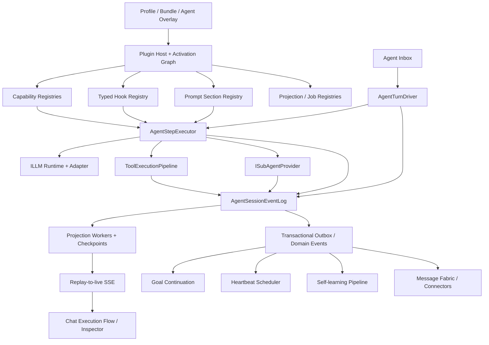
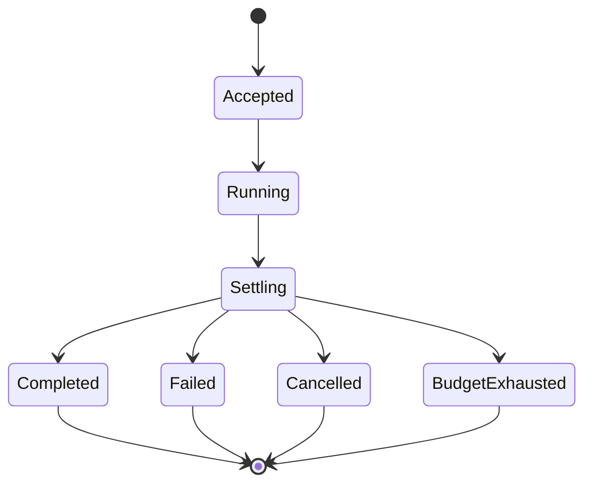
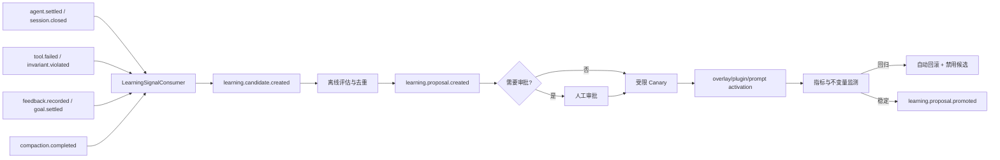
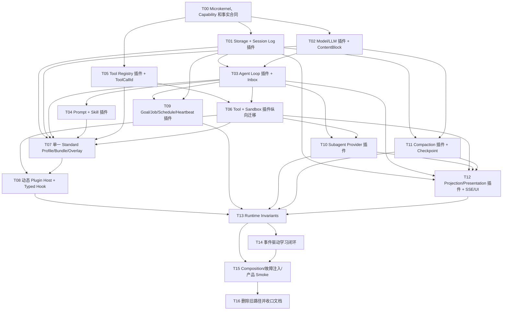

# PuddingAgent 对齐 DeepSeek Harness / Pi 的总设计与施工蓝图

> 日期：2026-08-14  
> 状态：总设计定稿，等待分阶段施工  
> Pudding 仓库：`E:\github\AgentNetworkPlan\PuddingAgent`  
> DeepSeek Harness 快照：`E:\github\deepseek\deepseek-harness`，commit `47f943859bef60e4160492346772ded9b24f765a`  
> Pi 快照：`E:\github\deepseek\pi`，commit `9d2ec7ffabe927bfad2214c1cee25b6632a78dcf`

## 0. 本次会话产生的全部设计方案路径

### 0.1 主设计文档

1. `E:\github\AgentNetworkPlan\PuddingAgent\Docs\07架构\87ADR-073任务看板优先的Agent工作台轨迹与实时指标施工ADR.md`
   - 产品级施工入口；先完成任务看板闭环，再做 Auto/Cron、完整轨迹、实时指标和插件化收口。
   - 汇总目标、优先级、工作量、难度、依赖、里程碑和具体设计位置。

2. `E:\github\AgentNetworkPlan\PuddingAgent\Docs\deepseek-harness-message-card-alignment-2026-08-14.md`
   - 消息、推理、工具调用、子代理委派和运行状态的前端信息架构。
   - 定义 `TurnStatus`、`ReasoningDisclosureRow`、`ToolCallRow`、`DelegationRow`、`ExecutionFlowProjector`。

3. `E:\github\AgentNetworkPlan\PuddingAgent\Docs\deepseek-harness-tool-system-alignment-2026-08-14.md`
   - 工具定义、canonical value、结构化错误、执行管线、并发、spill、后台 Job、presentation 和 Code Mode。
   - 定义工具系统的 P0/P1/P2/P3 施工路线。

4. `E:\github\AgentNetworkPlan\PuddingAgent\Docs\deepseek-harness-pi-plugin-hook-event-architecture-2026-08-14.md`
   - 插件、Typed Hook、持久事件、生命周期、心跳和事件驱动自学习的上位架构。
   - 定义 Command / Hook / Event / Stream Event 边界和各领域生命周期事件。

5. `E:\github\AgentNetworkPlan\PuddingAgent\Docs\deepseek-reference-architecture-master-plan-2026-08-14.md`
   - 本文档。
   - 汇总前三份设计，补充 Harness 组件级分析、Pudding 文件级映射、任务依赖图和统一施工顺序。

### 0.2 本次会话同步修订的关联设计

1. `E:\github\AgentNetworkPlan\PuddingAgent\Docs\07架构\86ADR-072工作区TODO峰谷Auto派发与定时任务第一阶段ADR.md`
   - Task Ledger、五列 Board、手工执行、Auto、受限 Cron、峰谷策略和恢复的任务领域合同。

2. `E:\github\AgentNetworkPlan\PuddingAgent\Docs\Features\memory-design\learning-mechanism-design.md`
   - 将长效学习改为 durable event 驱动、定时任务兜底，并增加候选、评估、灰度、激活、监控和回滚治理。

3. `E:\github\AgentNetworkPlan\PuddingAgent\Docs\superpowers\specs\2026-06-30-hook-system-v2-design.md`
   - 修订 Hook 与持久事件的语义边界。

4. `E:\github\AgentNetworkPlan\PuddingAgent\Docs\07架构\10事件系统与事件总线.md`
5. `E:\github\AgentNetworkPlan\PuddingAgent\Docs\07架构\20会话状态机与事件规范ADR.md`
6. `E:\github\AgentNetworkPlan\PuddingAgent\Docs\07架构\28ADR-027Hook事件潜意识学习闭环ADR.md`
7. `E:\github\AgentNetworkPlan\PuddingAgent\Docs\Config\hooks.md`
   - 上述四份文档增加与新上位架构的关系说明，避免继续把异步生命周期通知称为同步 Hook。

### 0.3 索引和代码地图

1. `E:\github\AgentNetworkPlan\PuddingAgent\Docs\README.md`
2. `E:\github\AgentNetworkPlan\PuddingAgent\code_map.md`
3. `E:\github\AgentNetworkPlan\PuddingAgent\Source\PuddingCore\code_map.md`
4. `E:\github\AgentNetworkPlan\PuddingAgent\Source\PuddingRuntime\code_map.md`
5. `E:\github\AgentNetworkPlan\PuddingAgent\Source\PuddingHost\code_map.md`
6. `E:\github\AgentNetworkPlan\PuddingAgent\Source\PuddingPlatform\code_map.md`
7. `E:\github\AgentNetworkPlan\PuddingAgent\Source\PuddingPlatformAdmin\code_map.md`
8. `E:\github\AgentNetworkPlan\PuddingAgent\Source\PuddingMemoryEngine\code_map.md`

### 0.4 阅读顺序

```text
ADR-073（产品优先级、工作量与纵向交付顺序）
  └─ 本文档（架构依赖、组件映射和 T00-T16）
       ├─ ADR-072（任务领域、Auto/Cron 与恢复合同）
       ├─ 插件/Hook/Event 架构（运行时扩展和生命周期）
       ├─ 工具系统方案（工具合同和执行语义）
       ├─ 消息卡片方案（最终用户投影）
       └─ 长效学习设计（事件消费者）
```

ADR-073 是产品级施工入口；本文档定义底座架构依赖，专项文档定义各领域数据和 UI 合同。若出现冲突：产品批次和先后顺序以 ADR-073 为准，底座依赖以本文档为准，任务领域以 ADR-072 为准；任何文档都不得用兼容双写或第二套状态源绕过依赖。

## 1. 调研范围和证据边界

### 1.1 已检查的参考仓库

`E:\github\deepseek` 当前只有两个项目：

| 项目 | 实际定位 | 本文用途 |
|---|---|---|
| `deepseek-harness` | 基于 Cordis 的插件化 Agent Harness；Agent Loop、Session Log、Tool、LLM、Subagent、Goal、Job、Schedule、Compaction、Web Client 都是插件 | 主要架构和组件参考 |
| `pi` | 多 Provider Agent Core、Coding Agent、Extension Runner、TUI 和会话格式 | 生命周期 Hook、扩展 API、热重载、UI renderer 和上下文替换安全参考 |

没有发现第三个本地 DeepSeek 项目，因此“还有哪些可以参考”是指这两个仓库中此前三份专项方案尚未系统覆盖的组件，而不是遗漏了其他仓库。

### 1.2 核心源码证据

DeepSeek Harness：

- `docs/architecture.md`：整体插件树、事件域、Turn/Step、Session Log 和 capability seam。
- `docs/cordis-primer.md`：Service、依赖注入、事件 dispatch mode、effect/disposer。
- `docs/defensive-patterns.md`：异步生命周期、quiescence、回调异常、进程与 spill 安全。
- `packages/core/session/src/`：append-only Session Log、surface fold、消息派生和 repair。
- `packages/core/agent/src/`：Agent Registry、Inbox、live lifecycle events 和 scope。
- `packages/core/agent-loop/src/`：Turn/Step 驱动、请求、stream、工具调用和持久事件顺序。
- `packages/core/tools/src/`：定义、schema、typed value、三段 waterfall、guard、presentation、Code Mode。
- `packages/core/system-prompt/src/`：分节注册、稳定装配、工具 provider 和作用域层。
- `packages/llm/`：统一内容块、adapter seam、结构化错误、retry 和 token meter。
- `packages/subagent/`：provider seam、descriptor、continuation、projection 和 settlement。
- `packages/goal/goal-round-driver/`：同会话目标的自动续轮与竞态 fence。
- `packages/jobs/`、`packages/schedule/`：后台任务、定时投递和 owner 生命周期。
- `packages/session/`：持久化协调、projection、checkpoint、query 和 telemetry。
- `packages/compaction/`：checkpoint、tool pairing 和 result pruner。
- `packages/runtime-diagnostics/invariants/`：由各能力包拥有的运行时关系不变量。
- `packages/client/`：模块/slot、conversation node、trajectory、tool presenter 和状态投影。
- `.agents/notes/implemented/architecture/`：已落地决策的原因、拒绝方案和故障模式。

Pi：

- `packages/coding-agent/src/core/extensions/types.ts`：Session、Agent、Turn、Message、Tool、Provider 等扩展事件。
- `packages/coding-agent/src/core/extensions/loader.ts`：扩展发现、注册和资源加载。
- `packages/coding-agent/src/core/extensions/runner.ts`：事件分发、结果合并、stale context 防护。
- `packages/coding-agent/src/core/agent-session.ts`：Hook 安装、`agent_settled`、session reload/replace 和 teardown。
- `packages/coding-agent/docs/extensions.md`：扩展 API 和 renderer 合同。
- `packages/coding-agent/docs/compaction.md`：压缩前后事件、overflow recovery 和上下文计量。
- `packages/coding-agent/docs/session-format.md`：可恢复会话记录。

### 1.3 证据限制

- 本文是源码和文档静态分析，不宣称已在 Pudding 中实现。
- Harness 是 TypeScript/Cordis 架构，Pudding 必须映射为 .NET 合同和显式 registry，不能逐行移植。
- Pi 没有完整的自主 Agent 心跳插件；心跳方案只借鉴其 lifecycle、`agent_settled` 和 cleanup 机制。
- 不复制参考项目的品牌 UI、CSS、npm 包边界或 Node 专属加载机制。

## 2. 总目标、范围与约束

### 2.1 总目标

把 Pudding 从“功能已经很多，但 Agent Loop、事件、提示词、工具和前端各自维护局部状态”收敛为以下可验证系统：

1. **一个可回放的 Agent Session 事实流**：模型看见的输入、模型返回的输出、工具调用和控制决策都能从事实流重建。
2. **一个 Turn/Step 执行内核**：Buffered 和 Streaming 共享相同状态机和工具执行语义。
3. **一切业务能力皆插件**：模型、工具、技能、会话、Agent Loop、沙箱、存储、调度和 UI 投影都通过 capability plugin 提供；能力定义、Provider 和 Consumer 分离，注册有 scope、有来源、有 disposer。
4. **一个稳定的提示词和工具前缀**：通过 profile/bundle/overlay 和 section registry 装配，可解释、可缓存、可复现。
5. **一个生命周期事件词典**：Session、Run、Turn、Step、LLM、Tool、Subagent、Job、Heartbeat、Compaction、Learning 均有合法状态迁移。
6. **一个实时与历史一致的投影系统**：前端只投影事实，不猜测 Agent 正在做什么。
7. **一个事件驱动的自主推进与学习闭环**：Goal、Heartbeat、Subagent settlement、Compaction 和 Learning 由事件续推，不依赖用户反复说“继续”。

### 2.2 产品范围

纳入：

- Core 合同与 ID 类型；
- Runtime Agent Loop、Prompt、Tool、LLM、Plugin、Goal、Job、Compaction；
- Platform SQLite 事实、Projection、SSE、Subagent；
- Host Heartbeat、组合根和 DesktopChild 生命周期；
- Admin Chat 的执行流、工具卡片、子代理检查器和插件诊断；
- MemoryEngine 的事件驱动学习消费者。

不纳入：

- 把 ASP.NET Core 业务迁入 WPF；
- 重写现有 Browser Bridge、Orchestration Graph 或 Message Fabric；
- 复制 Cordis、React 组件或 Pi TUI；
- 在本轮设计中直接启用任意第三方 DLL；
- 在没有 A/B 数据前默认启用 DeepSeek Code Mode；
- 将隐藏思维链推断为 UI 文本。

### 2.3 强制约束

1. `PuddingRuntime` 不引用 `PuddingPlatform`；合同在 Core，SQLite/HTTP 实现在 Platform。
2. Desktop 仅监督 Core、承载 WebView2 和系统集成，不承载 Agent 业务。
3. 配置文件优先；Provider、模型、Agent、插件、Profile 使用文件，不将新配置主事实塞进数据库。
4. `D:\data` 是运行数据，不是构建/测试输出。
5. 开发阶段不保留长期双写和复杂兼容层；结构变化允许重置开发数据库。
6. 模型可见内容必须可重建；Secret、ControlToken 和绑定后的凭据永不进入事件、日志或 UI。
7. 外部副作用前必须持久化其调用身份和意图；终态必须单调。
8. Dispose 必须等待 quiescence；不能只发 cancellation 后立即返回。
9. 用户消息优先于心跳和后台续轮；Busy 的心跳丢弃或重排，不形成重试风暴。
10. 真实 DeepSeek smoke 必须使用用户明确选择的 Agent/DataRoot，不读取 `D:\data` 中的 Secret 绕过准入。

## 3. 总体目标架构



### 3.1 四个平面

| 平面 | 权威内容 | 不能承担 |
|---|---|---|
| Composition Plane | 插件、能力、Prompt、Profile、依赖和作用域 | 运行中事实 |
| Execution Plane | Inbox、Run、Turn、Step、LLM、Tool、Subagent | UI 私有状态 |
| Fact Plane | append-only Session Event、Domain Event、Checkpoint | 同步修改当前调用 |
| Presentation Plane | Projection、SSE、Chat、Inspector | 推断不存在的事实 |

### 3.2 最小内核

Pudding 的“最小内核”只保留让插件安全组合所必需的机制，不保留具体 Agent 能力实现：

- bootstrap profile 定位、Plugin Resolver / Activator；
- 通用 Capability Registry、Scope 和不可变注册快照；
- Plugin Activation、effect/disposer、generation fence 和 drain 顺序；
- Typed Hook、durable event、stream event 的基础信封与 dispatch 机制；
- Deadline、Cancellation、Permission 和 Secret handle 的不可绕过安全门；
- Trace、typed ID、单调时钟和 Runtime Invariant Host；
- Host shutdown 与原子 composition swap。

Session Log、Storage、Scheduler 虽然是标准 Profile 的必需能力，但它们是**强制内置插件**，不是内核实现。Profile 缺少这些能力时启动失败；替换 Provider 不修改内核。Agent Loop、LLM Adapter、Tool Registry、Skill Provider、Sandbox、Prompt Section、Goal Driver、Heartbeat、Compaction、Learning 和 UI Projection 同样通过内核注册面组合。

### 3.3 第一原则：Everything is Plugin

借鉴 Harness 时最重要的不是 Cordis API，而是“框架只组织能力，能力全部由插件交付”。Pudding 的 C# 版本采用以下边界：

```text
Pudding Microkernel
  ├─ 读取一个 bootstrap profile
  ├─ 解析插件和 capability graph
  ├─ 建立 Host/Workspace/Agent/Session/Run scopes
  ├─ 原子发布 registry snapshot
  └─ drain/dispose activation

pudding.standard Profile
  ├─ model + llm plugins
  ├─ agent-loop plugin
  ├─ tool registry + tool plugins
  ├─ skill catalog + skill provider plugins
  ├─ session + persistence plugins
  ├─ sandbox/fs/subprocess plugins
  ├─ storage/artifact plugins
  ├─ job/schedule/heartbeat plugins
  └─ projection/presentation plugins
```

“必需”与“内核”必须分开：标准 Profile 可以要求 `pudding.session`、`pudding.storage`、`pudding.scheduler` 各恰有一个 Provider，但这些 Provider 仍能在测试、部署或未来版本中替换。

### 3.4 插件族与 C# Capability Seam

| 插件族 | Service Definition（Core 合同） | 标准 Provider 插件 | 主要 Consumer | Pudding 现有迁移入口 |
|---|---|---|---|---|
| 模型/LLM | `ILlmRuntime`、`ILlmAdapter`、`IModelCatalog` | `pudding.llm.deepseek`、`pudding.llm.openai` | Agent Loop、Compaction、ImageReader、Learning | 各 Gateway、LLM provider 配置和模型路由 |
| Agent Loop | `IAgentRunner`、`IAgentInbox` | `pudding.agent-loop.default` | Chat、Heartbeat、Goal、Subagent | `AgentExecutionService*` |
| 工具 | `IToolCatalog`、`IToolExecutionPipeline` | `pudding.tools.runtime` + 每个 tool plugin | Agent Loop、Code Mode、UI Projection | `PuddingToolRegistry`、`ToolInvocationService` |
| 技能 | `ISkillCatalog`、`ISkillProvider` | `pudding.skills.filesystem`、内置 Skill provider | Prompt、`tool-skill`、学习管道 | 当前 Skill registry、workspace skill loader |
| 会话 | `IAgentSessionService`、`IAgentSessionLog`、`ISessionPersistence` | `pudding.session.sqlite` | Agent Loop、Fork、Projection、Query、Compaction | `SessionEventContracts`、`ConversationEventStore` |
| 沙箱/执行世界 | `ISandboxProvider`、`IFileSystemProvider`、`ISubprocessProvider` | `pudding.sandbox.windows-local`，未来 sidecar/E2B | Shell、Terminal、Browser、Code Runtime、LSP | Firewall、Workspace Guard、Shell/File tools |
| 存储 | `IStorageBackend`、typed domain form、`IArtifactStore` | `pudding.storage.sqlite`、`pudding.artifacts.filesystem` | Session、Memory、Settings、Jobs、Projection | EF/SQLite stores、文件 artifact、spill |
| Job/调度 | `IJobRuntime`、`IScheduleRuntime`、`IScheduleStore` | `pudding.jobs.local`、`pudding.schedule.sqlite` | Heartbeat、Learning、Maintenance、Connector retry | `HeartbeatService`、后台 Worker、Cron/Sleep |
| Prompt/Context | `IPromptSectionRegistry`、`IContextContributor` | SOUL/AGENTS/Memory/Heartbeat plugins | Agent Loop | `SystemPromptBuilder`、`ContextPipeline` |
| UI/Projection | `ISessionProjector<T>`、`IPresentationProvider` | Chat、Tool、Subagent、Goal projectors | SSE、Admin Workbench | Chat DTO/reducer、运行检查器、托盘坞 |

每一行都必须满足 Definition / Provider / Consumer 三角色。Core 只承载 Definition 和跨 Provider 的稳定值类型；实现不得为了方便回流 Core。Consumer 只依赖 capability，不依赖具体插件程序集。

### 3.5 一套产品 Profile，而不是四套产品模式

截图中“标准、PTC、极简、创造”说明同一 Harness 可以装配不同插件集合；Pudding 第一阶段不需要暴露四个产品模式：

- 只发布一个面向用户的 `pudding.standard` Profile；
- 测试保留 `pudding.test-minimal`，用于 composition/invariant 测试，不进入产品 UI；
- Code Mode/PTC 是 `pudding.tools.runtime` 的 `native | code | both` 配置，不复制一套 Agent Runtime；
- Agent 差异通过 `standard bundle + Agent overlay` 表达；
- 后续只有出现真实部署差异时才新增 `headless`、`restricted` 等 Profile。

因此“一切皆插件”不等于给用户制造大量模式，而是让一套默认产品可以替换、测试和演进。运行中心必须提供 `dump composition`，显示最终 Profile、Bundle、Overlay、插件版本、Capability Provider、来源和配置 hash。

## 4. Harness 组件到 Pudding 的吸收总表

| Harness / Pi 组件 | 关键设计 | Pudding 当前落点 | 具体吸收动作 | 优先级 |
|---|---|---|---|---|
| `core/session` | append-only log，所有模型历史从 log fold | `session_event_log`、`conversation_events`、多个 writer | 建立单一 `IAgentSessionLog`；停止执行事实双写；统一事件信封和 fold | P0 |
| `core/agent-loop` | Turn 包含多个 Step；Loop 自身可替换 | Buffered/Streaming 两套大循环 | 抽 `AgentTurnDriver`、`AgentStepExecutor`、`LlmStepRunner` | P0 |
| `core/agent` Inbox | `next-turn` / `next-step` 单一 inbox | steering、heartbeat、subagent 回传各自入口 | 新建 `IAgentInbox`；统一用户消息、续轮、子代理 settlement 和心跳投递 | P0 |
| `core/system-prompt` | section registry、稳定顺序、scope | `SystemPromptBuilder` + ContextPipeline 硬编码拼接 | 新建 `IPromptSectionRegistry` 和 assembly snapshot；逐层迁移 | P0 |
| capability seam | Definition / Provider / Consumer 三角色 | Tool 较完整，FS/Shell/Subagent/LLM 仍耦合 | 每个新增能力必须列三角色；优先拆 Shell、Subagent、Spill、Job | P0-P1 |
| `core/tools` | typed input/output、三段 waterfall、guard | `ToolExecutionResult` 仍是字符串 | 按工具专项方案实现 canonical JSON、typed errors、pipeline | P0 |
| content block vocabulary | text/reasoning/tool-call/result 统一语言 | Gateway 和 UI 仍有多种字符串/事件形状 | 新建 Core `ContentBlock` 联合模型和单一 stream assembler | P0 |
| `llm/*` | adapter seam、结构化 finish/error/retry | 三套 Gateway + LlmInvocationService | Gateway 只做 wire mapping；Runtime 统一 terminal result 和 retry decision | P1 |
| Profile / Bundle / Overlay | 可覆盖插件组合树、可 dump provenance | Agent manifest、system config 分散 | 新建 composition resolver；Agent manifest 引用 profile/bundle；提供 dump API | P1 |
| Cordis effect | 注册即 effect，卸载自动反向释放 | manifest-only 插件，无 activation | `IPluginActivation` + registration handle + atomic registry snapshot | P1 |
| `core/scope` | global/agent scoped layers，显式 shadow/restrict | Workspace tool source + DI 列表 | 定义 Host/Workspace/Agent/Session/Run scope 树和解析规则 | P1 |
| `goal-round-driver` | settled 后自动续轮，竞态 fence | goal.md + 心跳提示词推动 | durable Goal + GoalContinuationProjector + inbox continuation | P1 |
| `jobs` | owner、start/read/wait/kill、settlement | Terminal 和后台流程各自协议 | 新建 `IJobRuntime`；迁移 Terminal、索引、批处理 | P1 |
| `schedule` | append-only schedule change + runtime timer | Cron、Heartbeat、sleep 分散 | 新建 `IScheduleStore/Runtime`；Heartbeat 是 schedule consumer | P1 |
| `subagent` | Provider seam、one-shot/continuable/fork | `SubAgentManager` 单体 1330 行 | 拆 Provider、Lifecycle、Projection、Settlement、Continuation | P1 |
| `compaction` | same-session checkpoint、工具配对、pruner | Compaction successor + 多条通知 | 引入 checkpoint fold；压缩不默认创建新会话；保持 tool pair | P1 |
| `session-projection` | projection registry + cursor/checkpoint | 多个专用 worker/checkpoint | 统一 `ISessionProjector<TState>` 与 checkpoint runner | P1 |
| `spill` | opaque locator、owner、hash、retrieval | 各工具自行截断 | 新建 `ISpillStore` 和模型 preview policy | P1 |
| runtime invariants | 各能力包拥有自己的关系检查 | 测试散落、运行时缺少组合检查 | 新建 `IRuntimeInvariantContributor`，dev/test 可启用 | P1 |
| Client modules/slots | UI 能力自己注册 node/renderer | Tool UI 按 name 判断 | presentation intent + renderer registry；服务端不传 React node | P2 |
| transcript snapshots | 真实组合、无 key、可重放输出 | 以单元和 compile 为主 | 增加 assembled transcript fixtures，验证 Prompt/Tool/Event/UI | P0-P2 |
| Pi stale context guard | reload/replace 后旧扩展 context 立即失效 | reload 缺乏 generation fence | Plugin/Session context 携带 generation；调用前验证 active generation | P1 |
| Pi `agent_settled` | 所有队列和工具完成后的稳定点 | UI/Heartbeat 用 running/done 猜 | 新增 `agent.run.settled`，驱动 Goal、Heartbeat、Learning | P0 |
| Pi renderer registration | 工具和自定义消息拥有 renderer | 消息组件集中 if/else | 注册持久化 presentation kind；前端 renderer 可热注册 | P2 |

### 4.1 不吸收的部分

- 不把 Cordis vendored 到 .NET；实现等价的显式 Registry、Activation 和 Disposer。
- 不按 npm package 粒度把每个小能力拆成 .NET 项目；先用目录和接口隔离，只有跨发布边界时才拆程序集。
- 不采用 Pi 默认“继承宿主全部权限”的安全模型；Pudding 保留 Firewall、Approval、Workspace Guard 和 Desktop/Core 边界。
- 不让后注册插件静默覆盖同 scope 的同名工具或服务；冲突在 staging 阶段失败。
- 不把 live Hook 事件当 durable event，也不让 durable consumer 阻塞当前工具或 LLM 请求。

## 5. 统一事实模型：Run、Turn、Step 和 Attempt

### 5.1 术语冻结

| 术语 | 定义 | 终止条件 |
|---|---|---|
| Session | 可恢复的 Agent 对话事实流 | 用户关闭/归档或明确替换 |
| Run | 一次被调度的 Agent 执行占用，可跨多个 Turn | 目标完成、失败、取消、预算耗尽 |
| Turn | 一次输入领取后到“当前不再欠工作”的逻辑响应 | 无 next-step、无工具结果待处理、无本轮续推 |
| Step | 一次模型请求及其产生的工具调用集合 | assistant message 和全部工具结果落定，或请求失败 |
| LLM Attempt | 同一 Step 内一次物理 Provider 请求 | success/error/abort/timeout |
| Tool Call | 一个稳定 callId 的逻辑调用，可有物理 retry attempt | completed/failed/cancelled |

### 5.2 ID 类型

在 `Source/PuddingCore/Runtime/Identifiers/` 新建轻量 `readonly record struct`：

```csharp
public readonly record struct AgentRunId(string Value);
public readonly record struct TurnId(string Value);
public readonly record struct StepId(string Value);
public readonly record struct LlmRequestId(string Value);
public readonly record struct ToolCallId(string Value);
public readonly record struct JobId(string Value);
public readonly record struct PluginActivationId(string Value);
```

规则：

- 只给跨边界且可能互相混淆的 ID 建类型，不包装 ToolName、ModelId 等普通名称。
- HTTP、数据库、Provider、模型 JSON 等非类型边界通过 `Parse/TryParse` 构造。
- Core/Runtime 内不再把 RunId、TurnId、CallId 作为可互换的 `string`。
- 所有事件信封显式携带 `RunId/TurnId/StepId`；`CallId` 位于 Tool/LLM payload。

### 5.3 状态机



`agent.run.settled` 只在以下事实都成立时提交：

1. 当前 Turn 已有终态；
2. 没有已领取但未落定的 Step；
3. 没有前台 Tool Call；
4. 没有必须在本 Run 内归并的子代理 settlement；
5. 输出、usage 和关键 projection 已完成 flush；
6. cancellation/dispose 已等待子任务 quiescence。

它不是 `AgentExecutionService` 返回的同义词，也不是前端“长时间没有事件”的推断。

## 6. 单一 Agent Session Log

### 6.1 当前问题

Pudding 当前同时存在：

- `SessionEventEnvelope` / `session_event_log`；
- `ConversationEvent` / `conversation_events`；
- `RuntimeActivity`；
- `ChatMessages`；
- 子代理文件归档；
- 前端实时 reducer 状态。

这些数据各有用途，但执行代码会把同一个 Tool/Turn 事实分别写入多个通道，且模型历史并非只从一个权威日志派生。结果是：

- callId、runId 和状态容易在某一层丢失；
- 实时 UI 与刷新后 archive 不一致；
- “模型看见了什么”无法仅靠一个事件前缀重建；
- Heartbeat、Learning 和 Connector 容易误消费 UI 投影或工作队列。

### 6.2 目标决定

建立 `IAgentSessionLog` 作为 Agent 执行事实的唯一追加边界。开发阶段完成原地替换，不长期双写。

推荐以现有 `ConversationEventStore` 的 sequence、fencing、幂等和 SQLite 事务能力为基础，重命名并扩展为 Agent Session Log；`session_event_log` 的有效生产者迁入后删除旧执行写入。`RuntimeActivity` 保持诊断旁路，`ChatMessages` 保持用户可见投影，Message Fabric 事件保持渠道领域事实，三者都不能反向成为模型历史来源。

### 6.3 Core 合同修改

修改：

- `Source/PuddingCore/Platform/ConversationEventContracts.cs`
- `Source/PuddingCore/Platform/IConversationEventStore.cs`
- `Source/PuddingCore/Platform/SessionEventContracts.cs`

目标：

```csharp
public sealed record AgentSessionEventEnvelope
{
    public required string EventId { get; init; }
    public required string WorkspaceId { get; init; }
    public required string SessionId { get; init; }
    public required long Sequence { get; init; }
    public required string Type { get; init; }
    public required int SchemaVersion { get; init; }
    public AgentRunId? RunId { get; init; }
    public TurnId? TurnId { get; init; }
    public StepId? StepId { get; init; }
    public string? MessageId { get; init; }
    public string? AgentId { get; init; }
    public string? CorrelationId { get; init; }
    public string? CausationId { get; init; }
    public required DateTimeOffset OccurredAtUtc { get; init; }
    public required DateTimeOffset CommittedAtUtc { get; init; }
    public required JsonElement Payload { get; init; }
}
```

必须修订的现有字段：

- `ConversationEvent.TurnId` 改为可空；Session、Plugin、Heartbeat 等事实不应伪造 TurnId。
- `SessionEventDraft` 增加 `RunId/StepId`，不再只包含 TurnId。
- `EventWriteCondition` 保留 run fencing，但允许 session-scope append 使用 session revision 条件。
- `SessionEventNames` 由少量常量改为集中 catalog；事件 payload 由强类型 descriptor 注册并验证。

### 6.4 事件目录

第一批必须落地：

| 领域 | 事件 |
|---|---|
| Session | `session.created`、`session.started`、`session.closed`、`session.archived` |
| Inbox | `agent.inbox.enqueued`、`agent.inbox.claimed`、`agent.inbox.discarded` |
| Run | `agent.run.accepted`、`agent.run.started`、`agent.run.settling`、`agent.run.settled`、`agent.run.failed`、`agent.run.cancelled` |
| Turn | `turn.started`、`turn.completed`、`turn.failed`、`turn.cancelled` |
| Step | `step.started`、`step.completed`、`step.failed`、`step.cancelled` |
| Request | `request.context.assembled`、`llm.request.started`、`llm.request.retry_scheduled`、`llm.request.completed`、`llm.request.failed` |
| Assistant | `assistant.chunk`、`assistant.message.completed` |
| Tool | `tool.call.started`、`tool.call.progress`、`tool.call.completed`、`tool.call.failed`、`tool.call.cancelled` |
| Subagent | `subagent.requested`、`subagent.started`、`subagent.progressed`、`subagent.settled`、`subagent.failed`、`subagent.cancelled` |
| Compaction | `compaction.requested`、`compaction.started`、`compaction.checkpointed`、`compaction.completed`、`compaction.failed` |

事件命名只描述已提交事实，不使用 `processing`、`doing` 之类含糊名词。

### 6.5 模型历史投影

新建：

- `Source/PuddingCore/Runtime/IAgentHistoryProjector.cs`
- `Source/PuddingRuntime/Services/AgentHistoryProjector.cs`
- `Source/PuddingRuntime/Services/AgentSessionSurfaceFold.cs`

`AgentHistoryProjector` 只消费 Agent Session Log 前缀，生成 provider-neutral `ContentBlock[]`。它不读取 `ChatMessages`、前端状态或 RuntimeActivity。

模型可见不变量：

```text
实际发给 Provider 的 canonical request
  ==
从 request.context.assembled 所指向的 Prompt Snapshot
+ 从同一 sequence 前缀 fold 得到的 Message/Tool history
+ 本 Step 明确领取的 inbox inputs
```

每次 `llm.request.started` 记录：

- `requestId/provider/model/protocol`；
- `historyThroughSequence`；
- `promptSnapshotId/promptSha256/toolSetSha256`；
- `inputMessageIds`；
- token 预算和 deadline；
- 不包含 Secret 的 canonical request hash。

### 6.6 持久化策略

不能机械复制 Harness 的“同步内存 append + 全量 write-behind”。Pudding 有 SQLite 和外部副作用，按风险分级：

| 级别 | 事件 | 持久化规则 |
|---|---|---|
| A：副作用前 fence | inbox claimed、tool.call.started、subagent.requested、schedule.dispatched | 同事务立即提交，之后才允许外部副作用 |
| B：高频增量 | assistant.chunk、tool.progress | 内存顺序分配 + 50–200ms 有界 batch；Step 终止前强制 flush |
| C：终态 | assistant.message.completed、tool result、step/turn/run settled | 同批或同事务提交，返回调用方前 flush |

服务停止顺序：停止接收新 Run → 停止 projection watch → cancel 执行 → 等待工具/子代理/Job → flush session logs → flush outbox → dispose plugin scopes → 停 SQLite。

## 7. Agent Turn/Step 执行内核

### 7.1 当前问题

以下文件共同承担了过多状态：

- `Source/PuddingRuntime/Services/AgentExecutionService.cs`（1590 行）；
- `Source/PuddingRuntime/Services/AgentExecution/AgentExecutionService.Buffered.cs`（1919 行）；
- `Source/PuddingRuntime/Services/AgentExecution/AgentExecutionService.Streaming.cs`（1536 行）。

Buffered/Streaming 不应是两套 Agent 语义。Streaming 是输出输送方式，不能决定 Tool、Turn、Retry、Subagent 和持久事件的含义。

### 7.2 目标组件

新增目录 `Source/PuddingRuntime/Services/AgentLoop/`：

| 文件 | 职责 |
|---|---|
| `AgentTurnDriver.cs` | 领取 inbox、打开/关闭 Turn、判断是否欠下一 Step |
| `AgentStepExecutor.cs` | 打开 Step、装配请求、调用 LLM、落 assistant、执行工具、关闭 Step |
| `AgentInbox.cs` | `next-turn` / `next-step` 两类输入和优先级 |
| `AgentRequestAssembler.cs` | Prompt Snapshot、history fold、tool set 和当前 inputs 合成 canonical request |
| `AgentStreamAssembler.cs` | 将 Gateway delta 组装成统一 ContentBlock，并追加 chunk/message 事实 |
| `AgentTurnSettlementPolicy.cs` | completed/failed/cancelled/budget_exhausted/settled 判定 |
| `AgentLoopTransaction.cs` | 一个 Turn 的 cancellation、child tasks 和 flush 所有权 |

保留：

- `AgentExecutionService` 作为 API façade、execution gate 和兼容调用入口；
- `AgentExecutionService.Buffered/Streaming` 只保留不同的 `IAgentOutputSink` 适配，不保留执行分支。

### 7.3 执行顺序

```text
1. Run accepted / started
2. Inbox claim one next-turn input + eligible next-step inputs
3. Typed Hook: agent.before_turn
4. append turn.started
5. Typed Hook: agent.before_step，可 Reject 或返回冻结后的 admitted inputs
6. append step.started + admitted user/context messages
7. Prompt/History/ToolSet assembly；append request.context.assembled
8. append llm.request.started；调用 adapter
9. append assistant.chunk*；组装并 append assistant.message.completed
10. 冻结模型产生的 tool calls，按模型顺序 append tool.call.started
11. ToolCallScheduler 执行；按 callId append terminal result
12. append step.completed/failed
13. 如果工具产生下一请求、子代理 settlement 到达或 next-step inbox 有输入，回到 5
14. append turn.completed/failed/cancelled
15. flush + agent.run.settling + projection barrier
16. append agent.run.settled
```

### 7.4 单一 Inbox

`AgentInbox` 输入类型：

```csharp
public sealed record AgentInboxItem
{
    public required string InboxItemId { get; init; }
    public required AgentInboxTarget Target { get; init; } // NextTurn / NextStep
    public required AgentInboxSource Source { get; init; } // User / Steering / Subagent / Goal / Heartbeat / Tool
    public required int Priority { get; init; }
    public required ContentBlock[] Content { get; init; }
    public string? IdempotencyKey { get; init; }
    public DateTimeOffset EnqueuedAtUtc { get; init; }
}
```

优先级：用户输入 > 用户 steering > 审批结果 > 子代理 settlement > Goal continuation > Heartbeat > 学习/维护提示。

领取规则：

- 一个 Turn 只领取一个 wake-capable `NextTurn` 输入；
- 可合并安全的 `NextStep` 输入在 Step 边界领取；
- 已领取必须 durable `agent.inbox.claimed`；取消前未领取仍留队；
- Heartbeat 在 Busy 时不进入重试/死信，直接记录 `heartbeat.skipped(reason=busy)` 并重新调度；
- 子代理 settlement 使用 `(parentRunId, childRunId)` 幂等。

### 7.5 Retry

物理 LLM retry 不应创建第二条用户消息或第二个可见 Turn：

- 同一 Turn 中创建新的 Step 或 Step Attempt；
- 失败 attempt 的 chunk 标记为 discarded，不进入模型历史；
- 没有完整 assistant message 时绝不执行工具；
- retry 必须有结构化 `attempt/maxAttempts/delay/deadline/errorCode`；
- context overflow 只允许一次 `compact → reconstruct → retry`；
- `AUTH`、无效模型、显式取消不重试。

## 8. Provider-neutral 内容块和 LLM Adapter

### 8.1 Core 内容块

新增 `Source/PuddingCore/LLM/Content/`：

```text
ContentBlock
  ├─ TextBlock
  ├─ ReasoningBlock
  ├─ ToolCallBlock
  ├─ ToolResultBlock
  ├─ ImageBlock
  ├─ AudioBlock
  └─ ArtifactReferenceBlock
```

每个块有稳定 `BlockId`、来源、可见性和序列。Reasoning 是核心块类型，不再只存在于 DeepSeek Gateway 或 UI 私有字段。

### 8.2 Gateway 边界

修改：

- `Source/PuddingGateway/` 的 OpenAI Chat、Responses、Anthropic gateway；
- `Source/PuddingRuntime/Services/LlmInvocationService.cs`；
- `Source/PuddingRuntime/Services/DirectLlmClient.cs`；
- `Source/PuddingRuntime/Services/AgentExecution/AgentExecutionLlmInvoker.cs`。

Gateway 只负责：

- canonical request → wire request；
- wire stream → canonical `LlmStreamChunk`；
- Provider error → structured `LlmFailure`；
- Provider usage → canonical usage。

Gateway 不负责：

- 决定重试；
- 拼系统提示词；
- 选择 UI 文案；
- 写 Session/Conversation 事件；
- 选择 fallback 模型。

### 8.3 DeepSeek 特定优化

从 `llm-deepseek`、`llm-retry`、`token-meter` 和 Harness Agent Notes 吸收：

1. Provider/Model 路由显式冻结，不因错误随机切换语义不同的模型。
2. 工具 schema、Prompt section 和顺序 byte-stable；记录 prefix hash 与 cache hit。
3. `reasoning` 作为独立内容块流转，UI 只显示真实返回内容。
4. 统一区分 `finish=stop/tool_calls/length/content_filter/error/aborted`。
5. Responses API 的 `incomplete_details.reason=max_output_tokens` 映射为可继续的 `OutputLimitReached`，不是普通 500。
6. Transport failure、quota、auth、context overflow、empty response 使用稳定 code，不解析自然语言错误做控制决策。
7. 物理 retry 共享一个绝对 deadline；Retry-After 不能越过 deadline。
8. Token meter 记录 input、output、reasoning、cache hit/miss，前端不从文本长度估算。

### 8.4 不直接采用

- 不因为 Harness 支持 Code Mode 就默认启用；先完成 typed tool output 和隔离 worker。
- 不让 provider-specific reasoning 字段渗透到 Agent Loop 或 React 类型。
- 不把模型的最大上下文/输出能力写死在 Gateway；继续由模型配置文件声明并校验。

## 9. Prompt Section、Profile、Bundle 和 Overlay

### 9.1 Prompt Section Registry

当前 `SystemPromptBuilder` 和 `ContextPipeline`/`ContextPipelineOrchestrator` 仍然直接拼接多类字符串。目标新增：

- `Source/PuddingCore/Runtime/PromptSectionContracts.cs`
- `Source/PuddingRuntime/Services/Prompts/PromptSectionRegistry.cs`
- `Source/PuddingRuntime/Services/Prompts/PromptAssemblyService.cs`
- `Source/PuddingRuntime/Services/Prompts/PromptAssemblySnapshotStore.cs`

```csharp
public sealed record PromptSectionDefinition
{
    public required string SectionId { get; init; }
    public required int Order { get; init; }
    public required PromptScope Scope { get; init; }
    public required string SourceId { get; init; }
    public int? MaxTokens { get; init; }
    public bool Required { get; init; }
    public required Func<PromptSectionContext, CancellationToken, ValueTask<PromptSectionContent?>> RenderAsync { get; init; }
}
```

建议稳定区段：

| Order | Section | 当前来源 |
|---:|---|---|
| 100 | product-policy | `SystemPromptBuilder` 产品规则 |
| 200 | persona | SOUL/persona files |
| 300 | agent-instructions | AGENTS/Agent manifest |
| 400 | workspace-context | Workspace agents/environment |
| 500 | tool-guidance | Tool exposure + cross-tool rules |
| 600 | skill-guidance | Skill loader |
| 700 | goal-state | durable Goal projection |
| 800 | memory-context | Memory summary/pinned/preferences |
| 900 | runtime-context | inbound、parent snapshot、current request |

装配结果记录每个 section 的：`id/source/order/tokens/sha256/cacheClass/truncated/omittedReason`。完整 model-visible 内容写入受保护的 Prompt Snapshot artifact，事件只存 locator 和 hash；Secret 绑定发生在 artifact 之外。

### 9.2 Profile / Bundle / Overlay

配置层级：

```text
程序内置 base profile
  → 程序内置 product bundle
  → <DataRoot>/config/runtime-profiles/<profileId>.json
  → Workspace .pudding/runtime.override.json
  → Agent manifest 的 profile/bundles/overrides
  → 本次执行的只读 debug overlay
```

建议 Agent manifest：

```json
{
  "runtimeProfile": "general-agent",
  "runtimeBundles": ["core-tools", "memory", "heartbeat", "learning-signals"],
  "runtimeOverrides": {
    "llmRoute": "deepseek/deepseek-v4-pro",
    "promptSections": { "workspace-context": { "enabled": true } },
    "tools": { "kits": ["core", "workspace", "code"] }
  }
}
```

具体实现：

- `Source/PuddingCore/Runtime/RuntimeProfileContracts.cs`
- `Source/PuddingRuntime/Services/Composition/RuntimeProfileResolver.cs`
- `Source/PuddingRuntime/Services/Composition/RuntimeCompositionCompiler.cs`
- `Source/PuddingRuntime/Controllers/RuntimeCompositionController.cs`

提供只读 `GET /api/runtime/composition?workspaceId=&agentId=`，返回有效组件、来源层、覆盖链、Prompt/Tool hash 和冲突；不返回 Secret。

### 9.3 与现有配置关系

- `llm.providers.json` 继续拥有 Provider/Model 事实；Profile 只引用 `provider/model`。
- Agent `manifest.json` 继续拥有该 Agent 的 `imageReaderModel` 等显式路由。
- `system.json` 继续拥有 Core 运行参数，不承载 Agent 插件组合。
- Plugin 自身默认配置随插件包；用户覆盖在 DataRoot profile/agent manifest。
- 不使用数据库保存 Profile 主事实，只可保存已解析快照和审计 hash。

## 10. Capability Seam 和 Plugin Host

### 10.1 三角色规则

每个能力必须同时识别：

1. Service Definition：Core 中 provider-neutral 接口；
2. Service Provider：Runtime/Platform/Host/外部进程实现；
3. Consumer：Agent Tool、Prompt、Worker、API 或 UI projection。

示例：

| 能力 | Definition | Provider | Consumer |
|---|---|---|---|
| Filesystem | `IWorkspaceFileSystem` | local/sandbox/remote browser workspace | file_read/file_patch/search |
| Process | `IProcessRuntime` | Windows local/sandbox/remote | terminal/shell/LSP |
| Subagent | `ISubAgentProvider` | in-process/fork/out-of-process | spawn/query/resume tools |
| Job | `IJobRuntime` | in-memory+SQLite owner store | terminal/job/download/index tools |
| Spill | `ISpillStore` | session-scoped local store | tool result materializer/read tool |
| Prompt | `IPromptSectionProvider` | persona/workspace/memory/plugin | PromptAssemblyService |

接口不能按一个 Consumer 的 UI 或 schema 设计。Consumer 负责把能力转换为模型可见工具，Provider 负责执行世界，Definition 不依赖两者。

### 10.2 Plugin 合同

新增 `Source/PuddingCore/Plugins/`：

```csharp
public interface IPuddingPluginModule
{
    PluginDescriptor Descriptor { get; }
    ValueTask<IPluginActivation> ActivateAsync(
        PluginActivationContext context,
        CancellationToken ct);
}

public interface IPluginActivation : IAsyncDisposable
{
    PluginActivationId Id { get; }
    PluginActivationState State { get; }
    ValueTask DrainAsync(CancellationToken ct);
}
```

`PluginActivationContext` 只暴露注册面：

- capability；
- tool；
- prompt section；
- typed hook；
- durable event handler；
- projector；
- job/schedule provider；
- presentation descriptor；
- configuration view；
- trace/logger。

不暴露可任意解析所有宿主服务的 root `IServiceProvider`。

`PluginActivationContext` 的核心注册面保持通用：

```csharp
IRegistrationHandle Provide<TCapability>(
    CapabilityKey<TCapability> key,
    Func<IPluginRuntimeContext, TCapability> factory,
    CapabilityRegistration options);
```

`RegisterLlmAdapter`、`RegisterSkillProvider`、`RegisterSessionBackend`、`RegisterSandboxProvider`、`RegisterStorageBackend`、`RegisterScheduler` 都只是上述 API 的类型安全扩展方法，不在 Plugin Host 中增加按插件族判断的 `switch`。

一个 C# 程序集可以包含多个 first-party plugin module；插件是**配置中的激活单元**，不等于一个 DLL 或一个 `.csproj`。第一阶段按目录和接口解耦，只有需要独立发布、隔离或卸载时才拆程序集。

标准 SQLite 会话插件示意：

```csharp
public sealed class SqliteSessionPlugin : IPuddingPluginModule
{
    public PluginDescriptor Descriptor => BuiltInPlugins.SqliteSession;

    public ValueTask<IPluginActivation> ActivateAsync(
        PluginActivationContext context,
        CancellationToken ct)
    {
        context.Provide(
            SessionCapabilities.Log,
            runtime => new SqliteAgentSessionLog(runtime.GetRequired(StorageCapabilities.Sqlite)),
            CapabilityRegistration.RequiredSingleton);

        context.Provide(
            SessionCapabilities.Persistence,
            runtime => new SqliteSessionPersistence(runtime.GetRequired(SessionCapabilities.Log)),
            CapabilityRegistration.RequiredSingleton);

        return context.CommitAsync(ct);
    }
}
```

这里的依赖解析只允许通过声明过的 `CapabilityKey`；`runtime.GetRequired` 不能退化为任意 service locator。

### 10.3 Activation Pipeline

将当前 `PluginManifestCatalog` 的 `ManifestOnly` 流程升级为：

```text
Discover
  → Parse/Validate Manifest
  → Resolve dependency graph
  → Verify trust/signature/permissions
  → Load into staging AssemblyLoadContext 或连接外部进程
  → Activate into staging registries
  → Validate conflicts + runtime invariants
  → Atomic swap registry snapshot
  → Old activation Draining
  → Await quiescence
  → Dispose old activation / unload ALC
```

新增：

- `Source/PuddingRuntime/Services/Plugins/PluginDependencyResolver.cs`
- `Source/PuddingRuntime/Services/Plugins/PluginActivationManager.cs`
- `Source/PuddingRuntime/Services/Plugins/PluginActivationScope.cs`
- `Source/PuddingRuntime/Services/Plugins/PluginRegistrySnapshot.cs`
- `Source/PuddingRuntime/Services/Plugins/PluginAssemblyLoader.cs`

现有：

- `PluginPackageInstaller` 保留 zip-slip、symlink、大小和 entry count 校验；
- `PluginDiagnosticsSink` 改为 durable plugin lifecycle 事件的投影消费者；
- `PuddingToolRegistry` 改读 immutable registry snapshot，不在请求中遍历可变 source。

### 10.4 .NET DI 约束

- 不在运行时修改 ASP.NET root service collection。
- Built-in plugin 可以在启动时进入 root DI，但仍通过注册句柄贡献能力。
- 动态 trusted plugin 使用 child scope + plugin-owned object graph；禁止把 plugin singleton 泄漏到 root singleton。
- 第三方或低信任插件优先独立进程/RPC，不在 Core 进程加载 DLL。
- Registry snapshot 持有 activation generation；任何旧 generation context 在 reload 后拒绝新调用。

### 10.5 Scope 树

```text
Host
  └─ Workspace
      └─ Agent
          └─ Session
              └─ Run
                  └─ ToolCall / Job
```

规则：

- 子 scope 可 shadow 父 scope 的同名 contribution，但必须显式声明 `Shadow`；
- 同一 scope 重名失败；
- `restrict` 只能缩小可见能力，不是权限边界；执行仍进 Firewall；
- scope dispose 自动撤销注册，先关闭 listener/projection，再取消子工作；
- resolved composition 和 tool set 在一个 Step 内冻结，下一 Step 才能看见 reload。

## 11. Typed Hook 与 Durable Event 的具体边界

### 11.1 修订当前命名

当前 `IHookPublisher/HookPublisher` 把 hook 映射到 `IInternalEventBus`，实际是异步 lifecycle event publisher。迁移方案：

1. 新增 `IDomainEventPublisher` 承接当前 `PublishAsync` 语义；
2. 将 `HookEventNames.SessionCompressed/AgentLoopCompleted` 改为 durable event type；
3. 保留一个版本的 `IHookPublisher` 编译适配器后删除；开发阶段不长期共存；
4. 新增真正同步有界的 `ITypedHookDispatcher`。

### 11.2 Hook 类型

```csharp
public interface IGuardHook<TContext>
{
    ValueTask<GuardDecision> EvaluateAsync(TContext context, CancellationToken ct);
}

public interface ITransformHook<TValue, TContext>
{
    ValueTask<TValue> TransformAsync(TValue value, TContext context, CancellationToken ct);
}

public delegate ValueTask<TResult> AroundHook<TContext, TResult>(
    TContext context,
    Func<TContext, CancellationToken, ValueTask<TResult>> next,
    CancellationToken ct);
```

第一批 hook 点：

- `agent.before_turn` Guard；
- `agent.before_step` Transform/Guard；
- `llm.request` Around；
- `tool.arguments.transform` Transform；
- `tool.before_execute` Guard；
- `tool.execute` Around；
- `tool.result.transform` Transform；
- `session.before_compaction` Guard/Transform；
- `message.before_delivery` Guard/Transform。

### 11.3 失败策略

- Security/permission Guard：fail closed；
- Prompt/UI enrichment Transform：默认 fail open，但记录事件；
- Around timeout/metrics：失败不得吞掉原始异常；
- 每个 hook 有独立 deadline；不得执行数分钟业务逻辑；
- listener 异常由 dispatcher 隔离，不能饿死后续 observer；
- Hook 不能直接写 UI state，必须由 durable fact 投影。

## 12. 工具系统的具体施工映射

工具专项文档已经定义完整合同；此处冻结与其他组件的接口。

### 12.1 Core 类型

修改 `Source/PuddingCore/Tools/PuddingToolContracts.cs`：

- `ToolExecutionResult.Output/Error string` 替换为 `CanonicalValue + ModelContent + StructuredError + PresentationMeta`；
- `ToolDescriptor.Parameters` 替换为完整 JSON Schema AST；
- 增加 output schema、side-effect class、idempotency、concurrency、presentation intent；
- `ToolCallId` 使用强类型；
- `IPuddingToolRegistry.Register` 返回 registration handle；
- `ToolExecutionContext` 增加 immutable `RunId/TurnId/StepId/ToolCallId` 和 caller cancellation。

建议：

```csharp
public sealed record ToolExecutionOutcome
{
    public required ToolCallId CallId { get; init; }
    public required ToolOutcomeStatus Status { get; init; }
    public JsonElement? Value { get; init; }
    public required IReadOnlyList<ContentBlock> ModelContent { get; init; }
    public ToolError? Error { get; init; }
    public ToolPresentationMeta? Presentation { get; init; }
    public IReadOnlyList<DeferredContext> DeferredContexts { get; init; } = [];
}
```

### 12.2 Runtime 管线

新建：

- `Source/PuddingRuntime/Tools/Execution/ToolExecutionPipeline.cs`
- `ToolArgumentMaterializer.cs`
- `ToolPolicyStage.cs`
- `ToolCallScheduler.cs`
- `ToolResultMaterializer.cs`
- `ToolFinalizer.cs`

固定顺序：resolve → validate/freeze model args → bind secrets → policy/approval/guard → around execute → validate canonical output → transform → render model content → presentation → spill → finalizer → durable result。

`AgentFirewall` 是 policy provider，不再由多个调用方直接穿插。`ToolInvocationService` 成为 pipeline façade；Buffered/Streaming 只调用这一入口。

### 12.3 第一批纵向迁移

1. `search_tools`：验证 typed discovery 和下一 Step 激活。
2. `file_read`：验证 canonical value、read presentation 和 spill。
3. `search_grep`：验证 typed hits 和并发安全。
4. `terminal_start/read/wait`：验证 Job runtime、owner、cursor 和 background lifecycle。
5. `goal_read/update`：验证 durable state consumer，而不是 Output prose 解析。

完成后删除 first-party 工具中的 `Success=true + domain error text` 和调用方字符串解析。

### 12.4 Presentation

服务端只持久化：

```text
generic | terminal | diff | read | search | web | delegation | job | browser
```

以及 renderer 所需的无 UI 框架数据。Admin 新增 `ToolPresenterRegistry`；实时和历史使用相同 `ToolCallViewModel`。工具名不再决定 React 分支。

## 13. Goal、Job、Schedule 与 Heartbeat

### 13.1 Goal 成为 durable state

当前 `goal.md` 是 Agent 可读写文件，但不能独立提供并发控制、round identity、幂等和 settled 续推。保留 `goal.md` 作为人类可读投影，权威状态改为事件 fold：

```text
goal.created
goal.updated
goal.round.requested
goal.round.started
goal.round.completed
goal.blocked
goal.completed
goal.cancelled
```

新增：

- `Source/PuddingCore/Runtime/GoalContracts.cs`
- `Source/PuddingRuntime/Services/Goals/GoalStateFold.cs`
- `Source/PuddingRuntime/Services/Goals/GoalContinuationDriver.cs`
- `Source/PuddingRuntime/Services/Goals/GoalMarkdownProjection.cs`

`GoalReadTool/GoalUpdateTool` 读写该服务，不直接把 Markdown 当并发事实源。

### 13.2 GoalContinuationDriver

触发：`agent.run.settled`。

检查顺序：

1. 当前 Session 是否有 Active Goal；
2. 是否已经 completed/cancelled/blocked；
3. 是否有更高优先级用户输入；
4. 当前 round 是否已有 continuation 幂等记录；
5. 系统 round/tool/time 预算是否允许；
6. 是否需要外部授权或用户独有信息。

可推进时追加 `goal.round.requested`，向 `AgentInbox.NextTurn` 写入稳定的 continuation content；不能推进时写 `goal.blocked`，说明所缺权限/外部状态，不生成“要继续吗”。

### 13.3 IJobRuntime

新增：

- `Source/PuddingCore/Runtime/JobContracts.cs`
- `Source/PuddingRuntime/Services/Jobs/JobRegistry.cs`
- `Source/PuddingPlatform/Services/Jobs/SqliteJobStateStore.cs`

状态：`starting → running → stopping → completed/failed/killed`。

合同：

- `Start` 成功发布 handle 后，外层 Tool cancellation 只停止等待，不自动杀死 Job；
- `Read` 返回增量 cursor 和幂等 final output；
- `Wait` 超时不取消 Job；
- `Kill` 幂等；
- owner 是 opaque token，由 Consumer 决定访问策略；
- Session/Plugin/Core dispose 有显式 `detach/cancel/drain` 策略；
- Producer `done` 必须最终 settle，异常由 runtime 转成 failed。

首批迁移 Terminal；随后迁移代码索引、Browser 下载、批量导入和外部工作流。

### 13.4 Schedule Runtime

新增：

- `Source/PuddingCore/Runtime/ScheduleContracts.cs`
- `Source/PuddingRuntime/Services/Scheduling/ScheduleFold.cs`
- `Source/PuddingRuntime/Services/Scheduling/ScheduleRuntime.cs`
- `Source/PuddingPlatform/Services/Scheduling/SqliteScheduleStore.cs`

使用 append-only change：`schedule.created/deleted/dispatched/missed`。Runtime 只维护“最近一个 due timer”，唤醒后重新 fold；不为每条日程保留永久 Timer。

dispatch 事务必须先写 `(scheduleId, occurrenceId)` 唯一事实，再写 inbox，避免 Core 重启重复投递。

### 13.5 Heartbeat 重构

当前 `Source/PuddingHost/Services/HeartbeatService.cs` 既计算时间、判断 Busy、装配提示词又投递消息。目标拆分：

| 组件 | 新职责 |
|---|---|
| `HeartbeatPolicy` | 根据 Agent manifest/profile 计算 interval、idle window、quiet hours |
| `ScheduleRuntime` | 产生 occurrence |
| `HeartbeatCoordinator` | 检查 user input、run state、goal、权限和幂等 |
| `AgentInbox` | 领取 heartbeat continuation |
| `GoalContinuationDriver` | 决定具体推进的目标步骤 |
| `HeartbeatProjection` | UI/诊断显示 scheduled/skipped/started/settled |

生命周期：

```text
heartbeat.scheduled
  → heartbeat.due
  → heartbeat.skipped(reason=busy|user_pending|disabled|quiet_hours)
  或 heartbeat.run_requested
  → agent.run.*
  → heartbeat.completed
  → next heartbeat.scheduled
```

Heartbeat 自身不重复注入一大段“系统自主执行契约”；该契约由稳定 Prompt Section 提供。Heartbeat payload 只包含 occurrence、目标引用和必要的 wake reason。

## 14. Subagent 组件拆分

### 14.1 当前问题

`Source/PuddingPlatform/Services/SubAgentManager.cs` 同时负责：

- 身份生成；
- session/run 创建；
- provider 选择；
- deadline/budget；
- 生命周期；
- 状态持久化；
- cleanup；
- parent 通知。

这导致 Provider、运行策略和投影互相耦合，也使前端容易出现“主消息说 running，检查器为 0”的事实分叉。

### 14.2 Provider Seam

新增 `Source/PuddingCore/SubAgents/ISubAgentProvider.cs`：

```csharp
public interface ISubAgentProvider
{
    string ProviderId { get; }
    SubAgentProviderCapabilities Capabilities { get; }
    ValueTask<SubAgentRunHandle> StartAsync(SubAgentStartSpec spec, CancellationToken ct);
    ValueTask<SubAgentRunSnapshot> GetAsync(SubAgentRunId runId, CancellationToken ct);
    ValueTask CancelAsync(SubAgentRunId runId, string reason, CancellationToken ct);
}
```

Provider 类型：

- `pudding.in-process`：当前内部子代理；
- `pudding.fork`：从父 Session 某 sequence fork，保持 one-shot；
- `codex` / `claude-code` / `acp`：未来 out-of-process provider；
- Orchestration Graph 节点通过同一 Provider seam 调用，不复制状态机。

### 14.3 拆分文件

| 新文件 | 从 `SubAgentManager` 迁出的职责 |
|---|---|
| `SubAgentRunCoordinator.cs` | 规范化请求、身份、deadline、预算和 provider dispatch |
| `SubAgentLifecycle.cs` | 状态迁移和 cancellation/drain |
| `SubAgentSettlementService.cs` | final result、budget_exhausted、failure 的单一终态 |
| `SubAgentContinuationService.cs` | `resume_sub_agent_id` 和 continuable backend |
| `SubAgentProjection.cs` | 从事件 fold 出 list/inspector snapshot |
| `SubAgentParentDelivery.cs` | child settlement 以 inbox item 通知父 Run |

`SubAgentManager` 在迁移期仅为 façade，全部 first-party 调用改到 Coordinator 后删除。

### 14.4 模式

| 模式 | 含义 | 默认前后台 |
|---|---|---|
| one-shot | 新上下文执行一次，不可 resume | foreground |
| continuable | 保留子会话，可通过稳定 subAgentId resume | background 可选 |
| fork | 从父 Session event boundary 派生，只读继承历史 | foreground |

不让模型提交 round/tool/time budget；统一读取 `runtime.execution.json`。父 Runtime deadline 始终是硬上界，保留父收尾窗口。

### 14.5 事实与 UI

- 主消息只投影 `subagent.requested/started/settled`，生成 `DelegationRow`；
- 托盘坞和检查器从 `SubAgentProjection` 的 snapshot + cursor watch 读取；
- run archive 是大输出 artifact，不是运行状态源；
- 所有列表按 canonical `SubAgentRunId`；不能用 session 字符串猜 run；
- 终态单调，迟到 progress 不能把 completed 改回 running。

## 15. Compaction 与 Context 生命周期

### 15.1 same-session checkpoint

Harness 的关键不是“生成摘要”，而是用 durable checkpoint 声明：从哪个事件边界开始，哪些历史由哪份摘要替代。Pudding 目标：

```csharp
public sealed record CompactionCheckpoint
{
    public required string CheckpointId { get; init; }
    public required string SessionId { get; init; }
    public required long CoversThroughSequence { get; init; }
    public required long FirstRetainedSequence { get; init; }
    public required ArtifactRef Summary { get; init; }
    public required string SummarySha256 { get; init; }
    public required string Provider { get; init; }
    public required string Model { get; init; }
    public required int TokensBefore { get; init; }
    public int? TokensAfter { get; init; }
}
```

默认在同一 Session 写 `compaction.checkpointed`，不因压缩创建新 Session。`CompactionSessionSuccessor` 只保留给明确 branch/replace 需求；压缩后的 UI 和 Agent identity 不应无故变化。

### 15.2 Pre/Post 生命周期

```text
session.before_compaction Hook
  → bounded memory flush
  → compaction.started
  → validate safe boundary / tool pairs
  → summary provider
  → compaction.checkpointed
  → compaction.completed Domain Event
  → projection + learning consumer
```

Hook 可以拒绝不安全边界或调整请求；耗时学习、写 Book/Skill 必须在 completed durable event 后异步运行。

### 15.3 工具配对

压缩边界不能留下：

- tool result 没有可见的 call；
- assistant tool call 没有 result；
- failed retry 的 partial tool JSON 进入 history；
- 并发调用被按工具名错误配对。

按 `ToolCallId` 计算完整 pair；如果边界落在 pair 中间，向前移动保留完整 pair，不能生成伪造结果。

### 15.4 Overflow Recovery

- Provider 明确 context overflow 或 context usage 越阈值时触发；
- 一个请求最多执行一次 compact-and-retry；
- overflow response 保留诊断事实，但不进入下一次模型历史；
- 压缩后直到下一次 Provider usage 返回前，context tokens 显示 unknown，不沿用压缩前数值；
- Pre-compaction flush 有严格 timeout，失败记录 warning 但不能无限阻塞主 Run。

## 16. Projection、SSE 与 Chat UI

### 16.1 统一投影合同

当前 Chat、运行检查器、托盘坞和诊断页分别解释运行状态，已经出现同一个子代理在主消息中为 `running`、检查器却显示 0 的事实分叉。目标是所有读取模型都由 Session Log 投影产生，而不是从消息文本、进程内字典或 run archive 猜测。

新增：

- `Source/PuddingCore/Platform/ISessionProjector.cs`
- `Source/PuddingCore/Platform/SessionProjectionContracts.cs`
- `Source/PuddingPlatform/Services/Projection/SessionProjectionRunner.cs`
- `Source/PuddingPlatform/Services/Projection/ProjectionCheckpointStore.cs`

```csharp
public interface ISessionProjector<TState>
{
    string ProjectorId { get; }
    int SchemaVersion { get; }
    TState Initial { get; }
    TState Fold(TState state, SessionEventEnvelope envelope);
}
```

第一批 projector：

| Projector | 消费事件 | 输出 |
|---|---|---|
| `ChatTranscriptProjector` | message/content/compaction | 聊天消息块 |
| `ExecutionFlowProjector` | run/turn/step/attempt | 主代理运行轨迹 |
| `ToolRunProjector` | tool lifecycle | 工具卡片和工具树 |
| `SubAgentRunProjector` | subagent lifecycle | 托盘坞、列表、详情 |
| `GoalProjector` | goal lifecycle | 当前目标和 continuation 状态 |
| `AgentStatusProjector` | run/inbox/heartbeat | 在线、忙碌、等待、睡眠 |
| `PluginHealthProjector` | activation/invariant events | 插件和 Hook 健康度 |

`ConversationProjectionCheckpointEntity` 应泛化为以 `ProjectorId + SessionId + SchemaVersion` 定位的 checkpoint；版本变化时确定性重放，不能用旧 checkpoint 猜兼容。

### 16.2 Snapshot + Buffered Watch

参考 harness 的投影语义，SSE 读取顺序固定为：

1. 先订阅并开始缓冲 live event；
2. 读取当前 canonical head sequence；
3. 返回投影 snapshot 和 snapshot cursor；
4. 从持久化日志补齐 `(snapshotCursor, head]`；
5. 丢弃缓冲中 `sequence <= head` 的重复项；
6. 按 sequence 输出其余缓冲和后续 live event；
7. 客户端检测 gap 后从 last applied sequence 恢复。

每个 SSE envelope 必须含：

```text
sessionId, sequence, eventId, eventType, schemaVersion,
runId?, turnId?, stepId?, attemptId?, correlationId?, causationId?, occurredAt
```

不得只发送“当前状态字符串”。`Last-Event-ID` 映射到 sequence/eventId；重连不会重建一个虚假的 running 卡片。

### 16.3 Chat UI 组件

对齐 deepseek-harness 的“数据事实与表现分离”，前端新增或重构：

- `TurnStatusCard`：只展示主代理 Run/Turn/Step；
- `ReasoningDisclosureRow`：展示 provider 返回的 reasoning content block；
- `ToolCallRow` / `ToolRunTree`：输入、状态、输出、耗时、artifact；
- `DelegationRow`：主代理正在调用哪个子代理、模式和终态；
- `ExecutionTimeline`：由 `ExecutionFlowProjector` 输出，不在 React 内拼接事件；
- `SubAgentDockBadge`：从 `SubAgentRunProjector` 获取 active count；
- `ArtifactPreview`：大内容读取 spill/artifact，不挤占主消息。

展示约束：

- 主消息不重复展开子代理内部完整轨迹，只显示 delegation 摘要和入口；
- 托盘坞和检查器展示子代理的真实 reasoning、tool 和 step 事件；
- 只有 provider 实际返回 reasoning block 才显示“推理”；不能用计时器生成“模型正在复杂推理”；
- 没有首个事件时显示“等待模型首个事件”，收到 tool/subagent 事件后立即替换；
- `completed/failed/cancelled/timed_out/budget_exhausted` 为终态，迟到事件只记录诊断，不回滚 UI；
- 原始 JSON 进入“诊断”折叠区，不作为默认聊天消息；
- output 超过内联阈值后显示摘要、字节数、SHA-256 和“查看 artifact”。

### 16.4 Presentation Registry

吸收 Pi 的自定义消息/工具 renderer 思路，但不让插件直接绑定 React 内部结构：

```csharp
public interface IMessagePresentationProvider
{
    bool CanPresent(ContentBlock block);
    PresentationDescriptor Describe(ContentBlock block, PresentationContext context);
}
```

服务端返回稳定 `PresentationDescriptor`；前端按 `kind + version` 选择组件。插件可注册 descriptor provider，Workbench 只信任白名单 schema，不加载任意插件 JavaScript。

## 17. Runtime Invariant 与 Composition Test

### 17.1 不变量归属

参考 harness 的 runtime-invariants，每个能力包必须同时交付自己的不变量，而不是由一个全局诊断器猜测所有规则。

新增：

- `Source/PuddingCore/Runtime/RuntimeInvariantContracts.cs`
- `Source/PuddingRuntime/Diagnostics/RuntimeInvariantRegistry.cs`
- 各能力目录的 `*Invariants.cs`

第一批必须实现：

1. Session sequence 严格单调且同一 sequence 唯一；
2. `Run > Turn > Step > Attempt` 父子关系合法；
3. 每个 model-visible `tool_result` 都有同一 `ToolCallId` 的 call；
4. 终态单调，不允许终态回到 active；
5. 相同 event prefix 投影出的 model request hash 稳定；
6. Provider 失败且未形成 completed response 的 Attempt 不能执行工具；
7. Plugin activation generation 单调，旧 generation 不能继续接收回调；
8. dispose 完成后无未托管 timer、watch、job 或 callback；
9. projector checkpoint 不超过 canonical head；
10. Heartbeat 在 Busy/用户消息待处理时只产生 `skipped`，不创建重试风暴。

核心安全不变量生产环境始终开启；昂贵的全量重放、hash 对比和 leak 检查仅在测试/诊断模式开启。生产写入边界仍用唯一约束和 compare-and-swap 做最后防线。

### 17.2 Composition Tests

新增测试目录：

- `Tests/PuddingRuntime.Tests/Transcripts/`
- `Tests/PuddingRuntime.Tests/Composition/`
- `Tests/PuddingPlatformAdmin.Tests/ExecutionTimeline/`

固定 fixture 包含：

- profile/bundle/overlay 配置；
- prompt section snapshot 与 hash；
- fake provider chunk 序列；
- 预期 canonical events；
- 预期 model-visible history；
- 预期 projection snapshot；
- 前端组件 snapshot/interaction。

必须覆盖：普通回答、单工具、并发工具、工具异常、Responses `incomplete`、一次 compact-and-retry、子代理 one-shot/resume、SSE 断线补播、插件 reload、Heartbeat busy skip、Goal 自动 continuation、projection rebuild。

## 18. 事件驱动的自学习闭环

自学习不读取 UI 文案或 scrape 日志；只消费 durable domain event 和 artifact：



实现组件：

- `LearningSignalConsumer`：按事件类型生成最小证据引用；
- `LearningCandidateStore`：保存候选、来源序列范围和内容 hash；
- `LearningEvaluationJob`：独立 job，不能阻塞 Agent Run；
- `LearningProposalService`：生成 Skill/Prompt/Policy/Memory proposal；
- `LearningActivationPolicy`：审批、canary、回滚；
- `LearningOutcomeProjector`：可审计展示候选到激活全过程。

约束：

- 原始 Session Log 不被学习任务改写；
- candidate 必须引用 source sequence range 和 artifact hash；
- 用户消息、系统消息、工具输出、模型输出保留来源标签，防止提示注入内容被晋升成系统规则；
- Prompt/Skill 自动修改只生成版本化 proposal；高权限工具策略和安全规则必须审批；
- 同一失败签名达到阈值才生成候选，不能把一次偶发错误当规律；
- 评估、canary、activation、rollback 都产生 durable event。

## 19. 文件级修改矩阵

| 现有位置 | 具体修改 | 新位置/结果 |
|---|---|---|
| `Source/PuddingCore/Tools/PuddingToolContracts.cs` | 拆出 descriptor、typed result、content block、presentation | `Tools/Contracts/*`，旧文件仅兼容 façade 后删除 |
| `Source/PuddingCore/Runtime/ToolInvocationContracts.cs` | 增加 Attempt/ToolCall/ArtifactRef 和阶段上下文 | `Runtime/ToolExecution/*Contracts.cs` |
| `Source/PuddingRuntime/Tools/Platform/PuddingToolRegistry.cs` | 改为 activation-generation 感知的 capability registry | `RuntimeToolCatalog` + registration handle |
| `Source/PuddingRuntime/Tools/Platform/ToolInvocationService.cs` | 拆 validate/pre/execute/post/present/persist | `ToolExecutionPipeline` 与阶段 handler |
| `Source/PuddingCore/Platform/SessionEventContracts.cs` | 扩展为 canonical Session Event envelope | `AgentSessionEventContracts.cs` |
| `Source/PuddingCore/Platform/ConversationEventContracts.cs` | 删除与 Session Event 重叠的事实 | 只保留明确非 Agent 会话事件，或并入统一合同 |
| `Source/PuddingPlatform/Services/ConversationEventStore.cs` | 成为唯一 Agent Session Log store | `AgentSessionLogStore`；保留 sequence/fencing/idempotency |
| `Source/PuddingRuntime/Services/AgentExecutionService*.cs` | 抽出共同 Turn/Step/Attempt kernel | `AgentRunCoordinator`、`AgentStepExecutor`、`AgentInbox` |
| `Source/PuddingRuntime/Services/SystemPromptBuilder.cs` | 改为 section registry + snapshot builder | `PromptSectionRegistry`、`PromptSnapshotBuilder` |
| `Source/PuddingRuntime/Services/ContextPipeline.cs` | 只负责上下文贡献，不兼任 prompt/plugin 生命周期 | `IContextContributor` capability |
| `Source/PuddingRuntime/Services/ContextPipelineOrchestrator.cs` | 去除全局编排职责 | 执行内核显式调用 prompt/history builder |
| `Source/PuddingRuntime/Services/Plugins/PluginManifestCatalog.cs` | 保留 manifest 校验，新增真实激活宿主 | `PluginCatalog` + `PluginActivationHost` |
| `Source/PuddingRuntime/Services/Hooks/HookPublisher.cs` | 更名为 durable event publisher | `DomainEventPublisher`；同步 Hook 使用独立 pipeline |
| `Source/PuddingPlatform/Services/SubAgentManager.cs` | 按协调、生命周期、settlement、continuation、projection 拆分 | `SubAgents/*` |
| `Source/PuddingRuntime/Services/HeartbeatService.cs` | 仅做 schedule/wake policy | `HeartbeatScheduler` + 通用 Run/Goal/Job 服务 |
| `Source/PuddingRuntime/Services/ContextCompactionService.cs` | 输出 checkpoint event，不切换 Session | `CompactionCoordinator` + `CompactionCheckpointStore` |
| Chat/Inspector/SSE 现有 DTO | 禁止各自计算状态 | 统一消费 projection snapshot + ordered event |
| 学习/潜意识 Worker | 从轮询散落状态改为 event consumer + durable job | `Learning/*Consumer`、`Jobs/*`、`LearningOutcomeProjector` |

## 20. 总任务依赖图



主路径是 `T00 → T01/T02 → T03 → T04/T05/T06 → T07 → T08/T09/T10/T11 → T12 → T13 → T15`。插件合同从 T00 起就是硬约束；T08 增加的是动态 reload、sidecar 和 Typed Hook，而不是到那时才开始插件化。

该图是**底座架构依赖图**，不是产品功能排期。产品按 ADR-073 先交付 Task Board 纵向闭环，但必须先完成其 `TB-00–TB-03` 所需的 Task Contract、单一 Ledger/Event 和 API，不能先画静态 UI，也不能等待 T00–T12 全部重构后才给用户任务控制面。Task Board 复用当前静态 DI/Registry；动态 Plugin Host 在后续切片完成。

## 21. 施工步骤与任务卡

### 21.1 阶段划分

| 阶段 | 任务 | 可交付结果 |
|---|---|---|
| Phase A：Microkernel 与必需插件 | T00–T02 | Capability 合同、Storage/Session 和 Model/LLM 插件 |
| Phase B：执行能力插件 | T03–T06 | Agent Loop、Prompt/Skill、Tool/Sandbox 和可重放轨迹 |
| Phase C：组合与动态扩展 | T07–T11 | 单一 Standard Profile、动态激活/Hook、Goal/Job、子代理、压缩 |
| Phase D：读取模型 | T12–T13 | 一致的 UI/SSE/检查器与运行时不变量 |
| Phase E：学习与收口 | T14–T16 | 自学习闭环、故障验证、删除旧路径 |

每个任务独立合并，禁止一次“大爆炸”重写。T01 之后的每项 first-party 能力都必须以 `IPuddingPluginModule` 注册，即使暂时与主程序同程序集、只支持启动期静态激活。每个任务必须保留旧路径的明确退出条件；迁移完成后直接删除旧分支，不建设长期双写兼容层。

### T00：冻结 Microkernel、Capability、术语和事实合同

**目标**：所有后续工作共享同一事实语言和同一插件注册机制。

**范围**：

- 新建 `Docs/07架构/Agent运行事实模型ADR.md`；
- 在 `PuddingCore` 新建 `PluginDescriptor`、`CapabilityKey<T>`、`IPuddingPluginModule`、registration/effect/scope 合同；
- 新建 ID value object、Session Event envelope、ContentBlock union；
- 定义 `pudding.standard` 必需 capability 清单和 bootstrap profile schema；
- 实现仅供 first-party 启动使用的静态 activation path，后续动态 reload 由 T08 完成；
- 列出 canonical event catalog、schema version 和 terminal states；
- 定义 correlation/causation、artifact、projection cursor 规则。

**不做**：不改变现有执行逻辑，不改 UI。

**验收**：

- Microkernel 没有 Model/Tool/Skill/Session/Sandbox/Storage/Schedule 的具体实现；
- 所有 ID 可序列化且禁止字符串拼接推导父子关系；
- 事件目录无“status_changed”一类无语义总桶；
- JSON schema round-trip 测试通过；
- `pudding.test-minimal` 可以仅用 fake plugins 完成 composition；
- 文档术语与代码类型一一对应。

### T01：建立 Storage 与单一 Agent Session Log 插件

**依赖**：T00。

**目标**：以 `pudding.storage.sqlite` 和 `pudding.session.sqlite` 两个必需插件交付唯一 append-only Session 事实源；模型历史、UI、检查器、恢复和学习都只引用该 capability。

**具体修改**：

1. 定义 `IStorageBackend` 与 Session 使用的 typed storage form；禁止 Session 插件直接依赖具体 EF `DbContext`；
2. 将 `ConversationEventStore` 的 sequence、fencing、idempotency 能力提炼为 `pudding.session.sqlite` 的 `AgentSessionLogStore`；
3. 为 append 增加 expected head 或 writer fence；
4. 把 `SessionEventContracts` 与重叠的 `ConversationEventContracts` 合并；
5. 在现有模型消息、工具、子代理和运行状态写入点接入 canonical append；
6. 建立按 session/sequence、eventId、correlationId 的索引；
7. 开发期直接重建相关 SQLite 表，不引入长期兼容读取层；
8. 切换读者后删除旧 event 双写。

**验收**：并发 append、重复 event、进程崩溃重启、从任意 cursor 读取、完整重放的定向测试通过；同一 Session 不再存在两套 sequence。

**回滚边界**：迁移前备份开发数据库；失败时回滚代码与数据库快照，不能在同一运行中混读两种序列。

### T02：Model/LLM 插件与 Provider-neutral ContentBlock

**依赖**：T00。

**目标**：Core 不再以字符串假设 DeepSeek/OpenAI 响应；`pudding.llm.deepseek`、`pudding.llm.openai` 通过同一 LLM capability 注册，reasoning、tool、artifact 都是可保真的内容块。

**具体修改**：

- Core 定义 `TextBlock`、`ReasoningBlock`、`ToolCallBlock`、`ToolResultBlock`、`ImageBlock`、`ArtifactBlock`、`RefusalBlock`；
- `ResponsesLlmGateway` 解析 Responses item/SSE delta 到内容块；
- DeepSeek Adapter 负责 reasoning field、usage/cache 字段、`incomplete_details`；
- `max_output_tokens` 到达上限返回 typed incomplete，不包装成通用 HTTP failure；
- 将原始 provider payload 作为受控诊断 artifact，避免默认进入 Chat。

**验收**：用录制的 DeepSeek flash/pro chunks 做 golden test；文本、reasoning、工具参数 done、usage、incomplete、异常均不丢失，且 model-visible projection 可重建相同请求。

### T03：Agent Loop 插件、Turn/Step/Attempt 与 Inbox

**依赖**：T01、T02。

**目标**：以 `pudding.agent-loop.default` 插件合并 Buffered/Streaming 两套大循环的状态机，流式只成为 observer capability。

**具体修改**：

1. 新建 `AgentRunCoordinator`、`AgentTurnRunner`、`AgentStepExecutor`、`AgentAttemptRunner`；
2. 从 `Source/PuddingRuntime/Services/AgentExecutionService.cs`、`Source/PuddingRuntime/Services/AgentExecution/AgentExecutionService.Buffered.cs`、`Source/PuddingRuntime/Services/AgentExecution/AgentExecutionService.Streaming.cs` 提取共同状态机；
3. 建立单一 `AgentInbox`，明确 next-turn/next-step；
4. 每个阶段先 append event，再由流式广播器订阅；
5. Retry 新建 Attempt，不新建 Turn；
6. `agent.settled` 只在 inbox、工具和 continuation 均稳定后产生。

**验收**：Buffered 与 Streaming 输入生成相同 canonical event 序列和相同最终模型历史；取消、timeout、provider failure、tool failure 终态唯一。

**约束**：先迁移一条内部测试 Agent 路径，不能一次替换全部生产入口。

### T04：Prompt Section、Skill Provider 与 Prompt Snapshot 插件

**依赖**：T03。

**目标**：替换 `SystemPromptBuilder` 的隐式拼接顺序，实现可复现 prompt。

**具体修改**：

- 新建 `IPromptSectionProvider`、`PromptSectionRegistry`、`PromptSnapshotBuilder`；
- 定义 `ISkillCatalog` / `ISkillProvider`；把内置 Skill 和 workspace filesystem Skill 迁为独立 provider plugins；
- first-party sections：identity、security、tools、memory、workspace、heartbeat、delegation、skill；
- 每次请求记录 section id/version/order/hash、token estimate 和最终 prompt hash；
- `ContextPipeline` 收敛为 `IContextContributor`，不得直接改变全局顺序；
- 重复 heartbeat 指令移出 heartbeat payload，归入稳定 section。

**验收**：相同配置、Session prefix 和 bundle 得到相同 prompt hash；缺失必需 section 时 fail closed；管理页可查看 section 清单而不显示 Secret。

### T05：冻结 Tool Registry 插件、工具合同与 ToolCallId

**依赖**：T00。

**目标**：`pudding.tools.runtime` 作为可替换 Tool Registry 插件；工具定义、执行结果和 UI 表现不再依赖 `Output/Error` 字符串。

**具体修改**：

- `ToolDescriptor` 包含 version、JSON schema、risk、capabilities、timeout policy、presentation hint；
- `ToolExecutionResult` 使用 typed content blocks、metadata、artifacts、error；
- `ToolCallId` 从 provider call 到 canonical event、result 和 UI 全程不变；
- 对 Responses API 保持 flat function tool 与 `function_call_output` 映射；
- 新增显式 `ToolErrorKind`，区分 validation/permission/timeout/cancelled/provider/internal。

**验收**：旧工具 adapter 只能存在于注册边界；内部 pipeline 和新测试不再解析自然语言错误字符串。

### T06：Tool、Sandbox 与执行世界插件纵向迁移

**依赖**：T03、T05。

**目标**：形成 validate → pre-hook → execute → post-hook → persist → present 的唯一执行路径，并让 Tool consumer 只依赖 `ISandboxProvider/IFileSystemProvider/ISubprocessProvider`，不直接判断 local/sandbox/remote。

**迁移顺序**：

1. 只读低风险工具：`goal_read`、`query_sub_agents`；
2. artifact/输出型工具：ImageReader、shell/terminal read；
3. 状态修改工具：`goal_update`、memory；
4. 高风险工具：shell write、浏览器交互、外部消息；
5. `spawn_sub_agent` 最后迁入，因为依赖 T10 状态机。

Shell/File/Terminal 的 local 实现先注册为 `pudding.sandbox.windows-local`、filesystem/subprocess providers；未来 AppContainer、sidecar 或 remote provider 只替换执行世界，不复制工具。

每迁移一个工具必须同时交付 descriptor、typed result、pre/post hook、事件、presentation 和测试。第一批纵向切片通过后才批量迁移。

**验收**：所有执行尝试都有 `tool.requested/started/completed|failed`；异常被隔离；post-hook 不能把 terminal failure 改成 success；大输出自动 spill。

### T07：单一 Standard Profile、Bundle 与 Overlay Resolver

**依赖**：T04。

**目标**：借鉴 harness 的组合模型，把 Agent 能力选择从散落 DI/配置分支提升为可审计解析结果；第一阶段只发布一个 `pudding.standard` 产品 Profile。

**具体修改**：

- Profile 定义默认模型、prompt policy、memory policy、risk policy；
- `pudding.standard` Bundle 定义模型、Agent Loop、工具、技能、会话、沙箱、存储、调度和 UI 插件集合；
- `pudding.test-minimal` 只用于测试组合，不进入用户模式选择；
- Overlay 只能覆盖声明可覆盖的字段；
- resolver 输出锁定的 `ResolvedAgentComposition`，包括 provider、model、tool ids、plugin versions、prompt section versions；
- 将 `imageReaderModel` 作为 Agent/Profile 级配置，不从 provider vision 模型随机选择；
- Session/Run 记录 composition hash，运行中配置变化不偷偷改变已有 Run。

**验收**：同样输入解析结果稳定；未知 capability、版本冲突、缺失必需依赖都在启动前报告；管理页能解释“为什么选择这个模型/工具”。

### T08：动态 Plugin Activation Host 与 Typed Hook

**依赖**：T06、T07。

**目标**：在 T00 启动期静态 activation 之上增加 reload/sidecar 能力，把 manifest catalog 变成真正的可撤销插件宿主，并把 interception Hook 与 durable event 分离。

**具体修改**：

1. 新建 `PluginActivationHost` 和 activation generation；
2. 插件通过 `RegisterTool/RegisterPromptSection/RegisterHook/RegisterProjector/RegisterInvariant` 返回 `IAsyncDisposable` registration；
3. 依次执行 load → validate → resolve → activate → ready；
4. reload 先激活新 generation，再原子切换，最后 drain/dispose 旧 generation；
5. 将当前 `HookPublisher` 更名为 `DomainEventPublisher`；
6. 新增同步 typed Hook pipeline，并为 timeout、异常和禁止变更字段设置策略；
7. 回调执行前校验 scope/generation，阻止旧 Session 或旧插件回调污染新状态。

**验收**：插件装载失败不影响 Core 启动；reload 后旧回调不再运行；dispose 后无泄漏；Hook 决策和 Domain Event 均可审计但不混用。

### T09：Goal、Job、Schedule 与 Heartbeat 插件

**依赖**：T01、T03。

**目标**：把自主推进、后台工作和定时唤醒统一成插件化、事件驱动能力，而不是 Heartbeat 内的特例循环。`pudding.jobs.local` 和 `pudding.schedule.sqlite` 提供 seam，Goal/Heartbeat/Learning 只是 Consumer plugins。

**具体修改**：

- Goal 成为 durable aggregate，记录 objective、state、next action、blocker、continuation policy；
- `GoalContinuationDriver` 消费 `agent.settled`，CAS claim 后向 Inbox 投递 continuation；
- 建立 `IJobRuntime` 的 start/list/read/wait/kill，Job 归属某个 owner scope；
- Schedule 只产生 due occurrence，具体工作交给 Job 或 Agent Run；
- Heartbeat 只决定 wake/skip/schedule，复用标准 Run；
- 用户消息优先于 heartbeat，Busy 时记录 skip，不累计无界 backlog；
- blocked 只在合同定义的重复阻塞阈值后进入，不把“等待用户决定”作为默认策略。

**验收**：有可执行 next action 的 Goal 在 settled 后自动继续；相同 occurrence 只执行一次；重启后 schedule/goal 可恢复；Heartbeat 不与用户消息并发抢占同一 Agent。

### T10：Subagent Provider 插件、Continuation 与状态机

**依赖**：T03、T06。

**目标**：拆掉 `SubAgentManager` 的全能职责，建立 provider-neutral、可恢复、可投影的子代理生命周期。

**具体修改**：

1. 引入 `ISubAgentProvider` 和 capabilities；
2. 拆出 Coordinator、Lifecycle、Settlement、Continuation、ParentDelivery；
3. 冻结 one-shot/continuable/fork 三种语义；
4. 父调用使用系统预算和 deadline，continuation 使用稳定 `resume_sub_agent_id`；
5. child settlement 向父 Inbox 投递 typed item；
6. 所有 UI 和查询从 `SubAgentRunProjector` 读取；
7. `SubAgentManager` 降级 façade，调用点清零后删除。

**验收**：主消息、托盘坞、运行检查器对 active count 和终态完全一致；父 Run 取消可向 child 传播；child 完成后父 Run 只恢复一次；迟到 progress 不复活终态。

### T11：Compaction 插件、Checkpoint 与恢复

**依赖**：T01、T02。

**目标**：把压缩作为 `ICompactionProvider` 插件能力，变成同一 Session 上可验证、可重放的 history checkpoint；更换摘要模型或策略不修改 Agent Loop。

**具体修改**：

- 新增 `CompactionCheckpointStore`；
- before hook 只做 bounded flush/边界调整；
- 完整 tool pair、关键 system/user message 不跨边界破坏；
- summary 写 artifact，checkpoint 引用覆盖序列与 hash；
- history projector 根据最近有效 checkpoint 重建请求；
- overflow 最多一次 compact-and-retry；
- 移除默认 successor Session 行为。

**验收**：压缩前后 tool call/result 配对完整；同一 checkpoint 重放得到相同 history hash；用户在 UI 中仍看到同一 Session；压缩失败不损坏原始日志。

### T12：Projection、Presentation 插件、SSE 和 UI 对齐

**依赖**：T01、T03、T06、T10、T11。

**目标**：以 projector/presentation plugins 一次性修复运行占位、子代理图标、检查器计数、时间线空白、队列误读和 raw JSON 侵入 Chat。

**具体修改**：

1. 建立通用 projector runner/checkpoint；
2. 实现 ExecutionFlow、SubAgent、Tool、Chat、AgentStatus projectors；
3. SSE 改为 snapshot + buffered watch + gap repair；
4. `TurnStatusCard` 根据真实 event transition 更新；
5. reasoning 和 tool activity 进入对应 row；
6. 托盘 badge 与 inspector list 使用同一 SubAgent projection；
7. 队列 UI 区分 active backlog 与 terminal history，默认折叠终态；
8. 将大 payload 和原始 JSON 移至 artifact/诊断详情；
9. 使用虚拟化列表和共享状态 selector，避免历史消息跟随计时器重渲染。

**验收**：浏览器端断线、刷新、重连后与服务端 projection 一致；没有任何 UI 通过文案识别 running；相同事件 fixture 在 Chat、Dock、Inspector 中显示相同状态。

### T13：运行时不变量与组件测试

**依赖**：T08–T12。

**目标**：把架构规则变成运行时断言和可重复测试，而非文档约定。

**具体修改**：

- 每个能力注册自己的 invariant；
- 在 append、terminal transition、plugin activation、projection checkpoint 处做核心检查；
- 建立 transcript/composition/golden fixtures；
- 增加失败注入：SSE gap、重复 event、late callback、provider incomplete、tool timeout、process restart；
- 管理页显示 invariant health 和最近 violation，但 Secret/敏感内容不回显。

**验收**：破坏任一核心规则的测试都会在离事实最近的组件失败；`agent_diagnostics` 能定位 projector、plugin generation、session head、active Run/Job，而非只输出笼统健康状态。

### T14：事件驱动的自学习插件闭环

**依赖**：T13。

**目标**：将现有记忆/Skill 自学习管道拆为 event consumer/job/evaluator/activation plugins，建立在稳定事件与证据引用上。

**具体修改**：

- 以 `session.closed`、`agent.settled`、`tool.failed`、`feedback.recorded`、`compaction.completed` 为入口；
- 候选、评估、proposal、审批、canary、激活、回滚均有独立 aggregate/event；
- 学习 job 读取 artifact，不回写原始 Session Log；
- 将 Prompt/Skill/Policy/Memory 作为不同 proposal 类型；
- activation 通过 Overlay/Plugin Host，不直接修改正在运行的 composition；
- 建立来源污染标记和最小支持证据阈值。

**验收**：任一激活规则可追溯到事件序列、评估版本和批准者；回归指标触发自动回滚；同一 source hash 不重复生成候选。

### T15：组合、故障注入与产品 Smoke

**依赖**：T13、T14。

**目标**：证明新内核不仅可编译，而且在 Desktop/Core 真实生命周期和 DeepSeek 流式行为下成立。

**验证层级**：

1. Core unit：状态机、fold、schema、hash；
2. Runtime composition：profile/bundle/plugin/hook/tool；
3. Platform integration：SQLite、SSE、projection rebuild、restart；
4. Frontend：fixture、重连、虚拟化、Dock/Inspector 一致性；
5. 内部 Agent smoke：真实 DeepSeek flash/pro、Responses reasoning/tool/incomplete；
6. 外部控制器：Desktop 启停、Core 崩溃恢复、托盘单实例和退出回收。

构建和测试输出只放 `.tmp-build`、`.tmp-test-out` 或系统 Temp。Desktop build/test/publish 串行执行。当前 Pudding 进程内 smoke 不能证明刚编译代码已加载，仍遵守两段式验收。

### T16：删除旧路径与文档收口

**依赖**：T15。

**目标**：完成迁移，避免新旧事实源、Hook 和状态机永久并存。

**删除条件**：

- 旧 event store 无读写调用；
- `SubAgentManager` façade 调用为 0；
- Buffered/Streaming 旧循环调用为 0；
- 旧 `HookPublisher` 名称与语义为 0；
- UI 文案解析状态为 0；
- compaction successor 默认路径为 0；
- 旧 tool `Output/Error` 只读 adapter 为 0。
- 除 Microkernel 白名单外，root DI 中直接注册具体 LLM/Tool/Skill/Session/Sandbox/Storage/Schedule 实现为 0；
- 每个标准能力都能在 composition dump 中追溯到 plugin id/version/config hash。

更新 `code_map.md`、`Docs/README.md`、事件/Hook/会话/学习相关 ADR；记录数据库重建步骤、运行诊断位置和关键日志字段到 `How-Debuge.md`。

## 22. 验收目标

### 22.1 功能目标

- DeepSeek flash/pro 的 Responses 文本、reasoning、tool、usage 和 incomplete 被完整保真；
- 主代理运行状态、子代理托盘图标、检查器计数和时间线来自同一事实源；
- 主代理可显示“正在调用哪个子代理”，子代理详情可显示实际 reasoning/tool/step；
- Goal 在有明确 next action 时自主推进，Heartbeat 不等待用户替它选择下一步；
- 队列只显示真正未消费的 backlog，terminal history 默认折叠且有保留策略；
- ImageReader 模型由 Agent/Profile 的 `imageReaderModel` 决定，失败路由由该配置表达；
- 插件和 Hook 可装载、卸载、reload、诊断、回滚；
- 模型、工具、技能、会话、沙箱、存储、调度和 UI 投影全部由 `pudding.standard` 中的插件提供；
- 用 `pudding.test-minimal` 替换任一 fake provider 不需要修改 Agent Loop 或 Microkernel；
- 学习 proposal 从事件证据产生，并有评估、审批/canary 和回滚。

### 22.2 可靠性目标

- 事件 append 至少一次、消费幂等、投影可重建；
- 所有 terminal transition 单调；
- SSE 断线不丢事件、不重复产生副作用；
- Plugin/Session dispose 后达到 quiescence；
- 外部 payload、日志、artifact 路径均有边界和大小限制；
- Provider 重试不重复执行已完成工具。

### 22.3 性能目标

- Chat 只更新受新 event 影响的行；历史消息不随 elapsed timer 全量重渲染；
- projection snapshot 避免每次连接全量 fold，但任何 checkpoint 都可删除并重建；
- 大工具输出默认 spill，不进入浏览器常驻状态；
- active 运行的 watch 按 session/projector 分区，不做全库轮询；
- invariant 的昂贵检查可采样，安全 fence 不关闭。

## 23. 风险、边界与回滚

| 风险 | 防护 |
|---|---|
| 新旧事件双写导致顺序分叉 | 每个纵向切片限定单一 writer；切换完成立即删旧 writer |
| Plugin reload 旧回调污染新 Session | activation generation + scope 校验 + drain/dispose |
| 投影 schema 升级显示旧状态 | projector schema version 变化时确定性 rebuild |
| Goal continuation 与用户消息竞争 | 单一 Inbox、用户优先级、CAS claim |
| Provider retry 重复执行工具 | Attempt 边界、已提交 tool call ledger、仅失败请求可 retry |
| 压缩破坏工具对 | 按 ToolCallId 计算 safe boundary，不伪造 result |
| reasoning 展示泄漏非 provider 内容 | 只展示 provider 返回的显式 reasoning block；系统内部诊断分区 |
| 学习吸收提示注入 | 来源标签、证据阈值、proposal/审批/canary |
| UI 为兼容旧 DTO 继续猜状态 | fixture 验证只接受 projection contract，迁移后删除旧 DTO |
| Desktop 验收加载旧二进制 | 外部部署控制器校验路径/hash/PID，再启动产品内 smoke |

数据库仍处开发阶段：优先做一次性 schema 重建或明确迁移脚本，不增加长期兼容层。`D:\data` 是运行数据边界，构建和测试不得写入；配置 Secret 不进入事件、投影、诊断包或前端。

## 24. 推荐的首批施工切片

产品级第一批固定为 ADR-073 的 `TB-00–TB-08` 任务看板闭环。底座重构不要同时迁移所有能力；在不阻塞任务看板的前提下，推荐以下六个可独立验收的纵向切片：

1. **B0：Workspace Task Board 闭环**  
   完成 Task Contract、Ledger/Event、API、五列 Board、Manual Execution、Task Tools、自动回写、Failed/Reopen、会话深链和恢复；不等待动态 Plugin Host，不允许静态假执行。
2. **S0：Microkernel + Standard/Test Profile**  
   用 fake Model/Storage/Session plugins 启动 `pudding.test-minimal`，输出 composition dump；证明内核不依赖任何具体能力实现。
3. **S1：Storage/Session Plugin + Run/Turn/Step 最小轨迹**  
   只接一条普通 Chat 请求，由 `pudding.storage.sqlite`、`pudding.session.sqlite` 生成 canonical run/turn/step/model events，并提供只读诊断端点。
4. **S2：DeepSeek Model Plugin**  
   将 Responses Gateway 作为 `pudding.llm.deepseek` 注册，用 flash/pro 录制 fixture 验证 reasoning、usage、tool 和 `max_output_tokens` incomplete。
5. **S3：一个 Tool Plugin 的完整闭环**  
   选择 `goal_read`，完成 typed descriptor/result、ToolCallId、pipeline、events、projection 和 UI row；注册与卸载均由 activation handle 管理。
6. **S4：一个 Subagent + Presentation Plugin 闭环**  
   one-shot `spawn_sub_agent`，完成 parent delegation、child lifecycle、settlement、Dock/Inspector 共用投影。

B0 优先完成；S0–S4 可在不争用同一文件和事实 Owner 时并行准备，但不能把动态插件底座变成 B0 的前置大重构。S0–S4 全部通过后，再展开动态 reload/Hook、Heartbeat/Goal、Compaction 和学习插件。这样同时获得可用的任务控制面，并证明“同一 Microkernel 能装配不同能力”。

## 25. 参考结论

Pudding 最值得从 deepseek-harness 吸收的不是 TypeScript/Cordis 本身，而是“所有业务能力都是插件”以及支撑它的这些可验证结构：

1. 模型、工具、技能、会话、沙箱、存储、调度、Agent Loop 和 UI 都由插件提供；
2. capability seam 的 Definition/Provider/Consumer；
3. profile/bundle/overlay 的显式组合；
4. append-only Session Log 与投影读取模型；
5. Run/Turn/Step、单一 Inbox 和 settled 边界；
6. typed tool pipeline 与纯 presentation；
7. Goal/Job/Schedule/Subagent/Compaction 的独立状态机；
8. scope、可撤销 registration、dispose 到 quiescence；
9. 组件自带 invariant 和 composition test。

从 Pi 最值得吸收的是 Hook 生命周期完整性、extension runner、renderer/provider 注册、reload 后 stale context 防护和 session/compaction 事件语义。Pi 并没有可直接复制的“自主 Heartbeat Agent”实现；Pudding 的 Heartbeat 应按本设计建立在 Schedule、GoalContinuationDriver、AgentInbox 和 durable events 上。

最终架构判断标准不是“插件数量更多”，而是：任何运行事实只有一个 durable 来源；任何扩展都可显式装载和撤销；任何状态都可从事件重建；任何学习结果都可回溯、评估和回滚。
