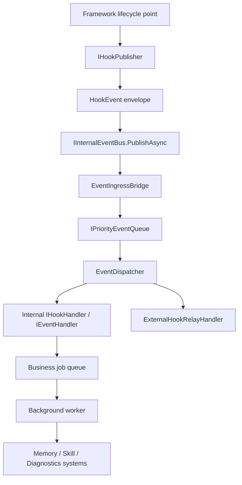
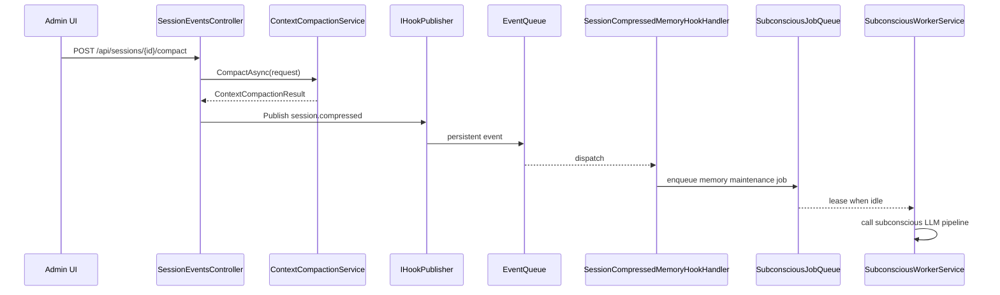

# Hook System v2 Design

> Date: 2026-06-30
> Status: partial implementation in progress
> Scope: Pudding framework lifecycle hooks, internal event pipeline, read-only external hooks, and Memory v2 R4 `session.compressed`.

## 0. Current Implementation Status

2026-06-30 implementation status:

- `IHookPublisher`, `HookEventName`, `HookPublishOptions`, canonical `HookEventNames`, and `SessionCompressedHookPayload` exist in `PuddingCore`.
- `HookPublisher` maps typed hooks to `InternalEvent` and records `hook_system` runtime activity.
- `ContextCompactionService` publishes `session.compressed` after successful compaction. This differs from the initial controller-first recommendation because it covers both manual and automatic compaction entrypoints.
- `SessionCompressedMemoryMaintenanceHook` subscribes to `session.compressed` and enqueues a durable `SubconsciousJobs` item with source hook metadata.
- `SubconsciousWorkerService` leases durable jobs first, marks them completed/retry/dead_letter through `ISubconsciousJobQueue`, and keeps the legacy `ConsolidationJob` channel as a compatibility fallback.
- Durable job idempotency is source-operation based (`memory.consolidate_session:workspaceId:sessionId:compactionId`). It is not a content hash and is not used as semantic-equivalence logic.
- `SubconsciousJobQueue` records `RuntimeActivity` trace evidence for enqueue, lease, complete, retry, and dead_letter transitions. Metadata is bounded to identifiers and state; it does not store full job content.
- `SubconsciousJobQueue` also records aggregate `TelemetryMetric` facts with `category=memory` and `name=subconscious_job.enqueue|lease|complete|retry|dead_letter`; `query_metrics.py subconscious-jobs` summarizes those metrics by `job_type + source_hook_name`.
- Legacy direct channel producers are off by default. `Subconscious:EnableLegacyConsolidationHook=true` restores the old `SubconsciousConsolidationHook`; `Subconscious:EnableLegacyAgentExecutionFallback=true` restores the older AgentExecutionService fallback enqueue path.
- No Hook publisher or handler calls the subconscious LLM directly or writes `MemoryLibrary` directly.

## 1. Goal

Hook System v2 turns framework lifecycle moments into reliable, observable, extensible events.

The immediate Memory v2 goal is R4: when a session is compressed, Pudding must automatically trigger the subconscious memory-maintenance pipeline. The broader architecture goal is to avoid building a one-off `on_session_compressed` callback and instead establish a reusable Hook substrate for future lifecycle events such as tool execution, agent completion, errors, memory writes, and sub-agent completion.

The core rule is:

```text
Hook publishers observe framework lifecycle points and publish typed events.
They do not run long business logic, call LLMs, mutate memory, or block the main user path.
```

## 2. Existing Context

The repository already has several pieces that should be reused rather than replaced:

- `IAgentLoopHook`: local Agent loop callback interface. Useful for observing loop lifecycle, but too narrow to be the full framework Hook system.
- `IInternalEventBus`: in-process pub/sub entrypoint.
- `EventIngressBridge`: subscribes to `IInternalEventBus("*")` and routes events into preprocessing and queueing.
- `IPriorityEventQueue` / `PriorityEventQueue`: persistent SQLite queue with priority, lease, retry, and dead-letter semantics.
- `EventDispatcher`: background dispatcher that routes queued events to `IEventHandler`.
- `SubconsciousConsolidationHook` / `SubconsciousWorkerService`: legacy subconscious learning path using `Channel<ConsolidationJob>`.
- ADR-027 and task42: already define the desired direction for agent-loop completion learning through events, but do not cover a complete Hook system nor the new `session.compressed` requirement.

Hook System v2 should preserve the event-system principle from ADR-016/ADR-027: the event system remains a pure pipeline and consumers connect only through handlers.

## 3. Design Principles

1. Framework-owned hooks are mandatory.
   Agent prompts cannot disable, skip, or replace hooks that enforce memory maintenance, diagnostics, audit, or safety.

2. Hook publishers are lightweight.
   Publishers validate context, build a typed payload, publish to the Hook/event pipeline, and return. They do not do LLM work.

3. Internal hooks are reliable; external hooks are best-effort.
   Internal hooks use persistent queue semantics. External hooks in v2 are read-only, async, timeout-bound, and cannot block or mutate the main flow.

4. Event and hook concepts are distinct.
   `InternalEvent` is the transport envelope. `HookEvent` is the framework lifecycle semantic contract. Hook v2 publishes hook events through the existing event pipeline.

5. Every hook action is observable.
   Publish, queue, dispatch, handler result, retry, dead-letter, and business job creation must be traceable by `sessionId`, `traceId`, `eventId`, and `hookName`.

6. Idempotency is required at the durable boundary.
   Repeated lifecycle notifications must not create duplicate active jobs or duplicate memory writes.

## 4. Architecture



### 4.1 New Semantic Layer

Add a small Hook semantic layer in `PuddingCore`:

```csharp
public interface IHookPublisher
{
    Task<string> PublishAsync<TPayload>(
        HookEventName name,
        TPayload payload,
        HookPublishOptions? options = null,
        CancellationToken ct = default);
}

public sealed record HookEventName(string Value);

public sealed record HookPublishOptions
{
    public EventPriorityLevel Priority { get; init; } = EventPriorityLevel.Normal;
    public string SourceType { get; init; } = "framework";
    public string? SourceId { get; init; }
    public string? IdempotencyKey { get; init; }
    public string? CausationId { get; init; }
}
```

`IHookPublisher` internally creates an `InternalEvent` with a canonical event type. For v2, use dot-style names:

```text
session.compressed
session.closed
agent.loop.completed
agent.loop.failed
tool.pre_execute
tool.post_execute
memory.written
memory.superseded
error.detected
subagent.completed
```

The `HookEventName` wrapper prevents random string usage from spreading through business code and gives tests a stable target.

### 4.2 Payload Contracts

Payloads should live in `PuddingCore.Models` because they cross Runtime, Platform, MemoryEngine, and diagnostics boundaries.

Initial payloads:

```csharp
public sealed record SessionCompressedHookPayload
{
    public required string WorkspaceId { get; init; }
    public required string OriginalSessionId { get; init; }
    public string? NewSessionId { get; init; }
    public string? AgentId { get; init; }
    public string? AgentTemplateId { get; init; }
    public required string CompactionId { get; init; }
    public required string Mode { get; init; }
    public required string Level { get; init; }
    public required string Reason { get; init; }
    public int? OriginalMessageCount { get; init; }
    public int? PreservedMessageCount { get; init; }
    public int? DroppedMessageCount { get; init; }
    public string? SummaryPreview { get; init; }
    public DateTimeOffset CompressedAtUtc { get; init; } = DateTimeOffset.UtcNow;
}
```

For agent-loop completion, ADR-027 already proposes `AgentLoopCompletedPayload`; Hook v2 should keep that shape but route it through `IHookPublisher`.

### 4.3 Internal Hook Handlers

Internal handlers are business bridges. They implement `IEventHandler` or a thin adapter such as `IHookHandler<TPayload>` that is invoked by an `IEventHandler`.

For R4, add:

```text
SessionCompressedMemoryMaintenanceHook
  pattern: session.compressed
  action: create durable subconscious memory-maintenance job
  does not call LLM directly
```

This handler should enqueue a durable job with an idempotency key:

```text
memory.consolidate_session:workspaceId:originalSessionId:compactionId
```

The worker later decides what to extract and where to write it.

### 4.4 External Hook Subscriptions

External hooks are not part of the reliability-critical path in v2. They are for audit, notifications, local automation, and integrations.

Supported v2 external target types:

- `audit_file`: append redacted hook event summaries.
- `command`: run a configured local command with a redacted JSON payload on stdin.
- `webhook`: POST redacted JSON to a configured URL.

External v2 constraints:

- Read-only: no payload mutation, no veto, no permission decision.
- Async: dispatched by handler from the queue, not from the publisher path.
- Timeout-bound: default 5 seconds per external target.
- Failure-isolated: failures record diagnostics and do not fail the internal hook.
- Redacted: never include full session content, full tool args, full tool output, API keys, or raw memory content.

`Docs/Config/hooks.md` can be upgraded later from v1 to v2 config while preserving `metrics`, `audit_file`, and `external` concepts.

## 5. R4 Session Compression Flow

The first implementation target should be `session.compressed`.



Placement:

- Publish after `ContextCompactionService.CompactAsync` succeeds and after any new-session redirect information is known.
- If creating the new session fails but compaction succeeds, still publish `session.compressed` with `NewSessionId = null`.
- If compaction fails, publish `session.compaction_failed` later as a separate event. Do not conflate success and failure in one hook.

## 6. Idempotency

Hook v2 has two idempotency layers:

1. Event publication idempotency.
   `IHookPublisher` should support deterministic event ids or an `IdempotencyKey` metadata field. If the same active event already exists, `PriorityEventQueue` should return the existing event id.

2. Business job idempotency.
   Hook handlers must still dedupe at the business queue. For memory consolidation, duplicate `session.compressed` events must not create duplicate non-terminal memory jobs.

Do not use content hash to decide memory semantic equivalence. Hash or fingerprint values may be used only as event/job idempotency keys for the exact same source operation.

## 7. Observability

Hook v2 must emit both trace evidence and aggregate metrics.

Trace evidence:

- `RuntimeActivity` component: add `hook_system`.
- Operations:
  - `hook.publish`
  - `hook.enqueue`
  - `hook.dispatch`
  - `hook.handler.completed`
  - `hook.handler.failed`
  - `hook.external.completed`
  - `hook.external.failed`
- Session timeline entries for session-scoped hooks.
- Event diagnostics already visible through `EventQueue` and runtime timeline.
- Durable subconscious job transitions use `RuntimeActivityComponents.Memory` operations:
  - `subconscious_job.enqueue`
  - `subconscious_job.lease`
  - `subconscious_job.complete`
  - `subconscious_job.retry`
  - `subconscious_job.dead_letter`

Metrics:

- hook publish count by hook name and status.
- queue latency p50/p95 by hook name.
- handler duration p50/p95 by handler.
- retry and dead-letter counts by hook name.
- external hook timeout/failure counts.
- memory job transition count by source hook and job type.
- durable subconscious job completion, retry, and dead-letter rates via `Tools/Diagnostics/query_metrics.py subconscious-jobs`.

Payload previews must be redacted and bounded.

## 8. Error Handling

Publisher path:

- Hook publish failure should be logged and recorded to timeline.
- For mandatory internal hooks, publish failure should return a structured warning to the caller if the caller has a response object, but should not corrupt the completed primary operation.
- For `session.compressed`, compaction success must not be rolled back because hook publication failed.

Queue/handler path:

- Handler returns `false` for retryable failures.
- EventDispatcher uses existing retry/dead-letter semantics.
- Business handlers should classify non-retryable invalid payloads and mark completed/skipped where appropriate.

External hooks:

- Never retry infinitely.
- Default to at most one retry through queue policy.
- Dead-letter external hook failures do not dead-letter internal memory-maintenance handlers.

## 9. Security and Governance

- Framework mandatory hooks are registered in DI and not editable by Agent prompts.
- External hook config is admin/system config, not workspace prompt content.
- External hook payloads pass through redaction.
- External hooks cannot mutate tool args, memory writes, or compaction output in v2.
- Future blocking hooks such as `tool.pre_execute` must integrate with the permission system, not bypass it.

## 10. Implementation Phases

### Phase 1: Hook Core

- Add `HookEventName`, `HookEventNames`, `HookPublishOptions`, and `IHookPublisher`.
- Implement `HookPublisher` over `IInternalEventBus`.
- Register hook event names in `EventSchemaRegistry`.
- Add runtime activity component `hook_system`.
- Add unit tests for event name, envelope mapping, trace propagation, and idempotency metadata.

### Phase 2: Session Compression Hook

- Add `SessionCompressedHookPayload`.
- Inject `IHookPublisher` into `SessionEventsController`.
- Publish `session.compressed` after successful compaction.
- Add tests that compact success publishes exactly one hook event and compaction failure does not publish success.

### Phase 3: Memory Maintenance Handler

- Add `SessionCompressedMemoryHookHandler`.
- Convert `session.compressed` payload into a durable subconscious memory job.
- For the first pass, the job can be dry-run or no-op if the durable job queue is not ready, but the handler result must be observable.
- Add tests for idempotent job creation.

### Phase 4: Durable Subconscious Jobs

- Implement the ADR-027/task42 durable `SubconsciousJobs` queue.
- Move `SubconsciousWorkerService` from `Channel<ConsolidationJob>` to durable lease-based jobs.
- Keep legacy `SubconsciousConsolidationHook` behind a compatibility flag to avoid duplicate learning.

Current status: first durable queue slice is implemented. Duplicate-learning prevention is now configurable at the legacy boundary, with both legacy hook registration and AgentExecutionService fallback enqueue disabled by default.

### Phase 5: External Read-Only Hooks

- Upgrade `Docs/Config/hooks.md` to v2 config.
- Add `ExternalHookRelayHandler`.
- Support `audit_file`, `command`, and `webhook` targets with redaction and timeout.

### Phase 6: Diagnostics Surface

- Extend diagnostics APIs or existing runtime timeline queries to filter by hook name.
- Add CLI/diagnostic script support for hook event/job chains.

## 11. Testing Strategy

Unit tests:

- `HookPublisher` maps hook name/payload/options to `InternalEvent`.
- Unknown or malformed hook names are rejected.
- `SessionEventsController.Compact` publishes `session.compressed` on success.
- `SessionEventsController.Compact` does not publish success hook on compaction failure.
- `SessionCompressedMemoryHookHandler` creates one job for repeated identical events.
- External hook handler redacts payload and isolates failures.

Integration tests:

- Publish `session.compressed` into `IInternalEventBus`, assert it reaches `EventQueue`.
- Run dispatcher with the memory handler, assert job creation.
- Simulate handler failure and assert retry/dead-letter behavior.

Manual smoke:

- Run local dev.
- Trigger manual compact from Admin.
- Query event diagnostics for `session.compressed`.
- Query memory job diagnostics for the created job.

## 12. Acceptance Criteria

1. Hook v2 has a stable `IHookPublisher` abstraction.
2. `session.compressed` is a registered event with a typed payload.
3. Successful session compaction publishes `session.compressed`.
4. Hook publication does not call the subconscious LLM directly.
5. The `session.compressed` event enters the persistent event pipeline.
6. A memory-maintenance handler creates a durable observable job.
7. Duplicate compression hook events do not create duplicate active memory jobs.
8. Runtime diagnostics can correlate compaction, hook event, queue dispatch, handler result, and memory job by session and trace.
9. External hooks, if enabled, are read-only and cannot block internal mandatory hooks.
10. No content hash is used as memory semantic-equivalence logic.

## 13. Non-Goals

- Do not rewrite `IInternalEventBus`, `IPriorityEventQueue`, or `EventDispatcher`.
- Do not implement external blocking hooks in v2.
- Do not let hooks directly modify memory or Skill files.
- Do not introduce ZeroMQ or another transport for v2.
- Do not remove the legacy `SubconsciousConsolidationHook` until the event path is verified and protected against duplicate learning.

## 14. Open Decisions

1. Whether `IHookPublisher` lives in `PuddingCore.Abstractions` or `PuddingCore.Runtime`.
   Recommendation: `PuddingCore.Abstractions`, because Platform and Runtime both need to publish framework hooks.

2. Whether event idempotency should be implemented in `PriorityEventQueue` or only in business job queues.
   Recommendation: support idempotency metadata in event payloads now, but rely on business job queues for hard dedupe in the first implementation.

3. Whether `session.compressed` should be published by `SessionEventsController` or `ContextCompactionService`.
   Recommendation: controller first, because it has new-session redirect information. Later, move to a compaction application service if compaction gets more entrypoints.
