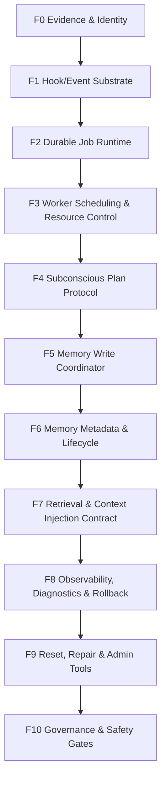

# Memory System v2 Foundation Prerequisites

> Date: 2026-07-01
> Status: design-for-review
> Scope: Memory System v2 前置基础设施规划
> Decision: 2026-07-05 起，Memory Notes 驱动的最小必要性 V1 优先；F0-F10 降级为后续增强规划。
> Simplification: `Docs/superpowers/specs/2026-07-04-memory-v2-wiki-book-v1-simplification.md`
> Minimal V1: `Docs/superpowers/specs/2026-07-05-memory-v2-minimal-v1-necessity-design.md`

---

## 1. 目标

Memory System v2 的长期目标不是把 `save_memory` 修得更聪明，而是建立一条由 Pudding 框架自动维护的记忆生产线。

2026-07-05 的 V1 决策将第一阶段收敛为 Memory Notes 驱动的最小闭环：

```text
Compression memory notes
  -> session.compressed Hook Event
  -> Durable Job
  -> Subconscious Worker
  -> Subconscious LLM page update JSON
  -> Wiki Page Write Entry upsert replace
```

长期生产线仍可演进为：

```text
Session Evidence
  -> Hook Event
  -> Durable Subconscious Job
  -> Worker Scheduling
  -> Subconscious LLM Plan
  -> Plan Validation
  -> Memory Write Coordination
  -> Retrieval / Context Injection
  -> Diagnostics / Governance
```

这条生产线必须满足三条硬约束：

1. 记忆维护由框架自动触发，不能依赖 Agent 显意识提示词。
2. 潜意识 LLM 是受限后台 Agent：只读会话记录和记忆，只输出结构化计划，不能调用普通工具、终端、文件系统、浏览器、网络或外部 API，也不能直接绕过框架写入存储。
3. 语义一致性不能依赖内容 hash；表达不同但含义相同的内容必须交给 LLM 在受控候选集内判断。

V1 修正：

- 潜意识 LLM 不再判断 `reuse_existing / append_new / supersede_existing / merge_candidates`。
- 潜意识 LLM 的主输入是压缩阶段产出的 `memoryNotes`，不是完整会话窗口。
- Plan v1 只有 `memory_wiki_page_update.v1`。
- Validator v1 只校验 JSON shape 和必填字段。
- workspace/agent/library scope 来自 job context，不由 LLM plan 决定。
- 写入入口负责 get-or-create Book/Page，并用 LLM 输出的最终内容 replace Page body。

---

## 2. 范围边界

### 2.1 本规划覆盖

- Memory v2 继续实现前必须补齐的基础设施层。
- Hook v2、SubconsciousJobs、ContextPipeline、MemoryLibrary、Diagnostics 之间的边界。
- 每个前置步骤的目标、设计方案、约束条件和验收标准。
- 当前已完成、部分完成和未开始事项的阶段化归位。
- Wiki Book v1 MVP 对 F0-F10 的降级关系。

### 2.2 本规划不覆盖

- 不继续扩展多操作 MemoryMaintenancePlan 生产代码，直到 Wiki Book v1 跑通。
- 不迁移全部历史记忆；本阶段是开发环境推进，允许重置 SQLite/FTS/本地记忆数据，不以旧数据兼容为验收目标。
- 不设计外部插件 Hook 的完整生态。
- 不在 F0-F8 阶段建设复杂前端管理界面；Admin 记忆图书馆管理界面归入 F9 验收。
- 不使用内容 hash 作为 Chapter、Fact 或 Memory item 的语义去重依据。

---

## 2.3 Wiki Book v1 MVP 覆盖范围

MVP 只覆盖：

| 能力 | MVP 处理 |
| --- | --- |
| Hook | 保留 `session.compressed` |
| Queue | 使用持久队列的 enqueue/dequeue/completed/failed 子集 |
| Worker | 保留 `SubconsciousWorkerService` |
| Plan | `memory_wiki_page_update.v1`，只有 page update |
| Validator | JSON shape + 必填字段 |
| Write | get-or-create Book/Page + replace + save |

MVP 暂不覆盖：

- F0 完整 evidence chain。
- F3 idle / budget / scheduling。
- F6 TTL / lifecycle。
- F7 复杂 retrieval contract。
- F8 完整 observability。
- F9 Admin UI v2。
- F10 governance gates。

这些不是取消，而是不作为 Wiki Book v1 的阻塞项。

---

## 3. 总体依赖图



依赖原则：

- 后层不能绕过前层直接落地功能。
- 每层必须同时有 Trace 证据和 Metrics 事实。
- 每个阶段完成后，必须能独立验证，不依赖后续阶段“补救”。

---

## 4. 前置基础设施分层

| 层级 | 名称 | 目标 | 解锁能力 | 当前状态 |
| --- | --- | --- | --- | --- |
| F0 | Evidence & Identity | 统一会话、压缩、Hook、Job、记忆写入的关联身份 | 可追溯每条记忆来源 | partial |
| F1 | Hook/Event Substrate | 用 Hook v2 承接框架生命周期事件 | `session.compressed` 等事件可靠入管道 | partial |
| F2 | Durable Job Runtime | 用持久任务替代内存 channel 和显意识维护 | 潜意识任务可恢复、可重试、可死信 | partial |
| F3 | Worker Scheduling & Resource Control | 控制后台 Worker 的 idle、workspace、并发和预算 | 防止潜意识任务干扰前台对话 | done-pre-llm |
| F4 | Subconscious Plan Protocol | 定义 LLM 只输出计划，不直接写库 | LLM 判断可审计、可校验、可回滚 | done-pre-executor |
| F5 | Memory Write Coordinator | 统一所有记忆写入、取代、合并、删除入口 | 防止各入口重复造记忆 | partial-execute-append |
| F6 | Memory Metadata & Lifecycle | 建立来源、置信度、TTL、版本链、状态模型 | 支撑半衰期和取代语义 | partial |
| F7 | Retrieval & Context Injection Contract | 规范记忆召回和 L6 注入格式 | 防检索污染、防来源混淆 | pending |
| F8 | Observability, Diagnostics & Rollback | 提供 Trace、Metrics、诊断脚本、回滚路径 | 可解释失败、可度量质量 | partial |
| F9 | Reset, Repair & Admin Tools | 提供开发环境重置、诊断修复和 Admin 记忆图书馆管理界面 | v2 schema 可重置验收，Memory Library 可视化管理 | pending |
| F10 | Governance & Safety Gates | 建立配置、兼容开关、阶段门禁 | 防止功能绕过基础设施 | pending |

---

## 5. 分阶段实施方案

### Step 0: 冻结方向与基线

**目标**

- 把 Memory v2 从“继续补功能”调整为“先补基础设施”。
- 明确当前已经完成的 R1/R2/R4/R9 只是局部阶段，不代表 Memory v2 可继续纵向堆功能。

**设计方案**

- 新增本规划文档作为 Memory v2 前置路线图。
- 在 `memory/memory-system-v2-requirements.md` 中挂接本规划，并标注当前状态为 foundation-planning。
- 2026-07-04 修订后，Wiki Book v1 MVP 先按四组件链路推进；F0-F10 用作后续增强和治理规划，不再作为 MVP 串行门槛。

**约束条件**

- 不回滚已经完成的 R9、R1 局部、R2 Chapter 版本链、R4 Hook v2 / SubconsciousJobs 工作。
- 不在未更新设计边界前继续新增生产代码。
- 不把本规划写成开放 TODO；每个阶段必须有验收标准。

**验收标准**

- 存在一份基础设施规划文档，说明 Wiki Book v1 MVP 与 F0-F10 后续增强的关系。
- 需求文档明确引用该规划。
- 决策日志记录“先评审基础设施规划，再继续实现”。

---

### Step 1: F0 Evidence & Identity

**目标**

- 让 Session、Compression、HookEvent、SubconsciousJob、MemoryOperation、MemoryItem 之间具备稳定关联链。
- 后续任何记忆都能回答：它来自哪个会话、哪个 Hook、哪个 Job、哪次 LLM 计划、哪次写入操作。

**设计方案**

- 统一最小身份字段：
  - `workspaceId`
  - `sessionId`
  - `agentInstanceId`
  - `templateId`
  - `hookEventId`
  - `sourceOperationId`
  - `subconsciousJobId`
  - `memoryOperationId`
- 将身份字段作为事件、任务、计划、写入结果的公共 envelope，而不是散落在业务 payload 中。
- `sourceOperationId` 用于来源级幂等，例如同一次压缩事件只生成一条维护任务；它不表达语义一致性。

**约束条件**

- 不使用内容 hash 判断两条记忆语义是否相同。
- 可为审计、缓存、诊断保存短预览或精确字节 hash，但这些字段不能参与语义复用、取代、合并决策。
- 身份字段必须支持跨进程恢复和日志追踪。

**验收标准**

- Hook 事件、Subconscious Job、潜意识计划和记忆写入结果能通过 ID 串联。
- 诊断脚本至少能从 `sessionId` 或 `subconsciousJobId` 反查相关事件。
- 文档明确区分“来源幂等”和“语义一致性”。

---

### Step 2: F1 Hook/Event Substrate

**目标**

- 形成完整、可扩展的 Hook v2 基础设施，让后续 Memory v2 触发点不再散落在业务代码中。

**设计方案**

- 保持现有方向：`IHookPublisher` 只发布强类型 Hook 事件。
- 复用 `IInternalEventBus`、`EventIngressBridge`、`IPriorityEventQueue`、`EventDispatcher` 完成可靠派发。
- Hook publisher 和 Hook handler 都不直接调用 LLM，不直接写 MemoryLibrary。
- 内部 Hook 承担框架可靠管道；外部 Hook 第一阶段只做只读异步订阅。

**约束条件**

- Hook 不是业务逻辑执行器，只是框架生命周期事件的可靠入口。
- Hook payload 必须版本化，字段必须可审计。
- `session.compressed` 是第一条必须稳定的 Hook，不应再增加并行的旧式重复入口。

**验收标准**

- `session.compressed` 压缩成功后只进入 Hook v2 管道。
- 旧 `ConsolidationJob` producer 默认关闭，仅通过显式 legacy 配置启用。
- Hook 事件具备 Trace 和 Metrics，能看到发布、派发、处理结果。

---

### Step 3: F2 Durable Job Runtime

**目标**

- 把潜意识维护任务变成持久、可恢复、可重试、可死信的后台任务，而不是内存 channel 或显意识心跳。

**设计方案**

- 以 `SubconsciousJobs` 作为潜意识任务唯一 durable queue。
- 任务状态至少包含：
  - `pending`
  - `leased`
  - `completed`
  - `retry`
  - `dead_letter`
- 每次状态转换写 Trace 证据层和 Metrics 事实层。
- Job payload 只保存执行所需结构化字段，不保存完整上下文原文；原始证据通过 session timeline 或诊断包回溯。

**约束条件**

- durable queue 是可靠边界，不能被内存 channel 旁路。
- 幂等键只针对来源操作，不能作为语义去重。
- 失败重试必须有上限和死信路径。

**验收标准**

- Worker 重启后仍能 lease 未完成任务。
- 重复 `session.compressed` 事件不会无限生成同源任务。
- 诊断脚本能输出完成率、重试率、死信率和最后错误。

---

### Step 4: F3 Worker Scheduling & Resource Control

**目标**

- 保证潜意识后台任务只在合适时机运行，不抢前台会话资源，不跨 workspace 互相污染。

**设计方案**

- 增加 idle detector 合约，区分：
  - 前台 LLM 正在生成
  - 用户正在交互
  - 会话刚压缩完成但仍可能继续对话
  - 系统处于空闲窗口
- 增加 workspace concurrency limiter：
  - 全局最大并发
  - 单 workspace 最大并发
  - 单 agent/session 限制
- 增加预算控制：
  - 每轮最多处理 Job 数
  - 每个 workspace 每小时最多潜意识 token
  - dead letter 前最大重试次数

**约束条件**

- 不因为记忆维护导致用户对话延迟显著上升。
- 不允许某个 workspace 的积压任务长期饿死其他 workspace。
- 调度策略必须可配置、可诊断。

**验收标准**

- 存在明确的 idle 判定规则和配置项。
- 存在 workspace 级并发限制和回归测试。
- Metrics 能按 workspace 统计排队时间、lease 延迟、执行耗时、跳过原因。

---

### Step 5: F4 Subconscious Plan Protocol

**目标**

- Wiki Book V1 把潜意识 LLM 的职责固定为“基于 memory notes 生成 page update JSON”，而不是扫描完整会话窗口、直接写 MemoryLibrary，也不是选择 reuse/append/supersede/merge。

**设计方案**

- 定义 `memory_wiki_page_update.v1`：
  - `schema`
  - `updates[]`
  - `update.book`
  - `update.page`
  - `update.content`
- Validator v1 只检查：
  - JSON 可解析。
  - schema 正确。
  - updates 非空。
  - book/page/content 非空。
- workspace、agent、library、session、job 不从 LLM plan 读取，由 durable job context 注入写入入口。

**约束条件**

- LLM 输出不能直接成为数据库写入。
- plan 不表达 delete。
- plan 不表达 reuse/append/supersede/merge。
- 低置信度 quarantine 不进入 Wiki Book v1。

**验收标准**

- 存在稳定的 `memory_wiki_page_update.v1` schema 文档。
- 至少有一个单页 update fixture 和一个多页 updates fixture。
- validator 能拒绝非法 JSON、缺 book、缺 page、缺 content。

---

### Step 6: F5 Memory Write Coordinator

**目标**

- Wiki Book V1 将 F5 收敛为 Wiki Page 写入入口，统一处理 page update 的 get-or-create、replace、save。
- 支撑 Memory Library 的 Notebook/Page Tree 语义：当前代码中的 `Book` 作为 Notebook 兼容命名，`Chapter` 作为 Page 兼容命名。

**设计方案**

- 新增或收敛逻辑上的 `WikiPageWriteEntry`。
- 对每个 edit 执行：
  1. normalize book title。
  2. normalize page path。
  3. get-or-create Notebook/Book。
  4. get-or-create Page/Chapter by path。
  5. merge existing content with new content。
  6. save Page。
- 当前 `MemoryWriteCoordinator` 可以作为代码承载位置，但 Wiki Book v1 不需要多 intent command、dry-run、冲突检测或 LLM 语义决策。
- 精确结构幂等由 Book title、Page path 和内容段落去重处理。

**约束条件**

- 不允许新增绕过 Wiki Page 写入入口的记忆写入路径。
- 不允许通过内容 hash 判定语义相同。
- MVP 不做复杂冲突检测、来源追踪、dry-run 阶段机或多操作协调。
- 开发环境允许破坏旧数据兼容并重置数据库；写入入口不需要承担旧 schema 迁移或历史数据 backfill。

**验收标准**

- 潜意识 page update JSON 能写入同一套 Wiki Page 写入入口。
- 同一 workspace 内重复写入同名 Notebook/Book 不产生重复 Notebook/Book。
- 同一 page path 重复写入不产生重复 Page，并替换为最新 page content。

---

### Step 7: F6 Memory Metadata & Lifecycle

**目标**

- 为 R2 取代语义、R3 半衰期管理、R7 检索防污染提供统一元数据模型。

**设计方案**

- 每条记忆至少具备：
  - `memoryType`
  - `sourceKind`
  - `sourceConfidence`
  - `createdAt`
  - `lastUsedAt`
  - `expiresAt`
  - `status`
  - `supersedes`
  - `supersededBy`
  - `usageCount`
  - `retrievalScope`
- 按记忆类型定义 TTL：
  - 项目事实：长 TTL
  - 用户偏好：中长 TTL
  - 临时任务状态：短 TTL
  - 诊断线索：短 TTL 或只进 Trace
- 生命周期 Worker 只改变状态和索引，不直接删除原始证据。

**约束条件**

- 删除、过期、取代必须区分语义。
- 默认检索不返回 superseded、expired、deleted 内容。
- 精确审计可查看历史，但必须显式请求。

**验收标准**

- 默认检索过滤非 active 内容。
- `include_history=true` 能返回版本链并标注关系。
- TTL 策略可配置，并有 dry-run 诊断输出。

---

### Step 8: F7 Retrieval & Context Injection Contract

**目标**

- 防止记忆召回污染 L6 上下文，让模型能区分“事实、推断、历史版本、低置信度内容”。

**设计方案**

- L6 注入统一格式：
  - 来源类型
  - 置信度
  - 新鲜度
  - 是否 active
  - 是否被取代
  - 召回原因
  - 可点击或可追踪 ID
- 模糊指令保护：
  - “继续”“接着来”“按之前的”不直接触发宽语义检索。
  - 先使用当前 thread/session/task 上下文。
  - 缺少明确对象时询问用户或使用最近明确焦点。
- 检索结果进入上下文前做排序、去重、预算裁剪。

**约束条件**

- 不把记忆内容伪装成 system truth。
- 不让 archived/superseded/expired 内容默认进入 L6。
- 不允许模糊查询扫全库后把噪声注入上下文。

**验收标准**

- L6 中每条注入记忆都带来源和置信度。
- 模糊查询不触发全库语义召回。
- 诊断能展示每条注入记忆的召回原因和裁剪原因。

---

### Step 9: F8 Observability, Diagnostics & Rollback

**目标**

- 让 Memory v2 的每一步都能被还原、统计、调试和回滚。

**设计方案**

- Trace 层保存可还原证据：
  - Hook event
  - Job transition
  - Plan input reference
  - Plan output preview
  - Write operation result
- Metrics 层保存可聚合事实：
  - job count
  - completion rate
  - retry rate
  - dead letter rate
  - plan accepted/rejected count
  - memory reuse/append/supersede ratio
  - retrieval hit/use ratio
- Diagnostics 提供 CLI 查询和诊断包导出。
- 每个写入批次都有 rollback strategy：逻辑回滚、版本恢复或状态修正。

**约束条件**

- 默认不长期保存完整上下文、完整工具参数、完整 LLM 输出。
- Debug 模式只能写脱敏、截断预览。
- Metrics 字段必须稳定命名，不能只写自然语言 summary。

**验收标准**

- 能从 jobId 追踪到 plan 和写入结果。
- 能按 workspace 统计记忆维护质量。
- 能 dry-run 展示即将执行的写入计划。

---

### Step 10: F9 Reset, Repair & Admin Tools

F9 的详细设计已拆分到独立文档：

```text
Docs/superpowers/specs/2026-07-03-memory-v2-f9-reset-repair-admin-tools-design.md
```

**目标**

- 在新基础设施可用后，提供开发环境重置、诊断修复和 Admin 记忆图书馆管理能力。
- 将 `/admin/memory-library` 纳入 Memory v2 验收，确保 Notebook/Page Tree 与知识图谱关系可以被人类查看、验证和维护。

**设计方案**

- 提供开发环境重置工具：
  - 停止服务。
  - 清理 SQLite/FTS/本地记忆数据。
  - 重新初始化 Memory v2 schema。
  - 生成默认 workspace/agent/library。
- 提供诊断扫描器：
  - 找重复 Notebook/Book 标题。
  - 找 archived/superseded 但仍被默认检索的内容。
  - 找无来源元数据的 Page/Chapter。
  - 找断裂的 Page Tree、孤儿关系边、孤儿 SourceReference。
- 提供 Admin 记忆图书馆管理界面：
  - 复用现有 `/admin/memory-library` 路由。
  - 左侧选择 workspace/agent/library。
  - 中间展示 Notebook/Page Tree。
  - 右侧展示 Page Markdown、来源、状态、版本链、关系边。
  - 支持创建 Notebook、创建子 Page、编辑 Page、移动 Page、添加关系边、搜索和删除/归档。
- 修复和 UI 写入流程必须通过 MemoryWriteCoordinator；大批量合并、删除、取代必须具备 dry-run 和可观测结果。

**约束条件**

- 不以旧数据兼容为目标；开发环境可通过重置数据库完成验收。
- 不让重置脚本、修复脚本或 Admin 前端绕过写入规则。
- 不用 hash 批量判断语义重复；只能作为候选聚类辅助，最终由 LLM 在受控候选内判断。
- Admin UI 不承担业务记忆判断，只提供底层 Notebook/Page Tree 和关系图谱的管理入口。
- 前端包管理使用 `pnpm`，不使用 `npm`。

**验收标准**

- 有可复现的开发环境重置流程，重置后 v2 schema、FTS、默认 Memory Library 初始化正常。
- 有 dry-run 诊断报告，显示预计影响的 Notebook/Page/Fact/Relation。
- `/admin/memory-library` 能加载默认 workspace/agent/library，并展示 Notebook/Page Tree。
- Admin UI 能创建 Notebook、创建子 Page、编辑 Page、添加关系边，并在刷新后保持结构稳定。
- 搜索结果展示 Page 路径、来源、状态、superseded 标记和关系摘要。
- 删除/归档后，Admin UI、搜索结果和后端 API 状态一致。
- 至少有一组前端测试或 Playwright 验收覆盖页面加载、树展开、Page 详情和基础写入路径。

---

### Step 11: F10 Governance & Safety Gates

**目标**

- 建立 Memory v2 后续推进的工程门禁，防止重新走向补丁式增长。

**设计方案**

- 每个 Memory v2 任务必须声明：
  - 映射到哪个 F 层
  - 覆盖哪个 R 需求
  - 是否改变写入、检索、Hook、Worker 或诊断边界
  - 验证命令和回滚方式
- legacy 路径必须默认关闭，显式开关才能启用。
- 新增 Hook、Job、Plan operation、Memory write path 必须同步补 Trace 和 Metrics。

**约束条件**

- 不允许只靠 prompt 约束 Agent 行为来满足框架需求。
- 不允许新增未观测的后台任务。
- 不允许新增未经过 Wiki Book v1 JSON shape 校验或后续等价 validator 的 LLM 写入动作。

**验收标准**

- Wiki Book v1 MVP 任务可在四组件链路中定位；后续增强任务可在 F0-F10 中定位。
- PR 或变更说明能列出对应 R 需求、基础设施层和验证证据。
- 存在明确的“不得继续实现”的阻断条件。

---

## 6. 当前状态归位

### Done

- R9 真删除：`delete_book` 已从假删除改为从索引移除。
- R1 第一阶段：workspace scoped Book 候选、Chapter exact 复用、LLM 语义复用/取代候选、同 Library active Book 并发唯一。
- R2 第一阶段：Chapter supersede 版本链。
- R4 第一阶段：Hook System v2 设计完成，`session.compressed` 已接入 `IHookPublisher`。
- R4 第二阶段：`SubconsciousJobs` durable queue、lease、complete、retry、dead letter 基础路径。
- R4/R11 第一阶段：SubconsciousJobs Trace 和 Metrics。
- legacy duplicate-learning 开关：旧 producer 默认关闭，仅显式配置启用。
- F3 Worker Scheduling & Resource Control：idle、dry-run、global/workspace/session limiter、workspace rolling job-count budget 和 skip diagnostics 已完成第一实现。

### Partial

- F0 Evidence & Identity：已有部分 Hook/Job 身份字段，但 plan/write/retrieval 关联链未完整。
- F1 Hook/Event Substrate：内部 Hook 主线形成，但 Hook 目录、schema registry、外部只读订阅边界仍需收口。
- F2 Durable Job Runtime：基础 durable queue 已有，队列体检和管理入口仍未完整。
- F4 Subconscious Plan Protocol：plan schema、validator、fixtures、潜意识 LLM dry-run 计划生成、validator 结果可观测、Job result envelope 和低置信度/非法 plan 降级策略已完成第一实现；低置信度结果自动 `quarantined`，不等待人审；还未把潜意识 Worker 接入自动真实写入。
- F6 Metadata & Lifecycle：Chapter 版本链已有，Fact、TTL、source confidence、usage metadata 未完整。
- F8 Observability：Job Metrics 已有，plan/write/retrieval 级 Metrics 未完整。

### Pending

- Minimal V1：把潜意识 Worker 的输入从完整会话窗口收敛为压缩阶段 `memoryNotes`，把输出从多操作 `MemoryMaintenancePlan` 收敛为 `memory_wiki_page_update.v1`，并接入 `WikiPageWriteEntry` 真写入。
- F5 统一 Memory Write Coordinator：已有第一实现保留为历史代码和后续增强候选；不再作为当前 MVP 的执行主线。
- F7 L6 记忆注入契约和模糊查询保护。
- F9 开发环境重置、诊断修复、Admin 记忆图书馆管理界面和 dry-run 工具。
- F10 阶段门禁和治理规则。

---

## 7. 推荐下一里程碑

2026-07-05 修订后，下一里程碑不是 `append_new autonomous execute`，也不是旧 edit-page fragment merge，而是 Memory Notes 驱动的 Page Update 最小闭环：

```text
Milestone W1: Memory Notes Page Update Loop
```

设计文档：

```text
Docs/superpowers/specs/2026-07-05-memory-v2-minimal-v1-necessity-design.md
Docs/superpowers/specs/2026-07-04-memory-v2-wiki-book-v1-simplification.md
```

目标链路：

```text
compression memoryNotes
  -> session.compressed
  -> durable queue
  -> SubconsciousWorkerService
  -> subconscious LLM
  -> memory_wiki_page_update.v1
  -> WikiPageWriteEntry
  -> MemoryLibrary
```

实施范围：

- 压缩阶段新增最小 `memoryNotes` 输出。
- 新增 `memory_wiki_page_update.v1` DTO 与 schema fixture。
- Validator v1 只校验 JSON shape、`updates[]` 非空、`book/page/content` 必填。
- 潜意识 LLM 以 `memoryNotes` 为主输入，只输出 `book/page/content`，不输出 `reuse_existing/append_new/supersede_existing/merge_candidates`。
- `WikiPageWriteEntry` 负责 get-or-create Book、get-or-create Page、replace content、save。
- scope 隔离由 job context 注入，不允许 LLM plan 选择 workspace/agent/library/session。
- 通过脚本或 debug API 触发一次 `session.compressed` 后的真实写入，并验证不会产生重复 Book/Page。

旧 F5 coordinator、dry-run envelope、reuse/supersede/merge、TTL、Admin command 化和复杂观测都保留为后续增强，不阻塞 W1。

理由：

- F4 已具备可审计 plan 结果和降级策略。
- F5 已明确采用统一 `MemoryWriteCoordinator`，而不是让 F4 executor 或 `UpsertExperienceAsync` 各自扩展规则。
- 没有 Write Coordinator，`save_memory`、潜意识 Worker、Admin 工具会继续各自实现去重/取代/删除规则。

---

## 8. Milestone A 详细设计：F3 Worker Scheduling & Resource Control

### 8.1 本里程碑目标

F3 的目标是回答一个基础问题：`SubconsciousJobs` 已经可以可靠入队后，什么时候、以什么预算、在哪个 workspace 范围内可以执行。

F3 不解决“潜意识 LLM 该写什么记忆”，只解决后台任务的运行资格、并发控制、资源预算和可观测性。完成 F3 后，F4 的 plan protocol 才有稳定执行环境。

### 8.2 设计选项

| 选项 | 方案 | 优点 | 风险 | 结论 |
| --- | --- | --- | --- | --- |
| A | Worker 看到 pending job 就立即 lease | 实现最简单，能快速消费队列 | 可能抢占前台对话资源，无法解释跳过/延迟原因 | 不采用 |
| B | 固定时间窗口批处理，例如每 N 分钟跑一次 | 行为可预测，易于限流 | 与真实空闲状态脱节，可能在用户活跃时运行，也可能空闲时长期等待 | 不作为主方案 |
| C | idle detector + workspace limiter + budget gate | 能保护前台体验，并支持公平调度和诊断 | 需要多一个调度判定层 | 推荐 |

推荐采用选项 C。原因是 Memory v2 的核心约束是后台自动维护不能干扰显意识对话，且后续 LLM plan 会引入真实 token 成本；如果没有 idle、workspace 和预算门禁，后续问题会被放大到 F4/F5。

### 8.3 运行边界

F3 位于 durable queue 和真正 job execution 之间：

```text
SubconsciousJobs pending
  -> Scheduler Tick
  -> Idle Detector
  -> Workspace Limiter
  -> Budget Gate
  -> Lease Decision
  -> Worker Execution
  -> Job Transition Metrics
```

边界规则：

- Scheduler 可以决定是否 lease job，但不能修改记忆内容。
- Idle detector 只判断运行窗口，不读取或总结会话内容。
- Workspace limiter 只处理公平性和并发，不参与语义判断。
- Budget gate 只处理次数、耗时和 token 预算，不决定记忆是否重要。

### 8.4 组件设计

#### 8.4.1 SubconsciousScheduler

**职责**

- 周期性扫描可运行任务。
- 调用 idle detector、workspace limiter、budget gate。
- 对每个 job 产出明确决策：
  - `lease_allowed`
  - `skip_foreground_busy`
  - `skip_workspace_limit`
  - `skip_global_limit`
  - `skip_budget_exhausted`
  - `skip_backoff_not_elapsed`
  - `skip_disabled`

**约束**

- Scheduler 不直接执行 LLM 调用。
- Scheduler 不直接写 MemoryLibrary。
- Scheduler 的每次跳过都必须可观测。

**验收**

- 每次 tick 能输出扫描数、允许 lease 数、跳过数和跳过原因。
- 同一个 job 被跳过时不会改变其语义状态，只更新调度观察指标。

#### 8.4.2 IdleDetector

**职责**

- 判断当前系统是否适合运行潜意识后台任务。
- 给出结构化结果，而不是布尔值：
  - `isIdle`
  - `reason`
  - `activeForegroundSessions`
  - `lastUserActivityAt`
  - `lastAssistantTokenAt`
  - `cooldownUntil`

**建议规则**

- 当前存在前台 LLM 生成时，不运行潜意识任务。
- 用户刚发送消息或助手刚结束输出后的短 cooldown 内，不运行潜意识任务。
- 同一 session 刚压缩后允许延迟执行，避免用户继续追问时争抢资源。
- 开发环境可以使用较短 cooldown，生产环境使用更保守配置。

**约束**

- idle 判定不能依赖 Agent prompt。
- idle 判定不能读取完整上下文内容。
- idle 判定必须能在诊断中解释“为什么现在不跑”。

**验收**

- 前台生成期间，潜意识 job 不会被 lease。
- cooldown 期间，job 只记录 skip reason，不进入执行。
- 空闲窗口内，job 可进入 limiter 和 budget gate。

#### 8.4.3 WorkspaceLimiter

**职责**

- 控制全局和 workspace 级并发。
- 防止某个 workspace 的积压任务独占 worker。
- 支持公平轮转。

**建议策略**

- `maxGlobalConcurrentSubconsciousJobs`
- `maxWorkspaceConcurrentSubconsciousJobs`
- `maxSessionConcurrentSubconsciousJobs`
- `workspaceRoundRobinWindow`

**约束**

- limiter 不能跨 workspace 泄露内容。
- 不能因为某个 workspace 死信或大量重试导致其他 workspace 饿死。
- 公平性策略要以 job metadata 为依据，不读取 payload 原文。

**验收**

- 单 workspace 不超过配置的并发上限。
- 多 workspace 同时有 pending job 时能轮转消费。
- 某个 workspace 的失败重试不会阻塞其他 workspace。

#### 8.4.4 BudgetGate

**职责**

- 限制潜意识任务的频率、token 和失败成本。
- 在真正接入 LLM 前先建立预算口径。

**预算维度**

- 每 tick 最大 lease 数。
- 每 workspace 每小时最大 job 数。
- 每 workspace 每日潜意识 token 预算。
- 每 job 最大重试次数。
- 每 job 最大累计执行耗时。

**约束**

- F3 阶段可以先记录 token budget placeholder，但不实际调用 LLM。
- 预算耗尽必须表现为 skip，不应把 job 直接标记失败。
- dead letter 只用于达到明确失败条件的 job，不用于普通预算等待。

**验收**

- 超出预算的 job 保持 pending 或 delayed，并记录 `skip_budget_exhausted`。
- 预算恢复后 job 可继续被 lease。
- Metrics 能展示预算命中和预算拒绝次数。

### 8.5 Job 调度状态

F3 不改变现有 job 语义状态体系，但需要增加调度视角：

```text
pending
  -> scheduler_seen
  -> skipped(reason)
  -> lease_allowed
  -> leased
  -> completed | retry | dead_letter
```

实现时可以不新增持久 job status，而是在 Trace/Metrics 中记录 `scheduler_seen` 和 `skipped(reason)`。是否新增 `delayed_until` 字段应在实现计划阶段决定；本规划只要求具备等价能力。

### 8.6 配置草案

建议配置分组为 `Subconscious:Scheduling`：

```text
Enabled
TickIntervalSeconds
IdleCooldownSeconds
ForegroundGenerationBlocksExecution
MaxGlobalConcurrentJobs
MaxWorkspaceConcurrentJobs
MaxSessionConcurrentJobs
MaxJobsPerTick
MaxJobsPerWorkspacePerHour
MaxRetryAttempts
RetryBackoffSeconds
BudgetWindowMinutes
DryRun
```

配置原则：

- 默认启用安全模式：保守 idle、低并发、低每 tick 数。
- `DryRun=true` 时只记录 would-lease / would-skip，不执行 job。
- legacy producer 开关继续保持默认关闭，不因为 F3 恢复旧入口。

### 8.7 Metrics 与 Trace

F3 至少增加这些可观测事实：

| 类别 | 字段 |
| --- | --- |
| scheduler tick | tick id、pending count、eligible count、leased count、skipped count |
| idle decision | is idle、reason、cooldown remaining、foreground active count |
| limiter decision | workspace active count、global active count、limit type |
| budget decision | budget window、used count、remaining count、reject reason |
| lease latency | enqueue to first seen、enqueue to lease、retry backoff remaining |

关键约束：

- Metrics 不保存完整 job payload。
- Debug preview 必须脱敏和截断。
- skip reason 必须是枚举值，不能只写自然语言。

### 8.8 诊断入口

F3 完成后，诊断工具应能回答：

- 当前有多少 pending / leased / retry / dead letter job。
- 哪些 workspace 正在积压。
- 最近一段时间 job 为什么没有执行。
- 是否因为前台忙碌、workspace limit、global limit、budget、backoff 或 disabled 被跳过。
- 某个 job 从 enqueue 到 lease 经历了多久。

建议诊断输出：

```text
subconscious-jobs health
subconscious-jobs scheduling --workspace <workspaceId>
subconscious-jobs skips --since 24h
```

本规划只定义诊断能力，不要求本阶段建设复杂 UI。

### 8.9 测试与验收矩阵

| 场景 | 验收标准 |
| --- | --- |
| 前台 LLM 正在生成 | job 不被 lease，记录 `skip_foreground_busy` |
| 用户刚交互完处于 cooldown | job 不被 lease，记录 `skip_cooldown` |
| 系统空闲且预算充足 | pending job 可被 lease |
| 单 workspace 超并发 | 多余 job 被 skip，记录 `skip_workspace_limit` |
| 全局超并发 | 多余 job 被 skip，记录 `skip_global_limit` |
| workspace 预算耗尽 | job 不失败，记录 `skip_budget_exhausted` |
| 重试 backoff 未到 | job 不被 lease，记录 `skip_backoff_not_elapsed` |
| 多 workspace 积压 | 调度不会长期只消费一个 workspace |
| dry-run 开启 | 只记录 would-lease，不执行 job |

### 8.10 明确不做

- 不调用潜意识 LLM。
- 不生成 MemoryMaintenancePlan。
- 不执行 MemoryLibrary 写入。
- 不做 TTL 清理。
- 不做历史数据迁移；开发环境后续以数据库重置为准。
- 不在 F3 阶段新增前端 UI；Admin 记忆图书馆管理界面归入 F9 验收。

### 8.11 F3 完成后的下一步

历史规划中，F3 验收通过后进入：

```text
Milestone B: F4 Subconscious Plan Protocol
```

2026-07-05 后，该路径已被 Minimal V1 简化：F4 多操作 plan、低置信度降级和 plan dry-run 作为历史实现与后续增强保留；当前 W1 只需要 `memoryNotes`、`memory_wiki_page_update.v1` 的 JSON shape 校验和真实 Page replace 写入闭环。

### 8.12 F3 实施计划

F3 的可执行实施计划已拆分到：

```text
Docs/superpowers/plans/2026-07-01-memory-v2-f3-worker-scheduling-plan.md
```

计划采用 TDD 顺序推进：

1. 先补 `SubconsciousOptions`、DTO 和 `ISubconsciousJobQueue` 调度契约。
2. 再让 `SubconsciousJobQueue` 支持过滤 lease、队列统计和调度 skip metrics。
3. 然后新增 `SubconsciousJobScheduler`，在 Worker lease 前执行 idle、workspace、global、budget、dry-run 判定。
4. 最后补 Runtime DI、诊断脚本和文档状态。

该计划仍保持 F3 边界：不调用潜意识 LLM，不生成 MemoryMaintenancePlan，不写 MemoryLibrary。

### 8.13 F3 第一实现状态

2026-07-01 已完成 F3 第一实现：

- `SubconsciousOptions.Scheduling` 提供调度开关、dry-run、idle cooldown、全局/workspace/session 并发和重试配置。
- `SubconsciousJobScheduler` 在 Worker lease 前执行 enabled、idle、global/workspace/session limiter 与 dry-run 判定。
- durable queue 支持 lease query 排除 workspace/session、最大 retry 过滤、queue stats、workspace rolling lease count 和 `subconscious_job.schedule_skip` 可观测事件。
- `SubconsciousWorkerService` durable path 已通过 scheduler lease，不再直接 pending job 即执行。
- `Tools/Diagnostics/query_metrics.py subconscious-jobs` 已输出 `scheduleSkips` 与 `skipReasons`。
- 每 workspace 滚动窗口 job-count 预算门禁已接入 `MaxJobsPerWorkspacePerHour` 与 `BudgetWindowMinutes`，达到上限的 workspace 会被本轮 lease 排除，并在无可选 job 时记录 `skip_budget_exhausted`。

当前未宣称完成：真实 token/cost 预算需要等 F4/F5 接入潜意识 LLM plan 和执行指标后再做；F3 阶段仍不接入潜意识 LLM plan，不写 MemoryLibrary。

---

## 9. Milestone C 详细设计：F5 Memory Write Coordinator（后续增强）

F5 的详细设计已拆分到独立文档，但 2026-07-04 后不再作为 Wiki Book v1 MVP 的执行主线：

```text
Docs/superpowers/specs/2026-07-01-memory-v2-f5-write-coordinator-design.md
```

长期增强设计结论：

- `MemoryWriteCoordinator` 可作为后续所有记忆写入、复用、取代、合并、归档、删除请求的统一协调层。
- 所有入口可先转换为 `MemoryWriteCommand`，再进入 validator、候选解析、dry-run/execute 和 audit envelope。
- 多操作 F4 `MemoryMaintenancePlan` 不再是 Wiki Book v1 MVP；后续若恢复，不能直接写 `MemoryLibrary`，必须通过 plan operation mapper 转成 coordinator command。
- F4 的 `delete` action 只映射为 `delete_requested`，在潜意识自主维护路径中直接返回 `autonomous_delete_not_allowed`，不允许潜意识自动真删除 active 记忆。
- `MemoryLibraryConvenience.UpsertExperienceAsync` 后续迁移为薄 wrapper，内部调用 coordinator，不再独立承载去重/取代策略；该 wrapper 只服务开发期调用兼容，不承担旧数据兼容。
- Admin 记忆图书馆管理界面的写入操作后续也必须转换为 coordinator command，不能直接绕过框架调用底层 MemoryLibrary。
- 第一阶段已实现 DTO、validator、coordinator dry-run、F4 operation mapper、可观测事件、Job result envelope 持久化审计、Worker durable dry-run 串接和显式 `append_new execute`。
- F5 实施计划已执行 F5a/F5b/F5c；这些产物保留为历史实现和后续增强参考，当前 W1 不继续沿 `append_new execute` 扩展。

F5 后续增强验收重点：

- 缺 source、跨 workspace、缺 content、非法 intent 被拒绝。
- 合法 append/supersede/reuse dry-run 不写库，只返回预测结果。
- 潜意识 delete plan 不真删，只返回 `autonomous_delete_not_allowed`。
- F4 accepted envelope 进入 F5 后仍重新校验，不信任 envelope 本身。
- coordinator reject 记录 Trace/Metrics，不调用 `MemoryLibrary` 写入方法。

---

## 9.1 Milestone D 详细设计：F9 Reset, Repair & Admin Tools

F9 的详细设计已拆分到独立文档：

```text
Docs/superpowers/specs/2026-07-03-memory-v2-f9-reset-repair-admin-tools-design.md
```

核心设计结论：

- 本阶段不保留旧数据兼容性，开发环境通过 reset 获得干净 Memory v2 schema。
- F9 提供 reset 工具、diagnostics dry-run、Admin Memory Library v2 管理界面和后续受限 repair apply。
- 现有 `/admin/memory-library`、`MemoryLibraryAdminController`、`MemoryLibraryAdminService`、前端页面和 API 是升级对象，不另起一套入口。
- Admin 写入必须 command 化并进入 `MemoryWriteCoordinator`，读取路径可以继续使用只读 Admin service。
- UI 语义从 Book/Chapter 升级为 Notebook/Page Tree + Relation/SourceReference Inspector。

F9 验收重点：

- reset 只能在开发环境显式执行。
- reset 后 schema、FTS 和默认 Library 初始化正常。
- diagnostics 能输出结构化 findings 和 suggested actions。
- `/admin/memory-library` 能加载默认 workspace/agent/library 并展示 Notebook/Page Tree。
- Admin UI 能创建 Notebook、创建 child Page、编辑 Page、添加 relation，并刷新后保持稳定。
- Admin 写入记录 admin source identity，且不绕过 coordinator。

---

## 10. 继续实现前的总验收门槛

只有同时满足以下条件，才继续 Memory v2 功能实现：

1. 本基础设施规划被确认。
2. 当前 V1 明确映射到 Memory Notes Page Update 链路；后续增强再映射到 F0-F10。
3. 该里程碑的目标、约束、验收标准已经写入设计或任务说明。
4. W1 新增代码不会绕过 Hook v2、SubconsciousJobs、`memory_wiki_page_update.v1` JSON shape 校验和 `WikiPageWriteEntry`。
5. W1 新增行为至少具备回归测试和 debug/API 或脚本触发入口；完整 Trace/Metrics 可作为后续增强。

如果某个实现需求必须提前绕过这些门槛，需要单独记录为显式例外，并说明风险、回滚方式和后续补齐计划。
